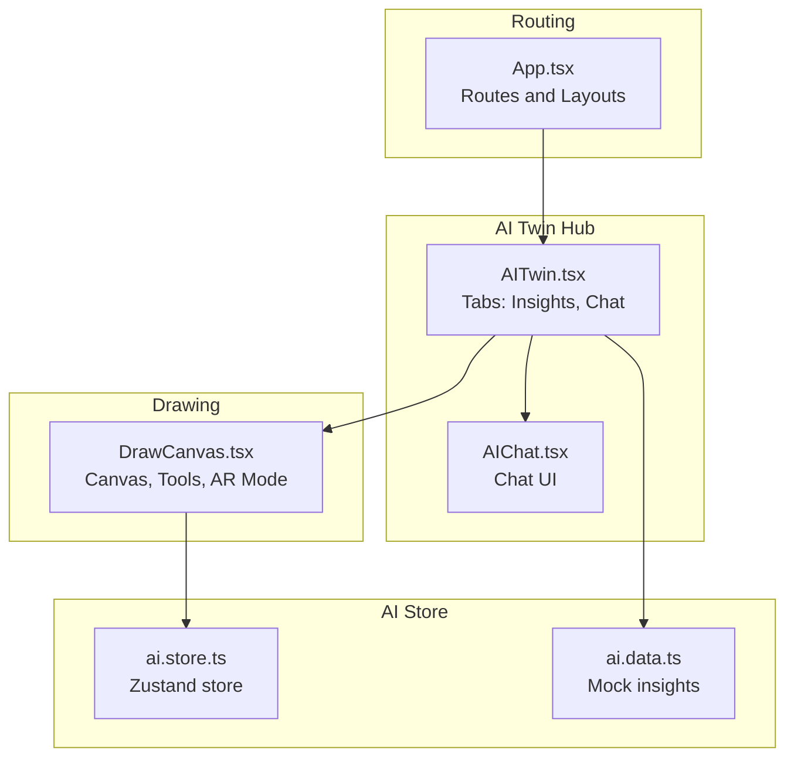
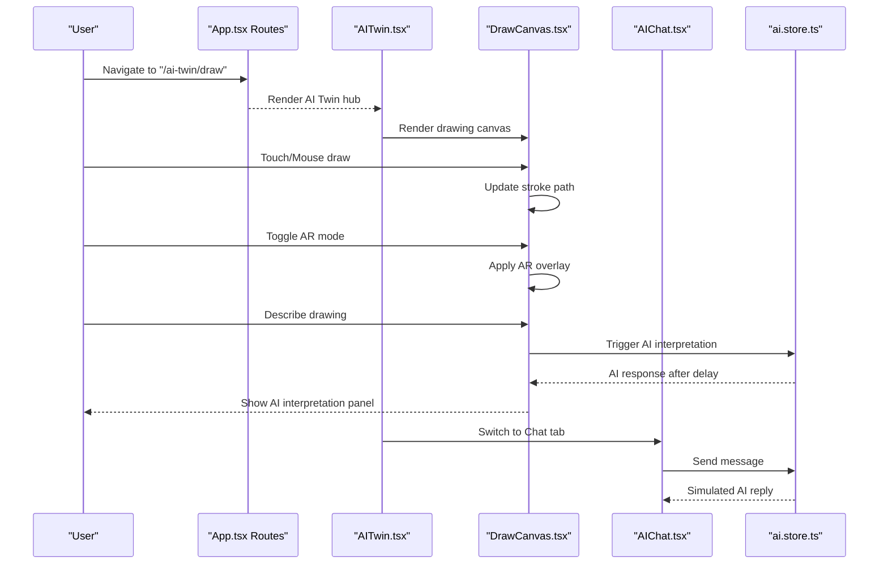
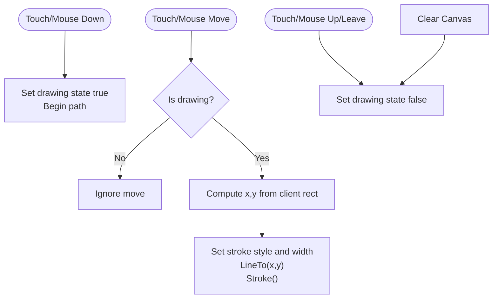
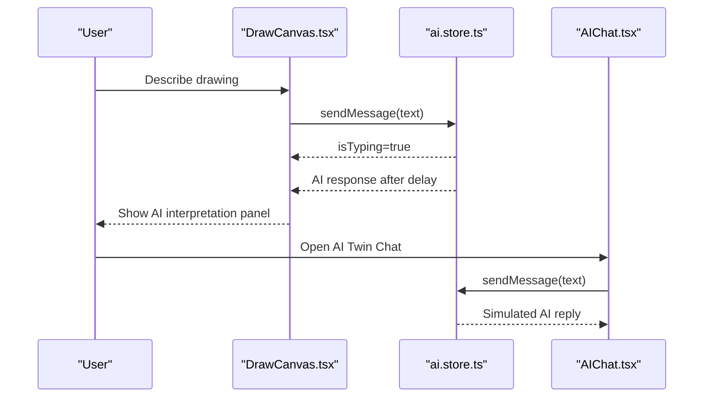
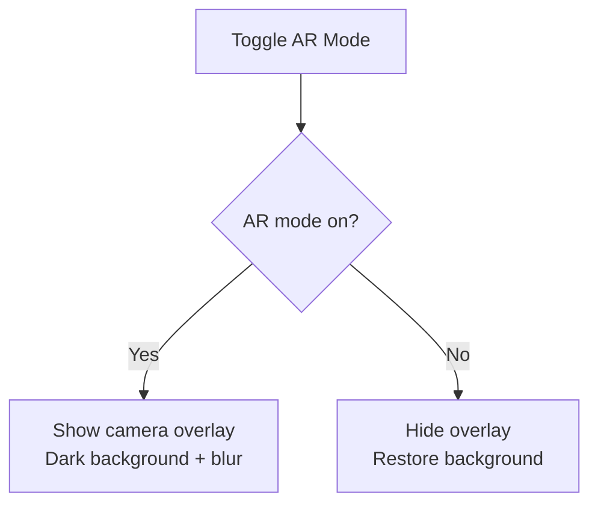
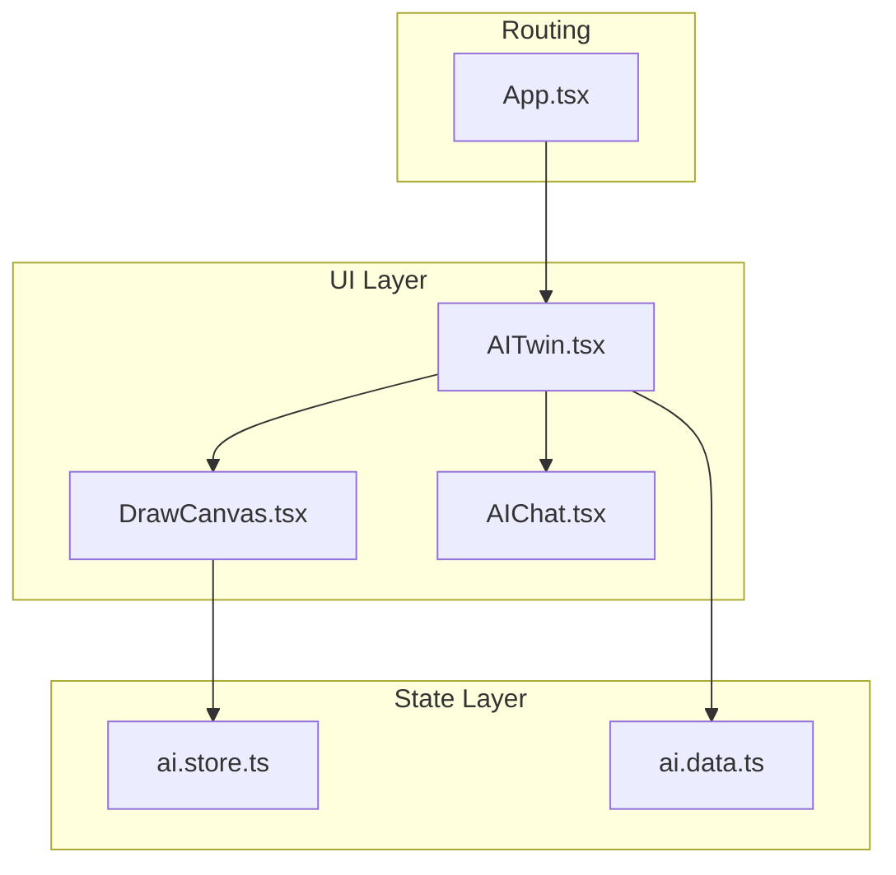
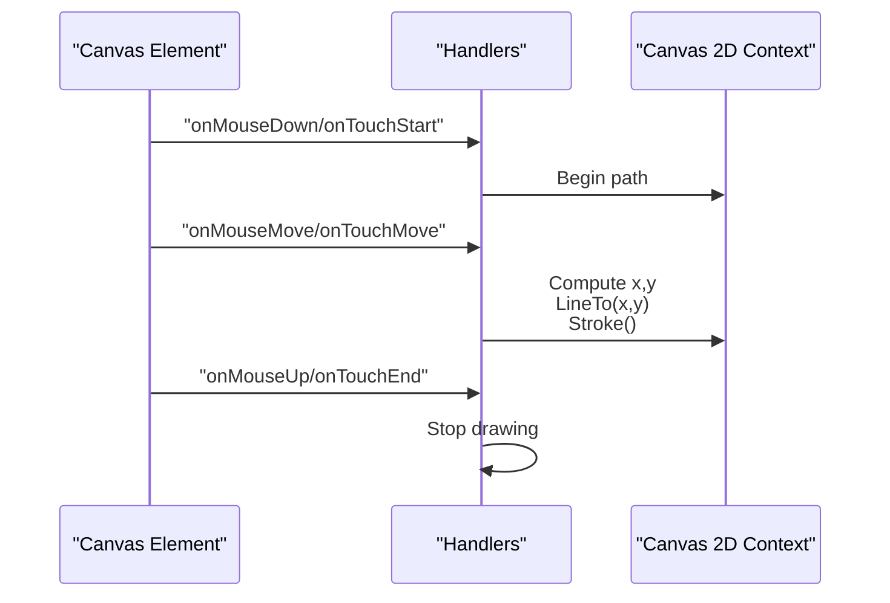
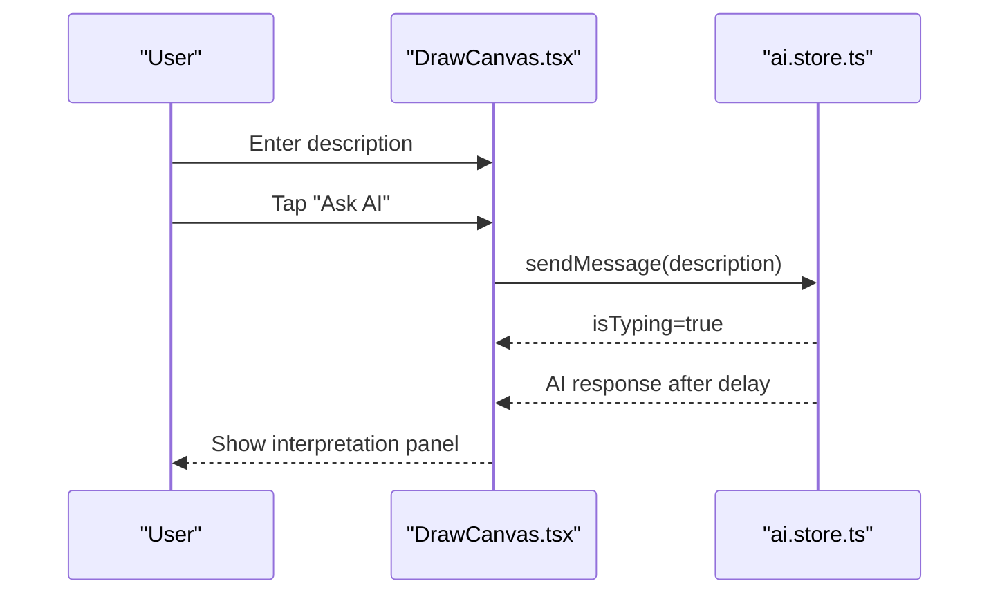
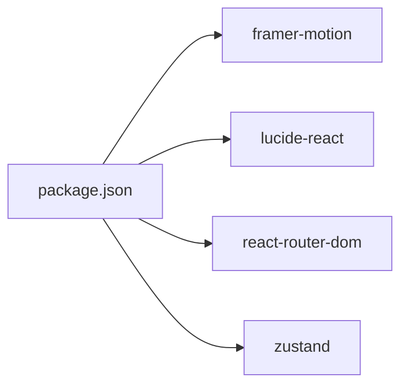

# AI Canvas and Drawing

<cite>
**Referenced Files in This Document**
- [DrawCanvas.tsx](file://src/pages/ai/DrawCanvas.tsx)
- [AIChat.tsx](file://src/pages/ai/AIChat.tsx)
- [AITwin.tsx](file://src/pages/AITwin.tsx)
- [ai.store.ts](file://src/store/ai.store.ts)
- [ai.data.ts](file://src/data/ai.data.ts)
- [App.tsx](file://src/App.tsx)
- [package.json](file://package.json)
</cite>

## Table of Contents
1. [Introduction](#introduction)
2. [Project Structure](#project-structure)
3. [Core Components](#core-components)
4. [Architecture Overview](#architecture-overview)
5. [Detailed Component Analysis](#detailed-component-analysis)
6. [Dependency Analysis](#dependency-analysis)
7. [Performance Considerations](#performance-considerations)
8. [Troubleshooting Guide](#troubleshooting-guide)
9. [Conclusion](#conclusion)
10. [Appendices](#appendices)

## Introduction
This document explains the AI canvas and drawing functionality, focusing on the drawing interface, color and brush controls, AI interpretation capabilities, and AR mode support. It documents the canvas component architecture covering touch and mouse interaction handling, drawing state management, and canvas rendering optimization. It also details the color palette system, brush size controls, and drawing tool selection interface, and outlines the AI interpretation features for analyzing drawn content, generating insights, and providing creative suggestions. The AR mode implementation for augmented reality drawing experiences is covered, including device orientation handling and spatial interaction patterns. Implementation examples for extending drawing capabilities, integrating with external drawing libraries, and optimizing canvas performance for large drawings are included, along with technical considerations for touch responsiveness, cross-device compatibility, and memory management for complex drawings. Finally, user experience patterns for creative expression, drawing collaboration, and accessing AI-generated interpretations of artwork are documented.

## Project Structure
The AI canvas and drawing feature is implemented as a dedicated immersive route within the application. The drawing page integrates with the AI Twin hub, which provides both insights and chat interfaces. The drawing canvas is rendered inside a route configured for immersive layouts, enabling full-screen drawing experiences.

**Diagram sources**
- [App.tsx:118-132](file://src/App.tsx#L118-L132)
- [AITwin.tsx:12-42](file://src/pages/AITwin.tsx#L12-L42)
- [AIChat.tsx:1-127](file://src/pages/ai/AIChat.tsx#L1-L127)
- [DrawCanvas.tsx:1-184](file://src/pages/ai/DrawCanvas.tsx#L1-L184)
- [ai.store.ts:113-162](file://src/store/ai.store.ts#L113-L162)
- [ai.data.ts:1-102](file://src/data/ai.data.ts#L1-L102)

**Section sources**
- [App.tsx:118-132](file://src/App.tsx#L118-L132)
- [App.tsx:20-21](file://src/App.tsx#L20-L21)
- [App.tsx:120](file://src/App.tsx#L120)

## Core Components
- DrawCanvas: Implements the drawing surface, touch/mouse handlers, drawing state, color and brush controls, AR mode toggle, and AI interpretation trigger.
- AIChat: Provides the conversational AI interface used within the AI Twin hub; supports suggestion pills and voice-like recording state.
- AITwin: Hosts the AI Twin hub with tabs for Insights and Chat; routes to the drawing canvas.
- ai.store: Zustand store managing AI chat messages, typing indicators, and simulated AI responses.
- ai.data: Mock datasets for AI insights and chat sequences.

Key responsibilities:
- DrawCanvas manages drawing state, renders strokes on a 2D canvas, and surfaces an AI interpretation panel.
- AIChat manages message history and simulated AI replies.
- AITwin orchestrates navigation and tab switching.
- ai.store persists chat history and simulates AI response timing.
- ai.data supplies mock content for insights and chat sequences.

**Section sources**
- [DrawCanvas.tsx:6-184](file://src/pages/ai/DrawCanvas.tsx#L6-L184)
- [AIChat.tsx:7-127](file://src/pages/ai/AIChat.tsx#L7-L127)
- [AITwin.tsx:8-135](file://src/pages/AITwin.tsx#L8-L135)
- [ai.store.ts:113-162](file://src/store/ai.store.ts#L113-L162)
- [ai.data.ts:1-102](file://src/data/ai.data.ts#L1-L102)

## Architecture Overview
The drawing experience is routed through an immersive layout and integrates with the AI Twin hub. The drawing dialog exposes a canvas, color palette, brush controls, and an AR mode toggle. When AI interpretation is requested, a panel slides up to present AI insights and actions. The AI Twin hub provides complementary AI chat and insights.

**Diagram sources**
- [App.tsx:118-132](file://src/App.tsx#L118-L132)
- [AITwin.tsx:12-42](file://src/pages/AITwin.tsx#L12-L42)
- [DrawCanvas.tsx:28-79](file://src/pages/ai/DrawCanvas.tsx#L28-L79)
- [AIChat.tsx:22-26](file://src/pages/ai/AIChat.tsx#L22-L26)
- [ai.store.ts:119-147](file://src/store/ai.store.ts#L119-L147)

## Detailed Component Analysis

### DrawCanvas Component
The drawing canvas component encapsulates:
- Canvas lifecycle initialization for 2D rendering.
- Touch and mouse event handlers for drawing gestures.
- Drawing state management (drawing flag, color, brush size).
- AR mode toggle and visual overlay.
- AI interpretation trigger and panel presentation.
- Tool controls: color palette, undo/redo affordances, clear canvas.

Canvas interaction flow:
- On start, begin a new path and set drawing state.
- During move, compute pointer position relative to canvas bounds and render a line segment.
- On end, clear drawing state.

AR mode:
- Toggling AR mode applies a semi-transparent overlay and adjusts background styling.

AI interpretation:
- A description field allows users to annotate their drawing.
- On request, a simulated AI response is shown in a slide-up panel.

**Diagram sources**
- [DrawCanvas.tsx:28-63](file://src/pages/ai/DrawCanvas.tsx#L28-L63)

**Section sources**
- [DrawCanvas.tsx:6-184](file://src/pages/ai/DrawCanvas.tsx#L6-L184)

### AI Interpretation and Chat Integration
The AI Twin hub integrates the drawing canvas with AI chat and insights:
- AITwin hosts tabs for Insights and Chat.
- AIChat manages message history, typing indicators, and simulated AI responses.
- ai.store persists messages and simulates AI replies with randomized delays.
- ai.data provides mock datasets for insights and chat sequences.

**Diagram sources**
- [DrawCanvas.tsx:74-79](file://src/pages/ai/DrawCanvas.tsx#L74-L79)
- [ai.store.ts:119-147](file://src/store/ai.store.ts#L119-L147)
- [AIChat.tsx:22-26](file://src/pages/ai/AIChat.tsx#L22-L26)

**Section sources**
- [AITwin.tsx:8-135](file://src/pages/AITwin.tsx#L8-L135)
- [AIChat.tsx:7-127](file://src/pages/ai/AIChat.tsx#L7-L127)
- [ai.store.ts:113-162](file://src/store/ai.store.ts#L113-L162)
- [ai.data.ts:1-102](file://src/data/ai.data.ts#L1-L102)

### AR Mode Support
AR mode is toggled via a dedicated control in the drawing header. When enabled, a semi-transparent overlay is displayed to indicate AR camera view, and the background styling adapts to a darker theme with blur effects.

**Diagram sources**
- [DrawCanvas.tsx:94-101](file://src/pages/ai/DrawCanvas.tsx#L94-L101)
- [DrawCanvas.tsx:104-109](file://src/pages/ai/DrawCanvas.tsx#L104-L109)

**Section sources**
- [DrawCanvas.tsx:94-109](file://src/pages/ai/DrawCanvas.tsx#L94-L109)

### Color Palette and Brush Controls
The drawing toolbar includes:
- Color palette: predefined color swatches with selection feedback.
- Brush controls: size adjustments and clear canvas action.
- Undo/redo affordances: placeholders for future enhancements.

Brush rendering:
- Stroke style and width are applied before drawing line segments.

**Section sources**
- [DrawCanvas.tsx:146-180](file://src/pages/ai/DrawCanvas.tsx#L146-L180)
- [DrawCanvas.tsx:57-60](file://src/pages/ai/DrawCanvas.tsx#L57-L60)

## Architecture Overview
The AI canvas feature is integrated into the application’s routing system and UI framework. The immersive layout ensures the drawing canvas occupies the viewport, while the AI Twin hub provides contextual AI services.

**Diagram sources**
- [App.tsx:118-132](file://src/App.tsx#L118-L132)
- [AITwin.tsx:12-42](file://src/pages/AITwin.tsx#L12-L42)
- [DrawCanvas.tsx:1-184](file://src/pages/ai/DrawCanvas.tsx#L1-L184)
- [ai.store.ts:113-162](file://src/store/ai.store.ts#L113-L162)
- [ai.data.ts:1-102](file://src/data/ai.data.ts#L1-L102)

## Detailed Component Analysis

### Canvas Interaction Handling
The component handles both mouse and touch events uniformly:
- Start: initialize drawing state and begin a new path.
- Move: compute pointer coordinates relative to the canvas and draw line segments.
- End: stop drawing and finalize the stroke.

Coordinate mapping:
- Uses the canvas bounding rectangle to convert client coordinates to canvas-relative positions.

**Diagram sources**
- [DrawCanvas.tsx:28-63](file://src/pages/ai/DrawCanvas.tsx#L28-L63)

**Section sources**
- [DrawCanvas.tsx:28-63](file://src/pages/ai/DrawCanvas.tsx#L28-L63)

### Drawing State Management
State variables manage:
- Drawing state to track active gesture.
- Selected color and brush size.
- Description text for AI interpretation.
- AR mode flag.
- AI response panel visibility.

State transitions:
- Start drawing sets the drawing flag.
- End drawing clears the drawing flag.
- Clear canvas resets the canvas and hides AI panel.

**Section sources**
- [DrawCanvas.tsx:10-16](file://src/pages/ai/DrawCanvas.tsx#L10-L16)
- [DrawCanvas.tsx:65-72](file://src/pages/ai/DrawCanvas.tsx#L65-L72)

### Rendering Optimization
Current optimizations:
- Line caps and joins are set once during initialization.
- Drawing occurs directly on the 2D context without intermediate buffers.

Potential improvements (implementation examples):
- Use requestAnimationFrame for smoother drawing loops.
- Implement path batching to reduce draw calls.
- Add offscreen canvas rendering for complex scenes.
- Employ WebGL for large-scale vector rendering.

**Section sources**
- [DrawCanvas.tsx:19-26](file://src/pages/ai/DrawCanvas.tsx#L19-L26)

### AI Interpretation Workflow
The AI interpretation panel appears after a user-triggered request:
- A description input allows contextual annotation.
- On submit, a simulated AI response is shown after a short delay.
- The panel includes actions to close or build the interpreted idea.

**Diagram sources**
- [DrawCanvas.tsx:74-79](file://src/pages/ai/DrawCanvas.tsx#L74-L79)
- [ai.store.ts:119-147](file://src/store/ai.store.ts#L119-L147)

**Section sources**
- [DrawCanvas.tsx:74-79](file://src/pages/ai/DrawCanvas.tsx#L74-L79)
- [ai.store.ts:119-147](file://src/store/ai.store.ts#L119-L147)

### AR Mode Interaction Patterns
AR mode toggling:
- A header control switches AR mode on/off.
- When enabled, a semi-transparent overlay indicates camera view.
- Background styling adapts to a dark theme with blur.

Spatial interaction:
- The overlay is designed to be pointer-events-none to avoid interfering with drawing.
- Adjustments to device orientation and spatial mapping are conceptual placeholders for future implementation.

**Section sources**
- [DrawCanvas.tsx:94-109](file://src/pages/ai/DrawCanvas.tsx#L94-L109)

## Dependency Analysis
External dependencies relevant to the drawing and AI features:
- Framer Motion: Animations for transitions and panels.
- Lucide React: Icons for UI controls.
- React Router DOM: Routing to the drawing canvas.
- Zustand: State management for AI chat.

**Diagram sources**
- [package.json:12-19](file://package.json#L12-L19)

**Section sources**
- [package.json:12-19](file://package.json#L12-L19)

## Performance Considerations
- Touch responsiveness:
  - Use passive event listeners for smooth scrolling and drawing.
  - Debounce or throttle high-frequency move events if needed.
- Cross-device compatibility:
  - Normalize pointer events to support both mouse and touch consistently.
  - Test coordinate mapping across devices with varying DPI and screen sizes.
- Memory management:
  - Avoid retaining large image/bitmaps in memory; clear canvases when not in use.
  - Consider implementing a history stack with limits for undo/redo.
- Rendering optimization:
  - Batch drawing operations and minimize context state changes.
  - For large drawings, consider virtualization or tiling strategies.

[No sources needed since this section provides general guidance]

## Troubleshooting Guide
Common issues and resolutions:
- Canvas not rendering:
  - Ensure the canvas element exists and the 2D context is available.
  - Verify that the canvas dimensions are set appropriately.
- Drawing not visible:
  - Confirm stroke style and width are applied before drawing.
  - Check that drawing state transitions occur on start/end events.
- AR overlay interfering with drawing:
  - Ensure the overlay is pointer-events-none and positioned absolutely behind drawing.
- AI panel not appearing:
  - Verify the AI interpretation trigger and simulated response logic.
  - Confirm the AI store is initialized and messages are persisted.

**Section sources**
- [DrawCanvas.tsx:19-26](file://src/pages/ai/DrawCanvas.tsx#L19-L26)
- [DrawCanvas.tsx:28-63](file://src/pages/ai/DrawCanvas.tsx#L28-L63)
- [DrawCanvas.tsx:74-79](file://src/pages/ai/DrawCanvas.tsx#L74-L79)
- [ai.store.ts:113-162](file://src/store/ai.store.ts#L113-L162)

## Conclusion
The AI canvas and drawing feature provides a modern, immersive drawing experience integrated with AI interpretation and AR mode support. The current implementation focuses on core drawing interactions, tool controls, and AI chat integration. Future enhancements can include advanced rendering optimizations, AR spatial mapping, and deeper AI interpretation capabilities.

[No sources needed since this section summarizes without analyzing specific files]

## Appendices

### Implementation Examples
- Extending drawing capabilities:
  - Add brush size presets and dynamic pressure sensitivity.
  - Integrate with external libraries for advanced vector editing.
- Optimizing canvas performance:
  - Implement offscreen rendering and path caching.
  - Use WebGL for large-scale vector graphics.
- Cross-device compatibility:
  - Normalize pointer events and handle orientation changes.
  - Test on tablets, phones, and desktops with stylus support.

[No sources needed since this section provides general guidance]