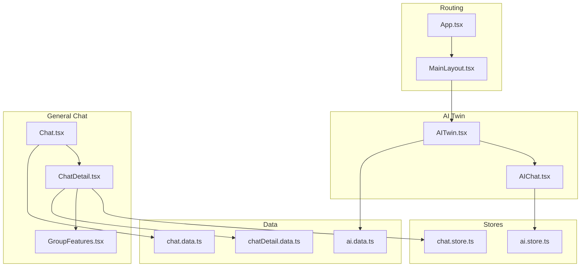
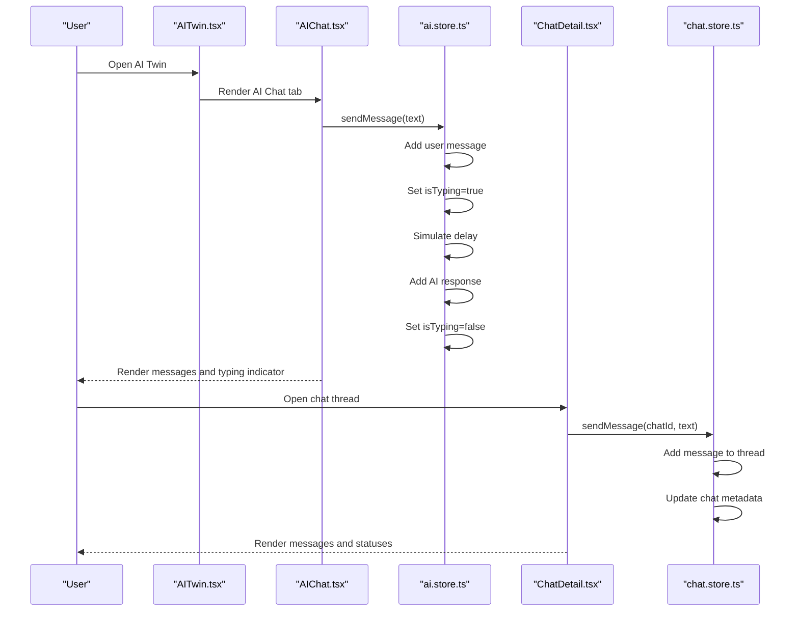
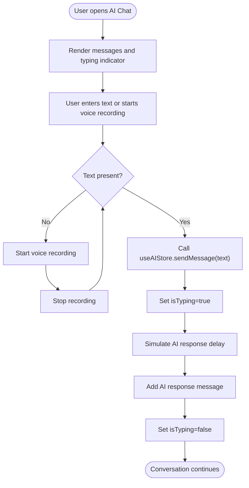
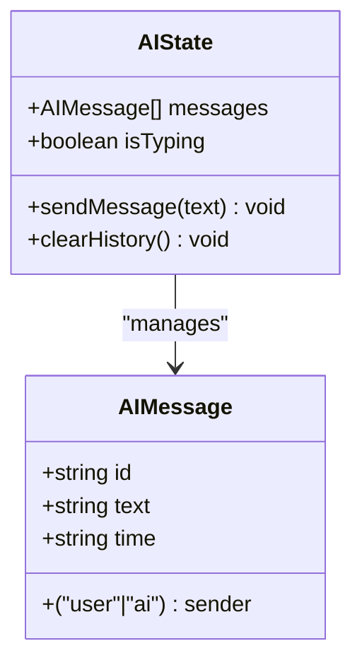
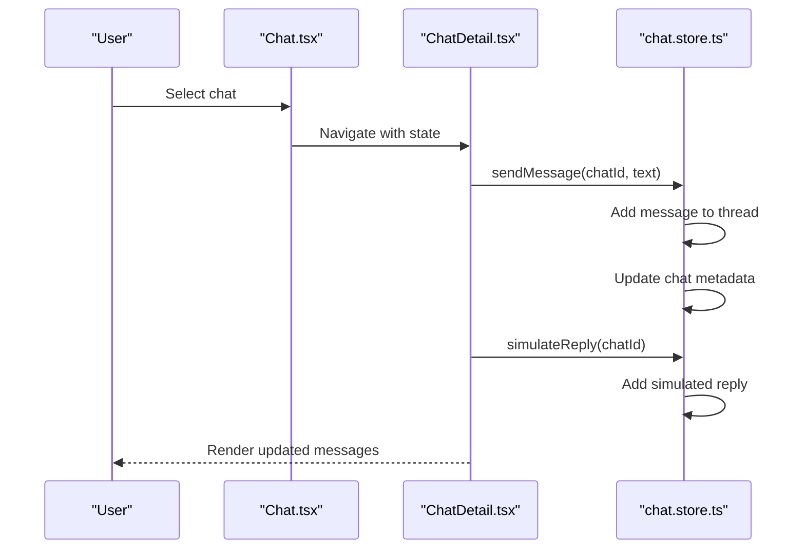
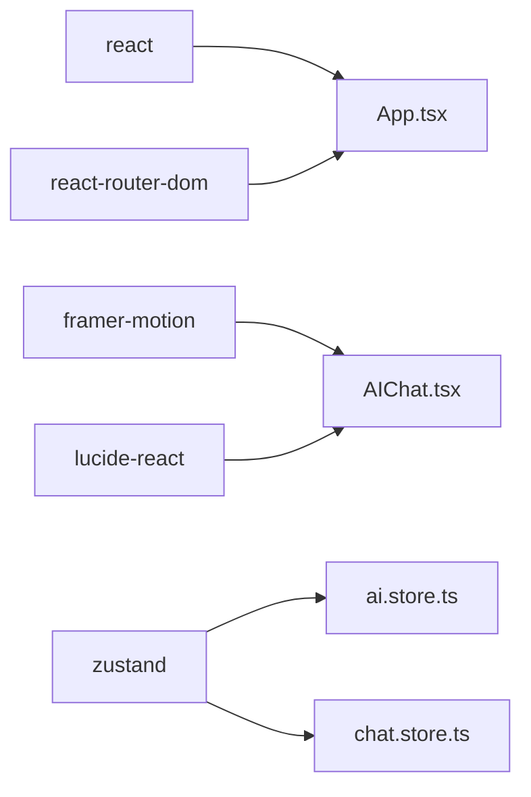

# AI Chat System

<cite>
**Referenced Files in This Document**
- [AIChat.tsx](file://src/pages/ai/AIChat.tsx)
- [ai.store.ts](file://src/store/ai.store.ts)
- [chat.store.ts](file://src/store/chat.store.ts)
- [chat.data.ts](file://src/data/chat.data.ts)
- [chatDetail.data.ts](file://src/data/chatDetail.data.ts)
- [Chat.tsx](file://src/pages/Chat.tsx)
- [ChatDetail.tsx](file://src/pages/ChatDetail.tsx)
- [AITwin.tsx](file://src/pages/AITwin.tsx)
- [ai.data.ts](file://src/data/ai.data.ts)
- [App.tsx](file://src/App.tsx)
- [MainLayout.tsx](file://src/components/layouts/MainLayout.tsx)
- [GroupFeatures.tsx](file://src/components/GroupFeatures.tsx)
- [package.json](file://package.json)
</cite>

## Table of Contents
1. [Introduction](#introduction)
2. [Project Structure](#project-structure)
3. [Core Components](#core-components)
4. [Architecture Overview](#architecture-overview)
5. [Detailed Component Analysis](#detailed-component-analysis)
6. [Dependency Analysis](#dependency-analysis)
7. [Performance Considerations](#performance-considerations)
8. [Troubleshooting Guide](#troubleshooting-guide)
9. [Conclusion](#conclusion)
10. [Appendices](#appendices)

## Introduction
This document describes the AI chat system implementation, focusing on the AI Twin chat interface, message processing, response generation, and suggestion system. It explains the chat component architecture including message rendering, typing indicators, and conversation flow management. It also covers the AI store integration for maintaining conversation history, managing message states, and coordinating with external AI services. The document details the message processing pipeline including input validation, prompt formatting, response parsing, and error handling. It covers the suggestion system for contextually relevant prompts and conversation starters, and provides implementation examples for extending conversation capabilities, integrating with different AI models, and handling various message types (text, images, voice). Finally, it addresses performance considerations for real-time chat, memory management for long conversations, and optimization techniques for AI response latency, along with user experience patterns for initiating conversations, managing conversation threads, and accessing chat history.

## Project Structure
The AI chat system spans several pages and stores:
- AI Twin page hosts the AI chat interface and insights.
- AI chat page renders the conversation UI, handles user input, and displays typing indicators.
- Stores manage state for AI chat and general chat threads.
- Data modules provide mock datasets for chats, messages, and AI insights.
- Routing integrates the chat flows into the app’s navigation.

**Diagram sources**
- [App.tsx:135-156](file://src/App.tsx#L135-L156)
- [MainLayout.tsx:7-30](file://src/components/layouts/MainLayout.tsx#L7-L30)
- [AITwin.tsx:8-135](file://src/pages/AITwin.tsx#L8-L135)
- [AIChat.tsx:7-127](file://src/pages/ai/AIChat.tsx#L7-L127)
- [ai.store.ts:113-162](file://src/store/ai.store.ts#L113-L162)
- [chat.store.ts:171-330](file://src/store/chat.store.ts#L171-L330)
- [ai.data.ts:1-102](file://src/data/ai.data.ts#L1-L102)
- [chat.data.ts:1-134](file://src/data/chat.data.ts#L1-L134)
- [chatDetail.data.ts:1-71](file://src/data/chatDetail.data.ts#L1-L71)
- [Chat.tsx:65-245](file://src/pages/Chat.tsx#L65-L245)
- [ChatDetail.tsx:9-332](file://src/pages/ChatDetail.tsx#L9-L332)
- [GroupFeatures.tsx:14-154](file://src/components/GroupFeatures.tsx#L14-L154)

**Section sources**
- [App.tsx:135-156](file://src/App.tsx#L135-L156)
- [MainLayout.tsx:7-30](file://src/components/layouts/MainLayout.tsx#L7-L30)
- [AITwin.tsx:8-135](file://src/pages/AITwin.tsx#L8-L135)
- [AIChat.tsx:7-127](file://src/pages/ai/AIChat.tsx#L7-L127)
- [ai.store.ts:113-162](file://src/store/ai.store.ts#L113-L162)
- [chat.store.ts:171-330](file://src/store/chat.store.ts#L171-L330)
- [ai.data.ts:1-102](file://src/data/ai.data.ts#L1-L102)
- [chat.data.ts:1-134](file://src/data/chat.data.ts#L1-L134)
- [chatDetail.data.ts:1-71](file://src/data/chatDetail.data.ts#L1-L71)
- [Chat.tsx:65-245](file://src/pages/Chat.tsx#L65-L245)
- [ChatDetail.tsx:9-332](file://src/pages/ChatDetail.tsx#L9-L332)
- [GroupFeatures.tsx:14-154](file://src/components/GroupFeatures.tsx#L14-L154)

## Core Components
- AI Twin page orchestrates tabs for Insights and Chat, embedding the AI chat UI.
- AI chat page renders messages, typing indicators, suggestion pills, and input controls.
- AI store manages conversation history, typing state, and simulated AI responses.
- General chat pages manage DM/group/space conversations, message types, and statuses.
- Data modules provide mock datasets for chats, messages, and AI insights.

Key responsibilities:
- Conversation interface: render messages, handle user input, show typing indicators, and manage suggestion pills.
- Message processing: validate input, simulate AI response timing, and update message state.
- Suggestion system: contextually relevant prompts and conversation starters.
- Store integration: maintain history, manage states, and coordinate with external AI services.

**Section sources**
- [AITwin.tsx:8-135](file://src/pages/AITwin.tsx#L8-L135)
- [AIChat.tsx:7-127](file://src/pages/ai/AIChat.tsx#L7-L127)
- [ai.store.ts:113-162](file://src/store/ai.store.ts#L113-L162)
- [chat.store.ts:171-330](file://src/store/chat.store.ts#L171-L330)
- [ai.data.ts:1-102](file://src/data/ai.data.ts#L1-L102)
- [chat.data.ts:1-134](file://src/data/chat.data.ts#L1-L134)
- [chatDetail.data.ts:1-71](file://src/data/chatDetail.data.ts#L1-L71)

## Architecture Overview
The AI chat system is composed of:
- UI pages for AI Twin and AI chat.
- Zustand stores for AI chat and general chat.
- Data modules for mock datasets.
- Routing and layout components.

**Diagram sources**
- [AITwin.tsx:8-135](file://src/pages/AITwin.tsx#L8-L135)
- [AIChat.tsx:7-127](file://src/pages/ai/AIChat.tsx#L7-L127)
- [ai.store.ts:119-148](file://src/store/ai.store.ts#L119-L148)
- [ChatDetail.tsx:302-316](file://src/pages/ChatDetail.tsx#L302-L316)
- [chat.store.ts:179-200](file://src/store/chat.store.ts#L179-L200)

## Detailed Component Analysis

### AI Chat Page
The AI chat page renders the conversation UI, handles user input, and displays typing indicators. It integrates with the AI store to manage messages and typing state.

Key behaviors:
- Scroll to bottom on new messages or typing indicator.
- Send text messages via button or voice input.
- Display typing indicator with animated dots.
- Show suggestion pills for first few messages.

**Diagram sources**
- [AIChat.tsx:14-26](file://src/pages/ai/AIChat.tsx#L14-L26)
- [AIChat.tsx:51-65](file://src/pages/ai/AIChat.tsx#L51-L65)
- [AIChat.tsx:73-81](file://src/pages/ai/AIChat.tsx#L73-L81)
- [ai.store.ts:119-148](file://src/store/ai.store.ts#L119-L148)

**Section sources**
- [AIChat.tsx:7-127](file://src/pages/ai/AIChat.tsx#L7-L127)
- [ai.store.ts:113-162](file://src/store/ai.store.ts#L113-L162)

### AI Store
The AI store manages the AI chat conversation state, including messages and typing indicator. It simulates AI responses based on keyword matching and introduces randomized delays.

Key responsibilities:
- Define message model with id, text, sender, and time.
- Initialize with seed messages for demo.
- Implement sendMessage with user message addition and AI response simulation.
- Provide clearHistory to reset to seed messages.
- Persist state to storage.

**Diagram sources**
- [ai.store.ts:4-17](file://src/store/ai.store.ts#L4-L17)
- [ai.store.ts:113-162](file://src/store/ai.store.ts#L113-L162)

**Section sources**
- [ai.store.ts:113-162](file://src/store/ai.store.ts#L113-L162)

### General Chat Pages and Stores
The general chat system supports DMs, groups, and spaces with richer message types (text, voice) and delivery/read statuses.

Key responsibilities:
- Chat list filters and search.
- Chat detail rendering with date dividers, translations, and voice playback.
- Message sending and simulated replies.
- Group features modal for contextual actions.

**Diagram sources**
- [Chat.tsx:65-92](file://src/pages/Chat.tsx#L65-L92)
- [ChatDetail.tsx:302-316](file://src/pages/ChatDetail.tsx#L302-L316)
- [chat.store.ts:179-200](file://src/store/chat.store.ts#L179-L200)
- [chat.store.ts:288-318](file://src/store/chat.store.ts#L288-L318)

**Section sources**
- [Chat.tsx:65-245](file://src/pages/Chat.tsx#L65-L245)
- [ChatDetail.tsx:9-332](file://src/pages/ChatDetail.tsx#L9-L332)
- [chat.store.ts:171-330](file://src/store/chat.store.ts#L171-L330)
- [chat.data.ts:1-134](file://src/data/chat.data.ts#L1-L134)
- [chatDetail.data.ts:1-71](file://src/data/chatDetail.data.ts#L1-L71)

### Suggestion System
The AI chat page shows suggestion pills for first few messages to guide user prompts. The AI Twin page surfaces insights and suggestions for broader context.

Implementation highlights:
- Suggestion pills appear only when the conversation is short and input is empty.
- AI Twin insights include urgent items, today’s tasks, suggestions, and summaries.

**Section sources**
- [AIChat.tsx:73-81](file://src/pages/ai/AIChat.tsx#L73-L81)
- [ai.data.ts:1-102](file://src/data/ai.data.ts#L1-L102)

### Message Types and Rendering
The general chat supports text and voice messages with delivery/read statuses and optional translations/transcriptions.

Rendering features:
- Text messages with timestamps and status icons.
- Voice messages with animated waveform and duration.
- Translation banner and toggling for non-group chats.
- Date dividers and online presence indicators.

**Section sources**
- [ChatDetail.tsx:155-263](file://src/pages/ChatDetail.tsx#L155-L263)
- [chat.store.ts:9-22](file://src/store/chat.store.ts#L9-L22)
- [chatDetail.data.ts:18-71](file://src/data/chatDetail.data.ts#L18-L71)

## Dependency Analysis
External dependencies include React, React Router, Framer Motion, Lucide icons, and Zustand for state management.

**Diagram sources**
- [package.json:12-19](file://package.json#L12-L19)
- [App.tsx:1-156](file://src/App.tsx#L1-L156)
- [AIChat.tsx:1-127](file://src/pages/ai/AIChat.tsx#L1-L127)
- [ai.store.ts:1-162](file://src/store/ai.store.ts#L1-L162)
- [chat.store.ts:1-330](file://src/store/chat.store.ts#L1-L330)

**Section sources**
- [package.json:12-19](file://package.json#L12-L19)
- [App.tsx:1-156](file://src/App.tsx#L1-L156)

## Performance Considerations
- Virtualization: For long conversations, consider virtualized lists to reduce DOM nodes.
- Debounced input: Debounce text input to limit frequent re-renders.
- Memoization: Use memoization for expensive computations in message rendering.
- Lazy loading: Lazy-load heavy components like drawing canvas.
- Storage persistence: Persist only necessary state to minimize storage overhead.
- Animation throttling: Limit animation complexity for low-end devices.
- Network optimization: Introduce caching and request batching for AI service integrations.

[No sources needed since this section provides general guidance]

## Troubleshooting Guide
Common issues and resolutions:
- Messages not appearing: Verify store subscription and ensure messages array updates trigger re-render.
- Typing indicator stuck: Confirm isTyping is reset after AI response.
- Input not clearing: Ensure setInputText is called after send.
- Voice recording state: Validate pointer events for start/stop conditions.
- Chat detail not updating: Confirm chatId routing and store updates.

**Section sources**
- [AIChat.tsx:14-26](file://src/pages/ai/AIChat.tsx#L14-L26)
- [AIChat.tsx:51-65](file://src/pages/ai/AIChat.tsx#L51-L65)
- [ai.store.ts:119-148](file://src/store/ai.store.ts#L119-L148)
- [ChatDetail.tsx:302-316](file://src/pages/ChatDetail.tsx#L302-L316)
- [chat.store.ts:179-200](file://src/store/chat.store.ts#L179-L200)

## Conclusion
The AI chat system provides a responsive, animated chat interface integrated with a simulated AI response mechanism and a robust general chat system for DMs, groups, and spaces. The architecture leverages Zustand for state management, React Router for navigation, and Framer Motion for smooth animations. The suggestion system and insights enhance user engagement. Extending the system involves integrating real AI services, adding new message types, and optimizing performance for long conversations.

[No sources needed since this section summarizes without analyzing specific files]

## Appendices

### Implementation Examples

- Extending conversation capabilities:
  - Add image upload handling in the AI chat input area and map to AIMessage with appropriate sender and time fields.
  - Extend AI response simulation to include multimodal responses (e.g., summarizing images).

- Integrating with different AI models:
  - Replace the simulateAIResponse function with an API call to an external AI service endpoint.
  - Manage streaming responses and update isTyping accordingly.

- Handling various message types:
  - For voice messages, integrate audio recording and playback UI similar to the general chat’s voice rendering.
  - For translated messages, mirror the translation banner and toggle logic used in ChatDetail.

- Managing long conversations:
  - Implement pagination or virtualized lists to limit DOM nodes.
  - Persist only recent N messages and prune older entries.

- Optimizing AI response latency:
  - Use request debouncing and caching for repeated prompts.
  - Preload frequently used responses and cache them locally.

[No sources needed since this section provides general guidance]