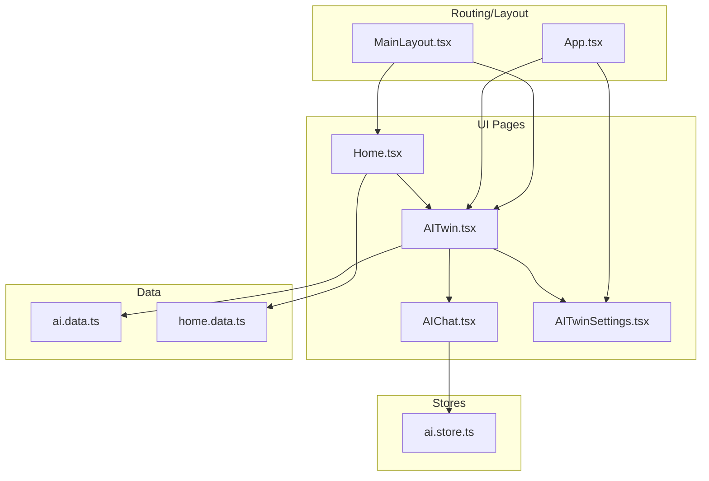
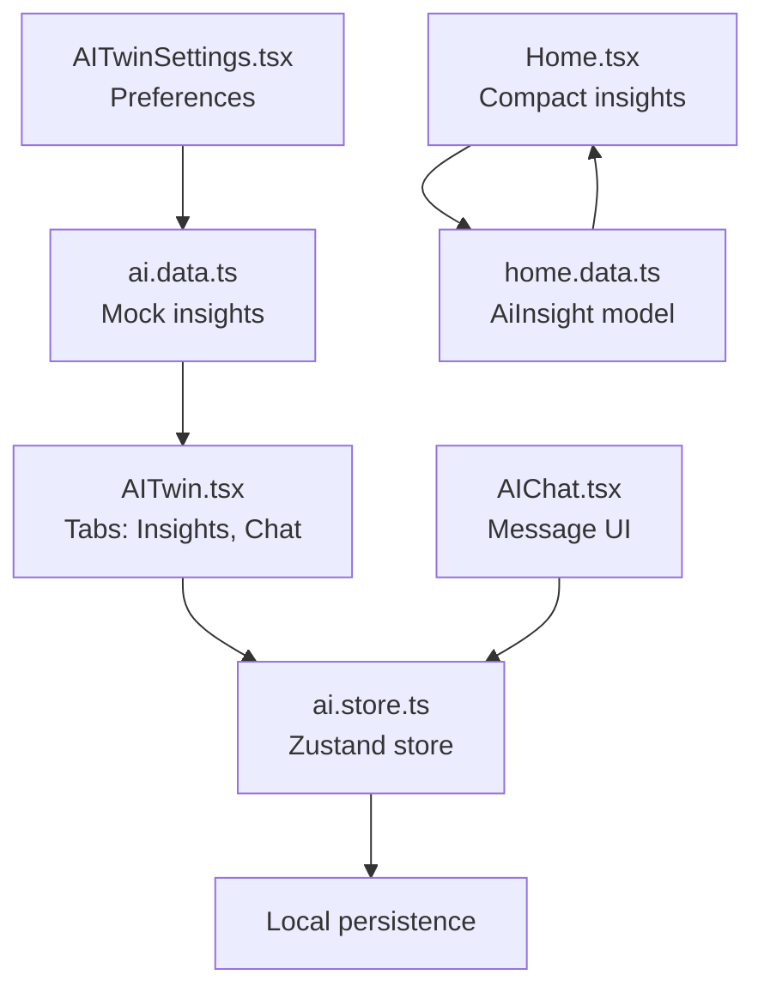
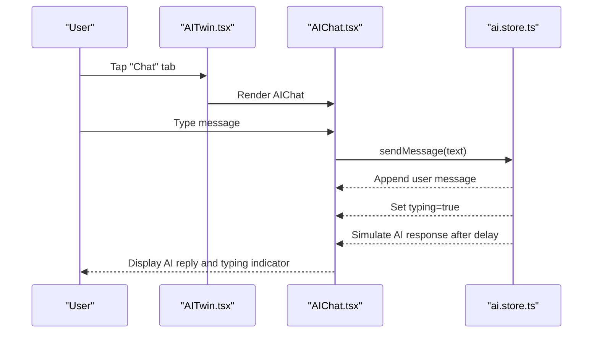
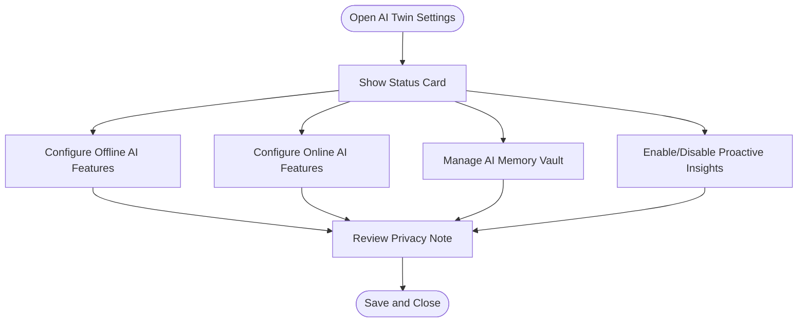
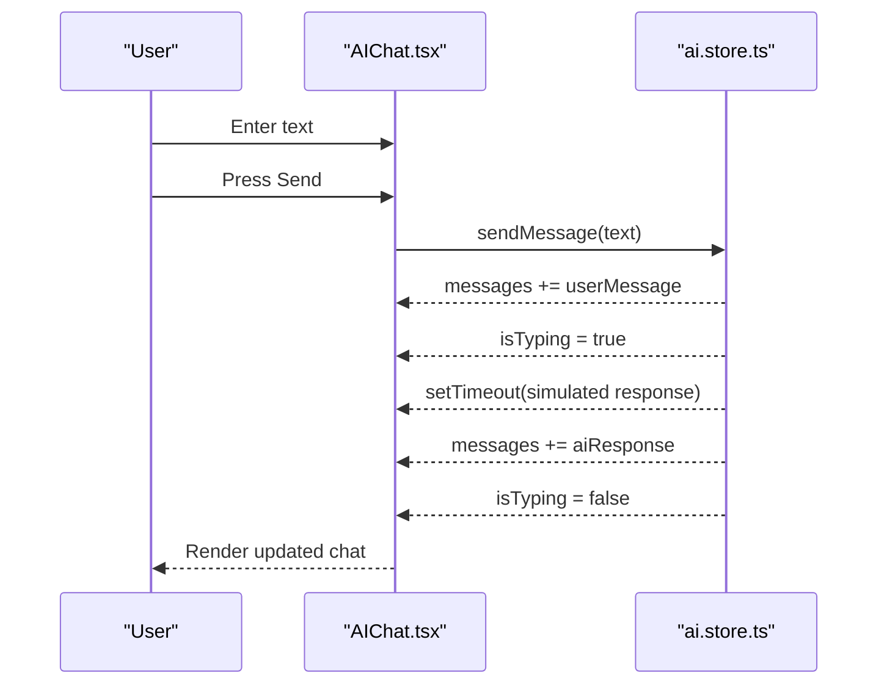
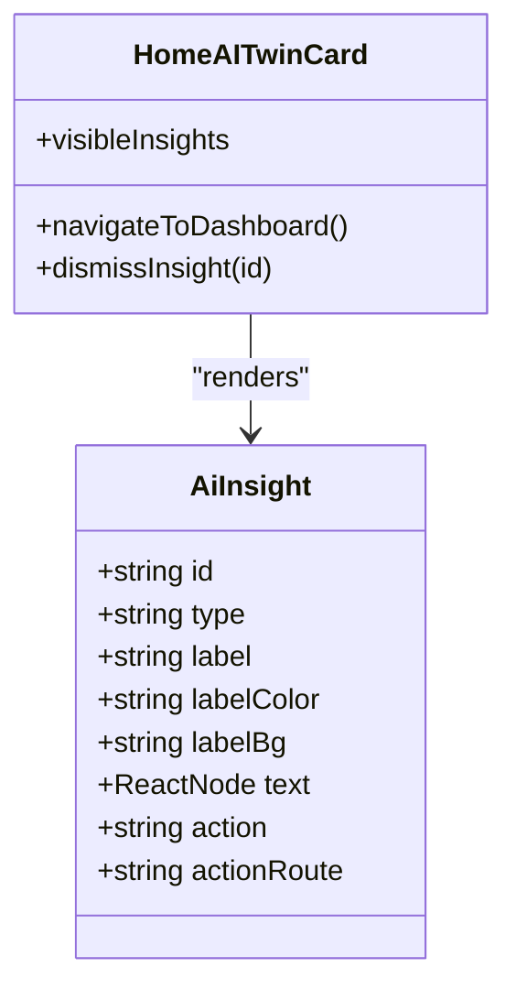
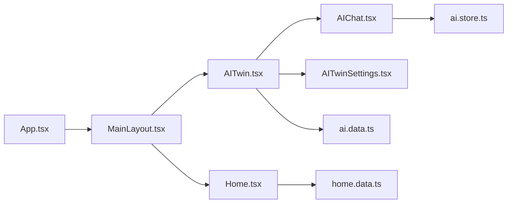

# AI Twin Dashboard

<cite>
**Referenced Files in This Document**
- [AITwin.tsx](file://src/pages/AITwin.tsx)
- [AIChat.tsx](file://src/pages/ai/AIChat.tsx)
- [AITwinSettings.tsx](file://src/pages/profile/AITwinSettings.tsx)
- [ai.store.ts](file://src/store/ai.store.ts)
- [ai.data.ts](file://src/data/ai.data.ts)
- [home.data.ts](file://src/data/home.data.ts)
- [Home.tsx](file://src/pages/Home.tsx)
- [MainLayout.tsx](file://src/components/layouts/MainLayout.tsx)
- [App.tsx](file://src/App.tsx)
</cite>

## Table of Contents
1. [Introduction](#introduction)
2. [Project Structure](#project-structure)
3. [Core Components](#core-components)
4. [Architecture Overview](#architecture-overview)
5. [Detailed Component Analysis](#detailed-component-analysis)
6. [Dependency Analysis](#dependency-analysis)
7. [Performance Considerations](#performance-considerations)
8. [Troubleshooting Guide](#troubleshooting-guide)
9. [Conclusion](#conclusion)
10. [Appendices](#appendices)

## Introduction
This document describes the AI Twin dashboard interface and settings management system. It explains the dashboard layout that surfaces intelligent insights, personalized recommendations, and status indicators; documents the AI Twin settings component for configuration and preferences; and details the integration between the dashboard and AI store for real-time insight updates and conversation history display. It also covers the settings panel functionality for managing AI preferences, notifications, and privacy controls, and provides implementation examples for extending the system with new insight types, recommendation algorithms, and custom layouts. Finally, it addresses performance optimization strategies for loading insights, handling offline scenarios, and managing large conversation histories, along with user experience patterns for accessing AI insights, filtering recommendations, and navigating between AI features.

## Project Structure
The AI Twin feature spans several UI pages, stores, and data modules:
- Dashboard page: AITwin.tsx renders the insights and chat tabs, with navigation to settings.
- AI Chat: AIChat.tsx manages the conversational UI and integrates with the AI store.
- Settings: AITwinSettings.tsx provides configuration toggles for offline/online capabilities, proactive insights, and memory vault.
- Stores: ai.store.ts encapsulates AI chat state and simulated responses.
- Data: ai.data.ts supplies mock insights and chat sequences; home.data.ts defines AI insights model used on the Home page.
- Home integration: Home.tsx displays a compact AI Twin card with dismissible insights and navigates to the full dashboard.
- Layout and routing: MainLayout.tsx provides the app shell; App.tsx wires routes including the AI Twin settings page.

**Diagram sources**
- [AITwin.tsx:1-135](file://src/pages/AITwin.tsx#L1-L135)
- [AIChat.tsx:1-127](file://src/pages/ai/AIChat.tsx#L1-L127)
- [AITwinSettings.tsx:1-128](file://src/pages/profile/AITwinSettings.tsx#L1-L128)
- [ai.store.ts:1-162](file://src/store/ai.store.ts#L1-L162)
- [ai.data.ts:1-102](file://src/data/ai.data.ts#L1-L102)
- [home.data.ts:1-104](file://src/data/home.data.ts#L1-L104)
- [Home.tsx:1-295](file://src/pages/Home.tsx#L1-L295)
- [MainLayout.tsx:1-30](file://src/components/layouts/MainLayout.tsx#L1-L30)
- [App.tsx](file://src/App.tsx)

**Section sources**
- [AITwin.tsx:1-135](file://src/pages/AITwin.tsx#L1-L135)
- [AIChat.tsx:1-127](file://src/pages/ai/AIChat.tsx#L1-L127)
- [AITwinSettings.tsx:1-128](file://src/pages/profile/AITwinSettings.tsx#L1-L128)
- [ai.store.ts:1-162](file://src/store/ai.store.ts#L1-L162)
- [ai.data.ts:1-102](file://src/data/ai.data.ts#L1-L102)
- [home.data.ts:1-104](file://src/data/home.data.ts#L1-L104)
- [Home.tsx:1-295](file://src/pages/Home.tsx#L1-L295)
- [MainLayout.tsx:1-30](file://src/components/layouts/MainLayout.tsx#L1-L30)
- [App.tsx](file://src/App.tsx)

## Core Components
- AI Twin Dashboard (AITwin.tsx)
  - Renders two tabs: Insights and Chat.
  - Displays categorized insights (Urgent, Today, Suggestions, Summaries) using mock data.
  - Provides navigation to AI Twin settings.
- AI Chat (AIChat.tsx)
  - Manages message composition, sending, and display.
  - Shows typing indicators and suggestion pills for quick prompts.
  - Integrates with the AI store for message history and simulated responses.
- AI Twin Settings (AITwinSettings.tsx)
  - Presents status card, offline AI capabilities, online AI capabilities, AI Memory Vault, and proactive insights toggles.
  - Includes a privacy note emphasizing end-to-end encryption and offline-first processing.
- AI Store (ai.store.ts)
  - Maintains messages and typing state.
  - Implements simulated AI responses based on keyword matching.
  - Persists chat history locally.
- Mock Data (ai.data.ts)
  - Supplies mock insights and seeded chat sequences for demonstration.
- Home Integration (Home.tsx, home.data.ts)
  - Displays a compact AI Twin card with dismissible insights and live status.
  - Uses the AI insights model to render actionable items.

**Section sources**
- [AITwin.tsx:8-135](file://src/pages/AITwin.tsx#L8-L135)
- [AIChat.tsx:7-127](file://src/pages/ai/AIChat.tsx#L7-L127)
- [AITwinSettings.tsx:7-128](file://src/pages/profile/AITwinSettings.tsx#L7-L128)
- [ai.store.ts:11-162](file://src/store/ai.store.ts#L11-L162)
- [ai.data.ts:1-102](file://src/data/ai.data.ts#L1-L102)
- [home.data.ts:19-104](file://src/data/home.data.ts#L19-L104)
- [Home.tsx:64-125](file://src/pages/Home.tsx#L64-L125)

## Architecture Overview
The AI Twin system follows a layered pattern:
- UI Layer: Pages and components render views and collect user interactions.
- Store Layer: Zustand stores manage state for chat and persistence.
- Data Layer: Mock datasets provide static content for insights and chat sequences.
- Routing/Layout: App routes and layout components orchestrate navigation and presentation.

**Diagram sources**
- [AITwin.tsx:1-135](file://src/pages/AITwin.tsx#L1-L135)
- [AIChat.tsx:1-127](file://src/pages/ai/AIChat.tsx#L1-L127)
- [AITwinSettings.tsx:1-128](file://src/pages/profile/AITwinSettings.tsx#L1-L128)
- [ai.store.ts:1-162](file://src/store/ai.store.ts#L1-L162)
- [ai.data.ts:1-102](file://src/data/ai.data.ts#L1-L102)
- [home.data.ts:19-104](file://src/data/home.data.ts#L19-L104)
- [Home.tsx:64-125](file://src/pages/Home.tsx#L64-L125)

## Detailed Component Analysis

### AI Twin Dashboard (AITwin.tsx)
- Layout and Navigation
  - Header with back button, title, status indicator, and settings icon.
  - Tabbed interface switching between Insights and Chat.
- Insights Rendering
  - Urgent, Today, Suggestions, and Summaries sections styled with distinct categories.
  - Action buttons per item to trigger navigation or actions.
- Chat Integration
  - Animated transition between Insights and Chat views.
  - Embeds AIChat component for conversational UI.

**Diagram sources**
- [AITwin.tsx:44-131](file://src/pages/AITwin.tsx#L44-L131)
- [AIChat.tsx:22-65](file://src/pages/ai/AIChat.tsx#L22-L65)
- [ai.store.ts:119-148](file://src/store/ai.store.ts#L119-L148)

**Section sources**
- [AITwin.tsx:8-135](file://src/pages/AITwin.tsx#L8-L135)
- [AIChat.tsx:7-127](file://src/pages/ai/AIChat.tsx#L7-L127)
- [ai.store.ts:113-162](file://src/store/ai.store.ts#L113-L162)

### AI Twin Settings (AITwinSettings.tsx)
- Status Card
  - Highlights AI Twin activation, learning period, and total insights count.
- Offline AI Capabilities
  - Toggles for Personal Memory, Smart Replies, File Intelligence, and Translation.
- Online AI Capabilities
  - Toggles for Internet Queries and Fact Checking.
- AI Memory Vault
  - Lists remembered items; includes an action to add more memories.
- Proactive Insights
  - Toggles for Bill Alerts, Birthday Reminders, Group Digests, Spending Analysis, and Reconnect Suggestions.
- Privacy Note
  - Emphasizes end-to-end encryption and offline-first processing.

**Diagram sources**
- [AITwinSettings.tsx:30-124](file://src/pages/profile/AITwinSettings.tsx#L30-L124)

**Section sources**
- [AITwinSettings.tsx:7-128](file://src/pages/profile/AITwinSettings.tsx#L7-L128)

### AI Chat (AIChat.tsx)
- Message Composition
  - Text input and voice recording toggle.
  - Suggestion pills appear when conversation is fresh.
- Message Display
  - Different styling for user and AI messages.
  - Typing indicators with animated dots.
- Integration with AI Store
  - Uses sendMessage to append user messages and trigger simulated AI responses.
  - Auto-scrolls to latest message.

**Diagram sources**
- [AIChat.tsx:22-65](file://src/pages/ai/AIChat.tsx#L22-L65)
- [ai.store.ts:119-148](file://src/store/ai.store.ts#L119-L148)

**Section sources**
- [AIChat.tsx:7-127](file://src/pages/ai/AIChat.tsx#L7-L127)
- [ai.store.ts:113-162](file://src/store/ai.store.ts#L113-L162)

### Home Integration (Home.tsx and home.data.ts)
- AI Twin Card
  - Displays live status and a list of visible insights.
  - Each insight includes a dismiss action and a route to take action.
- AI Insights Model
  - Defines the shape of insights: type, label, colors, text, action, and actionRoute.
- Navigation
  - Clicking the card navigates to the full AI Twin dashboard.

**Diagram sources**
- [home.data.ts:19-28](file://src/data/home.data.ts#L19-L28)
- [Home.tsx:64-125](file://src/pages/Home.tsx#L64-L125)

**Section sources**
- [Home.tsx:64-125](file://src/pages/Home.tsx#L64-L125)
- [home.data.ts:72-104](file://src/data/home.data.ts#L72-L104)

## Dependency Analysis
- Routing and Layout
  - App.tsx registers routes for AI Twin settings and wraps pages in MainLayout.tsx.
  - MainLayout.tsx provides the outlet for page rendering and bottom navigation.
- Dashboard to Settings
  - AITwin.tsx links to settings via navigation; AITwinSettings.tsx is rendered within the same layout context.
- Data Dependencies
  - AITwin.tsx consumes mock insights from ai.data.ts.
  - Home.tsx consumes AiInsight model and visible insights from home.data.ts and Home store.
- State Dependencies
  - AIChat.tsx depends on ai.store.ts for messages and typing state.

**Diagram sources**
- [App.tsx](file://src/App.tsx)
- [MainLayout.tsx:1-30](file://src/components/layouts/MainLayout.tsx#L1-L30)
- [Home.tsx:1-295](file://src/pages/Home.tsx#L1-L295)
- [AITwin.tsx:1-135](file://src/pages/AITwin.tsx#L1-L135)
- [AIChat.tsx:1-127](file://src/pages/ai/AIChat.tsx#L1-L127)
- [AITwinSettings.tsx:1-128](file://src/pages/profile/AITwinSettings.tsx#L1-L128)
- [ai.store.ts:1-162](file://src/store/ai.store.ts#L1-L162)
- [ai.data.ts:1-102](file://src/data/ai.data.ts#L1-L102)
- [home.data.ts:1-104](file://src/data/home.data.ts#L1-L104)

**Section sources**
- [App.tsx](file://src/App.tsx)
- [MainLayout.tsx:1-30](file://src/components/layouts/MainLayout.tsx#L1-L30)
- [AITwin.tsx:1-135](file://src/pages/AITwin.tsx#L1-L135)
- [AIChat.tsx:1-127](file://src/pages/ai/AIChat.tsx#L1-L127)
- [AITwinSettings.tsx:1-128](file://src/pages/profile/AITwinSettings.tsx#L1-L128)
- [ai.store.ts:1-162](file://src/store/ai.store.ts#L1-L162)
- [ai.data.ts:1-102](file://src/data/ai.data.ts#L1-L102)
- [home.data.ts:1-104](file://src/data/home.data.ts#L1-L104)

## Performance Considerations
- Optimizing Insight Loading
  - Use virtualized lists for long insight feeds to reduce DOM nodes.
  - Lazy-load images or icons within insight cards.
  - Debounce filters and search to avoid frequent re-renders.
- Conversation History Management
  - Paginate or cap message history to limit memory usage.
  - Implement incremental rendering for older messages.
  - Use stable keys for list items to minimize re-renders.
- Offline Scenarios
  - Persist chat history locally using the existing store middleware.
  - Preload essential mock data for offline dashboards.
  - Disable real-time features when offline and show appropriate UI states.
- Large Conversation Histories
  - Implement message archiving or pruning after a threshold.
  - Use immutable updates and selective re-rendering for message lists.
- Typing Indicators and Animations
  - Limit animation intensity for low-power devices.
  - Use CSS transforms and GPU-accelerated animations judiciously.

## Troubleshooting Guide
- Chat Not Updating
  - Verify sendMessage dispatches and state updates in ai.store.ts.
  - Confirm AIChat subscribes to store changes and scrolls to bottom on updates.
- Settings Toggle States
  - Ensure toggle components reflect current store state and update on change.
  - Validate that settings are persisted if persistence is enabled.
- Navigation Issues
  - Confirm routes are registered in App.tsx and that MainLayout provides the outlet.
- Offline Mode
  - Check that offline features remain functional without network connectivity.
  - Ensure privacy note remains visible and accurate.

**Section sources**
- [ai.store.ts:113-162](file://src/store/ai.store.ts#L113-L162)
- [AIChat.tsx:14-26](file://src/pages/ai/AIChat.tsx#L14-L26)
- [App.tsx](file://src/App.tsx)
- [MainLayout.tsx:14-18](file://src/components/layouts/MainLayout.tsx#L14-L18)

## Conclusion
The AI Twin dashboard and settings system provide a cohesive, extensible foundation for delivering intelligent insights and personalized AI assistance. The modular design—combining UI pages, a dedicated AI store, and mock data—enables straightforward enhancements such as new insight types, recommendation algorithms, and layout customizations. By leveraging the existing patterns for routing, persistence, and component composition, teams can iteratively improve the user experience while maintaining performance and reliability across online and offline contexts.

## Appendices

### Implementation Examples

- Adding a New Insight Type
  - Extend the mock insights structure in ai.data.ts with a new category and items.
  - Render the new category in AITwin.tsx with appropriate styling and actions.
  - Reference: [ai.data.ts:1-73](file://src/data/ai.data.ts#L1-L73), [AITwin.tsx:46-121](file://src/pages/AITwin.tsx#L46-L121)

- Configuring Recommendation Algorithms
  - Integrate recommendation logic in the Home store to compute visibleInsights based on user context.
  - Define AiInsight entries in home.data.ts and consume them in Home.tsx.
  - Reference: [home.data.ts:72-104](file://src/data/home.data.ts#L72-L104), [Home.tsx:64-125](file://src/pages/Home.tsx#L64-L125)

- Customizing the Dashboard Layout
  - Modify AITwin.tsx to introduce additional sections or reorder existing ones.
  - Use consistent spacing, typography, and color tokens for visual coherence.
  - Reference: [AITwin.tsx:46-121](file://src/pages/AITwin.tsx#L46-L121)

- Managing AI Preferences and Privacy Controls
  - Add new toggles in AITwinSettings.tsx and wire them to store/persistence.
  - Update privacy note and ensure compliance messaging remains prominent.
  - Reference: [AITwinSettings.tsx:44-124](file://src/pages/profile/AITwinSettings.tsx#L44-L124)

- Real-Time Updates and Conversation History
  - Simulate real-time updates by extending ai.store.ts with server-driven events.
  - Implement pagination and pruning for large histories to maintain responsiveness.
  - Reference: [ai.store.ts:113-162](file://src/store/ai.store.ts#L113-L162), [AIChat.tsx:14-26](file://src/pages/ai/AIChat.tsx#L14-L26)