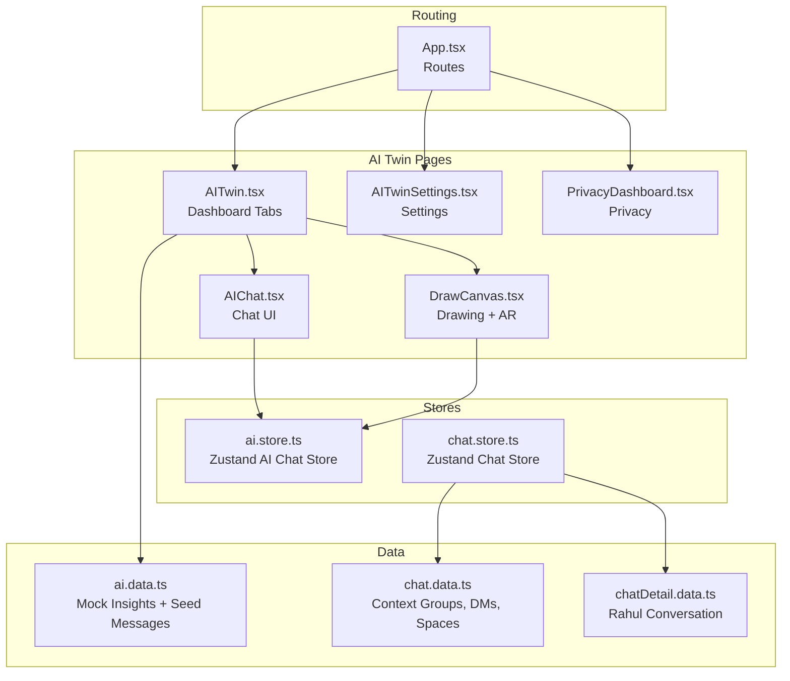
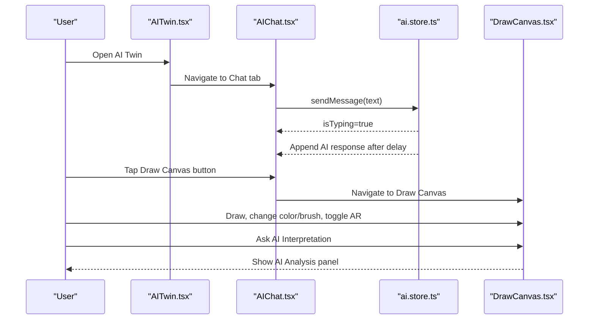
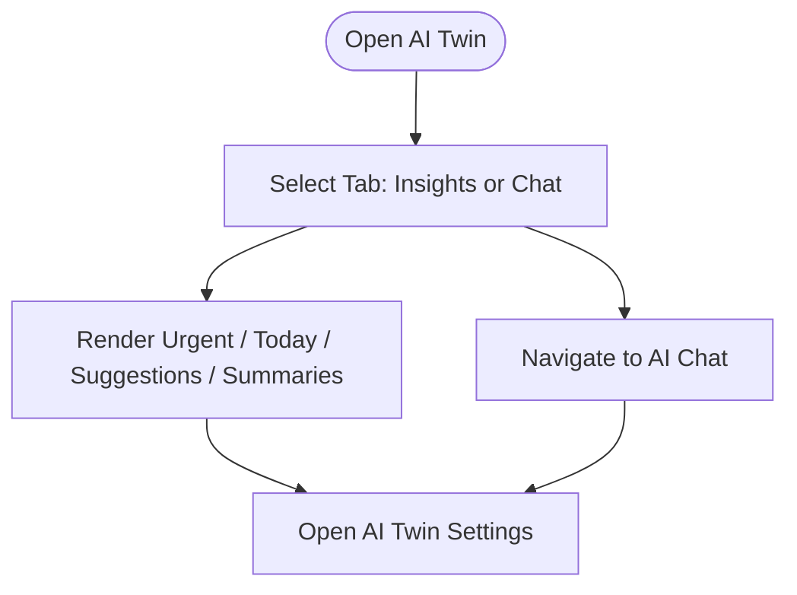
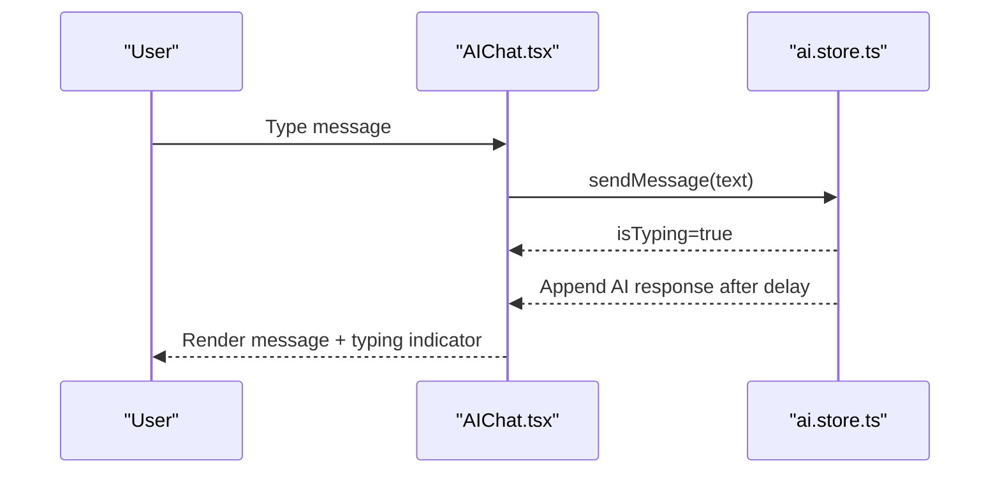
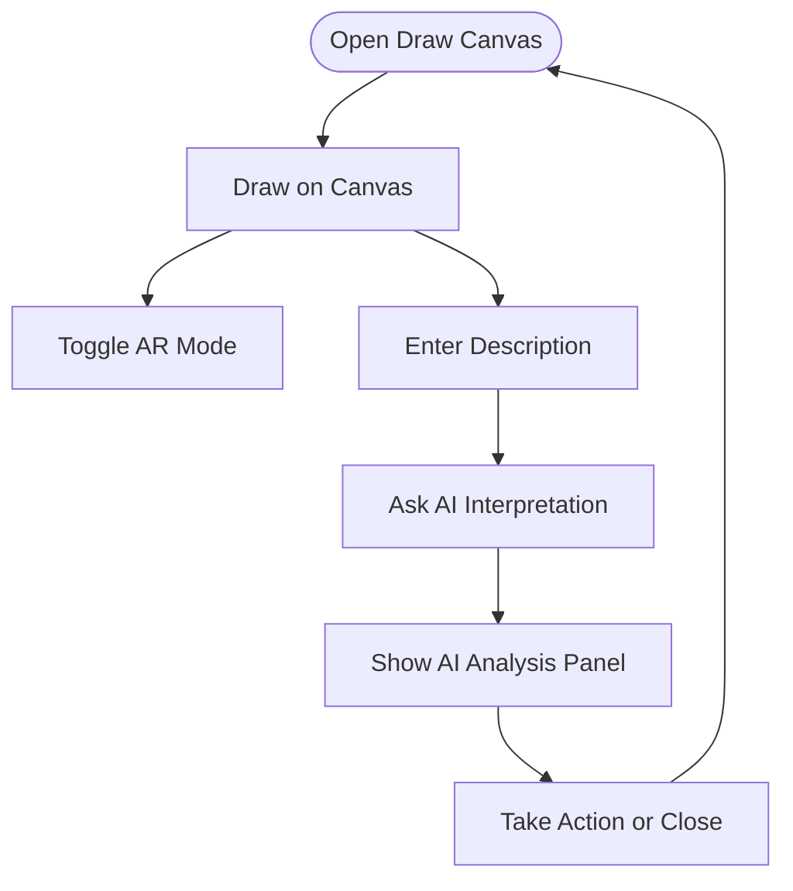
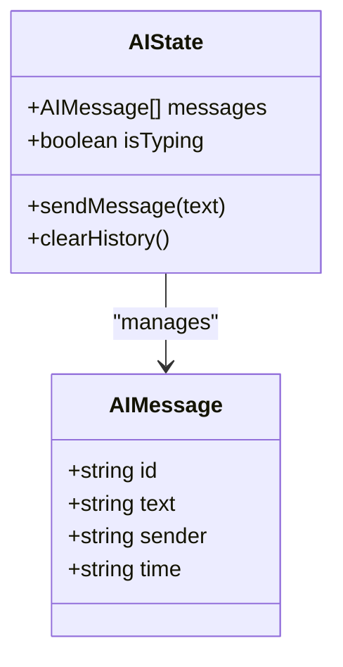
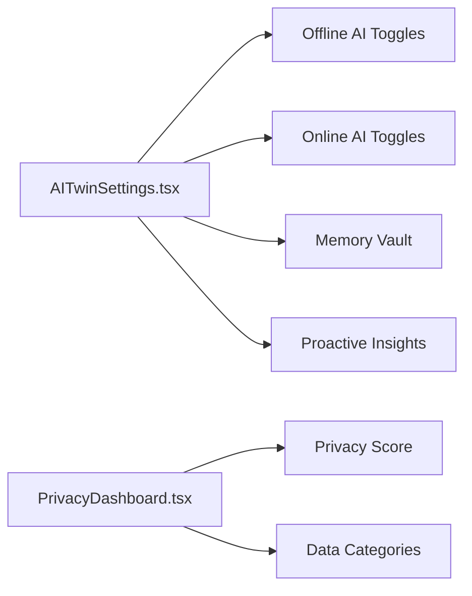
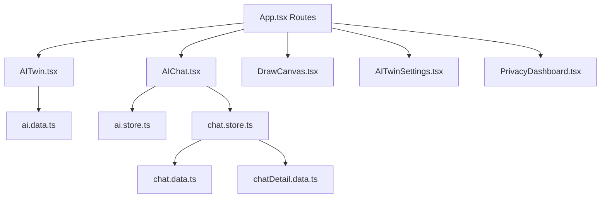

# AI Twin Features

<cite>
**Referenced Files in This Document**
- [AITwin.tsx](file://src/pages/AITwin.tsx)
- [AIChat.tsx](file://src/pages/ai/AIChat.tsx)
- [DrawCanvas.tsx](file://src/pages/ai/DrawCanvas.tsx)
- [ai.store.ts](file://src/store/ai.store.ts)
- [ai.data.ts](file://src/data/ai.data.ts)
- [App.tsx](file://src/App.tsx)
- [AITwinSettings.tsx](file://src/pages/profile/AITwinSettings.tsx)
- [PrivacyDashboard.tsx](file://src/pages/profile/PrivacyDashboard.tsx)
- [chat.store.ts](file://src/store/chat.store.ts)
- [chat.data.ts](file://src/data/chat.data.ts)
- [chatDetail.data.ts](file://src/data/chatDetail.data.ts)
</cite>

## Table of Contents
1. [Introduction](#introduction)
2. [Project Structure](#project-structure)
3. [Core Components](#core-components)
4. [Architecture Overview](#architecture-overview)
5. [Detailed Component Analysis](#detailed-component-analysis)
6. [Dependency Analysis](#dependency-analysis)
7. [Performance Considerations](#performance-considerations)
8. [Troubleshooting Guide](#troubleshooting-guide)
9. [Conclusion](#conclusion)
10. [Appendices](#appendices)

## Introduction
This document describes VChat’s AI Twin ecosystem, focusing on three pillars:
- Intelligent insights and personalized recommendations delivered through the AI Twin dashboard
- Interactive AI chat with conversation interface, message processing, simulated AI responses, and suggestion prompts
- AI canvas for drawing, color and brush controls, AI interpretation simulation, and AR mode support

It also documents the AI store architecture for conversation history and response simulation, outlines model integration patterns and prompt engineering guidelines, and addresses privacy considerations, data retention, and user preferences. Implementation examples are included for extending AI capabilities, integrating external AI services, and optimizing response performance.

## Project Structure
The AI Twin feature spans UI pages, a dedicated AI store, mock data, and routing configuration. The main routes for AI Twin are:
- AI Twin dashboard: renders insights and toggles to the AI chat
- AI Chat: handles messaging, typing indicators, suggestions, and voice recording simulation
- Draw Canvas: drawing interface, tools, AR mode toggle, and AI interpretation panel
- AI Twin Settings: toggles for offline/online AI capabilities, memory vault, and proactive insights
- Privacy Dashboard: privacy score and data categories

**Diagram sources**
- [App.tsx:66-133](file://src/App.tsx#L66-L133)
- [AITwin.tsx:8-135](file://src/pages/AITwin.tsx#L8-L135)
- [AIChat.tsx:7-127](file://src/pages/ai/AIChat.tsx#L7-L127)
- [DrawCanvas.tsx:6-184](file://src/pages/ai/DrawCanvas.tsx#L6-L184)
- [AITwinSettings.tsx:7-128](file://src/pages/profile/AITwinSettings.tsx#L7-L128)
- [PrivacyDashboard.tsx:6-64](file://src/pages/profile/PrivacyDashboard.tsx#L6-L64)
- [ai.store.ts:113-162](file://src/store/ai.store.ts#L113-L162)
- [chat.store.ts:171-349](file://src/store/chat.store.ts#L171-L349)
- [ai.data.ts:1-102](file://src/data/ai.data.ts#L1-L102)
- [chat.data.ts:1-134](file://src/data/chat.data.ts#L1-L134)
- [chatDetail.data.ts:1-71](file://src/data/chatDetail.data.ts#L1-L71)

**Section sources**
- [App.tsx:66-133](file://src/App.tsx#L66-L133)

## Core Components
- AI Twin dashboard: tabbed interface for “Insights” and “Chat”, with status bar and settings navigation
- AI Chat: message list, typing indicator, suggestion pills, voice recording simulation, and draw canvas shortcut
- AI Canvas: drawing surface, color/brush controls, AR mode toggle, and AI interpretation panel
- AI Store: manages conversation history, simulates AI responses, and persists chat state
- Mock Insights: categorized insights and summaries for the dashboard
- Settings and Privacy: toggles for AI capabilities, memory vault, and privacy score

**Section sources**
- [AITwin.tsx:8-135](file://src/pages/AITwin.tsx#L8-L135)
- [AIChat.tsx:7-127](file://src/pages/ai/AIChat.tsx#L7-L127)
- [DrawCanvas.tsx:6-184](file://src/pages/ai/DrawCanvas.tsx#L6-L184)
- [ai.store.ts:113-162](file://src/store/ai.store.ts#L113-L162)
- [ai.data.ts:1-102](file://src/data/ai.data.ts#L1-L102)
- [AITwinSettings.tsx:7-128](file://src/pages/profile/AITwinSettings.tsx#L7-L128)
- [PrivacyDashboard.tsx:6-64](file://src/pages/profile/PrivacyDashboard.tsx#L6-L64)

## Architecture Overview
The AI Twin ecosystem integrates UI pages with Zustand stores for state management. The AI Chat page consumes the AI store to render messages and simulate typing and responses. The AI Canvas page provides a drawing surface and an AI interpretation panel. Routing is configured in App.tsx to support immersive layouts for AI Twin features.

**Diagram sources**
- [App.tsx:110-121](file://src/App.tsx#L110-L121)
- [AITwin.tsx:122-129](file://src/pages/AITwin.tsx#L122-L129)
- [AIChat.tsx:22-26](file://src/pages/ai/AIChat.tsx#L22-L26)
- [ai.store.ts:119-148](file://src/store/ai.store.ts#L119-L148)
- [DrawCanvas.tsx:84-122](file://src/pages/ai/DrawCanvas.tsx#L84-L122)

## Detailed Component Analysis

### AI Twin Dashboard
- Tabbed interface: “Insights” and “Chat”
- Status indicator: “Offline + Online”
- Settings navigation to AI Twin settings
- Insight categories: Urgent, Today, Suggestions, Summaries rendered from mock data

**Diagram sources**
- [AITwin.tsx:10-42](file://src/pages/AITwin.tsx#L10-L42)
- [AITwin.tsx:46-131](file://src/pages/AITwin.tsx#L46-L131)
- [ai.data.ts:1-73](file://src/data/ai.data.ts#L1-L73)

**Section sources**
- [AITwin.tsx:8-135](file://src/pages/AITwin.tsx#L8-L135)
- [ai.data.ts:1-102](file://src/data/ai.data.ts#L1-L102)

### AI Chat System
- Message rendering: user and AI messages with distinct styles
- Typing indicator animation
- Suggestion pills for quick prompts
- Voice recording simulation with animated listening state
- Draw canvas shortcut button
- Scroll to bottom on new messages

**Diagram sources**
- [AIChat.tsx:14-26](file://src/pages/ai/AIChat.tsx#L14-L26)
- [AIChat.tsx:32-67](file://src/pages/ai/AIChat.tsx#L32-L67)
- [ai.store.ts:119-148](file://src/store/ai.store.ts#L119-L148)

**Section sources**
- [AIChat.tsx:7-127](file://src/pages/ai/AIChat.tsx#L7-L127)
- [ai.store.ts:113-162](file://src/store/ai.store.ts#L113-L162)

### AI Canvas Component
- Drawing interface: mouse and touch handlers, line drawing with configurable color and brush size
- AR mode toggle: overlays camera view hint
- AI interpretation panel: shows parsed interpretation and actions
- Tools: color picker, undo, clear canvas, description input, and “Ask AI” button

**Diagram sources**
- [DrawCanvas.tsx:18-79](file://src/pages/ai/DrawCanvas.tsx#L18-L79)
- [DrawCanvas.tsx:104-144](file://src/pages/ai/DrawCanvas.tsx#L104-L144)
- [DrawCanvas.tsx:147-180](file://src/pages/ai/DrawCanvas.tsx#L147-L180)

**Section sources**
- [DrawCanvas.tsx:6-184](file://src/pages/ai/DrawCanvas.tsx#L6-L184)

### AI Store Architecture
- State: messages array, typing indicator
- Actions: sendMessage (append user message, set typing, simulate AI response after delay), clearHistory
- Persistence: Zustand persist middleware with storage key
- Mock responses: keyword-based routing with default fallback

**Diagram sources**
- [ai.store.ts:4-17](file://src/store/ai.store.ts#L4-L17)
- [ai.store.ts:113-162](file://src/store/ai.store.ts#L113-L162)

**Section sources**
- [ai.store.ts:113-162](file://src/store/ai.store.ts#L113-L162)

### AI Twin Settings and Privacy
- AI Twin Settings: status card, offline AI toggles, online AI toggles, memory vault list, proactive insights toggles, privacy note
- Privacy Dashboard: privacy score visualization and data categories

**Diagram sources**
- [AITwinSettings.tsx:32-123](file://src/pages/profile/AITwinSettings.tsx#L32-L123)
- [PrivacyDashboard.tsx:29-64](file://src/pages/profile/PrivacyDashboard.tsx#L29-L64)

**Section sources**
- [AITwinSettings.tsx:7-128](file://src/pages/profile/AITwinSettings.tsx#L7-L128)
- [PrivacyDashboard.tsx:6-64](file://src/pages/profile/PrivacyDashboard.tsx#L6-L64)

## Dependency Analysis
- Routing depends on App.tsx to mount AI Twin pages in immersive layouts
- AI Chat depends on ai.store.ts for messages and response simulation
- AI Twin dashboard depends on ai.data.ts for mock insights
- Chat store (chat.store.ts) provides broader messaging context and is independent from AI store

**Diagram sources**
- [App.tsx:66-133](file://src/App.tsx#L66-L133)
- [AIChat.tsx:9](file://src/pages/ai/AIChat.tsx#L9)
- [AITwin.tsx:5](file://src/pages/AITwin.tsx#L5)
- [ai.store.ts:113-162](file://src/store/ai.store.ts#L113-L162)
- [ai.data.ts:1-102](file://src/data/ai.data.ts#L1-L102)
- [chat.store.ts:171-349](file://src/store/chat.store.ts#L171-L349)
- [chat.data.ts:1-134](file://src/data/chat.data.ts#L1-L134)
- [chatDetail.data.ts:1-71](file://src/data/chatDetail.data.ts#L1-L71)

**Section sources**
- [App.tsx:66-133](file://src/App.tsx#L66-L133)
- [AIChat.tsx:9](file://src/pages/ai/AIChat.tsx#L9)
- [AITwin.tsx:5](file://src/pages/AITwin.tsx#L5)

## Performance Considerations
- Rendering optimization
  - Use stable keys for message lists to minimize re-renders
  - Virtualize long conversation lists if needed
- AI response simulation
  - Keep delays realistic but short; debounce repeated sends
  - Cache keyword match results for frequent queries
- Canvas drawing
  - Use requestAnimationFrame for smoother drawing
  - Limit stroke updates per frame for mobile performance
- Storage persistence
  - Persist only essential fields; avoid storing large attachments
  - Debounce writes to localStorage/sessionStorage

[No sources needed since this section provides general guidance]

## Troubleshooting Guide
- Chat does not scroll to bottom
  - Ensure the scroll container reference is attached and updated after messages change
- Typing indicator not appearing
  - Verify isTyping is set to true immediately upon sending a message
- AI response not shown
  - Confirm sendMessage is invoked and timeout resolves to append AI message
- Drawing not working
  - Check canvas context initialization and coordinate mapping for mouse/touch events
- AR mode visuals
  - Ensure AR overlay is conditionally rendered and camera view hint is centered

**Section sources**
- [AIChat.tsx:14-20](file://src/pages/ai/AIChat.tsx#L14-L20)
- [AIChat.tsx:22-26](file://src/pages/ai/AIChat.tsx#L22-L26)
- [ai.store.ts:119-148](file://src/store/ai.store.ts#L119-L148)
- [DrawCanvas.tsx:18-26](file://src/pages/ai/DrawCanvas.tsx#L18-L26)
- [DrawCanvas.tsx:45-61](file://src/pages/ai/DrawCanvas.tsx#L45-L61)

## Conclusion
The AI Twin ecosystem combines a dashboard for insights, an interactive chat with simulated AI responses, and an AI canvas with AR mode. The system leverages routing, Zustand stores, and mock data to deliver a cohesive experience. Privacy settings and data transparency are emphasized through dedicated dashboards. Extending capabilities involves integrating external AI services, refining prompt engineering, and optimizing performance.

[No sources needed since this section summarizes without analyzing specific files]

## Appendices

### AI Model Integration Patterns
- Prompt engineering guidelines
  - Use explicit instruction prefixes for tasks (e.g., summarize, translate)
  - Include contextual metadata (time, user identity) to tailor responses
  - Employ few-shot examples for structured outputs
- Response handling strategies
  - Normalize responses to concise, actionable text
  - Provide fallbacks for unrecognized intents
  - Surface confidence or disclaimers for uncertain answers

[No sources needed since this section provides general guidance]

### Implementation Examples
- Extending AI capabilities
  - Replace mock responses with calls to an AI service endpoint
  - Integrate streaming responses to improve perceived latency
- Integrating external AI services
  - Wrap service calls in the store action; maintain isTyping and error states
  - Persist conversation IDs for auditability
- Optimizing AI response performance
  - Cache frequent queries and reuse embeddings
  - Preload language models for offline capabilities where feasible

[No sources needed since this section provides general guidance]