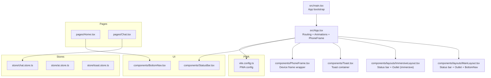
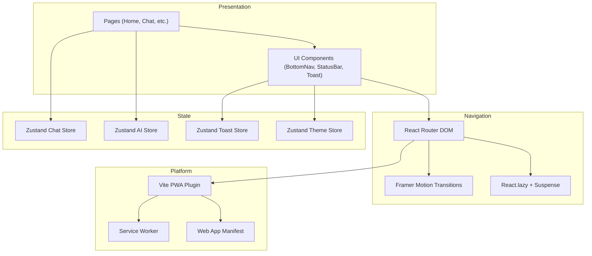
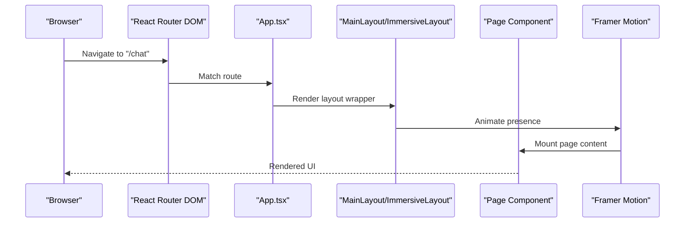
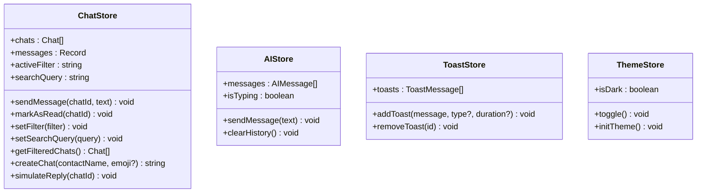
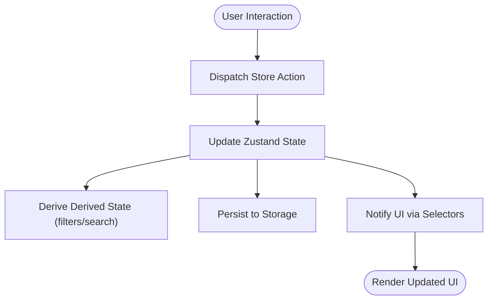
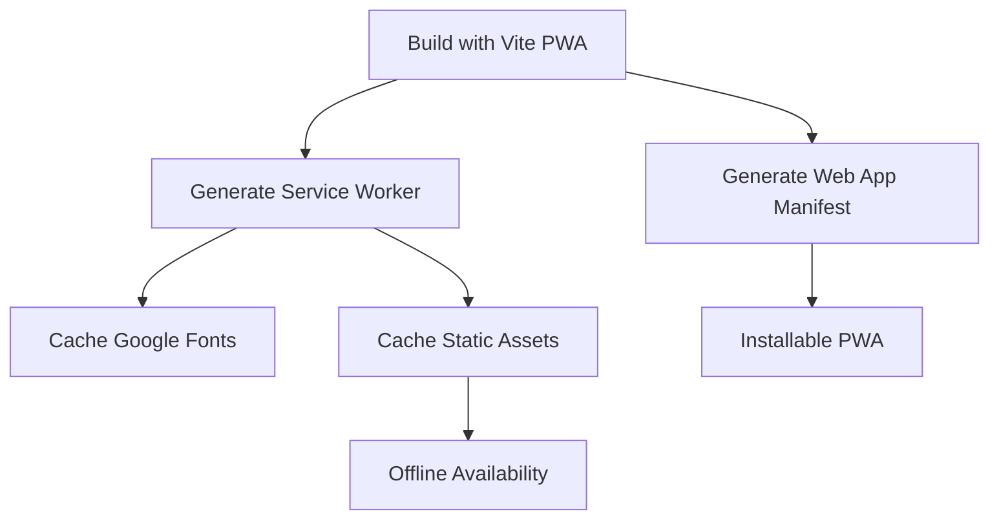
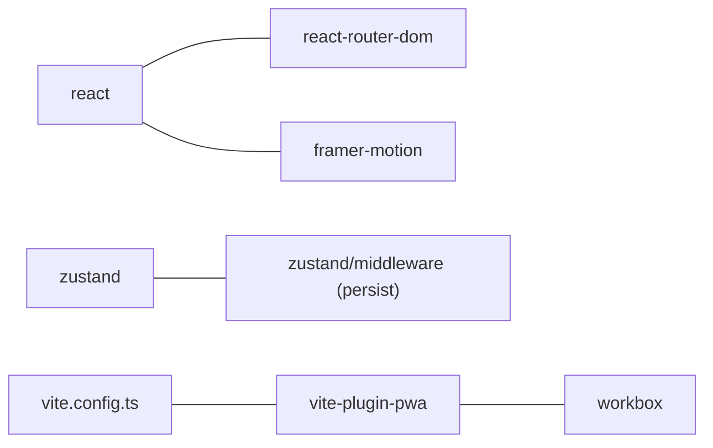

# Architecture Overview

<cite>
**Referenced Files in This Document**
- [main.tsx](file://src/main.tsx)
- [App.tsx](file://src/App.tsx)
- [MainLayout.tsx](file://src/components/layouts/MainLayout.tsx)
- [ImmersiveLayout.tsx](file://src/components/layouts/ImmersiveLayout.tsx)
- [BottomNav.tsx](file://src/components/BottomNav.tsx)
- [StatusBar.tsx](file://src/components/StatusBar.tsx)
- [Toast.tsx](file://src/components/Toast.tsx)
- [vite.config.ts](file://vite.config.ts)
- [chat.store.ts](file://src/store/chat.store.ts)
- [ai.store.ts](file://src/store/ai.store.ts)
- [toast.store.ts](file://src/store/toast.store.ts)
- [useTheme.ts](file://src/hooks/useTheme.ts)
- [Chat.tsx](file://src/pages/Chat.tsx)
- [Home.tsx](file://src/pages/Home.tsx)
- [package.json](file://package.json)
</cite>

## Table of Contents
1. [Introduction](#introduction)
2. [Project Structure](#project-structure)
3. [Core Components](#core-components)
4. [Architecture Overview](#architecture-overview)
5. [Detailed Component Analysis](#detailed-component-analysis)
6. [Dependency Analysis](#dependency-analysis)
7. [Performance Considerations](#performance-considerations)
8. [Troubleshooting Guide](#troubleshooting-guide)
9. [Conclusion](#conclusion)

## Introduction
This document presents the architecture and component organization of VChat, a React-based mobile-first application. It covers the frontend structure, layout system, routing with lazy loading and animations, state management with Zustand stores, theming and persistence, Progressive Web App capabilities, and cross-cutting concerns such as responsive design and performance.

## Project Structure
VChat follows a feature-centric and layer-based organization:
- Entry point initializes the React app and renders the root component.
- App orchestrates routing, animations, device frame wrapper, and global UI elements.
- Layouts encapsulate navigation and immersive experiences.
- Pages implement feature surfaces with component composition and state consumption.
- Stores manage domain-specific state with persistence.
- Hooks implement cross-cutting concerns like theming.
- PWA configuration enables offline caching and installability.

**Diagram sources**
- [main.tsx:1-11](file://src/main.tsx#L1-L11)
- [App.tsx:150-156](file://src/App.tsx#L150-L156)
- [MainLayout.tsx:1-30](file://src/components/layouts/MainLayout.tsx#L1-L30)
- [ImmersiveLayout.tsx:1-19](file://src/components/layouts/ImmersiveLayout.tsx#L1-L19)
- [Toast.tsx:1-53](file://src/components/Toast.tsx#L1-L53)
- [vite.config.ts:1-57](file://vite.config.ts#L1-L57)
- [chat.store.ts:171-330](file://src/store/chat.store.ts#L171-L330)
- [ai.store.ts:113-162](file://src/store/ai.store.ts#L113-L162)
- [toast.store.ts:17-39](file://src/store/toast.store.ts#L17-L39)
- [BottomNav.tsx:1-62](file://src/components/BottomNav.tsx#L1-L62)
- [StatusBar.tsx:1-14](file://src/components/StatusBar.tsx#L1-L14)

**Section sources**
- [main.tsx:1-11](file://src/main.tsx#L1-L11)
- [App.tsx:12-50](file://src/App.tsx#L12-L50)
- [vite.config.ts:1-57](file://vite.config.ts#L1-L57)

## Core Components
- Routing and Animation: App wraps routes with animated transitions and lazy-loaded page components. Routes are grouped under two layout contexts: MainLayout for standard navigation and ImmersiveLayout for full-screen experiences.
- Layout System: MainLayout provides a persistent status bar, outlet for page content, and a bottom navigation bar with context-aware behavior. ImmersiveLayout hides the status bar and maximizes content area for immersive views.
- State Management: Zustand stores encapsulate chat conversations, AI assistant history, toast notifications, and theme preferences with persistence.
- Theming and Persistence: Theme store persists user preference and toggles CSS classes on the root element.
- PWA: Vite PWA plugin configures service worker registration, caching strategies, and app manifest for offline and installable behavior.

**Section sources**
- [App.tsx:66-133](file://src/App.tsx#L66-L133)
- [MainLayout.tsx:7-29](file://src/components/layouts/MainLayout.tsx#L7-L29)
- [ImmersiveLayout.tsx:5-18](file://src/components/layouts/ImmersiveLayout.tsx#L5-L18)
- [chat.store.ts:171-330](file://src/store/chat.store.ts#L171-L330)
- [ai.store.ts:113-162](file://src/store/ai.store.ts#L113-L162)
- [toast.store.ts:17-39](file://src/store/toast.store.ts#L17-L39)
- [useTheme.ts:10-37](file://src/hooks/useTheme.ts#L10-L37)
- [vite.config.ts:9-54](file://vite.config.ts#L9-L54)

## Architecture Overview
The system is structured as a layered React application with clear separation of concerns:
- Presentation Layer: Pages and UI components render content and collect user interactions.
- Navigation and Layout: Layout components provide context-aware navigation and immersive experiences.
- State Management: Zustand stores manage domain state with persistence and actions.
- Routing and Animation: React Router DOM handles navigation with Framer Motion-powered transitions and lazy loading.
- Platform Integration: Vite PWA provides service worker and caching for offline readiness.

**Diagram sources**
- [App.tsx:12-50](file://src/App.tsx#L12-L50)
- [App.tsx:66-133](file://src/App.tsx#L66-L133)
- [chat.store.ts:171-330](file://src/store/chat.store.ts#L171-L330)
- [ai.store.ts:113-162](file://src/store/ai.store.ts#L113-L162)
- [toast.store.ts:17-39](file://src/store/toast.store.ts#L17-L39)
- [useTheme.ts:10-37](file://src/hooks/useTheme.ts#L10-L37)
- [vite.config.ts:9-54](file://vite.config.ts#L9-L54)

## Detailed Component Analysis

### Routing and Layout System
- Layout Contexts:
  - MainLayout: Provides StatusBar, Outlet, and BottomNav with animated entrance/exit. Suitable for standard app flows.
  - ImmersiveLayout: Hides StatusBar and adjusts content margin for immersive media playback and drawing canvases.
- Route Groups:
  - Standard routes under MainLayout include Home, Chat, Explore, Hub, Me, AI Twin, and placeholders for future features.
  - Immersive routes include Reel Player and AI Drawing Canvas.
- Animation and Transitions:
  - AnimatedRoutes uses AnimatePresence with popLayout mode and PageWrapper applies opacity/y transitions for route changes.
  - BottomNav conditionally adapts tabs based on Hub context, enabling context-aware navigation.

**Diagram sources**
- [App.tsx:66-133](file://src/App.tsx#L66-L133)
- [MainLayout.tsx:7-29](file://src/components/layouts/MainLayout.tsx#L7-L29)
- [ImmersiveLayout.tsx:5-18](file://src/components/layouts/ImmersiveLayout.tsx#L5-L18)

**Section sources**
- [App.tsx:66-133](file://src/App.tsx#L66-L133)
- [MainLayout.tsx:7-29](file://src/components/layouts/MainLayout.tsx#L7-L29)
- [ImmersiveLayout.tsx:5-18](file://src/components/layouts/ImmersiveLayout.tsx#L5-L18)
- [BottomNav.tsx:9-23](file://src/components/BottomNav.tsx#L9-L23)

### State Management Architecture
- Chat Store:
  - Manages chats, per-chat messages, filters, and search. Provides actions to send messages, mark as read, filter, search, create chats, and simulate replies.
  - Persists chats, messages, active filter, and search query to storage.
- AI Store:
  - Maintains AI conversation history and typing indicator. Provides actions to send messages and clear history.
  - Persists messages and typing state.
- Toast Store:
  - Global toast notifications with add/remove actions and optional auto-dismiss timers.
- Theme Store:
  - Tracks dark/light mode, toggles CSS classes on the root element, and persists preference.

**Diagram sources**
- [chat.store.ts:45-59](file://src/store/chat.store.ts#L45-L59)
- [ai.store.ts:11-17](file://src/store/ai.store.ts#L11-L17)
- [toast.store.ts:11-15](file://src/store/toast.store.ts#L11-L15)
- [useTheme.ts:4-8](file://src/hooks/useTheme.ts#L4-L8)

**Section sources**
- [chat.store.ts:171-330](file://src/store/chat.store.ts#L171-L330)
- [ai.store.ts:113-162](file://src/store/ai.store.ts#L113-L162)
- [toast.store.ts:17-39](file://src/store/toast.store.ts#L17-L39)
- [useTheme.ts:10-37](file://src/hooks/useTheme.ts#L10-L37)

### Data Flow Patterns
- Chat Data Flow:
  - UI triggers actions via page components (e.g., Chat page).
  - Actions update Zustand state, which propagates to dependent components.
  - Filtering and search derive derived state from the store.
- AI Data Flow:
  - User sends a message; store dispatches a message and sets typing indicator.
  - After a simulated delay, AI responds and clears typing.
- Toast Notifications:
  - Components add toasts; store manages lifecycle and removal.
- Theme:
  - Toggle updates CSS classes and persists preference.

[No sources needed since this diagram shows conceptual workflow, not actual code structure]

**Section sources**
- [Chat.tsx:69-79](file://src/pages/Chat.tsx#L69-L79)
- [chat.store.ts:179-200](file://src/store/chat.store.ts#L179-L200)
- [ai.store.ts:119-148](file://src/store/ai.store.ts#L119-L148)
- [toast.store.ts:19-31](file://src/store/toast.store.ts#L19-L31)
- [useTheme.ts:14-22](file://src/hooks/useTheme.ts#L14-L22)

### Progressive Web App Architecture
- Service Worker and Caching:
  - Auto-update registration and Workbox runtime caching configured.
  - Fonts cached via CacheFirst strategy with long TTL.
- Manifest:
  - Standalone display, theme/background colors, and icons configured for installability.
- Offline Capabilities:
  - Static assets and fonts cached for offline availability.

**Diagram sources**
- [vite.config.ts:9-54](file://vite.config.ts#L9-L54)

**Section sources**
- [vite.config.ts:9-54](file://vite.config.ts#L9-L54)

### Theming, Responsive Design, and Performance
- Theming:
  - Theme store toggles CSS classes on the root element and persists preference.
- Responsive Design:
  - Sticky headers, backdrop blur effects, and adaptive bottom navigation adapt to viewport constraints.
- Performance:
  - Lazy loading of routes reduces initial bundle size.
  - Framer Motion transitions are lightweight and optimized for gesture-driven navigation.
  - Zustand stores avoid unnecessary re-renders by updating minimal state slices.

**Section sources**
- [useTheme.ts:14-30](file://src/hooks/useTheme.ts#L14-L30)
- [Home.tsx:10-53](file://src/pages/Home.tsx#L10-L53)
- [App.tsx:12-50](file://src/App.tsx#L12-L50)

## Dependency Analysis
External libraries and their roles:
- React and React Router DOM: Core UI and routing.
- Framer Motion: Smooth page transitions and gestures.
- Zustand: Lightweight state management with middleware for persistence.
- Vite PWA: Service worker generation and caching strategies.

**Diagram sources**
- [package.json:12-18](file://package.json#L12-L18)
- [package.json:36-36](file://package.json#L36-L36)
- [vite.config.ts:3-3](file://vite.config.ts#L3-L3)

**Section sources**
- [package.json:12-38](file://package.json#L12-L38)
- [vite.config.ts:3-3](file://vite.config.ts#L3-L3)

## Performance Considerations
- Bundle Size:
  - Prefer lazy loading for non-critical routes to reduce initial payload.
- Rendering:
  - Keep components pure and minimize heavy computations in render paths.
- Animations:
  - Use transform and opacity for GPU-accelerated animations.
- State Updates:
  - Use targeted updates and avoid spreading large objects unnecessarily.
- Caching:
  - Leverage PWA caching for static assets and fonts to improve load times.

[No sources needed since this section provides general guidance]

## Troubleshooting Guide
- Route Transitions Not Animating:
  - Verify AnimatePresence and PageWrapper are applied around route elements.
- Bottom Navigation Incorrectly Active:
  - Confirm isActive logic and Hub context detection in BottomNav.
- Toasts Not Showing:
  - Ensure ToastContainer is rendered and addToast is invoked with proper parameters.
- Theme Not Persisting:
  - Check theme-storage persistence and initialization in useTheme hook.
- PWA Not Installing:
  - Validate manifest fields and service worker registration in Vite PWA config.

**Section sources**
- [App.tsx:52-64](file://src/App.tsx#L52-L64)
- [BottomNav.tsx:28-30](file://src/components/BottomNav.tsx#L28-L30)
- [Toast.tsx:6-8](file://src/components/Toast.tsx#L6-L8)
- [useTheme.ts:23-30](file://src/hooks/useTheme.ts#L23-L30)
- [vite.config.ts:9-54](file://vite.config.ts#L9-L54)

## Conclusion
VChat’s architecture emphasizes a clean separation between presentation, navigation, and state management, leveraging React Router DOM, Framer Motion, and Zustand for a smooth, context-aware mobile experience. The PWA configuration enhances accessibility and performance through caching and installability. The layout system supports both standard and immersive experiences, while the stores encapsulate domain logic with persistence. Together, these patterns enable scalability, maintainability, and a responsive user interface.