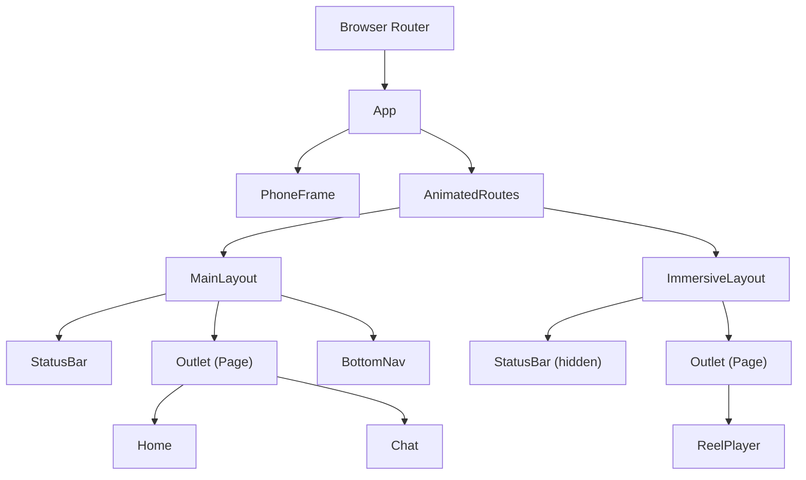
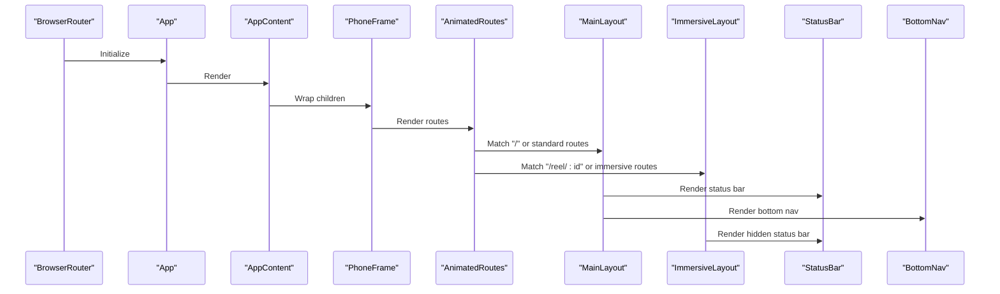
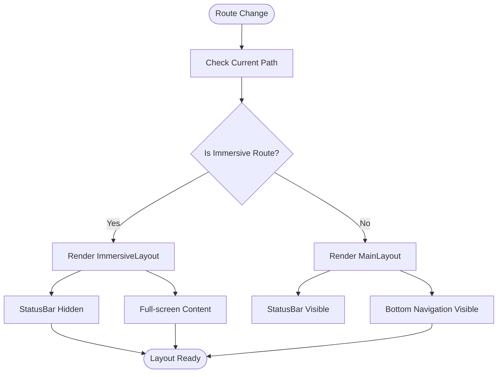
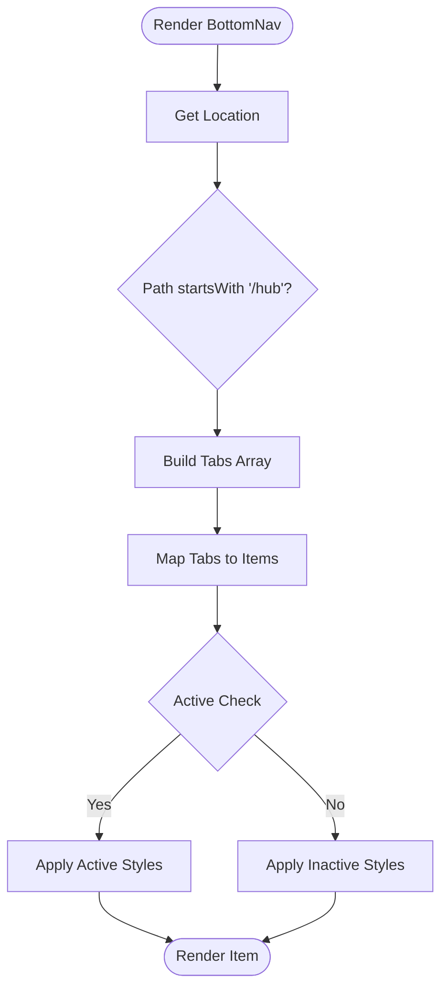
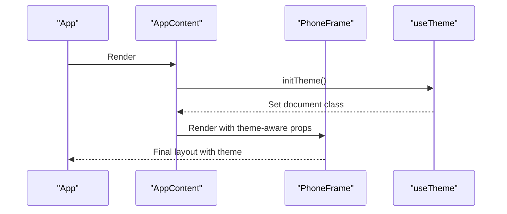
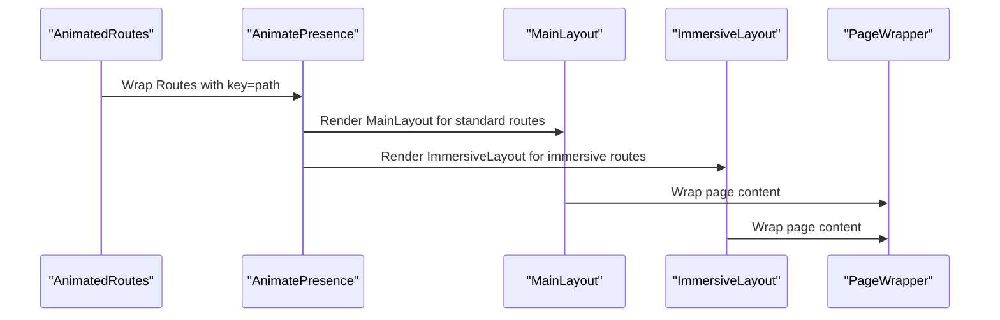
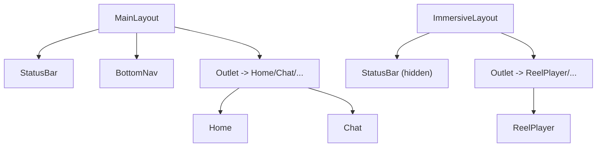
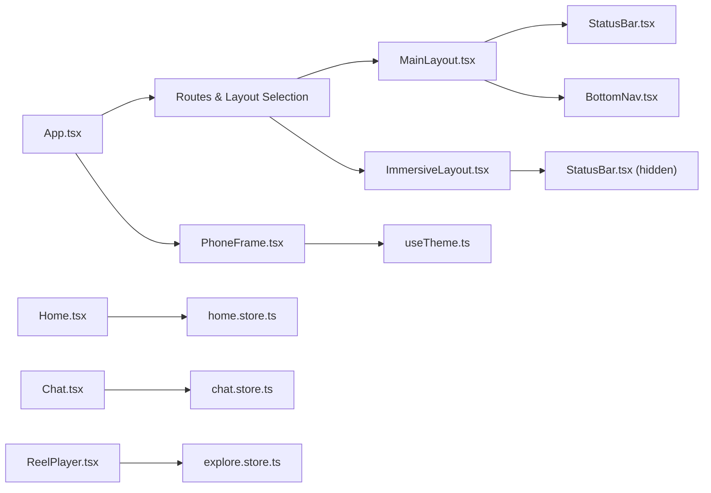

# Layout System

<cite>
**Referenced Files in This Document**
- [App.tsx](file://src/App.tsx)
- [main.tsx](file://src/main.tsx)
- [MainLayout.tsx](file://src/components/layouts/MainLayout.tsx)
- [ImmersiveLayout.tsx](file://src/components/layouts/ImmersiveLayout.tsx)
- [BottomNav.tsx](file://src/components/BottomNav.tsx)
- [StatusBar.tsx](file://src/components/StatusBar.tsx)
- [PhoneFrame.tsx](file://src/components/PhoneFrame.tsx)
- [useTheme.ts](file://src/hooks/useTheme.ts)
- [Home.tsx](file://src/pages/Home.tsx)
- [Chat.tsx](file://src/pages/Chat.tsx)
- [ReelPlayer.tsx](file://src/pages/ReelPlayer.tsx)
- [home.store.ts](file://src/store/home.store.ts)
- [explore.store.ts](file://src/store/explore.store.ts)
- [chat.store.ts](file://src/store/chat.store.ts)
</cite>

## Table of Contents
1. [Introduction](#introduction)
2. [Project Structure](#project-structure)
3. [Core Components](#core-components)
4. [Architecture Overview](#architecture-overview)
5. [Detailed Component Analysis](#detailed-component-analysis)
6. [Dependency Analysis](#dependency-analysis)
7. [Performance Considerations](#performance-considerations)
8. [Troubleshooting Guide](#troubleshooting-guide)
9. [Conclusion](#conclusion)
10. [Appendices](#appendices)

## Introduction
This document explains VChat’s layout system architecture with a focus on the dual-layout pattern: MainLayout for standard navigation and immersive experiences, and ImmersiveLayout for full-screen media consumption. It details the component hierarchy, routing-driven layout switching, bottom navigation with badges and route-aware active states, status bar integration, theme and responsive design, and practical patterns for animations, composition, performance, and accessibility.

## Project Structure
The layout system centers around App routing and two layout shells:
- MainLayout: Provides a persistent bottom navigation bar and animated page transitions.
- ImmersiveLayout: Hides the status bar and maximizes content area for immersive experiences.
Routing defines which layout wraps each page, enabling seamless transitions between standard and immersive contexts.

**Diagram sources**
- [App.tsx:66-133](file://src/App.tsx#L66-L133)
- [MainLayout.tsx:1-30](file://src/components/layouts/MainLayout.tsx#L1-L30)
- [ImmersiveLayout.tsx:1-19](file://src/components/layouts/ImmersiveLayout.tsx#L1-L19)
- [PhoneFrame.tsx:1-53](file://src/components/PhoneFrame.tsx#L1-L53)

**Section sources**
- [App.tsx:66-133](file://src/App.tsx#L66-L133)
- [main.tsx:1-11](file://src/main.tsx#L1-L11)

## Core Components
- MainLayout: Hosts StatusBar, page content via Outlet, and a bottom navigation bar with animated entrance/exit. Uses React Suspense for lazy-loaded pages and AnimatePresence for smooth layout transitions.
- ImmersiveLayout: Hides the status bar and adjusts content margins to maximize screen real estate for immersive media playback.
- BottomNav: Route-aware bottom navigation with contextual tabs, badge indicators, and interactive feedback powered by Framer Motion.
- StatusBar: Minimal status bar component with time and connectivity indicators.
- PhoneFrame: Responsive container that simulates a mobile device on desktop and applies theme-aware styling.
- useTheme: Zustand-based theme store managing light/dark mode and persistence.

**Section sources**
- [MainLayout.tsx:1-30](file://src/components/layouts/MainLayout.tsx#L1-L30)
- [ImmersiveLayout.tsx:1-19](file://src/components/layouts/ImmersiveLayout.tsx#L1-L19)
- [BottomNav.tsx:1-62](file://src/components/BottomNav.tsx#L1-L62)
- [StatusBar.tsx:1-14](file://src/components/StatusBar.tsx#L1-L14)
- [PhoneFrame.tsx:1-53](file://src/components/PhoneFrame.tsx#L1-L53)
- [useTheme.ts:1-37](file://src/hooks/useTheme.ts#L1-L37)

## Architecture Overview
The layout system leverages React Router v6 with lazy loading and animated route transitions. AppContent renders PhoneFrame, which wraps AnimatedRoutes. AnimatedRoutes conditionally renders either MainLayout or ImmersiveLayout based on the current route. Both layouts share Outlet for page content and rely on shared components like StatusBar and BottomNav.

**Diagram sources**
- [App.tsx:135-148](file://src/App.tsx#L135-L148)
- [App.tsx:66-133](file://src/App.tsx#L66-L133)
- [MainLayout.tsx:1-30](file://src/components/layouts/MainLayout.tsx#L1-L30)
- [ImmersiveLayout.tsx:1-19](file://src/components/layouts/ImmersiveLayout.tsx#L1-L19)

## Detailed Component Analysis

### Dual-Layout Pattern: MainLayout vs ImmersiveLayout
- MainLayout:
  - Renders StatusBar at the top.
  - Wraps page content in React.Suspense with a spinner fallback.
  - Animates bottom navigation bar using AnimatePresence and motion div.
  - Uses Outlet to render the current page.
- ImmersiveLayout:
  - Hides StatusBar by setting opacity and pointer-events to none.
  - Adjusts top margin to avoid overlap with status bar.
  - Wraps page content in React.Suspense with a dark-themed spinner.
  - No bottom navigation; content occupies full viewport.

**Diagram sources**
- [App.tsx:118-129](file://src/App.tsx#L118-L129)
- [ImmersiveLayout.tsx:5-19](file://src/components/layouts/ImmersiveLayout.tsx#L5-L19)
- [MainLayout.tsx:7-30](file://src/components/layouts/MainLayout.tsx#L7-L30)

**Section sources**
- [App.tsx:118-129](file://src/App.tsx#L118-L129)
- [ImmersiveLayout.tsx:1-19](file://src/components/layouts/ImmersiveLayout.tsx#L1-L19)
- [MainLayout.tsx:1-30](file://src/components/layouts/MainLayout.tsx#L1-L30)

### Bottom Navigation System
- Context-aware tabs:
  - When the path starts with “/hub”, the Explore tab becomes Network and Streaks becomes a dedicated route.
  - Otherwise, Explore and Hub are shown as standard tabs.
- Active state detection:
  - Home is active on the exact “/” path.
  - Other tabs are active when the current location starts with their path.
- Badge indicators:
  - Chat tab displays a numeric badge when present.
- Interactive feedback:
  - Framer Motion tap animations and contextual menu override for AI Twin quick access.

**Diagram sources**
- [BottomNav.tsx:5-62](file://src/components/BottomNav.tsx#L5-L62)

**Section sources**
- [BottomNav.tsx:1-62](file://src/components/BottomNav.tsx#L1-L62)

### Status Bar Component and Theme Integration
- StatusBar:
  - Displays time and connectivity icons with minimal styling.
- Theme integration:
  - useTheme initializes and toggles light/dark classes on the document root.
  - PhoneFrame applies theme-aware borders and backgrounds.
- Mobile-first design:
  - PhoneFrame switches between true mobile viewport and a simulated phone shell on larger screens.

**Diagram sources**
- [App.tsx:135-148](file://src/App.tsx#L135-L148)
- [useTheme.ts:23-30](file://src/hooks/useTheme.ts#L23-L30)
- [PhoneFrame.tsx:23-50](file://src/components/PhoneFrame.tsx#L23-L50)

**Section sources**
- [StatusBar.tsx:1-14](file://src/components/StatusBar.tsx#L1-L14)
- [useTheme.ts:1-37](file://src/hooks/useTheme.ts#L1-L37)
- [PhoneFrame.tsx:1-53](file://src/components/PhoneFrame.tsx#L1-L53)

### Route-Aware Layout Switching and Transitions
- AnimatedRoutes:
  - Uses AnimatePresence with popLayout mode and a key derived from pathname to trigger transitions.
  - Routes under MainLayout use MainLayout; routes under ImmersiveLayout use ImmersiveLayout.
- Page wrappers:
  - PageWrapper animates page entrance/exit with motion div and duration controls.
- Layout transitions:
  - AnimatePresence on MainLayout’s bottom navigation ensures smooth show/hide during route changes.

**Diagram sources**
- [App.tsx:66-133](file://src/App.tsx#L66-L133)
- [MainLayout.tsx:20-27](file://src/components/layouts/MainLayout.tsx#L20-L27)

**Section sources**
- [App.tsx:66-133](file://src/App.tsx#L66-L133)
- [MainLayout.tsx:20-27](file://src/components/layouts/MainLayout.tsx#L20-L27)

### Component Composition Patterns
- Composition of layout shells with page content:
  - Outlet renders the current page inside the selected layout.
- Shared UI elements:
  - StatusBar and BottomNav are consistently composed across layouts.
- Page-specific enhancements:
  - Home integrates sticky top bars and animated cards.
  - Chat adds floating compose button and modal overlays.
  - ReelPlayer composes gesture-driven interactions and action overlays.

**Diagram sources**
- [MainLayout.tsx:7-30](file://src/components/layouts/MainLayout.tsx#L7-L30)
- [ImmersiveLayout.tsx:5-19](file://src/components/layouts/ImmersiveLayout.tsx#L5-L19)
- [Home.tsx:280-295](file://src/pages/Home.tsx#L280-L295)
- [Chat.tsx:65-245](file://src/pages/Chat.tsx#L65-L245)
- [ReelPlayer.tsx:7-219](file://src/pages/ReelPlayer.tsx#L7-L219)

**Section sources**
- [Home.tsx:280-295](file://src/pages/Home.tsx#L280-L295)
- [Chat.tsx:65-245](file://src/pages/Chat.tsx#L65-L245)
- [ReelPlayer.tsx:7-219](file://src/pages/ReelPlayer.tsx#L7-L219)

### Practical Examples
- Layout switching based on route context:
  - Standard routes (e.g., “/”, “/chat”, “/hub”) render MainLayout with bottom navigation.
  - Immersive routes (e.g., “/reel/:id”, “/ai-twin/draw”) render ImmersiveLayout.
- Animation transitions:
  - AnimatedRoutes uses AnimatePresence with popLayout mode keyed by pathname for cross-fade transitions.
  - Bottom navigation uses AnimatePresence with initial/animate/exit to slide into place.
- Component composition:
  - Pages wrap content with PageWrapper for consistent page transitions.
  - BottomNav dynamically builds tabs depending on the current route segment.

**Section sources**
- [App.tsx:66-133](file://src/App.tsx#L66-L133)
- [MainLayout.tsx:20-27](file://src/components/layouts/MainLayout.tsx#L20-L27)
- [BottomNav.tsx:9-23](file://src/components/BottomNav.tsx#L9-L23)

## Dependency Analysis
- Routing and layout selection:
  - App.tsx defines routes and selects MainLayout or ImmersiveLayout per route.
- Layout to shared components:
  - Both layouts depend on StatusBar and BottomNav.
- Theme and responsive container:
  - PhoneFrame depends on useTheme and adapts to viewport size.
- Page stores:
  - Pages use domain-specific Zustand stores for state management.

**Diagram sources**
- [App.tsx:66-133](file://src/App.tsx#L66-L133)
- [MainLayout.tsx:1-30](file://src/components/layouts/MainLayout.tsx#L1-L30)
- [ImmersiveLayout.tsx:1-19](file://src/components/layouts/ImmersiveLayout.tsx#L1-L19)
- [PhoneFrame.tsx:1-53](file://src/components/PhoneFrame.tsx#L1-L53)
- [useTheme.ts:1-37](file://src/hooks/useTheme.ts#L1-L37)
- [home.store.ts:1-103](file://src/store/home.store.ts#L1-L103)
- [chat.store.ts:1-349](file://src/store/chat.store.ts#L1-L349)
- [explore.store.ts:1-164](file://src/store/explore.store.ts#L1-L164)

**Section sources**
- [App.tsx:66-133](file://src/App.tsx#L66-L133)
- [PhoneFrame.tsx:1-53](file://src/components/PhoneFrame.tsx#L1-L53)
- [useTheme.ts:1-37](file://src/hooks/useTheme.ts#L1-L37)
- [home.store.ts:1-103](file://src/store/home.store.ts#L1-L103)
- [chat.store.ts:1-349](file://src/store/chat.store.ts#L1-L349)
- [explore.store.ts:1-164](file://src/store/explore.store.ts#L1-L164)

## Performance Considerations
- Lazy loading:
  - Pages are lazy-loaded with React.lazy to reduce initial bundle size.
- Suspense fallbacks:
  - Both layouts use Suspense with lightweight spinners to prevent layout shift.
- Transition optimization:
  - AnimatePresence with popLayout and keyed routes minimizes reflows.
  - Bottom navigation uses AnimatePresence with simple y-transforms.
- Store partitioning:
  - Domain-specific Zustand stores isolate state and reduce unnecessary re-renders.
- Rendering boundaries:
  - Sticky headers and overlays are scoped to pages to limit layout thrashing.

[No sources needed since this section provides general guidance]

## Troubleshooting Guide
- Bottom navigation active state not updating:
  - Verify path comparisons in BottomNav and ensure route prefixes match expectations.
- Status bar overlaps content on immersive routes:
  - Confirm ImmersiveLayout’s negative top margin and hidden status bar classes.
- Theme not applying:
  - Ensure useTheme.initTheme runs on mount and document root classes are toggled.
- Layout flicker on route change:
  - Confirm AnimatePresence keys are derived from pathname and not static.
- Bottom navigation animation glitches:
  - Check AnimatePresence configurations and ensure exit animations are defined.

**Section sources**
- [BottomNav.tsx:28-30](file://src/components/BottomNav.tsx#L28-L30)
- [ImmersiveLayout.tsx:8-10](file://src/components/layouts/ImmersiveLayout.tsx#L8-L10)
- [useTheme.ts:23-30](file://src/hooks/useTheme.ts#L23-L30)
- [App.tsx:70-71](file://src/App.tsx#L70-L71)
- [MainLayout.tsx:20-27](file://src/components/layouts/MainLayout.tsx#L20-L27)

## Conclusion
VChat’s layout system cleanly separates standard navigation and immersive experiences through a dual-layout pattern. MainLayout and ImmersiveLayout are orchestrated by App routing, with BottomNav and StatusBar composing consistently across both. The system emphasizes responsive design, theme integration, and smooth transitions, while leveraging lazy loading and domain-specific stores for performance and maintainability.

[No sources needed since this section summarizes without analyzing specific files]

## Appendices
- Accessibility considerations:
  - Use semantic landmarks and ensure focus order aligns with visual navigation.
  - Provide keyboard shortcuts for bottom navigation and immersive actions.
  - Ensure sufficient color contrast for active/inactive states and badges.
  - Announce route changes for screen readers using ARIA live regions.

[No sources needed since this section provides general guidance]