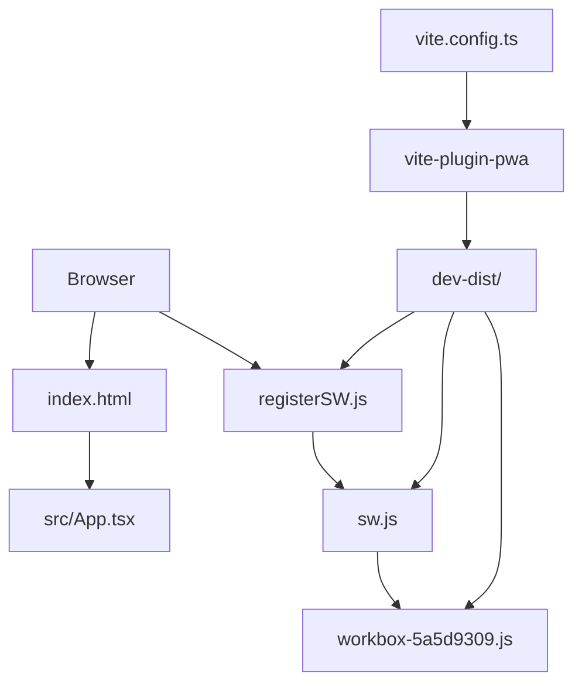
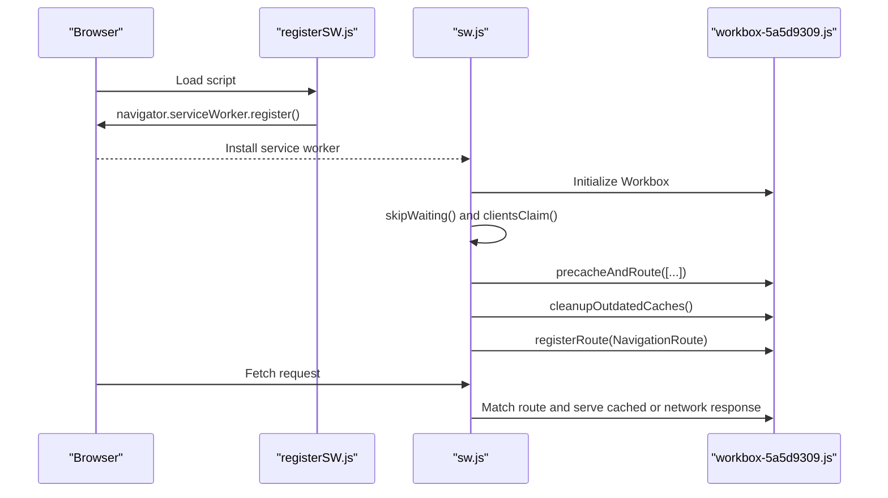
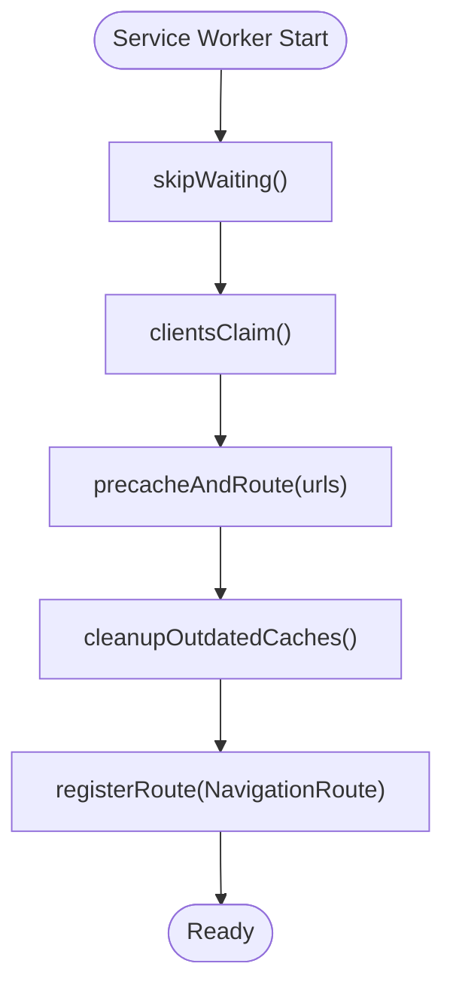
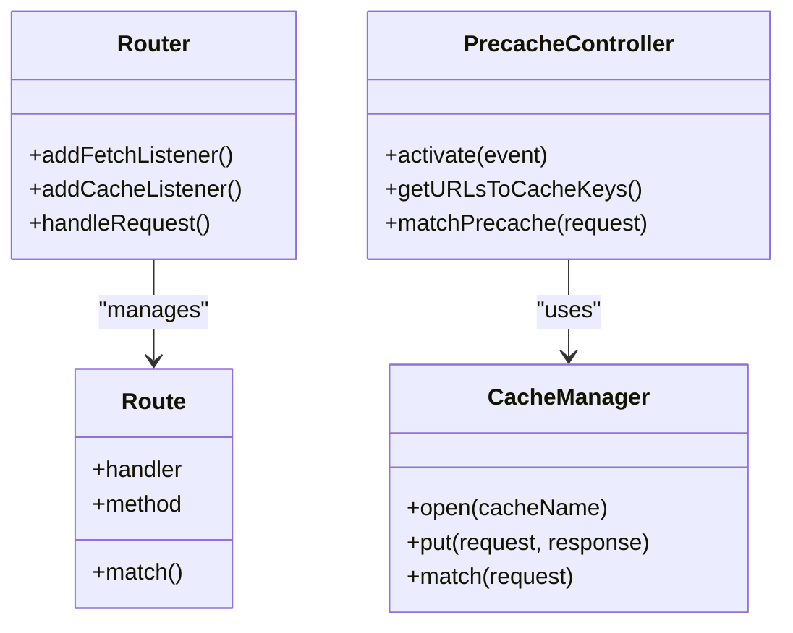
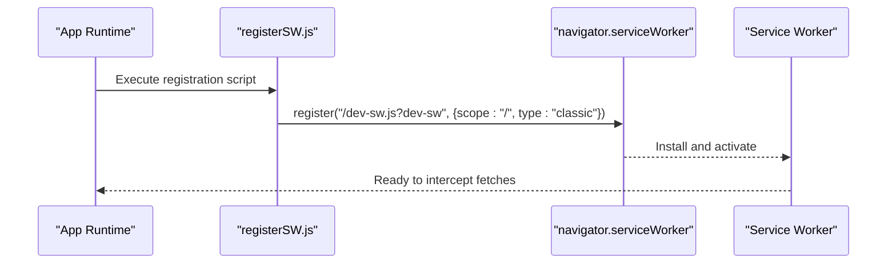
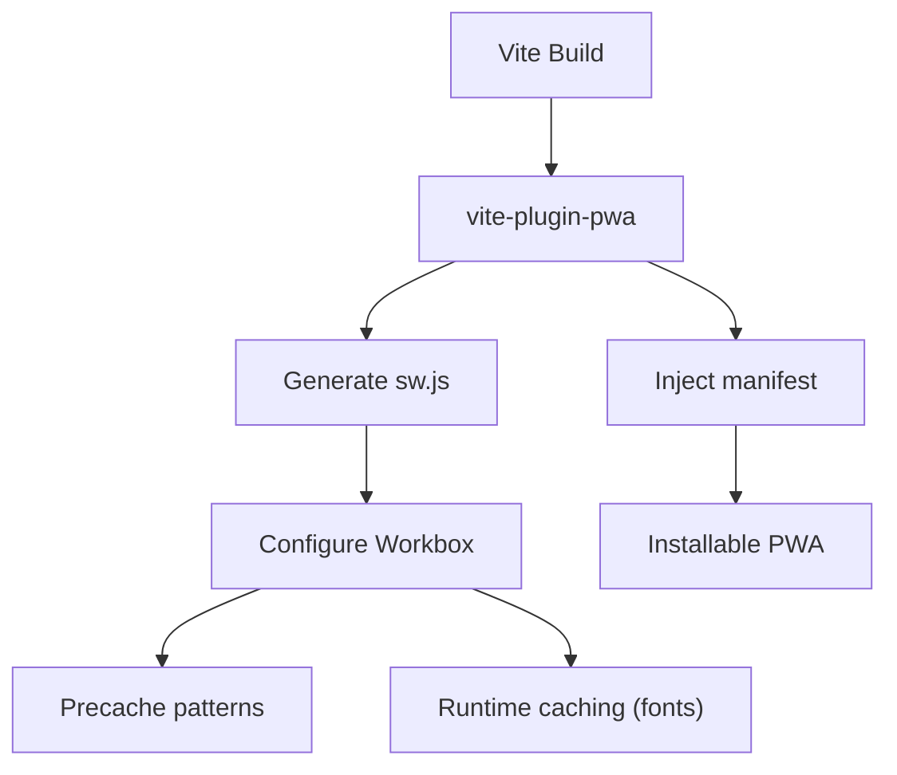
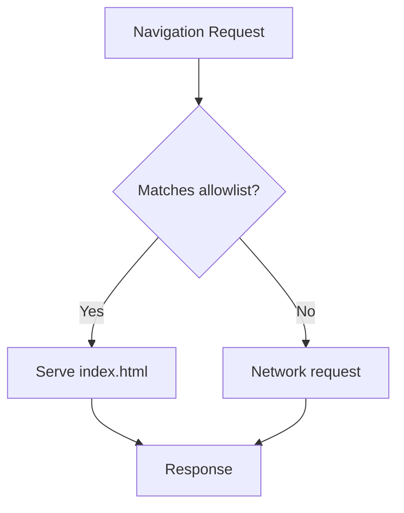
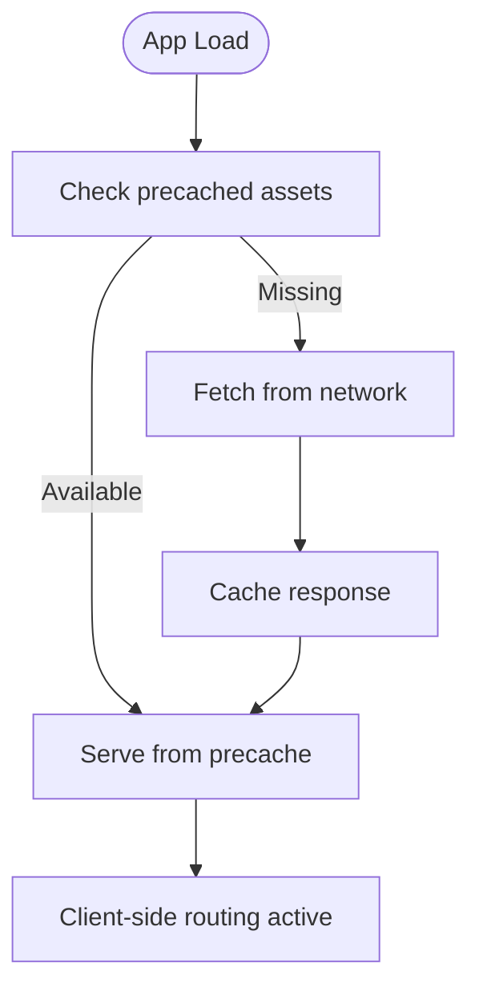
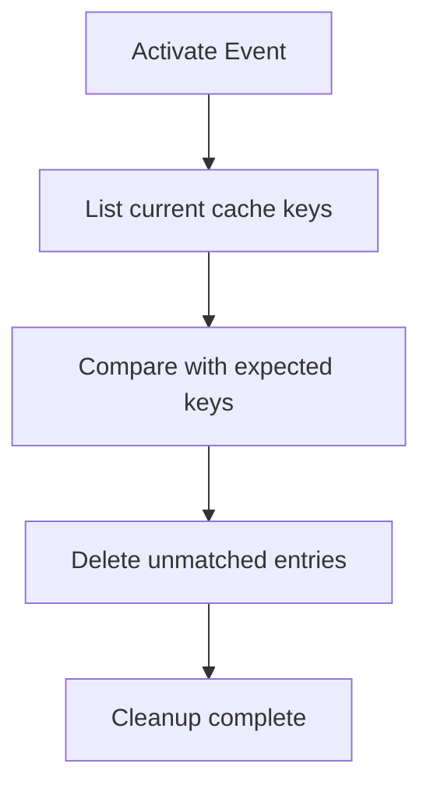
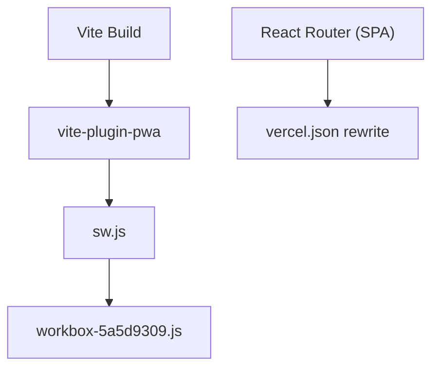

# Progressive Web App Architecture

<cite>
**Referenced Files in This Document**
- [sw.js](file://dev-dist/sw.js)
- [registerSW.js](file://dev-dist/registerSW.js)
- [workbox-5a5d9309.js](file://dev-dist/workbox-5a5d9309.js)
- [vite.config.ts](file://vite.config.ts)
- [package.json](file://package.json)
- [index.html](file://index.html)
- [vercel.json](file://vercel.json)
- [App.tsx](file://src/App.tsx)
</cite>

## Table of Contents
1. [Introduction](#introduction)
2. [Project Structure](#project-structure)
3. [Core Components](#core-components)
4. [Architecture Overview](#architecture-overview)
5. [Detailed Component Analysis](#detailed-component-analysis)
6. [Dependency Analysis](#dependency-analysis)
7. [Performance Considerations](#performance-considerations)
8. [Troubleshooting Guide](#troubleshooting-guide)
9. [Conclusion](#conclusion)

## Introduction
This document explains VChat's Progressive Web App (PWA) architecture and service worker implementation. It covers Workbox configuration for caching strategies, offline functionality, and navigation handling, as well as the service worker registration process, cache management patterns, runtime caching optimizations, and the offline-first approach. It also documents the manifest configuration for app installation, splash screen customization, and device-specific optimizations, and provides practical examples for cache invalidation, offline data synchronization, and fallback mechanisms. Finally, it addresses performance monitoring, security considerations, and browser compatibility testing.

## Project Structure
VChat leverages Vite with the vite-plugin-pwa to generate a production-ready PWA. The build produces a service worker and Workbox runtime library in the dev-dist directory. The application entry point is configured via index.html, and server-side routing for SPA fallback is handled by vercel.json.

**Diagram sources**
- [index.html:1-16](file://index.html#L1-L16)
- [vite.config.ts:1-57](file://vite.config.ts#L1-L57)
- [sw.js:1-93](file://dev-dist/sw.js#L1-L93)
- [registerSW.js:1-1](file://dev-dist/registerSW.js#L1-L1)
- [workbox-5a5d9309.js:1-800](file://dev-dist/workbox-5a5d9309.js#L1-L800)

**Section sources**
- [index.html:1-16](file://index.html#L1-L16)
- [vite.config.ts:1-57](file://vite.config.ts#L1-L57)
- [vercel.json:1-8](file://vercel.json#L1-L8)

## Core Components
- Service Worker and Workbox Runtime: The service worker is generated by Vite PWA and registers Workbox to manage precaching, navigation handling, and runtime caching. It uses skipWaiting and clientsClaim to activate immediately and claim clients.
- Manifest and Icons: The PWA manifest defines app metadata, theme/background colors, standalone display mode, and icon assets for installation and splash screens.
- Runtime Caching Strategy: A Google Fonts runtime cache is configured with CacheFirst strategy, expiration limits, and cacheable response filtering.
- SPA Fallback Routing: A NavigationRoute ensures single-page navigation falls back to index.html for root paths.

**Section sources**
- [sw.js:70-92](file://dev-dist/sw.js#L70-L92)
- [vite.config.ts:9-54](file://vite.config.ts#L9-L54)

## Architecture Overview
The PWA architecture centers on a service worker that:
- Precaches critical assets declared in the build manifest.
- Handles navigation requests to support client-side routing.
- Applies runtime caching for external resources (e.g., fonts).
- Manages cache cleanup and outdated cache removal.

**Diagram sources**
- [registerSW.js:1-1](file://dev-dist/registerSW.js#L1-L1)
- [sw.js:70-92](file://dev-dist/sw.js#L70-L92)
- [workbox-5a5d9309.js:728-742](file://dev-dist/workbox-5a5d9309.js#L728-L742)

## Detailed Component Analysis

### Service Worker Implementation
The service worker integrates Workbox to:
- Activate immediately with skipWaiting and claim clients.
- Precache specific assets (index.html and registerSW.js) with revision tracking.
- Clean up outdated caches after activation.
- Register a NavigationRoute to serve index.html for root navigation.

**Diagram sources**
- [sw.js:70-92](file://dev-dist/sw.js#L70-L92)

**Section sources**
- [sw.js:70-92](file://dev-dist/sw.js#L70-L92)

### Workbox Runtime Library
The Workbox runtime provides:
- Router and Route abstractions for request matching and handling.
- Cache lifecycle utilities, including cache safety checks and quota error handling.
- Precache controller with cleanup and URL-to-cache-key mapping.
- Cache name scoping and default cache strategies.

**Diagram sources**
- [workbox-5a5d9309.js:708-742](file://dev-dist/workbox-5a5d9309.js#L708-L742)
- [workbox-5a5d9309.js:2838-2869](file://dev-dist/workbox-5a5d9309.js#L2838-L2869)

**Section sources**
- [workbox-5a5d9309.js:708-742](file://dev-dist/workbox-5a5d9309.js#L708-L742)
- [workbox-5a5d9309.js:2838-2869](file://dev-dist/workbox-5a5d9309.js#L2838-L2869)

### Service Worker Registration
The application registers the service worker with a classic type and root scope. The registration script is included in the dev-dist bundle and targets a development service worker endpoint.

**Diagram sources**
- [registerSW.js:1-1](file://dev-dist/registerSW.js#L1-L1)

**Section sources**
- [registerSW.js:1-1](file://dev-dist/registerSW.js#L1-L1)

### Workbox Configuration in Vite
Vite PWA generates the service worker and sets up:
- Glob patterns for precaching static assets.
- Runtime caching for Google Fonts with CacheFirst strategy, expiration, and cacheable responses.
- Manifest configuration for app installability and appearance.

**Diagram sources**
- [vite.config.ts:9-54](file://vite.config.ts#L9-L54)

**Section sources**
- [vite.config.ts:9-54](file://vite.config.ts#L9-L54)

### Manifest Configuration
The manifest defines:
- App name and short name.
- Description and theme/background colors.
- Standalone display mode for fullscreen installation.
- Icon assets for 192x192 and 512x512 with maskable purpose.

These settings enable installation on devices and customize the splash screen and app icon.

**Section sources**
- [vite.config.ts:33-53](file://vite.config.ts#L33-L53)

### Navigation and SPA Fallback
The service worker registers a NavigationRoute that serves index.html for root paths, enabling client-side routing without server round trips.

**Diagram sources**
- [sw.js:88-90](file://dev-dist/sw.js#L88-L90)

**Section sources**
- [sw.js:88-90](file://dev-dist/sw.js#L88-L90)

### Runtime Caching Optimizations
A dedicated runtime cache for Google Fonts uses:
- CacheFirst strategy to minimize bandwidth and latency.
- Expiration policy to cap long-term storage.
- Cacheable response filtering to accept 200/0 responses.

This pattern can be extended to other external resources requiring offline availability.

**Section sources**
- [vite.config.ts:13-29](file://vite.config.ts#L13-L29)

### Offline-First Approach
The offline-first strategy is implemented by:
- Precaching core HTML and registration scripts to ensure immediate load.
- Serving index.html for navigation to support offline SPA routing.
- Using runtime caching for static assets (fonts) to reduce network dependence.

**Diagram sources**
- [sw.js:80-86](file://dev-dist/sw.js#L80-L86)
- [sw.js:88-90](file://dev-dist/sw.js#L88-L90)

**Section sources**
- [sw.js:80-86](file://dev-dist/sw.js#L80-L86)
- [sw.js:88-90](file://dev-dist/sw.js#L88-L90)

### Background Sync and Data Persistence
Background sync is not configured in the current setup. To implement offline data synchronization:
- Define background sync queues with unique names.
- Register sync handlers to replay failed requests.
- Persist pending operations in IndexedDB or localStorage until sync succeeds.

Recommended implementation steps:
- Add background sync configuration in Workbox.
- Extend the service worker to handle sync events.
- Implement client-side queuing and retry logic.

Note: The current code does not include background sync configuration.

**Section sources**
- [workbox-5a5d9309.js:197-203](file://dev-dist/workbox-5a5d9309.js#L197-L203)

### Push Notifications
Push notifications are not configured in the current setup. To add support:
- Register a push event handler in the service worker.
- Implement permission prompts and subscription management in the client.
- Handle incoming push messages and display notifications.

Note: The current code does not include push notification handlers.

**Section sources**
- [sw.js:70-92](file://dev-dist/sw.js#L70-L92)

### Cache Invalidation Strategies
Practical strategies for cache invalidation:
- Outdated cache cleanup: The service worker removes cached entries not present in the current manifest.
- Revision-based updates: Precache entries include revision hashes to force updates.
- Manual cache clearing: Provide UI controls to clear caches or reload with skip waiting.

**Diagram sources**
- [sw.js:87](file://dev-dist/sw.js#L87)
- [workbox-5a5d9309.js:2838-2869](file://dev-dist/workbox-5a5d9309.js#L2838-L2869)

**Section sources**
- [sw.js:87](file://dev-dist/sw.js#L87)
- [workbox-5a5d9309.js:2838-2869](file://dev-dist/workbox-5a5d9309.js#L2838-L2869)

### Offline Data Synchronization
Recommended approach:
- Queue outgoing requests when offline.
- Retry queued requests on network availability.
- Use background sync to reliably deliver data when connectivity resumes.

Implementation outline:
- Client: Track offline state and queue operations.
- Service Worker: Replay queued requests during sync events.
- Storage: Persist queue state locally until successful delivery.

Note: The current code does not include offline synchronization logic.

**Section sources**
- [workbox-5a5d9309.js:197-203](file://dev-dist/workbox-5a5d9309.js#L197-L203)

### Fallback Mechanisms for Failed Requests
Fallback strategies:
- Network-first with cache fallback: Attempt network, then serve cached response.
- Stale-while-revalidate: Serve cached immediately and update cache asynchronously.
- Error boundaries: Display user-friendly messages when requests fail.

These strategies can be applied via Workbox strategies and client-side logic.

**Section sources**
- [workbox-5a5d9309.js:2186-2217](file://dev-dist/workbox-5a5d9309.js#L2186-L2217)

### Performance Monitoring for PWA Features
Recommendations:
- Monitor cache hit rates and storage utilization.
- Track navigation timing and first paint metrics.
- Observe service worker lifecycle events and activation success.
- Measure runtime cache performance for external resources.

Tools:
- Lighthouse for PWA audits.
- Chrome DevTools Application panel for cache inspection.
- Performance panels for timing analysis.

[No sources needed since this section provides general guidance]

### Security Considerations for Service Workers
Guidelines:
- Use HTTPS for deployment to enable service worker registration.
- Validate and sanitize cacheable responses.
- Avoid caching sensitive data; use appropriate cache policies.
- Keep Workbox and plugin versions updated to mitigate known vulnerabilities.

[No sources needed since this section provides general guidance]

### Browser Compatibility Testing
Testing checklist:
- Verify service worker registration and activation across modern browsers.
- Test offline behavior and navigation fallback.
- Confirm manifest installation and icon rendering.
- Validate runtime caching for external resources (e.g., fonts).
- Check navigation route behavior for deep links and refresh scenarios.

[No sources needed since this section provides general guidance]

## Dependency Analysis
The PWA relies on Vite and vite-plugin-pwa to generate the service worker and manifest. The service worker depends on the Workbox runtime for routing and caching logic. The application uses React Router for client-side navigation, which the service worker supports via NavigationRoute.

**Diagram sources**
- [vite.config.ts:1-57](file://vite.config.ts#L1-L57)
- [sw.js:70-92](file://dev-dist/sw.js#L70-L92)
- [workbox-5a5d9309.js:1-800](file://dev-dist/workbox-5a5d9309.js#L1-L800)
- [vercel.json:1-8](file://vercel.json#L1-L8)

**Section sources**
- [vite.config.ts:1-57](file://vite.config.ts#L1-L57)
- [vercel.json:1-8](file://vercel.json#L1-L8)

## Performance Considerations
- Minimize precache size to reduce initial storage usage.
- Use appropriate cache strategies (CacheFirst for static assets, stale-while-revalidate for dynamic content).
- Set realistic expiration and max entry limits for caches.
- Monitor cache quotas and handle QuotaExceededError gracefully.

[No sources needed since this section provides general guidance]

## Troubleshooting Guide
Common issues and resolutions:
- Service worker not activating: Ensure skipWaiting and clientsClaim are used; verify scope and registration path.
- Navigation fails offline: Confirm NavigationRoute allowlist and index.html precache entry.
- Fonts not cached: Verify runtime caching configuration and response status filtering.
- Outdated cache not removed: Check cleanupOutdatedCaches invocation and expected cache keys.

**Section sources**
- [sw.js:70-92](file://dev-dist/sw.js#L70-L92)
- [sw.js:87](file://dev-dist/sw.js#L87)
- [vite.config.ts:13-29](file://vite.config.ts#L13-L29)

## Conclusion
VChat’s PWA implementation provides a solid foundation for offline-first experiences through Workbox-powered precaching, navigation handling, and runtime caching. The manifest and icons enable seamless installation and device-specific optimizations. Extending the implementation with background sync, push notifications, and comprehensive offline data synchronization will further enhance reliability and user experience across diverse network conditions.