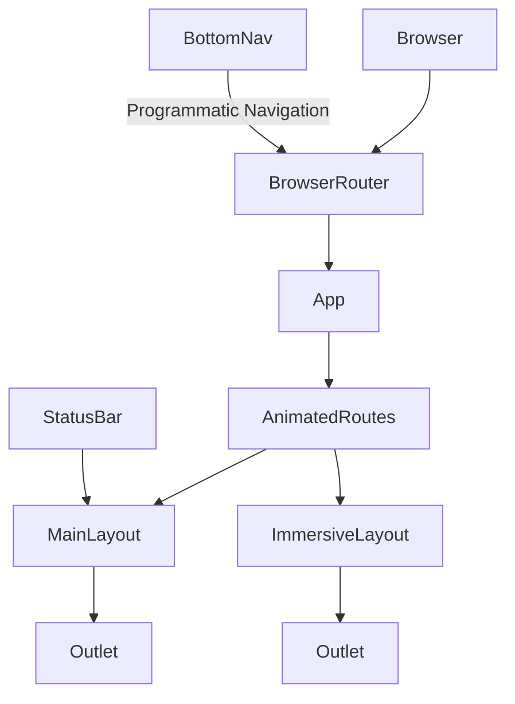
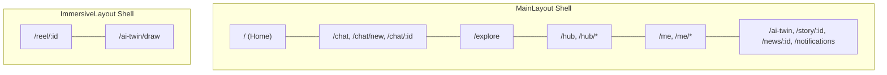
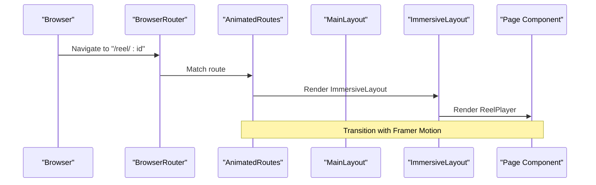
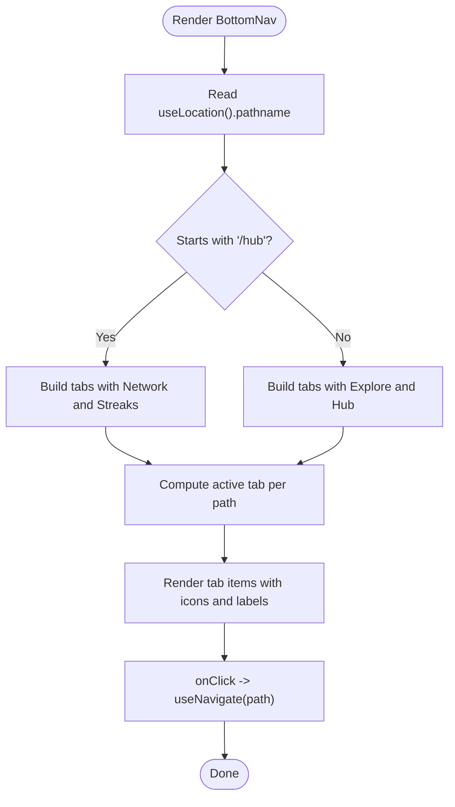
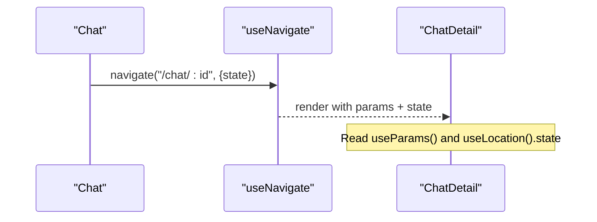
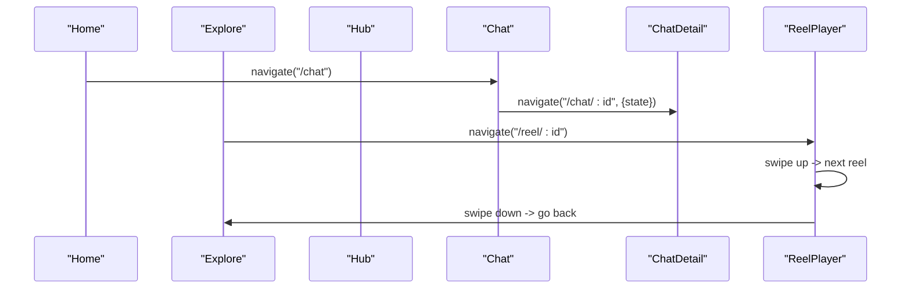
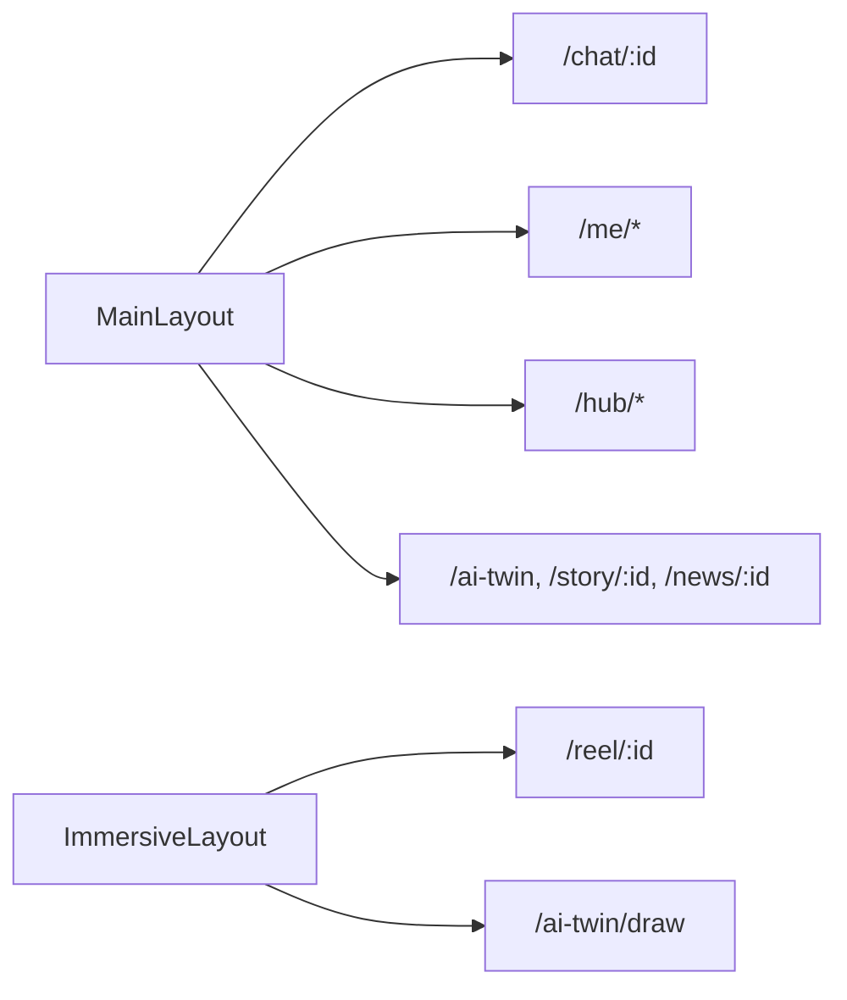
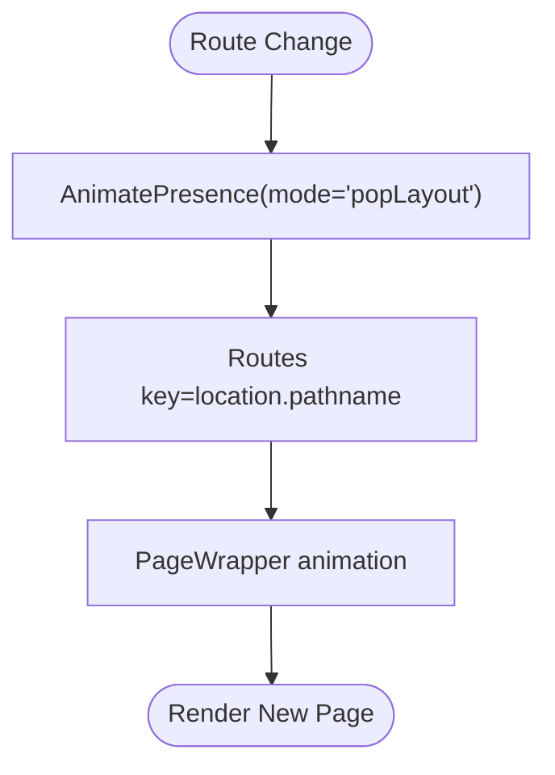
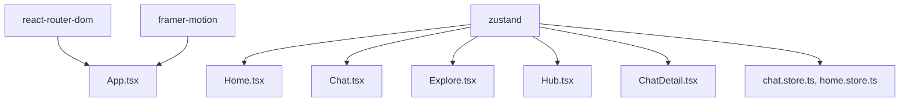

# Routing Patterns

<cite>
**Referenced Files in This Document**
- [App.tsx](file://src/App.tsx)
- [main.tsx](file://src/main.tsx)
- [MainLayout.tsx](file://src/components/layouts/MainLayout.tsx)
- [ImmersiveLayout.tsx](file://src/components/layouts/ImmersiveLayout.tsx)
- [BottomNav.tsx](file://src/components/BottomNav.tsx)
- [StatusBar.tsx](file://src/components/StatusBar.tsx)
- [Home.tsx](file://src/pages/Home.tsx)
- [Chat.tsx](file://src/pages/Chat.tsx)
- [Explore.tsx](file://src/pages/Explore.tsx)
- [Hub.tsx](file://src/pages/Hub.tsx)
- [ChatDetail.tsx](file://src/pages/ChatDetail.tsx)
- [ReelPlayer.tsx](file://src/pages/ReelPlayer.tsx)
- [chat.store.ts](file://src/store/chat.store.ts)
- [home.store.ts](file://src/store/home.store.ts)
- [package.json](file://package.json)
</cite>

## Table of Contents
1. [Introduction](#introduction)
2. [Project Structure](#project-structure)
3. [Core Components](#core-components)
4. [Architecture Overview](#architecture-overview)
5. [Detailed Component Analysis](#detailed-component-analysis)
6. [Dependency Analysis](#dependency-analysis)
7. [Performance Considerations](#performance-considerations)
8. [Troubleshooting Guide](#troubleshooting-guide)
9. [Conclusion](#conclusion)
10. [Appendices](#appendices)

## Introduction
This document explains VChat’s routing architecture and navigation patterns. It covers React Router DOM configuration, route definitions, lazy loading with dynamic imports, context-aware routing between MainLayout and ImmersiveLayout, bottom navigation integration, route parameters and state handling, animation transitions, and deep linking support. Practical examples demonstrate nested routing, programmatic navigation, and route-based code splitting. Guidance is also included for performance optimization, SEO considerations for SPAs, and accessibility patterns for keyboard navigation.

## Project Structure
VChat organizes routing around a central App shell that configures React Router DOM and wraps pages with layout components. Pages are grouped by feature areas (Home, Chat, Explore, Hub, Me, AI, etc.), and navigation is coordinated by a bottom navigation bar that adapts to context (e.g., switching Explore to Network in Hub mode).

**Diagram sources**
- [App.tsx:150-156](file://src/App.tsx#L150-L156)
- [App.tsx:66-133](file://src/App.tsx#L66-L133)
- [MainLayout.tsx:7-29](file://src/components/layouts/MainLayout.tsx#L7-L29)
- [ImmersiveLayout.tsx:5-19](file://src/components/layouts/ImmersiveLayout.tsx#L5-L19)
- [BottomNav.tsx:5-62](file://src/components/BottomNav.tsx#L5-L62)

**Section sources**
- [main.tsx:1-11](file://src/main.tsx#L1-L11)
- [App.tsx:150-156](file://src/App.tsx#L150-L156)

## Core Components
- App shell initializes the router and defines all routes with lazy-loaded page components.
- AnimatedRoutes coordinates route transitions using AnimatePresence and Framer Motion.
- MainLayout renders the top status bar, page content area, and animated bottom navigation.
- ImmersiveLayout hides the status bar and adjusts content margins for immersive experiences.
- BottomNav provides context-aware navigation, dynamically switching Explore to Network when in Hub mode.

Key routing capabilities:
- Lazy loading via React.lazy and dynamic imports for all pages.
- Nested routes with shared layouts (MainLayout and ImmersiveLayout).
- Route parameters (e.g., /chat/:id, /reel/:id) and route state (e.g., Chat → ChatDetail).
- Programmatic navigation using useNavigate and contextual click handlers.
- Context-aware bottom navigation that reflects current route context.

**Section sources**
- [App.tsx:12-50](file://src/App.tsx#L12-L50)
- [App.tsx:66-133](file://src/App.tsx#L66-L133)
- [MainLayout.tsx:7-29](file://src/components/layouts/MainLayout.tsx#L7-L29)
- [ImmersiveLayout.tsx:5-19](file://src/components/layouts/ImmersiveLayout.tsx#L5-L19)
- [BottomNav.tsx:5-62](file://src/components/BottomNav.tsx#L5-L62)

## Architecture Overview
The routing system separates concerns between layout contexts and page-level logic. Routes are grouped under two layout shells:
- MainLayout: Home, Chat, Explore, Hub, Me, AI, and generic pages.
- ImmersiveLayout: Reels and AI drawing canvas.

**Diagram sources**
- [App.tsx:72-129](file://src/App.tsx#L72-L129)

## Detailed Component Analysis

### Animated Routes and Layout Switching
AnimatedRoutes wraps all routes with AnimatePresence and uses Framer Motion to animate page transitions. It selects between MainLayout and ImmersiveLayout based on the current path, ensuring appropriate UI affordances for immersive versus app-shell experiences.

**Diagram sources**
- [App.tsx:66-133](file://src/App.tsx#L66-L133)
- [ImmersiveLayout.tsx:5-19](file://src/components/layouts/ImmersiveLayout.tsx#L5-L19)
- [ReelPlayer.tsx:7-219](file://src/pages/ReelPlayer.tsx#L7-L219)

**Section sources**
- [App.tsx:52-64](file://src/App.tsx#L52-L64)
- [App.tsx:66-133](file://src/App.tsx#L66-L133)

### Context-Aware Bottom Navigation
BottomNav computes active state based on the current path and toggles labels/icons depending on whether the user is in Hub mode. It supports:
- Programmatic navigation via useNavigate.
- Right-click action to open AI Twin from Home.
- Conditional styling and badges.

**Diagram sources**
- [BottomNav.tsx:5-62](file://src/components/BottomNav.tsx#L5-L62)

**Section sources**
- [BottomNav.tsx:9-23](file://src/components/BottomNav.tsx#L9-L23)
- [BottomNav.tsx:27-58](file://src/components/BottomNav.tsx#L27-L58)

### Route Parameters and State Handling
- Parameterized routes: /chat/:id, /reel/:id, /story/:id, /news/:id.
- Route state: Chat navigates to ChatDetail with state containing chat metadata.
- Example usage:
  - Chat → ChatDetail: pass state with metadata; read via useLocation().
  - ReelPlayer: useParams to resolve current reel; navigate with replace semantics for swipe gestures.

**Diagram sources**
- [Chat.tsx:81-92](file://src/pages/Chat.tsx#L81-L92)
- [ChatDetail.tsx:10-36](file://src/pages/ChatDetail.tsx#L10-L36)

**Section sources**
- [Chat.tsx:81-92](file://src/pages/Chat.tsx#L81-L92)
- [ChatDetail.tsx:10-36](file://src/pages/ChatDetail.tsx#L10-L36)
- [ReelPlayer.tsx:8-25](file://src/pages/ReelPlayer.tsx#L8-L25)

### Programmatic Navigation Patterns
- Home: navigates to notifications and Me.
- Explore: navigates to reels and posts; uses AnimatePresence for tab transitions.
- Hub: navigates to government services, daily services, and professional apps.
- ChatDetail: navigates back to Chat list.
- ReelPlayer: swipe up/down navigates to next/previous reel; double-tap heart triggers animation and likes.

**Diagram sources**
- [Home.tsx:35-54](file://src/pages/Home.tsx#L35-L54)
- [Explore.tsx:158-159](file://src/pages/Explore.tsx#L158-L159)
- [Hub.tsx:104-116](file://src/pages/Hub.tsx#L104-L116)
- [ChatDetail.tsx:57-58](file://src/pages/ChatDetail.tsx#L57-L58)
- [ReelPlayer.tsx:32-41](file://src/pages/ReelPlayer.tsx#L32-L41)

**Section sources**
- [Home.tsx:35-54](file://src/pages/Home.tsx#L35-L54)
- [Explore.tsx:158-159](file://src/pages/Explore.tsx#L158-L159)
- [Hub.tsx:104-116](file://src/pages/Hub.tsx#L104-L116)
- [ChatDetail.tsx:57-58](file://src/pages/ChatDetail.tsx#L57-L58)
- [ReelPlayer.tsx:32-41](file://src/pages/ReelPlayer.tsx#L32-L41)

### Nested Routing and Layouts
Nested routes are defined under MainLayout and ImmersiveLayout. Examples:
- MainLayout: /chat/:id, /me/*, /hub/*, /ai-twin, /story/:id, /news/:id.
- ImmersiveLayout: /reel/:id, /ai-twin/draw.

**Diagram sources**
- [App.tsx:72-129](file://src/App.tsx#L72-L129)

**Section sources**
- [App.tsx:72-129](file://src/App.tsx#L72-L129)

### Animation Transitions and Page Wrappers
PageWrapper applies a consistent entrance/exit animation to all routed pages. AnimatedRoutes uses AnimatePresence with popLayout mode and a location-based key to trigger transitions when navigating between routes.

**Diagram sources**
- [App.tsx:52-64](file://src/App.tsx#L52-L64)
- [App.tsx:66-71](file://src/App.tsx#L66-L71)

**Section sources**
- [App.tsx:52-64](file://src/App.tsx#L52-L64)
- [App.tsx:66-71](file://src/App.tsx#L66-L71)

### Route Guards and Authentication
- Current implementation does not include explicit route guards in the routing configuration.
- Authentication and permission checks are typically handled at the component level (e.g., redirecting unauthenticated users inside pages or wrappers).
- Recommendation: Integrate a guard mechanism using a custom hook that reads auth state and conditionally renders routes or redirects.

[No sources needed since this section provides general guidance]

### Deep Linking Support
Deep links are supported via parameterized routes and state passing:
- /chat/:id allows direct access to a chat thread.
- /reel/:id enables direct access to a specific reel.
- State can be passed during navigation to prefill page data (e.g., ChatDetail).

**Section sources**
- [ChatDetail.tsx:10-36](file://src/pages/ChatDetail.tsx#L10-L36)
- [ReelPlayer.tsx:8-25](file://src/pages/ReelPlayer.tsx#L8-L25)

### Route-Based Code Splitting
All page components are lazy-loaded using React.lazy with dynamic imports. This ensures that each route’s bundle is loaded only when requested, reducing initial bundle size.

**Section sources**
- [App.tsx:12-50](file://src/App.tsx#L12-L50)

## Dependency Analysis
Routing relies on React Router DOM and Framer Motion for animations. Zustand stores are used within pages to manage UI state and interactions.

**Diagram sources**
- [package.json:12-18](file://package.json#L12-L18)
- [App.tsx:12-50](file://src/App.tsx#L12-L50)
- [Home.tsx:1-6](file://src/pages/Home.tsx#L1-L6)
- [Chat.tsx:1-6](file://src/pages/Chat.tsx#L1-L6)
- [Explore.tsx:1-7](file://src/pages/Explore.tsx#L1-L7)
- [Hub.tsx:1-6](file://src/pages/Hub.tsx#L1-L6)
- [ChatDetail.tsx:1-8](file://src/pages/ChatDetail.tsx#L1-L8)
- [chat.store.ts:1-349](file://src/store/chat.store.ts#L1-L349)
- [home.store.ts:1-103](file://src/store/home.store.ts#L1-L103)

**Section sources**
- [package.json:12-18](file://package.json#L12-L18)
- [chat.store.ts:171-330](file://src/store/chat.store.ts#L171-L330)
- [home.store.ts:31-102](file://src/store/home.store.ts#L31-L102)

## Performance Considerations
- Lazy loading: Keep pages lazy-loaded to minimize initial payload.
- Transition animations: Keep durations short and avoid heavy transforms on large DOM subtrees.
- Suspense boundaries: Ensure fallbacks are lightweight to reduce perceived load time.
- Route keys: Using location.pathname as key helps reset animations but can cause re-mounts—balance with memoization where appropriate.
- Bottom navigation: Avoid unnecessary re-renders by deriving active state from location only.

[No sources needed since this section provides general guidance]

## Troubleshooting Guide
Common issues and remedies:
- Blank screen after navigation: Verify lazy-loaded components resolve correctly and that Suspense fallbacks are present in layouts.
- Bottom nav not highlighting: Confirm isActive logic matches the intended path prefixes and special cases (e.g., Home exact match).
- State not passed to ChatDetail: Ensure navigate() includes state and that ChatDetail reads useLocation().state.
- Reel swipe navigation not working: Confirm replace: true is used for in-place updates and that navigate(-1) returns to Explore when reaching the first item.

**Section sources**
- [MainLayout.tsx:15-17](file://src/components/layouts/MainLayout.tsx#L15-L17)
- [ImmersiveLayout.tsx:13-15](file://src/components/layouts/ImmersiveLayout.tsx#L13-L15)
- [BottomNav.tsx:28-30](file://src/components/BottomNav.tsx#L28-L30)
- [Chat.tsx:83-84](file://src/pages/Chat.tsx#L83-L84)
- [ChatDetail.tsx:22-36](file://src/pages/ChatDetail.tsx#L22-L36)
- [ReelPlayer.tsx:32-41](file://src/pages/ReelPlayer.tsx#L32-L41)

## Conclusion
VChat’s routing architecture cleanly separates layout contexts, leverages lazy loading for performance, and integrates smooth animations for transitions. The context-aware bottom navigation and parameterized routes enable intuitive, immersive experiences across Home, Chat, Explore, Hub, and Reels. Extending the system with route guards, SEO-friendly meta tags, and robust accessibility patterns will further strengthen the SPA navigation model.

## Appendices

### Practical Examples Index
- Lazy loading: [App.tsx:12-50](file://src/App.tsx#L12-L50)
- Nested routes: [App.tsx:72-129](file://src/App.tsx#L72-L129)
- Programmatic navigation: [Home.tsx:35-54](file://src/pages/Home.tsx#L35-L54), [Chat.tsx:81-92](file://src/pages/Chat.tsx#L81-L92), [ReelPlayer.tsx:32-41](file://src/pages/ReelPlayer.tsx#L32-L41)
- Route parameters/state: [ChatDetail.tsx:10-36](file://src/pages/ChatDetail.tsx#L10-L36), [ReelPlayer.tsx:8-25](file://src/pages/ReelPlayer.tsx#L8-L25)
- Context-aware bottom nav: [BottomNav.tsx:9-23](file://src/components/BottomNav.tsx#L9-L23)