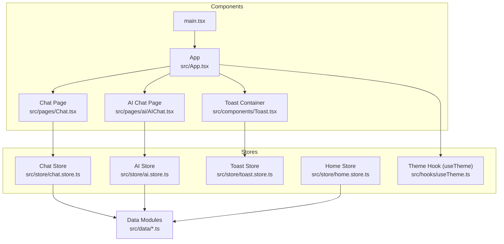
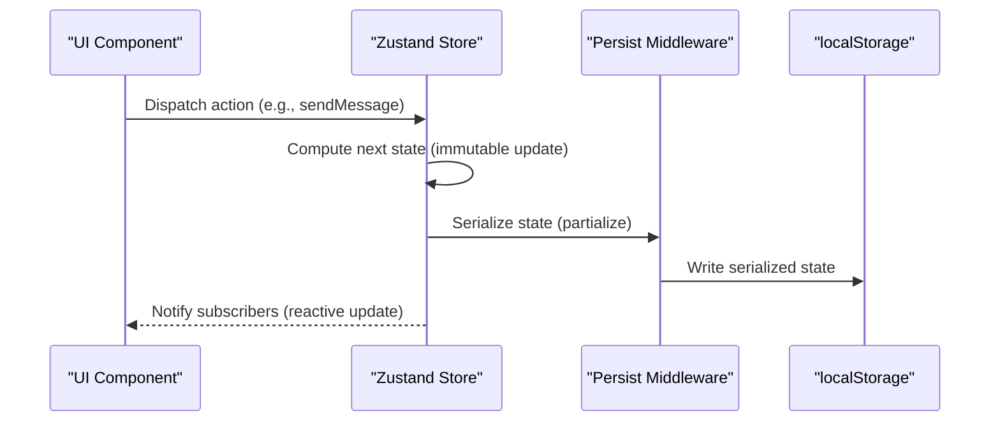
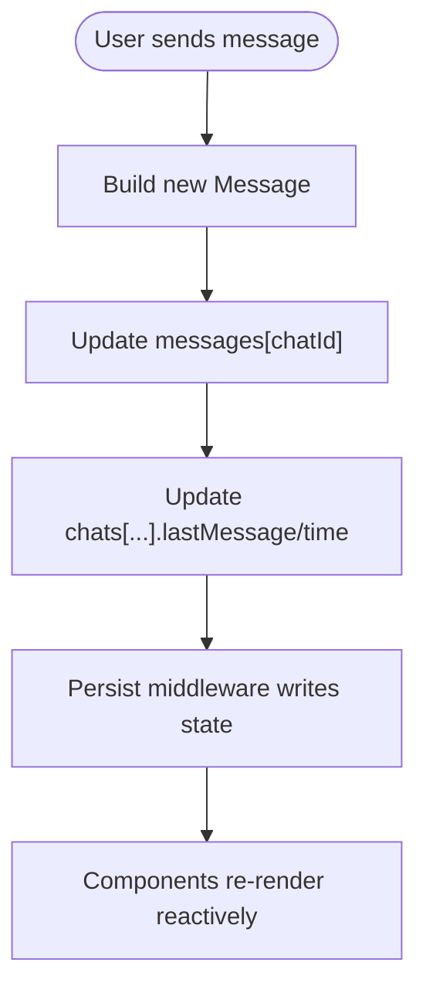
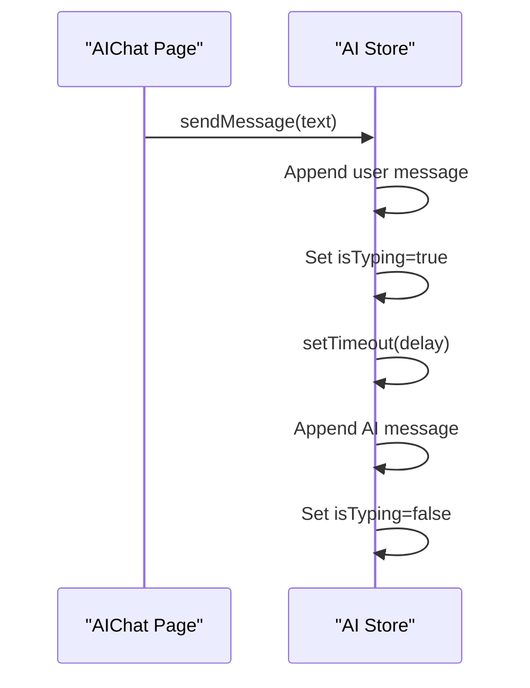
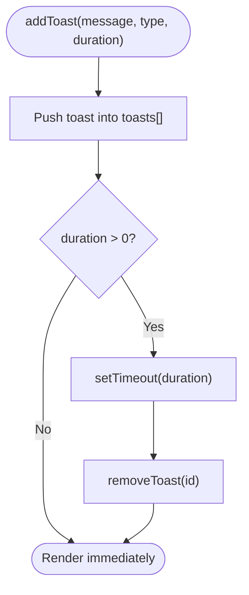
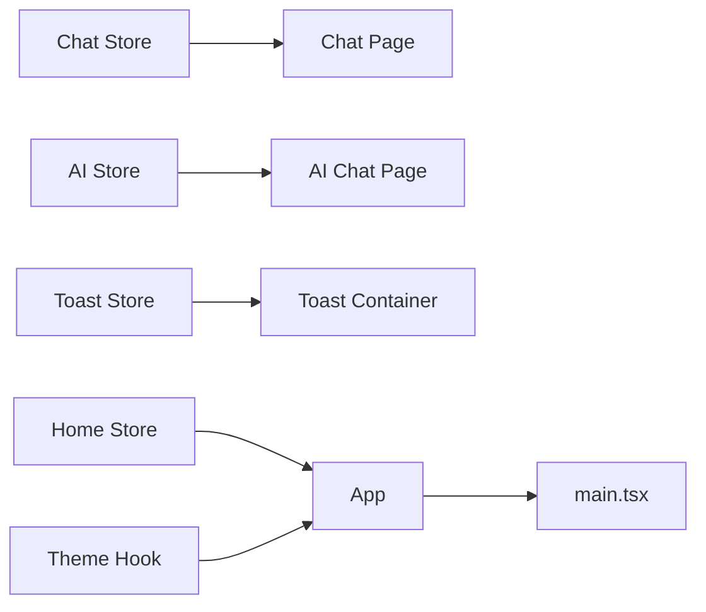

# State Management Architecture

<cite>
**Referenced Files in This Document**
- [chat.store.ts](file://src/store/chat.store.ts)
- [ai.store.ts](file://src/store/ai.store.ts)
- [toast.store.ts](file://src/store/toast.store.ts)
- [home.store.ts](file://src/store/home.store.ts)
- [useTheme.ts](file://src/hooks/useTheme.ts)
- [Toast.tsx](file://src/components/Toast.tsx)
- [Chat.tsx](file://src/pages/Chat.tsx)
- [AIChat.tsx](file://src/pages/ai/AIChat.tsx)
- [App.tsx](file://src/App.tsx)
- [main.tsx](file://src/main.tsx)
- [chat.data.ts](file://src/data/chat.data.ts)
- [chatDetail.data.ts](file://src/data/chatDetail.data.ts)
- [ai.data.ts](file://src/data/ai.data.ts)
</cite>

## Table of Contents
1. [Introduction](#introduction)
2. [Project Structure](#project-structure)
3. [Core Components](#core-components)
4. [Architecture Overview](#architecture-overview)
5. [Detailed Component Analysis](#detailed-component-analysis)
6. [Dependency Analysis](#dependency-analysis)
7. [Performance Considerations](#performance-considerations)
8. [Troubleshooting Guide](#troubleshooting-guide)
9. [Conclusion](#conclusion)
10. [Appendices](#appendices)

## Introduction
This document explains VChat’s state management architecture built on Zustand. The system organizes state into focused, independent stores:
- Chat store: manages conversations, messages, filters, and search.
- AI store: powers the AI assistant chat with simulated responses and typing indicators.
- Toast store: centralizes transient notifications with auto-dismissal.
- Home store: maintains feed content, insights, and notification counters.
- Theme store (via a hook): persists theme preference.

Each store encapsulates its state shape, actions, and persistence strategy. Components subscribe to slices of state using the store hooks, enabling reactive UI updates. Persistence is implemented via Zustand’s persist middleware with selective serialization to localStorage. Async flows leverage timers and simulated network-like delays. Cross-store communication is achieved through coordinated actions and shared UI patterns.

## Project Structure
The state management lives under src/store with supporting data modules under src/data. Components consume stores via dedicated hooks and render reactive UI.

**Diagram sources**
- [chat.store.ts:1-349](file://src/store/chat.store.ts#L1-L349)
- [ai.store.ts:1-162](file://src/store/ai.store.ts#L1-L162)
- [toast.store.ts:1-39](file://src/store/toast.store.ts#L1-L39)
- [home.store.ts:1-103](file://src/store/home.store.ts#L1-L103)
- [useTheme.ts:1-36](file://src/hooks/useTheme.ts#L1-L36)
- [Toast.tsx:1-53](file://src/components/Toast.tsx#L1-L53)
- [Chat.tsx:1-245](file://src/pages/Chat.tsx#L1-L245)
- [AIChat.tsx:1-127](file://src/pages/ai/AIChat.tsx#L1-L127)
- [App.tsx:1-156](file://src/App.tsx#L1-L156)
- [main.tsx:1-11](file://src/main.tsx#L1-L11)
- [chat.data.ts:1-134](file://src/data/chat.data.ts#L1-L134)
- [chatDetail.data.ts:1-71](file://src/data/chatDetail.data.ts#L1-L71)
- [ai.data.ts:1-102](file://src/data/ai.data.ts#L1-L102)

**Section sources**
- [chat.store.ts:1-349](file://src/store/chat.store.ts#L1-L349)
- [ai.store.ts:1-162](file://src/store/ai.store.ts#L1-L162)
- [toast.store.ts:1-39](file://src/store/toast.store.ts#L1-L39)
- [home.store.ts:1-103](file://src/store/home.store.ts#L1-L103)
- [useTheme.ts:1-36](file://src/hooks/useTheme.ts#L1-L36)
- [Toast.tsx:1-53](file://src/components/Toast.tsx#L1-L53)
- [Chat.tsx:1-245](file://src/pages/Chat.tsx#L1-L245)
- [AIChat.tsx:1-127](file://src/pages/ai/AIChat.tsx#L1-L127)
- [App.tsx:1-156](file://src/App.tsx#L1-L156)
- [main.tsx:1-11](file://src/main.tsx#L1-L11)
- [chat.data.ts:1-134](file://src/data/chat.data.ts#L1-L134)
- [chatDetail.data.ts:1-71](file://src/data/chatDetail.data.ts#L1-L71)
- [ai.data.ts:1-102](file://src/data/ai.data.ts#L1-L102)

## Core Components
- Chat Store
  - State shape: chats array, messages map keyed by chatId, activeFilter, searchQuery.
  - Actions: sendMessage, markAsRead, setFilter, setSearchQuery, getFilteredChats, createChat, simulateReply.
  - Persistence: selective serialization of chats, messages, activeFilter, searchQuery.
  - Data seeding: context groups, direct messages, and spaces from data modules; message conversion from chatDetail data.
- AI Store
  - State shape: messages array, isTyping flag.
  - Actions: sendMessage (pushes user message, toggles typing, simulates AI reply after a delay), clearHistory.
  - Persistence: stores messages and typing state.
  - Simulated responses: keyword-driven replies with randomized defaults.
- Toast Store
  - State shape: toasts array.
  - Actions: addToast (auto-dismisses after duration), removeToast.
  - No persistence: ephemeral notifications.
- Home Store
  - State shape: stories, newsItems, aiInsights; seenStories, dismissedInsights, unreadNotifications, storyTab.
  - Actions: markStorySeen, dismissInsight, setStoryTab, clearNotifications, getGreeting, getVisibleInsights.
  - Persistence: selective serialization of user-interaction flags and counters.
- Theme Hook (useTheme)
  - State shape: isDark, toggle, initTheme.
  - Persistence: theme preference stored in localStorage.
  - Side effect: applies/removes CSS class on document root.

**Section sources**
- [chat.store.ts:45-59](file://src/store/chat.store.ts#L45-L59)
- [chat.store.ts:171-330](file://src/store/chat.store.ts#L171-L330)
- [ai.store.ts:11-17](file://src/store/ai.store.ts#L11-L17)
- [ai.store.ts:113-161](file://src/store/ai.store.ts#L113-L161)
- [toast.store.ts:11-15](file://src/store/toast.store.ts#L11-L15)
- [toast.store.ts:17-38](file://src/store/toast.store.ts#L17-L38)
- [home.store.ts:12-29](file://src/store/home.store.ts#L12-L29)
- [home.store.ts:31-102](file://src/store/home.store.ts#L31-L102)
- [useTheme.ts:4-35](file://src/hooks/useTheme.ts#L4-L35)

## Architecture Overview
Zustand enables a straightforward store-based architecture:
- Each store is a single file exporting a hook created with create.
- Middleware (persist) wraps the store factory to serialize/deserialize state to localStorage.
- Components subscribe to the store via the exported hook and re-render on state changes.
- Async operations (sending messages, simulating replies) update state immutably via set or set callbacks.

**Diagram sources**
- [chat.store.ts:171-330](file://src/store/chat.store.ts#L171-L330)
- [ai.store.ts:113-161](file://src/store/ai.store.ts#L113-L161)
- [toast.store.ts:17-38](file://src/store/toast.store.ts#L17-L38)
- [home.store.ts:31-102](file://src/store/home.store.ts#L31-L102)
- [useTheme.ts:10-35](file://src/hooks/useTheme.ts#L10-L35)

## Detailed Component Analysis

### Chat Store
- State shape and actions
  - chats: array of chat entries with metadata (name, avatar, lastMessage, time, unread, type).
  - messages: map from chatId to array of Message objects.
  - activeFilter and searchQuery control UI filtering and search.
  - Actions mutate state immutably and coordinate updates across chats and messages.
- Persistence strategy
  - Uses persist with a name and partialize to save only selected fields.
- Hydration process
  - On app load, persisted fields hydrate the store before components mount.
- Async behavior
  - simulateReply schedules a delayed reply and updates both messages and chat unread count.

**Diagram sources**
- [chat.store.ts:179-200](file://src/store/chat.store.ts#L179-L200)
- [chat.store.ts:194-199](file://src/store/chat.store.ts#L194-L199)
- [chat.store.ts:320-329](file://src/store/chat.store.ts#L320-L329)

**Section sources**
- [chat.store.ts:9-43](file://src/store/chat.store.ts#L9-L43)
- [chat.store.ts:45-59](file://src/store/chat.store.ts#L45-L59)
- [chat.store.ts:171-330](file://src/store/chat.store.ts#L171-L330)
- [chat.store.ts:320-329](file://src/store/chat.store.ts#L320-L329)
- [chat.data.ts:35-134](file://src/data/chat.data.ts#L35-L134)
- [chatDetail.data.ts:19-70](file://src/data/chatDetail.data.ts#L19-L70)

### AI Store
- State shape and actions
  - messages: ordered array of AIMessage entries.
  - isTyping: indicates AI thinking state.
  - sendMessage pushes user message, sets typing, and after a delay pushes an AI response.
- Persistence strategy
  - Stores messages and typing state; does not persist isTyping across sessions.
- Async behavior
  - Uses setTimeout to simulate AI response timing.

**Diagram sources**
- [ai.store.ts:119-148](file://src/store/ai.store.ts#L119-L148)
- [AIChat.tsx:22-26](file://src/pages/ai/AIChat.tsx#L22-L26)

**Section sources**
- [ai.store.ts:4-17](file://src/store/ai.store.ts#L4-L17)
- [ai.store.ts:113-161](file://src/store/ai.store.ts#L113-L161)
- [AIChat.tsx:1-127](file://src/pages/ai/AIChat.tsx#L1-127)
- [ai.data.ts:75-101](file://src/data/ai.data.ts#L75-L101)

### Toast Store
- State shape and actions
  - toasts: array of ToastMessage entries.
  - addToast creates a toast and optionally auto-dismisses it.
  - removeToast removes a specific toast.
- Persistence strategy
  - Not persisted; toasts are ephemeral.

**Diagram sources**
- [toast.store.ts:17-38](file://src/store/toast.store.ts#L17-L38)
- [Toast.tsx:6-52](file://src/components/Toast.tsx#L6-L52)

**Section sources**
- [toast.store.ts:1-39](file://src/store/toast.store.ts#L1-L39)
- [Toast.tsx:1-53](file://src/components/Toast.tsx#L1-L53)

### Home Store
- State shape and actions
  - Content lists: stories, newsItems, aiInsights.
  - Interaction flags: seenStories, dismissedInsights, unreadNotifications, storyTab.
  - Actions: markStorySeen, dismissInsight, setStoryTab, clearNotifications, getGreeting, getVisibleInsights.
- Persistence strategy
  - Partial serialization of user-interaction fields and counters.

**Section sources**
- [home.store.ts:12-29](file://src/store/home.store.ts#L12-L29)
- [home.store.ts:31-102](file://src/store/home.store.ts#L31-L102)

### Theme Hook (useTheme)
- State shape and actions
  - isDark: boolean theme flag.
  - toggle: flips theme and updates document class.
  - initTheme: ensures document class reflects stored preference.
- Persistence strategy
  - Persisted to localStorage with a dedicated name.

**Section sources**
- [useTheme.ts:4-35](file://src/hooks/useTheme.ts#L4-L35)

## Dependency Analysis
Stores are independent and intentionally decoupled. Cross-store communication is minimal and typically occurs at the component level:
- Components import multiple stores and orchestrate actions.
- UI layout (App) composes pages and containers that subscribe to different stores.

**Diagram sources**
- [Chat.tsx:5-77](file://src/pages/Chat.tsx#L5-L77)
- [AIChat.tsx:5-12](file://src/pages/ai/AIChat.tsx#L5-L12)
- [Toast.tsx:3-7](file://src/components/Toast.tsx#L3-L7)
- [App.tsx:66-147](file://src/App.tsx#L66-L147)
- [main.tsx:6-10](file://src/main.tsx#L6-L10)

**Section sources**
- [Chat.tsx:1-245](file://src/pages/Chat.tsx#L1-L245)
- [AIChat.tsx:1-127](file://src/pages/ai/AIChat.tsx#L1-L127)
- [Toast.tsx:1-53](file://src/components/Toast.tsx#L1-L53)
- [App.tsx:1-156](file://src/App.tsx#L1-L156)
- [main.tsx:1-11](file://src/main.tsx#L1-L11)

## Performance Considerations
- Subscription granularity
  - Subscribe to small slices of state to minimize re-renders. Prefer destructuring individual fields when only a few are needed.
- Selector optimization
  - For derived computations (e.g., filtered chats), compute results inside the store action to avoid recomputation in components.
- Immutable updates
  - Use functional set forms to ensure shallow comparisons remain efficient.
- Persistence overhead
  - Keep partialize selectors minimal to reduce serialization cost and localStorage footprint.
- Large state trees
  - Split concerns into smaller stores (already done). Avoid nesting large objects; prefer normalized structures (as seen with messages keyed by chatId).
- Async operations
  - Debounce or batch UI updates around frequent async events (e.g., typing indicators) to prevent thrashing.

[No sources needed since this section provides general guidance]

## Troubleshooting Guide
- State not persisting
  - Verify persist config name and partialize fields. Ensure localStorage is available and not blocked by browser settings.
- Unexpected re-renders
  - Check subscription scope in components. Narrow subscriptions to only required fields.
- Asynchronous state drift
  - Confirm that async updates (e.g., simulateReply) occur within the store’s set callback and that UI relies on store state rather than stale closures.
- Toasts not disappearing
  - Ensure addToast duration is greater than zero and that removeToast is invoked by the toast item’s close handler.
- Hydration mismatches
  - Confirm initial state seeding aligns with persisted data. For seeded arrays/maps, ensure deterministic hydration.

**Section sources**
- [chat.store.ts:320-329](file://src/store/chat.store.ts#L320-L329)
- [toast.store.ts:19-31](file://src/store/toast.store.ts#L19-L31)
- [AIChat.tsx:18-20](file://src/pages/ai/AIChat.tsx#L18-L20)

## Conclusion
VChat’s Zustand-based architecture cleanly separates concerns across stores, enabling scalable and maintainable state management. Persistence is selectively applied to meaningful state slices, while ephemeral UI concerns (toasts) remain transient. Components subscribe to precise slices, keeping updates efficient. The design supports cross-store coordination at the component layer and provides room for future enhancements such as advanced middleware, debugging tools, and selector memoization.

[No sources needed since this section summarizes without analyzing specific files]

## Appendices

### Practical Examples Index
- State composition
  - Chat store combines chats and messages maps for conversation management.
  - AI store composes user and AI messages into a single timeline.
- Cross-store communication
  - Layout and navigation orchestrate routing and page rendering; stores remain independent but UI coordinates actions.
- Async state management
  - AI store simulates network-like latency; chat store simulates replies with timeouts.

[No sources needed since this section indexes examples conceptually]