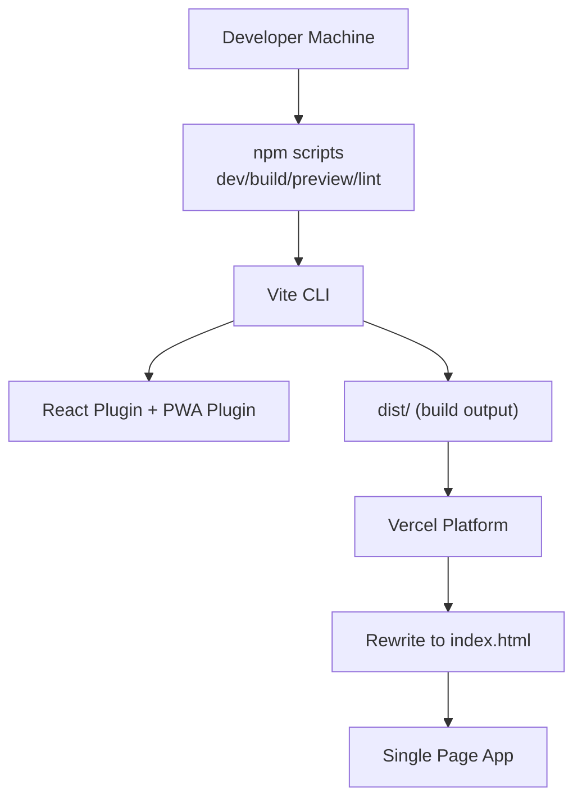
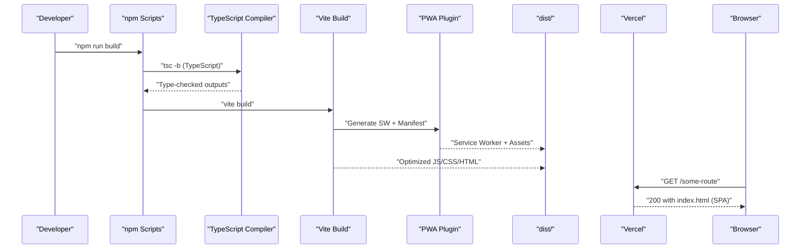
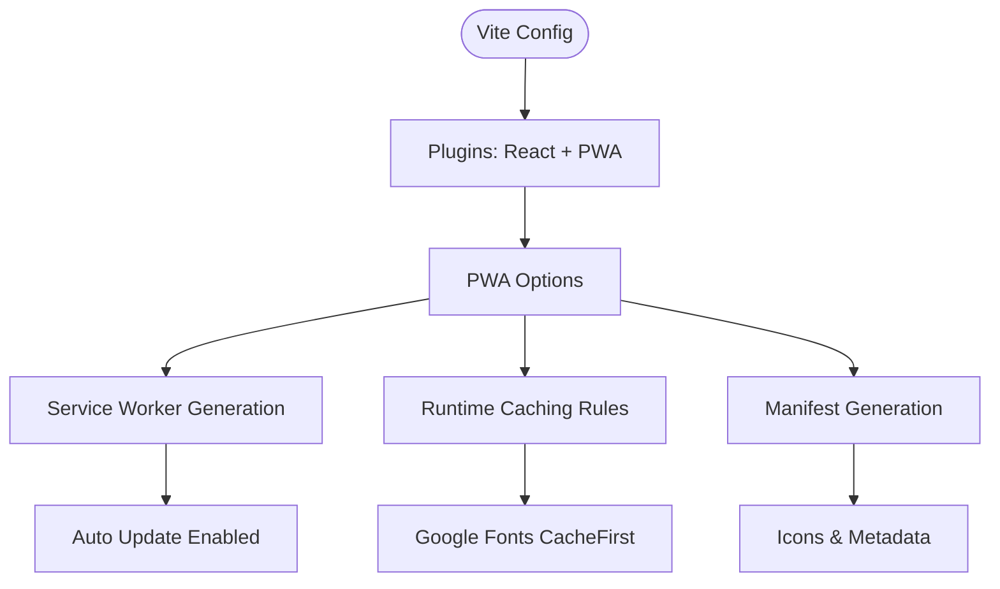
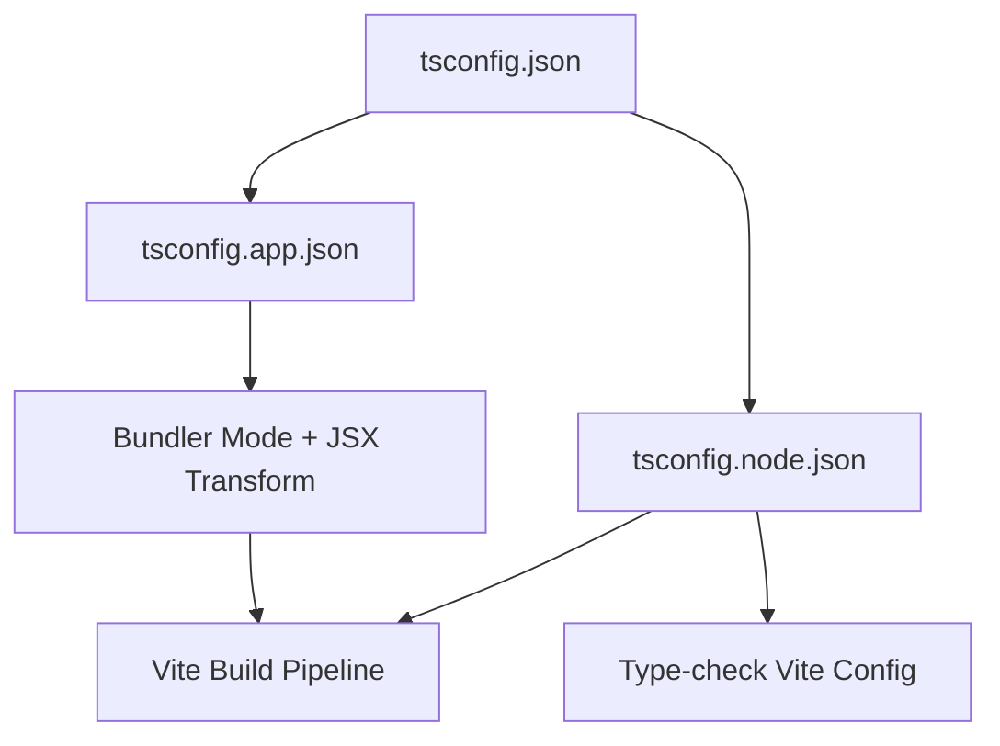
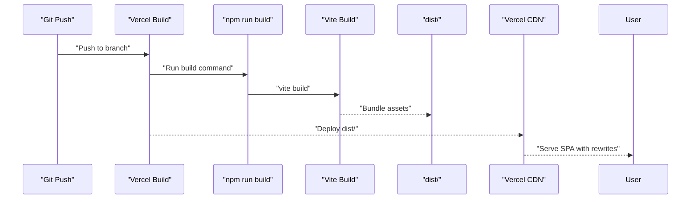
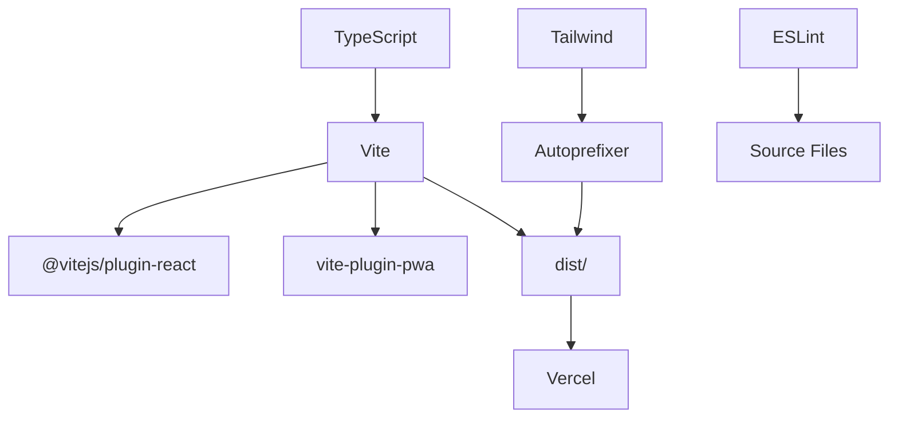

# Build and Deployment

<cite>
**Referenced Files in This Document**
- [vite.config.ts](file://vite.config.ts)
- [package.json](file://package.json)
- [vercel.json](file://vercel.json)
- [tsconfig.json](file://tsconfig.json)
- [tsconfig.app.json](file://tsconfig.app.json)
- [tsconfig.node.json](file://tsconfig.node.json)
- [postcss.config.js](file://postcss.config.js)
- [tailwind.config.js](file://tailwind.config.js)
- [eslint.config.js](file://eslint.config.js)
- [index.html](file://index.html)
- [src/main.tsx](file://src/main.tsx)
- [src/App.tsx](file://src/App.tsx)
</cite>

## Table of Contents
1. [Introduction](#introduction)
2. [Project Structure](#project-structure)
3. [Core Components](#core-components)
4. [Architecture Overview](#architecture-overview)
5. [Detailed Component Analysis](#detailed-component-analysis)
6. [Dependency Analysis](#dependency-analysis)
7. [Performance Considerations](#performance-considerations)
8. [Troubleshooting Guide](#troubleshooting-guide)
9. [Conclusion](#conclusion)
10. [Appendices](#appendices)

## Introduction
This document explains VChat’s build configuration and deployment strategy. It covers Vite configuration (plugins, PWA, caching), TypeScript compilation setup (targets, bundler mode, type checking), environment handling, and the Vercel deployment pipeline. It also provides guidance on build optimization, bundle analysis, performance monitoring, environment-specific configuration, secret management, validation, troubleshooting, and extension points for custom build steps.

## Project Structure
The project follows a frontend-first structure with a Vite-based build toolchain, TypeScript for type safety, Tailwind CSS for styling, and ESLint for code quality. Vercel is configured for SPA routing via rewrites.

**Diagram sources**
- [package.json:6-11](file://package.json#L6-L11)
- [vite.config.ts:6-56](file://vite.config.ts#L6-L56)
- [vercel.json:1-8](file://vercel.json#L1-L8)

**Section sources**
- [package.json:1-39](file://package.json#L1-L39)
- [vite.config.ts:1-57](file://vite.config.ts#L1-L57)
- [vercel.json:1-8](file://vercel.json#L1-L8)

## Core Components
- Vite configuration defines plugins (React and PWA), service worker caching, and app manifest.
- TypeScript configuration splits app and node contexts, enabling bundler mode and strictness.
- PostCSS and Tailwind integrate CSS tooling and design tokens.
- ESLint enforces linting rules for TSX and React Refresh.
- Vercel rewrites route fallbacks to support client-side routing.

**Section sources**
- [vite.config.ts:6-56](file://vite.config.ts#L6-L56)
- [tsconfig.json:1-8](file://tsconfig.json#L1-L8)
- [tsconfig.app.json:1-26](file://tsconfig.app.json#L1-L26)
- [tsconfig.node.json:1-25](file://tsconfig.node.json#L1-L25)
- [postcss.config.js:1-7](file://postcss.config.js#L1-L7)
- [tailwind.config.js:1-50](file://tailwind.config.js#L1-L50)
- [eslint.config.js:1-24](file://eslint.config.js#L1-L24)
- [vercel.json:1-8](file://vercel.json#L1-L8)

## Architecture Overview
The build and deployment pipeline connects developer commands to Vite, TypeScript, and Vercel.

**Diagram sources**
- [package.json:6-11](file://package.json#L6-L11)
- [vite.config.ts:6-56](file://vite.config.ts#L6-L56)
- [vercel.json:1-8](file://vercel.json#L1-L8)

## Detailed Component Analysis

### Vite Configuration
- Plugins
  - React plugin enables JSX transform and fast refresh.
  - PWA plugin configures auto-update registration, Workbox runtime caching, and app manifest generation.
- Service Worker and Caching
  - Glob patterns define cached file types.
  - Runtime caching strategy caches Google Fonts with a long TTL and specific cache name.
- Dev Options
  - PWA dev server support is enabled during development.
- Manifest
  - App identity, theme/background colors, and icon assets are defined for installability and PWA behavior.

**Diagram sources**
- [vite.config.ts:6-56](file://vite.config.ts#L6-L56)

**Section sources**
- [vite.config.ts:6-56](file://vite.config.ts#L6-L56)

### TypeScript Compilation Setup
- Root tsconfig delegates to app and node configs.
- App config
  - Targets ES2023, uses bundler module resolution, JSX with react-jsx, and disables emit for Vite’s pipeline.
  - Enables bundler mode flags and strict lint-style checks.
- Node config
  - Targets ES2023 for Vite config, uses bundler mode, and includes Vite config for type-checking.
- Type checking
  - TypeScript runs before Vite build via the npm script, ensuring type-safe builds.

**Diagram sources**
- [tsconfig.json:1-8](file://tsconfig.json#L1-L8)
- [tsconfig.app.json:1-26](file://tsconfig.app.json#L1-L26)
- [tsconfig.node.json:1-25](file://tsconfig.node.json#L1-L25)

**Section sources**
- [tsconfig.json:1-8](file://tsconfig.json#L1-L8)
- [tsconfig.app.json:1-26](file://tsconfig.app.json#L1-L26)
- [tsconfig.node.json:1-25](file://tsconfig.node.json#L1-L25)
- [package.json:6-11](file://package.json#L6-L11)

### CSS Tooling (PostCSS and Tailwind)
- PostCSS loads Tailwind and Autoprefixer.
- Tailwind scans HTML and TSX sources for class usage and defines design tokens mapped to CSS variables.

**Diagram sources**
- [postcss.config.js:1-7](file://postcss.config.js#L1-L7)
- [tailwind.config.js:1-50](file://tailwind.config.js#L1-L50)

**Section sources**
- [postcss.config.js:1-7](file://postcss.config.js#L1-L7)
- [tailwind.config.js:1-50](file://tailwind.config.js#L1-L50)

### Linting (ESLint)
- Flat config extends recommended TS and React rules, plus React Hooks and React Refresh presets.
- Ignores dist and targets TSX files for linting.

**Section sources**
- [eslint.config.js:1-24](file://eslint.config.js#L1-L24)

### Environment Variables and Secrets
- No explicit environment variable files are present in the repository snapshot.
- For Vercel deployments, secrets are managed via the platform dashboard and injected at build/runtime.
- Recommended practice:
  - Define environment variables in Vercel project settings.
  - Use a .env.local file for local development if needed, and add it to .gitignore.
  - Avoid committing secrets to version control.

[No sources needed since this section provides general guidance]

### Local Development and Preview
- Development server: npm run dev
- Production preview: npm run preview
- Entry point mounts the React app and renders routes.

**Section sources**
- [package.json:6-11](file://package.json#L6-L11)
- [src/main.tsx:1-11](file://src/main.tsx#L1-L11)
- [index.html:1-16](file://index.html#L1-L16)

### Vercel Deployment Strategy
- SPA Routing: All unmatched routes are rewritten to index.html so client-side routing works.
- Build Command: The project relies on the npm script that compiles TypeScript then runs Vite build.
- Output Directory: Vite emits to dist/, which Vercel serves.

**Diagram sources**
- [vercel.json:1-8](file://vercel.json#L1-L8)
- [package.json:6-11](file://package.json#L6-L11)
- [vite.config.ts:6-56](file://vite.config.ts#L6-L56)

**Section sources**
- [vercel.json:1-8](file://vercel.json#L1-L8)
- [package.json:6-11](file://package.json#L6-L11)

## Dependency Analysis
- Build-time dependencies
  - Vite, React plugin, and PWA plugin form the core build stack.
  - TypeScript compiles TS/TSX; Vite consumes compiled outputs.
  - Tailwind and Autoprefixer process CSS.
  - ESLint validates code quality.
- Runtime dependencies
  - React, React DOM, React Router DOM, Framer Motion, Lucide React, Zustand power the UI and state.

**Diagram sources**
- [package.json:12-37](file://package.json#L12-L37)
- [vite.config.ts:6-56](file://vite.config.ts#L6-L56)
- [postcss.config.js:1-7](file://postcss.config.js#L1-L7)
- [tailwind.config.js:1-50](file://tailwind.config.js#L1-L50)

**Section sources**
- [package.json:12-37](file://package.json#L12-L37)

## Performance Considerations
- Code Splitting and Lazy Loading
  - Dynamic imports are used for routes, enabling per-route bundles and reduced initial load.
- Tree Shaking
  - Bundler module resolution and ESM usage improve dead-code elimination.
- Bundle Analysis
  - Use Vite’s built-in preview server and external tools to inspect bundle composition.
- Asset Handling
  - PWA runtime caching reduces network requests for static assets and fonts.
- CSS Optimization
  - Tailwind purges unused classes; ensure content globs cover all template locations.
- Monitoring
  - Integrate web vitals or analytics to track real-user performance after deployment.

**Section sources**
- [src/App.tsx:12-50](file://src/App.tsx#L12-L50)
- [vite.config.ts:6-56](file://vite.config.ts#L6-L56)
- [tailwind.config.js:3-6](file://tailwind.config.js#L3-L6)

## Troubleshooting Guide
- Build fails due to type errors
  - Run the TypeScript build step prior to Vite to surface type issues early.
- PWA not updating or caching stale assets
  - Verify Workbox runtime caching rules and cache names; test service worker registration behavior.
- SPA navigation returns 404
  - Confirm Vercel rewrites target index.html for all routes.
- CSS not applied or purge removes needed classes
  - Adjust Tailwind content globs to include all template paths.
- Lint failures
  - Fix reported issues or adjust ESLint configuration as needed.

**Section sources**
- [package.json:6-11](file://package.json#L6-L11)
- [vite.config.ts:6-56](file://vite.config.ts#L6-L56)
- [vercel.json:1-8](file://vercel.json#L1-L8)
- [tailwind.config.js:3-6](file://tailwind.config.js#L3-L6)
- [eslint.config.js:1-24](file://eslint.config.js#L1-L24)

## Conclusion
VChat’s build and deployment pipeline leverages Vite, TypeScript, Tailwind, and ESLint for a modern, type-safe, and optimized frontend. Vercel’s SPA rewrite ensures seamless client-side routing. The current configuration emphasizes lazy loading, bundler-mode TypeScript, and PWA caching. Extending the pipeline involves adding Vite plugins, adjusting Tailwind content globs, and configuring environment variables via Vercel’s project settings.

## Appendices

### Environment-Specific Configuration and Secret Management
- Local
  - Use .env.local for local variables; ensure it is added to .gitignore.
- Staging/Production
  - Manage secrets in Vercel project settings; avoid embedding in code.
- Validation
  - Add runtime checks to ensure required environment variables are present at startup.

[No sources needed since this section provides general guidance]

### Deployment Rollback Procedures
- Vercel
  - Use the dashboard to revert to a previous deployment or promote a known-good build.
  - Keep release notes or commit hashes to facilitate rollbacks.

[No sources needed since this section provides general guidance]

### Extending Build Configuration
- Adding a Vite plugin
  - Install the plugin and add it to the plugins array in the Vite config.
- Customizing PWA behavior
  - Extend Workbox options or manifest entries in the Vite config.
- Customizing Tailwind
  - Extend the content globs and design tokens in the Tailwind config.
- Customizing ESLint
  - Modify the flat config to add rules or presets.

**Section sources**
- [vite.config.ts:6-56](file://vite.config.ts#L6-L56)
- [tailwind.config.js:1-50](file://tailwind.config.js#L1-L50)
- [eslint.config.js:1-24](file://eslint.config.js#L1-L24)

### Optimizing Bundle Size
- Prefer dynamic imports for infrequently used routes and components.
- Keep third-party libraries up to date and audit for bloat.
- Use Tailwind’s purge and avoid global CSS where possible.
- Monitor bundle composition with Vite’s preview and external tools.

**Section sources**
- [src/App.tsx:12-50](file://src/App.tsx#L12-L50)
- [tailwind.config.js:3-6](file://tailwind.config.js#L3-L6)