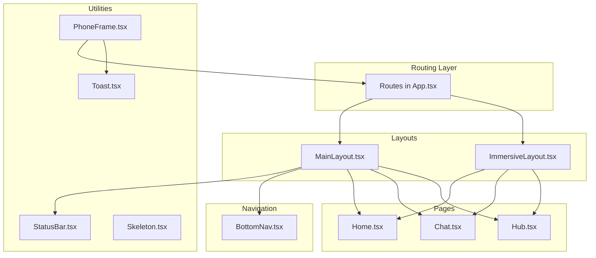
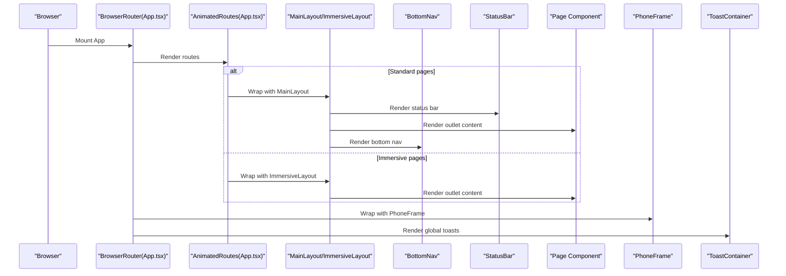
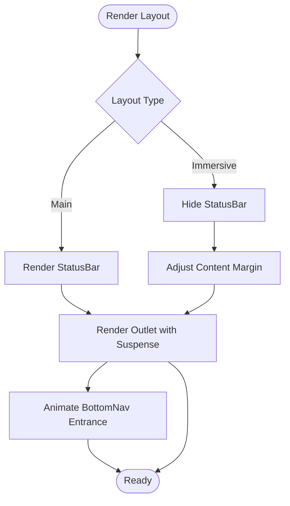
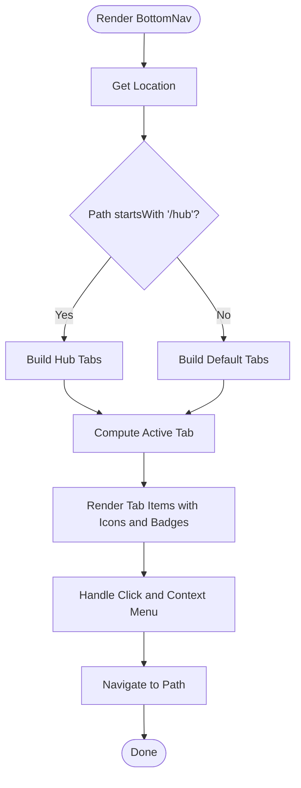
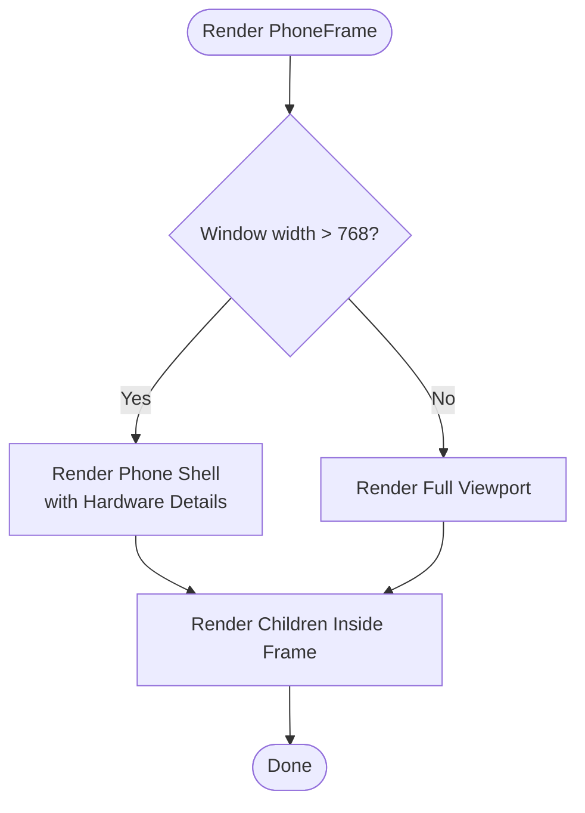
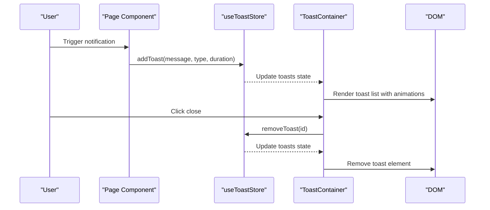
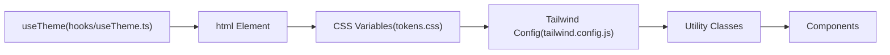
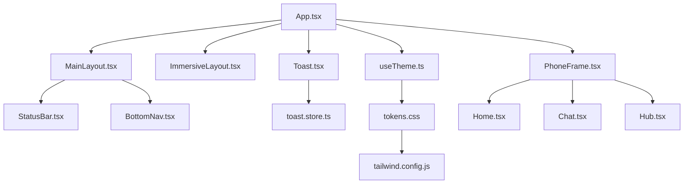

# Component System

<cite>
**Referenced Files in This Document**
- [MainLayout.tsx](file://src/components/layouts/MainLayout.tsx)
- [ImmersiveLayout.tsx](file://src/components/layouts/ImmersiveLayout.tsx)
- [BottomNav.tsx](file://src/components/BottomNav.tsx)
- [PhoneFrame.tsx](file://src/components/PhoneFrame.tsx)
- [StatusBar.tsx](file://src/components/StatusBar.tsx)
- [Skeleton.tsx](file://src/components/Skeleton.tsx)
- [Toast.tsx](file://src/components/Toast.tsx)
- [toast.store.ts](file://src/store/toast.store.ts)
- [useTheme.ts](file://src/hooks/useTheme.ts)
- [tokens.css](file://src/styles/tokens.css)
- [tailwind.config.js](file://tailwind.config.js)
- [App.tsx](file://src/App.tsx)
- [Home.tsx](file://src/pages/Home.tsx)
- [Chat.tsx](file://src/pages/Chat.tsx)
- [Hub.tsx](file://src/pages/Hub.tsx)
</cite>

## Table of Contents
1. [Introduction](#introduction)
2. [Project Structure](#project-structure)
3. [Core Components](#core-components)
4. [Architecture Overview](#architecture-overview)
5. [Detailed Component Analysis](#detailed-component-analysis)
6. [Dependency Analysis](#dependency-analysis)
7. [Performance Considerations](#performance-considerations)
8. [Troubleshooting Guide](#troubleshooting-guide)
9. [Conclusion](#conclusion)
10. [Appendices](#appendices)

## Introduction
This document describes VChat’s component architecture and reusable UI building blocks. It focuses on layout systems, navigation, utility components, and styling conventions. It explains how MainLayout and ImmersiveLayout structure the app, how BottomNav provides context-aware navigation and badges, and how PhoneFrame, StatusBar, Toast, and Skeleton integrate into the UI. It also covers styling via Tailwind CSS and CSS variables, responsive design, accessibility, performance, and extension guidelines.

## Project Structure
VChat organizes components by responsibility:
- Layouts: MainLayout and ImmersiveLayout wrap page content and define navigation affordances.
- Navigation: BottomNav renders a dynamic, context-aware bottom bar with optional badges.
- Utilities: PhoneFrame simulates a mobile device on desktop; StatusBar displays system-like indicators; Toast provides animated notifications; Skeleton offers loading placeholders.
- Pages: Feature-rich pages (Home, Chat, Hub) demonstrate composition patterns and integration.

**Diagram sources**
- [App.tsx:66-133](file://src/App.tsx#L66-L133)
- [MainLayout.tsx:7-29](file://src/components/layouts/MainLayout.tsx#L7-L29)
- [ImmersiveLayout.tsx:5-18](file://src/components/layouts/ImmersiveLayout.tsx#L5-L18)
- [BottomNav.tsx:5-61](file://src/components/BottomNav.tsx#L5-L61)
- [PhoneFrame.tsx:3-52](file://src/components/PhoneFrame.tsx#L3-L52)
- [StatusBar.tsx:3-13](file://src/components/StatusBar.tsx#L3-L13)
- [Toast.tsx:6-52](file://src/components/Toast.tsx#L6-L52)
- [Skeleton.tsx:3-28](file://src/components/Skeleton.tsx#L3-L28)
- [Home.tsx:257-271](file://src/pages/Home.tsx#L257-L271)
- [Chat.tsx:65-244](file://src/pages/Chat.tsx#L65-L244)
- [Hub.tsx:6-292](file://src/pages/Hub.tsx#L6-L292)

**Section sources**
- [App.tsx:12-50](file://src/App.tsx#L12-L50)
- [App.tsx:66-133](file://src/App.tsx#L66-L133)

## Core Components
This section introduces the primary building blocks and their roles.

- MainLayout: Provides standard navigation with a sticky StatusBar, page outlet with suspense fallback, and a bottom navigation bar with animated entrance.
- ImmersiveLayout: Offers full-screen immersive experiences by hiding the status bar and adjusting content margins.
- BottomNav: Renders a context-aware bottom navigation with dynamic tabs, active state styling, and optional badges.
- PhoneFrame: Switches between true mobile viewport and a desktop-simulated phone frame with hardware details.
- StatusBar: Displays time and connectivity indicators.
- Toast: Manages a toast container with animated entries/exits and dismiss controls.
- Skeleton: Supplies reusable skeleton loaders for text, avatars, and cards.

**Section sources**
- [MainLayout.tsx:7-29](file://src/components/layouts/MainLayout.tsx#L7-L29)
- [ImmersiveLayout.tsx:5-18](file://src/components/layouts/ImmersiveLayout.tsx#L5-L18)
- [BottomNav.tsx:5-61](file://src/components/BottomNav.tsx#L5-L61)
- [PhoneFrame.tsx:3-52](file://src/components/PhoneFrame.tsx#L3-L52)
- [StatusBar.tsx:3-13](file://src/components/StatusBar.tsx#L3-L13)
- [Toast.tsx:6-52](file://src/components/Toast.tsx#L6-L52)
- [Skeleton.tsx:3-28](file://src/components/Skeleton.tsx#L3-L28)

## Architecture Overview
The app composes layouts around routes. MainLayout is used for most pages, while ImmersiveLayout is reserved for immersive experiences. PhoneFrame wraps the entire app to simulate a mobile device on desktop. Toast is rendered globally above the layouts.

**Diagram sources**
- [App.tsx:66-133](file://src/App.tsx#L66-L133)
- [MainLayout.tsx:7-29](file://src/components/layouts/MainLayout.tsx#L7-L29)
- [ImmersiveLayout.tsx:5-18](file://src/components/layouts/ImmersiveLayout.tsx#L5-L18)
- [BottomNav.tsx:5-61](file://src/components/BottomNav.tsx#L5-L61)
- [StatusBar.tsx:3-13](file://src/components/StatusBar.tsx#L3-L13)
- [PhoneFrame.tsx:3-52](file://src/components/PhoneFrame.tsx#L3-L52)
- [Toast.tsx:6-52](file://src/components/Toast.tsx#L6-L52)

## Detailed Component Analysis

### Layout System: MainLayout and ImmersiveLayout
- MainLayout
  - Places StatusBar at the top with z-index for layering.
  - Uses React.Suspense to show a spinner while page components lazy-load.
  - Animates the BottomNav entrance using Framer Motion.
  - Applies backdrop blur and translucent backgrounds for depth.
- ImmersiveLayout
  - Hides the status bar with opacity and pointer-events adjustments.
  - Shifts content up to fill the space with a negative margin.
  - Keeps the same Suspense fallback pattern for immersive pages.

**Diagram sources**
- [MainLayout.tsx:7-29](file://src/components/layouts/MainLayout.tsx#L7-L29)
- [ImmersiveLayout.tsx:5-18](file://src/components/layouts/ImmersiveLayout.tsx#L5-L18)

**Section sources**
- [MainLayout.tsx:7-29](file://src/components/layouts/MainLayout.tsx#L7-L29)
- [ImmersiveLayout.tsx:5-18](file://src/components/layouts/ImmersiveLayout.tsx#L5-L18)

### Navigation: BottomNav
- Context-aware routing:
  - Detects whether the current path starts with "/hub".
  - Swaps the “Explore” tab for “Hub Action” or “Pro network” accordingly.
  - Provides a special context menu action for the “Home” tab to navigate to the AI twin.
- Active state and styling:
  - Computes active tab based on exact match for root or prefix match for nested routes.
  - Applies gradient or background highlights depending on Hub mode.
  - Uses motion effects for interactive feedback.
- Badge indicators:
  - Displays numeric badges on supported tabs (e.g., chat).

**Diagram sources**
- [BottomNav.tsx:5-61](file://src/components/BottomNav.tsx#L5-L61)

**Section sources**
- [BottomNav.tsx:5-61](file://src/components/BottomNav.tsx#L5-L61)

### Utility Components

#### PhoneFrame
- Responsive behavior:
  - On small screens, renders children in full viewport.
  - On larger screens, renders a centered phone frame with rounded corners, border, and subtle shadows.
- Hardware details:
  - Simulates a dynamic island at the top and a home indicator at the bottom.
- Z-index and overlay:
  - Uses a radial background and fixed positioning to visually isolate the phone shell.

**Diagram sources**
- [PhoneFrame.tsx:3-52](file://src/components/PhoneFrame.tsx#L3-L52)

**Section sources**
- [PhoneFrame.tsx:3-52](file://src/components/PhoneFrame.tsx#L3-L52)

#### StatusBar
- Minimal system-like indicators:
  - Shows time and connectivity icons.
  - Designed to be hidden in immersive layouts by setting opacity and disabling pointer events.

**Section sources**
- [StatusBar.tsx:3-13](file://src/components/StatusBar.tsx#L3-L13)

#### Toast System
- Store (Zustand):
  - Maintains a list of toasts with id, message, and type.
  - Provides add/remove actions; auto-expunges toasts after a configurable duration.
- Toast container:
  - Reads toasts from the store and renders them with spring animations.
  - Supports multiple types with distinct colors and icons.
  - Dismissible via close button.

**Diagram sources**
- [toast.store.ts:17-38](file://src/store/toast.store.ts#L17-L38)
- [Toast.tsx:6-52](file://src/components/Toast.tsx#L6-L52)

**Section sources**
- [toast.store.ts:3-38](file://src/store/toast.store.ts#L3-L38)
- [Toast.tsx:6-52](file://src/components/Toast.tsx#L6-L52)

#### Skeleton Loaders
- Text, avatar, and card variants:
  - Accept width/height or size props for flexibility.
  - Apply a shared pulse animation via a CSS class.
  - Use card and border tokens for consistent styling.

**Section sources**
- [Skeleton.tsx:3-28](file://src/components/Skeleton.tsx#L3-L28)

### Styling Approach and Tokens
- CSS variables:
  - Centralized color tokens in tokens.css define primary, background, card, text, and border palettes for both light and dark modes.
- Tailwind integration:
  - tailwind.config.js extends built-in colors to map CSS variables, enabling consistent theming across components.
- Theming hook:
  - useTheme toggles a class on the document root to switch between light and dark themes and persists the preference.

**Diagram sources**
- [tokens.css:1-39](file://src/styles/tokens.css#L1-L39)
- [tailwind.config.js:1-50](file://tailwind.config.js#L1-L50)
- [useTheme.ts:10-36](file://src/hooks/useTheme.ts#L10-L36)

**Section sources**
- [tokens.css:1-39](file://src/styles/tokens.css#L1-L39)
- [tailwind.config.js:1-50](file://tailwind.config.js#L1-L50)
- [useTheme.ts:10-36](file://src/hooks/useTheme.ts#L10-L36)

### Component Composition Patterns
- Layout-first composition:
  - Pages render inside PageWrapper for transitions and then inside MainLayout or ImmersiveLayout.
- Global overlays:
  - PhoneFrame wraps the entire app; ToastContainer is rendered globally above layouts.
- Context-aware navigation:
  - BottomNav adapts its tabs based on the current route, demonstrating dynamic composition.
- Lazy loading:
  - Pages are lazy-imported and wrapped with Suspense in layouts.

**Section sources**
- [App.tsx:52-64](file://src/App.tsx#L52-L64)
- [App.tsx:66-133](file://src/App.tsx#L66-L133)
- [MainLayout.tsx:14-17](file://src/components/layouts/MainLayout.tsx#L14-L17)
- [ImmersiveLayout.tsx:12-15](file://src/components/layouts/ImmersiveLayout.tsx#L12-L15)

### Usage Examples and Integration Patterns
- Integrating BottomNav:
  - Place BottomNav inside MainLayout’s animated wrapper to ensure smooth entrance.
  - Use the active-state computation to reflect current route.
- Using Toast:
  - Call addToast from any page or service; configure duration per use case.
  - Keep messages concise and types aligned with user intent.
- PhoneFrame:
  - Wrap the root AppContent with PhoneFrame to enable desktop simulation.
  - Use it during development to preview mobile layouts on desktop.
- Skeleton:
  - Render SkeletonText/SkeletonAvatar/SkeletonCard while fetching data.
  - Combine with async data loading to improve perceived performance.

**Section sources**
- [BottomNav.tsx:25-60](file://src/components/BottomNav.tsx#L25-L60)
- [Toast.tsx:23-51](file://src/components/Toast.tsx#L23-L51)
- [PhoneFrame.tsx:12-51](file://src/components/PhoneFrame.tsx#L12-L51)
- [Skeleton.tsx:3-28](file://src/components/Skeleton.tsx#L3-L28)

### Accessibility and Responsive Design
- Accessibility:
  - Ensure focus order respects layout stacking (status bar, content, bottom nav).
  - Provide keyboard-accessible navigation for BottomNav items.
  - Use semantic contrast for text and icons against themed backgrounds.
- Responsive:
  - PhoneFrame switches behavior at 768px; design touch targets to be tappable.
  - BottomNav uses relative sizing and max widths to fit various screen sizes.
  - Avoid fixed z-index conflicts; rely on layout stacking for overlays.

[No sources needed since this section provides general guidance]

## Dependency Analysis
This section maps key dependencies among components and stores.

**Diagram sources**
- [App.tsx:66-133](file://src/App.tsx#L66-L133)
- [MainLayout.tsx:7-29](file://src/components/layouts/MainLayout.tsx#L7-L29)
- [ImmersiveLayout.tsx:5-18](file://src/components/layouts/ImmersiveLayout.tsx#L5-L18)
- [BottomNav.tsx:5-61](file://src/components/BottomNav.tsx#L5-L61)
- [PhoneFrame.tsx:3-52](file://src/components/PhoneFrame.tsx#L3-L52)
- [Toast.tsx:6-52](file://src/components/Toast.tsx#L6-L52)
- [toast.store.ts:17-38](file://src/store/toast.store.ts#L17-L38)
- [useTheme.ts:10-36](file://src/hooks/useTheme.ts#L10-L36)
- [tokens.css:1-39](file://src/styles/tokens.css#L1-L39)
- [tailwind.config.js:1-50](file://tailwind.config.js#L1-L50)
- [Home.tsx:257-271](file://src/pages/Home.tsx#L257-L271)
- [Chat.tsx:65-244](file://src/pages/Chat.tsx#L65-L244)
- [Hub.tsx:6-292](file://src/pages/Hub.tsx#L6-L292)

**Section sources**
- [App.tsx:66-133](file://src/App.tsx#L66-L133)
- [toast.store.ts:17-38](file://src/store/toast.store.ts#L17-L38)

## Performance Considerations
- Lazy loading:
  - Pages are lazy-imported and wrapped with Suspense to avoid blocking the main thread.
- Animation costs:
  - Prefer transform-based animations (scale, translate) and keep motion durations moderate.
- Overlay stacking:
  - Minimize heavy backdrop filters and excessive z-index layers.
- Toast lifecycle:
  - Auto-dismiss toasts to prevent DOM accumulation; throttle frequent updates.

[No sources needed since this section provides general guidance]

## Troubleshooting Guide
- BottomNav not highlighting active tab:
  - Verify the active path logic matches the current route; ensure exact vs prefix matching aligns with route nesting.
- Toast not appearing:
  - Confirm the store is initialized and addToast is called with a valid type.
  - Check z-index of the toast container versus other overlays.
- PhoneFrame not rendering on desktop:
  - Ensure window resize listeners are attached and the inner width threshold is respected.
- Theme not switching:
  - Verify the theme hook toggles the class on the html element and that Tailwind’s dark mode variant is configured.

**Section sources**
- [BottomNav.tsx:27-31](file://src/components/BottomNav.tsx#L27-L31)
- [Toast.tsx:25-49](file://src/components/Toast.tsx#L25-L49)
- [PhoneFrame.tsx:6-10](file://src/components/PhoneFrame.tsx#L6-L10)
- [useTheme.ts:14-30](file://src/hooks/useTheme.ts#L14-L30)

## Conclusion
VChat’s component system emphasizes composability and context-awareness. Layouts encapsulate navigation and status concerns, while utility components provide cohesive, accessible, and performant building blocks. The styling pipeline using CSS variables and Tailwind ensures consistent theming across light and dark modes. Following the patterns documented here will help maintain consistency and scalability as the component library grows.

## Appendices

### Component Prop Interfaces and Composition Notes
- BottomNav
  - Props: None (uses router hooks internally).
  - Composition: Render inside MainLayout’s animated area; ensure proper z-index stacking.
- PhoneFrame
  - Props: children (ReactNode).
  - Composition: Wrap AppContent to simulate mobile on desktop.
- StatusBar
  - Props: None.
  - Composition: Place inside MainLayout; hide in ImmersiveLayout when needed.
- ToastContainer
  - Props: None (reads from Zustand store).
  - Composition: Render globally above layouts.
- Skeleton
  - Props: width/height or size, className.
  - Composition: Use during data fetch; pair with Suspense for seamless loading.

**Section sources**
- [BottomNav.tsx:5-61](file://src/components/BottomNav.tsx#L5-L61)
- [PhoneFrame.tsx:3-52](file://src/components/PhoneFrame.tsx#L3-L52)
- [StatusBar.tsx:3-13](file://src/components/StatusBar.tsx#L3-L13)
- [Toast.tsx:6-52](file://src/components/Toast.tsx#L6-L52)
- [Skeleton.tsx:3-28](file://src/components/Skeleton.tsx#L3-L28)