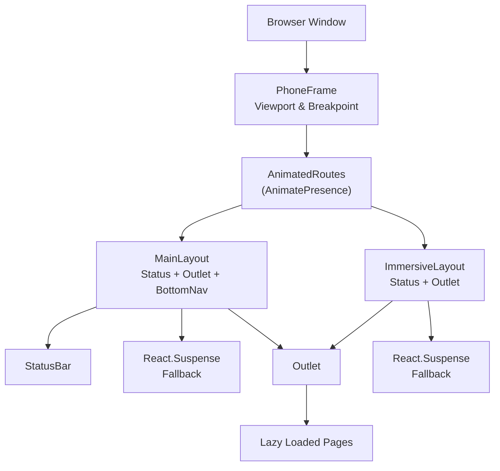
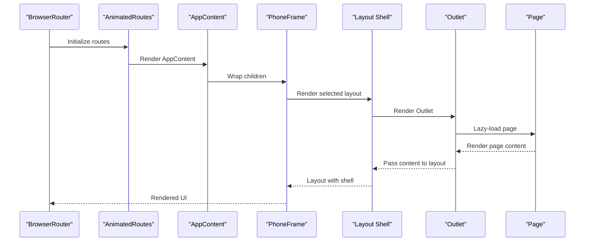
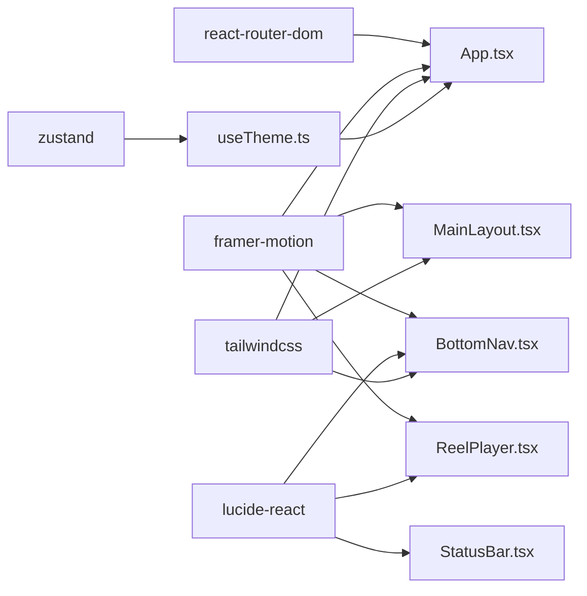

# Layout System

<cite>
**Referenced Files in This Document**
- [MainLayout.tsx](file://src/components/layouts/MainLayout.tsx)
- [ImmersiveLayout.tsx](file://src/components/layouts/ImmersiveLayout.tsx)
- [App.tsx](file://src/App.tsx)
- [PhoneFrame.tsx](file://src/components/PhoneFrame.tsx)
- [BottomNav.tsx](file://src/components/BottomNav.tsx)
- [StatusBar.tsx](file://src/components/StatusBar.tsx)
- [ReelPlayer.tsx](file://src/pages/ReelPlayer.tsx)
- [Home.tsx](file://src/pages/Home.tsx)
- [index.css](file://src/index.css)
- [tokens.css](file://src/styles/tokens.css)
- [tailwind.config.js](file://tailwind.config.js)
- [useTheme.ts](file://src/hooks/useTheme.ts)
- [main.tsx](file://src/main.tsx)
- [package.json](file://package.json)
</cite>

## Table of Contents
1. [Introduction](#introduction)
2. [Project Structure](#project-structure)
3. [Core Components](#core-components)
4. [Architecture Overview](#architecture-overview)
5. [Detailed Component Analysis](#detailed-component-analysis)
6. [Dependency Analysis](#dependency-analysis)
7. [Performance Considerations](#performance-considerations)
8. [Troubleshooting Guide](#troubleshooting-guide)
9. [Conclusion](#conclusion)
10. [Appendices](#appendices)

## Introduction
This document explains VChat’s layout system architecture with a focus on two layout shells: MainLayout and ImmersiveLayout. It covers responsive design patterns, outlet rendering via React Router DOM, suspense boundaries, animation transitions using Framer Motion, and navigation integration. It also documents customization examples, breakpoint handling, and performance optimization techniques, along with mobile-first design considerations.

## Project Structure
The layout system centers around two shell components that wrap page routes:
- MainLayout: Standard shell with status bar, content area, and animated bottom navigation.
- ImmersiveLayout: Full-screen shell optimized for media consumption and immersive experiences.

Routing is configured in App.tsx with lazy-loaded pages and route groups that select either shell. PhoneFrame simulates a phone viewport for desktop and handles responsive breakpoints.

**Diagram sources**
- [App.tsx:66-133](file://src/App.tsx#L66-L133)
- [MainLayout.tsx:7-30](file://src/components/layouts/MainLayout.tsx#L7-L30)
- [ImmersiveLayout.tsx:5-19](file://src/components/layouts/ImmersiveLayout.tsx#L5-L19)
- [PhoneFrame.tsx:3-53](file://src/components/PhoneFrame.tsx#L3-L53)

**Section sources**
- [App.tsx:66-133](file://src/App.tsx#L66-L133)
- [MainLayout.tsx:7-30](file://src/components/layouts/MainLayout.tsx#L7-L30)
- [ImmersiveLayout.tsx:5-19](file://src/components/layouts/ImmersiveLayout.tsx#L5-L19)
- [PhoneFrame.tsx:3-53](file://src/components/PhoneFrame.tsx#L3-L53)

## Core Components
- MainLayout: Provides a standard app shell with a status bar, a suspense-wrapped outlet, and a bottom navigation bar that animates in. It ensures the bottom nav remains interactive and visible while content loads lazily.
- ImmersiveLayout: Designed for full-screen experiences. It hides the status bar, adjusts vertical spacing, and renders the outlet inside a suspense boundary for seamless loading.
- BottomNav: Navigation component with dynamic tabs depending on context (e.g., Hub mode vs. standard mode), including badges and gesture-driven actions.
- StatusBar: Minimal status bar with time and connectivity indicators.
- PhoneFrame: Responsive container that switches between true mobile viewport and a simulated phone frame on desktop using a breakpoint.

**Section sources**
- [MainLayout.tsx:7-30](file://src/components/layouts/MainLayout.tsx#L7-L30)
- [ImmersiveLayout.tsx:5-19](file://src/components/layouts/ImmersiveLayout.tsx#L5-L19)
- [BottomNav.tsx:5-62](file://src/components/BottomNav.tsx#L5-L62)
- [StatusBar.tsx:3-14](file://src/components/StatusBar.tsx#L3-L14)
- [PhoneFrame.tsx:3-53](file://src/components/PhoneFrame.tsx#L3-L53)

## Architecture Overview
The layout architecture integrates React Router DOM with Framer Motion for transitions and animations. App.tsx defines route groups:
- Standard routes under MainLayout: home, chat, explore, hub, me, AI twin, and others.
- Immersive routes under ImmersiveLayout: ReelPlayer, AI drawing canvas, and group features.

**Diagram sources**
- [App.tsx:150-156](file://src/App.tsx#L150-L156)
- [App.tsx:135-148](file://src/App.tsx#L135-L148)
- [App.tsx:66-133](file://src/App.tsx#L66-L133)
- [PhoneFrame.tsx:3-53](file://src/components/PhoneFrame.tsx#L3-L53)
- [MainLayout.tsx:7-30](file://src/components/layouts/MainLayout.tsx#L7-L30)
- [ImmersiveLayout.tsx:5-19](file://src/components/layouts/ImmersiveLayout.tsx#L5-L19)

## Detailed Component Analysis

### MainLayout
Responsibilities:
- Renders a status bar at the top.
- Wraps the outlet in a suspense boundary with a spinner fallback.
- Animates the bottom navigation bar in using Framer Motion.
- Uses Outlet to render the current route’s page.

Responsive and accessibility:
- Bottom navigation is absolutely positioned and uses backdrop blur for readability.
- Suspense fallback uses a centered spinner with theme-aware colors.

Animation transitions:
- Bottom navigation slides up with AnimatePresence and motion variants.
- Page wrapper animations are handled at the route level via AnimatedRoutes.

Customization examples:
- To change the bottom nav appearance, adjust the backdrop blur and gradient classes applied to the motion container.
- To customize the spinner, modify the Suspense fallback element.

Breakpoint handling:
- MainLayout does not implement breakpoint logic; it relies on PhoneFrame for viewport sizing.

**Section sources**
- [MainLayout.tsx:7-30](file://src/components/layouts/MainLayout.tsx#L7-L30)
- [BottomNav.tsx:26-61](file://src/components/BottomNav.tsx#L26-L61)

### ImmersiveLayout
Responsibilities:
- Hides the status bar by setting low opacity and disabling pointer events.
- Adjusts vertical spacing to remove safe area insets for immersive playback.
- Wraps the outlet in a suspense boundary with a dark-themed fallback.

Use cases:
- Ideal for full-screen video players, drawing canvases, and immersive media experiences.

Customization examples:
- To alter the immersive background, update the fallback spinner or the container background.
- To adjust vertical spacing, modify the marginTop value on the content container.

Breakpoint handling:
- ImmersiveLayout does not implement breakpoints; it assumes full-screen rendering.

**Section sources**
- [ImmersiveLayout.tsx:5-19](file://src/components/layouts/ImmersiveLayout.tsx#L5-L19)

### BottomNav
Context-aware navigation:
- Switches tabs based on the current route. For example, when in Hub mode, the Explore tab becomes Network, and the Hub tab becomes Streaks.
- Includes a badge for the Chat tab and supports right-click action to navigate to the AI Twin.

Animations and interactions:
- Uses Framer Motion for tap scaling and hover states.
- Active state styling changes based on theme and context.

Customization examples:
- To add a new tab, extend the tabs array with an id, label, icon, and path.
- To enable contextual actions, add conditions similar to the Hub mode logic.

**Section sources**
- [BottomNav.tsx:5-62](file://src/components/BottomNav.tsx#L5-L62)

### StatusBar
Minimal status bar:
- Displays time and connectivity icons.
- Positioned relatively with a high z-index to stay above content.

Customization examples:
- To add more indicators, extend the StatusBar JSX with additional icons or text.

**Section sources**
- [StatusBar.tsx:3-14](file://src/components/StatusBar.tsx#L3-L14)

### PhoneFrame
Responsive viewport:
- On mobile (width <= 768), renders a full-screen container.
- On desktop (width > 768), renders a simulated phone frame with hardware elements (Dynamic Island and Home Indicator).

Breakpoint handling:
- Uses a simple width check to switch between modes.

Customization examples:
- To adjust the breakpoint, change the comparison value.
- To modify the phone frame visuals, edit the inner container styles and hardware elements.

**Section sources**
- [PhoneFrame.tsx:3-53](file://src/components/PhoneFrame.tsx#L3-L53)

### ReelPlayer
Immersive media player:
- Full-screen layout via ImmersiveLayout.
- Implements swipe gestures to navigate between reels and double-tap to like.
- Uses Framer Motion for entrance, progress bars, and heart animation.

Navigation integration:
- Navigates to the next or previous reel based on swipe direction.
- Falls back to the Explore page when swiping down from the first reel.

Customization examples:
- To add more actions, extend the action bar with additional icons and handlers.
- To change the progress animation, adjust the motion div and transition configuration.

**Section sources**
- [ReelPlayer.tsx:7-52](file://src/pages/ReelPlayer.tsx#L7-L52)
- [ReelPlayer.tsx:54-219](file://src/pages/ReelPlayer.tsx#L54-L219)

### Home
Standard page example:
- Demonstrates sticky top bar with backdrop blur.
- Uses Framer Motion for staggered animations of lists and cards.
- Integrates with BottomNav via MainLayout.

Customization examples:
- To add more sections, compose additional components within the main container.
- To adjust animations, modify the motion variants and delays.

**Section sources**
- [Home.tsx:280-295](file://src/pages/Home.tsx#L280-L295)

### Routing and Layout Composition
Layout selection:
- Routes under MainLayout use the standard shell with bottom navigation.
- Routes under ImmersiveLayout use the immersive shell for full-screen experiences.

Page wrappers:
- AnimatedRoutes wraps each page in a motion div with pop-layout mode for transitions.

Suspense boundaries:
- Both layouts wrap Outlet in Suspense to improve perceived performance during lazy loading.

**Section sources**
- [App.tsx:66-133](file://src/App.tsx#L66-L133)

## Dependency Analysis
External libraries and integrations:
- React Router DOM: Provides routing, Outlet, and location-based rendering.
- Framer Motion: Powers animations for bottom navigation, page transitions, and interactive elements.
- Lucide React: Icons used in StatusBar, BottomNav, and ReelPlayer.
- Tailwind CSS: Utility-first styling with CSS variables for themes.
- Zustand: Theme store for light/dark mode persistence.

**Diagram sources**
- [package.json:12-18](file://package.json#L12-L18)
- [App.tsx:1-11](file://src/App.tsx#L1-L11)
- [MainLayout.tsx:1-6](file://src/components/layouts/MainLayout.tsx#L1-L6)
- [BottomNav.tsx:1-4](file://src/components/BottomNav.tsx#L1-L4)
- [StatusBar.tsx:1-2](file://src/components/StatusBar.tsx#L1-L2)
- [ReelPlayer.tsx:1-4](file://src/pages/ReelPlayer.tsx#L1-L4)
- [useTheme.ts:1-8](file://src/hooks/useTheme.ts#L1-L8)

**Section sources**
- [package.json:12-18](file://package.json#L12-L18)
- [App.tsx:1-11](file://src/App.tsx#L1-L11)
- [MainLayout.tsx:1-6](file://src/components/layouts/MainLayout.tsx#L1-L6)
- [BottomNav.tsx:1-4](file://src/components/BottomNav.tsx#L1-L4)
- [StatusBar.tsx:1-2](file://src/components/StatusBar.tsx#L1-L2)
- [ReelPlayer.tsx:1-4](file://src/pages/ReelPlayer.tsx#L1-L4)
- [useTheme.ts:1-8](file://src/hooks/useTheme.ts#L1-L8)

## Performance Considerations
- Lazy loading pages: All pages are lazy-loaded to reduce initial bundle size and improve startup performance.
- Suspense fallbacks: Both layouts wrap Outlet in Suspense to keep the UI responsive while pages load.
- Scrollbar hiding: Global CSS hides scrollbars to prevent layout shifts while maintaining smooth scrolling.
- Motion optimizations: Using transform-friendly properties and minimal reflows; consider adding will-change hints where appropriate.
- Theme switching: Theme persistence avoids unnecessary re-renders after initialization.

Recommendations:
- Prefer transform-based animations for GPU acceleration.
- Keep animation durations short for quick feedback.
- Use CSS containment for heavy page sections to limit layout recalculation.
- Debounce resize listeners in PhoneFrame if extended further.

**Section sources**
- [App.tsx:12-50](file://src/App.tsx#L12-L50)
- [MainLayout.tsx:14-18](file://src/components/layouts/MainLayout.tsx#L14-L18)
- [ImmersiveLayout.tsx:12-16](file://src/components/layouts/ImmersiveLayout.tsx#L12-L16)
- [index.css:23-33](file://src/index.css#L23-L33)
- [index.css:58-67](file://src/index.css#L58-L67)
- [useTheme.ts:23-30](file://src/hooks/useTheme.ts#L23-L30)

## Troubleshooting Guide
Common issues and resolutions:
- Bottom navigation not visible: Ensure the layout container allows absolute positioning and z-index stacking.
- Suspense fallback not appearing: Verify that lazy imports resolve and that the fallback element is rendered inside Suspense.
- Phone frame not switching modes: Confirm the breakpoint value and that the resize event listener is attached.
- Theme not applying: Check that the theme store initializes and toggles classes on the document element.
- Reel navigation not working: Ensure route params match the reel ID and that navigation replaces the current entry for smooth UX.

**Section sources**
- [MainLayout.tsx:14-27](file://src/components/layouts/MainLayout.tsx#L14-L27)
- [ImmersiveLayout.tsx:12-16](file://src/components/layouts/ImmersiveLayout.tsx#L12-L16)
- [PhoneFrame.tsx:4-10](file://src/components/PhoneFrame.tsx#L4-L10)
- [useTheme.ts:23-30](file://src/hooks/useTheme.ts#L23-L30)
- [ReelPlayer.tsx:27-42](file://src/pages/ReelPlayer.tsx#L27-L42)

## Conclusion
VChat’s layout system cleanly separates standard and immersive experiences through dedicated shells, integrates React Router DOM for routing and lazy loading, and leverages Framer Motion for smooth transitions. The PhoneFrame component provides a robust mobile-first responsive foundation, while the theme system and CSS variables enable easy customization. By following the patterns documented here, teams can extend layouts, add new immersive experiences, and maintain consistent performance and UX across devices.

## Appendices

### Design Tokens and Theming
- CSS variables define primary, background, card, text, and border tokens for both dark and light modes.
- Tailwind is configured to resolve these variables at build time for consistent styling.

**Section sources**
- [tokens.css:1-39](file://src/styles/tokens.css#L1-L39)
- [tailwind.config.js:7-46](file://tailwind.config.js#L7-L46)

### Mobile-First Breakpoints
- Mobile viewport: Full-screen container with hidden scrollbars.
- Desktop viewport: Simulated phone frame with hardware elements and a fixed size.

**Section sources**
- [PhoneFrame.tsx:12-51](file://src/components/PhoneFrame.tsx#L12-L51)

### Example: Adding a New Standard Route
Steps:
- Import the new page lazily in App.tsx.
- Add a new route under the MainLayout group with a PageWrapper.
- Ensure the page renders within the MainLayout shell.

**Section sources**
- [App.tsx:12-50](file://src/App.tsx#L12-L50)
- [App.tsx:72-116](file://src/App.tsx#L72-L116)

### Example: Adding a New Immersive Route
Steps:
- Import the new page lazily in App.tsx.
- Add a new route under the ImmersiveLayout group with a PageWrapper.
- Ensure the page renders within the ImmersiveLayout shell.

**Section sources**
- [App.tsx:12-50](file://src/App.tsx#L12-L50)
- [App.tsx:118-129](file://src/App.tsx#L118-L129)