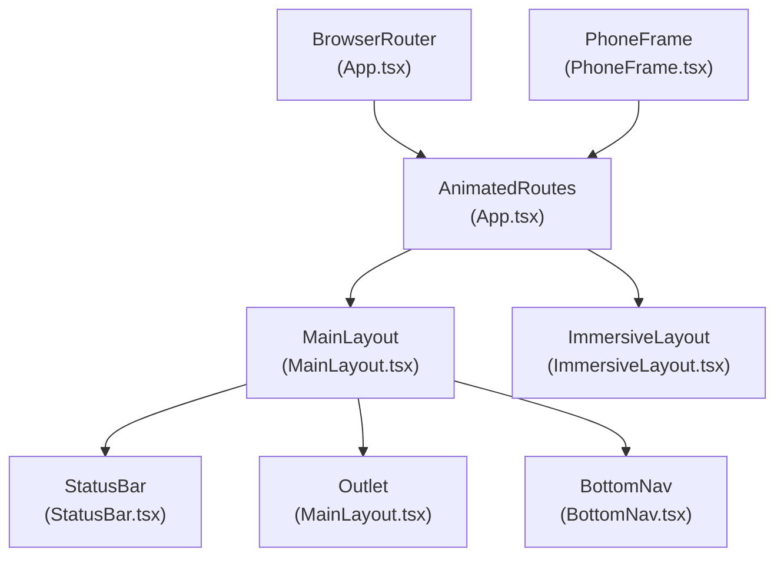
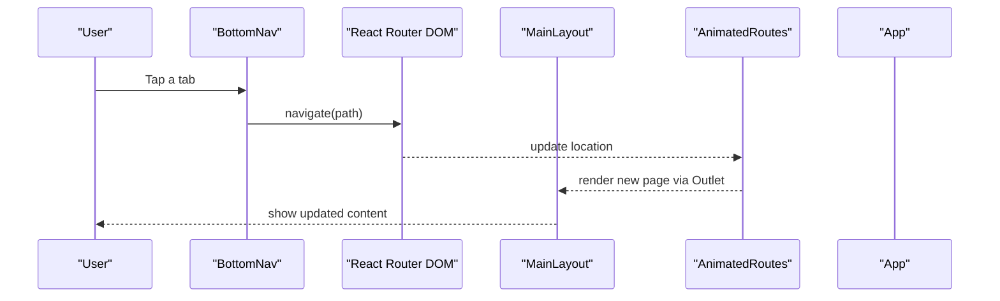
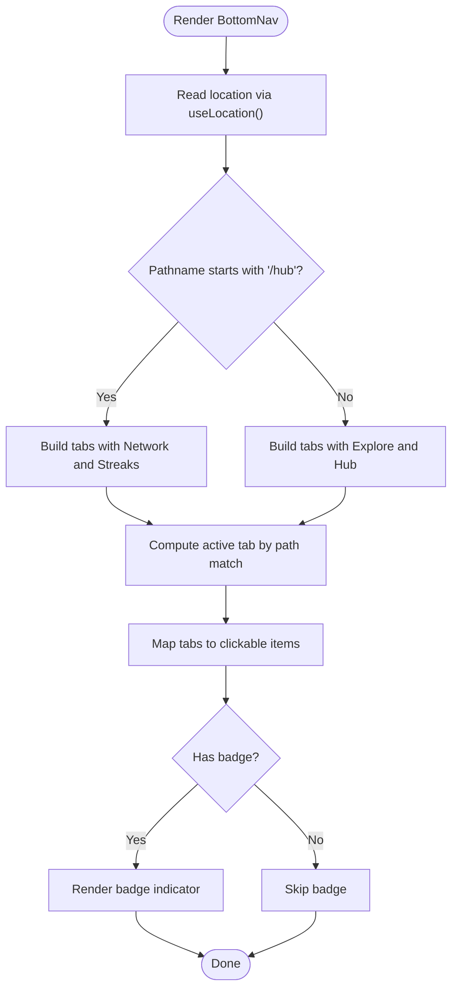
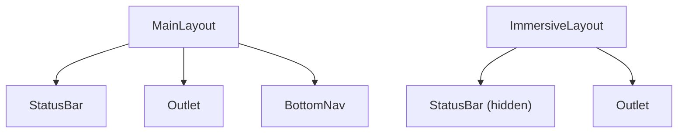
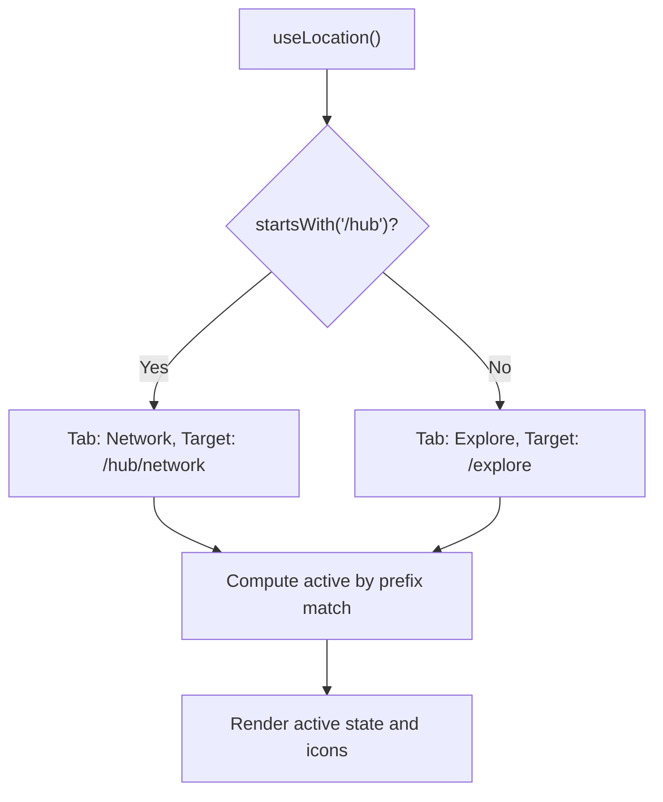
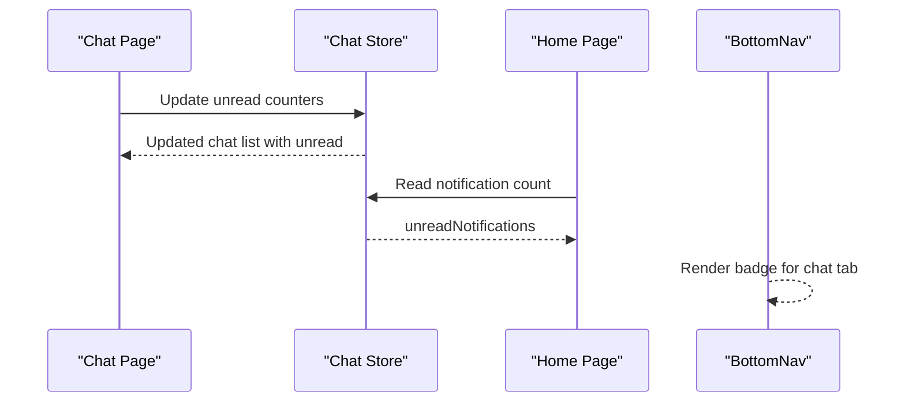
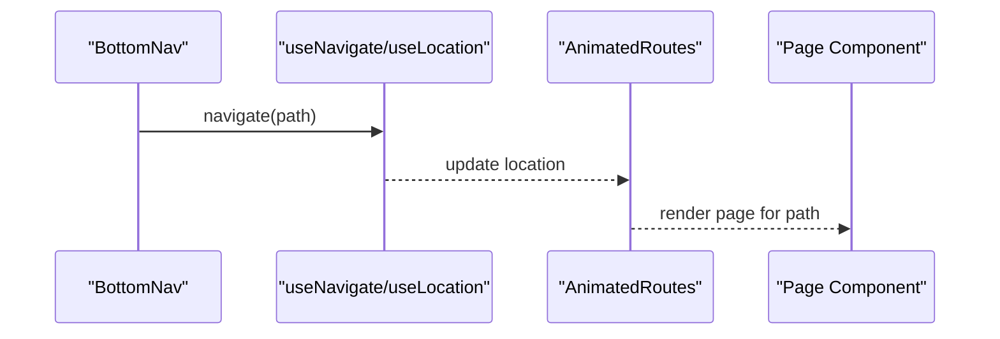
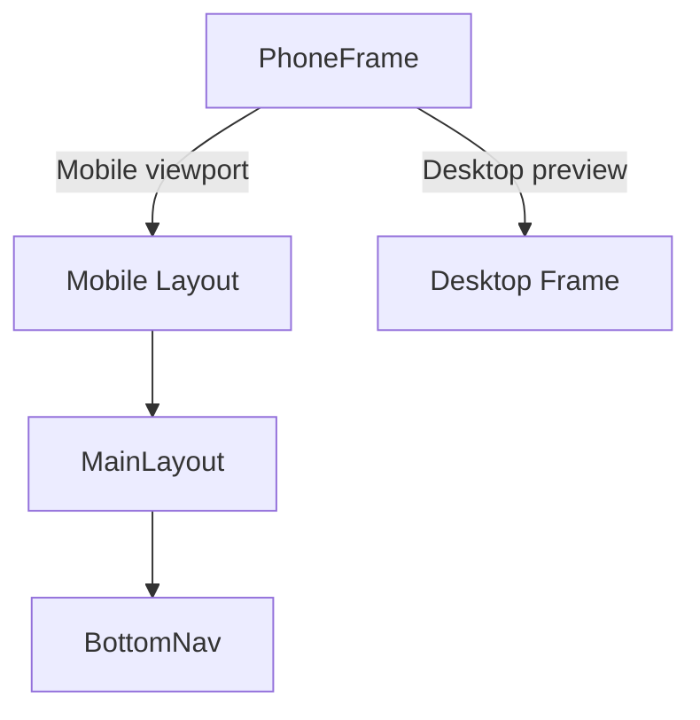
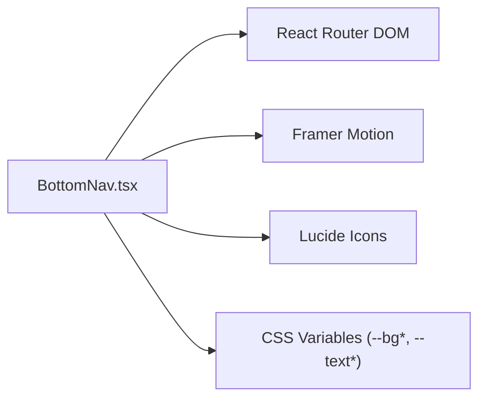

# Navigation Components

<cite>
**Referenced Files in This Document**
- [BottomNav.tsx](file://src/components/BottomNav.tsx)
- [MainLayout.tsx](file://src/components/layouts/MainLayout.tsx)
- [ImmersiveLayout.tsx](file://src/components/layouts/ImmersiveLayout.tsx)
- [App.tsx](file://src/App.tsx)
- [PhoneFrame.tsx](file://src/components/PhoneFrame.tsx)
- [StatusBar.tsx](file://src/components/StatusBar.tsx)
- [Chat.tsx](file://src/pages/Chat.tsx)
- [chat.store.ts](file://src/store/chat.store.ts)
- [Home.tsx](file://src/pages/Home.tsx)
</cite>

## Table of Contents
1. [Introduction](#introduction)
2. [Project Structure](#project-structure)
3. [Core Components](#core-components)
4. [Architecture Overview](#architecture-overview)
5. [Detailed Component Analysis](#detailed-component-analysis)
6. [Dependency Analysis](#dependency-analysis)
7. [Performance Considerations](#performance-considerations)
8. [Troubleshooting Guide](#troubleshooting-guide)
9. [Conclusion](#conclusion)
10. [Appendices](#appendices)

## Introduction
This document explains VChat’s navigation system with a focus on the BottomNav component. It covers the context-aware navigation logic, route-based visibility, badge indicators for unread counts and notifications, navigation state management, active route detection, and integration with React Router DOM. It also provides guidance on customization, accessibility, responsive patterns, touch interactions, and extending the navigation system consistently across screen sizes.

## Project Structure
The navigation system spans routing configuration, layout composition, and the bottom navigation bar. The router defines routes and wraps page content in layouts. The MainLayout composes the StatusBar, page outlet, and BottomNav. The BottomNav renders contextual tabs and handles navigation and badges.

**Diagram sources**
- [App.tsx:66-133](file://src/App.tsx#L66-L133)
- [MainLayout.tsx:7-29](file://src/components/layouts/MainLayout.tsx#L7-L29)
- [ImmersiveLayout.tsx:5-18](file://src/components/layouts/ImmersiveLayout.tsx#L5-L18)
- [BottomNav.tsx:5-61](file://src/components/BottomNav.tsx#L5-L61)
- [StatusBar.tsx:3-13](file://src/components/StatusBar.tsx#L3-L13)
- [PhoneFrame.tsx:3-52](file://src/components/PhoneFrame.tsx#L3-L52)

**Section sources**
- [App.tsx:66-133](file://src/App.tsx#L66-L133)
- [MainLayout.tsx:7-29](file://src/components/layouts/MainLayout.tsx#L7-L29)
- [BottomNav.tsx:5-61](file://src/components/BottomNav.tsx#L5-L61)
- [PhoneFrame.tsx:3-52](file://src/components/PhoneFrame.tsx#L3-L52)

## Core Components
- BottomNav: Renders five primary tabs, adapts contextually based on the current route, manages active state, and displays badge indicators.
- MainLayout: Provides the standard app shell with StatusBar, page outlet, and animated BottomNav.
- ImmersiveLayout: A specialized layout for immersive experiences (e.g., media players) that hides the StatusBar and adjusts spacing.
- App routing: Defines routes for all pages and wraps them in appropriate layouts.
- PhoneFrame: Provides a mobile-first viewport and a desktop “phone frame” simulation.

Key responsibilities:
- Route-based visibility: One tab switches depending on whether the current path is under /hub.
- Active route detection: Uses pathname matching to highlight the active tab.
- Badge indicators: Displays numeric counts for unread messages and notifications.
- Touch and gesture support: Integrates with Framer Motion for interactive feedback and supports right-click override for a hidden action.

**Section sources**
- [BottomNav.tsx:5-61](file://src/components/BottomNav.tsx#L5-L61)
- [MainLayout.tsx:7-29](file://src/components/layouts/MainLayout.tsx#L7-L29)
- [ImmersiveLayout.tsx:5-18](file://src/components/layouts/ImmersiveLayout.tsx#L5-L18)
- [App.tsx:66-133](file://src/App.tsx#L66-L133)
- [PhoneFrame.tsx:3-52](file://src/components/PhoneFrame.tsx#L3-L52)

## Architecture Overview
The navigation architecture integrates React Router DOM with custom layout components and a bottom navigation bar. The router configures routes and keys by pathname for transitions. MainLayout composes the StatusBar, page content, and BottomNav. BottomNav computes contextual tabs and navigates using React Router’s imperative API.

**Diagram sources**
- [BottomNav.tsx:33-42](file://src/components/BottomNav.tsx#L33-L42)
- [App.tsx:66-133](file://src/App.tsx#L66-L133)
- [MainLayout.tsx:14-17](file://src/components/layouts/MainLayout.tsx#L14-L17)

## Detailed Component Analysis

### BottomNav Component
BottomNav encapsulates:
- Context-aware tabs: One tab toggles between Explore and Network based on the current route prefix.
- Active route detection: Highlights the tab whose path matches the current location.
- Badge indicators: Displays unread counts for specific routes.
- Touch and gesture feedback: Uses Framer Motion for tap animations and supports right-click to trigger a hidden action.
- Theming and gradients: Adapts background and border styling when in Hub context.

**Diagram sources**
- [BottomNav.tsx:5-61](file://src/components/BottomNav.tsx#L5-L61)

Implementation highlights:
- Context switching: Uses a ternary expression to choose between Explore and Network, and between Hub and Streaks.
- Active detection: A helper determines if the current location matches the tab path (exact for root, prefix-based otherwise).
- Badge rendering: Conditionally renders a red dot with a count when present.
- Accessibility: Uses semantic divs with role-appropriate labels and keyboard-accessible focus order via natural tab order.
- Interaction: Supports right-click on the Home tab to open a hidden AI Twin route.

Integration points:
- Navigation: Imperative navigation via useNavigate().
- Routing: React Router DOM routes define the targets.
- Layout: MainLayout composes BottomNav and animates it into view.

**Section sources**
- [BottomNav.tsx:5-61](file://src/components/BottomNav.tsx#L5-L61)
- [App.tsx:66-133](file://src/App.tsx#L66-L133)
- [MainLayout.tsx:20-27](file://src/components/layouts/MainLayout.tsx#L20-L27)

### MainLayout and ImmersiveLayout
MainLayout:
- Wraps page content with a sticky StatusBar.
- Renders the Outlet for the current route.
- Animates and positions BottomNav at the bottom of the viewport.

ImmersiveLayout:
- Hides StatusBar by reducing opacity and disabling pointer events.
- Adjusts top margin to align content beneath the hidden StatusBar.
- Suitable for immersive experiences where the bottom navigation may be redundant.

**Diagram sources**
- [MainLayout.tsx:7-29](file://src/components/layouts/MainLayout.tsx#L7-L29)
- [ImmersiveLayout.tsx:5-18](file://src/components/layouts/ImmersiveLayout.tsx#L5-L18)
- [StatusBar.tsx:3-13](file://src/components/StatusBar.tsx#L3-L13)

**Section sources**
- [MainLayout.tsx:7-29](file://src/components/layouts/MainLayout.tsx#L7-L29)
- [ImmersiveLayout.tsx:5-18](file://src/components/layouts/ImmersiveLayout.tsx#L5-L18)
- [StatusBar.tsx:3-13](file://src/components/StatusBar.tsx#L3-L13)

### Route-Based Visibility and Active Detection
- Context-aware tabs: When the current path starts with /hub, Explore becomes Network and Hub becomes Streaks.
- Active detection: Root path uses exact equality; other paths use prefix matching.
- Router integration: Routes are defined in App.tsx with nested layouts and lazy-loaded pages.

**Diagram sources**
- [BottomNav.tsx:9-30](file://src/components/BottomNav.tsx#L9-L30)
- [App.tsx:82-108](file://src/App.tsx#L82-L108)

**Section sources**
- [BottomNav.tsx:9-30](file://src/components/BottomNav.tsx#L9-L30)
- [App.tsx:82-108](file://src/App.tsx#L82-L108)

### Badge Indicators: Unread Counts and Notifications
Badge indicators appear on:
- Chat tab: Static badge count configured in the tab definition.
- Home top bar: Notification bell badge driven by a store property.

**Diagram sources**
- [BottomNav.tsx:15](file://src/components/BottomNav.tsx#L15)
- [Chat.tsx:217-224](file://src/pages/Chat.tsx#L217-L224)
- [Home.tsx:40-44](file://src/pages/Home.tsx#L40-L44)

**Section sources**
- [BottomNav.tsx:15](file://src/components/BottomNav.tsx#L15)
- [Chat.tsx:217-224](file://src/pages/Chat.tsx#L217-L224)
- [Home.tsx:40-44](file://src/pages/Home.tsx#L40-L44)

### Navigation State Management and Integration with React Router DOM
- Imperative navigation: BottomNav uses useNavigate to move between routes.
- Location awareness: useLocation provides the current path for active state and context checks.
- Router configuration: App.tsx defines routes and applies layouts; AnimatedRoutes ensures smooth transitions keyed by pathname.

**Diagram sources**
- [BottomNav.tsx:6-7](file://src/components/BottomNav.tsx#L6-L7)
- [App.tsx:66-133](file://src/App.tsx#L66-L133)

**Section sources**
- [BottomNav.tsx:6-7](file://src/components/BottomNav.tsx#L6-L7)
- [App.tsx:66-133](file://src/App.tsx#L66-L133)

### Responsive Navigation Patterns and Touch Interaction Handling
- Mobile-first: BottomNav is positioned absolutely at the bottom and animated into place.
- Desktop simulation: PhoneFrame provides a fixed-size “phone” container with dynamic elements for hardware aesthetics.
- Touch gestures: While BottomNav itself focuses on navigation, other pages demonstrate gesture handling (e.g., swipe to navigate between reels), reinforcing a consistent touch-centric interaction model.

**Diagram sources**
- [PhoneFrame.tsx:3-52](file://src/components/PhoneFrame.tsx#L3-L52)
- [MainLayout.tsx:20-27](file://src/components/layouts/MainLayout.tsx#L20-L27)
- [BottomNav.tsx:25-60](file://src/components/BottomNav.tsx#L25-L60)

**Section sources**
- [PhoneFrame.tsx:3-52](file://src/components/PhoneFrame.tsx#L3-L52)
- [MainLayout.tsx:20-27](file://src/components/layouts/MainLayout.tsx#L20-L27)
- [BottomNav.tsx:25-60](file://src/components/BottomNav.tsx#L25-L60)

### Accessibility Features
- Focus order: Natural tab order follows the rendered tab list.
- Keyboard operability: Click handlers are attached to interactive elements; consider adding explicit tabindex and Enter/Space activation for full keyboard support.
- Visual contrast: Active states use color and subtle shadows; ensure sufficient contrast against backgrounds, especially in Hub mode gradients.
- ARIA roles: Consider adding aria-current for the active tab and aria-label for icons to improve screen reader support.

[No sources needed since this section provides general guidance]

## Dependency Analysis
BottomNav depends on:
- React Router DOM for navigation and location state.
- Framer Motion for interactive feedback.
- Lucide icons for visual affordances.
- Theming tokens for background and border styling.

**Diagram sources**
- [BottomNav.tsx:1-3](file://src/components/BottomNav.tsx#L1-L3)

**Section sources**
- [BottomNav.tsx:1-3](file://src/components/BottomNav.tsx#L1-L3)

## Performance Considerations
- Keep tab lists small: Limit the number of bottom navigation items to reduce re-renders and layout thrash.
- Memoize computed values: Cache isActive and contextual tab arrays to avoid recomputation on every render.
- Lazy load pages: App.tsx already lazy-loads pages; maintain this pattern to keep initial bundle sizes small.
- Optimize animations: Use minimal transforms and avoid heavy GPU-intensive effects in BottomNav.

[No sources needed since this section provides general guidance]

## Troubleshooting Guide
Common issues and resolutions:
- Tab not highlighting:
  - Verify the active detection logic matches the intended path semantics.
  - Confirm that pathname prefixes and exact matches are correctly applied.
- Context tab not switching:
  - Ensure the current path begins with the expected prefix.
  - Check that the conditional tab construction executes as intended.
- Badge not appearing:
  - Confirm the tab definition includes a badge value.
  - Verify the rendering condition for badges is met.
- Navigation not working:
  - Ensure the target path exists in the route configuration.
  - Confirm useNavigate is invoked with the correct path.
- Hidden action not triggering:
  - Validate the right-click handler and the target route.

**Section sources**
- [BottomNav.tsx:9-30](file://src/components/BottomNav.tsx#L9-L30)
- [App.tsx:82-108](file://src/App.tsx#L82-L108)

## Conclusion
VChat’s navigation system centers on a flexible BottomNav that adapts to context, accurately detects active routes, and integrates seamlessly with React Router DOM. Its design supports responsive patterns, touch interactions, and accessibility. By following the customization and extension guidelines below, teams can maintain a consistent user experience across devices and use cases.

[No sources needed since this section summarizes without analyzing specific files]

## Appendices

### Customization Examples
- Adding a new tab:
  - Extend the tabs array with a new tab object containing id, label, icon, and path.
  - If the tab requires a badge, add a numeric badge field.
  - Ensure the route exists in the router configuration.
- Changing context behavior:
  - Modify the conditional logic that selects tabs based on the current path prefix.
- Updating active detection:
  - Adjust the helper that compares the current location with the tab’s path.
- Integrating unread counts:
  - Connect a store or state source to supply badge values dynamically.
  - Update the rendering condition to reflect real-time counts.

[No sources needed since this section provides general guidance]