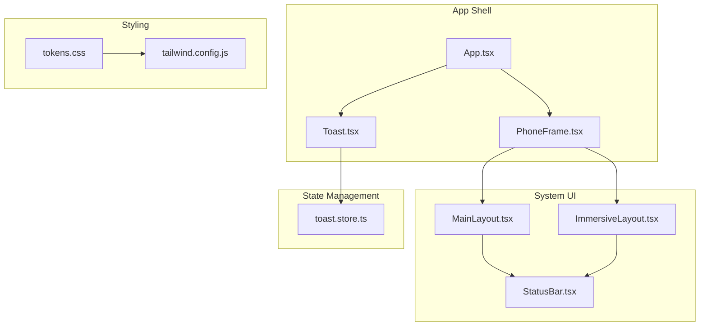
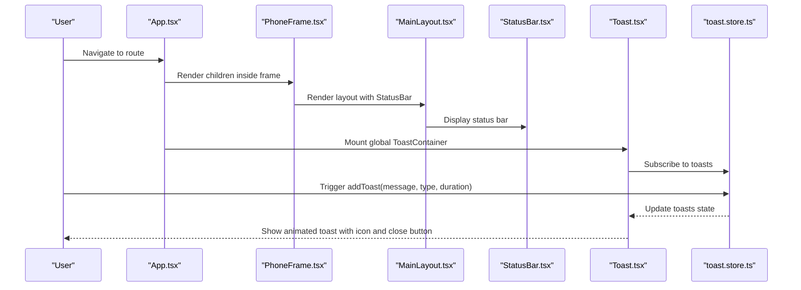
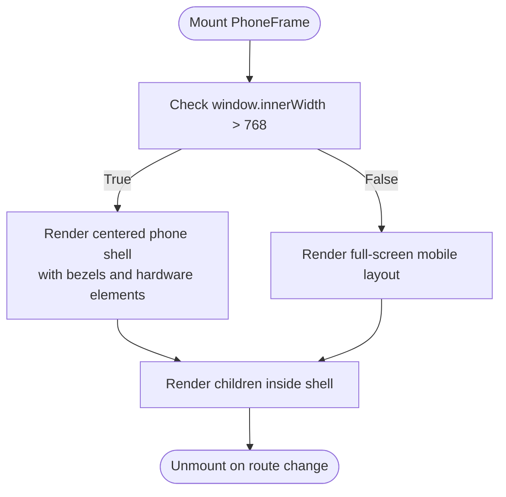
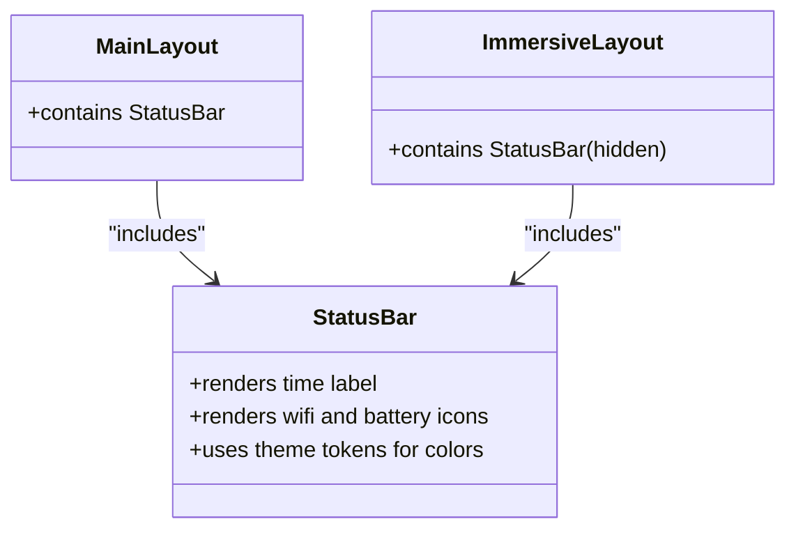
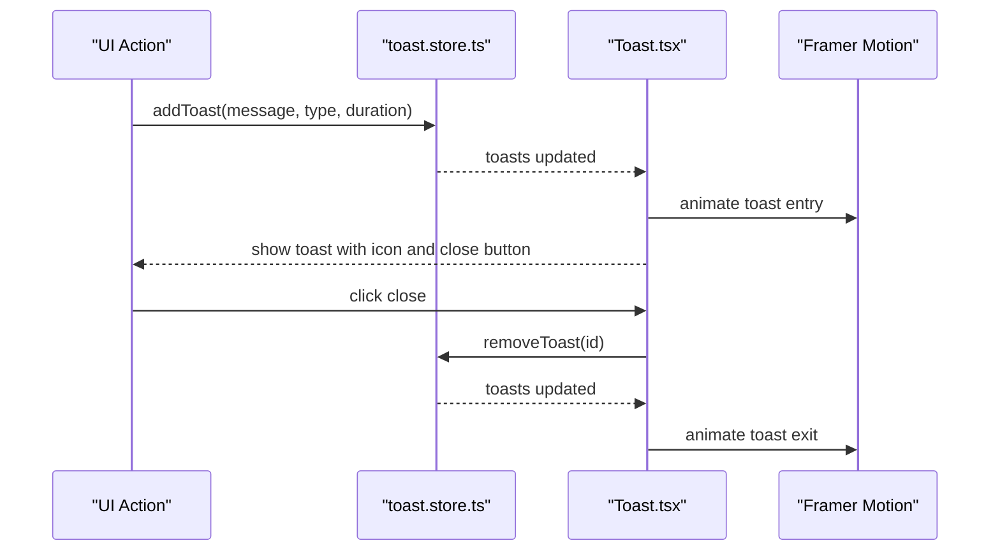
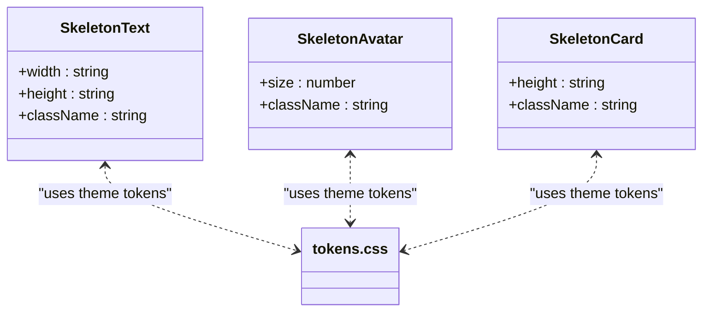
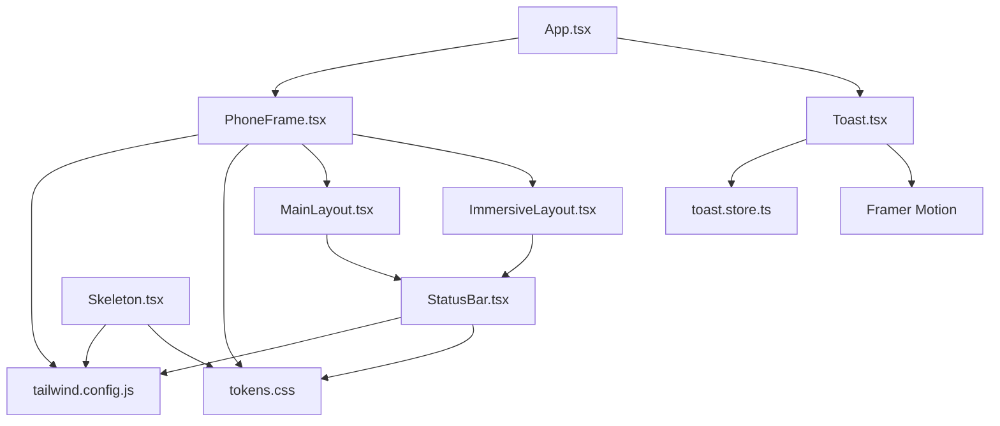

# Utility Components

<cite>
**Referenced Files in This Document**
- [PhoneFrame.tsx](file://src/components/PhoneFrame.tsx)
- [StatusBar.tsx](file://src/components/StatusBar.tsx)
- [Toast.tsx](file://src/components/Toast.tsx)
- [Skeleton.tsx](file://src/components/Skeleton.tsx)
- [toast.store.ts](file://src/store/toast.store.ts)
- [tokens.css](file://src/styles/tokens.css)
- [tailwind.config.js](file://tailwind.config.js)
- [App.tsx](file://src/App.tsx)
- [MainLayout.tsx](file://src/components/layouts/MainLayout.tsx)
- [ImmersiveLayout.tsx](file://src/components/layouts/ImmersiveLayout.tsx)
- [Placeholder.tsx](file://src/pages/Placeholder.tsx)
</cite>

## Table of Contents
1. [Introduction](#introduction)
2. [Project Structure](#project-structure)
3. [Core Components](#core-components)
4. [Architecture Overview](#architecture-overview)
5. [Detailed Component Analysis](#detailed-component-analysis)
6. [Dependency Analysis](#dependency-analysis)
7. [Performance Considerations](#performance-considerations)
8. [Troubleshooting Guide](#troubleshooting-guide)
9. [Conclusion](#conclusion)

## Introduction
This document explains VChat’s utility components that enhance the user experience across responsive design, system integration, notifications, and loading states. It covers:
- PhoneFrame: mobile device simulation and responsive preview mode
- StatusBar: system UI integration and status indicators
- Toast: notification management with animations and dismissal
- Skeleton: loading state placeholders with Tailwind-based styling

It also documents implementation patterns, prop interfaces, styling approaches, usage examples, customization options, and integration patterns within the application architecture.

## Project Structure
These utility components live under src/components and integrate with the main application via App.tsx. They rely on a centralized theme token system and Tailwind CSS for styling.

**Diagram sources**
- [App.tsx:135-148](file://src/App.tsx#L135-L148)
- [PhoneFrame.tsx:3](file://src/components/PhoneFrame.tsx#L3-L52)
- [Toast.tsx:6-7](file://src/components/Toast.tsx#L6-L7)
- [MainLayout.tsx:7-12](file://src/components/layouts/MainLayout.tsx#L7-L12)
- [ImmersiveLayout.tsx:5-10](file://src/components/layouts/ImmersiveLayout.tsx#L5-L10)
- [toast.store.ts:17-38](file://src/store/toast.store.ts#L17-L38)
- [tokens.css:1-39](file://src/styles/tokens.css#L1-L39)
- [tailwind.config.js:1-50](file://tailwind.config.js#L1-L50)

**Section sources**
- [App.tsx:135-148](file://src/App.tsx#L135-L148)
- [PhoneFrame.tsx:3-52](file://src/components/PhoneFrame.tsx#L3-L52)
- [Toast.tsx:6-52](file://src/components/Toast.tsx#L6-L52)
- [MainLayout.tsx:7-12](file://src/components/layouts/MainLayout.tsx#L7-L12)
- [ImmersiveLayout.tsx:5-10](file://src/components/layouts/ImmersiveLayout.tsx#L5-L10)
- [toast.store.ts:17-38](file://src/store/toast.store.ts#L17-L38)
- [tokens.css:1-39](file://src/styles/tokens.css#L1-L39)
- [tailwind.config.js:1-50](file://tailwind.config.js#L1-L50)

## Core Components
This section summarizes each component’s responsibilities and key behaviors.

- PhoneFrame
  - Role: Provides a mobile viewport simulation on desktop and a true mobile layout on small screens.
  - Preview mode: Renders a centered phone shell with rounded bezels and dynamic hardware elements when the window width exceeds a threshold.
  - Responsive behavior: Switches between full-screen mobile layout and simulated phone shell based on viewport width.

- StatusBar
  - Role: Displays system-like status elements (time, connectivity, power) aligned with the app’s layout.
  - Integration: Placed at the top of MainLayout and hidden but reserved in ImmersiveLayout for immersive experiences.

- Toast
  - Role: Centralized notification system with animated entries/exits and dismiss controls.
  - Store-driven: Uses Zustand to manage a queue of toasts with automatic timed removal.

- Skeleton
  - Role: Lightweight loading placeholders for text, avatars, and cards.
  - Styling: Uses shared pulse animation and theme tokens for consistent appearance.

**Section sources**
- [PhoneFrame.tsx:3-52](file://src/components/PhoneFrame.tsx#L3-L52)
- [StatusBar.tsx:3-13](file://src/components/StatusBar.tsx#L3-L13)
- [Toast.tsx:6-52](file://src/components/Toast.tsx#L6-L52)
- [Skeleton.tsx:3-29](file://src/components/Skeleton.tsx#L3-L29)

## Architecture Overview
The utility components integrate as follows:
- App.tsx wraps the routing with PhoneFrame and mounts ToastContainer globally.
- PhoneFrame conditionally renders either a full-screen mobile container or a desktop phone shell.
- StatusBar is included in both MainLayout and ImmersiveLayout, with different visibility semantics.
- ToastContainer reads from the Zustand store and renders animated notifications anchored to the top of the viewport.

**Diagram sources**
- [App.tsx:135-148](file://src/App.tsx#L135-L148)
- [PhoneFrame.tsx:3-52](file://src/components/PhoneFrame.tsx#L3-L52)
- [MainLayout.tsx:7-12](file://src/components/layouts/MainLayout.tsx#L7-L12)
- [StatusBar.tsx:3-13](file://src/components/StatusBar.tsx#L3-L13)
- [Toast.tsx:6-52](file://src/components/Toast.tsx#L6-L52)
- [toast.store.ts:17-38](file://src/store/toast.store.ts#L17-L38)

## Detailed Component Analysis

### PhoneFrame
- Purpose: Provide a mobile-first experience with a realistic desktop preview.
- Implementation pattern:
  - Detects viewport width and toggles between mobile and phone-shell modes.
  - On desktop, renders a centered phone shell with rounded corners, border, and subtle shadows.
  - On mobile, uses full viewport dimensions and hides scrollbars for a native feel.
- Props: Accepts children for embedding app routes.
- Styling approach:
  - Uses Tailwind utilities for layout and spacing.
  - Leverages CSS variables from tokens.css for colors and borders.
  - Applies pseudo-elements for dynamic hardware elements (dynamic island and home indicator).
- Responsive behavior:
  - Listens to window resize to switch modes dynamically.
  - Desktop preview uses a fixed-size phone shell centered on screen.
- Preview mode:
  - Radial gradient background simulates desk lighting.
  - Phone shell mimics real device aesthetics with border radius and box shadows.

**Diagram sources**
- [PhoneFrame.tsx:3-52](file://src/components/PhoneFrame.tsx#L3-L52)

**Section sources**
- [PhoneFrame.tsx:3-52](file://src/components/PhoneFrame.tsx#L3-L52)
- [tokens.css:1-39](file://src/styles/tokens.css#L1-L39)
- [tailwind.config.js:1-50](file://tailwind.config.js#L1-L50)

### StatusBar
- Purpose: Integrate system-like status indicators at the top of the app.
- Implementation pattern:
  - Renders a compact horizontal bar with time and status icons.
  - Positioned absolutely within layout containers to avoid disrupting content flow.
- Props: None; static content.
- Styling approach:
  - Uses theme tokens for text and icon colors.
  - Maintains consistent sizing and typography.
- Integration:
  - Included in MainLayout for standard navigation.
  - Hidden in ImmersiveLayout but still reserves space to prevent content shift.

**Diagram sources**
- [StatusBar.tsx:3-13](file://src/components/StatusBar.tsx#L3-L13)
- [MainLayout.tsx:7-12](file://src/components/layouts/MainLayout.tsx#L7-L12)
- [ImmersiveLayout.tsx:5-10](file://src/components/layouts/ImmersiveLayout.tsx#L5-L10)

**Section sources**
- [StatusBar.tsx:3-13](file://src/components/StatusBar.tsx#L3-L13)
- [MainLayout.tsx:7-12](file://src/components/layouts/MainLayout.tsx#L7-L12)
- [ImmersiveLayout.tsx:5-10](file://src/components/layouts/ImmersiveLayout.tsx#L5-L10)

### Toast System
- Purpose: Provide unobtrusive, animated notifications with optional auto-dismiss.
- Store (Zustand):
  - Manages an array of toasts with unique ids.
  - Supports adding toasts with type and duration, and removing by id.
  - Auto-removes toasts after the specified duration (unless disabled).
- Toast Container:
  - Reads from the store and renders a vertically stacked list of toasts.
  - Uses Framer Motion for entrance/exit animations and smooth transitions.
  - Each toast displays an icon and message, with a close button.
- Positioning and dismissal:
  - Positioned at the top of the viewport with a z-index above page content.
  - Dismissal handled by clicking the close button or automatic timeout.
- Types and styling:
  - Supports success, warning, error, and info types with distinct colors and icons.
  - Left border color reflects the toast type for quick visual scanning.

**Diagram sources**
- [toast.store.ts:17-38](file://src/store/toast.store.ts#L17-L38)
- [Toast.tsx:6-52](file://src/components/Toast.tsx#L6-L52)

**Section sources**
- [toast.store.ts:3-38](file://src/store/toast.store.ts#L3-L38)
- [Toast.tsx:6-52](file://src/components/Toast.tsx#L6-L52)
- [Placeholder.tsx:32-38](file://src/pages/Placeholder.tsx#L32-L38)

### Skeleton Components
- Purpose: Provide lightweight loading placeholders to improve perceived performance.
- Components:
  - SkeletonText: A single-line or multi-line text placeholder with configurable width and height.
  - SkeletonAvatar: A circular avatar placeholder sized by a numeric property.
  - SkeletonCard: A bordered card placeholder with customizable height.
- Styling approach:
  - Uses a shared pulse animation class for subtle shimmer.
  - Inherits background and border colors from theme tokens for consistency.
- Usage patterns:
  - Replace content blocks during async data fetches.
  - Combine with layout primitives to maintain visual rhythm.

**Diagram sources**
- [Skeleton.tsx:3-29](file://src/components/Skeleton.tsx#L3-L29)
- [tokens.css:1-39](file://src/styles/tokens.css#L1-L39)

**Section sources**
- [Skeleton.tsx:3-29](file://src/components/Skeleton.tsx#L3-L29)
- [tokens.css:1-39](file://src/styles/tokens.css#L1-L39)

## Dependency Analysis
Key dependencies and relationships:
- PhoneFrame depends on window resize events and Tailwind classes for layout.
- StatusBar is embedded in layouts and relies on theme tokens for colors.
- ToastContainer depends on Zustand store and Framer Motion for animations.
- Skeleton components depend on theme tokens and a shared pulse animation class.
- Tailwind config extends color palettes using CSS variables from tokens.css.

**Diagram sources**
- [PhoneFrame.tsx:3-52](file://src/components/PhoneFrame.tsx#L3-L52)
- [StatusBar.tsx:3-13](file://src/components/StatusBar.tsx#L3-L13)
- [Toast.tsx:6-52](file://src/components/Toast.tsx#L6-L52)
- [toast.store.ts:17-38](file://src/store/toast.store.ts#L17-L38)
- [Skeleton.tsx:3-29](file://src/components/Skeleton.tsx#L3-L29)
- [tailwind.config.js:1-50](file://tailwind.config.js#L1-L50)
- [tokens.css:1-39](file://src/styles/tokens.css#L1-L39)
- [App.tsx:135-148](file://src/App.tsx#L135-L148)
- [MainLayout.tsx:7-12](file://src/components/layouts/MainLayout.tsx#L7-L12)
- [ImmersiveLayout.tsx:5-10](file://src/components/layouts/ImmersiveLayout.tsx#L5-L10)

**Section sources**
- [tailwind.config.js:1-50](file://tailwind.config.js#L1-L50)
- [tokens.css:1-39](file://src/styles/tokens.css#L1-L39)
- [App.tsx:135-148](file://src/App.tsx#L135-L148)

## Performance Considerations
- Toast animations: Framer Motion adds GPU-accelerated transitions; keep the number of concurrent toasts reasonable to avoid layout thrashing.
- PhoneFrame preview: The centered phone shell uses a radial gradient background; ensure it does not trigger unnecessary repaints.
- Skeleton placeholders: Minimal DOM and CSS overhead; ideal for long lists and paginated content.
- Theme tokens: Centralized CSS variables reduce style recalculation across components.

## Troubleshooting Guide
- Toast not appearing:
  - Verify the ToastContainer is mounted in the app shell.
  - Confirm the store is initialized and addToast is called from a component that re-renders after state updates.
- Toast not dismissing:
  - Check the duration parameter passed to addToast; zero disables auto-dismiss.
  - Ensure removeToast is invoked on close button click.
- StatusBar overlaps content:
  - In immersive layouts, StatusBar is intentionally hidden but still reserves space; adjust margins if content shifts unexpectedly.
- PhoneFrame not switching modes:
  - Ensure the window resize listener is active and the 768px threshold is appropriate for your design breakpoints.

**Section sources**
- [Toast.tsx:6-52](file://src/components/Toast.tsx#L6-L52)
- [toast.store.ts:17-38](file://src/store/toast.store.ts#L17-L38)
- [MainLayout.tsx:7-12](file://src/components/layouts/MainLayout.tsx#L7-L12)
- [ImmersiveLayout.tsx:5-10](file://src/components/layouts/ImmersiveLayout.tsx#L5-L10)
- [PhoneFrame.tsx:3-52](file://src/components/PhoneFrame.tsx#L3-L52)

## Conclusion
VChat’s utility components deliver a cohesive, theme-consistent experience:
- PhoneFrame ensures a mobile-first design with a practical desktop preview.
- StatusBar integrates system-like status indicators seamlessly into layouts.
- Toast provides a robust, animated notification system backed by a simple store.
- Skeleton offers efficient loading placeholders that preserve visual rhythm.

Together, these components support responsive design, system integration, user feedback, and perceived performance across the application.