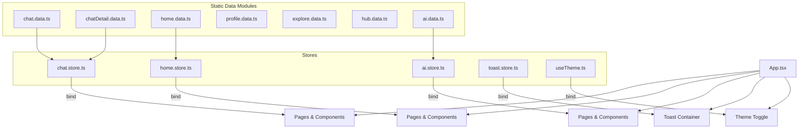
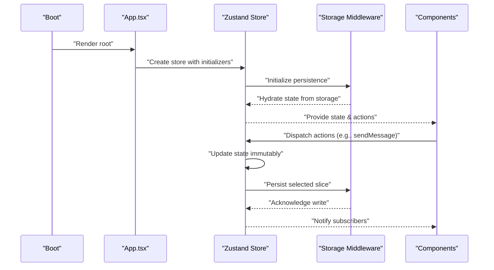
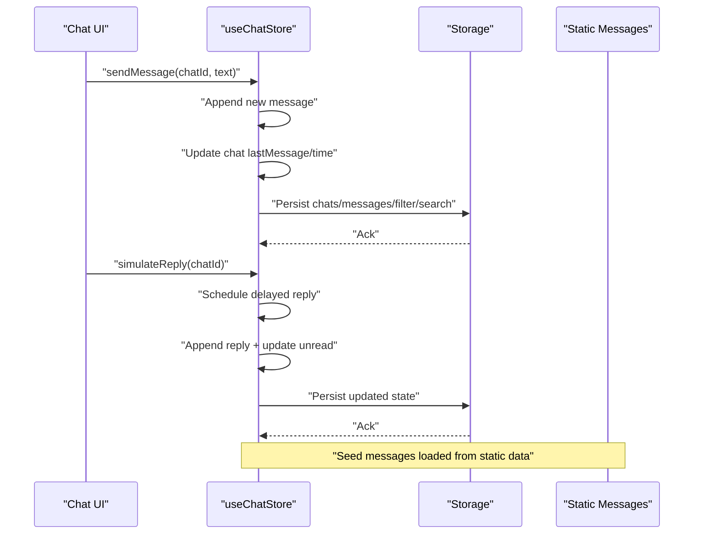
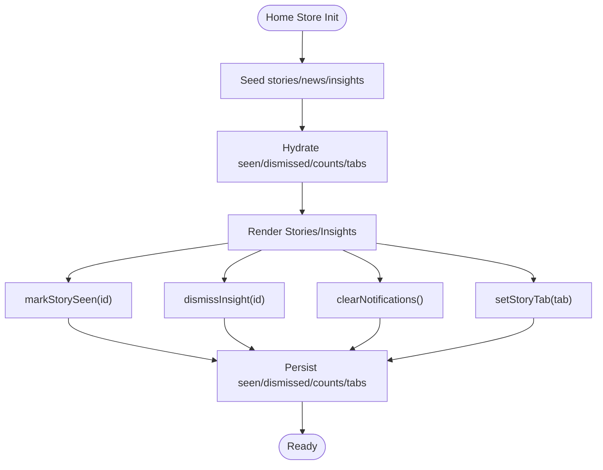
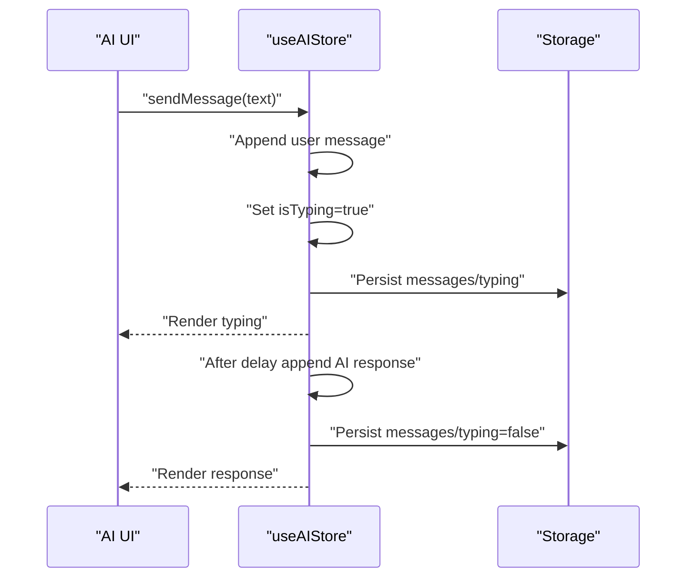
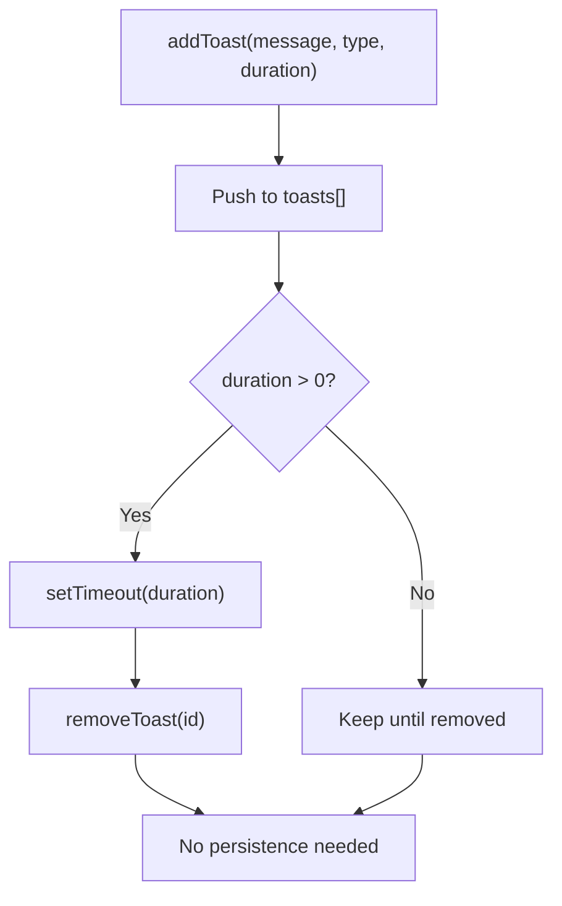
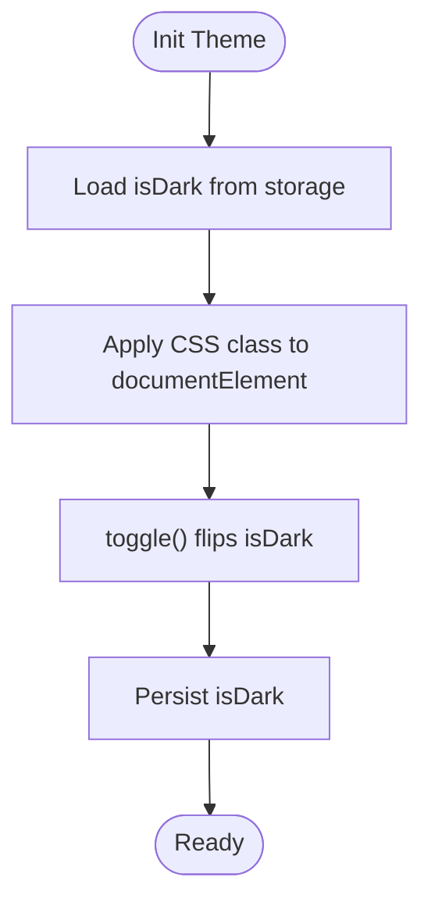
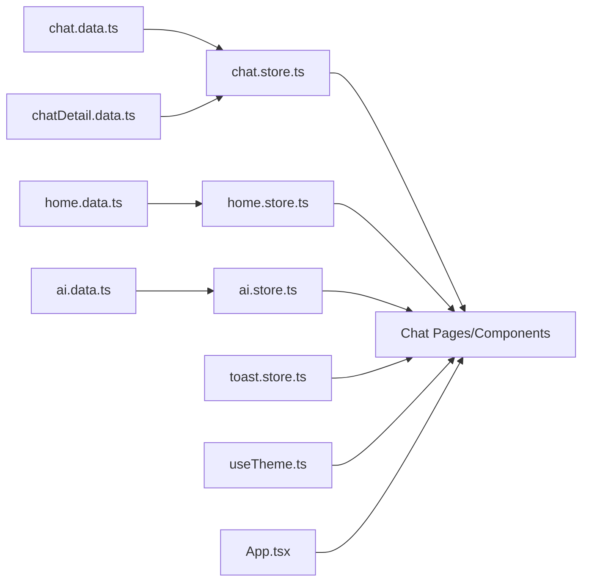

# Data Lifecycle Management

<cite>
**Referenced Files in This Document**
- [App.tsx](file://src/App.tsx)
- [main.tsx](file://src/main.tsx)
- [chat.data.ts](file://src/data/chat.data.ts)
- [chatDetail.data.ts](file://src/data/chatDetail.data.ts)
- [home.data.ts](file://src/data/home.data.ts)
- [profile.data.ts](file://src/data/profile.data.ts)
- [explore.data.ts](file://src/data/explore.data.ts)
- [hub.data.ts](file://src/data/hub.data.ts)
- [ai.data.ts](file://src/data/ai.data.ts)
- [chat.store.ts](file://src/store/chat.store.ts)
- [ai.store.ts](file://src/store/ai.store.ts)
- [home.store.ts](file://src/store/home.store.ts)
- [toast.store.ts](file://src/store/toast.store.ts)
- [useTheme.ts](file://src/hooks/useTheme.ts)
</cite>

## Table of Contents
1. [Introduction](#introduction)
2. [Project Structure](#project-structure)
3. [Core Components](#core-components)
4. [Architecture Overview](#architecture-overview)
5. [Detailed Component Analysis](#detailed-component-analysis)
6. [Dependency Analysis](#dependency-analysis)
7. [Performance Considerations](#performance-considerations)
8. [Troubleshooting Guide](#troubleshooting-guide)
9. [Conclusion](#conclusion)
10. [Appendices](#appendices)

## Introduction
This document describes VChat’s data lifecycle management across initialization, updates, synchronization, and cleanup. It explains how static data modules are initialized, how state hydrates from persistent storage, and how components bind to stores. It also documents update mechanisms (real-time-like simulation, background-like persistence), synchronization patterns between local state and external sources, cache invalidation strategies, stale data handling, cleanup procedures, validation workflows, error recovery, graceful degradation, aging and retention policies, and implementation guidelines for robust data operations.

## Project Structure
VChat organizes data and state management into two primary layers:
- Static data modules: Plain TypeScript modules exporting typed arrays and objects used as seeds for stores.
- Store modules: Zustand stores with optional persistence middleware to hydrate and persist state to browser storage.

**Diagram sources**
- [chat.data.ts:1-134](file://src/data/chat.data.ts#L1-L134)
- [chatDetail.data.ts:1-71](file://src/data/chatDetail.data.ts#L1-L71)
- [home.data.ts:1-104](file://src/data/home.data.ts#L1-L104)
- [ai.data.ts:1-102](file://src/data/ai.data.ts#L1-L102)
- [chat.store.ts:1-349](file://src/store/chat.store.ts#L1-L349)
- [ai.store.ts:1-162](file://src/store/ai.store.ts#L1-L162)
- [home.store.ts:1-103](file://src/store/home.store.ts#L1-L103)
- [toast.store.ts:1-39](file://src/store/toast.store.ts#L1-L39)
- [useTheme.ts:1-36](file://src/hooks/useTheme.ts#L1-L36)
- [App.tsx:1-156](file://src/App.tsx#L1-L156)

**Section sources**
- [App.tsx:1-156](file://src/App.tsx#L1-L156)
- [main.tsx:1-11](file://src/main.tsx#L1-L11)

## Core Components
- Static data modules define strongly typed collections used as initial seeds for stores. Examples include chat contexts, direct messages, stories, news items, AI insights, and mock lists for explore and hub features.
- Stores encapsulate state and actions, with optional persistence to localStorage/sessionStorage. They hydrate on app load and serialize subsets of state to storage.
- Components subscribe to stores and render UI based on hydrated state.

Key responsibilities:
- Initialization: Seed stores from static data modules.
- Hydration: Restore persisted state from storage on app start.
- Updates: Mutate state immutably via actions; trigger re-renders.
- Synchronization: Persist relevant slices of state to storage.
- Cleanup: Remove expired or stale entries, clear notifications, and manage memory.

**Section sources**
- [chat.data.ts:1-134](file://src/data/chat.data.ts#L1-L134)
- [chatDetail.data.ts:1-71](file://src/data/chatDetail.data.ts#L1-L71)
- [home.data.ts:1-104](file://src/data/home.data.ts#L1-L104)
- [ai.data.ts:1-102](file://src/data/ai.data.ts#L1-L102)
- [chat.store.ts:103-169](file://src/store/chat.store.ts#L103-L169)
- [home.store.ts:31-91](file://src/store/home.store.ts#L31-L91)
- [ai.store.ts:113-161](file://src/store/ai.store.ts#L113-L161)
- [toast.store.ts:17-38](file://src/store/toast.store.ts#L17-L38)
- [useTheme.ts:10-35](file://src/hooks/useTheme.ts#L10-L35)

## Architecture Overview
The data lifecycle follows a predictable pattern:
- On boot, stores initialize from static data modules.
- Persistent stores hydrate from storage on creation.
- Components render based on store state.
- Actions mutate state immutably; stores persist relevant slices.
- UI updates propagate automatically via store subscriptions.

**Diagram sources**
- [App.tsx:135-148](file://src/App.tsx#L135-L148)
- [chat.store.ts:171-330](file://src/store/chat.store.ts#L171-L330)
- [home.store.ts:31-102](file://src/store/home.store.ts#L31-L102)
- [ai.store.ts:113-161](file://src/store/ai.store.ts#L113-L161)
- [toast.store.ts:17-38](file://src/store/toast.store.ts#L17-L38)
- [useTheme.ts:10-35](file://src/hooks/useTheme.ts#L10-L35)

## Detailed Component Analysis

### Chat Data Lifecycle (Initialization, Updates, Persistence)
- Initialization: Stores seed chats and messages from static data modules and pre-populated chat detail messages.
- State hydration: Uses persistence middleware to restore chats, messages, filters, and search query from storage.
- Updates: Actions handle sending messages, marking as read, filtering, searching, creating chats, and simulating replies.
- Real-time simulation: Replies are scheduled asynchronously to mimic real-time behavior.
- Synchronization: Only selected state slices are persisted to storage.

**Diagram sources**
- [chat.store.ts:171-330](file://src/store/chat.store.ts#L171-L330)
- [chatDetail.data.ts:19-70](file://src/data/chatDetail.data.ts#L19-L70)

**Section sources**
- [chat.store.ts:103-169](file://src/store/chat.store.ts#L103-L169)
- [chat.store.ts:171-330](file://src/store/chat.store.ts#L171-L330)
- [chatDetail.data.ts:1-71](file://src/data/chatDetail.data.ts#L1-L71)

### Home Data Lifecycle (Stories, Insights, Notifications)
- Initialization: Seeds stories, news, and AI insights from static data.
- Hydration: Restores seen stories, dismissed insights, unread notifications, and story tab selection.
- Updates: Mark stories as seen, dismiss insights, switch tabs, clear notifications, compute greetings, and filter visible insights.
- Synchronization: Persists only user-interaction slices (seen/dismissed, counts, tabs).

**Diagram sources**
- [home.store.ts:31-102](file://src/store/home.store.ts#L31-L102)
- [home.data.ts:1-104](file://src/data/home.data.ts#L1-L104)

**Section sources**
- [home.store.ts:31-102](file://src/store/home.store.ts#L31-L102)
- [home.data.ts:1-104](file://src/data/home.data.ts#L1-L104)

### AI Data Lifecycle (Conversation History, Typing Indicators)
- Initialization: Seeds initial AI message history from static data sequences.
- Hydration: Restores messages and typing indicator state from storage.
- Updates: Append user messages, simulate AI responses after a delay, and clear history.
- Synchronization: Persists messages and typing state.

**Diagram sources**
- [ai.store.ts:113-161](file://src/store/ai.store.ts#L113-L161)
- [ai.data.ts:75-101](file://src/data/ai.data.ts#L75-L101)

**Section sources**
- [ai.store.ts:113-161](file://src/store/ai.store.ts#L113-L161)
- [ai.data.ts:1-102](file://src/data/ai.data.ts#L1-L102)

### Toast Lifecycle (Transient Notifications)
- Initialization: Empty toast list.
- Updates: Add toasts with auto-remove timers; remove on demand.
- Cleanup: Automatic removal after duration; manual removal by id.

**Diagram sources**
- [toast.store.ts:17-38](file://src/store/toast.store.ts#L17-L38)

**Section sources**
- [toast.store.ts:1-39](file://src/store/toast.store.ts#L1-L39)

### Theme Lifecycle (Persistent UI State)
- Initialization: Default dark mode.
- Hydration: Restores theme preference from storage.
- Updates: Toggle theme and apply CSS class to document root.
- Cleanup: None required; toggles are applied in-memory.

**Diagram sources**
- [useTheme.ts:10-35](file://src/hooks/useTheme.ts#L10-L35)

**Section sources**
- [useTheme.ts:1-36](file://src/hooks/useTheme.ts#L1-L36)

### Static Data Modules (Seeding and Binding)
- chat.data.ts: Defines typed collections for context groups, direct messages, and spaces.
- home.data.ts: Defines stories, news items, and AI insights.
- profile.data.ts: Defines streaks, connections, memory vault, and language settings.
- explore.data.ts: Defines reels, posts, live streams, and communities.
- hub.data.ts: Defines transactions, contacts, restaurants, jobs, hackathons, medical records, and mandi prices.
- ai.data.ts: Defines AI insights and mock chat sequences.

These modules are imported by stores to seed initial state and by components to render UI.

**Section sources**
- [chat.data.ts:1-134](file://src/data/chat.data.ts#L1-L134)
- [home.data.ts:1-104](file://src/data/home.data.ts#L1-L104)
- [profile.data.ts:1-77](file://src/data/profile.data.ts#L1-L77)
- [explore.data.ts:1-193](file://src/data/explore.data.ts#L1-L193)
- [hub.data.ts:1-247](file://src/data/hub.data.ts#L1-L247)
- [ai.data.ts:1-102](file://src/data/ai.data.ts#L1-L102)

## Dependency Analysis
- Stores depend on static data modules for seeding.
- Components depend on stores for state and actions.
- Persistence middleware depends on storage keys configured per store.
- UI routing is defined in App.tsx and lazily loads page components.

**Diagram sources**
- [chat.store.ts:1-349](file://src/store/chat.store.ts#L1-L349)
- [home.store.ts:1-103](file://src/store/home.store.ts#L1-L103)
- [ai.store.ts:1-162](file://src/store/ai.store.ts#L1-L162)
- [toast.store.ts:1-39](file://src/store/toast.store.ts#L1-L39)
- [useTheme.ts:1-36](file://src/hooks/useTheme.ts#L1-L36)
- [App.tsx:1-156](file://src/App.tsx#L1-L156)

**Section sources**
- [chat.store.ts:1-349](file://src/store/chat.store.ts#L1-L349)
- [home.store.ts:1-103](file://src/store/home.store.ts#L1-L103)
- [ai.store.ts:1-162](file://src/store/ai.store.ts#L1-L162)
- [toast.store.ts:1-39](file://src/store/toast.store.ts#L1-L39)
- [useTheme.ts:1-36](file://src/hooks/useTheme.ts#L1-L36)
- [App.tsx:1-156](file://src/App.tsx#L1-L156)

## Performance Considerations
- Prefer immutable updates to minimize unnecessary re-renders.
- Persist only essential state slices to reduce storage overhead and serialization costs.
- Use lazy loading for route components to defer heavy bundles.
- Debounce or throttle frequent UI updates (e.g., search) to avoid excessive renders.
- Avoid storing large binary payloads in state; keep serialized references instead.
- Use efficient sorting and filtering algorithms; cache computed results when appropriate.

## Troubleshooting Guide
Common issues and remedies:
- State not persisting: Verify storage keys and middleware configuration in each store.
- Hydration mismatch: Ensure seeded data types align with store state shape.
- Memory leaks: Confirm timeouts and intervals are cleared when components unmount.
- Storage quota exceeded: Reduce persisted payload sizes or implement periodic pruning.
- Stale UI after hydration: Ensure actions update both memory and storage consistently.

Validation and recovery:
- Validate incoming data against expected types before seeding or updating.
- Implement fallbacks for missing or corrupted storage entries.
- Gracefully degrade by disabling persistence or using defaults when storage is unavailable.

**Section sources**
- [chat.store.ts:320-330](file://src/store/chat.store.ts#L320-L330)
- [home.store.ts:92-101](file://src/store/home.store.ts#L92-L101)
- [ai.store.ts:157-160](file://src/store/ai.store.ts#L157-L160)
- [toast.store.ts:25-31](file://src/store/toast.store.ts#L25-L31)

## Conclusion
VChat’s data lifecycle is centered on clear separation of concerns: static data modules for seeds, Zustand stores for state and actions, and optional persistence for hydration and synchronization. The system supports real-time-like interactions through simulated delays, maintains user preferences via persistent storage, and provides straightforward cleanup and validation pathways. Following the guidelines herein ensures consistent, performant, and resilient data operations across the application.

## Appendices

### Data Aging and Retention Policies
- Stories: Seen stories are tracked; consider adding TTL or dismissal-based retention to limit stored ids.
- Insights: Dismissed insights are persisted; implement periodic cleanup of very old entries if needed.
- Chat history: Messages are appended; consider implementing retention windows and pruning older threads.
- AI history: Conversation history persists; implement max-history limits and periodic trimming.
- Notifications: Unread counters reset on explicit actions; maintain minimal retention for transient counts.

### Automated Cleanup Processes
- Toasts: Automatic removal after duration; manual removal by id.
- Theme: No cleanup required; toggles applied in-memory.
- Storage: No automatic purging; implement periodic maintenance tasks if retention policies are introduced.

### Implementation Guidelines
- Initialize stores from static data modules with strict type checks.
- Hydrate state on store creation; validate and normalize persisted data.
- Update state immutably; batch related updates to reduce re-renders.
- Persist only necessary slices; avoid serializing large or frequently changing data.
- Handle errors gracefully; provide fallbacks when storage is unavailable.
- Optimize rendering by memoizing derived data and using selective subscriptions.