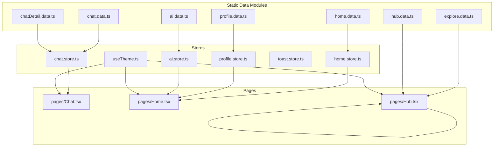
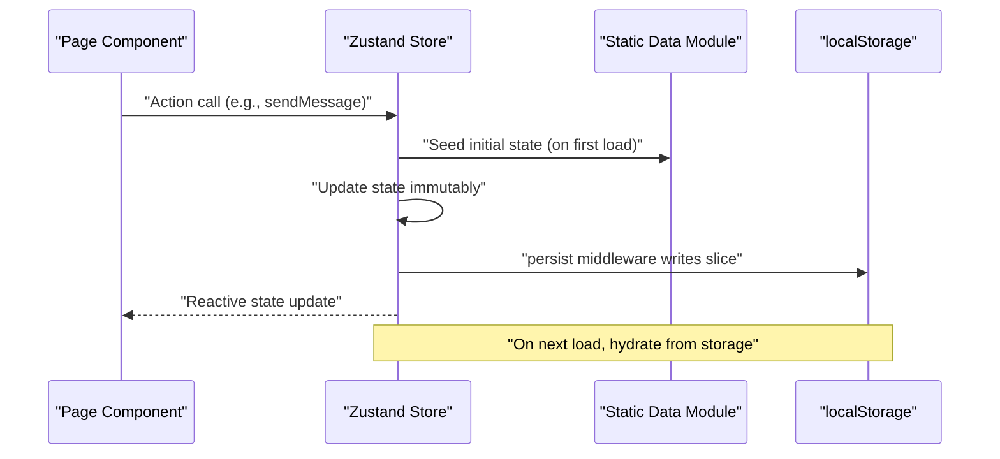
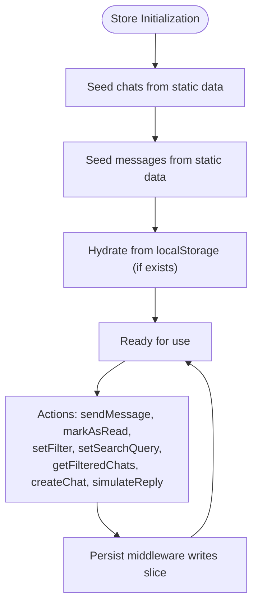
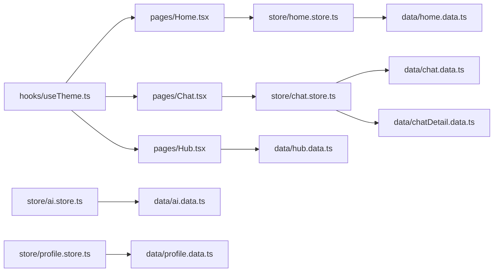
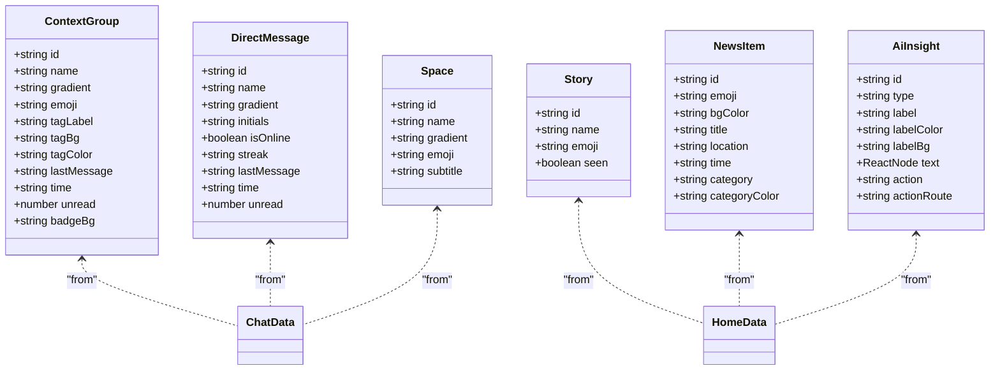

# Data Management

<cite>
**Referenced Files in This Document**
- [README.md](file://README.md)
- [package.json](file://package.json)
- [src/data/chat.data.ts](file://src/data/chat.data.ts)
- [src/data/chatDetail.data.ts](file://src/data/chatDetail.data.ts)
- [src/data/home.data.ts](file://src/data/home.data.ts)
- [src/data/explore.data.ts](file://src/data/explore.data.ts)
- [src/data/profile.data.ts](file://src/data/profile.data.ts)
- [src/data/ai.data.ts](file://src/data/ai.data.ts)
- [src/data/hub.data.ts](file://src/data/hub.data.ts)
- [src/store/chat.store.ts](file://src/store/chat.store.ts)
- [src/store/ai.store.ts](file://src/store/ai.store.ts)
- [src/store/home.store.ts](file://src/store/home.store.ts)
- [src/store/profile.store.ts](file://src/store/profile.store.ts)
- [src/store/toast.store.ts](file://src/store/toast.store.ts)
- [src/hooks/useTheme.ts](file://src/hooks/useTheme.ts)
- [src/pages/Chat.tsx](file://src/pages/Chat.tsx)
- [src/pages/Home.tsx](file://src/pages/Home.tsx)
- [src/pages/Hub.tsx](file://src/pages/Hub.tsx)
- [src/App.tsx](file://src/App.tsx)
- [src/main.tsx](file://src/main.tsx)
</cite>

## Table of Contents
1. [Introduction](#introduction)
2. [Project Structure](#project-structure)
3. [Core Components](#core-components)
4. [Architecture Overview](#architecture-overview)
5. [Detailed Component Analysis](#detailed-component-analysis)
6. [Dependency Analysis](#dependency-analysis)
7. [Performance Considerations](#performance-considerations)
8. [Troubleshooting Guide](#troubleshooting-guide)
9. [Conclusion](#conclusion)
10. [Appendices](#appendices)

## Introduction
This document describes VChat’s data management architecture with a focus on static data modules, state persistence, and lifecycle management. It covers how chat context data, home screen data, explore data, profile data, AI data, and hub data are structured and consumed, how state is persisted across sessions using localStorage, and how stores orchestrate data access patterns, caching, and performance. It also documents lifecycle operations, validation, error handling, security and privacy considerations, and guidelines for extending and optimizing data modules.

## Project Structure
VChat organizes data and state management along feature boundaries:
- Static data modules live under src/data and define strongly typed models and mock datasets.
- Stores under src/store encapsulate state, actions, and persistence using zustand with the persist middleware.
- Pages under src/pages consume stores and render UI, orchestrating data access and lifecycle events.

**Diagram sources**
- [src/data/chat.data.ts:1-134](file://src/data/chat.data.ts#L1-L134)
- [src/data/chatDetail.data.ts:1-71](file://src/data/chatDetail.data.ts#L1-L71)
- [src/data/home.data.ts:1-104](file://src/data/home.data.ts#L1-L104)
- [src/data/explore.data.ts:1-193](file://src/data/explore.data.ts#L1-L193)
- [src/data/profile.data.ts:1-77](file://src/data/profile.data.ts#L1-L77)
- [src/data/ai.data.ts:1-102](file://src/data/ai.data.ts#L1-L102)
- [src/data/hub.data.ts:1-247](file://src/data/hub.data.ts#L1-L247)
- [src/store/chat.store.ts:1-349](file://src/store/chat.store.ts#L1-L349)
- [src/store/ai.store.ts:1-162](file://src/store/ai.store.ts#L1-L162)
- [src/store/home.store.ts:1-55](file://src/store/home.store.ts#L1-L55)
- [src/store/profile.store.ts:1-138](file://src/store/profile.store.ts#L1-L138)
- [src/store/toast.store.ts:1-39](file://src/store/toast.store.ts#L1-L39)
- [src/hooks/useTheme.ts:1-36](file://src/hooks/useTheme.ts#L1-L36)
- [src/pages/Chat.tsx:1-245](file://src/pages/Chat.tsx#L1-L245)
- [src/pages/Home.tsx:1-295](file://src/pages/Home.tsx#L1-L295)
- [src/pages/Hub.tsx:1-300](file://src/pages/Hub.tsx#L1-L300)

**Section sources**
- [src/App.tsx:1-156](file://src/App.tsx#L1-L156)
- [src/main.tsx:1-11](file://src/main.tsx#L1-L11)

## Core Components
- Static data modules define strongly typed models and mock datasets for chat, home, explore, profile, AI, and hub domains. These are read-only at runtime and serve as seeds for stores.
- Stores manage reactive state, expose actions, and persist subsets of state to localStorage via the persist middleware. They also implement filtering, sorting, and simulated interactions.
- Pages subscribe to stores and drive UI updates, routing, and navigation.

Key characteristics:
- Strong typing: TypeScript interfaces and types ensure data correctness.
- Persistence: Zustand persist middleware serializes selected slices to localStorage.
- Seeding: Stores initialize state from static data modules.
- Access patterns: Pages call store actions; stores mutate state immutably and trigger re-renders.

**Section sources**
- [src/data/chat.data.ts:1-134](file://src/data/chat.data.ts#L1-L134)
- [src/data/home.data.ts:1-104](file://src/data/home.data.ts#L1-L104)
- [src/data/explore.data.ts:1-193](file://src/data/explore.data.ts#L1-L193)
- [src/data/profile.data.ts:1-77](file://src/data/profile.data.ts#L1-L77)
- [src/data/ai.data.ts:1-102](file://src/data/ai.data.ts#L1-L102)
- [src/data/hub.data.ts:1-247](file://src/data/hub.data.ts#L1-L247)
- [src/store/chat.store.ts:1-349](file://src/store/chat.store.ts#L1-L349)
- [src/store/ai.store.ts:1-162](file://src/store/ai.store.ts#L1-L162)
- [src/store/home.store.ts:1-55](file://src/store/home.store.ts#L1-L55)
- [src/store/profile.store.ts:1-138](file://src/store/profile.store.ts#L1-L138)
- [src/store/toast.store.ts:1-39](file://src/store/toast.store.ts#L1-L39)
- [src/hooks/useTheme.ts:1-36](file://src/hooks/useTheme.ts#L1-L36)

## Architecture Overview
The data lifecycle follows a predictable flow:
- Initialization: Stores seed state from static data modules.
- Runtime: Pages call store actions to mutate state; stores update immutable state and persist selected slices.
- Rendering: UI components subscribe to store state and re-render on changes.
- Persistence: Persist middleware writes state to localStorage; on reload, stores hydrate state from storage.

**Diagram sources**
- [src/store/chat.store.ts:171-330](file://src/store/chat.store.ts#L171-L330)
- [src/store/ai.store.ts:113-161](file://src/store/ai.store.ts#L113-L161)
- [src/store/home.store.ts:31-55](file://src/store/home.store.ts#L31-L55)
- [src/store/profile.store.ts:95-138](file://src/store/profile.store.ts#L95-L138)
- [src/data/chat.data.ts:35-134](file://src/data/chat.data.ts#L35-L134)
- [src/data/ai.data.ts:75-102](file://src/data/ai.data.ts#L75-L102)

## Detailed Component Analysis

### Static Data Modules

#### Chat Context Data
- Defines types for context groups, direct messages, and spaces.
- Provides seeded arrays for groups, DMs, and spaces used to bootstrap chat state.

Usage pattern:
- Stores import these arrays to seed initial chats and messages.
- UI renders avatars, tags, and metadata using these structures.

**Section sources**
- [src/data/chat.data.ts:1-134](file://src/data/chat.data.ts#L1-L134)
- [src/store/chat.store.ts:103-159](file://src/store/chat.store.ts#L103-L159)

#### Chat Detail Data
- Defines message types and a mock conversation array for a DM thread.
- Supports text and voice messages with optional translation and transcription fields.

Usage pattern:
- Used to seed messages for a specific chat in the chat store.

**Section sources**
- [src/data/chatDetail.data.ts:1-71](file://src/data/chatDetail.data.ts#L1-L71)
- [src/store/chat.store.ts:162-169](file://src/store/chat.store.ts#L162-L169)

#### Home Screen Data
- Defines story, news item, and AI insight structures.
- Provides mock datasets for stories, news, and AI insights.

Usage pattern:
- Home store consumes these to present curated content and manage visibility and dismissal.

**Section sources**
- [src/data/home.data.ts:1-104](file://src/data/home.data.ts#L1-L104)
- [src/store/home.store.ts:31-55](file://src/store/home.store.ts#L31-L55)

#### Explore Data
- Defines reels, posts, live streams, communities, and related structures.
- Provides mock datasets for social feeds and discovery features.

Usage pattern:
- Hub page consumes these to render service categories and discovery lists.

**Section sources**
- [src/data/explore.data.ts:1-193](file://src/data/explore.data.ts#L1-L193)
- [src/pages/Hub.tsx:1-300](file://src/pages/Hub.tsx#L1-L300)

#### Profile Data
- Defines streaks, connections, memory vault entries, and language settings.
- Provides mock datasets for personal stats and connections.

Usage pattern:
- Profile store seeds and manages profile-related state.

**Section sources**
- [src/data/profile.data.ts:1-77](file://src/data/profile.data.ts#L1-L77)
- [src/store/profile.store.ts:95-138](file://src/store/profile.store.ts#L95-L138)

#### AI Data
- Defines insight categories and a mock chat sequence for AI assistant.
- Provides initial messages and simulated responses logic.

Usage pattern:
- AI store uses these to seed history and generate dynamic responses.

**Section sources**
- [src/data/ai.data.ts:1-102](file://src/data/ai.data.ts#L1-L102)
- [src/store/ai.store.ts:113-161](file://src/store/ai.store.ts#L113-L161)

#### Hub Data
- Defines transactions, contacts, restaurants, jobs, hackathons, medical records, and mandi prices.
- Provides mock datasets for financial, professional, and health services.

Usage pattern:
- Hub page and related stores consume these to render service cards and lists.

**Section sources**
- [src/data/hub.data.ts:1-247](file://src/data/hub.data.ts#L1-L247)
- [src/pages/Hub.tsx:1-300](file://src/pages/Hub.tsx#L1-L300)

### Stores and Persistence

#### Chat Store
Responsibilities:
- Seed chats from context groups, direct messages, and spaces.
- Seed messages from chat detail data.
- Provide actions to send messages, mark as read, filter chats, search, create chats, and simulate replies.
- Persist chats, messages, filters, and search query to localStorage.

Persistence strategy:
- Uses persist middleware with a custom partialize to serialize only relevant slices.

**Diagram sources**
- [src/store/chat.store.ts:103-169](file://src/store/chat.store.ts#L103-L169)
- [src/store/chat.store.ts:171-330](file://src/store/chat.store.ts#L171-L330)

**Section sources**
- [src/store/chat.store.ts:1-349](file://src/store/chat.store.ts#L1-L349)

#### AI Store
Responsibilities:
- Seed initial AI chat messages from mock data.
- Provide actions to send messages and clear history.
- Simulate AI responses with delays and keyword-based replies.
- Persist messages and typing state to localStorage.

**Section sources**
- [src/store/ai.store.ts:1-162](file://src/store/ai.store.ts#L1-L162)
- [src/data/ai.data.ts:75-102](file://src/data/ai.data.ts#L75-L102)

#### Home Store
Responsibilities:
- Seed stories, news items, and AI insights from home data.
- Track seen stories, dismissed insights, unread notifications, and story tabs.
- Provide actions to mark stories seen, dismiss insights, set story tab, clear notifications, compute greetings, and filter visible insights.

**Section sources**
- [src/store/home.store.ts:1-55](file://src/store/home.store.ts#L1-L55)
- [src/data/home.data.ts:30-104](file://src/data/home.data.ts#L30-L104)

#### Profile Store
Responsibilities:
- Seed profile, stats, streaks, connections, and moments from profile data.
- Provide actions to update profile fields, change streak themes, and increment stats.
- Persist profile, stats, streaks, connections, and moments to localStorage.

**Section sources**
- [src/store/profile.store.ts:1-138](file://src/store/profile.store.ts#L1-L138)
- [src/data/profile.data.ts:1-77](file://src/data/profile.data.ts#L1-L77)

#### Toast Store
Responsibilities:
- Manage transient toast notifications with auto-dismissal.
- No persistence: ephemeral UI state only.

**Section sources**
- [src/store/toast.store.ts:1-39](file://src/store/toast.store.ts#L1-L39)

#### Theme Store
Responsibilities:
- Toggle and initialize theme preference.
- Persist theme selection to localStorage.

**Section sources**
- [src/hooks/useTheme.ts:1-36](file://src/hooks/useTheme.ts#L1-L36)

### Data Access Patterns and Caching
- One-way seeding: Stores import static data to initialize state.
- Immutable updates: All state mutations are performed immutably via setters.
- Local caching: Persist middleware caches state in localStorage; hydration occurs on mount.
- Filtering and sorting: Stores implement client-side filtering and time-based sorting for chats.
- Ephemeral UI state: Toasts are not persisted.

**Section sources**
- [src/store/chat.store.ts:218-266](file://src/store/chat.store.ts#L218-L266)
- [src/store/toast.store.ts:17-39](file://src/store/toast.store.ts#L17-L39)

### Data Lifecycle
- Initialization: On first load, stores seed from static data; subsequent loads hydrate from localStorage.
- Updates: Actions mutate state; UI re-renders reactively; persist middleware writes updated slices.
- Synchronization: UI state reflects store state; no external sync layer is present.
- Cleanup: No explicit cleanup routines; localStorage remains until manual reset or browser clearing.

**Section sources**
- [src/store/chat.store.ts:171-330](file://src/store/chat.store.ts#L171-L330)
- [src/store/ai.store.ts:113-161](file://src/store/ai.store.ts#L113-L161)
- [src/store/home.store.ts:31-55](file://src/store/home.store.ts#L31-L55)
- [src/store/profile.store.ts:95-138](file://src/store/profile.store.ts#L95-L138)

### Validation Rules and Business Logic
- Validation: No runtime schema validation is implemented; stores assume static data correctness.
- Business logic:
  - Chat sorting prioritizes non-empty time fields and applies special-case handling for relative time strings.
  - AI responses are generated via keyword matching with randomized defaults.
  - Profile updates are constrained to provided action signatures.

**Section sources**
- [src/store/chat.store.ts:332-348](file://src/store/chat.store.ts#L332-L348)
- [src/store/ai.store.ts:61-111](file://src/store/ai.store.ts#L61-L111)
- [src/store/profile.store.ts:104-125](file://src/store/profile.store.ts#L104-L125)

### Error Handling Strategies
- No explicit try/catch blocks in stores; errors are not handled at the data layer.
- UI components handle navigation and prompt flows; no centralized error store is present.
- Recommendations:
  - Wrap store actions in try/catch where network-like behavior is simulated.
  - Add toast notifications for failed operations.
  - Validate inputs before mutation.

**Section sources**
- [src/store/chat.store.ts:179-200](file://src/store/chat.store.ts#L179-L200)
- [src/store/ai.store.ts:119-148](file://src/store/ai.store.ts#L119-L148)

### Security, Privacy, and Retention
- Data scope: All data is static mock data; no sensitive user data is persisted by default.
- Storage: Only selected slices are persisted; no personally identifiable information is stored.
- Compliance: No encryption or anonymization is implemented; ensure compliance with applicable regulations if real data is introduced.
- Retention: No automatic cleanup; users can clear browser storage to reset persisted state.

**Section sources**
- [src/store/chat.store.ts:320-329](file://src/store/chat.store.ts#L320-L329)
- [src/store/ai.store.ts:157-160](file://src/store/ai.store.ts#L157-L160)
- [src/store/home.store.ts:32-33](file://src/store/home.store.ts#L32-L33)
- [src/store/profile.store.ts:127-137](file://src/store/profile.store.ts#L127-L137)

### Implementation Guidelines
- Adding a new static data module:
  - Define TypeScript types in a new file under src/data.
  - Export typed arrays or objects as named constants.
  - Import into the corresponding store to seed state.
- Extending existing structures:
  - Add fields to types and static arrays; ensure stores handle optional fields gracefully.
  - Update store actions to incorporate new fields.
- Optimizing access patterns:
  - Prefer memoized selectors or derived computations in stores for expensive filters/sorts.
  - Paginate or virtualize large lists in pages.
  - Debounce search queries to reduce re-computation.
- Backup and restore:
  - Export localStorage keys for supported stores and save to a file.
  - Restore by writing the saved JSON back to the appropriate localStorage keys.
- Data integrity verification:
  - Validate IDs and relationships when seeding.
  - Add unit tests for store selectors and reducers.

**Section sources**
- [src/data/chat.data.ts:1-134](file://src/data/chat.data.ts#L1-L134)
- [src/store/chat.store.ts:103-169](file://src/store/chat.store.ts#L103-L169)

## Dependency Analysis
The following diagram shows how pages depend on stores and how stores depend on static data modules.

**Diagram sources**
- [src/pages/Chat.tsx:1-245](file://src/pages/Chat.tsx#L1-L245)
- [src/pages/Home.tsx:1-295](file://src/pages/Home.tsx#L1-L295)
- [src/pages/Hub.tsx:1-300](file://src/pages/Hub.tsx#L1-L300)
- [src/store/chat.store.ts:1-349](file://src/store/chat.store.ts#L1-L349)
- [src/store/ai.store.ts:1-162](file://src/store/ai.store.ts#L1-L162)
- [src/store/home.store.ts:1-55](file://src/store/home.store.ts#L1-L55)
- [src/store/profile.store.ts:1-138](file://src/store/profile.store.ts#L1-L138)
- [src/store/toast.store.ts:1-39](file://src/store/toast.store.ts#L1-L39)
- [src/hooks/useTheme.ts:1-36](file://src/hooks/useTheme.ts#L1-L36)
- [src/data/chat.data.ts:1-134](file://src/data/chat.data.ts#L1-L134)
- [src/data/chatDetail.data.ts:1-71](file://src/data/chatDetail.data.ts#L1-L71)
- [src/data/home.data.ts:1-104](file://src/data/home.data.ts#L1-L104)
- [src/data/ai.data.ts:1-102](file://src/data/ai.data.ts#L1-L102)
- [src/data/profile.data.ts:1-77](file://src/data/profile.data.ts#L1-L77)
- [src/data/hub.data.ts:1-247](file://src/data/hub.data.ts#L1-L247)

**Section sources**
- [src/pages/Chat.tsx:1-245](file://src/pages/Chat.tsx#L1-L245)
- [src/pages/Home.tsx:1-295](file://src/pages/Home.tsx#L1-L295)
- [src/pages/Hub.tsx:1-300](file://src/pages/Hub.tsx#L1-L300)
- [src/store/chat.store.ts:1-349](file://src/store/chat.store.ts#L1-L349)
- [src/store/ai.store.ts:1-162](file://src/store/ai.store.ts#L1-L162)
- [src/store/home.store.ts:1-55](file://src/store/home.store.ts#L1-L55)
- [src/store/profile.store.ts:1-138](file://src/store/profile.store.ts#L1-L138)
- [src/store/toast.store.ts:1-39](file://src/store/toast.store.ts#L1-L39)
- [src/hooks/useTheme.ts:1-36](file://src/hooks/useTheme.ts#L1-L36)
- [src/data/chat.data.ts:1-134](file://src/data/chat.data.ts#L1-L134)
- [src/data/chatDetail.data.ts:1-71](file://src/data/chatDetail.data.ts#L1-L71)
- [src/data/home.data.ts:1-104](file://src/data/home.data.ts#L1-L104)
- [src/data/ai.data.ts:1-102](file://src/data/ai.data.ts#L1-L102)
- [src/data/profile.data.ts:1-77](file://src/data/profile.data.ts#L1-L77)
- [src/data/hub.data.ts:1-247](file://src/data/hub.data.ts#L1-L247)

## Performance Considerations
- Client-side filtering and sorting: For large datasets, consider pagination, debounced search, and virtualized lists.
- Immutability: Keep updates shallow and avoid unnecessary re-renders by structuring state efficiently.
- Persist overhead: Persist only essential slices; avoid persisting very large arrays.
- Simulated AI responses: Cap response generation complexity; cache frequent responses.
- Time parsing: Special-case handling for relative time strings is efficient; avoid heavy computations in render paths.

[No sources needed since this section provides general guidance]

## Troubleshooting Guide
Common issues and remedies:
- State not persisting:
  - Verify persist middleware is configured and the store key matches the intended slice.
  - Confirm localStorage availability and permissions.
- Hydration mismatch:
  - Ensure seeded data and persisted state shapes align; adjust partialize accordingly.
- Chat sorting anomalies:
  - Review time parsing logic for edge cases; normalize time strings consistently.
- Excessive re-renders:
  - Extract selectors to derive computed values; memoize where appropriate.
- Toasts not disappearing:
  - Check duration and removal logic; ensure IDs are unique and timeouts are cleared.

**Section sources**
- [src/store/chat.store.ts:332-348](file://src/store/chat.store.ts#L332-L348)
- [src/store/toast.store.ts:17-39](file://src/store/toast.store.ts#L17-L39)

## Conclusion
VChat’s data management relies on a clean separation between static data modules and zustand stores with localStorage persistence. The architecture supports fast prototyping and interactive UIs with minimal boilerplate. For production readiness, introduce schema validation, robust error handling, and performance optimizations tailored to larger datasets.

[No sources needed since this section summarizes without analyzing specific files]

## Appendices

### Appendix A: Data Models Overview

**Diagram sources**
- [src/data/chat.data.ts:1-134](file://src/data/chat.data.ts#L1-L134)
- [src/data/home.data.ts:1-104](file://src/data/home.data.ts#L1-L104)