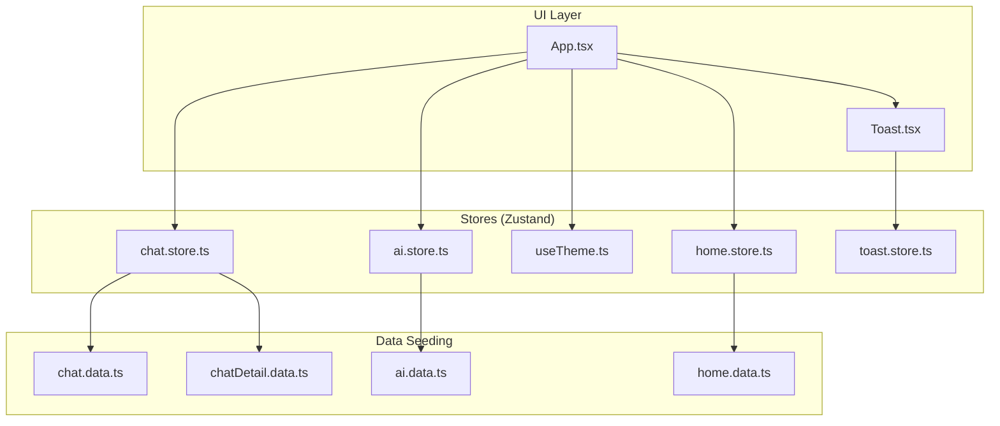
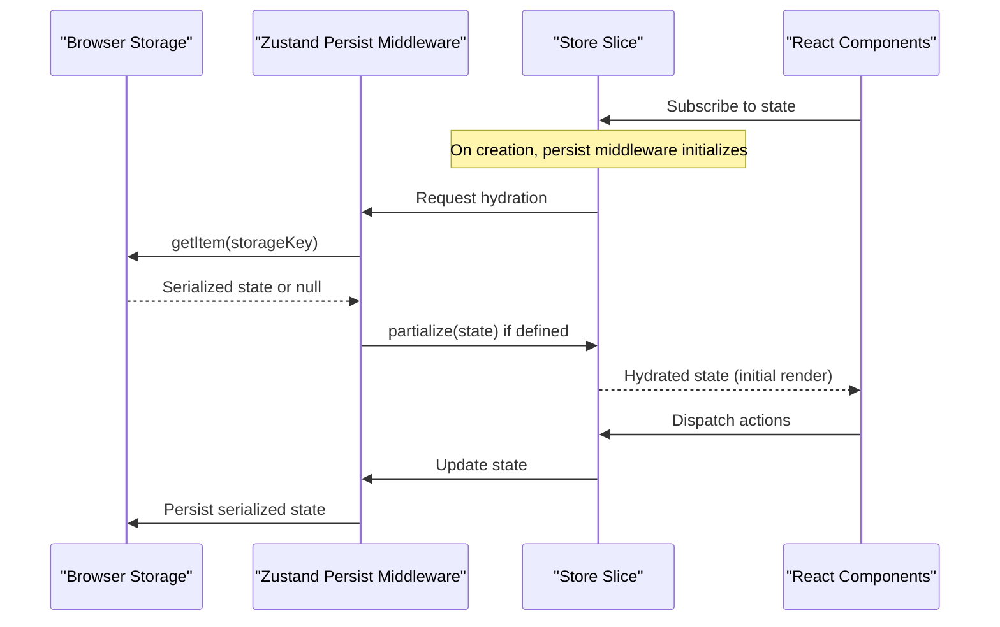
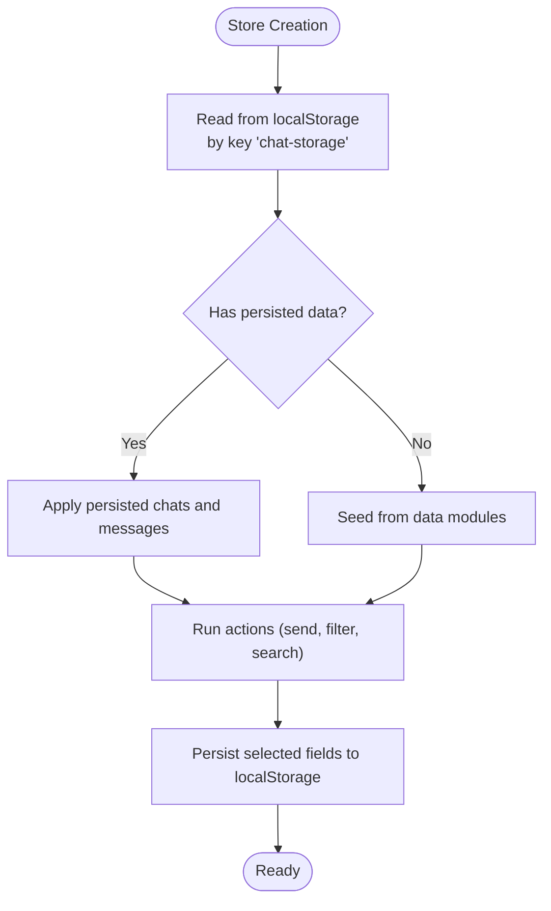
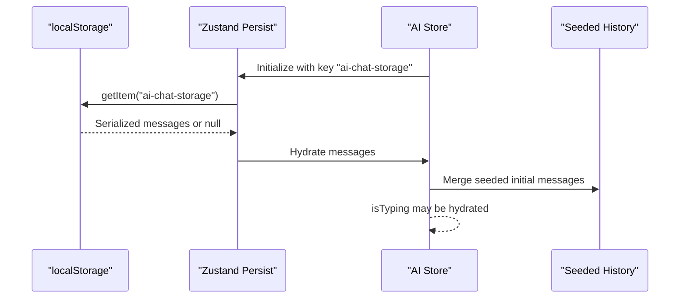
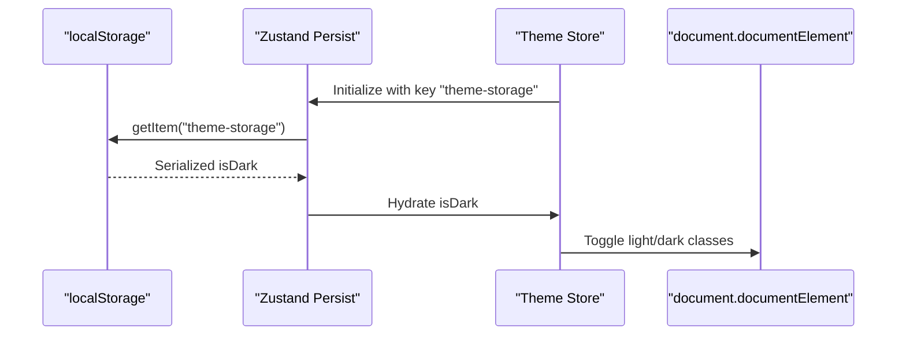
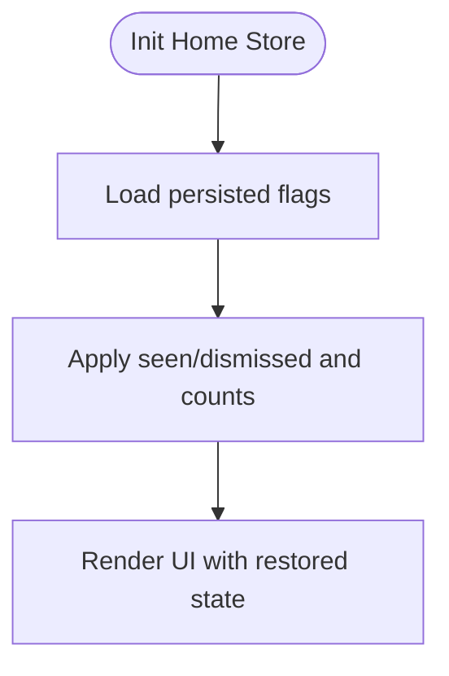
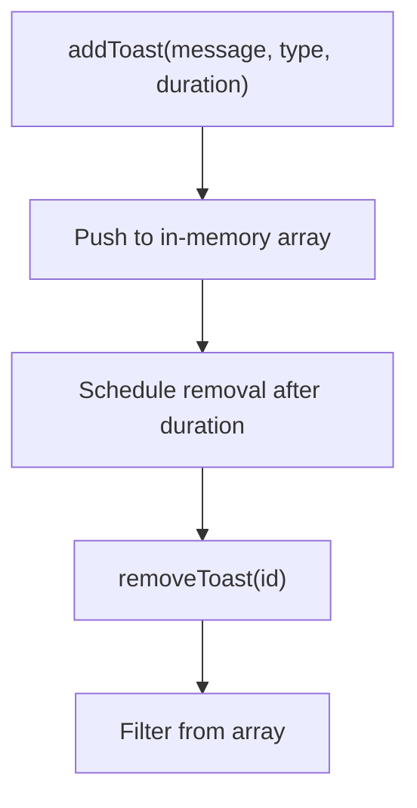
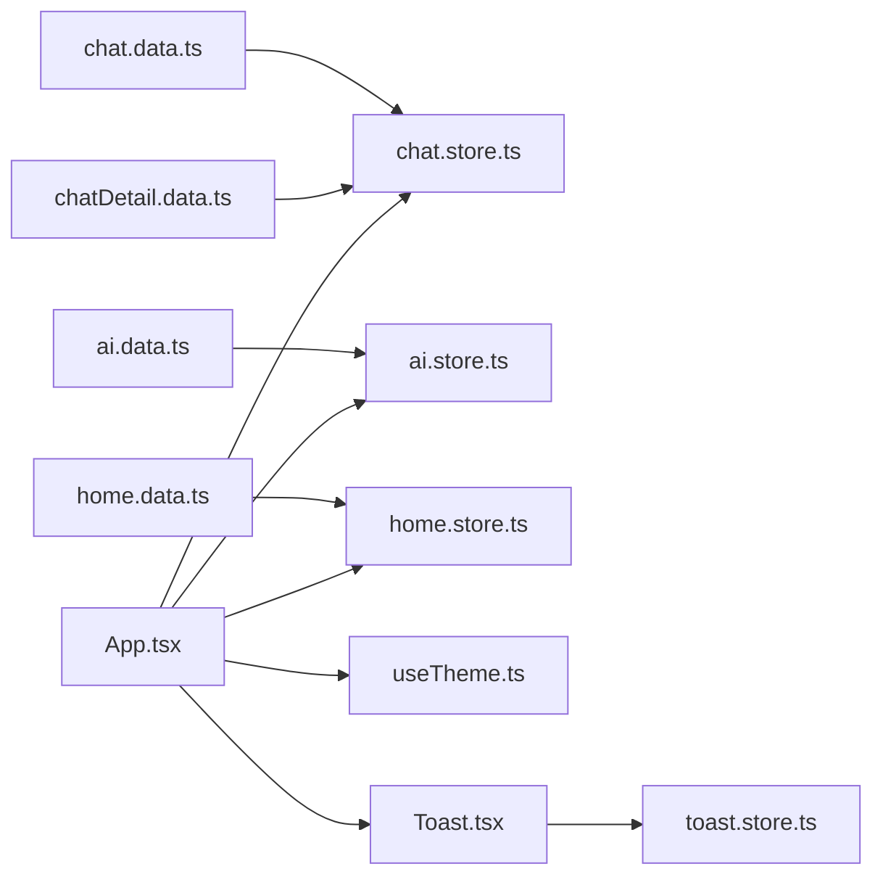

# Data Persistence

<cite>
**Referenced Files in This Document**
- [chat.store.ts](file://src/store/chat.store.ts)
- [ai.store.ts](file://src/store/ai.store.ts)
- [toast.store.ts](file://src/store/toast.store.ts)
- [useTheme.ts](file://src/hooks/useTheme.ts)
- [home.store.ts](file://src/store/home.store.ts)
- [chat.data.ts](file://src/data/chat.data.ts)
- [chatDetail.data.ts](file://src/data/chatDetail.data.ts)
- [ai.data.ts](file://src/data/ai.data.ts)
- [home.data.ts](file://src/data/home.data.ts)
- [Toast.tsx](file://src/components/Toast.tsx)
- [App.tsx](file://src/App.tsx)
- [main.tsx](file://src/main.tsx)
</cite>

## Table of Contents
1. [Introduction](#introduction)
2. [Project Structure](#project-structure)
3. [Core Components](#core-components)
4. [Architecture Overview](#architecture-overview)
5. [Detailed Component Analysis](#detailed-component-analysis)
6. [Dependency Analysis](#dependency-analysis)
7. [Performance Considerations](#performance-considerations)
8. [Troubleshooting Guide](#troubleshooting-guide)
9. [Conclusion](#conclusion)
10. [Appendices](#appendices)

## Introduction
This document explains VChat’s data persistence strategy and its integration with browser storage. The application persists selected state using localStorage via Zustand’s persist middleware. It focuses on chat conversations, AI interactions, theme preferences, and toast notifications. The documentation covers persistence patterns, serialization/deserialization, memory-to-storage synchronization, state hydration on startup, selective persistence, performance and storage hygiene, integrity checks, and operational guidance for extending persistence safely.

## Project Structure
VChat organizes persistence logic primarily in dedicated Zustand stores under src/store. Each store declares a localStorage-backed slice of state and optionally defines which parts are persisted. Supporting data modules under src/data seed initial state for chats and AI history. UI components consume these stores and render state.

**Diagram sources**
- [App.tsx:135-148](file://src/App.tsx#L135-L148)
- [Toast.tsx:6-7](file://src/components/Toast.tsx#L6-L7)
- [chat.store.ts:171-330](file://src/store/chat.store.ts#L171-L330)
- [ai.store.ts:113-161](file://src/store/ai.store.ts#L113-L161)
- [useTheme.ts:10-36](file://src/hooks/useTheme.ts#L10-L36)
- [home.store.ts:31-102](file://src/store/home.store.ts#L31-L102)
- [toast.store.ts:17-38](file://src/store/toast.store.ts#L17-L38)
- [chat.data.ts:35-134](file://src/data/chat.data.ts#L35-L134)
- [chatDetail.data.ts:19-71](file://src/data/chatDetail.data.ts#L19-L71)
- [ai.data.ts:75-102](file://src/data/ai.data.ts#L75-L102)
- [home.data.ts:30-104](file://src/data/home.data.ts#L30-L104)

**Section sources**
- [App.tsx:135-148](file://src/App.tsx#L135-L148)
- [main.tsx:6-10](file://src/main.tsx#L6-L10)

## Core Components
- Chat Store: Manages conversations, per-chat message lists, filters, and search. Persists chats, message maps, filters, and search query.
- AI Store: Manages AI chat history and typing indicator. Persists messages and typing state.
- Theme Store: Manages dark/light theme preference and applies CSS classes. Persists theme preference.
- Home Store: Manages stories, news, AI insights, and user interactions. Persists user-specific flags and counters.
- Toast Store: Manages transient notifications. Does not persist (volatile).

Key characteristics:
- Persistence keys: “chat-storage”, “ai-chat-storage”, “theme-storage”, “home-storage”.
- Partialization: Selective persistence via partialize functions to avoid persisting large or volatile data.
- Hydration: Zustand hydrates persisted slices automatically on app load.

**Section sources**
- [chat.store.ts:320-329](file://src/store/chat.store.ts#L320-L329)
- [ai.store.ts:157-159](file://src/store/ai.store.ts#L157-L159)
- [useTheme.ts:32-34](file://src/hooks/useTheme.ts#L32-L34)
- [home.store.ts:92-100](file://src/store/home.store.ts#L92-L100)
- [toast.store.ts:17-38](file://src/store/toast.store.ts#L17-L38)

## Architecture Overview
The persistence architecture relies on Zustand’s persist middleware. Stores define a storage key and, where applicable, a partialize function to select which state fields are serialized. On startup, Zustand reads from localStorage and hydrates the store. UI components subscribe to store slices and re-render accordingly.

**Diagram sources**
- [chat.store.ts:171-330](file://src/store/chat.store.ts#L171-L330)
- [ai.store.ts:113-161](file://src/store/ai.store.ts#L113-L161)
- [useTheme.ts:10-36](file://src/hooks/useTheme.ts#L10-L36)
- [home.store.ts:31-102](file://src/store/home.store.ts#L31-L102)

## Detailed Component Analysis

### Chat Store Persistence
- Persistence key: “chat-storage”
- Persisted fields: chats, messages (per-chat arrays), activeFilter, searchQuery
- Serialization: Uses default serializer; partialize selects only persisted fields
- Hydration: On app load, chats and messages are hydrated from localStorage
- Memory-to-storage sync: Every mutation updates localStorage immediately via Zustand persist
- Volatile data: Message content is persisted; ephemeral UI flags are not persisted

**Diagram sources**
- [chat.store.ts:171-330](file://src/store/chat.store.ts#L171-L330)
- [chat.data.ts:35-134](file://src/data/chat.data.ts#L35-L134)
- [chatDetail.data.ts:19-71](file://src/data/chatDetail.data.ts#L19-L71)

**Section sources**
- [chat.store.ts:171-330](file://src/store/chat.store.ts#L171-L330)
- [chat.data.ts:35-134](file://src/data/chat.data.ts#L35-L134)
- [chatDetail.data.ts:19-71](file://src/data/chatDetail.data.ts#L19-L71)

### AI Store Persistence
- Persistence key: “ai-chat-storage”
- Persisted fields: messages, isTyping
- Serialization: Default serializer
- Hydration: On load, initial AI messages are augmented by seeded history
- Notes: isTyping is persisted to maintain typing indicator across sessions

**Diagram sources**
- [ai.store.ts:113-161](file://src/store/ai.store.ts#L113-L161)
- [ai.data.ts:75-102](file://src/data/ai.data.ts#L75-L102)

**Section sources**
- [ai.store.ts:113-161](file://src/store/ai.store.ts#L113-L161)
- [ai.data.ts:75-102](file://src/data/ai.data.ts#L75-L102)

### Theme Store Persistence
- Persistence key: “theme-storage”
- Persisted fields: isDark
- Behavior: Applies CSS classes to document root on toggle/init
- Hydration: Restores theme preference on app load

**Diagram sources**
- [useTheme.ts:10-36](file://src/hooks/useTheme.ts#L10-L36)

**Section sources**
- [useTheme.ts:10-36](file://src/hooks/useTheme.ts#L10-L36)

### Home Store Persistence
- Persistence key: “home-storage”
- Persisted fields: seenStories, dismissedInsights, unreadNotifications, storyTab
- Serialization: partialize restricts persistence to user-interaction flags and counters
- Hydration: Restores user-specific visibility and notification state

**Diagram sources**
- [home.store.ts:31-102](file://src/store/home.store.ts#L31-L102)
- [home.data.ts:30-104](file://src/data/home.data.ts#L30-L104)

**Section sources**
- [home.store.ts:31-102](file://src/store/home.store.ts#L31-L102)
- [home.data.ts:30-104](file://src/data/home.data.ts#L30-L104)

### Toast Store Persistence
- Toasts are transient notifications managed in memory
- No persistence: toasts are not written to localStorage
- Cleanup: automatic removal after duration or manual dismissal

**Diagram sources**
- [toast.store.ts:17-38](file://src/store/toast.store.ts#L17-L38)
- [Toast.tsx:6-7](file://src/components/Toast.tsx#L6-L7)

**Section sources**
- [toast.store.ts:17-38](file://src/store/toast.store.ts#L17-L38)
- [Toast.tsx:6-7](file://src/components/Toast.tsx#L6-L7)

## Dependency Analysis
- Stores depend on data modules for seeding initial state.
- UI components depend on stores for rendering and interactivity.
- Persistence is isolated to each store via its own key and optional partialize.

**Diagram sources**
- [chat.store.ts:103-169](file://src/store/chat.store.ts#L103-L169)
- [ai.store.ts:19-51](file://src/store/ai.store.ts#L19-L51)
- [home.store.ts:34-36](file://src/store/home.store.ts#L34-L36)
- [App.tsx:135-148](file://src/App.tsx#L135-L148)
- [Toast.tsx:6-7](file://src/components/Toast.tsx#L6-L7)

**Section sources**
- [chat.store.ts:103-169](file://src/store/chat.store.ts#L103-L169)
- [ai.store.ts:19-51](file://src/store/ai.store.ts#L19-L51)
- [home.store.ts:34-36](file://src/store/home.store.ts#L34-L36)
- [App.tsx:135-148](file://src/App.tsx#L135-L148)
- [Toast.tsx:6-7](file://src/components/Toast.tsx#L6-L7)

## Performance Considerations
- Storage volume control
  - Prefer partialize to limit persisted payload (already implemented for chat and home).
  - Avoid persisting large or frequently changing arrays; keep only essential identifiers or flags.
- Serialization overhead
  - Default JSON serialization is straightforward; avoid storing non-serializable values.
- Read/write frequency
  - Persist middleware writes on every state change; batch UI updates to reduce churn.
- Large datasets
  - For extensive message histories, consider pagination or trimming older entries before persisting.
- Storage quotas and cleanup
  - Monitor localStorage size; implement periodic cleanup of stale keys.
  - Provide user-initiated reset actions for heavy profiles.
- Concurrency
  - localStorage is synchronous and single-instance per origin; avoid simultaneous writers.
  - If multiple tabs are used, cross-tab events can cause conflicts; consider a simple mutex or debounce strategy at the application level.

[No sources needed since this section provides general guidance]

## Troubleshooting Guide
- Symptoms: State not restoring on reload
  - Verify the store’s persistence key and ensure partialize includes the intended fields.
  - Confirm the store is initialized before UI mounts.
- Corruption or invalid data
  - Clear the specific localStorage key for the affected store.
  - Implement a migration strategy to normalize schema changes.
- Storage errors
  - Wrap persistence operations in try/catch and fall back to in-memory state.
  - Provide a warning UI and offer manual export/import of critical data.
- Toasts not disappearing
  - Ensure durations are positive and timeouts are scheduled.
  - Check that removeToast filters correctly by id.

**Section sources**
- [chat.store.ts:320-329](file://src/store/chat.store.ts#L320-L329)
- [home.store.ts:92-100](file://src/store/home.store.ts#L92-L100)
- [toast.store.ts:17-38](file://src/store/toast.store.ts#L17-L38)

## Conclusion
VChat employs a pragmatic, selective persistence model using Zustand’s persist middleware. Only essential, user-driven state is persisted, while volatile UI and transient data remain in memory. This approach balances reliability, performance, and simplicity. The stores are structured to enable safe extension with clear patterns for hydration, partialization, and fallbacks.

[No sources needed since this section summarizes without analyzing specific files]

## Appendices

### A. State Hydration on Startup
- Each store initializes its slice from localStorage using its configured key.
- If no persisted data exists, stores seed from data modules.
- UI components subscribe to hydrated slices and render immediately.

**Section sources**
- [chat.store.ts:171-330](file://src/store/chat.store.ts#L171-L330)
- [ai.store.ts:113-161](file://src/store/ai.store.ts#L113-L161)
- [useTheme.ts:10-36](file://src/hooks/useTheme.ts#L10-L36)
- [home.store.ts:31-102](file://src/store/home.store.ts#L31-L102)

### B. Data Migration Strategy
- Define a migration function that transforms old schema versions to the current schema.
- Version the stored data (e.g., include a version field).
- On load, detect version and apply migrations before hydrating the store.
- Keep migrations idempotent and backward-compatible.

[No sources needed since this section provides general guidance]

### C. Integrity Verification and Recovery
- Serialize/deserialize roundtrip test: write a known state and read it back.
- Validate critical fields (IDs, timestamps) after hydration.
- On failure, clear the offending key and re-seed from data modules.

[No sources needed since this section provides general guidance]

### D. Backup and Restore
- Export persisted slices as JSON for user-managed backups.
- Provide restore UI to import and merge data into the current store.
- Sanitize imported data and validate against current schema.

[No sources needed since this section provides general guidance]

### E. Adding New Persistent State
- Choose a unique storage key for the store.
- Decide whether to persist all fields or use partialize to limit scope.
- Ensure all values are serializable.
- Test hydration and migration paths early.

**Section sources**
- [chat.store.ts:320-329](file://src/store/chat.store.ts#L320-L329)
- [home.store.ts:92-100](file://src/store/home.store.ts#L92-L100)

### F. Optimizing Storage Efficiency
- Minimize persisted fields; prefer compact identifiers over full objects.
- Trim histories proactively; persist only recent N items.
- Debounce frequent writes; coalesce updates where appropriate.

[No sources needed since this section provides general guidance]

### G. Handling Concurrent Access Patterns
- Avoid simultaneous writes to the same key from multiple tabs.
- Use a simple application-level lock or queue updates.
- Consider broadcasting changes via storage events to synchronize tabs.

[No sources needed since this section provides general guidance]