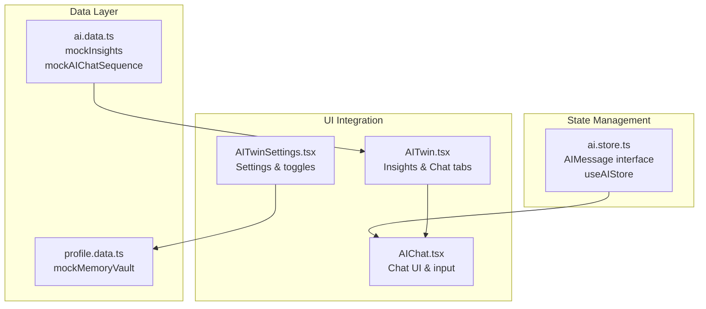
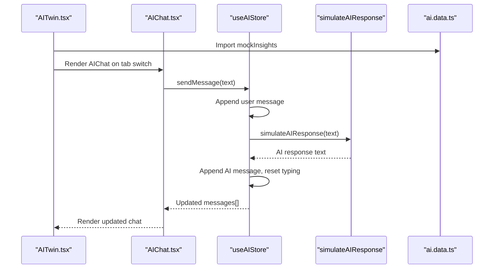
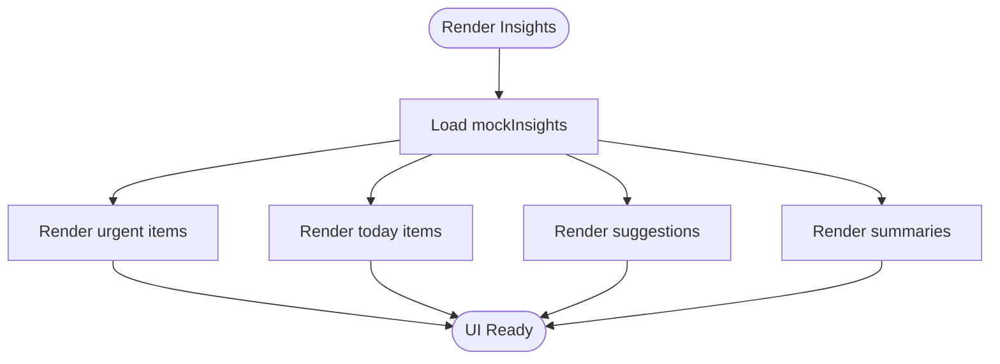
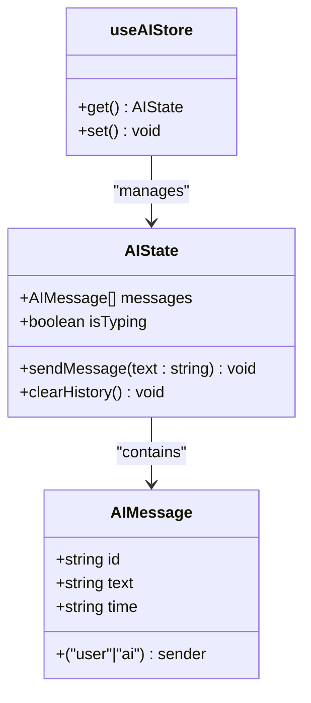
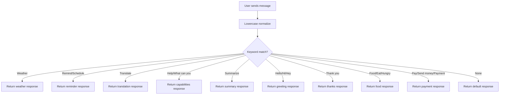
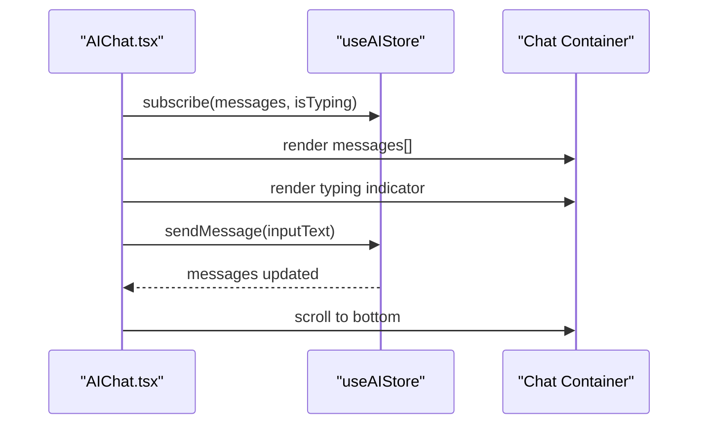
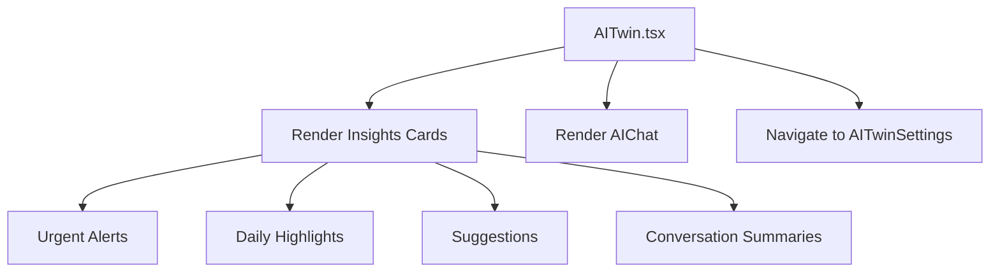
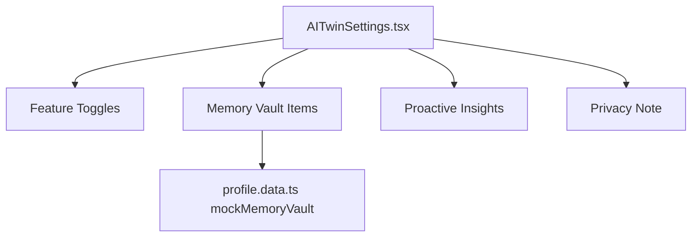
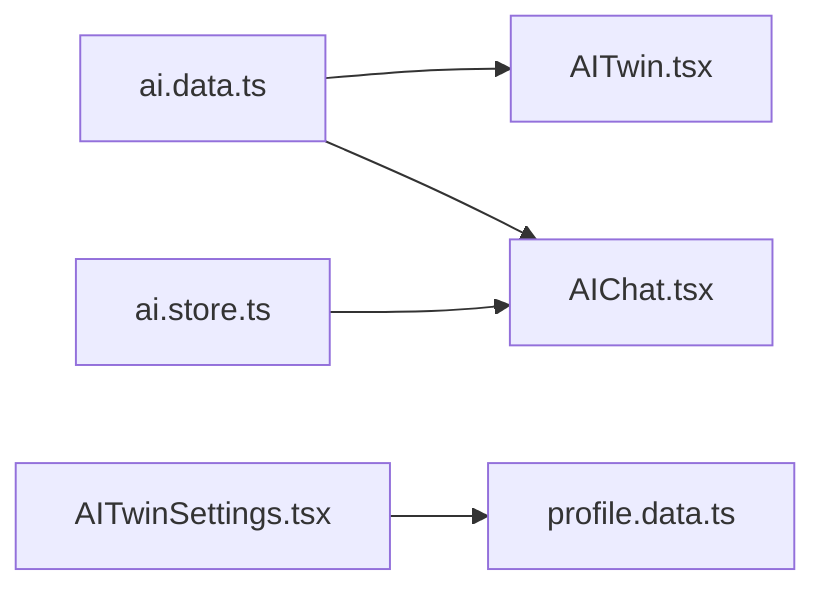

# AI Content Data

<cite>
**Referenced Files in This Document**
- [ai.data.ts](file://src/data/ai.data.ts)
- [ai.store.ts](file://src/store/ai.store.ts)
- [AITwin.tsx](file://src/pages/AITwin.tsx)
- [AIChat.tsx](file://src/pages/ai/AIChat.tsx)
- [AITwinSettings.tsx](file://src/pages/profile/AITwinSettings.tsx)
- [profile.data.ts](file://src/data/profile.data.ts)
- [chat.data.ts](file://src/data/chat.data.ts)
</cite>

## Table of Contents
1. [Introduction](#introduction)
2. [Project Structure](#project-structure)
3. [Core Components](#core-components)
4. [Architecture Overview](#architecture-overview)
5. [Detailed Component Analysis](#detailed-component-analysis)
6. [Dependency Analysis](#dependency-analysis)
7. [Performance Considerations](#performance-considerations)
8. [Troubleshooting Guide](#troubleshooting-guide)
9. [Conclusion](#conclusion)
10. [Appendices](#appendices)

## Introduction
This document describes the AI content data module responsible for AI Twin features in the application. It covers the data structures used for insights, suggestions, conversation history, and AI-generated content. It explains how this data organizes AI features, integrates with AI processing components, and supports the AI Twin dashboard and AI chat interfaces. It also provides examples of data consumption patterns, content generation techniques, response formatting, validation requirements, quality controls, performance considerations, and guidelines for extending AI content types.

## Project Structure
The AI content data module is organized around two primary areas:
- Data definitions and mock datasets for AI Twin insights and chat sequences
- Store logic for managing AI message state, typing indicators, and simulated AI responses

**Diagram sources**
- [ai.data.ts:1-102](file://src/data/ai.data.ts#L1-L102)
- [ai.store.ts:1-162](file://src/store/ai.store.ts#L1-L162)
- [AITwin.tsx:1-135](file://src/pages/AITwin.tsx#L1-L135)
- [AIChat.tsx:1-127](file://src/pages/ai/AIChat.tsx#L1-L127)
- [AITwinSettings.tsx:1-128](file://src/pages/profile/AITwinSettings.tsx#L1-L128)
- [profile.data.ts:59-63](file://src/data/profile.data.ts#L59-L63)

**Section sources**
- [ai.data.ts:1-102](file://src/data/ai.data.ts#L1-L102)
- [ai.store.ts:1-162](file://src/store/ai.store.ts#L1-L162)
- [AITwin.tsx:1-135](file://src/pages/AITwin.tsx#L1-L135)
- [AIChat.tsx:1-127](file://src/pages/ai/AIChat.tsx#L1-L127)
- [AITwinSettings.tsx:1-128](file://src/pages/profile/AITwinSettings.tsx#L1-L128)
- [profile.data.ts:59-63](file://src/data/profile.data.ts#L59-L63)

## Core Components
- AI Twin insights dataset: structured collections for urgent alerts, daily highlights, suggestions, and conversation summaries.
- AI chat message dataset: a sequence of pre-seeded messages to bootstrap the chat UI.
- AI message state model: typed representation of chat messages with sender, text, and timestamps.
- AI store: manages message history, typing state, sending messages, simulating AI responses, and persistence.
- UI integration: AITwin page renders insights and routes to AIChat; AIChat displays messages and handles user input.

Key data types and structures:
- Insight categories: urgent, today, suggestions, summaries
- Message shape: id, sender, text, time
- Store state: messages[], isTyping, actions to send and clear history

**Section sources**
- [ai.data.ts:1-102](file://src/data/ai.data.ts#L1-L102)
- [ai.store.ts:4-17](file://src/store/ai.store.ts#L4-L17)
- [AITwin.tsx:4-135](file://src/pages/AITwin.tsx#L4-L135)
- [AIChat.tsx:1-127](file://src/pages/ai/AIChat.tsx#L1-L127)

## Architecture Overview
The AI content architecture connects data definitions, state management, and UI components to deliver AI Twin insights and chat experiences.

**Diagram sources**
- [AITwin.tsx:4-135](file://src/pages/AITwin.tsx#L4-L135)
- [AIChat.tsx:9-26](file://src/pages/ai/AIChat.tsx#L9-L26)
- [ai.store.ts:119-148](file://src/store/ai.store.ts#L119-L148)
- [ai.store.ts:61-111](file://src/store/ai.store.ts#L61-L111)
- [ai.data.ts:1-102](file://src/data/ai.data.ts#L1-L102)

## Detailed Component Analysis

### AI Insights Data Model
The insights dataset organizes AI-provided content into distinct categories:
- Urgent: high-priority items with red accent color
- Today: daily highlights with amber accent color
- Suggestions: personalized recommendations with primary accent color
- Summaries: group conversation summaries with metadata

Each item includes identifiers, titles, descriptions, actions, and optional grouping attributes. The UI consumes these categories to render cards and actionable buttons.

**Diagram sources**
- [ai.data.ts:1-73](file://src/data/ai.data.ts#L1-L73)
- [AITwin.tsx:56-119](file://src/pages/AITwin.tsx#L56-L119)

**Section sources**
- [ai.data.ts:1-73](file://src/data/ai.data.ts#L1-L73)
- [AITwin.tsx:56-119](file://src/pages/AITwin.tsx#L56-L119)

### AI Chat Message Model and Store
The AI message model defines the structure for chat entries:
- id: unique identifier
- sender: either user or ai
- text: message content
- time: ISO timestamp

The store initializes with seeded messages from the chat sequence and exposes:
- messages: array of AIMessage
- isTyping: boolean indicator for AI typing animation
- sendMessage: dispatches user message, sets typing, simulates AI response after a delay, appends AI message, and clears typing
- clearHistory: resets to initial messages

**Diagram sources**
- [ai.store.ts:4-17](file://src/store/ai.store.ts#L4-L17)
- [ai.store.ts:113-161](file://src/store/ai.store.ts#L113-L161)

**Section sources**
- [ai.store.ts:4-17](file://src/store/ai.store.ts#L4-L17)
- [ai.store.ts:119-148](file://src/store/ai.store.ts#L119-L148)

### AI Response Generation and Formatting
The store includes a deterministic response generator that:
- Normalizes user input to lowercase
- Matches keywords to predefined categories (weather, reminders, translation, help, summarize, greetings, thanks, food, payment)
- Returns category-specific responses
- Falls back to a default set of responses if no keyword matches

This ensures consistent formatting and contextual relevance for common user intents.

**Diagram sources**
- [ai.store.ts:61-111](file://src/store/ai.store.ts#L61-L111)

**Section sources**
- [ai.store.ts:61-111](file://src/store/ai.store.ts#L61-L111)

### AI Chat UI Integration
The AI chat UI:
- Subscribes to store messages and typing state
- Scrolls to the latest message automatically
- Renders user and AI messages with distinct styles
- Shows typing indicators with animated dots
- Provides suggestion pills for quick prompts
- Supports voice recording and text input

**Diagram sources**
- [AIChat.tsx:9-26](file://src/pages/ai/AIChat.tsx#L9-L26)
- [AIChat.tsx:14-20](file://src/pages/ai/AIChat.tsx#L14-L20)
- [AIChat.tsx:32-68](file://src/pages/ai/AIChat.tsx#L32-L68)

**Section sources**
- [AIChat.tsx:9-26](file://src/pages/ai/AIChat.tsx#L9-L26)
- [AIChat.tsx:14-20](file://src/pages/ai/AIChat.tsx#L14-L20)
- [AIChat.tsx:32-68](file://src/pages/ai/AIChat.tsx#L32-L68)

### AI Twin Dashboard Integration
The AI Twin dashboard:
- Hosts tabs for Insights and Chat
- Renders insights cards for urgent, today, suggestions, and summaries
- Navigates to AIChat when the Chat tab is selected
- Integrates with settings to manage AI features and memory vault

**Diagram sources**
- [AITwin.tsx:10-135](file://src/pages/AITwin.tsx#L10-L135)

**Section sources**
- [AITwin.tsx:10-135](file://src/pages/AITwin.tsx#L10-L135)

### AI Settings and Memory Vault
The AI settings page:
- Displays AI Twin status and feature toggles for offline and online capabilities
- Lists memory vault items representing personal memories
- Provides controls to manage proactive insights and privacy settings

**Diagram sources**
- [AITwinSettings.tsx:44-118](file://src/pages/profile/AITwinSettings.tsx#L44-L118)
- [profile.data.ts:59-63](file://src/data/profile.data.ts#L59-L63)

**Section sources**
- [AITwinSettings.tsx:44-118](file://src/pages/profile/AITwinSettings.tsx#L44-L118)
- [profile.data.ts:59-63](file://src/data/profile.data.ts#L59-L63)

## Dependency Analysis
The AI content module exhibits clear separation of concerns:
- Data definitions depend on no external runtime dependencies and are consumed by UI components.
- The store depends on Zustand for state management and persists chat history.
- UI components depend on the store and data definitions to render content and handle user interactions.

**Diagram sources**
- [ai.data.ts:1-102](file://src/data/ai.data.ts#L1-L102)
- [AITwin.tsx:4-135](file://src/pages/AITwin.tsx#L4-L135)
- [AIChat.tsx:5-127](file://src/pages/ai/AIChat.tsx#L5-L127)
- [ai.store.ts:1-162](file://src/store/ai.store.ts#L1-L162)
- [AITwinSettings.tsx:1-128](file://src/pages/profile/AITwinSettings.tsx#L1-L128)
- [profile.data.ts:59-63](file://src/data/profile.data.ts#L59-L63)

**Section sources**
- [ai.data.ts:1-102](file://src/data/ai.data.ts#L1-L102)
- [ai.store.ts:1-162](file://src/store/ai.store.ts#L1-L162)
- [AITwin.tsx:4-135](file://src/pages/AITwin.tsx#L4-L135)
- [AIChat.tsx:5-127](file://src/pages/ai/AIChat.tsx#L5-L127)
- [AITwinSettings.tsx:1-128](file://src/pages/profile/AITwinSettings.tsx#L1-L128)
- [profile.data.ts:59-63](file://src/data/profile.data.ts#L59-L63)

## Performance Considerations
- Message rendering: The chat UI scrolls to the bottom on each message change. Ensure message arrays are appended efficiently to minimize re-renders.
- Typing simulation: The store introduces a small delay before appending AI responses. Keep delays reasonable to maintain responsiveness.
- Persistence: The store persists chat history to local storage. Avoid storing extremely large histories to prevent performance degradation.
- Keyword matching: The response generator performs simple string matching. Keep keyword lists concise and normalized to maintain fast lookups.
- UI animations: The typing indicator uses animated spans. Keep animation counts minimal to reduce layout thrashing.

[No sources needed since this section provides general guidance]

## Troubleshooting Guide
Common issues and resolutions:
- Messages not appearing: Verify that the store’s sendMessage action appends messages and sets isTyping appropriately.
- Typing indicator stuck: Ensure the AI response handler clears isTyping after appending the AI message.
- Chat history not persisting: Confirm the store middleware is configured and the storage key matches expectations.
- Insights not rendering: Check that mockInsights categories are correctly mapped in the UI and that keys match the dataset.
- Settings toggles not updating: Ensure toggle handlers update state consistently and reflect in the UI.

**Section sources**
- [ai.store.ts:119-148](file://src/store/ai.store.ts#L119-L148)
- [AIChat.tsx:14-20](file://src/pages/ai/AIChat.tsx#L14-L20)
- [AITwin.tsx:56-119](file://src/pages/AITwin.tsx#L56-L119)

## Conclusion
The AI content data module provides a structured foundation for AI Twin insights and chat experiences. By organizing data into clear categories, modeling messages with typed interfaces, and integrating with a robust store, the system supports responsive UIs and predictable behavior. Extending the module involves adding new insight categories, expanding the response generator, and integrating new UI components while maintaining data consistency and performance.

[No sources needed since this section summarizes without analyzing specific files]

## Appendices

### Data Consumption Patterns
- Insights: Iterate over urgent, today, suggestions, and summaries to render cards and actions.
- Chat: Subscribe to messages and isTyping; append user and AI messages; scroll to bottom on updates.
- Settings: Manage feature toggles and memory vault items to control AI behavior and personalization.

**Section sources**
- [AITwin.tsx:56-119](file://src/pages/AITwin.tsx#L56-L119)
- [AIChat.tsx:9-26](file://src/pages/ai/AIChat.tsx#L9-L26)
- [AITwinSettings.tsx:44-118](file://src/pages/profile/AITwinSettings.tsx#L44-L118)

### Guidelines for Extending AI Content Types
- Define new insight categories in the data module with consistent shapes and keys.
- Add new message types to the AIMessage interface if needed and update the store accordingly.
- Extend the response generator with new keyword categories and corresponding responses.
- Integrate new UI components to consume and render the extended data.
- Maintain backward compatibility by preserving existing keys and shapes.

**Section sources**
- [ai.data.ts:1-73](file://src/data/ai.data.ts#L1-L73)
- [ai.store.ts:4-17](file://src/store/ai.store.ts#L4-L17)
- [ai.store.ts:61-111](file://src/store/ai.store.ts#L61-L111)

### Content Quality Controls
- Normalize user input before keyword matching to improve reliability.
- Limit default response randomness to maintain consistency.
- Validate message content length and sanitize text before rendering.
- Provide fallback responses for ambiguous or unsupported queries.

**Section sources**
- [ai.store.ts:61-111](file://src/store/ai.store.ts#L61-L111)