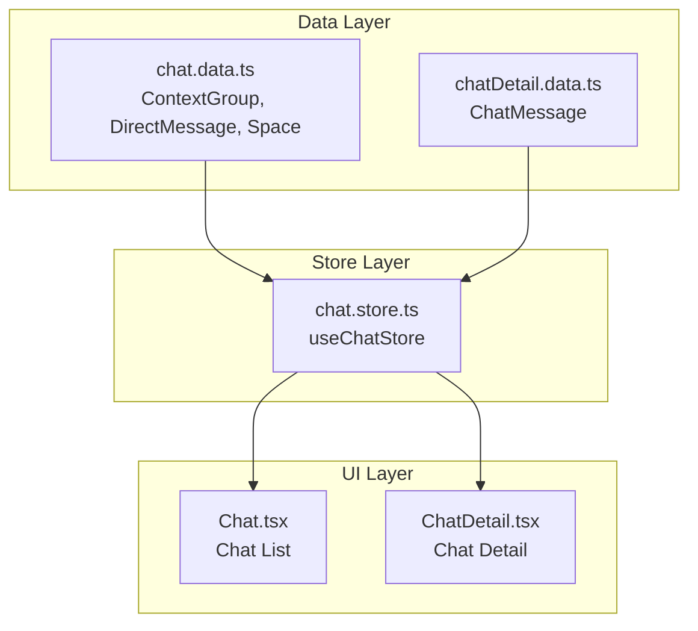
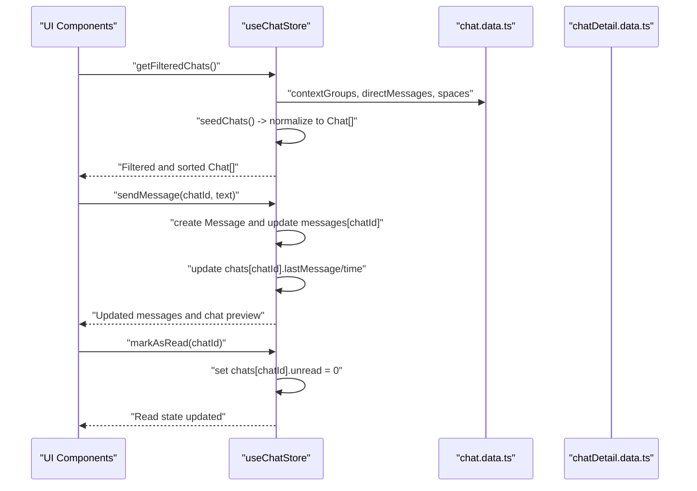
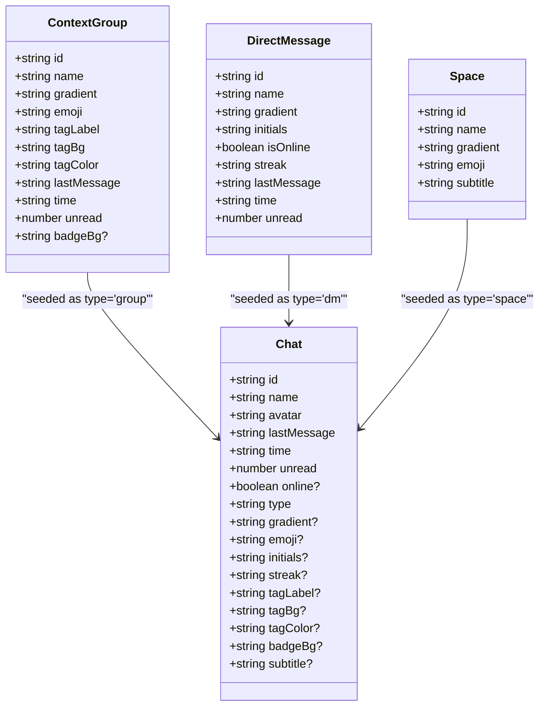
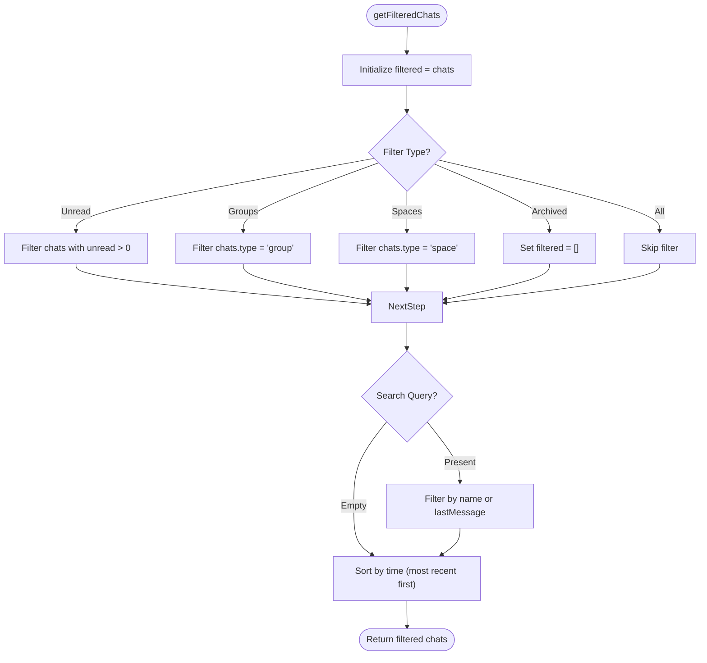
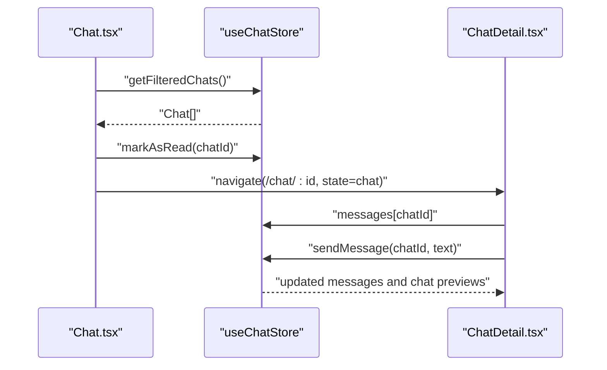
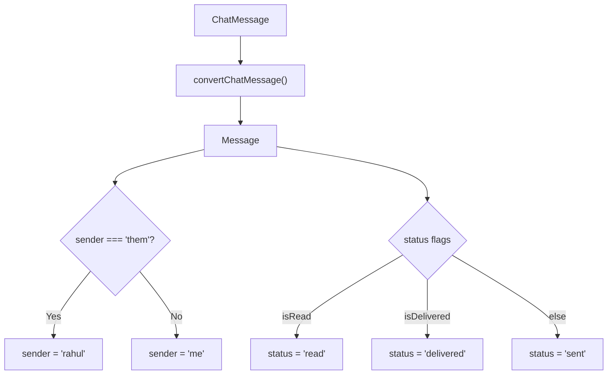
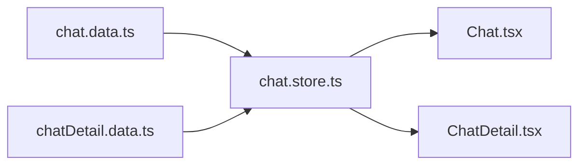

# Chat Context Data

<cite>
**Referenced Files in This Document**
- [chat.data.ts](file://src/data/chat.data.ts)
- [chat.store.ts](file://src/store/chat.store.ts)
- [chatDetail.data.ts](file://src/data/chatDetail.data.ts)
- [Chat.tsx](file://src/pages/Chat.tsx)
- [ChatDetail.tsx](file://src/pages/ChatDetail.tsx)
</cite>

## Table of Contents
1. [Introduction](#introduction)
2. [Project Structure](#project-structure)
3. [Core Components](#core-components)
4. [Architecture Overview](#architecture-overview)
5. [Detailed Component Analysis](#detailed-component-analysis)
6. [Dependency Analysis](#dependency-analysis)
7. [Performance Considerations](#performance-considerations)
8. [Troubleshooting Guide](#troubleshooting-guide)
9. [Conclusion](#conclusion)

## Introduction
This document provides comprehensive documentation for the chat context data module, focusing on the data structures and patterns used to represent chat groups, direct messages, and voice spaces. It explains the ContextGroup, DirectMessage, and Space interfaces, details how components consume this data, and describes the integration with the chat store for filtering, searching, and managing chat conversations. The document also covers data validation, type safety, error handling strategies, and guidelines for extending the data model.

## Project Structure
The chat context data module resides under the data directory and is consumed by the chat store and UI components. The primary files involved are:
- Data definitions: [chat.data.ts](file://src/data/chat.data.ts)
- Message definitions: [chatDetail.data.ts](file://src/data/chatDetail.data.ts)
- Store implementation: [chat.store.ts](file://src/store/chat.store.ts)
- UI consumption: [Chat.tsx](file://src/pages/Chat.tsx), [ChatDetail.tsx](file://src/pages/ChatDetail.tsx)

**Diagram sources**
- [chat.data.ts:1-134](file://src/data/chat.data.ts#L1-L134)
- [chatDetail.data.ts:1-71](file://src/data/chatDetail.data.ts#L1-L71)
- [chat.store.ts:1-349](file://src/store/chat.store.ts#L1-L349)
- [Chat.tsx:1-245](file://src/pages/Chat.tsx#L1-L245)
- [ChatDetail.tsx:1-332](file://src/pages/ChatDetail.tsx#L1-L332)

**Section sources**
- [chat.data.ts:1-134](file://src/data/chat.data.ts#L1-L134)
- [chat.store.ts:1-349](file://src/store/chat.store.ts#L1-L349)
- [Chat.tsx:1-245](file://src/pages/Chat.tsx#L1-L245)
- [ChatDetail.tsx:1-332](file://src/pages/ChatDetail.tsx#L1-L332)

## Core Components
This section documents the core data interfaces and their properties, along with the data organization patterns used for chat groups, direct messaging contexts, and voice space configurations.

### ContextGroup Interface
The ContextGroup interface defines the structure for chat groups, including metadata for display and state tracking.

- Properties:
  - id: string — Unique identifier for the group
  - name: string — Display name of the group
  - gradient: string — Background gradient for visual representation
  - emoji: string — Emoji icon associated with the group
  - tagLabel: string — Label for categorization (e.g., Family, Work)
  - tagBg: string — Background color for the tag
  - tagColor: string — Text color for the tag
  - lastMessage: string — Preview of the last message in the group
  - time: string — Timestamp or relative time of the last message
  - unread: number — Number of unread messages
  - badgeBg?: string — Optional background color for the unread badge

Data organization pattern:
- ContextGroup instances are organized as an array for quick iteration and rendering in the chat list.
- The interface supports optional badge background customization for visual emphasis.

**Section sources**
- [chat.data.ts:1-13](file://src/data/chat.data.ts#L1-L13)
- [chat.data.ts:35-87](file://src/data/chat.data.ts#L35-L87)

### DirectMessage Interface
The DirectMessage interface represents a one-on-one chat context with presence and streak information.

- Properties:
  - id: string — Unique identifier for the DM
  - name: string — Display name of the contact
  - gradient: string — Background gradient for avatar
  - initials: string — Initials used for avatar when no image is available
  - isOnline: boolean — Indicates whether the contact is currently online
  - streak: string — Streak information (e.g., day count)
  - lastMessage: string — Preview of the last message
  - time: string — Timestamp or relative time of the last message
  - unread: number — Number of unread messages

Data organization pattern:
- DirectMessage instances are stored as an array and rendered with online indicators and streak badges.
- The interface includes optional presence and streak metadata for enhanced UX.

**Section sources**
- [chat.data.ts:15-25](file://src/data/chat.data.ts#L15-L25)
- [chat.data.ts:89-123](file://src/data/chat.data.ts#L89-L123)

### Space Interface
The Space interface defines the structure for voice spaces, including subtitle information indicating activity.

- Properties:
  - id: string — Unique identifier for the space
  - name: string — Display name of the space
  - gradient: string — Background gradient for visual representation
  - emoji: string — Emoji icon associated with the space
  - subtitle: string — Activity indicator (e.g., participant count and voice status)

Data organization pattern:
- Space instances are stored as an array and rendered with activity indicators.
- The subtitle field is used to display contextual information in the chat list.

**Section sources**
- [chat.data.ts:27-33](file://src/data/chat.data.ts#L27-L33)
- [chat.data.ts:125-133](file://src/data/chat.data.ts#L125-L133)

### Data Organization Patterns
- Arrays of ContextGroup, DirectMessage, and Space are exported for direct consumption by the store.
- The store seeds Chat entities from these arrays, mapping fields to a unified Chat interface for UI rendering.
- The store maintains separate message collections keyed by chatId for efficient retrieval and updates.

**Section sources**
- [chat.data.ts:35-133](file://src/data/chat.data.ts#L35-L133)
- [chat.store.ts:103-159](file://src/store/chat.store.ts#L103-L159)

## Architecture Overview
The chat context data module integrates with the chat store to provide a unified view of chats, messages, and filters. The store converts raw data into normalized Chat entities and manages message collections.

**Diagram sources**
- [chat.store.ts:103-159](file://src/store/chat.store.ts#L103-L159)
- [chat.store.ts:171-330](file://src/store/chat.store.ts#L171-L330)
- [chat.data.ts:35-133](file://src/data/chat.data.ts#L35-L133)
- [chatDetail.data.ts:19-70](file://src/data/chatDetail.data.ts#L19-L70)

## Detailed Component Analysis

### Chat Store Integration
The chat store consumes the data module to seed chats and manage messages. It defines a unified Chat interface that accommodates group, DM, and space contexts.

Key aspects:
- Chat seeding: The store maps ContextGroup, DirectMessage, and Space arrays into a normalized Chat[] with consistent fields (id, name, avatar, lastMessage, time, unread, type).
- Message conversion: ChatMessage instances are converted to Message using a helper that maps sender roles and status fields.
- Filtering and sorting: The store provides filtering by type (All, Unread, Groups, Spaces, Archived) and search by name or lastMessage, with time-based sorting.

**Diagram sources**
- [chat.data.ts:1-33](file://src/data/chat.data.ts#L1-L33)
- [chat.store.ts:24-43](file://src/store/chat.store.ts#L24-L43)

**Section sources**
- [chat.store.ts:103-159](file://src/store/chat.store.ts#L103-L159)
- [chat.store.ts:161-169](file://src/store/chat.store.ts#L161-L169)
- [chat.store.ts:61-75](file://src/store/chat.store.ts#L61-L75)

### Chat List Filtering and Sorting
The store implements filtering and sorting for the chat list:
- Filters: Unread, Groups, Spaces, Archived (empty for now), All
- Search: Case-insensitive match on name or lastMessage
- Sorting: Time-based sorting with special handling for relative time strings (e.g., Yesterday, Mon)

**Diagram sources**
- [chat.store.ts:218-266](file://src/store/chat.store.ts#L218-L266)
- [chat.store.ts:333-348](file://src/store/chat.store.ts#L333-L348)

**Section sources**
- [chat.store.ts:218-266](file://src/store/chat.store.ts#L218-L266)
- [chat.store.ts:333-348](file://src/store/chat.store.ts#L333-L348)

### UI Consumption Patterns
Components consume the store to render chat lists and details:
- Chat list ([Chat.tsx](file://src/pages/Chat.tsx)): Renders filtered chats, handles click-to-navigate, and marks chats as read on selection.
- Chat detail ([ChatDetail.tsx](file://src/pages/ChatDetail.tsx)): Displays messages, handles sending text messages, simulates replies, and shows translation/transcription overlays.

**Diagram sources**
- [Chat.tsx:69-79](file://src/pages/Chat.tsx#L69-L79)
- [Chat.tsx:81-84](file://src/pages/Chat.tsx#L81-L84)
- [ChatDetail.tsx:24-46](file://src/pages/ChatDetail.tsx#L24-L46)
- [chat.store.ts:179-200](file://src/store/chat.store.ts#L179-L200)

**Section sources**
- [Chat.tsx:69-84](file://src/pages/Chat.tsx#L69-L84)
- [ChatDetail.tsx:24-46](file://src/pages/ChatDetail.tsx#L24-L46)
- [chat.store.ts:179-200](file://src/store/chat.store.ts#L179-L200)

### Message Types and Status Handling
Message types and status are defined in the message data module and mapped to the store’s Message interface:
- Message types: text, voice
- Sender roles: me, them
- Status mapping: read/delivered/sent based on isRead/isDelivered flags

**Diagram sources**
- [chatDetail.data.ts:4-16](file://src/data/chatDetail.data.ts#L4-L16)
- [chat.store.ts:61-75](file://src/store/chat.store.ts#L61-L75)

**Section sources**
- [chatDetail.data.ts:4-16](file://src/data/chatDetail.data.ts#L4-L16)
- [chat.store.ts:61-75](file://src/store/chat.store.ts#L61-L75)

## Dependency Analysis
The data module is consumed by the store, which centralizes chat state and exposes actions for filtering, searching, and message management. UI components depend on the store for rendering and interaction.

**Diagram sources**
- [chat.data.ts:1-134](file://src/data/chat.data.ts#L1-L134)
- [chatDetail.data.ts:1-71](file://src/data/chatDetail.data.ts#L1-L71)
- [chat.store.ts:1-349](file://src/store/chat.store.ts#L1-L349)
- [Chat.tsx:1-245](file://src/pages/Chat.tsx#L1-L245)
- [ChatDetail.tsx:1-332](file://src/pages/ChatDetail.tsx#L1-L332)

**Section sources**
- [chat.store.ts:1-5](file://src/store/chat.store.ts#L1-L5)
- [chat.store.ts:171-330](file://src/store/chat.store.ts#L171-L330)

## Performance Considerations
- Filtering and sorting complexity: The store performs linear filtering and sorting on the chats array. For large datasets, consider indexing or memoization to optimize repeated filtering operations.
- Rendering efficiency: The chat list uses virtualization or efficient list rendering to minimize DOM updates during frequent state changes.
- Message storage: Messages are stored per chatId in a record-like structure, enabling O(1) access and updates for individual chats.

[No sources needed since this section provides general guidance]

## Troubleshooting Guide
Common issues and resolutions:
- Missing fields in Chat entities: Ensure that seeded chats include all required fields (id, name, avatar, lastMessage, time, unread, type). Verify that optional fields (gradient, emoji, initials, streak, tagLabel, tagBg, tagColor, badgeBg, subtitle) are handled gracefully in UI components.
- Incorrect time sorting: The store sorts by time strings with special handling for relative dates. Validate that time strings conform to expected formats to prevent unexpected ordering.
- Message status inconsistencies: Confirm that status mapping aligns with isRead/isDelivered flags. If discrepancies occur, re-check the conversion logic in the store.
- Online presence not updating: Verify that isOnline flags are correctly reflected in the UI and that presence changes propagate through the store state.

**Section sources**
- [chat.store.ts:103-159](file://src/store/chat.store.ts#L103-L159)
- [chat.store.ts:333-348](file://src/store/chat.store.ts#L333-L348)
- [chat.store.ts:61-75](file://src/store/chat.store.ts#L61-L75)

## Conclusion
The chat context data module provides a structured foundation for representing chat groups, direct messages, and voice spaces. Through the chat store, these data structures are normalized, filtered, searched, and rendered efficiently in the UI. The design emphasizes type safety, clear separation of concerns, and extensibility for future enhancements such as additional message types and context attributes.