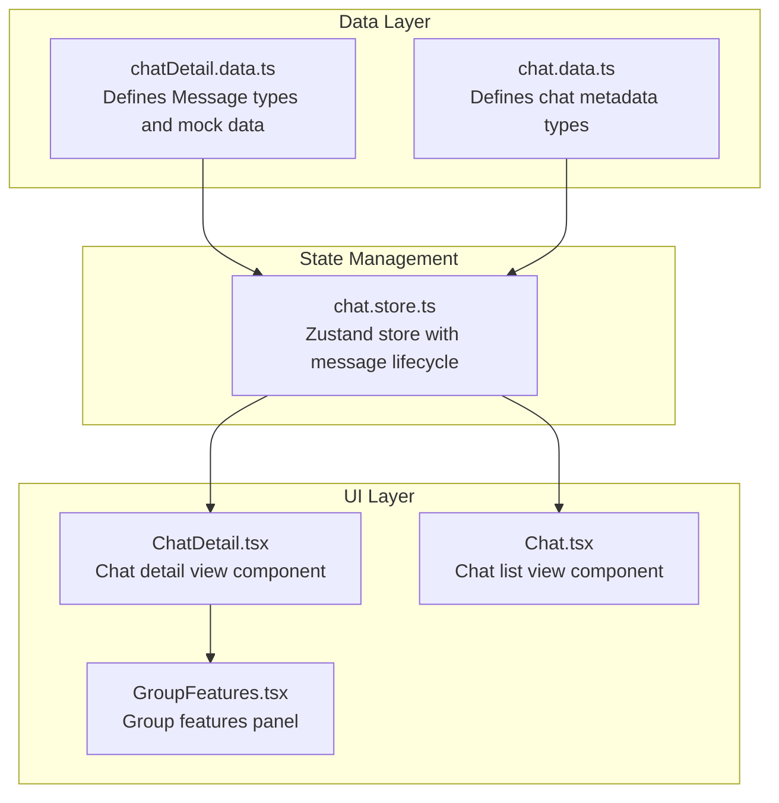
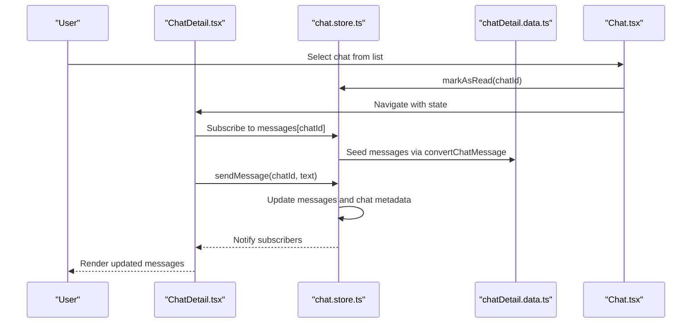
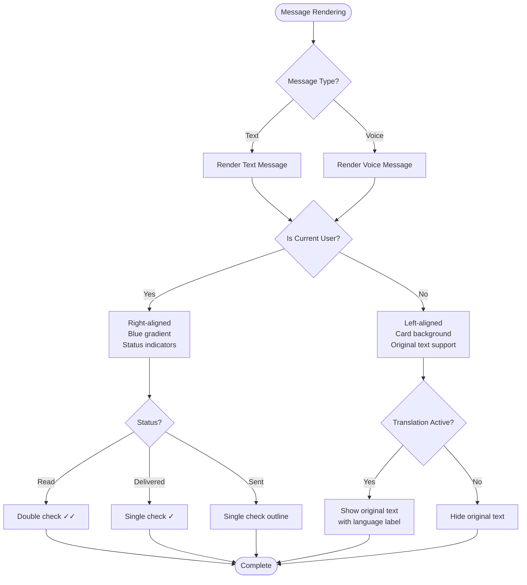
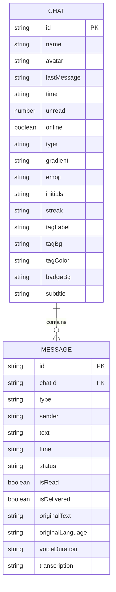
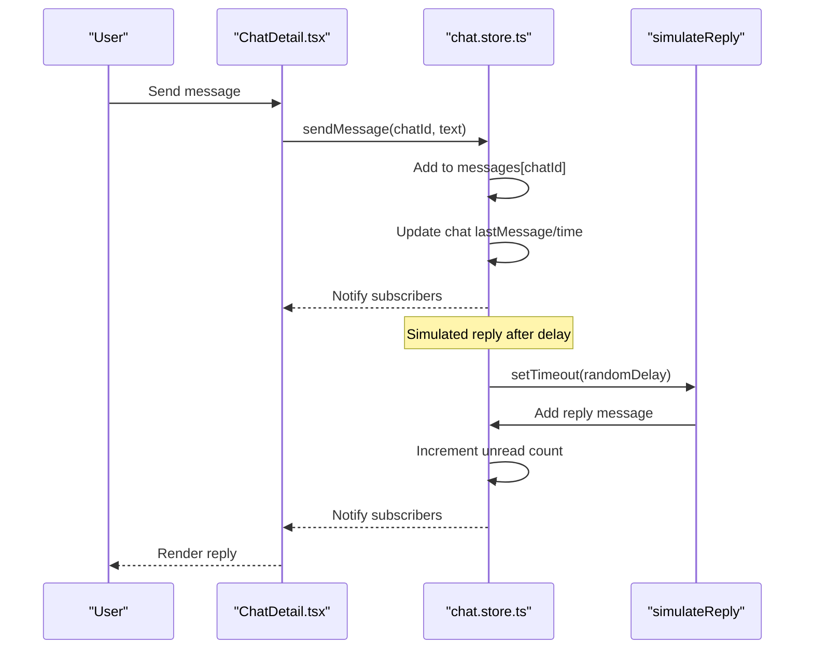
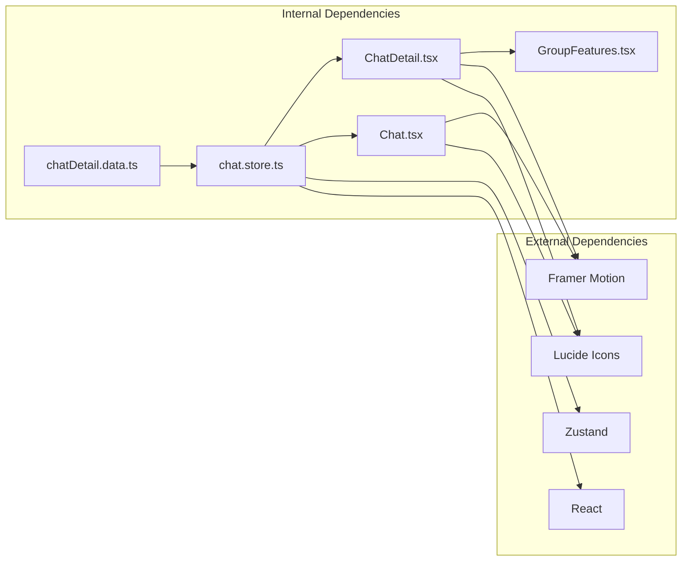

# Chat Detail Data

<cite>
**Referenced Files in This Document**
- [chatDetail.data.ts](file://src/data/chatDetail.data.ts)
- [chat.store.ts](file://src/store/chat.store.ts)
- [ChatDetail.tsx](file://src/pages/ChatDetail.tsx)
- [chat.data.ts](file://src/data/chat.data.ts)
- [Chat.tsx](file://src/pages/Chat.tsx)
- [GroupFeatures.tsx](file://src/components/GroupFeatures.tsx)
</cite>

## Table of Contents
1. [Introduction](#introduction)
2. [Project Structure](#project-structure)
3. [Core Components](#core-components)
4. [Architecture Overview](#architecture-overview)
5. [Detailed Component Analysis](#detailed-component-analysis)
6. [Dependency Analysis](#dependency-analysis)
7. [Performance Considerations](#performance-considerations)
8. [Troubleshooting Guide](#troubleshooting-guide)
9. [Conclusion](#conclusion)

## Introduction
This document provides comprehensive documentation for the chat detail data module, focusing on the data structures and patterns used for individual chat conversations. The module encompasses message threading, participant information, conversation metadata, and integration with chat detail components. It explains how the data supports chat detail views and conversation management features, including examples of data consumption patterns, message threading techniques, real-time conversation updates, validation requirements, message status tracking, and performance considerations for large conversation histories.

## Project Structure
The chat detail data module is organized around three primary areas:
- Data definitions and mock data for chat messages
- Store management for chat state and message lifecycle
- UI components that render chat detail views and consume the data



**Diagram sources**
- [chatDetail.data.ts:1-71](file://src/data/chatDetail.data.ts#L1-L71)
- [chat.store.ts:1-349](file://src/store/chat.store.ts#L1-L349)
- [ChatDetail.tsx:1-332](file://src/pages/ChatDetail.tsx#L1-L332)
- [chat.data.ts:1-134](file://src/data/chat.data.ts#L1-L134)
- [Chat.tsx:1-245](file://src/pages/Chat.tsx#L1-L245)
- [GroupFeatures.tsx:1-154](file://src/components/GroupFeatures.tsx#L1-L154)

**Section sources**
- [chatDetail.data.ts:1-71](file://src/data/chatDetail.data.ts#L1-L71)
- [chat.store.ts:1-349](file://src/store/chat.store.ts#L1-L349)
- [ChatDetail.tsx:1-332](file://src/pages/ChatDetail.tsx#L1-L332)
- [chat.data.ts:1-134](file://src/data/chat.data.ts#L1-L134)
- [Chat.tsx:1-245](file://src/pages/Chat.tsx#L1-L245)
- [GroupFeatures.tsx:1-154](file://src/components/GroupFeatures.tsx#L1-L154)

## Core Components
The chat detail data module centers on two key data structures:

- **MessageType**: Defines supported message types ('text' and 'voice')
- **Sender**: Defines participant roles ('me' and 'them')
- **ChatMessage**: The core message structure containing:
  - Unique identifier (id)
  - Message type (type)
  - Participant role (sender)
  - Text content (text)
  - Timestamp (time)
  - Delivery/read status flags (isDelivered, isRead)
  - Translation support fields (originalText, originalLanguage)
  - Voice message fields (voiceDuration, transcription)

The module also includes mock conversation data for demonstration purposes, showcasing realistic message threading patterns and internationalization features.

**Section sources**
- [chatDetail.data.ts:1-16](file://src/data/chatDetail.data.ts#L1-L16)
- [chatDetail.data.ts:19-70](file://src/data/chatDetail.data.ts#L19-L70)

## Architecture Overview
The chat detail architecture follows a unidirectional data flow pattern:



**Diagram sources**
- [ChatDetail.tsx:24-46](file://src/pages/ChatDetail.tsx#L24-L46)
- [chat.store.ts:171-330](file://src/store/chat.store.ts#L171-L330)
- [chatDetail.data.ts:62-75](file://src/data/chatDetail.data.ts#L62-L75)
- [Chat.tsx:81-84](file://src/pages/Chat.tsx#L81-L84)

The architecture ensures:
- Centralized state management through Zustand store
- Type-safe message handling with explicit status tracking
- Real-time updates through reactive subscriptions
- Seamless integration between chat list and detail views

**Section sources**
- [chat.store.ts:1-349](file://src/store/chat.store.ts#L1-L349)
- [ChatDetail.tsx:1-332](file://src/pages/ChatDetail.tsx#L1-L332)
- [Chat.tsx:1-245](file://src/pages/Chat.tsx#L1-L245)

## Detailed Component Analysis

### Message Data Model
The message data model supports multiple message formats and internationalization features:

```mermaid
classDiagram
class ChatMessage {
+string id
+MessageType type
+Sender sender
+string text
+string time
+boolean isRead
+boolean isDelivered
+string originalText
+string originalLanguage
+string voiceDuration
+string transcription
}
class Message {
+string id
+MessageType type
+Sender sender
+string text
+string time
+MessageStatus status
+boolean isRead
+boolean isDelivered
+string originalText
+string originalLanguage
+string voiceDuration
+string transcription
}
class MessageType {
<<enumeration>>
"text"
"voice"
}
class Sender {
<<enumeration>>
"me"
"them"
}
class MessageStatus {
<<enumeration>>
"sent"
"delivered"
"read"
}
ChatMessage --> MessageType : "uses"
ChatMessage --> Sender : "uses"
Message --> MessageType : "uses"
Message --> Sender : "uses"
Message --> MessageStatus : "tracks"
```

**Diagram sources**
- [chatDetail.data.ts:1-16](file://src/data/chatDetail.data.ts#L1-L16)
- [chat.store.ts:6-22](file://src/store/chat.store.ts#L6-L22)

Key features of the message model:
- **Message Types**: Supports text and voice messages with distinct rendering logic
- **Status Tracking**: Comprehensive delivery/read status with visual indicators
- **Translation Support**: Built-in fields for original text and language detection
- **Voice Processing**: Duration and transcription fields for audio messages

**Section sources**
- [chatDetail.data.ts:1-16](file://src/data/chatDetail.data.ts#L1-L16)
- [chat.store.ts:6-22](file://src/store/chat.store.ts#L6-L22)

### Message Threading and Organization
The chat detail component implements sophisticated message threading patterns:



**Diagram sources**
- [ChatDetail.tsx:156-261](file://src/pages/ChatDetail.tsx#L156-L261)

The threading implementation includes:
- **Visual Differentiation**: Right/left alignment based on sender identity
- **Status Indicators**: Progressive delivery/read markers
- **Translation Layer**: Optional overlay showing original content
- **Auto-scrolling**: Smooth scrolling to latest messages

**Section sources**
- [ChatDetail.tsx:156-261](file://src/pages/ChatDetail.tsx#L156-L261)

### Conversation Metadata and Participant Information
The system manages conversation metadata through integrated chat data structures:



**Diagram sources**
- [chat.store.ts:24-43](file://src/store/chat.store.ts#L24-L43)
- [chat.store.ts:9-22](file://src/store/chat.store.ts#L9-L22)

Metadata fields support:
- **Participant Identity**: Gradients, initials, and online status
- **Conversation Context**: Tags, badges, and group-specific features
- **Real-time Updates**: Last message timestamps and unread counts

**Section sources**
- [chat.store.ts:24-43](file://src/store/chat.store.ts#L24-L43)
- [chat.data.ts:1-134](file://src/data/chat.data.ts#L1-L134)

### Real-time Conversation Updates
The store implements sophisticated real-time update mechanisms:



**Diagram sources**
- [chat.store.ts:179-200](file://src/store/chat.store.ts#L179-L200)
- [chat.store.ts:288-318](file://src/store/chat.store.ts#L288-L318)
- [ChatDetail.tsx:302-308](file://src/pages/ChatDetail.tsx#L302-L308)

Real-time features include:
- **Immediate Local Updates**: Messages appear instantly in UI
- **Simulated Responses**: Randomized reply timing for realistic feel
- **Unread Count Management**: Automatic increment for incoming messages
- **Status Progression**: Automatic status transitions (sent → delivered → read)

**Section sources**
- [chat.store.ts:179-318](file://src/store/chat.store.ts#L179-L318)
- [ChatDetail.tsx:302-308](file://src/pages/ChatDetail.tsx#L302-L308)

## Dependency Analysis
The chat detail data module exhibits clean separation of concerns with minimal coupling:



**Diagram sources**
- [chat.store.ts:1-2](file://src/store/chat.store.ts#L1-L2)
- [ChatDetail.tsx:1-6](file://src/pages/ChatDetail.tsx#L1-L6)
- [Chat.tsx:1-5](file://src/pages/Chat.tsx#L1-L5)

Key dependency characteristics:
- **Minimal External Coupling**: Only essential UI libraries
- **Internal Cohesion**: Clear boundaries between data, state, and presentation layers
- **Type Safety**: Consistent TypeScript interfaces across all modules

**Section sources**
- [chat.store.ts:1-2](file://src/store/chat.store.ts#L1-L2)
- [ChatDetail.tsx:1-6](file://src/pages/ChatDetail.tsx#L1-L6)
- [Chat.tsx:1-5](file://src/pages/Chat.tsx#L1-L5)

## Performance Considerations
The chat detail data module implements several performance optimizations:

### Memory Management
- **Message History Limitation**: Consider implementing pagination for large conversation histories
- **Selective Rendering**: React's virtual DOM handles efficient re-rendering of message lists
- **State Persistence**: Local storage persistence reduces initialization overhead

### Rendering Optimizations
- **Message Animation**: Framer Motion animations are optimized with staggered delays
- **Conditional Rendering**: Translation overlays only render when active
- **Auto-scroll Management**: Efficient scroll-to-bottom implementation prevents layout thrashing

### Data Structure Efficiency
- **Object Lookup**: Messages stored in hash maps for O(1) access by chatId
- **Immutable Updates**: Zustand's functional updates minimize unnecessary re-renders
- **Type Narrowing**: Strict TypeScript definitions prevent runtime errors

### Scalability Recommendations
- **Virtualized Lists**: Implement virtual scrolling for conversations with thousands of messages
- **Message Batching**: Group frequent updates to reduce render cycles
- **Lazy Loading**: Load older messages on-demand rather than all at once

## Troubleshooting Guide

### Common Data Validation Issues
- **Missing Required Fields**: Ensure all messages have id, type, sender, and time fields
- **Invalid Message Types**: Validate against MessageType enumeration
- **Status Inconsistencies**: Verify status progression follows logical order

### Message Status Tracking Problems
- **Read Receipts**: Check that isRead flag corresponds to status field
- **Delivery Indicators**: Verify isDelivered flag aligns with visual status markers
- **Timestamp Accuracy**: Ensure time strings are properly formatted for sorting

### Translation Feature Issues
- **Original Text Display**: Verify originalText and originalLanguage fields are populated
- **Language Detection**: Confirm originalLanguage accurately reflects source content
- **Translation Toggle**: Check isTranslating state synchronization

### Performance Troubleshooting
- **Large Conversation Handling**: Monitor memory usage with extensive message histories
- **Animation Performance**: Adjust stagger delays for smoother animations on lower-end devices
- **Store Persistence**: Verify localStorage availability and size limits

**Section sources**
- [chatDetail.data.ts:1-16](file://src/data/chatDetail.data.ts#L1-L16)
- [chat.store.ts:62-75](file://src/store/chat.store.ts#L62-L75)
- [ChatDetail.tsx:116-133](file://src/pages/ChatDetail.tsx#L116-L133)

## Conclusion
The chat detail data module provides a robust foundation for managing individual chat conversations with comprehensive support for multiple message types, internationalization, and real-time updates. The modular architecture ensures maintainability while the type-safe design prevents common runtime errors. The implementation demonstrates best practices in state management, data modeling, and user interface responsiveness.

Key strengths of the implementation include:
- Clean separation between data, state, and presentation layers
- Comprehensive message status tracking and visual indicators
- Flexible message types supporting text and voice communication
- Realistic simulation of conversation dynamics
- Extensible architecture for future enhancements

The module serves as an excellent example of modern React development practices, combining functional programming principles with reactive state management to deliver a smooth user experience.