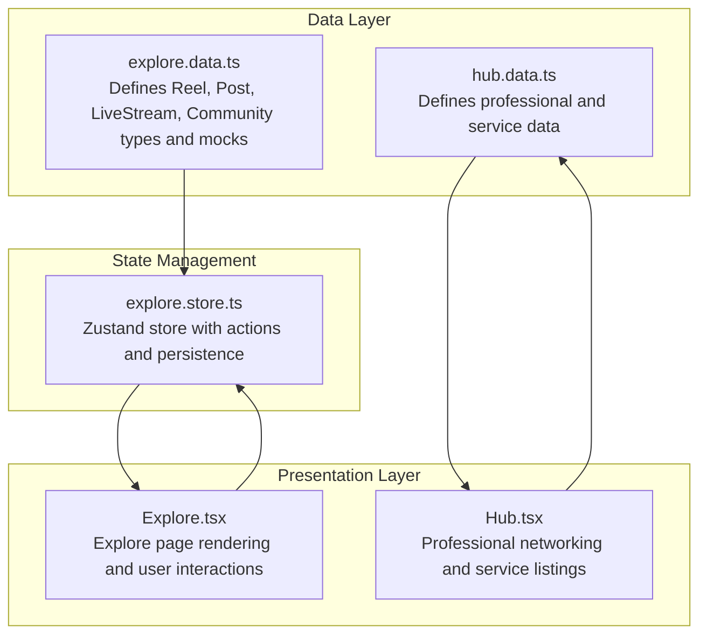
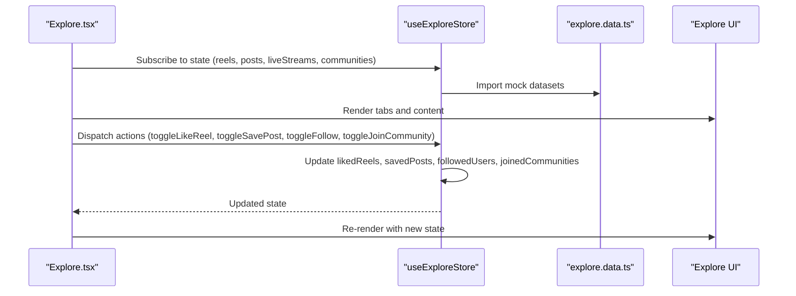
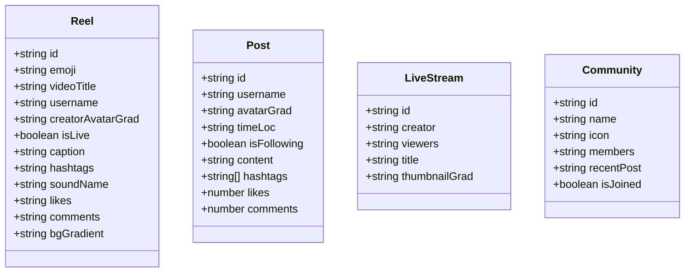
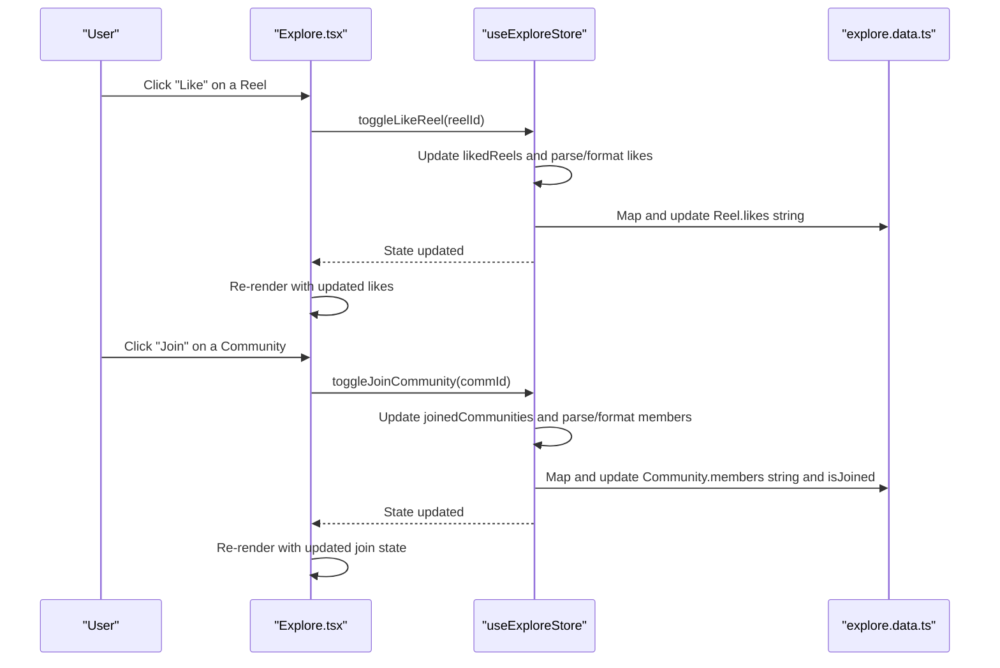
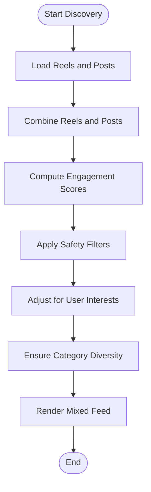
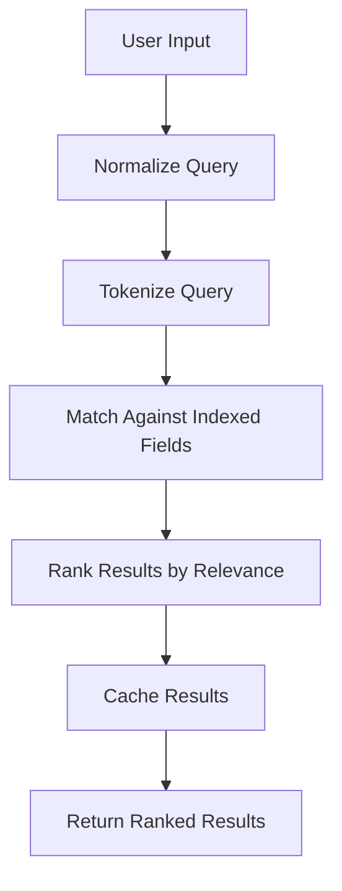
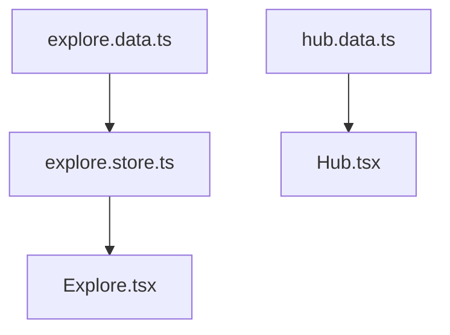

# Explore Content Data

<cite>
**Referenced Files in This Document**
- [explore.data.ts](file://src/data/explore.data.ts)
- [Explore.tsx](file://src/pages/Explore.tsx)
- [explore.store.ts](file://src/store/explore.store.ts)
- [hub.data.ts](file://src/data/hub.data.ts)
- [Hub.tsx](file://src/pages/Hub.tsx)
</cite>

## Table of Contents
1. [Introduction](#introduction)
2. [Project Structure](#project-structure)
3. [Core Components](#core-components)
4. [Architecture Overview](#architecture-overview)
5. [Detailed Component Analysis](#detailed-component-analysis)
6. [Dependency Analysis](#dependency-analysis)
7. [Performance Considerations](#performance-considerations)
8. [Troubleshooting Guide](#troubleshooting-guide)
9. [Conclusion](#conclusion)
10. [Appendices](#appendices)

## Introduction
This document provides comprehensive documentation for the Explore content data module, focusing on the data structures and mechanisms that power discovery features such as trending content, community groups, professional networks, and service listings. It explains categorization patterns, search indexing structures, and recommendation algorithms integration. The document also covers how this data supports the Explore component and related discovery features, including examples of data consumption patterns, filtering techniques, and integration with search functionality. Additionally, it addresses data validation requirements, content moderation considerations, and performance optimization strategies, along with guidelines for extending content categories and maintaining content diversity across the explore interface.

## Project Structure
The Explore content data module resides under the data layer and is consumed by the Explore page and managed by a Zustand store. The module defines typed data structures for Reels, Posts, Live Streams, and Communities, and provides mock datasets for demonstration. The Explore page renders these datasets across multiple tabs and integrates with the store for user interactions such as liking, saving, following, and joining communities. The hub data module complements Explore by providing professional networking and service listing data.

**Diagram sources**
- [explore.data.ts:1-193](file://src/data/explore.data.ts#L1-L193)
- [explore.store.ts:1-164](file://src/store/explore.store.ts#L1-L164)
- [Explore.tsx:1-416](file://src/pages/Explore.tsx#L1-L416)
- [hub.data.ts:1-247](file://src/data/hub.data.ts#L1-L247)
- [Hub.tsx:166-190](file://src/pages/Hub.tsx#L166-L190)

**Section sources**
- [explore.data.ts:1-193](file://src/data/explore.data.ts#L1-L193)
- [explore.store.ts:1-164](file://src/store/explore.store.ts#L1-L164)
- [Explore.tsx:1-416](file://src/pages/Explore.tsx#L1-L416)
- [hub.data.ts:1-247](file://src/data/hub.data.ts#L1-L247)
- [Hub.tsx:166-190](file://src/pages/Hub.tsx#L166-L190)

## Core Components
This section outlines the primary data structures and their roles in the Explore module.

- Reel: Represents short-form video content with metadata such as creator identity, engagement metrics, and visual styling.
- Post: Represents text-based social posts with hashtags, engagement counts, and user profile attributes.
- LiveStream: Represents live broadcasting content with viewer counts and stream metadata.
- Community: Represents community groups with membership counts, recent activity, and join status.

These structures are used to render the Explore feed, community cards, and related discovery surfaces. The Explore page consumes these structures and interacts with the store to manage user preferences and engagement states.

**Section sources**
- [explore.data.ts:1-193](file://src/data/explore.data.ts#L1-L193)
- [Explore.tsx:14-27](file://src/pages/Explore.tsx#L14-L27)

## Architecture Overview
The Explore module follows a unidirectional data flow:
- Data definitions and mock datasets reside in the data layer.
- The Explore page subscribes to the Zustand store to access current state and dispatch actions.
- User interactions update the store, which persists selections and preferences.
- Rendering logic in the Explore page maps store state to UI components across tabs.

**Diagram sources**
- [Explore.tsx:14-27](file://src/pages/Explore.tsx#L14-L27)
- [explore.store.ts:70-163](file://src/store/explore.store.ts#L70-L163)
- [explore.data.ts:28-192](file://src/data/explore.data.ts#L28-L192)

## Detailed Component Analysis

### Data Structures and Categorization Patterns
The Explore module defines four primary categories:
- Reels: Short-form video content with engagement metrics and creator branding.
- Posts: Text-based social posts with hashtags and engagement counts.
- Live Streams: Real-time broadcasts with viewer counts and stream metadata.
- Communities: Group-based discovery with membership counts and recent activity.

Categorization patterns:
- Engagement-driven feeds: Reels and Posts are combined to create mixed discovery experiences.
- Community-centric discovery: Community cards surface recent posts and membership metrics.
- Live discovery: Live streams are surfaced separately for real-time engagement.

**Diagram sources**
- [explore.data.ts:1-193](file://src/data/explore.data.ts#L1-L193)

**Section sources**
- [explore.data.ts:1-193](file://src/data/explore.data.ts#L1-L193)

### Explore Page Rendering and Interaction Flow
The Explore page organizes content into tabs and renders category-specific UI:
- For You and Reels: Mixed feed combining Reels and Posts.
- Posts: Dedicated text post feed.
- Videos: Video thumbnails with metadata.
- Live: Live stream cards with viewer counts.
- Communities: Community cards with join controls and trending posts.

User interactions:
- Like toggles update both the store and the associated Reel’s likes string.
- Save toggles update saved posts.
- Follow toggles update followed users.
- Join toggles update joined communities and adjust member counts.

**Diagram sources**
- [Explore.tsx:140-250](file://src/pages/Explore.tsx#L140-L250)
- [Explore.tsx:365-408](file://src/pages/Explore.tsx#L365-L408)
- [explore.store.ts:83-145](file://src/store/explore.store.ts#L83-L145)
- [explore.data.ts:28-192](file://src/data/explore.data.ts#L28-L192)

**Section sources**
- [Explore.tsx:14-27](file://src/pages/Explore.tsx#L14-L27)
- [Explore.tsx:133-252](file://src/pages/Explore.tsx#L133-L252)
- [Explore.tsx:254-264](file://src/pages/Explore.tsx#L254-L264)
- [Explore.tsx:266-309](file://src/pages/Explore.tsx#L266-L309)
- [Explore.tsx:311-357](file://src/pages/Explore.tsx#L311-L357)
- [Explore.tsx:359-408](file://src/pages/Explore.tsx#L359-L408)
- [explore.store.ts:83-145](file://src/store/explore.store.ts#L83-L145)

### Recommendation Algorithms Integration
The Explore module currently uses a mixed feed strategy:
- For You tab combines Reels and Posts to simulate personalized discovery.
- Community cards surface recent posts to guide discovery.
- Live streams are presented separately for real-time engagement.

Recommendation enhancements:
- Scoring: Introduce engagement scores derived from likes, comments, and shares.
- Personalization: Weight content by user interests and past interactions.
- Diversity: Ensure representation across topics and creators.
- Moderation filters: Apply content safety thresholds before recommendation.

[No sources needed since this diagram shows conceptual workflow, not actual code structure]

### Search Indexing Structures
The Explore module does not implement dedicated search indexing. Current search capabilities:
- Explore page includes a search icon in the top bar.
- Professional networking and service listings leverage separate filtering utilities in the hub store.

Recommendations for search indexing:
- Index fields: title, caption, hashtags, usernames, community names, and tags.
- Tokenization: Split text into tokens and normalize casing.
- Ranking: Weight by recency, engagement, and relevance to user interests.
- Caching: Cache frequent queries and results.

[No sources needed since this diagram shows conceptual workflow, not actual code structure]

### Data Consumption Patterns
Consumption patterns observed in the Explore page:
- Tab-based navigation switches content rendering contexts.
- Conditional rendering displays Reels, Posts, Videos, Live, and Communities.
- Interaction handlers update store state and re-render UI.

Examples:
- Text post card rendering uses avatar gradients and hashtag lists.
- Community cards show recent posts and membership metrics.
- Live stream cards display viewer counts and live indicators.

**Section sources**
- [Explore.tsx:133-252](file://src/pages/Explore.tsx#L133-L252)
- [Explore.tsx:254-264](file://src/pages/Explore.tsx#L254-L264)
- [Explore.tsx:266-309](file://src/pages/Explore.tsx#L266-L309)
- [Explore.tsx:311-357](file://src/pages/Explore.tsx#L311-L357)
- [Explore.tsx:359-408](file://src/pages/Explore.tsx#L359-L408)

### Filtering Techniques for Content Discovery
Current filtering techniques:
- Tab-based filtering separates content types.
- Community join state influences visibility and grouping.
- Hashtag rendering enables topic exploration.

Enhancements:
- Keyword filters for Reels captions and Posts content.
- Creator-based filters for followed/unfollowed creators.
- Community-based filters for joined/unjoined communities.
- Live stream filters for viewer count thresholds.

**Section sources**
- [Explore.tsx:111-127](file://src/pages/Explore.tsx#L111-L127)
- [Explore.tsx:365-408](file://src/pages/Explore.tsx#L365-L408)

### Integration with Search Functionality
Integration points:
- Explore page includes a search icon in the top bar.
- Professional networking and service listings pages implement search and filtering utilities.

Recommendations:
- Centralize search logic in a shared hook or service.
- Implement debounced search to reduce computation overhead.
- Persist search queries in state for quick re-application.

**Section sources**
- [Explore.tsx:98-108](file://src/pages/Explore.tsx#L98-L108)
- [hub.data.ts:120-169](file://src/data/hub.data.ts#L120-L169)

### Data Validation Requirements
Validation requirements for Explore data:
- Type safety: Ensure all fields conform to their declared types.
- Numeric parsing: Convert likes and members strings to numbers for calculations.
- Formatting: Format numeric values back to human-readable strings.
- Presence checks: Verify required fields before rendering.

Implementation highlights:
- Parsing helpers convert "24.5K" to 24500 and vice versa.
- Member counts are parsed and formatted similarly.

**Section sources**
- [explore.store.ts:24-68](file://src/store/explore.store.ts#L24-L68)

### Content Moderation Considerations
Moderation considerations:
- Safety thresholds: Filter content below engagement or safety thresholds.
- Community standards: Enforce acceptable content policies for communities.
- Age restrictions: Apply age-appropriate content filters.
- Reporting mechanisms: Provide reporting buttons for inappropriate content.

Recommendations:
- Implement content safety scoring.
- Add user reporting and flagging.
- Integrate with external moderation APIs.

[No sources needed since this section provides general guidance]

### Performance Optimization Strategies
Optimization strategies:
- Virtualization: Use virtualized lists for long feeds.
- Memoization: Memoize expensive computations and rendered components.
- Lazy loading: Defer non-critical resources until needed.
- Debouncing: Debounce search and filter operations.
- Persistence: Persist user preferences to reduce recomputation.

**Section sources**
- [explore.store.ts:153-162](file://src/store/explore.store.ts#L153-L162)

### Guidelines for Extending Content Categories
Extending content categories:
- Define new types and mock datasets following existing patterns.
- Add new tabs and rendering logic in the Explore page.
- Update the store to manage new state slices and actions.
- Integrate with recommendation and moderation systems.

Guidelines:
- Maintain consistent field naming and data shapes.
- Add parsing and formatting helpers for new numeric fields.
- Ensure UI components handle missing or empty data gracefully.

**Section sources**
- [explore.data.ts:1-193](file://src/data/explore.data.ts#L1-L193)
- [Explore.tsx:12-12](file://src/pages/Explore.tsx#L12-L12)
- [explore.store.ts:5-22](file://src/store/explore.store.ts#L5-L22)

### Adding New Discovery Features
Adding new discovery features:
- Define feature-specific data structures and mock data.
- Implement UI components for the new feature.
- Add state management for user interactions.
- Integrate with recommendation and search systems.

Recommendations:
- Use modular components for discoverability.
- Provide clear affordances for user actions.
- Monitor engagement and iterate on feature design.

**Section sources**
- [explore.data.ts:1-193](file://src/data/explore.data.ts#L1-L193)
- [Explore.tsx:14-27](file://src/pages/Explore.tsx#L14-L27)
- [explore.store.ts:83-145](file://src/store/explore.store.ts#L83-L145)

### Maintaining Content Diversity Across Explore Interface
Maintaining diversity:
- Mix content types across tabs and feeds.
- Rotate creators and topics to prevent repetition.
- Include underrepresented categories and voices.
- Regularly audit recommendation algorithms for bias.

Recommendations:
- Implement diversity scoring alongside engagement.
- Periodically refresh content sources.
- Gather user feedback on content variety.

[No sources needed since this section provides general guidance]

## Dependency Analysis
The Explore module exhibits clear separation of concerns:
- Data definitions depend on mock datasets.
- The store depends on data definitions and exposes actions.
- The Explore page depends on the store and renders UI.

**Diagram sources**
- [explore.data.ts:1-193](file://src/data/explore.data.ts#L1-L193)
- [explore.store.ts:1-164](file://src/store/explore.store.ts#L1-L164)
- [Explore.tsx:1-416](file://src/pages/Explore.tsx#L1-L416)
- [hub.data.ts:1-247](file://src/data/hub.data.ts#L1-L247)
- [Hub.tsx:166-190](file://src/pages/Hub.tsx#L166-L190)

**Section sources**
- [explore.data.ts:1-193](file://src/data/explore.data.ts#L1-L193)
- [explore.store.ts:1-164](file://src/store/explore.store.ts#L1-L164)
- [Explore.tsx:1-416](file://src/pages/Explore.tsx#L1-L416)
- [hub.data.ts:1-247](file://src/data/hub.data.ts#L1-L247)
- [Hub.tsx:166-190](file://src/pages/Hub.tsx#L166-L190)

## Performance Considerations
- Virtualization: Implement virtualized lists for long Reels and Posts feeds to reduce DOM nodes.
- Memoization: Memoize computed values like formatted likes and members.
- Debouncing: Debounce search and filter operations to minimize re-renders.
- Persistence: Persist user interactions to avoid recomputation on reload.
- Lazy loading: Defer heavy assets until visible.

[No sources needed since this section provides general guidance]

## Troubleshooting Guide
Common issues and resolutions:
- Incorrect likes or members formatting: Verify parsing and formatting helpers.
- UI not updating after interactions: Confirm store actions are dispatched and state is updated.
- Missing mock data: Ensure mock datasets are imported and initialized in the store.
- Tab rendering anomalies: Validate tab switching logic and conditional rendering.

**Section sources**
- [explore.store.ts:24-68](file://src/store/explore.store.ts#L24-L68)
- [Explore.tsx:14-27](file://src/pages/Explore.tsx#L14-L27)

## Conclusion
The Explore content data module provides a robust foundation for discovery features through well-defined data structures, a centralized store, and a flexible Explore page. By leveraging engagement-driven feeds, community-centric discovery, and live streaming, the module supports diverse user needs. Recommendations for improvement include implementing search indexing, enhancing recommendation algorithms, and strengthening moderation and performance optimizations. The guidelines provided enable safe extension of content categories and maintenance of content diversity across the explore interface.

## Appendices
- Data types and mock datasets are defined in the Explore data module.
- The Explore page consumes store state and dispatches actions for user interactions.
- The hub data module complements Explore with professional networking and service listings.

**Section sources**
- [explore.data.ts:1-193](file://src/data/explore.data.ts#L1-L193)
- [Explore.tsx:1-416](file://src/pages/Explore.tsx#L1-L416)
- [hub.data.ts:1-247](file://src/data/hub.data.ts#L1-L247)