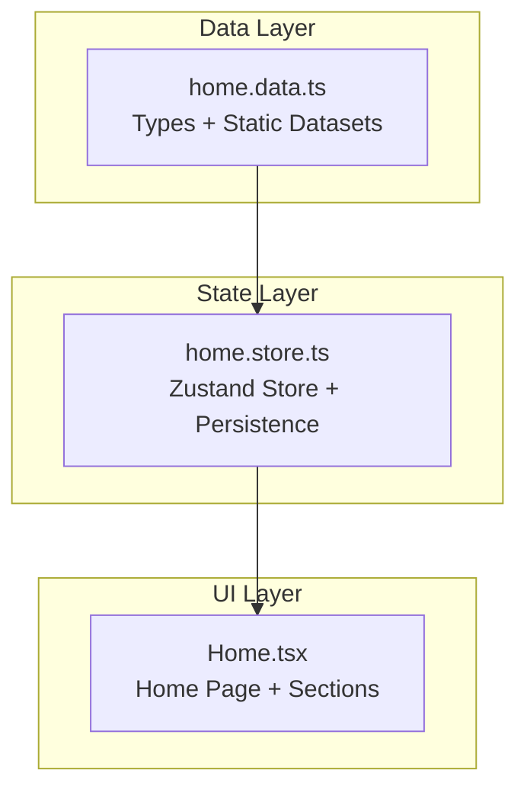
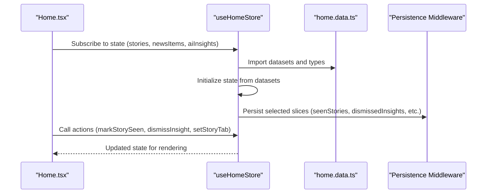
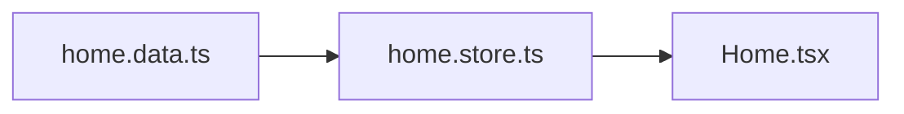
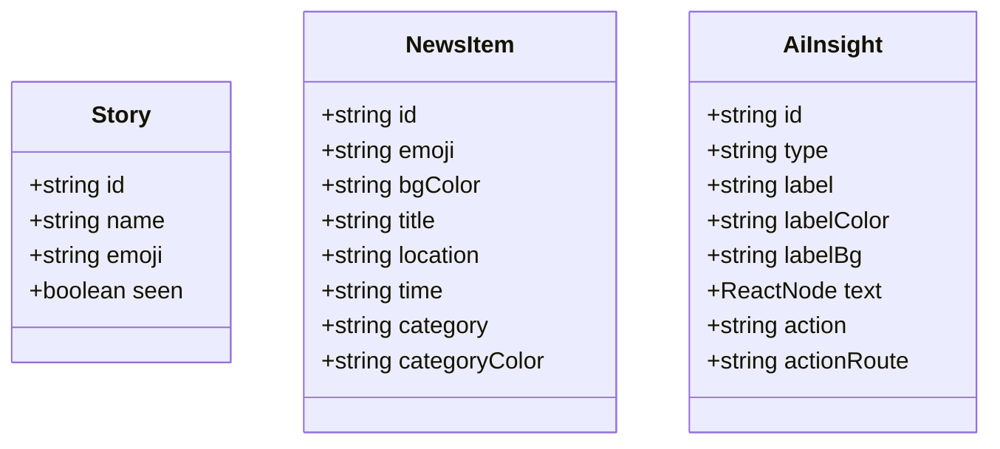
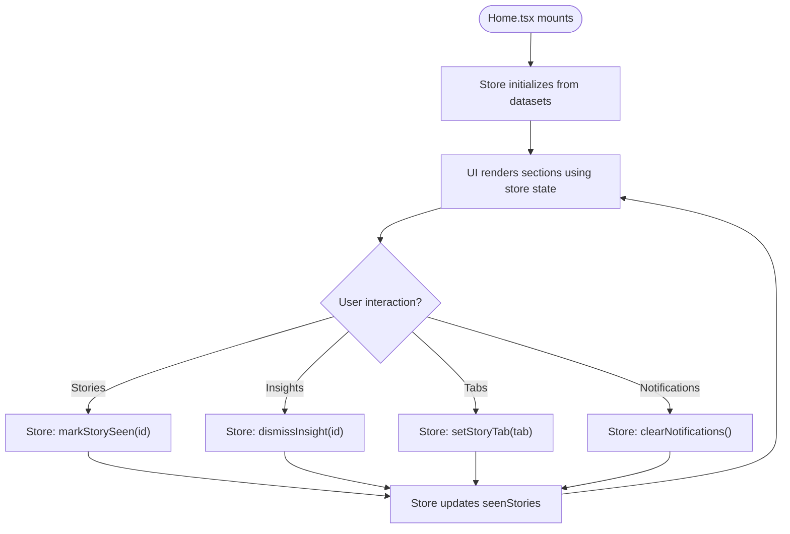

# Home Content Data

<cite>
**Referenced Files in This Document**
- [home.data.ts](file://src/data/home.data.ts)
- [home.store.ts](file://src/store/home.store.ts)
- [Home.tsx](file://src/pages/Home.tsx)
- [explore.data.ts](file://src/data/explore.data.ts)
</cite>

## Table of Contents
1. [Introduction](#introduction)
2. [Project Structure](#project-structure)
3. [Core Components](#core-components)
4. [Architecture Overview](#architecture-overview)
5. [Detailed Component Analysis](#detailed-component-analysis)
6. [Dependency Analysis](#dependency-analysis)
7. [Performance Considerations](#performance-considerations)
8. [Troubleshooting Guide](#troubleshooting-guide)
9. [Conclusion](#conclusion)
10. [Appendices](#appendices)

## Introduction
This document provides comprehensive documentation for the home content data module, focusing on how home screen content is structured, typed, and integrated into the Home component. It covers the data structures for stories, nearby news, and AI insights, along with the store-driven integration that powers the UI. It also explains content organization patterns, display logic, data consumption patterns, filtering techniques, dynamic loading strategies, validation requirements, caching strategies, and performance considerations. Finally, it outlines guidelines for extending content types and maintaining content freshness.

## Project Structure
The home content pipeline is organized around three primary layers:
- Data module: Defines strongly typed content models and static datasets.
- Store module: Manages state, exposes actions, and persists selected slices.
- UI module: Renders content sections and integrates with the store for interactivity.

**Diagram sources**
- [home.data.ts:1-104](file://src/data/home.data.ts#L1-L104)
- [home.store.ts:1-103](file://src/store/home.store.ts#L1-L103)
- [Home.tsx:1-295](file://src/pages/Home.tsx#L1-L295)

**Section sources**
- [home.data.ts:1-104](file://src/data/home.data.ts#L1-L104)
- [home.store.ts:1-103](file://src/store/home.store.ts#L1-L103)
- [Home.tsx:1-295](file://src/pages/Home.tsx#L1-L295)

## Core Components
This section documents the data structures and their roles in organizing home screen content.

- Story
  - Purpose: Represents user-generated or curated story entries in the Stories section.
  - Fields: Identifier, name, emoji, seen flag.
  - Usage: Populates the Stories carousel and tabbed navigation.

- NewsItem
  - Purpose: Represents local or contextual news items curated for proximity or interest.
  - Fields: Identifier, emoji, background color, title, location, time, category, category color.
  - Usage: Powers the Nearby News feed with category pills and contextual metadata.

- AiInsight
  - Purpose: Represents AI-curated insights that surface actionable items.
  - Fields: Identifier, type, label, label colors, text content, action label, action route.
  - Usage: Drives the AI Twin card with dismissible insights and navigation actions.

These types are exported from the data module and consumed by the store and UI.

**Section sources**
- [home.data.ts:1-104](file://src/data/home.data.ts#L1-L104)

## Architecture Overview
The home content architecture follows a unidirectional data flow:
- Data module exports static datasets and types.
- Store initializes state from the data module, exposes actions, and persists selected slices.
- UI components subscribe to the store and render content, invoking actions on user interactions.

**Diagram sources**
- [Home.tsx:1-295](file://src/pages/Home.tsx#L1-L295)
- [home.store.ts:1-103](file://src/store/home.store.ts#L1-L103)
- [home.data.ts:1-104](file://src/data/home.data.ts#L1-L104)

## Detailed Component Analysis

### Data Module: home.data.ts
- Types
  - Story: Strongly typed story model with identifier, name, emoji, and seen flag.
  - NewsItem: Strongly typed news item with identifier, emoji, background color, title, location, time, category, and category color.
  - AiInsight: Strongly typed AI insight with identifier, type, label, label colors, text, action label, and action route.
- Datasets
  - storiesData: Array of Story instances representing the Stories section.
  - newsItemsData: Array of NewsItem instances representing the Nearby News feed.
  - aiInsightsData: Array of AiInsight instances powering the AI Twin card.

Validation and constraints:
- All identifiers are strings and must be unique within each dataset.
- Category color values are constrained to predefined color codes mapped to style variants in the UI.
- Action routes should be valid paths navigable by the router.

Integration patterns:
- The store imports datasets and types directly, enabling type-safe initialization and updates.
- The UI consumes store-derived arrays for rendering lists and cards.

**Section sources**
- [home.data.ts:1-104](file://src/data/home.data.ts#L1-L104)

### Store Module: home.store.ts
Responsibilities:
- Initialize state from home.data.ts datasets.
- Expose actions for:
  - Marking stories as seen (updates seenStories).
  - Dismissing insights (adds to dismissedInsights).
  - Managing story tab selection.
  - Clearing notifications.
  - Computing greeting text based on time-of-day.
  - Filtering visible insights (excludes dismissed ones).
- Persist selected slices to storage to maintain continuity across sessions.

State shape:
- stories, newsItems, aiInsights: Arrays derived from datasets.
- seenStories: Array of seen story identifiers.
- dismissedInsights: Array of dismissed insight identifiers.
- unreadNotifications: Number of unread notifications.
- storyTab: Active tab in the Stories section.

Persistence:
- Uses Zustand middleware to persist selected slices, reducing storage footprint and improving load performance.

Display logic integration:
- The UI reads store state and invokes actions on user interactions, ensuring reactive updates without manual synchronization.

**Section sources**
- [home.store.ts:1-103](file://src/store/home.store.ts#L1-L103)

### UI Module: Home.tsx
Sections and interactions:
- TopBar
  - Displays greeting computed by the store.
  - Navigates to notifications and profile on interaction.
  - Shows unread notification indicator.
- AI Twin Card
  - Renders visible insights computed by the store.
  - Allows dismissing insights and navigating to action routes.
- Stories Section
  - Renders tabs and story items.
  - Marks stories as seen and navigates to story detail.
- News Feed Section
  - Renders news items with category pills and contextual metadata.
  - Applies color mapping based on category color codes.

Rendering logic:
- Uses motion animations for staggered entry.
- Applies conditional styling based on seen/dismissed states and category colors.
- Integrates with the store for state-driven rendering and actions.

**Section sources**
- [Home.tsx:1-295](file://src/pages/Home.tsx#L1-L295)

### Data Consumption Patterns
- Direct consumption: The UI subscribes to store state and renders arrays of content items.
- Filtering: Visible insights are filtered by excluding dismissed identifiers.
- Conditional rendering: Seen stories receive distinct styling; category colors are mapped to themed pills.
- Navigation: Action routes from AI insights and news items drive navigation.

Content filtering techniques:
- Dismissed insights filtering: Ensures non-repetitive presentation of insights.
- Seen stories tracking: Prevents repeated emphasis on previously viewed stories.

Dynamic content loading strategies:
- Current implementation uses static datasets initialized at startup.
- Recommended enhancements:
  - Introduce async initialization with loading states.
  - Implement pagination or infinite scroll for long lists.
  - Add refresh triggers and background updates.

**Section sources**
- [home.store.ts:85-90](file://src/store/home.store.ts#L85-L90)
- [Home.tsx:100-122](file://src/pages/Home.tsx#L100-L122)
- [Home.tsx:172-200](file://src/pages/Home.tsx#L172-L200)
- [Home.tsx:233-271](file://src/pages/Home.tsx#L233-L271)

### Extending Content Types and Categories
Guidelines for adding new content categories:
- Define a new type in the data module with required fields and constraints.
- Add a new dataset array of the new type.
- Extend the store to initialize and manage state for the new type.
- Update the UI to render the new section and integrate actions.
- Ensure category color mapping or styling remains consistent with existing patterns.

Maintaining content freshness:
- Implement periodic refresh mechanisms (e.g., polling or push updates).
- Use optimistic updates with rollback on failure.
- Cache data locally with timestamps to support offline-first experiences.

**Section sources**
- [home.data.ts:1-104](file://src/data/home.data.ts#L1-L104)
- [home.store.ts:31-102](file://src/store/home.store.ts#L31-L102)
- [Home.tsx:1-295](file://src/pages/Home.tsx#L1-L295)

## Dependency Analysis
The dependency chain is straightforward and intentionally decoupled:
- home.data.ts defines types and datasets.
- home.store.ts depends on home.data.ts and exposes a Zustand store.
- Home.tsx depends on home.store.ts for state and actions.

**Diagram sources**
- [home.data.ts:1-104](file://src/data/home.data.ts#L1-L104)
- [home.store.ts:1-103](file://src/store/home.store.ts#L1-L103)
- [Home.tsx:1-295](file://src/pages/Home.tsx#L1-L295)

**Section sources**
- [home.data.ts:1-104](file://src/data/home.data.ts#L1-L104)
- [home.store.ts:1-103](file://src/store/home.store.ts#L1-L103)
- [Home.tsx:1-295](file://src/pages/Home.tsx#L1-L295)

## Performance Considerations
- Rendering optimization
  - Use memoization for list items to prevent unnecessary re-renders.
  - Virtualize long lists (e.g., news feed) to reduce DOM nodes.
- State management
  - Persist only essential slices to minimize storage overhead.
  - Avoid frequent deep updates; prefer immutable updates with targeted state changes.
- Data flow
  - Keep datasets small and normalized; defer heavy computations to the store or background threads.
- UI responsiveness
  - Defer non-critical updates until idle frames.
  - Use throttled or debounced interactions for rapid user inputs.

[No sources needed since this section provides general guidance]

## Troubleshooting Guide
Common issues and resolutions:
- Duplicate identifiers
  - Symptom: Unexpected duplicates or missing updates.
  - Resolution: Ensure unique identifiers across datasets and normalize state updates.
- Incorrect category colors
  - Symptom: Pill colors not matching expectations.
  - Resolution: Verify category color values align with the mapping used in the UI.
- Dismissed insights reappearing
  - Symptom: Insights reappear after reload.
  - Resolution: Confirm persistence middleware is configured and dismissedInsights slice is persisted.
- Navigation failures
  - Symptom: Action routes not navigable.
  - Resolution: Validate action routes against routing configuration and ensure they are routable.

**Section sources**
- [home.store.ts:92-100](file://src/store/home.store.ts#L92-L100)
- [Home.tsx:104-119](file://src/pages/Home.tsx#L104-L119)
- [Home.tsx:244](file://src/pages/Home.tsx#L244)

## Conclusion
The home content data module establishes a clean separation of concerns: strong typing and datasets in the data module, state management and persistence in the store, and declarative rendering in the UI. The current implementation provides a solid foundation for stories, nearby news, and AI insights. Future enhancements should focus on dynamic loading, refresh strategies, and extensibility to accommodate new content categories while preserving performance and user experience.

[No sources needed since this section summarizes without analyzing specific files]

## Appendices

### Data Model Reference

**Diagram sources**
- [home.data.ts:1-28](file://src/data/home.data.ts#L1-L28)

### Example Data Consumption Flow

**Diagram sources**
- [Home.tsx:132-204](file://src/pages/Home.tsx#L132-L204)
- [Home.tsx:209-275](file://src/pages/Home.tsx#L209-L275)
- [home.store.ts:43-66](file://src/store/home.store.ts#L43-L66)