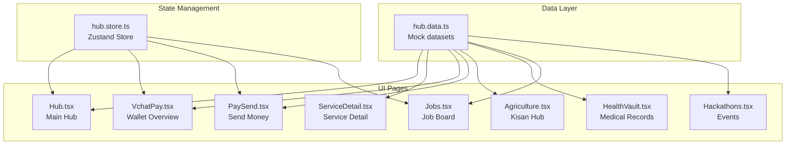
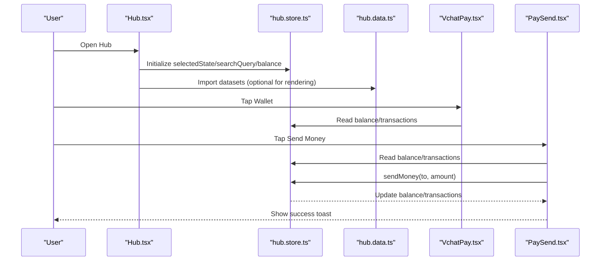
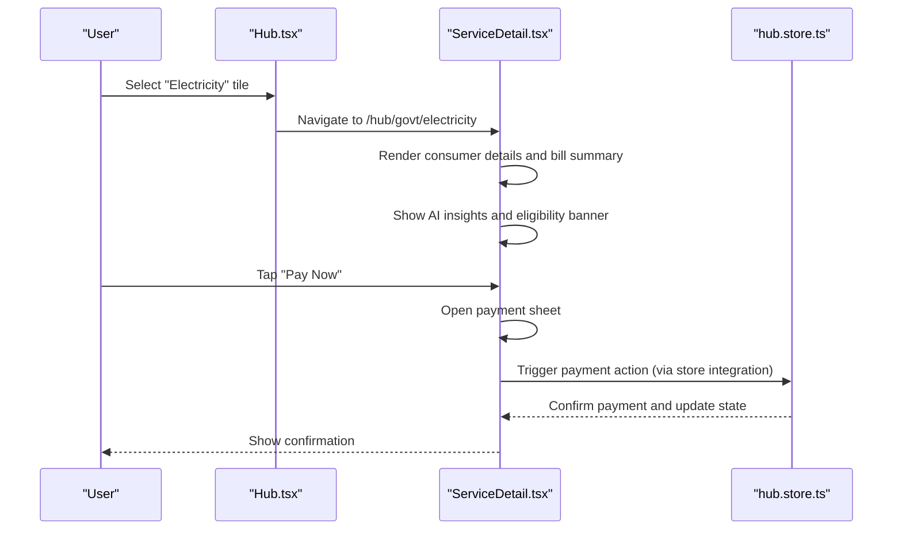
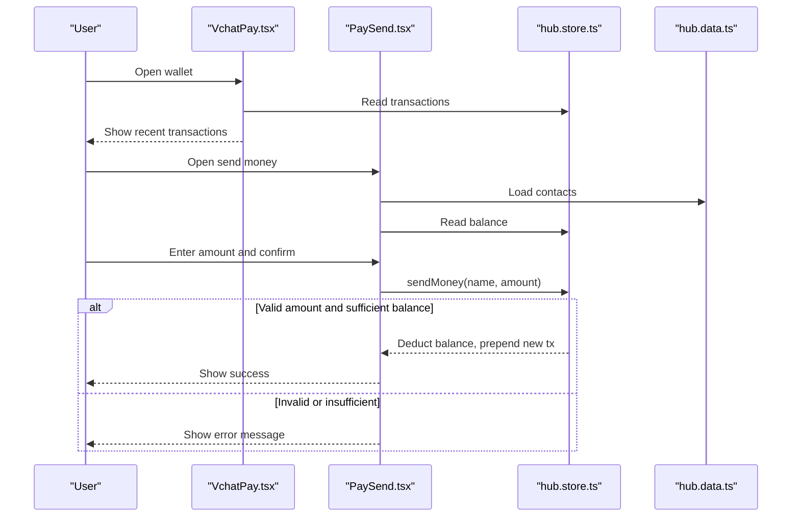
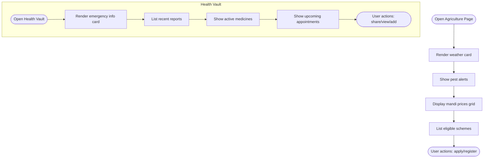
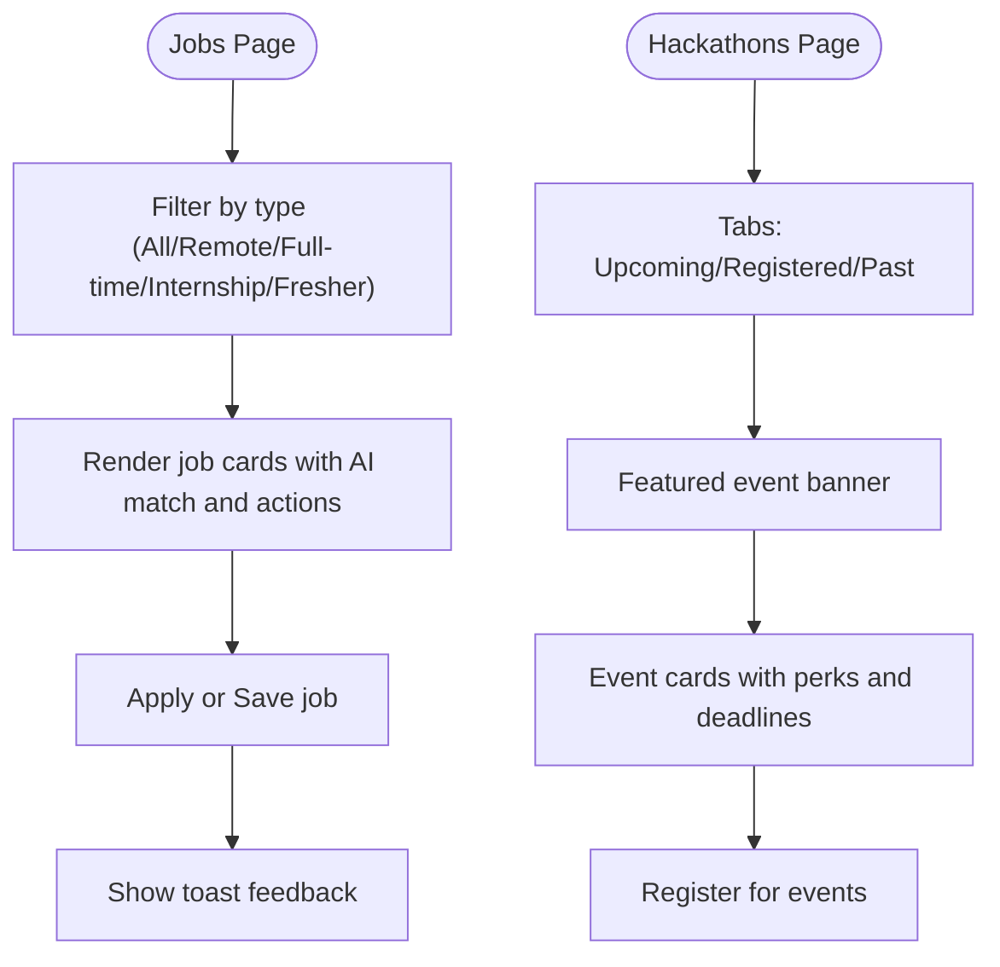
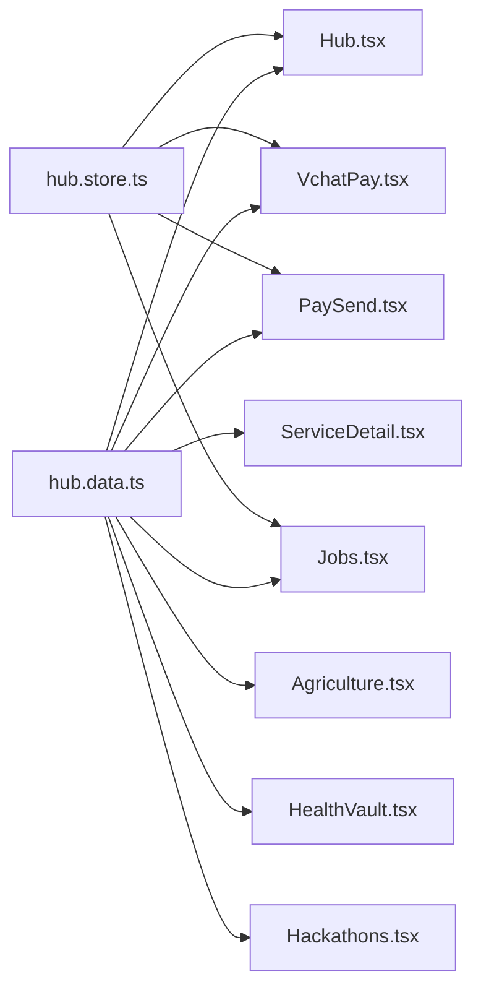

# Hub Services Data

<cite>
**Referenced Files in This Document**
- [hub.data.ts](file://src/data/hub.data.ts)
- [Hub.tsx](file://src/pages/Hub.tsx)
- [ServiceDetail.tsx](file://src/pages/hub/ServiceDetail.tsx)
- [PaySend.tsx](file://src/pages/hub/PaySend.tsx)
- [VchatPay.tsx](file://src/pages/hub/VchatPay.tsx)
- [Agriculture.tsx](file://src/pages/hub/Agriculture.tsx)
- [HealthVault.tsx](file://src/pages/hub/HealthVault.tsx)
- [Jobs.tsx](file://src/pages/hub/Jobs.tsx)
- [Hackathons.tsx](file://src/pages/hub/Hackathons.tsx)
- [hub.store.ts](file://src/store/hub.store.ts)
</cite>

## Table of Contents
1. [Introduction](#introduction)
2. [Project Structure](#project-structure)
3. [Core Components](#core-components)
4. [Architecture Overview](#architecture-overview)
5. [Detailed Component Analysis](#detailed-component-analysis)
6. [Dependency Analysis](#dependency-analysis)
7. [Performance Considerations](#performance-considerations)
8. [Troubleshooting Guide](#troubleshooting-guide)
9. [Conclusion](#conclusion)
10. [Appendices](#appendices)

## Introduction
This document describes the hub services data module and how it powers the Digital Services Hub. It focuses on the data structures used for government services, financial transactions, and utility services integration. It explains service organization patterns, data types for different service categories, and how these datasets integrate with service detail components. It also covers data consumption patterns, filtering techniques, transaction processing integration, validation requirements, availability checks, performance optimization, and guidelines for extending service categories and maintaining data consistency across the digital services ecosystem.

## Project Structure
The hub services data resides in a centralized data module and is consumed by multiple service pages and the global hub store. The data module exports mock datasets for transactions, contacts, restaurants, jobs, hackathons, medical records, and mandi prices. These datasets are used by pages such as the main Hub, ServiceDetail, VchatPay, PaySend, Agriculture, HealthVault, Jobs, and Hackathons.

**Diagram sources**
- [hub.data.ts:1-247](file://src/data/hub.data.ts#L1-L247)
- [Hub.tsx:1-300](file://src/pages/Hub.tsx#L1-L300)
- [ServiceDetail.tsx:1-152](file://src/pages/hub/ServiceDetail.tsx#L1-L152)
- [VchatPay.tsx:1-120](file://src/pages/hub/VchatPay.tsx#L1-L120)
- [PaySend.tsx:1-164](file://src/pages/hub/PaySend.tsx#L1-L164)
- [Agriculture.tsx:1-131](file://src/pages/hub/Agriculture.tsx#L1-L131)
- [HealthVault.tsx:1-131](file://src/pages/hub/HealthVault.tsx#L1-L131)
- [Jobs.tsx:1-133](file://src/pages/hub/Jobs.tsx#L1-L133)
- [Hackathons.tsx:1-76](file://src/pages/hub/Hackathons.tsx#L1-L76)
- [hub.store.ts:116-165](file://src/store/hub.store.ts#L116-L165)

**Section sources**
- [hub.data.ts:1-247](file://src/data/hub.data.ts#L1-L247)
- [Hub.tsx:1-300](file://src/pages/Hub.tsx#L1-L300)

## Core Components
This section documents the primary data structures and their roles in the hub ecosystem.

- Financial transactions dataset
  - Purpose: Provides recent transaction history for Vchat Pay integration.
  - Fields: Identifier, type, icon, counterparty name, description, date, amount, positivity flag.
  - Consumption: Used in VchatPay and PaySend pages to render recent activity and validate send limits.
  - Validation: Amount positivity flag indicates inflow/outflow; amount strings include currency and sign.

- Contacts dataset
  - Purpose: Supplies recipient profiles for peer-to-peer money transfers.
  - Fields: Identifier, name, initials, gradient background, last paid date.
  - Consumption: Used in PaySend to select recipients and display avatar placeholders.

- Restaurants dataset
  - Purpose: Powers food ordering and discovery features.
  - Fields: Identifier, name, tags, rating, estimated delivery time, delivery fee, badge, emoji, gradient.
  - Consumption: Used in daily services grid and food ordering flows.

- Jobs dataset
  - Purpose: Powers the Jobs & Careers experience with AI-matched listings.
  - Fields: Identifier, title, company, location, salary range, employment type, skills list, match score, posting age, gradient.
  - Consumption: Used in Jobs page for filtering, saving, applying, and displaying AI match scores.

- Hackathons dataset
  - Purpose: Lists upcoming and featured hackathons and events.
  - Fields: Identifier, title, organizer, mode, benefit/perk, team size, deadline, emoji, gradient.
  - Consumption: Used in Hackathons page for event cards and registration.

- Medical records dataset
  - Purpose: Stores health reports and records for Health Vault.
  - Fields: Identifier, title, date, hospital, AI analysis flag, icon, background, color.
  - Consumption: Used in HealthVault to render recent reports and AI summaries.

- Mandi prices dataset
  - Purpose: Provides crop market prices for farmers.
  - Fields: Crop name, price per quintal, change indicator, direction flag.
  - Consumption: Used in Agriculture page to show price trends and alerts.

**Section sources**
- [hub.data.ts:1-247](file://src/data/hub.data.ts#L1-L247)
- [VchatPay.tsx:94-114](file://src/pages/hub/VchatPay.tsx#L94-L114)
- [PaySend.tsx:135-159](file://src/pages/hub/PaySend.tsx#L135-L159)
- [Jobs.tsx:60-127](file://src/pages/hub/Jobs.tsx#L60-L127)
- [Hackathons.tsx:42-62](file://src/pages/hub/Hackathons.tsx#L42-L62)
- [HealthVault.tsx:49-84](file://src/pages/hub/HealthVault.tsx#L49-L84)
- [Agriculture.tsx:73-82](file://src/pages/hub/Agriculture.tsx#L73-L82)

## Architecture Overview
The hub services data module acts as a shared data source for multiple UI pages. The global hub store initializes state from these datasets and exposes actions for money transfer, job application, and state selection. Pages consume datasets directly or via the store, enabling consistent behavior across the Digital Services Hub.

**Diagram sources**
- [Hub.tsx:1-300](file://src/pages/Hub.tsx#L1-L300)
- [hub.store.ts:116-165](file://src/store/hub.store.ts#L116-L165)
- [hub.data.ts:1-247](file://src/data/hub.data.ts#L1-L247)
- [VchatPay.tsx:1-120](file://src/pages/hub/VchatPay.tsx#L1-L120)
- [PaySend.tsx:1-164](file://src/pages/hub/PaySend.tsx#L1-L164)

## Detailed Component Analysis

### Government Services Integration
Government services are organized as tiles in the Hub page and rendered with state-aware routing. ServiceDetail handles bill payment flows for electricity and water, including consumer details, current bills, eligibility checks, and payment history.

**Diagram sources**
- [Hub.tsx:94-117](file://src/pages/Hub.tsx#L94-L117)
- [ServiceDetail.tsx:1-152](file://src/pages/hub/ServiceDetail.tsx#L1-L152)
- [hub.store.ts:145-165](file://src/store/hub.store.ts#L145-L165)

**Section sources**
- [Hub.tsx:81-118](file://src/pages/Hub.tsx#L81-L118)
- [ServiceDetail.tsx:11-115](file://src/pages/hub/ServiceDetail.tsx#L11-L115)

### Financial Transactions and Money Transfer
The financial data module supplies mock transactions and contacts. The hub store encapsulates money transfer logic, validating amounts against the current balance and updating state accordingly. VchatPay renders recent transactions, and PaySend enables selecting recipients and entering amounts.

**Diagram sources**
- [VchatPay.tsx:94-114](file://src/pages/hub/VchatPay.tsx#L94-L114)
- [PaySend.tsx:73-93](file://src/pages/hub/PaySend.tsx#L73-L93)
- [hub.store.ts:145-165](file://src/store/hub.store.ts#L145-L165)
- [hub.data.ts:2-53](file://src/data/hub.data.ts#L2-L53)
- [hub.data.ts:55-60](file://src/data/hub.data.ts#L55-L60)

**Section sources**
- [VchatPay.tsx:94-114](file://src/pages/hub/VchatPay.tsx#L94-L114)
- [PaySend.tsx:73-93](file://src/pages/hub/PaySend.tsx#L73-L93)
- [hub.store.ts:145-165](file://src/store/hub.store.ts#L145-L165)

### Utility Services and Schemes
Utility services are represented by datasets for mandi prices and medical records. The Agriculture page displays weather, pest alerts, mandi prices, and scheme eligibility. The HealthVault page renders emergency info, recent reports, medicines, and upcoming appointments.

**Diagram sources**
- [Agriculture.tsx:32-113](file://src/pages/hub/Agriculture.tsx#L32-L113)
- [HealthVault.tsx:27-118](file://src/pages/hub/HealthVault.tsx#L27-L118)
- [hub.data.ts:240-246](file://src/data/hub.data.ts#L240-L246)
- [hub.data.ts:207-238](file://src/data/hub.data.ts#L207-L238)

**Section sources**
- [Agriculture.tsx:30-113](file://src/pages/hub/Agriculture.tsx#L30-L113)
- [HealthVault.tsx:25-118](file://src/pages/hub/HealthVault.tsx#L25-L118)
- [hub.data.ts:207-246](file://src/data/hub.data.ts#L207-L246)

### Professional and Event Services
Professional services include jobs and hackathons. Jobs integrates AI match scores and allows saving/applied states. Hackathons lists upcoming events with registration CTA.

**Diagram sources**
- [Jobs.tsx:44-127](file://src/pages/hub/Jobs.tsx#L44-L127)
- [Hackathons.tsx:25-62](file://src/pages/hub/Hackathons.tsx#L25-L62)

**Section sources**
- [Jobs.tsx:44-127](file://src/pages/hub/Jobs.tsx#L44-L127)
- [Hackathons.tsx:42-62](file://src/pages/hub/Hackathons.tsx#L42-L62)

## Dependency Analysis
The hub data module is a shared dependency across multiple pages. The hub store composes datasets into state and exposes actions. Pages depend on either direct dataset imports or the store for reactive updates.

**Diagram sources**
- [hub.data.ts:1-247](file://src/data/hub.data.ts#L1-L247)
- [Hub.tsx:1-300](file://src/pages/Hub.tsx#L1-L300)
- [ServiceDetail.tsx:1-152](file://src/pages/hub/ServiceDetail.tsx#L1-L152)
- [VchatPay.tsx:1-120](file://src/pages/hub/VchatPay.tsx#L1-L120)
- [PaySend.tsx:1-164](file://src/pages/hub/PaySend.tsx#L1-L164)
- [Agriculture.tsx:1-131](file://src/pages/hub/Agriculture.tsx#L1-L131)
- [HealthVault.tsx:1-131](file://src/pages/hub/HealthVault.tsx#L1-L131)
- [Jobs.tsx:1-133](file://src/pages/hub/Jobs.tsx#L1-L133)
- [Hackathons.tsx:1-76](file://src/pages/hub/Hackathons.tsx#L1-L76)
- [hub.store.ts:116-165](file://src/store/hub.store.ts#L116-L165)

**Section sources**
- [hub.store.ts:116-165](file://src/store/hub.store.ts#L116-L165)

## Performance Considerations
- Rendering optimization
  - Use virtualized lists for long datasets (jobs, hackathons, transactions) to reduce DOM nodes.
  - Memoize computed values (e.g., filtered job lists) to avoid recomputation on every render.
- Data locality
  - Keep frequently accessed datasets in the hub store to minimize prop drilling and repeated imports.
- Image and gradient caching
  - Precompute gradients and emojis to avoid runtime computation in hot loops.
- Network simulation
  - Replace mock datasets with real API responses behind feature flags to decouple UI from backend timing.
- Pagination and lazy loading
  - Paginate large lists (transactions, job boards) and load more on scroll to improve initial load times.

## Troubleshooting Guide
- Money transfer fails
  - Validate amount is greater than zero and less than or equal to balance before invoking send action.
  - Ensure the store’s sendMoney action updates both balance and transactions atomically.
- State picker not updating
  - Verify setSelectedState updates the store and triggers re-render of dependent components.
- ServiceDetail not reflecting state
  - Confirm route params are parsed and state-aware UI elements (location badge) are bound to store-selected state.
- Filtering not working
  - Ensure filters operate on the store’s datasets and that active tab state is tracked locally in the component.
- Transaction list not updating
  - Confirm new transactions are prepended to the transactions array and balance reflects the deduction.

**Section sources**
- [PaySend.tsx:73-93](file://src/pages/hub/PaySend.tsx#L73-L93)
- [hub.store.ts:145-165](file://src/store/hub.store.ts#L145-L165)
- [Hub.tsx:282-285](file://src/pages/Hub.tsx#L282-L285)
- [Jobs.tsx:60-62](file://src/pages/hub/Jobs.tsx#L60-L62)
- [VchatPay.tsx:97-113](file://src/pages/hub/VchatPay.tsx#L97-L113)

## Conclusion
The hub services data module centralizes datasets for government services, financial transactions, and utility services. Pages integrate with this module and the hub store to deliver a cohesive Digital Services Hub experience. By following the outlined patterns for data consumption, filtering, transaction processing, validation, and performance, developers can extend service categories, add new government services, and maintain data consistency across the ecosystem.

## Appendices

### Data Types and Validation Requirements
- Transaction
  - Required fields: id, type, icon, name, desc, date, amount, isPositive.
  - Validation: amount must include currency symbol and sign; isPositive determines inflow/outflow.
- Contact
  - Required fields: id, name, initials, grad, lastPaid.
  - Validation: initials should be derived from name; grad is used for avatar styling.
- Restaurant
  - Required fields: id, name, tags, rating, time, fee, badge, emoji, grad.
  - Validation: rating should be numeric; time and fee should be human-readable.
- Job
  - Required fields: id, title, company, loc, salary, type, skills[], matchScore, posted, grad.
  - Validation: matchScore should be a percentage; skills should be a non-empty list.
- Hackathon
  - Required fields: id, title, org, mode, perk, members, deadline, emoji, grad.
  - Validation: members should specify min/max; deadline should be a valid date string.
- Medical Record
  - Required fields: id, title, date, hospital, isAiAnalyzed, icon, bg, color.
  - Validation: isAiAnalyzed should be boolean; icon and bg/color should align with record type.
- Mandi Price
  - Required fields: crop, price, change, isUp.
  - Validation: change should indicate direction; isUp should be boolean.

### Extending Service Categories
- Add new dataset
  - Define a new export in the data module with required fields and validation.
- Integrate into Hub
  - Add a tile in the Hub page with appropriate icon, label, and route.
- Connect to store
  - Initialize the dataset in the hub store and expose getters/setters/actions as needed.
- Consume in UI
  - Import the dataset or use the store in the new page; implement filtering and rendering logic.
- Maintain consistency
  - Standardize field names and types across datasets; keep icons, gradients, and badges consistent.