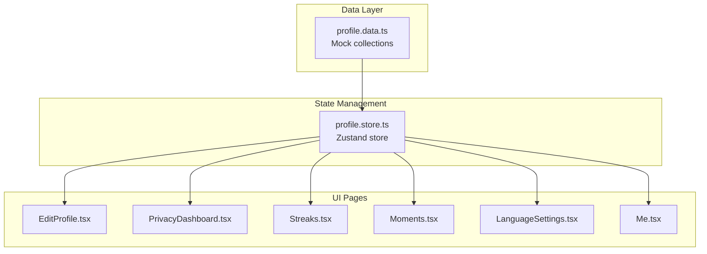
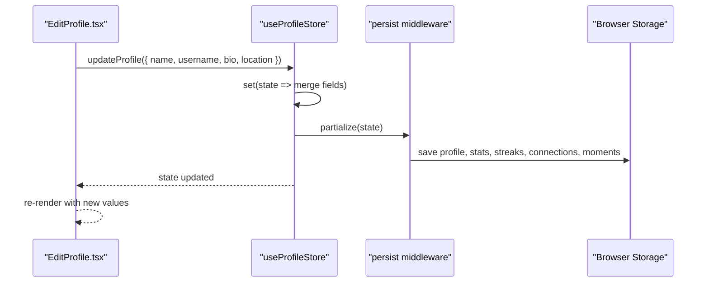
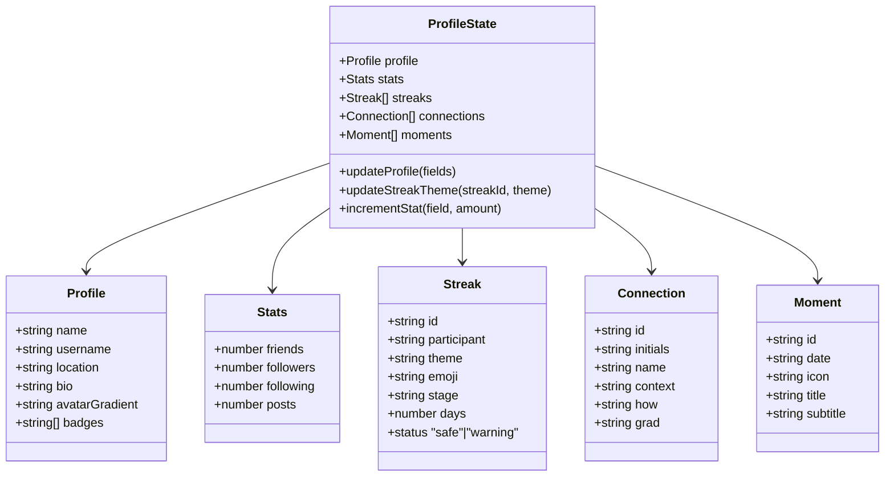
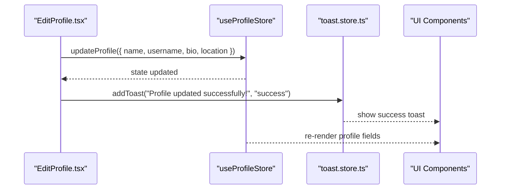
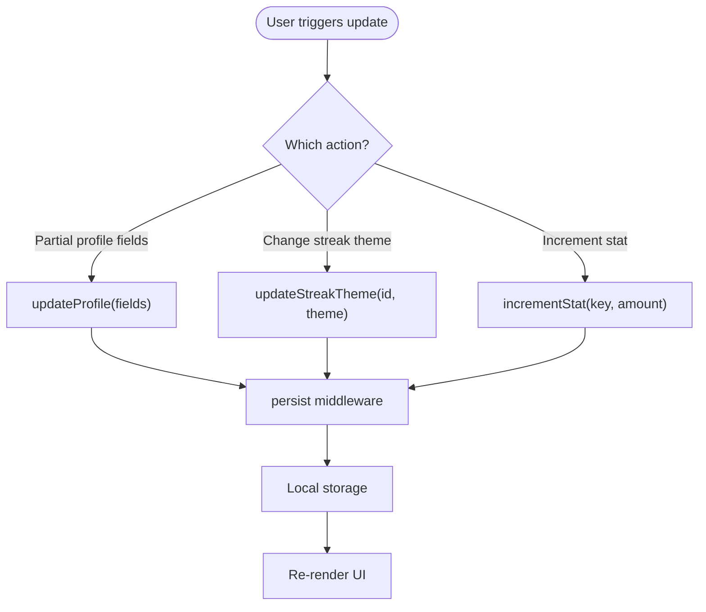
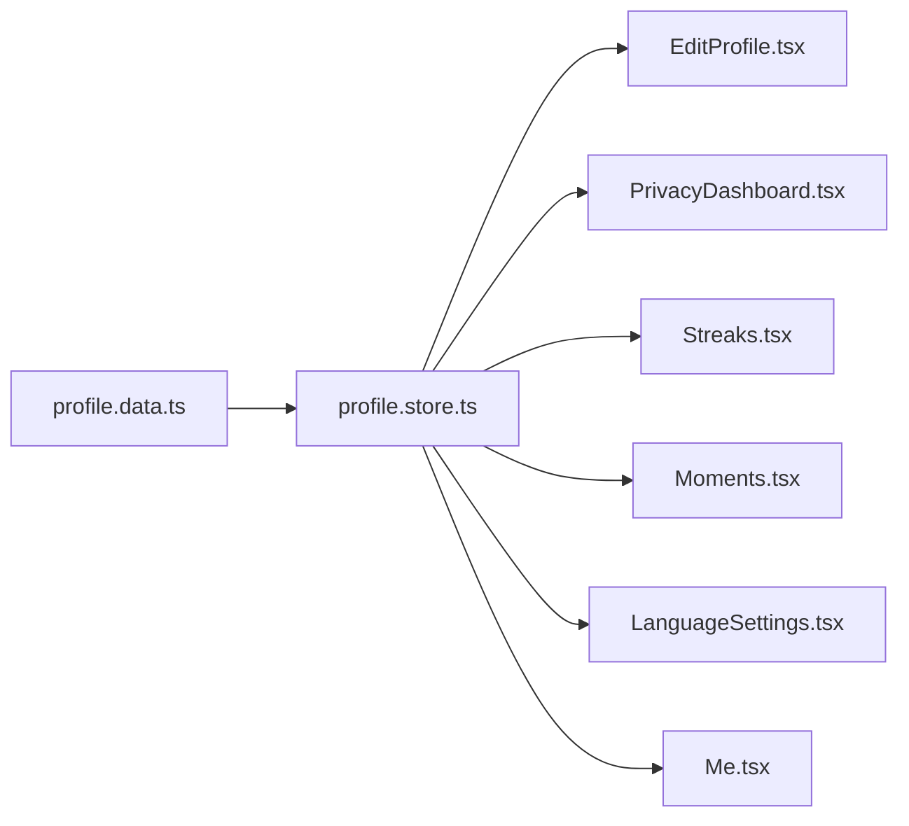

# Profile Data

<cite>
**Referenced Files in This Document**
- [profile.data.ts](file://src/data/profile.data.ts)
- [profile.store.ts](file://src/store/profile.store.ts)
- [EditProfile.tsx](file://src/pages/profile/EditProfile.tsx)
- [PrivacyDashboard.tsx](file://src/pages/profile/PrivacyDashboard.tsx)
- [Streaks.tsx](file://src/pages/profile/Streaks.tsx)
- [Moments.tsx](file://src/pages/profile/Moments.tsx)
- [LanguageSettings.tsx](file://src/pages/profile/LanguageSettings.tsx)
- [Me.tsx](file://src/pages/Me.tsx)
- [toast.store.ts](file://src/store/toast.store.ts)
</cite>

## Table of Contents
1. [Introduction](#introduction)
2. [Project Structure](#project-structure)
3. [Core Components](#core-components)
4. [Architecture Overview](#architecture-overview)
5. [Detailed Component Analysis](#detailed-component-analysis)
6. [Dependency Analysis](#dependency-analysis)
7. [Performance Considerations](#performance-considerations)
8. [Troubleshooting Guide](#troubleshooting-guide)
9. [Conclusion](#conclusion)
10. [Appendices](#appendices)

## Introduction
This document describes the profile data module that powers user profiles, preferences, privacy controls, and social connections across the application. It explains the data structures, state management, and integration with profile-related pages and components. It also covers data consumption patterns, update mechanisms, privacy considerations, and guidelines for extending the profile system.

## Project Structure
The profile data module is organized around a central store that manages profile state and exposes typed actions. Mock data is provided for social connections, streaks, memory vault entries, and languages. Pages consume this store to render profile views and handle updates.

**Diagram sources**
- [profile.data.ts:1-77](file://src/data/profile.data.ts#L1-L77)
- [profile.store.ts:1-139](file://src/store/profile.store.ts#L1-L139)
- [EditProfile.tsx:1-125](file://src/pages/profile/EditProfile.tsx#L1-L125)
- [PrivacyDashboard.tsx:1-115](file://src/pages/profile/PrivacyDashboard.tsx#L1-L115)
- [Streaks.tsx:1-174](file://src/pages/profile/Streaks.tsx#L1-L174)
- [Moments.tsx:1-134](file://src/pages/profile/Moments.tsx#L1-L134)
- [LanguageSettings.tsx:1-104](file://src/pages/profile/LanguageSettings.tsx#L1-L104)
- [Me.tsx:1-229](file://src/pages/Me.tsx#L1-L229)

**Section sources**
- [profile.data.ts:1-77](file://src/data/profile.data.ts#L1-L77)
- [profile.store.ts:1-139](file://src/store/profile.store.ts#L1-L139)

## Core Components
- Profile data provider: Provides mock collections for streaks, connections, memory vault, and languages.
- Profile store: Centralized state for profile, stats, streaks, connections, and moments with typed actions.
- Profile pages: Edit profile, privacy dashboard, streaks, moments, language settings, and the main profile page.

Key responsibilities:
- Define and export typed interfaces for profile entities.
- Seed initial state from mock data and hardcoded values.
- Expose actions to update profile fields and streak themes.
- Persist selected parts of state to local storage.

**Section sources**
- [profile.data.ts:1-77](file://src/data/profile.data.ts#L1-L77)
- [profile.store.ts:1-139](file://src/store/profile.store.ts#L1-L139)

## Architecture Overview
The profile system follows a unidirectional data flow:
- Pages read from the store and render UI.
- Actions mutate state immutably.
- Persist middleware serializes selected slices to local storage.

**Diagram sources**
- [EditProfile.tsx:18-22](file://src/pages/profile/EditProfile.tsx#L18-L22)
- [profile.store.ts:104-108](file://src/store/profile.store.ts#L104-L108)
- [profile.store.ts:127-137](file://src/store/profile.store.ts#L127-L137)

## Detailed Component Analysis

### Data Structures and Types
The store defines the following core types and their relationships:

**Diagram sources**
- [profile.store.ts:6-60](file://src/store/profile.store.ts#L6-L60)

**Section sources**
- [profile.store.ts:6-60](file://src/store/profile.store.ts#L6-L60)

### Profile Organization Patterns
- Typed entities encapsulate distinct profile domains: personal identity, statistics, streaks, connections, and moments.
- Seed data is composed from:
  - Hardcoded values in the store for profile and stats.
  - Mock arrays from the data module for streaks and connections.
  - Hardcoded timeline in the store for moments.
- The store persists only the selected slices to minimize storage footprint.

**Section sources**
- [profile.store.ts:63-93](file://src/store/profile.store.ts#L63-L93)
- [profile.store.ts:127-137](file://src/store/profile.store.ts#L127-L137)

### Data Types for Different Sections
- Personal information: name, username, location, bio, avatar gradient, badges.
- Preferences: language settings and offline packs (via mock data).
- Privacy settings: privacy score card, stealth mode, read receipts, download/delete account actions.
- Social connections: initials, name, context, how they were connected, gradient background.
- Streaks: participant, theme, emoji, stage, days, status, with progress visualization.
- Moments: date, icon, title, subtitle, with filtering and search.

**Section sources**
- [profile.store.ts:33-47](file://src/store/profile.store.ts#L33-L47)
- [profile.data.ts:1-77](file://src/data/profile.data.ts#L1-L77)
- [PrivacyDashboard.tsx:28-110](file://src/pages/profile/PrivacyDashboard.tsx#L28-L110)
- [LanguageSettings.tsx:62-98](file://src/pages/profile/LanguageSettings.tsx#L62-L98)
- [Streaks.tsx:77-123](file://src/pages/profile/Streaks.tsx#L77-L123)
- [Moments.tsx:15-27](file://src/pages/profile/Moments.tsx#L15-L27)

### Integration with Profile Management Components
- Edit profile page binds form fields to store state and dispatches an update action.
- Privacy dashboard renders privacy metrics and settings toggles.
- Streaks page displays progress cards and allows changing themes via a modal.
- Moments page filters and renders a timeline of user activities.
- Language settings page lists downloadable language packs and auto-translate options.
- Main profile page (Me) aggregates profile, stats, recent streaks, connections, and moments.

**Diagram sources**
- [EditProfile.tsx:18-22](file://src/pages/profile/EditProfile.tsx#L18-L22)
- [profile.store.ts:104-108](file://src/store/profile.store.ts#L104-L108)
- [toast.store.ts:17-38](file://src/store/toast.store.ts#L17-L38)

**Section sources**
- [EditProfile.tsx:1-125](file://src/pages/profile/EditProfile.tsx#L1-L125)
- [Me.tsx:1-229](file://src/pages/Me.tsx#L1-L229)

### Data Consumption Patterns
- Pages subscribe to the store via hooks and render derived UI.
- Filtering and memoization are used for performance-sensitive lists (e.g., Moments).
- Navigation is handled via router links to dedicated profile sections.

Examples:
- Edit profile consumes current values and saves partial updates.
- Moments filters timeline items by search query.
- Streaks updates theme for a specific streak and closes the picker.

**Section sources**
- [Moments.tsx:15-27](file://src/pages/profile/Moments.tsx#L15-L27)
- [Streaks.tsx:109-121](file://src/pages/profile/Streaks.tsx#L109-L121)

### Profile Update Mechanisms
- Partial field updates for profile information.
- Theme updates for individual streaks.
- Stat increments for analytics-like counters.

**Diagram sources**
- [profile.store.ts:104-125](file://src/store/profile.store.ts#L104-L125)
- [profile.store.ts:127-137](file://src/store/profile.store.ts#L127-L137)

**Section sources**
- [profile.store.ts:104-125](file://src/store/profile.store.ts#L104-L125)

### Privacy-Controlled Data Access
- Privacy dashboard presents privacy metrics and controls for read receipts, stealth mode, and data downloads/deletion.
- Moments page is marked private and only visible to the user.
- Language settings manage offline translation packs and auto-translate toggles.

**Section sources**
- [PrivacyDashboard.tsx:27-110](file://src/pages/profile/PrivacyDashboard.tsx#L27-L110)
- [Moments.tsx:39-43](file://src/pages/profile/Moments.tsx#L39-L43)
- [LanguageSettings.tsx:41-98](file://src/pages/profile/LanguageSettings.tsx#L41-L98)

### Data Validation Requirements
- Profile fields are currently unvalidated in the store. Consider adding:
  - Length constraints for name, username, bio, and location.
  - Format checks for usernames (e.g., @ prefix).
  - Allowed characters and sanitization for bio.
  - Enumerated values for privacy toggles and language packs.
- Streak theme updates should validate against known themes.
- Stats increment should guard against negative values.

[No sources needed since this section provides general guidance]

### Security Measures
- Local storage persistence is used for convenience; sensitive data should not be persisted here.
- UI toggles for privacy settings should be validated server-side if integrated with backend APIs.
- Ensure navigation guards and route protection for sensitive sections.

[No sources needed since this section provides general guidance]

### Guidelines for Extending Profile Fields
- Add new fields to the Profile interface and initialize defaults in the seed function.
- Extend the updateProfile action to accept new fields.
- Update pages that render or edit the field.
- Add validation and sanitization as needed.
- Consider privacy implications and whether the field should be persisted.

**Section sources**
- [profile.store.ts:33-40](file://src/store/profile.store.ts#L33-L40)
- [profile.store.ts:63-70](file://src/store/profile.store.ts#L63-L70)
- [profile.store.ts:104-108](file://src/store/profile.store.ts#L104-L108)

### Adding New Profile Sections
- Define a new entity type and seed data if applicable.
- Add a new page component that reads from the store.
- Integrate navigation from the main profile page.
- Add persistence considerations for new state slices.

**Section sources**
- [profile.store.ts:25-31](file://src/store/profile.store.ts#L25-L31)
- [profile.store.ts:86-93](file://src/store/profile.store.ts#L86-L93)
- [Me.tsx:159-170](file://src/pages/Me.tsx#L159-L170)

### Maintaining Data Consistency
- Use immutable updates in actions to prevent accidental mutations.
- Keep seed data aligned with mock data and hardcoded values.
- Centralize type definitions to avoid drift between store and components.
- Persist only necessary slices to reduce coupling with storage.

**Section sources**
- [profile.store.ts:104-125](file://src/store/profile.store.ts#L104-L125)
- [profile.store.ts:127-137](file://src/store/profile.store.ts#L127-L137)

## Dependency Analysis
The profile store depends on mock data for streaks and connections and seeds profile and stats from hardcoded values. Pages depend on the store for rendering and dispatching actions.

**Diagram sources**
- [profile.data.ts:1-77](file://src/data/profile.data.ts#L1-L77)
- [profile.store.ts:1-139](file://src/store/profile.store.ts#L1-L139)
- [EditProfile.tsx:1-125](file://src/pages/profile/EditProfile.tsx#L1-L125)
- [PrivacyDashboard.tsx:1-115](file://src/pages/profile/PrivacyDashboard.tsx#L1-L115)
- [Streaks.tsx:1-174](file://src/pages/profile/Streaks.tsx#L1-L174)
- [Moments.tsx:1-134](file://src/pages/profile/Moments.tsx#L1-L134)
- [LanguageSettings.tsx:1-104](file://src/pages/profile/LanguageSettings.tsx#L1-L104)
- [Me.tsx:1-229](file://src/pages/Me.tsx#L1-L229)

**Section sources**
- [profile.store.ts:3-3](file://src/store/profile.store.ts#L3-L3)
- [profile.data.ts:1-77](file://src/data/profile.data.ts#L1-L77)

## Performance Considerations
- Memoize expensive computations (e.g., Moments filtering) to avoid unnecessary re-renders.
- Prefer shallow updates and immutable patterns to leverage React and Zustand optimizations.
- Limit persisted state to frequently accessed slices to reduce storage overhead.

[No sources needed since this section provides general guidance]

## Troubleshooting Guide
Common issues and resolutions:
- Profile updates not reflected: Verify the update action is called and the store is subscribed in the component.
- Streak theme change does nothing: Ensure the streak ID matches and the theme is valid.
- Language packs not downloading: Confirm network connectivity and mock data availability.
- Privacy toggles not saving: Check local storage permissions and middleware configuration.

**Section sources**
- [EditProfile.tsx:18-22](file://src/pages/profile/EditProfile.tsx#L18-L22)
- [Streaks.tsx:155-166](file://src/pages/profile/Streaks.tsx#L155-L166)
- [LanguageSettings.tsx:82-86](file://src/pages/profile/LanguageSettings.tsx#L82-L86)
- [profile.store.ts:127-137](file://src/store/profile.store.ts#L127-L137)

## Conclusion
The profile data module provides a clean separation of concerns between data, state, and UI. By using typed interfaces, immutable updates, and selective persistence, it enables scalable profile features. Following the extension guidelines ensures consistency and maintainability across profile-related features.

## Appendices
- Mock data sources: Streaks, connections, memory vault, and languages are provided for demonstration and testing.
- Store persistence: Selected slices are persisted to local storage to preserve user preferences across sessions.

**Section sources**
- [profile.data.ts:1-77](file://src/data/profile.data.ts#L1-L77)
- [profile.store.ts:127-137](file://src/store/profile.store.ts#L127-L137)