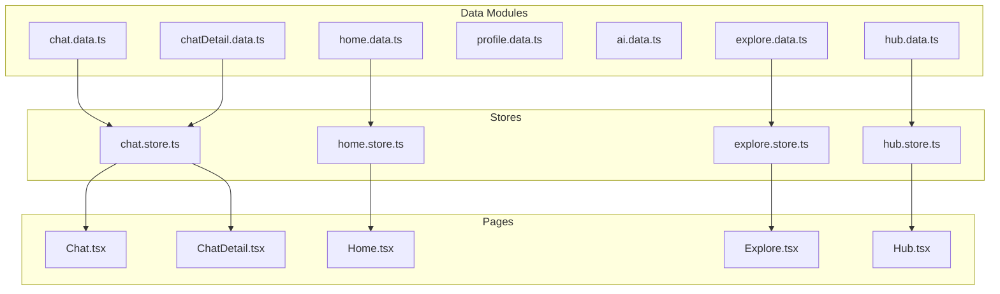
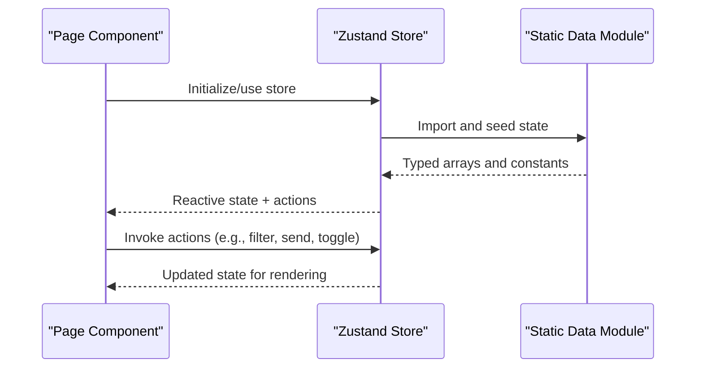
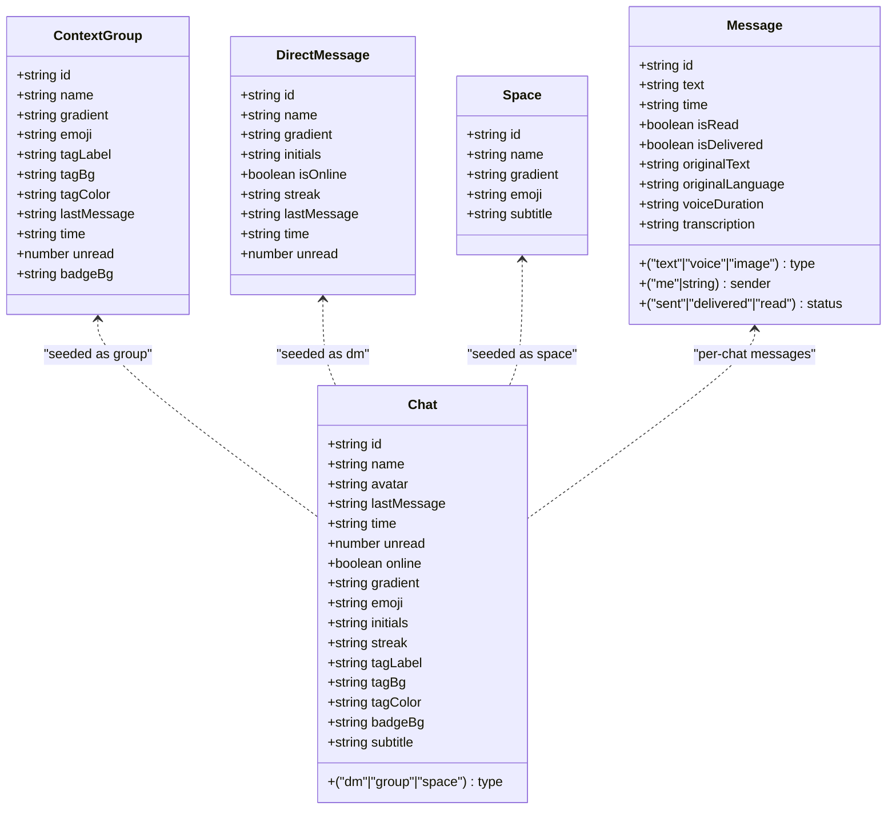
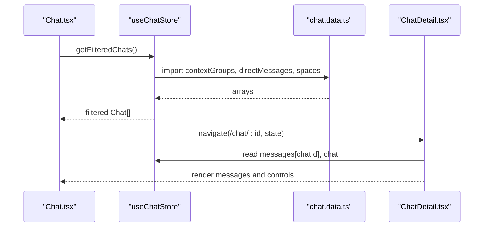
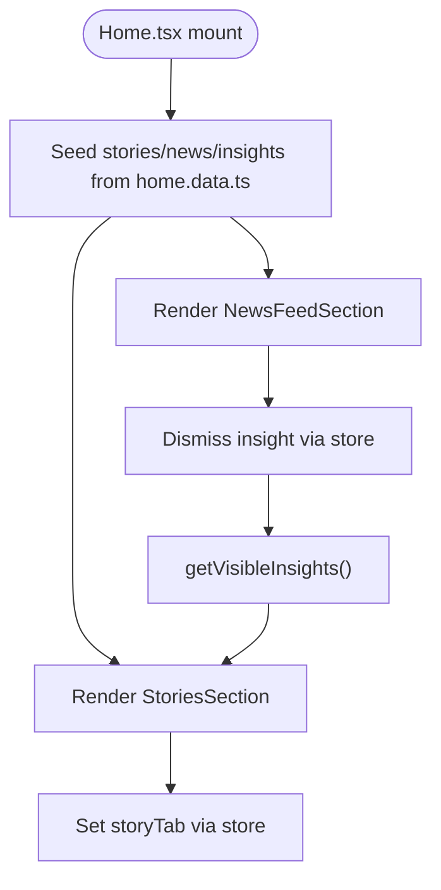
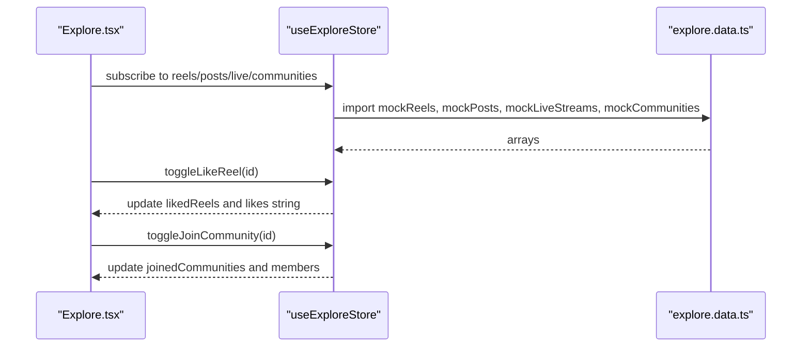
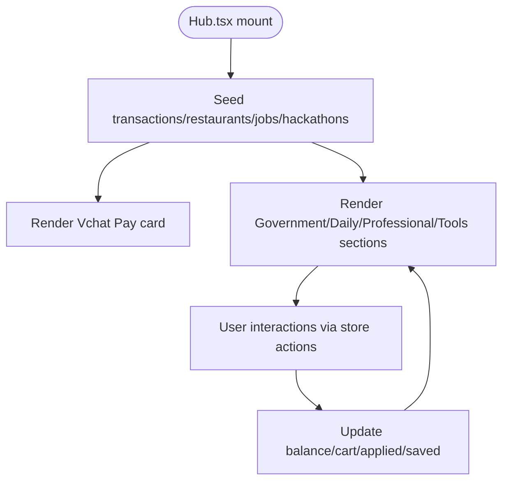
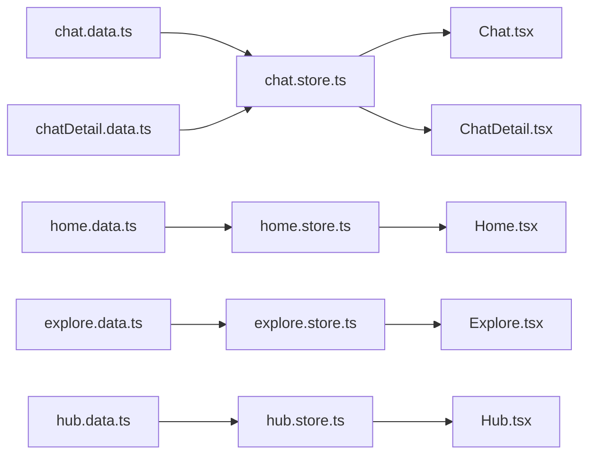

# Static Data Modules

<cite>
**Referenced Files in This Document**
- [chat.data.ts](file://src/data/chat.data.ts)
- [home.data.ts](file://src/data/home.data.ts)
- [explore.data.ts](file://src/data/explore.data.ts)
- [profile.data.ts](file://src/data/profile.data.ts)
- [ai.data.ts](file://src/data/ai.data.ts)
- [hub.data.ts](file://src/data/hub.data.ts)
- [chatDetail.data.ts](file://src/data/chatDetail.data.ts)
- [Chat.tsx](file://src/pages/Chat.tsx)
- [ChatDetail.tsx](file://src/pages/ChatDetail.tsx)
- [Home.tsx](file://src/pages/Home.tsx)
- [Explore.tsx](file://src/pages/Explore.tsx)
- [Hub.tsx](file://src/pages/Hub.tsx)
- [chat.store.ts](file://src/store/chat.store.ts)
- [home.store.ts](file://src/store/home.store.ts)
- [explore.store.ts](file://src/store/explore.store.ts)
- [hub.store.ts](file://src/store/hub.store.ts)
</cite>

## Table of Contents
1. [Introduction](#introduction)
2. [Project Structure](#project-structure)
3. [Core Components](#core-components)
4. [Architecture Overview](#architecture-overview)
5. [Detailed Component Analysis](#detailed-component-analysis)
6. [Dependency Analysis](#dependency-analysis)
7. [Performance Considerations](#performance-considerations)
8. [Troubleshooting Guide](#troubleshooting-guide)
9. [Conclusion](#conclusion)
10. [Appendices](#appendices)

## Introduction
This document explains VChat’s static data modules architecture. It covers the TypeScript interfaces and data structures used across the application, including ContextGroup, DirectMessage, Space, and other domain-specific types. It documents how each module organizes data, the naming conventions and structural consistency across modules, and how each module serves specific UI components and page contexts. It also describes data consumption patterns in components, transformation techniques, integration with state management, validation requirements, type safety enforcement, error handling strategies, and guidelines for extending and maintaining data consistency.

## Project Structure
The static data modules reside under src/data and define strongly typed collections and structures used by UI components. Each module encapsulates:
- Domain-specific TypeScript interfaces
- Static arrays of typed objects
- Optional constants for UI metadata (e.g., gradients, emojis)

The UI pages consume these modules via local Zustand stores that seed state from the static data and expose actions to mutate and filter data.

**Diagram sources**
- [chat.data.ts:1-134](file://src/data/chat.data.ts#L1-L134)
- [home.data.ts:1-104](file://src/data/home.data.ts#L1-L104)
- [explore.data.ts:1-193](file://src/data/explore.data.ts#L1-L193)
- [profile.data.ts:1-77](file://src/data/profile.data.ts#L1-L77)
- [ai.data.ts:1-102](file://src/data/ai.data.ts#L1-L102)
- [hub.data.ts:1-247](file://src/data/hub.data.ts#L1-L247)
- [chatDetail.data.ts:1-71](file://src/data/chatDetail.data.ts#L1-L71)
- [Chat.tsx:65-245](file://src/pages/Chat.tsx#L65-L245)
- [ChatDetail.tsx:9-332](file://src/pages/ChatDetail.tsx#L9-L332)
- [Home.tsx:1-295](file://src/pages/Home.tsx#L1-L295)
- [Explore.tsx:1-415](file://src/pages/Explore.tsx#L1-L415)
- [Hub.tsx:1-300](file://src/pages/Hub.tsx#L1-L300)
- [chat.store.ts:1-349](file://src/store/chat.store.ts#L1-L349)
- [home.store.ts:1-103](file://src/store/home.store.ts#L1-L103)
- [explore.store.ts:1-164](file://src/store/explore.store.ts#L1-L164)
- [hub.store.ts:1-271](file://src/store/hub.store.ts#L1-L271)

**Section sources**
- [chat.data.ts:1-134](file://src/data/chat.data.ts#L1-L134)
- [home.data.ts:1-104](file://src/data/home.data.ts#L1-L104)
- [explore.data.ts:1-193](file://src/data/explore.data.ts#L1-L193)
- [profile.data.ts:1-77](file://src/data/profile.data.ts#L1-L77)
- [ai.data.ts:1-102](file://src/data/ai.data.ts#L1-L102)
- [hub.data.ts:1-247](file://src/data/hub.data.ts#L1-L247)
- [chatDetail.data.ts:1-71](file://src/data/chatDetail.data.ts#L1-L71)
- [Chat.tsx:65-245](file://src/pages/Chat.tsx#L65-L245)
- [ChatDetail.tsx:9-332](file://src/pages/ChatDetail.tsx#L9-L332)
- [Home.tsx:1-295](file://src/pages/Home.tsx#L1-L295)
- [Explore.tsx:1-415](file://src/pages/Explore.tsx#L1-L415)
- [Hub.tsx:1-300](file://src/pages/Hub.tsx#L1-L300)
- [chat.store.ts:1-349](file://src/store/chat.store.ts#L1-L349)
- [home.store.ts:1-103](file://src/store/home.store.ts#L1-L103)
- [explore.store.ts:1-164](file://src/store/explore.store.ts#L1-L164)
- [hub.store.ts:1-271](file://src/store/hub.store.ts#L1-L271)

## Core Components
This section introduces the primary data structures and their roles across modules.

- chat.data.ts
  - ContextGroup: Represents grouped conversations with tag metadata, last message, time, and unread counts.
  - DirectMessage: Represents one-on-one chats with online status, streak, and last message.
  - Space: Represents collaborative spaces with subtitle and gradient.
  - Exposes contextGroups, directMessages, spaces arrays.

- home.data.ts
  - Story: Represents user or friend stories with seen state.
  - NewsItem: Represents curated news with category and color metadata.
  - AiInsight: Represents AI-curated insights with label, color, and action routing.
  - Exposes storiesData, newsItemsData, aiInsightsData arrays.

- explore.data.ts
  - Reel: Represents short-form video content with metadata and engagement stats.
  - Post: Represents text posts with hashtags and engagement metrics.
  - LiveStream: Represents live broadcast metadata.
  - Community: Represents community hubs with membership and join state.
  - Exposes mockReels, mockPosts, mockLiveStreams, mockCommunities arrays.

- profile.data.ts
  - Streaks, Connections, MemoryVault, Languages: Static arrays for profile-related sections.

- ai.data.ts
  - Insight categories: Urgent, Today, Suggestions, Summaries.
  - AIChatSequence: Example conversation sequence for AI twin.

- hub.data.ts
  - Transactions, Contacts, Restaurants, Jobs, Hackathons, MedicalRecords, MandiPrices: Structured data for financial, service, and informational hubs.

- chatDetail.data.ts
  - MessageType, Sender, ChatMessage: Defines message types and fields for conversation rendering and translation features.

**Section sources**
- [chat.data.ts:1-134](file://src/data/chat.data.ts#L1-L134)
- [home.data.ts:1-104](file://src/data/home.data.ts#L1-L104)
- [explore.data.ts:1-193](file://src/data/explore.data.ts#L1-L193)
- [profile.data.ts:1-77](file://src/data/profile.data.ts#L1-L77)
- [ai.data.ts:1-102](file://src/data/ai.data.ts#L1-L102)
- [hub.data.ts:1-247](file://src/data/hub.data.ts#L1-L247)
- [chatDetail.data.ts:1-71](file://src/data/chatDetail.data.ts#L1-L71)

## Architecture Overview
The architecture follows a clear separation of concerns:
- Static data modules define domain types and fixtures.
- Pages render UI and orchestrate navigation.
- Stores seed state from static data, expose actions, and manage user interactions.
- Components consume stores and pass data to UI elements.

**Diagram sources**
- [Chat.tsx:65-245](file://src/pages/Chat.tsx#L65-L245)
- [ChatDetail.tsx:9-332](file://src/pages/ChatDetail.tsx#L9-L332)
- [Home.tsx:1-295](file://src/pages/Home.tsx#L1-L295)
- [Explore.tsx:1-415](file://src/pages/Explore.tsx#L1-L415)
- [Hub.tsx:1-300](file://src/pages/Hub.tsx#L1-L300)
- [chat.store.ts:1-349](file://src/store/chat.store.ts#L1-L349)
- [home.store.ts:1-103](file://src/store/home.store.ts#L1-L103)
- [explore.store.ts:1-164](file://src/store/explore.store.ts#L1-L164)
- [hub.store.ts:1-271](file://src/store/hub.store.ts#L1-L271)
- [chat.data.ts:1-134](file://src/data/chat.data.ts#L1-L134)
- [home.data.ts:1-104](file://src/data/home.data.ts#L1-L104)
- [explore.data.ts:1-193](file://src/data/explore.data.ts#L1-L193)
- [hub.data.ts:1-247](file://src/data/hub.data.ts#L1-L247)

## Detailed Component Analysis

### Chat Module (chat.data.ts + chat.store.ts + Chat.tsx + ChatDetail.tsx)
- Interfaces and data
  - ContextGroup, DirectMessage, Space define the shape of chat entries.
  - Arrays contextGroups, directMessages, spaces provide fixtures.
- Store integration
  - Seeding: Converts static arrays into normalized Chat entities and initializes messages.
  - Actions: sendMessage, markAsRead, setFilter, setSearchQuery, getFilteredChats, createChat, simulateReply.
  - Transformations: Converts ChatMessage to internal Message, normalizes sender identities, derives status from flags.
- Component consumption
  - Chat.tsx renders filtered chats, handles click-to-navigate, and integrates with store filters/search.
  - ChatDetail.tsx renders messages, supports translation banner, and simulates replies.

**Diagram sources**
- [chat.data.ts:1-134](file://src/data/chat.data.ts#L1-L134)
- [chat.store.ts:9-43](file://src/store/chat.store.ts#L9-L43)
- [chat.store.ts:103-169](file://src/store/chat.store.ts#L103-L169)
- [chatDetail.data.ts:4-16](file://src/data/chatDetail.data.ts#L4-L16)

**Diagram sources**
- [Chat.tsx:65-245](file://src/pages/Chat.tsx#L65-L245)
- [chat.store.ts:103-169](file://src/store/chat.store.ts#L103-L169)
- [chat.data.ts:35-134](file://src/data/chat.data.ts#L35-L134)
- [ChatDetail.tsx:9-332](file://src/pages/ChatDetail.tsx#L9-L332)

**Section sources**
- [chat.data.ts:1-134](file://src/data/chat.data.ts#L1-L134)
- [chat.store.ts:1-349](file://src/store/chat.store.ts#L1-L349)
- [Chat.tsx:65-245](file://src/pages/Chat.tsx#L65-L245)
- [ChatDetail.tsx:9-332](file://src/pages/ChatDetail.tsx#L9-L332)

### Home Module (home.data.ts + home.store.ts + Home.tsx)
- Interfaces and data
  - Story, NewsItem, AiInsight define the shapes for stories, curated news, and AI insights.
  - Arrays storiesData, newsItemsData, aiInsightsData provide fixtures.
- Store integration
  - Seeding: Initializes stories, news, and insights.
  - Actions: markStorySeen, dismissInsight, setStoryTab, clearNotifications, getGreeting, getVisibleInsights.
- Component consumption
  - Home.tsx renders greeting, stories, and news feed, and integrates with store actions.

**Diagram sources**
- [home.data.ts:1-104](file://src/data/home.data.ts#L1-L104)
- [home.store.ts:31-102](file://src/store/home.store.ts#L31-L102)
- [Home.tsx:1-295](file://src/pages/Home.tsx#L1-L295)

**Section sources**
- [home.data.ts:1-104](file://src/data/home.data.ts#L1-L104)
- [home.store.ts:1-103](file://src/store/home.store.ts#L1-L103)
- [Home.tsx:1-295](file://src/pages/Home.tsx#L1-L295)

### Explore Module (explore.data.ts + explore.store.ts + Explore.tsx)
- Interfaces and data
  - Reel, Post, LiveStream, Community define social media and discovery content.
  - Arrays mockReels, mockPosts, mockLiveStreams, mockCommunities provide fixtures.
- Store integration
  - Seeding: Initializes lists and interaction flags.
  - Actions: toggleLikeReel, toggleSavePost, toggleFollow, toggleJoinCommunity, helpers to parse/format numeric metrics.
- Component consumption
  - Explore.tsx renders mixed feeds, overlays, and interactive cards.

**Diagram sources**
- [explore.data.ts:1-193](file://src/data/explore.data.ts#L1-L193)
- [explore.store.ts:70-164](file://src/store/explore.store.ts#L70-L164)
- [Explore.tsx:1-415](file://src/pages/Explore.tsx#L1-L415)

**Section sources**
- [explore.data.ts:1-193](file://src/data/explore.data.ts#L1-L193)
- [explore.store.ts:1-164](file://src/store/explore.store.ts#L1-L164)
- [Explore.tsx:1-415](file://src/pages/Explore.tsx#L1-L415)

### Hub Module (hub.data.ts + hub.store.ts + Hub.tsx)
- Interfaces and data
  - Transaction, Restaurant, Job, Hackathon define structured data for financial and service domains.
  - Arrays mockTransactions, mockRestaurants, mockJobs, mockHackathons provide fixtures.
- Store integration
  - Seeding: Initializes state with balances, lists, and interaction flags.
  - Actions: setSelectedState, setSearchQuery, sendMoney, applyJob, toggleSaveJob, addToCart, removeFromCart, clearCart, filtering helpers.
- Component consumption
  - Hub.tsx renders financial cards, categorized services, and interactive grids.

**Diagram sources**
- [hub.data.ts:1-247](file://src/data/hub.data.ts#L1-L247)
- [hub.store.ts:118-271](file://src/store/hub.store.ts#L118-L271)
- [Hub.tsx:1-300](file://src/pages/Hub.tsx#L1-L300)

**Section sources**
- [hub.data.ts:1-247](file://src/data/hub.data.ts#L1-L247)
- [hub.store.ts:1-271](file://src/store/hub.store.ts#L1-L271)
- [Hub.tsx:1-300](file://src/pages/Hub.tsx#L1-L300)

### Profile and AI Modules
- profile.data.ts
  - Provides static arrays for streaks, connections, memory vault, and languages.
- ai.data.ts
  - Provides AI insights and chat sequence examples.

These modules are consumed by profile and AI pages respectively, often via dedicated stores or directly in components.

**Section sources**
- [profile.data.ts:1-77](file://src/data/profile.data.ts#L1-L77)
- [ai.data.ts:1-102](file://src/data/ai.data.ts#L1-L102)

## Dependency Analysis
- Data-to-store dependencies
  - chat.store.ts depends on chat.data.ts and chatDetail.data.ts to seed chats and messages.
  - home.store.ts depends on home.data.ts.
  - explore.store.ts depends on explore.data.ts.
  - hub.store.ts depends on hub.data.ts.
- Store-to-page dependencies
  - Pages import and use their respective stores to render UI and manage interactions.
- Coupling and cohesion
  - Modules are cohesive around domain boundaries.
  - Stores encapsulate state and transformations, reducing coupling between pages and raw data.

**Diagram sources**
- [chat.data.ts:1-134](file://src/data/chat.data.ts#L1-L134)
- [chatDetail.data.ts:1-71](file://src/data/chatDetail.data.ts#L1-L71)
- [home.data.ts:1-104](file://src/data/home.data.ts#L1-L104)
- [explore.data.ts:1-193](file://src/data/explore.data.ts#L1-L193)
- [hub.data.ts:1-247](file://src/data/hub.data.ts#L1-L247)
- [chat.store.ts:1-349](file://src/store/chat.store.ts#L1-L349)
- [home.store.ts:1-103](file://src/store/home.store.ts#L1-L103)
- [explore.store.ts:1-164](file://src/store/explore.store.ts#L1-L164)
- [hub.store.ts:1-271](file://src/store/hub.store.ts#L1-L271)
- [Chat.tsx:65-245](file://src/pages/Chat.tsx#L65-L245)
- [ChatDetail.tsx:9-332](file://src/pages/ChatDetail.tsx#L9-L332)
- [Home.tsx:1-295](file://src/pages/Home.tsx#L1-L295)
- [Explore.tsx:1-415](file://src/pages/Explore.tsx#L1-L415)
- [Hub.tsx:1-300](file://src/pages/Hub.tsx#L1-L300)

**Section sources**
- [chat.store.ts:1-349](file://src/store/chat.store.ts#L1-L349)
- [home.store.ts:1-103](file://src/store/home.store.ts#L1-L103)
- [explore.store.ts:1-164](file://src/store/explore.store.ts#L1-L164)
- [hub.store.ts:1-271](file://src/store/hub.store.ts#L1-L271)

## Performance Considerations
- Rendering lists
  - Prefer stable keys and virtualization for long lists (e.g., messages, posts, jobs).
- Sorting and filtering
  - Keep filters lightweight; memoize derived lists when possible.
- State persistence
  - Stores use persistence middleware; keep serialized state minimal to reduce storage overhead.
- Data parsing/formatting
  - Numeric formatting helpers (likes, members) avoid repeated computations and maintain UI consistency.

## Troubleshooting Guide
- Type mismatches
  - Ensure store interfaces align with static data structures to prevent runtime errors.
- Missing fields
  - When seeding, map optional fields carefully to avoid undefined rendering.
- Time sorting
  - Special-case time strings (“Yesterday”, day abbreviations) during sorting to preserve order.
- Interaction toggles
  - Verify toggled flags (liked, saved, followed, joined) are updated consistently across lists and UI.
- Translation/transcription
  - Guard rendering of original text and transcriptions when unavailable.

**Section sources**
- [chat.store.ts:332-349](file://src/store/chat.store.ts#L332-L349)
- [explore.store.ts:24-68](file://src/store/explore.store.ts#L24-L68)
- [ChatDetail.tsx:176-256](file://src/pages/ChatDetail.tsx#L176-L256)

## Conclusion
VChat’s static data modules provide a robust, type-safe foundation for UI components. By organizing data into domain-focused modules and encapsulating state and interactions in stores, the architecture achieves clear separation of concerns, predictable data flows, and scalable maintenance. Adhering to the documented patterns ensures consistency and simplifies extension.

## Appendices

### Data Consumption Patterns in Components
- Filtering and search
  - Use store-provided getters and setters to filter chats and update UI reactively.
- Interaction toggles
  - Use store actions to update flags and re-render dependent UI.
- Navigation and state passing
  - Pass chat metadata via navigation state to detail pages for seamless UX.

**Section sources**
- [Chat.tsx:69-84](file://src/pages/Chat.tsx#L69-L84)
- [Explore.tsx:13-26](file://src/pages/Explore.tsx#L13-L26)
- [ChatDetail.tsx:22-36](file://src/pages/ChatDetail.tsx#L22-L36)

### Data Transformation Techniques
- Normalization
  - Convert external message types to internal Message for consistent rendering.
- Parsing/formatting
  - Parse “24.5K” likes and format numbers for display.
- Time normalization
  - Normalize time strings for sorting and display.

**Section sources**
- [chat.store.ts:61-81](file://src/store/chat.store.ts#L61-L81)
- [explore.store.ts:24-68](file://src/store/explore.store.ts#L24-L68)
- [chat.store.ts:332-349](file://src/store/chat.store.ts#L332-L349)

### Integration with State Management
- Zustand stores
  - Persist only necessary slices of state to localStorage/sessionStorage.
  - Expose pure actions to mutate state and derive computed values.

**Section sources**
- [chat.store.ts:320-330](file://src/store/chat.store.ts#L320-L330)
- [home.store.ts:92-101](file://src/store/home.store.ts#L92-L101)
- [explore.store.ts:153-162](file://src/store/explore.store.ts#L153-L162)
- [hub.store.ts:258-269](file://src/store/hub.store.ts#L258-L269)

### Validation Requirements and Type Safety
- Define strict TypeScript interfaces per domain.
- Seed state from static arrays to guarantee shape consistency.
- Use union literal types for enums (e.g., MessageType, Sender, Transaction type).

**Section sources**
- [chatDetail.data.ts:1-16](file://src/data/chatDetail.data.ts#L1-L16)
- [chat.store.ts:6-43](file://src/store/chat.store.ts#L6-L43)
- [hub.store.ts:11-57](file://src/store/hub.store.ts#L11-L57)

### Guidelines for Extending Existing Data Structures
- Add fields to the appropriate interface in the data module.
- Update store seeding logic to map new fields.
- Extend store actions to handle new interactions.
- Update components to render new fields and handle user actions.

**Section sources**
- [chat.data.ts:1-134](file://src/data/chat.data.ts#L1-L134)
- [home.data.ts:1-104](file://src/data/home.data.ts#L1-L104)
- [explore.data.ts:1-193](file://src/data/explore.data.ts#L1-L193)
- [hub.data.ts:1-247](file://src/data/hub.data.ts#L1-L247)

### Guidelines for Adding New Data Modules
- Create a new data module with domain-specific interfaces and arrays.
- Add a corresponding store with seeding, actions, and persistence.
- Integrate with a new page component and pass data via props or store.
- Ensure consistent naming conventions and structural parity with existing modules.

**Section sources**
- [chat.data.ts:1-134](file://src/data/chat.data.ts#L1-L134)
- [chat.store.ts:1-349](file://src/store/chat.store.ts#L1-L349)
- [Chat.tsx:65-245](file://src/pages/Chat.tsx#L65-L245)