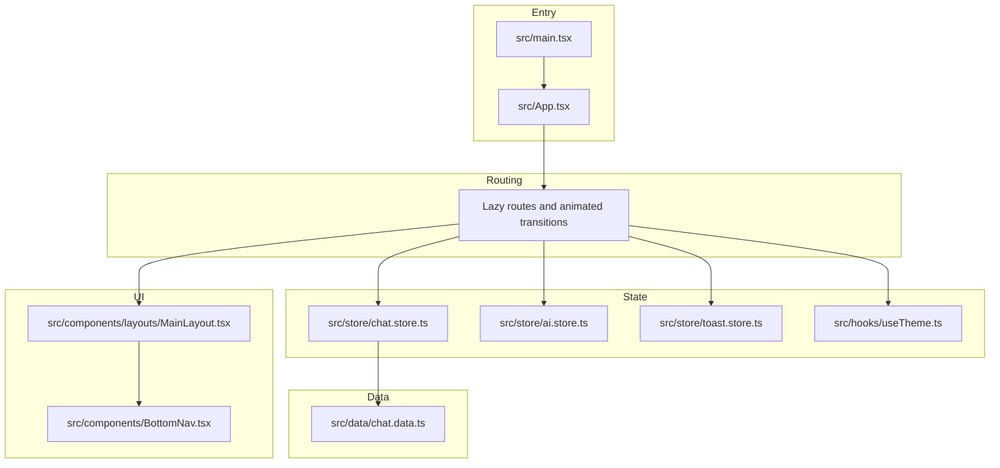
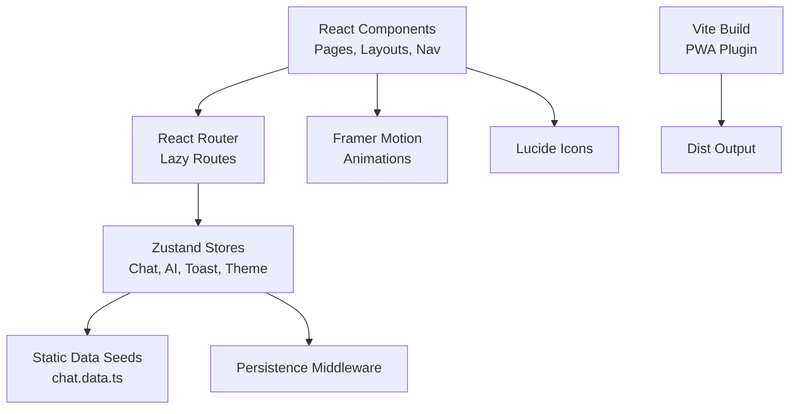
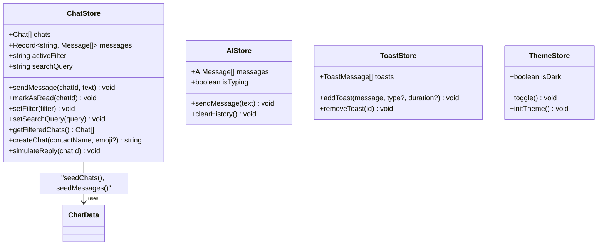
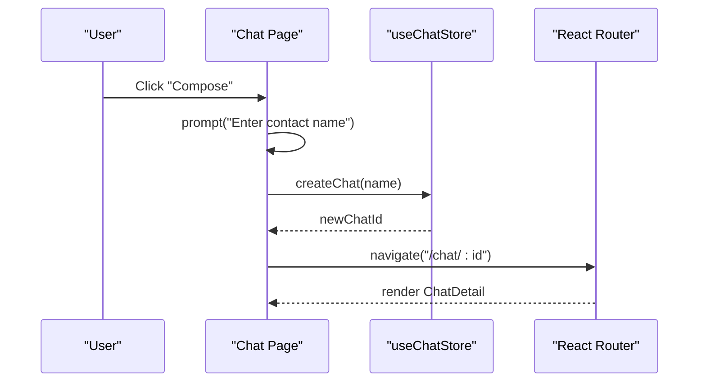
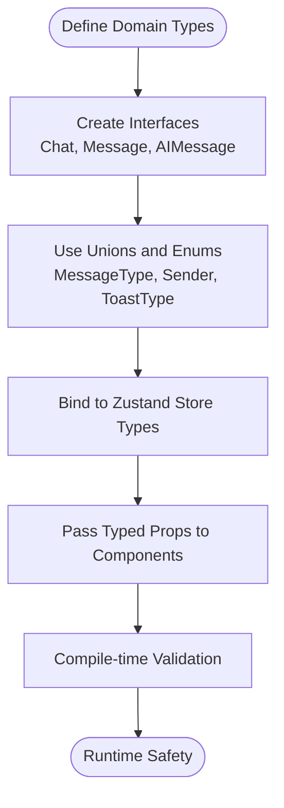
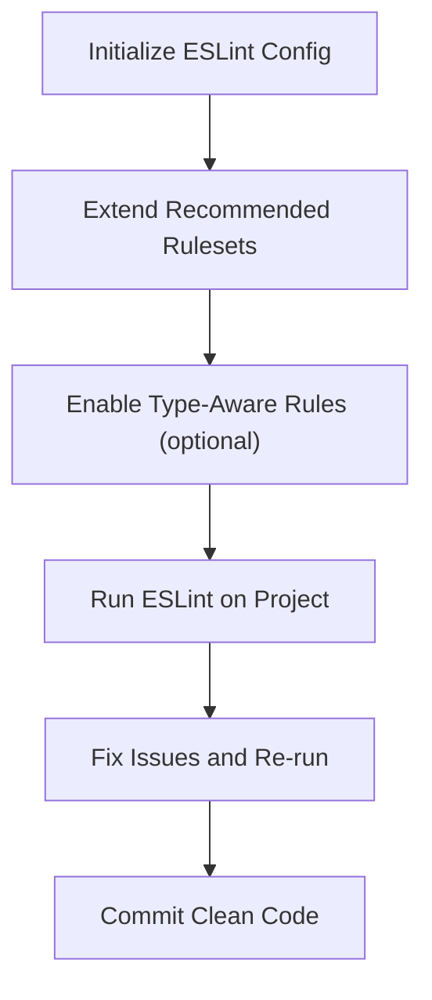
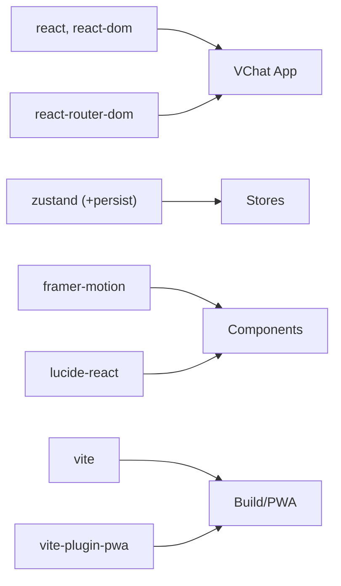

# Developer Guidelines

<cite>
**Referenced Files in This Document**
- [README.md](file://README.md)
- [package.json](file://package.json)
- [eslint.config.js](file://eslint.config.js)
- [vite.config.ts](file://vite.config.ts)
- [tsconfig.json](file://tsconfig.json)
- [src/main.tsx](file://src/main.tsx)
- [src/App.tsx](file://src/App.tsx)
- [src/store/chat.store.ts](file://src/store/chat.store.ts)
- [src/store/ai.store.ts](file://src/store/ai.store.ts)
- [src/store/toast.store.ts](file://src/store/toast.store.ts)
- [src/hooks/useTheme.ts](file://src/hooks/useTheme.ts)
- [src/components/layouts/MainLayout.tsx](file://src/components/layouts/MainLayout.tsx)
- [src/components/BottomNav.tsx](file://src/components/BottomNav.tsx)
- [src/pages/Chat.tsx](file://src/pages/Chat.tsx)
- [src/data/chat.data.ts](file://src/data/chat.data.ts)
</cite>

## Table of Contents
1. [Introduction](#introduction)
2. [Project Structure](#project-structure)
3. [Core Components](#core-components)
4. [Architecture Overview](#architecture-overview)
5. [Detailed Component Analysis](#detailed-component-analysis)
6. [Dependency Analysis](#dependency-analysis)
7. [Performance Considerations](#performance-considerations)
8. [Troubleshooting Guide](#troubleshooting-guide)
9. [Contribution Workflow and Testing](#contribution-workflow-and-testing)
10. [Appendices](#appendices)

## Introduction
This document provides comprehensive developer guidelines for contributing to VChat. It covers code organization principles, state management patterns using Zustand, React development best practices, TypeScript usage, ESLint configuration, component development guidelines, debugging techniques, and contribution workflow. The goal is to ensure consistent, maintainable, and scalable development across the codebase.

## Project Structure
VChat follows a feature-based and layer-based organization:
- Feature-based: Pages and components are grouped by feature areas (e.g., pages/ai, pages/hub, pages/features).
- Layer-based: Shared concerns like stores, hooks, and layouts are separated into dedicated folders.
- Routing: Lazy-loaded routes are defined centrally in the application shell to optimize bundle size and improve perceived performance.
- State: Application state is managed via Zustand stores, with persistence for selected slices.

**Diagram sources**
- [src/main.tsx:1-11](file://src/main.tsx#L1-L11)
- [src/App.tsx:1-156](file://src/App.tsx#L1-L156)
- [src/components/layouts/MainLayout.tsx:1-30](file://src/components/layouts/MainLayout.tsx#L1-L30)
- [src/components/BottomNav.tsx:1-62](file://src/components/BottomNav.tsx#L1-L62)
- [src/store/chat.store.ts:1-349](file://src/store/chat.store.ts#L1-L349)
- [src/store/ai.store.ts:1-162](file://src/store/ai.store.ts#L1-L162)
- [src/store/toast.store.ts:1-39](file://src/store/toast.store.ts#L1-L39)
- [src/hooks/useTheme.ts:1-37](file://src/hooks/useTheme.ts#L1-L37)
- [src/data/chat.data.ts:1-134](file://src/data/chat.data.ts#L1-L134)

**Section sources**
- [src/main.tsx:1-11](file://src/main.tsx#L1-L11)
- [src/App.tsx:1-156](file://src/App.tsx#L1-L156)

## Core Components
- Application shell and routing: Centralized lazy loading and animated route transitions.
- Layouts: MainLayout provides a sticky header, outlet for page content, and a persistent bottom navigation.
- Navigation: BottomNav adapts context-aware tabs depending on the current route.
- Stores: Zustand stores encapsulate domain logic and state for chat, AI assistant, toasts, and theme.
- Data seeding: Static data files provide realistic seeds for chats and related metadata.

Key responsibilities:
- src/main.tsx: Bootstraps the app and renders the root element.
- src/App.tsx: Defines routes, animations, and integrates layout wrappers.
- src/components/layouts/MainLayout.tsx: Provides the base layout with status bar, outlet, and bottom navigation.
- src/components/BottomNav.tsx: Implements context-aware navigation with badges and gestures.
- src/store/chat.store.ts: Manages chat lists, messages, filters, search, and simulated replies.
- src/store/ai.store.ts: Manages AI conversation history and simulated responses.
- src/store/toast.store.ts: Global toast notifications with auto-dismiss.
- src/hooks/useTheme.ts: Theme toggling and initialization persisted in storage.
- src/data/chat.data.ts: Static seeds for context groups, direct messages, and spaces.

**Section sources**
- [src/main.tsx:1-11](file://src/main.tsx#L1-L11)
- [src/App.tsx:1-156](file://src/App.tsx#L1-L156)
- [src/components/layouts/MainLayout.tsx:1-30](file://src/components/layouts/MainLayout.tsx#L1-L30)
- [src/components/BottomNav.tsx:1-62](file://src/components/BottomNav.tsx#L1-L62)
- [src/store/chat.store.ts:1-349](file://src/store/chat.store.ts#L1-L349)
- [src/store/ai.store.ts:1-162](file://src/store/ai.store.ts#L1-L162)
- [src/store/toast.store.ts:1-39](file://src/store/toast.store.ts#L1-L39)
- [src/hooks/useTheme.ts:1-37](file://src/hooks/useTheme.ts#L1-L37)
- [src/data/chat.data.ts:1-134](file://src/data/chat.data.ts#L1-L134)

## Architecture Overview
VChat uses a layered architecture:
- Presentation layer: React components and pages.
- Routing layer: React Router with lazy loading and animated transitions.
- State layer: Zustand stores with optional persistence.
- Data layer: Static data files for seeding and realistic content.
- Infrastructure: Vite for build tooling, PWA plugin for offline caching, Tailwind CSS for styling.

**Diagram sources**
- [src/App.tsx:1-156](file://src/App.tsx#L1-L156)
- [src/store/chat.store.ts:1-349](file://src/store/chat.store.ts#L1-L349)
- [src/store/ai.store.ts:1-162](file://src/store/ai.store.ts#L1-L162)
- [src/store/toast.store.ts:1-39](file://src/store/toast.store.ts#L1-L39)
- [src/hooks/useTheme.ts:1-37](file://src/hooks/useTheme.ts#L1-L37)
- [src/data/chat.data.ts:1-134](file://src/data/chat.data.ts#L1-L134)
- [vite.config.ts:1-57](file://vite.config.ts#L1-L57)

## Detailed Component Analysis

### Zustand Store Patterns
VChat employs Zustand for state management with the following patterns:
- Store composition: Separate stores per domain (chat, AI, toast, theme).
- Action creators: Pure functions that compute next state and update derived data.
- Selectors: Consumers select only the needed slice of state to minimize re-renders.
- Persistence: Optional middleware to persist selected slices across sessions.

**Diagram sources**
- [src/store/chat.store.ts:1-349](file://src/store/chat.store.ts#L1-L349)
- [src/store/ai.store.ts:1-162](file://src/store/ai.store.ts#L1-L162)
- [src/store/toast.store.ts:1-39](file://src/store/toast.store.ts#L1-L39)
- [src/hooks/useTheme.ts:1-37](file://src/hooks/useTheme.ts#L1-L37)
- [src/data/chat.data.ts:1-134](file://src/data/chat.data.ts#L1-L134)

Implementation highlights:
- Chat store actions update messages and derived chat metadata (last message, time, unread counts).
- AI store simulates typing and response delays to mimic real conversations.
- Toast store manages transient notifications with automatic cleanup.
- Theme store persists and toggles UI theme at the document element level.

**Section sources**
- [src/store/chat.store.ts:1-349](file://src/store/chat.store.ts#L1-L349)
- [src/store/ai.store.ts:1-162](file://src/store/ai.store.ts#L1-L162)
- [src/store/toast.store.ts:1-39](file://src/store/toast.store.ts#L1-L39)
- [src/hooks/useTheme.ts:1-37](file://src/hooks/useTheme.ts#L1-L37)

### React Development Best Practices
- Component composition: Use layout wrappers and outlets to separate concerns (status bar, bottom nav, page content).
- Prop drilling alternatives: Prefer Zustand stores for cross-cutting state; pass only minimal props to child components.
- Performance optimization:
  - Lazy-load routes to reduce initial bundle size.
  - Use Framer Motion for lightweight animations.
  - Memoize expensive computations and avoid unnecessary re-renders by selecting minimal state.
- Accessibility: Ensure focus management, semantic markup, and keyboard navigation where applicable.

**Diagram sources**
- [src/pages/Chat.tsx:65-92](file://src/pages/Chat.tsx#L65-L92)
- [src/store/chat.store.ts:268-286](file://src/store/chat.store.ts#L268-L286)
- [src/App.tsx:75-78](file://src/App.tsx#L75-L78)

**Section sources**
- [src/components/layouts/MainLayout.tsx:1-30](file://src/components/layouts/MainLayout.tsx#L1-L30)
- [src/components/BottomNav.tsx:1-62](file://src/components/BottomNav.tsx#L1-L62)
- [src/pages/Chat.tsx:65-92](file://src/pages/Chat.tsx#L65-L92)

### TypeScript Usage Patterns
- Interface definitions: Strongly typed stores and data models (e.g., Chat, Message, AIMessage).
- Type safety: Use enums and unions for constrained values (MessageType, Sender, ToastType).
- Generic components: Favor explicit props and interfaces over generics when readability is preferred.
- Configurations: Multi-project TS configs for app and node contexts.

**Diagram sources**
- [src/store/chat.store.ts:6-43](file://src/store/chat.store.ts#L6-L43)
- [src/store/ai.store.ts:4-9](file://src/store/ai.store.ts#L4-L9)
- [src/store/toast.store.ts:3-9](file://src/store/toast.store.ts#L3-L9)
- [tsconfig.json:1-8](file://tsconfig.json#L1-L8)

**Section sources**
- [src/store/chat.store.ts:6-43](file://src/store/chat.store.ts#L6-L43)
- [src/store/ai.store.ts:4-9](file://src/store/ai.store.ts#L4-L9)
- [src/store/toast.store.ts:3-9](file://src/store/toast.store.ts#L3-L9)
- [tsconfig.json:1-8](file://tsconfig.json#L1-L8)

### ESLint Configuration and Code Quality
- Recommended rules: Base JS recommended, TypeScript recommended, React Hooks recommended, and React Refresh for Vite.
- Type-aware linting: The project README demonstrates enabling type-checked configurations for stricter rules and stylistic checks.
- Plugin ecosystem: React Hooks, React Refresh, and TypeScript ESLint are configured.

**Diagram sources**
- [eslint.config.js:1-24](file://eslint.config.js#L1-L24)
- [README.md:14-73](file://README.md#L14-L73)

**Section sources**
- [eslint.config.js:1-24](file://eslint.config.js#L1-L24)
- [README.md:14-73](file://README.md#L14-L73)

### Component Development Guidelines
- Prop interfaces: Define clear, minimal interfaces for props to ensure type safety and self-documenting components.
- Event handling: Use inline handlers for simple actions; extract to stable callbacks when needed for performance.
- Accessibility: Ensure interactive elements are keyboard accessible and provide meaningful labels.
- Styling: Use CSS variables and Tailwind utilities consistently; avoid ad-hoc inline styles.

Examples to emulate:
- BottomNav defines a tab array with icon components and dynamic paths.
- Chat page composes search, filters, and list rendering with minimal prop drilling.

**Section sources**
- [src/components/BottomNav.tsx:1-62](file://src/components/BottomNav.tsx#L1-L62)
- [src/pages/Chat.tsx:65-92](file://src/pages/Chat.tsx#L65-L92)

### Extending Existing Features and Adding New Components
- Follow the existing folder structure: add pages under pages/, components under components/, and stores under store/.
- For new features:
  - Create a new page component and add a lazy route in the central router.
  - Introduce a new Zustand store if domain state is substantial.
  - Add data seeds under src/data/ if needed.
- Maintain consistency:
  - Use Lucide icons for UI affordances.
  - Keep animations light and purposeful with Framer Motion.
  - Persist critical user preferences via Zustand middleware.

**Section sources**
- [src/App.tsx:12-50](file://src/App.tsx#L12-L50)
- [src/store/chat.store.ts:102-169](file://src/store/chat.store.ts#L102-L169)
- [src/data/chat.data.ts:1-134](file://src/data/chat.data.ts#L1-L134)

## Dependency Analysis
External dependencies and their roles:
- React and React Router: Core UI and routing.
- Zustand: Lightweight state management with middleware support.
- Framer Motion: Performant animations.
- Lucide React: Iconography.
- Vite and PWA plugin: Build tooling and service worker generation.

**Diagram sources**
- [package.json:12-19](file://package.json#L12-L19)
- [package.json:20-37](file://package.json#L20-L37)
- [vite.config.ts:1-57](file://vite.config.ts#L1-L57)

**Section sources**
- [package.json:12-19](file://package.json#L12-L19)
- [package.json:20-37](file://package.json#L20-L37)
- [vite.config.ts:1-57](file://vite.config.ts#L1-L57)

## Performance Considerations
- Lazy loading: Routes are lazy-imported to reduce initial payload.
- Animations: Use Framer Motion sparingly and prefer transform-based animations for GPU acceleration.
- State granularity: Select minimal state slices in components to avoid unnecessary re-renders.
- Persistence: Persist only essential state to localStorage to balance UX and performance.
- Build optimization: Leverage Vite’s fast refresh and PWA caching for improved load times.

[No sources needed since this section provides general guidance]

## Troubleshooting Guide
Common development issues and resolutions:
- ESLint errors: Run the linter and apply suggested fixes; enable type-aware rules for stricter checks as shown in the README.
- Build failures: Ensure TypeScript configs are correctly referenced and Vite config is valid.
- PWA caching: Verify manifest and runtime caching settings in the Vite PWA plugin configuration.
- Theme not applying: Confirm theme store persistence and document class toggling logic.
- Toast not dismissing: Check timeout logic and ensure unique IDs are generated.

**Section sources**
- [eslint.config.js:1-24](file://eslint.config.js#L1-L24)
- [README.md:14-73](file://README.md#L14-L73)
- [vite.config.ts:9-54](file://vite.config.ts#L9-L54)
- [src/hooks/useTheme.ts:10-36](file://src/hooks/useTheme.ts#L10-L36)
- [src/store/toast.store.ts:17-38](file://src/store/toast.store.ts#L17-L38)

## Contribution Workflow and Testing
- Branching: Create feature branches from main; keep commits focused and descriptive.
- Linting: Run the linter locally before committing; fix all reported issues.
- Building: Verify builds succeed locally and in CI environments.
- Testing: Add unit tests for complex logic (e.g., store selectors, helpers) and manual smoke tests for UI flows.
- Code review: Submit pull requests with clear descriptions; address feedback promptly.
- Documentation: Update relevant docs when introducing new stores, pages, or components.

[No sources needed since this section summarizes process without analyzing specific files]

## Appendices

### File Naming Conventions
- Pages: PascalCase.tsx (e.g., Chat.tsx, Hub.tsx).
- Components: PascalCase.tsx (e.g., BottomNav.tsx, MainLayout.tsx).
- Stores: kebab-case.store.ts (e.g., chat.store.ts, ai.store.ts).
- Data seeds: kebab-case.data.ts (e.g., chat.data.ts, ai.data.ts).
- Hooks: usePascalCase.ts (e.g., useTheme.ts).

**Section sources**
- [src/pages/Chat.tsx:1-245](file://src/pages/Chat.tsx#L1-L245)
- [src/components/BottomNav.tsx:1-62](file://src/components/BottomNav.tsx#L1-L62)
- [src/store/chat.store.ts:1-349](file://src/store/chat.store.ts#L1-L349)
- [src/store/ai.store.ts:1-162](file://src/store/ai.store.ts#L1-L162)
- [src/data/chat.data.ts:1-134](file://src/data/chat.data.ts#L1-L134)
- [src/hooks/useTheme.ts:1-37](file://src/hooks/useTheme.ts#L1-L37)

### ESLint and TypeScript Settings
- ESLint: Recommended base rules plus React Hooks and React Refresh for Vite.
- TypeScript: Multi-project configs for app and node contexts; enable type-aware linting for stricter checks.

**Section sources**
- [eslint.config.js:1-24](file://eslint.config.js#L1-L24)
- [tsconfig.json:1-8](file://tsconfig.json#L1-L8)
- [README.md:14-73](file://README.md#L14-L73)