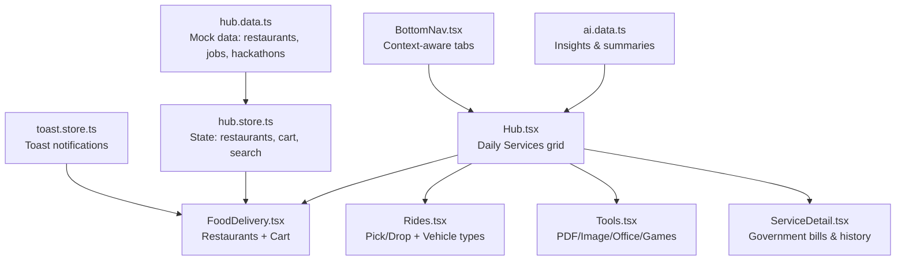
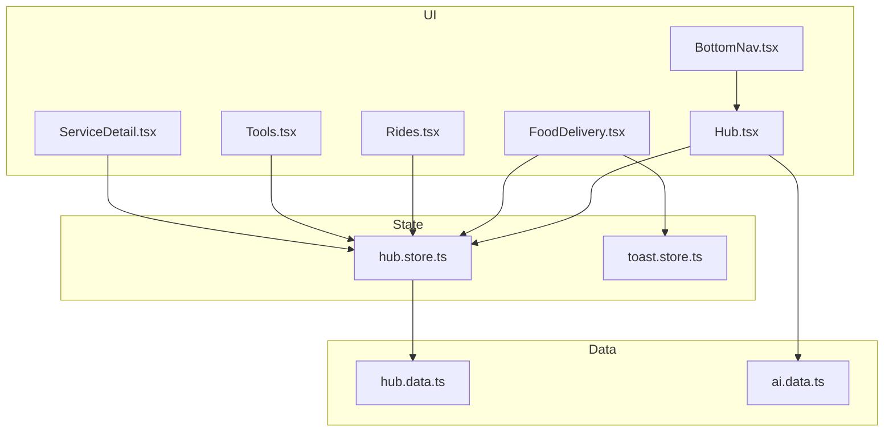
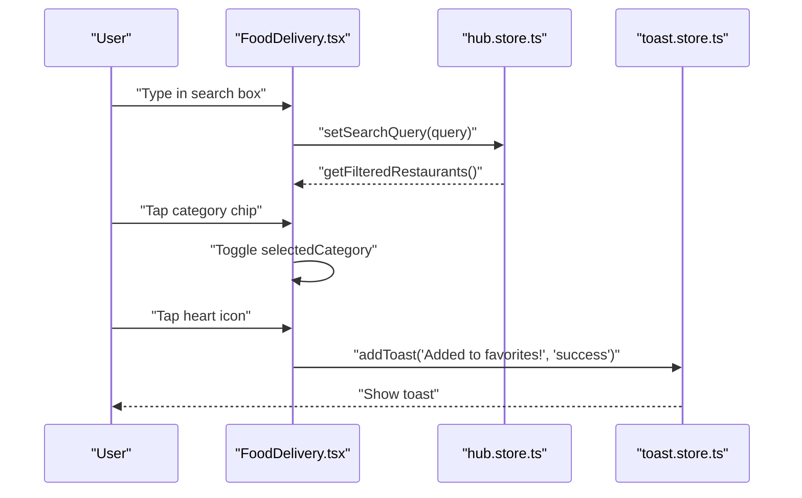
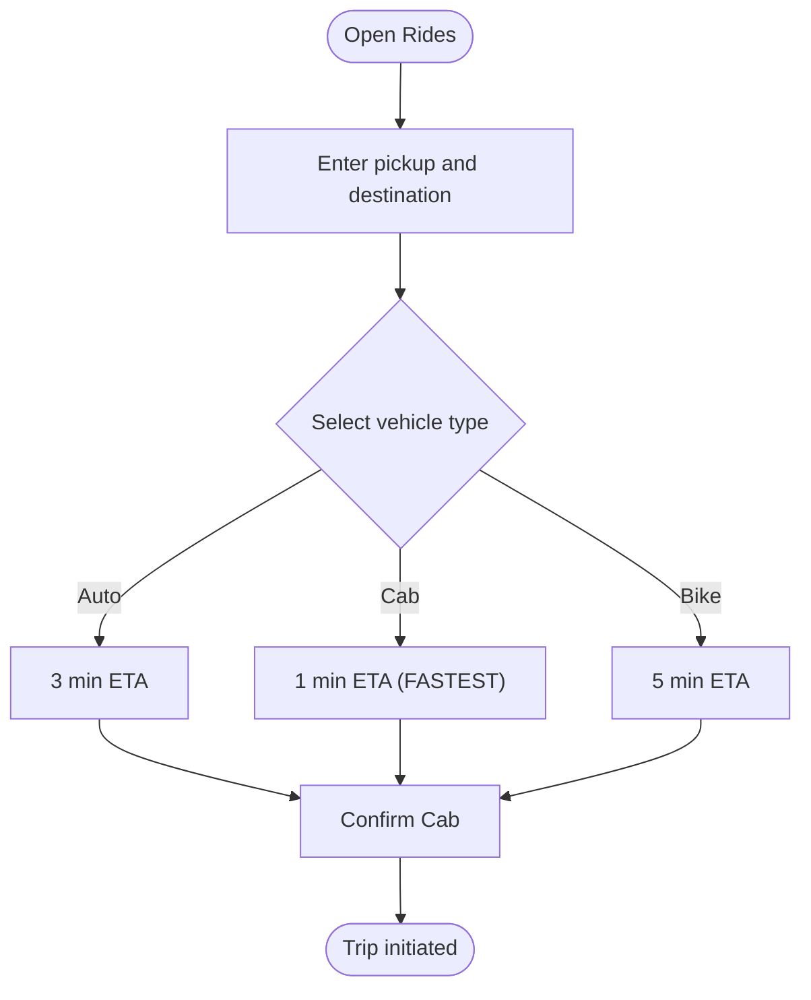
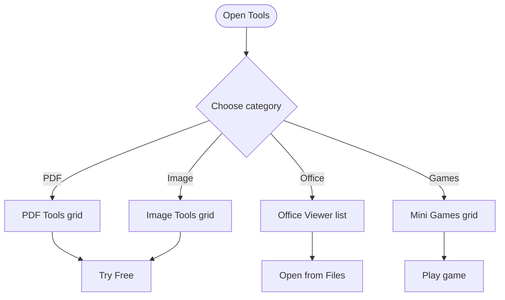
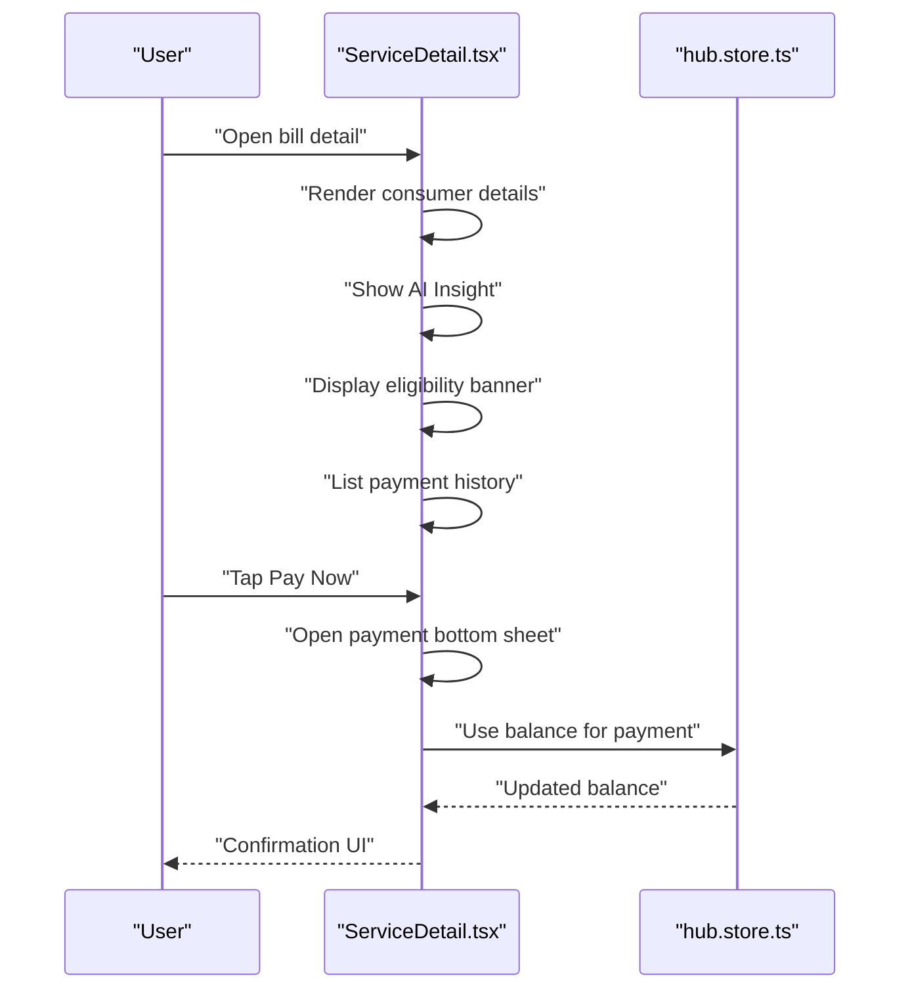
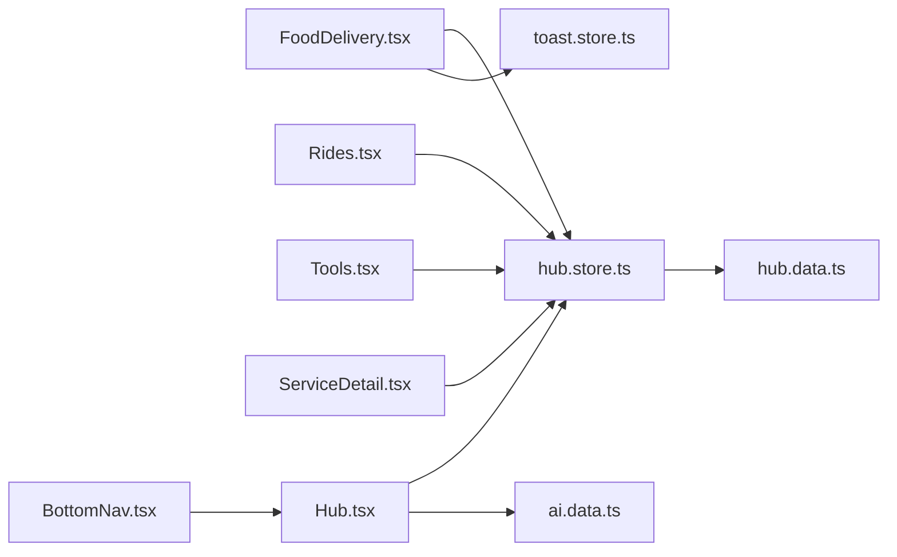

# Daily Utilities

<cite>
**Referenced Files in This Document**
- [Hub.tsx](file://src/pages/Hub.tsx)
- [FoodDelivery.tsx](file://src/pages/hub/FoodDelivery.tsx)
- [Rides.tsx](file://src/pages/hub/Rides.tsx)
- [Tools.tsx](file://src/pages/hub/Tools.tsx)
- [ServiceDetail.tsx](file://src/pages/hub/ServiceDetail.tsx)
- [hub.store.ts](file://src/store/hub.store.ts)
- [toast.store.ts](file://src/store/toast.store.ts)
- [hub.data.ts](file://src/data/hub.data.ts)
- [ai.data.ts](file://src/data/ai.data.ts)
- [BottomNav.tsx](file://src/components/BottomNav.tsx)
</cite>

## Table of Contents
1. [Introduction](#introduction)
2. [Project Structure](#project-structure)
3. [Core Components](#core-components)
4. [Architecture Overview](#architecture-overview)
5. [Detailed Component Analysis](#detailed-component-analysis)
6. [Dependency Analysis](#dependency-analysis)
7. [Performance Considerations](#performance-considerations)
8. [Troubleshooting Guide](#troubleshooting-guide)
9. [Conclusion](#conclusion)
10. [Appendices](#appendices)

## Introduction
This document describes VChat’s Daily Utilities services, focusing on three primary capabilities:
- Food delivery: restaurant discovery, menu browsing, cart management, and order placement
- Ride booking: location input, vehicle type selection, estimated fares, and trip initiation
- Tools marketplace: categorized productivity and media tools

It explains how the UI components integrate with the application state, how search and filters operate, and how the system surfaces utility services from the Hub. It also outlines patterns for integrating external providers, real-time status updates, and user experience considerations such as availability detection and alternative recommendations.

## Project Structure
The Daily Utilities live under the Hub module. The Hub page organizes quick-access tiles for Food, Shop, Rides, Travel, Jobs, Hackathons, Tools, and more. Dedicated pages implement the functional flows for each utility.

**Diagram sources**
- [Hub.tsx:12–164:12-164](file://src/pages/Hub.tsx#L12-L164)
- [FoodDelivery.tsx:8–127:8-127](file://src/pages/hub/FoodDelivery.tsx#L8-L127)
- [Rides.tsx:6–74:6-74](file://src/pages/hub/Rides.tsx#L6-L74)
- [Tools.tsx:6–115:6-115](file://src/pages/hub/Tools.tsx#L6-L115)
- [ServiceDetail.tsx:6–152:6-152](file://src/pages/hub/ServiceDetail.tsx#L6-L152)
- [hub.store.ts:118–271:118-271](file://src/store/hub.store.ts#L118-L271)
- [toast.store.ts:17–39:17-39](file://src/store/toast.store.ts#L17-L39)
- [hub.data.ts:62–118:62-118](file://src/data/hub.data.ts#L62-L118)
- [ai.data.ts:1–102:1-102](file://src/data/ai.data.ts#L1-L102)
- [BottomNav.tsx:5–62:5-62](file://src/components/BottomNav.tsx#L5-L62)

**Section sources**
- [Hub.tsx:12–164:12-164](file://src/pages/Hub.tsx#L12-L164)
- [BottomNav.tsx:5–62:5-62](file://src/components/BottomNav.tsx#L5-L62)

## Core Components
- Hub page: Presents tiles for Daily Services (Food, Shop, Rides, Travel) and governs global search and state selection.
- Food Delivery page: Displays restaurant cards, category filters, offers banner, and integrates cart actions.
- Rides page: Provides a simulated map view, pick/drop inputs, and vehicle type selection with estimated durations.
- Tools page: Organizes productivity tools into categories (PDF, Image, Office, Games).
- Government Services detail page: Handles bill payment, consumer info, eligibility checks, and payment history.
- State stores:
  - hub.store.ts: Manages restaurants, cart, search queries, and filtered lists.
  - toast.store.ts: Global toast notifications for user feedback.
  - hub.data.ts: Mock datasets for restaurants, jobs, hackathons, and financial transactions.
  - ai.data.ts: Insights and summaries used in the broader Hub context.

**Section sources**
- [Hub.tsx:12–164:12-164](file://src/pages/Hub.tsx#L12-L164)
- [FoodDelivery.tsx:8–127:8-127](file://src/pages/hub/FoodDelivery.tsx#L8-L127)
- [Rides.tsx:6–74:6-74](file://src/pages/hub/Rides.tsx#L6-L74)
- [Tools.tsx:6–115:6-115](file://src/pages/hub/Tools.tsx#L6-L115)
- [ServiceDetail.tsx:6–152:6-152](file://src/pages/hub/ServiceDetail.tsx#L6-L152)
- [hub.store.ts:118–271:118-271](file://src/store/hub.store.ts#L118-L271)
- [toast.store.ts:17–39:17-39](file://src/store/toast.store.ts#L17-L39)
- [hub.data.ts:62–118:62-118](file://src/data/hub.data.ts#L62-L118)
- [ai.data.ts:1–102:1-102](file://src/data/ai.data.ts#L1-L102)

## Architecture Overview
The Daily Utilities follow a unidirectional data flow:
- UI components read from Zustand stores.
- Stores expose selectors and actions to update state.
- Mock data provides initial content; future integrations would replace mock data with API calls.
- Bottom navigation adapts context depending on whether the user is in Hub mode.

**Diagram sources**
- [Hub.tsx:7–300:7-300](file://src/pages/Hub.tsx#L7-L300)
- [FoodDelivery.tsx:8–127:8-127](file://src/pages/hub/FoodDelivery.tsx#L8-L127)
- [Rides.tsx:6–74:6-74](file://src/pages/hub/Rides.tsx#L6-L74)
- [Tools.tsx:6–115:6-115](file://src/pages/hub/Tools.tsx#L6-L115)
- [ServiceDetail.tsx:6–152:6-152](file://src/pages/hub/ServiceDetail.tsx#L6-L152)
- [hub.store.ts:118–271:118-271](file://src/store/hub.store.ts#L118-L271)
- [toast.store.ts:17–39:17-39](file://src/store/toast.store.ts#L17-L39)
- [hub.data.ts:62–118:62-118](file://src/data/hub.data.ts#L62-L118)
- [ai.data.ts:1–102:1-102](file://src/data/ai.data.ts#L1-L102)
- [BottomNav.tsx:5–62:5-62](file://src/components/BottomNav.tsx#L5-L62)

## Detailed Component Analysis

### Food Delivery Interface
The Food Delivery page provides:
- Location header indicating current area
- Global search bar bound to the shared search query
- Category chips to filter restaurants by cuisine/tags
- Offers banner highlighting promotions
- Restaurant list with ratings, delivery time, fees, and badges
- Favorite action with toast feedback

Processing logic:
- The page reads the current search query from the shared store and applies it to filter restaurants.
- Category selection toggles a local state to refine the list further.
- Tapping a restaurant triggers a toast notification for “Add to favorites.”

**Diagram sources**
- [FoodDelivery.tsx:33–40:33-40](file://src/pages/hub/FoodDelivery.tsx#L33-L40)
- [FoodDelivery.tsx:46–60:46-60](file://src/pages/hub/FoodDelivery.tsx#L46-L60)
- [FoodDelivery.tsx:75–122:75-122](file://src/pages/hub/FoodDelivery.tsx#L75-L122)
- [FoodDelivery.tsx:88–92:88-92](file://src/pages/hub/FoodDelivery.tsx#L88-L92)
- [hub.store.ts:228–241:228-241](file://src/store/hub.store.ts#L228-L241)
- [toast.store.ts:19–31:19-31](file://src/store/toast.store.ts#L19-L31)

**Section sources**
- [FoodDelivery.tsx:8–127:8-127](file://src/pages/hub/FoodDelivery.tsx#L8-L127)
- [hub.store.ts:228–241:228-241](file://src/store/hub.store.ts#L228-L241)
- [toast.store.ts:17–39:17-39](file://src/store/toast.store.ts#L17-L39)
- [hub.data.ts:62–118:62-118](file://src/data/hub.data.ts#L62-L118)

### Ride Booking System
The Rides page simulates:
- A map background with grid lines
- Pick-up and destination inputs
- Vehicle type selection (Auto, Cab, Bike) with estimated durations
- A prominent “Confirm” action

Processing logic:
- The page renders static inputs and vehicle cards.
- On selection, the UI indicates the fastest option with a visual highlight.
- The confirm action initiates the booking process.

**Diagram sources**
- [Rides.tsx:21–70:21-70](file://src/pages/hub/Rides.tsx#L21-L70)

**Section sources**
- [Rides.tsx:6–74:6-74](file://src/pages/hub/Rides.tsx#L6-L74)

### Tools Marketplace Interface
The Tools page organizes utility tools into categories:
- PDF Tools: Merge, Split, Compress, Convert
- Image Tools: Resize, Compress, Convert, Remove BG
- Office Viewer: Recent documents preview
- Mini Games: 2048, Snake, Quiz, Aim

Processing logic:
- Renders grids of tool cards with icons, names, and short descriptions.
- Provides “Try Free” buttons per tool.

**Diagram sources**
- [Tools.tsx:26–115:26-115](file://src/pages/hub/Tools.tsx#L26-L115)

**Section sources**
- [Tools.tsx:6–115:6-115](file://src/pages/hub/Tools.tsx#L6-L115)

### Government Services Integration
The ServiceDetail page demonstrates:
- Consumer details card
- Current bill summary with due date and status
- AI Insight panel with actionable suggestions
- Eligibility banner for subsidies
- Payment history list
- Bottom sheet for confirming payments

Processing logic:
- The page conditionally sets the title based on route params.
- Clicking “Pay Now” opens a bottom sheet with payment confirmation.
- The UI displays historical payments and eligibility checks.

**Diagram sources**
- [ServiceDetail.tsx:31–116:31-116](file://src/pages/hub/ServiceDetail.tsx#L31-L116)
- [hub.store.ts:145–167:145-167](file://src/store/hub.store.ts#L145-L167)

**Section sources**
- [ServiceDetail.tsx:6–152:6-152](file://src/pages/hub/ServiceDetail.tsx#L6-L152)
- [hub.store.ts:118–271:118-271](file://src/store/hub.store.ts#L118-L271)

## Dependency Analysis
- UI components depend on:
  - hub.store.ts for restaurants, cart, search, and filtered lists
  - toast.store.ts for user feedback
  - hub.data.ts for initial mock data
  - ai.data.ts for contextual insights surfaced in the Hub
- Navigation adapts based on context via BottomNav.tsx.

**Diagram sources**
- [FoodDelivery.tsx:5–11:5-11](file://src/pages/hub/FoodDelivery.tsx#L5-L11)
- [Rides.tsx:1–5:1-5](file://src/pages/hub/Rides.tsx#L1-L5)
- [Tools.tsx:1–5:1-5](file://src/pages/hub/Tools.tsx#L1-L5)
- [ServiceDetail.tsx:1–5:1-5](file://src/pages/hub/ServiceDetail.tsx#L1-L5)
- [Hub.tsx:1–6:1-6](file://src/pages/Hub.tsx#L1-L6)
- [hub.store.ts:1–8:1-8](file://src/store/hub.store.ts#L1-L8)
- [toast.store.ts:1–3:1-3](file://src/store/toast.store.ts#L1-L3)
- [hub.data.ts:1–1:1-1](file://src/data/hub.data.ts#L1-L1)
- [ai.data.ts:1–1:1-1](file://src/data/ai.data.ts#L1-L1)
- [BottomNav.tsx:1–3:1-3](file://src/components/BottomNav.tsx#L1-L3)

**Section sources**
- [hub.store.ts:118–271:118-271](file://src/store/hub.store.ts#L118-L271)
- [toast.store.ts:17–39:17-39](file://src/store/toast.store.ts#L17-L39)
- [hub.data.ts:62–118:62-118](file://src/data/hub.data.ts#L62-L118)
- [ai.data.ts:1–102:1-102](file://src/data/ai.data.ts#L1-L102)
- [BottomNav.tsx:5–62:5-62](file://src/components/BottomNav.tsx#L5-L62)

## Performance Considerations
- Filtering and searching: The restaurant filter runs client-side on the current list. For larger datasets, consider virtualized lists and debounced search inputs.
- State persistence: The hub store persists selected state, balance, transactions, saved/applied jobs, and cart. Keep persisted slices minimal to reduce storage overhead.
- Rendering: Category chips and restaurant cards are lightweight; avoid unnecessary re-renders by memoizing derived data from the store.
- Toast lifecycle: Toasts auto-dismiss after a fixed duration; ensure the store does not accumulate stale entries.

[No sources needed since this section provides general guidance]

## Troubleshooting Guide
- Search not filtering restaurants:
  - Verify the search query setter and filtered restaurants selector are wired to the input and list rendering.
  - Check that the query is normalized to lowercase during filtering.
- Toast not appearing:
  - Confirm the toast store is imported and the addToast action is invoked with a message and optional type.
- Cart not updating:
  - Ensure addToCart is called with the correct restaurantId and item, and that the store’s cart state reflects the change.
- State picker not updating:
  - Confirm setSelectedState is called and the UI re-renders with the new state.

**Section sources**
- [hub.store.ts:141–143:141-143](file://src/store/hub.store.ts#L141-L143)
- [hub.store.ts:228–241:228-241](file://src/store/hub.store.ts#L228-L241)
- [toast.store.ts:19–31:19-31](file://src/store/toast.store.ts#L19-L31)
- [hub.store.ts:185–205:185-205](file://src/store/hub.store.ts#L185-L205)
- [Hub.tsx:282–285:282-285](file://src/pages/Hub.tsx#L282-L285)

## Conclusion
VChat’s Daily Utilities are structured around a cohesive Hub that exposes quick-access tiles and a shared state layer. The Food Delivery page leverages a robust filtering mechanism and cart actions, the Rides page simulates a booking flow, and the Tools page organizes productivity utilities. The ServiceDetail page demonstrates bill management and eligibility checks. The architecture supports straightforward integration with external providers by replacing mock data with API-backed stores and extending the UI to handle real-time updates.

[No sources needed since this section summarizes without analyzing specific files]

## Appendices

### API Communication Protocols and Integration Patterns
- Provider integration pattern:
  - Replace mock datasets with API endpoints for restaurants, rides, and tools.
  - Add loading and error states around async calls.
  - Normalize provider responses into the existing store interfaces (Restaurant, CartItem, etc.).
- Real-time status updates:
  - Use polling or push events to refresh order/trip status.
  - Update the store and re-render affected UI components.
- Availability detection and alternatives:
  - Surface “alternative” recommendations by augmenting filtered lists with nearby providers or promotions.
  - Highlight unavailable slots with alternate suggestions.

[No sources needed since this section provides general guidance]

### User Experience Considerations
- Consistent search behavior across utilities using the shared search query.
- Immediate feedback via toasts for actions like favoriting or adding items.
- Clear CTAs for payment and booking confirmations.
- Visual hierarchy for promotions and eligibility banners to drive engagement.

[No sources needed since this section provides general guidance]

### Adding New Utility Services
- Create a new page under the Hub module with a dedicated route.
- Wire it to the shared store for search and state.
- Integrate UI components for search, filters, listings, and booking/payment flows.
- Extend the Hub grid to surface the new tile.

[No sources needed since this section provides general guidance]