# Digital Services Hub

<cite>
**Referenced Files in This Document**
- [App.tsx](file://src/App.tsx)
- [MainLayout.tsx](file://src/components/layouts/MainLayout.tsx)
- [BottomNav.tsx](file://src/components/BottomNav.tsx)
- [StatusBar.tsx](file://src/components/StatusBar.tsx)
- [Hub.tsx](file://src/pages/Hub.tsx)
- [VchatPay.tsx](file://src/pages/hub/VchatPay.tsx)
- [PaySend.tsx](file://src/pages/hub/PaySend.tsx)
- [ServiceDetail.tsx](file://src/pages/hub/ServiceDetail.tsx)
- [FoodDelivery.tsx](file://src/pages/hub/FoodDelivery.tsx)
- [Rides.tsx](file://src/pages/hub/Rides.tsx)
- [Agriculture.tsx](file://src/pages/hub/Agriculture.tsx)
- [Jobs.tsx](file://src/pages/hub/Jobs.tsx)
- [Tools.tsx](file://src/pages/hub/Tools.tsx)
- [hub.data.ts](file://src/data/hub.data.ts)
- [package.json](file://package.json)
</cite>

## Table of Contents
1. [Introduction](#introduction)
2. [Project Structure](#project-structure)
3. [Core Components](#core-components)
4. [Architecture Overview](#architecture-overview)
5. [Detailed Component Analysis](#detailed-component-analysis)
6. [Dependency Analysis](#dependency-analysis)
7. [Performance Considerations](#performance-considerations)
8. [Security and Data Protection](#security-and-data-protection)
9. [Integration Patterns and External APIs](#integration-patterns-and-external-apis)
10. [Implementation Guidelines](#implementation-guidelines)
11. [Troubleshooting Guide](#troubleshooting-guide)
12. [Conclusion](#conclusion)

## Introduction
The Digital Services Hub is a unified platform within VChat that consolidates access to government services, financial transactions, and daily utilities. It provides a categorized, discoverable interface for users to manage bills, send money, order food, book rides, explore jobs, and access professional and personal tools. The system emphasizes intuitive navigation, state-aware UI flows, and a cohesive design language across services.

## Project Structure
The application is a React + TypeScript SPA using React Router for routing and Framer Motion for animations. The Hub page orchestrates service categories and routes to specialized service pages. Mock data is centralized to support UI development and prototyping.

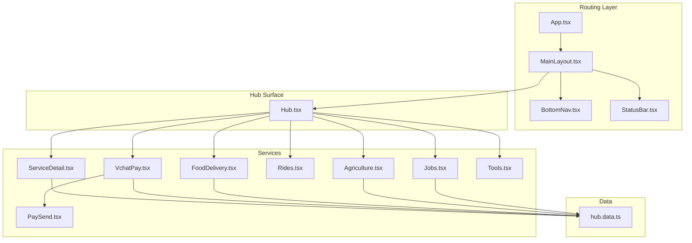

**Diagram sources**
- [App.tsx:66-133](file://src/App.tsx#L66-L133)
- [MainLayout.tsx:7-29](file://src/components/layouts/MainLayout.tsx#L7-L29)
- [BottomNav.tsx:5-61](file://src/components/BottomNav.tsx#L5-L61)
- [Hub.tsx:6-292](file://src/pages/Hub.tsx#L6-L292)
- [ServiceDetail.tsx:6-151](file://src/pages/hub/ServiceDetail.tsx#L6-L151)
- [VchatPay.tsx:7-118](file://src/pages/hub/VchatPay.tsx#L7-L118)
- [PaySend.tsx:7-144](file://src/pages/hub/PaySend.tsx#L7-L144)
- [FoodDelivery.tsx:7-92](file://src/pages/hub/FoodDelivery.tsx#L7-L92)
- [Rides.tsx:6-73](file://src/pages/hub/Rides.tsx#L6-L73)
- [Agriculture.tsx:7-130](file://src/pages/hub/Agriculture.tsx#L7-L130)
- [Jobs.tsx:7-93](file://src/pages/hub/Jobs.tsx#L7-L93)
- [Tools.tsx:6-114](file://src/pages/hub/Tools.tsx#L6-L114)
- [hub.data.ts:1-247](file://src/data/hub.data.ts#L1-L247)

**Section sources**
- [App.tsx:66-133](file://src/App.tsx#L66-L133)
- [MainLayout.tsx:7-29](file://src/components/layouts/MainLayout.tsx#L7-L29)
- [BottomNav.tsx:5-61](file://src/components/BottomNav.tsx#L5-L61)
- [Hub.tsx:6-292](file://src/pages/Hub.tsx#L6-L292)

## Core Components
- Hub surface: A categorized grid of services with animated transitions and state selection for government services.
- Financial hub: Vchat Pay dashboard with balance, quick actions, UPI QR, and recent transactions.
- Government services: Service detail page with consumer info, bill summary, AI insights, eligibility checks, and payment sheet.
- Daily utilities: Food delivery listings, ride booking UI, agriculture market intelligence, jobs board, and tools.
- Navigation: Bottom navigation adapts contextually when inside the Hub.

Key capabilities:
- Service discovery via category grids and search.
- State-aware UI (e.g., government service state picker).
- Animated transitions and micro-interactions for engagement.
- Mock-driven UI to simulate integrations during development.

**Section sources**
- [Hub.tsx:6-292](file://src/pages/Hub.tsx#L6-L292)
- [VchatPay.tsx:7-118](file://src/pages/hub/VchatPay.tsx#L7-L118)
- [ServiceDetail.tsx:6-151](file://src/pages/hub/ServiceDetail.tsx#L6-L151)
- [FoodDelivery.tsx:7-92](file://src/pages/hub/FoodDelivery.tsx#L7-L92)
- [Rides.tsx:6-73](file://src/pages/hub/Rides.tsx#L6-L73)
- [Agriculture.tsx:7-130](file://src/pages/hub/Agriculture.tsx#L7-L130)
- [Jobs.tsx:7-93](file://src/pages/hub/Jobs.tsx#L7-L93)
- [Tools.tsx:6-114](file://src/pages/hub/Tools.tsx#L6-L114)
- [BottomNav.tsx:5-61](file://src/components/BottomNav.tsx#L5-L61)

## Architecture Overview
The Hub follows a layered architecture:
- Routing layer: Declares routes and wraps pages with animated transitions.
- Layout layer: Provides shared UI scaffolding and persistent bottom navigation.
- Service layer: Specialized pages for each service category.
- Data layer: Centralized mock data for prototyping and UI testing.

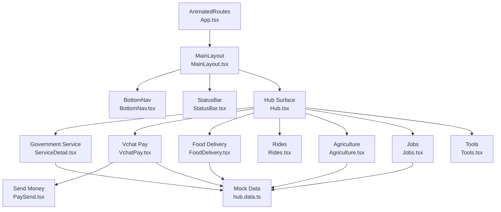

**Diagram sources**
- [App.tsx:66-133](file://src/App.tsx#L66-L133)
- [MainLayout.tsx:7-29](file://src/components/layouts/MainLayout.tsx#L7-L29)
- [BottomNav.tsx:5-61](file://src/components/BottomNav.tsx#L5-L61)
- [Hub.tsx:6-292](file://src/pages/Hub.tsx#L6-L292)
- [ServiceDetail.tsx:6-151](file://src/pages/hub/ServiceDetail.tsx#L6-L151)
- [VchatPay.tsx:7-118](file://src/pages/hub/VchatPay.tsx#L7-L118)
- [PaySend.tsx:7-144](file://src/pages/hub/PaySend.tsx#L7-L144)
- [FoodDelivery.tsx:7-92](file://src/pages/hub/FoodDelivery.tsx#L7-L92)
- [Rides.tsx:6-73](file://src/pages/hub/Rides.tsx#L6-L73)
- [Agriculture.tsx:7-130](file://src/pages/hub/Agriculture.tsx#L7-L130)
- [Jobs.tsx:7-93](file://src/pages/hub/Jobs.tsx#L7-L93)
- [Tools.tsx:6-114](file://src/pages/hub/Tools.tsx#L6-L114)
- [hub.data.ts:1-247](file://src/data/hub.data.ts#L1-L247)

## Detailed Component Analysis

### Hub Surface and Service Discovery
The Hub presents services in themed categories:
- Government Services: Electricity, Water, Certificates, RTA, Aadhaar, Income Tax, Passport, Rythu Bandhu.
- Daily Services: Food, Shop, Rides, Travel.
- Professional: Jobs, Hackathons, Events, Network.
- Tools: PDF Tools, Images, Office, Games.
- Health & More: Health Vault, For Farmers.

It includes:
- Global search bar.
- State picker bottom sheet for selecting jurisdiction (e.g., Telangana).
- Animated cards with tap feedback and directional icons.

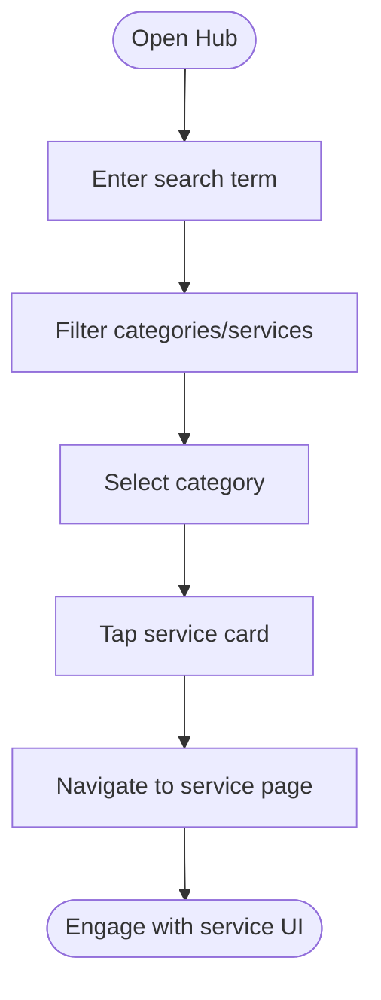

**Section sources**
- [Hub.tsx:6-292](file://src/pages/Hub.tsx#L6-L292)

### Vchat Pay System
The Vchat Pay dashboard centralizes financial controls:
- Balance summary and UPI ID.
- Quick action buttons: Send, Receive, Recharge, Bills.
- UPI QR generation and share option.
- Recent transactions list backed by mock data.

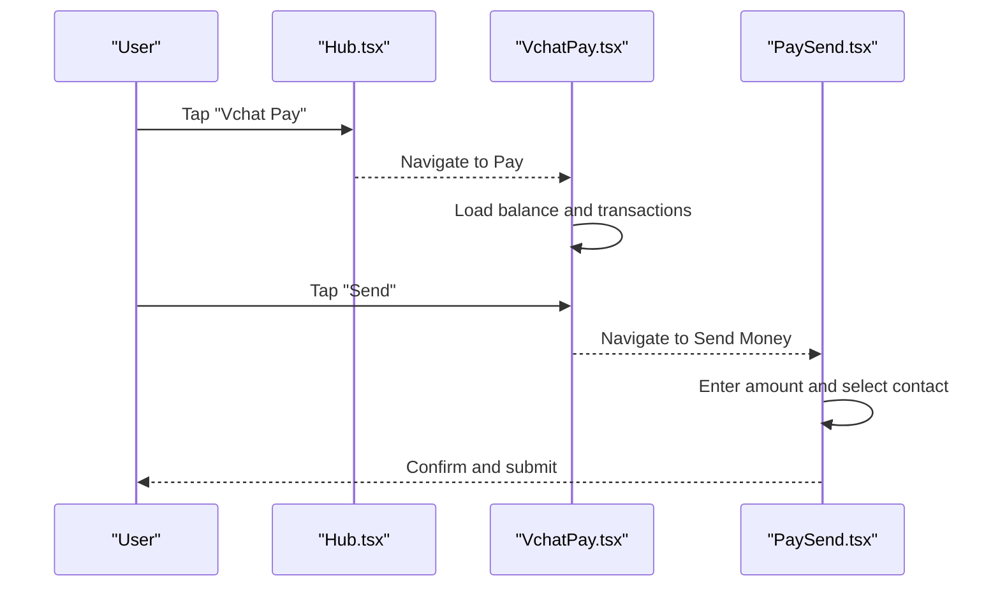

**Diagram sources**
- [Hub.tsx:31-75](file://src/pages/Hub.tsx#L31-L75)
- [VchatPay.tsx:7-118](file://src/pages/hub/VchatPay.tsx#L7-L118)
- [PaySend.tsx:7-144](file://src/pages/hub/PaySend.tsx#L7-L144)

**Section sources**
- [VchatPay.tsx:7-118](file://src/pages/hub/VchatPay.tsx#L7-L118)
- [PaySend.tsx:7-144](file://src/pages/hub/PaySend.tsx#L7-L144)
- [hub.data.ts:2-53](file://src/data/hub.data.ts#L2-L53)

### Government Service Integration (Telangana)
The government service detail page demonstrates:
- Consumer information panel.
- Current bill summary with due date and status.
- AI insight panel with actionable suggestions.
- Eligibility header for state subsidies.
- Payment history cards.
- Embedded payment sheet with balance and confirm action.

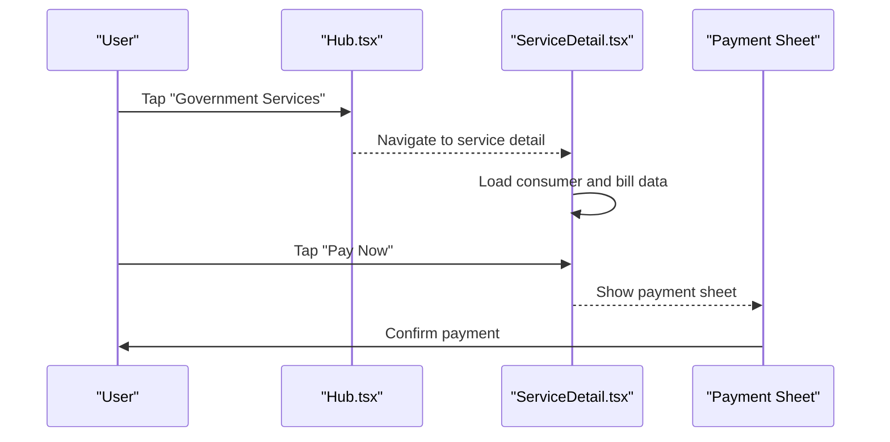

**Diagram sources**
- [Hub.tsx:77-114](file://src/pages/Hub.tsx#L77-L114)
- [ServiceDetail.tsx:6-151](file://src/pages/hub/ServiceDetail.tsx#L6-L151)

**Section sources**
- [ServiceDetail.tsx:6-151](file://src/pages/hub/ServiceDetail.tsx#L6-L151)
- [hub.data.ts:207-238](file://src/data/hub.data.ts#L207-L238)

### Daily Utility Services

#### Food Delivery
- Location indicator and search.
- Category chips and promotional banner.
- Restaurant list with ratings, delivery time, fees, and badges.

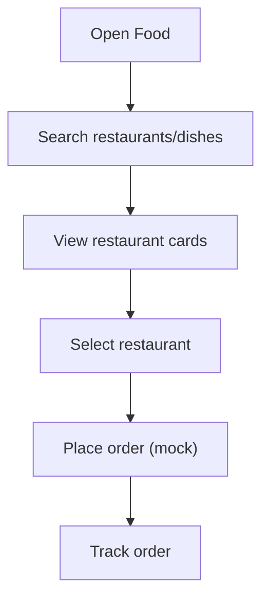

**Section sources**
- [FoodDelivery.tsx:7-92](file://src/pages/hub/FoodDelivery.tsx#L7-L92)
- [hub.data.ts:62-118](file://src/data/hub.data.ts#L62-L118)

#### Rides Booking
- Map-like background and route input fields.
- Mode selection: Auto, Cab (highlighted), Bike.
- Confirm booking action.

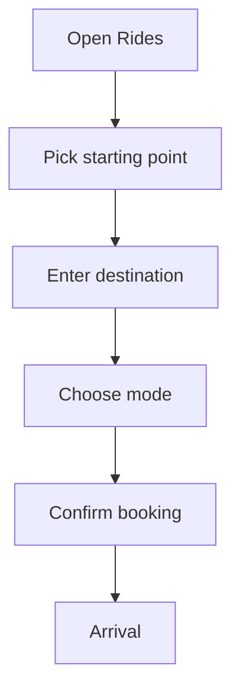

**Section sources**
- [Rides.tsx:6-73](file://src/pages/hub/Rides.tsx#L6-L73)

#### Agriculture Intelligence
- Weather card and alerts.
- Mandi prices table with trend indicators.
- Scheme eligibility cards with apply actions.
- AI assistant floating action.

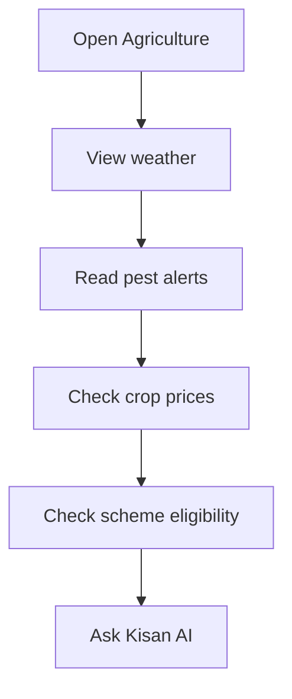

**Section sources**
- [Agriculture.tsx:7-130](file://src/pages/hub/Agriculture.tsx#L7-L130)
- [hub.data.ts:240-246](file://src/data/hub.data.ts#L240-L246)

#### Jobs Board
- AI-matched job cards with skills and salary.
- Filters for remote, full-time, internships, and fresher roles.
- Apply actions per job.

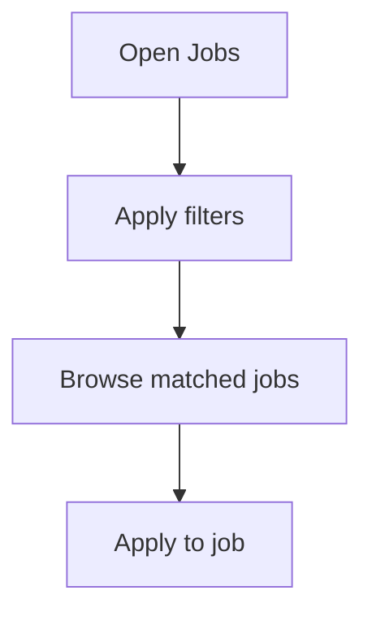

**Section sources**
- [Jobs.tsx:7-93](file://src/pages/hub/Jobs.tsx#L7-L93)
- [hub.data.ts:120-169](file://src/data/hub.data.ts#L120-L169)

#### Tools
- PDF tools, image tools, office viewer, and mini games.
- Consistent card-based layout with try/free actions.

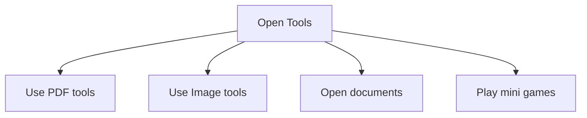

**Section sources**
- [Tools.tsx:6-114](file://src/pages/hub/Tools.tsx#L6-L114)

### Navigation and Onboarding Flows
- Bottom navigation adapts context: Explore vs Hub, Streaks vs Network.
- Animated page transitions with Framer Motion.
- State picker for government services allows jurisdiction selection.

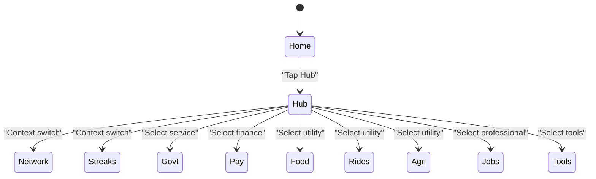

**Diagram sources**
- [BottomNav.tsx:5-61](file://src/components/BottomNav.tsx#L5-L61)
- [App.tsx:66-133](file://src/App.tsx#L66-L133)

**Section sources**
- [BottomNav.tsx:5-61](file://src/components/BottomNav.tsx#L5-L61)
- [Hub.tsx:248-288](file://src/pages/Hub.tsx#L248-L288)

## Dependency Analysis
External libraries:
- React Router for declarative routing and navigation.
- Framer Motion for animations and gestures.
- Lucide React for UI icons.
- Tailwind CSS for styling and responsive design.

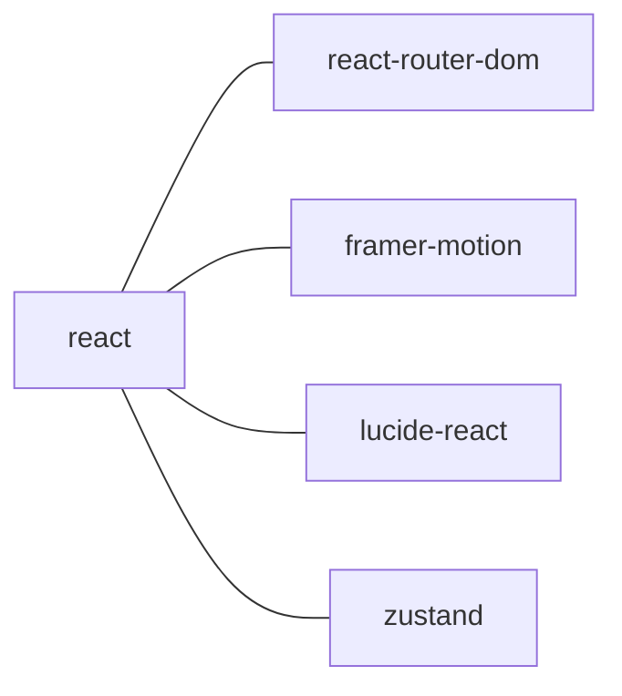

**Diagram sources**
- [package.json:12-18](file://package.json#L12-L18)

**Section sources**
- [package.json:12-18](file://package.json#L12-L18)

## Performance Considerations
- Lazy-load routes to reduce initial bundle size.
- Use virtualized lists for long data sets (e.g., transactions, jobs).
- Optimize images and gradients; avoid heavy animations on low-end devices.
- Debounce search inputs in service discovery.
- Preload frequently accessed assets (icons, fonts).

## Security and Data Protection
- Financial transactions:
  - Enforce secure input handling for amounts and UPI identifiers.
  - Add client-side validation and sanitization.
  - Integrate hardware-backed secure storage for sensitive credentials.
- Government services:
  - Mask PII in UI; avoid logging sensitive fields.
  - Use HTTPS-only for any future API calls.
  - Implement strict CSP and input sanitization.
- Data protection:
  - Avoid storing sensitive data locally; rely on server-side encryption.
  - Provide user opt-out for analytics and AI insights.
  - Comply with regional privacy regulations (e.g., state-specific data laws).

## Integration Patterns and External APIs
- Government services:
  - Use state-specific endpoints for service categories and forms.
  - Implement status polling for bill/payment updates.
  - Integrate with state portals via embedded web views or redirects.
- Payments:
  - Connect to UPI API providers for real-time settlement.
  - Implement transaction receipts and audit logs.
- Utilities:
  - Food delivery: Partner APIs for menus, pricing, and orders.
  - Rides: Integrate OTP and driver tracking APIs.
- Marketplace and travel:
  - Use marketplace APIs for product catalogs and inventory.
  - Integrate travel APIs for flight/hotel availability and booking.

## Implementation Guidelines
- Adding a new service:
  - Define route in routing layer.
  - Create a dedicated page component with consistent UI patterns.
  - Integrate mock data or API adapters.
  - Add category tile in Hub and navigation affordances.
- Handling service-specific workflows:
  - Encapsulate state in local components or a lightweight store.
  - Use controlled forms with validation.
  - Provide clear feedback and error messaging.
- Managing availability and status:
  - Maintain a service availability matrix.
  - Show maintenance banners and fallback placeholders.
  - Implement retry logic and graceful degradation.

## Troubleshooting Guide
- Navigation issues:
  - Verify route paths and nested layouts.
  - Ensure outlet rendering within MainLayout.
- Animation glitches:
  - Confirm Framer Motion versions and variants.
  - Avoid conflicting transforms on parent containers.
- State picker not closing:
  - Check event propagation and overlay click handlers.
- Missing icons or styles:
  - Confirm Lucide installation and Tailwind purge settings.

**Section sources**
- [App.tsx:66-133](file://src/App.tsx#L66-L133)
- [MainLayout.tsx:7-29](file://src/components/layouts/MainLayout.tsx#L7-L29)
- [Hub.tsx:248-288](file://src/pages/Hub.tsx#L248-L288)

## Conclusion
The Digital Services Hub consolidates diverse services into a cohesive, animated interface. Its modular design, state-aware navigation, and mock-driven data layer enable rapid iteration and seamless integration with real-world APIs. By following the implementation guidelines and prioritizing security and performance, the platform can evolve to support broader government services, robust financial transactions, and an extensive ecosystem of daily utilities.