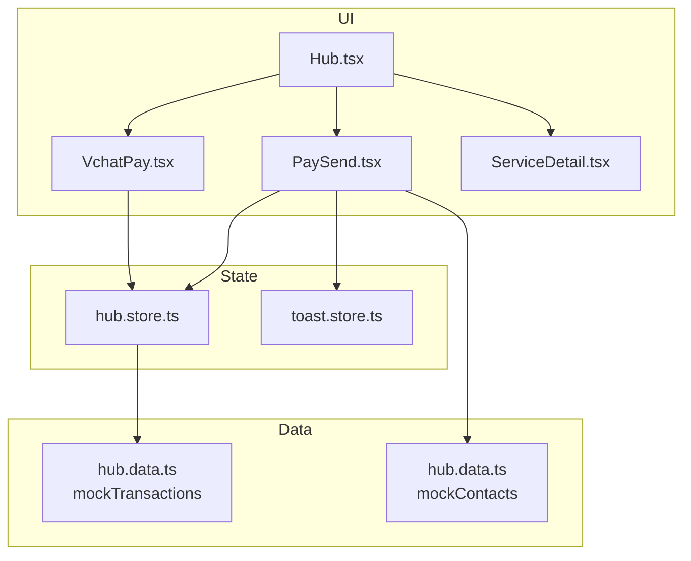
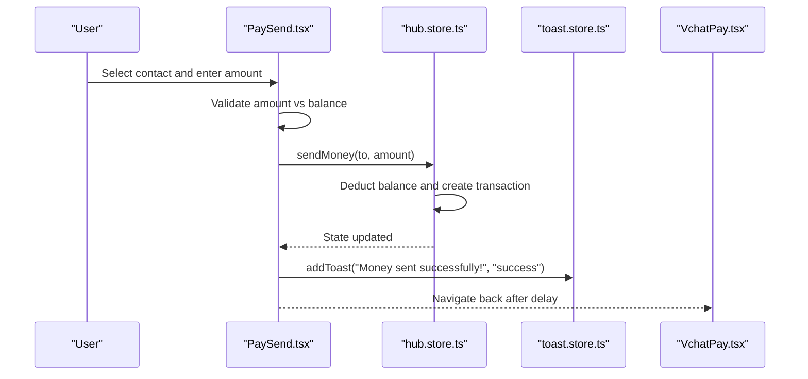
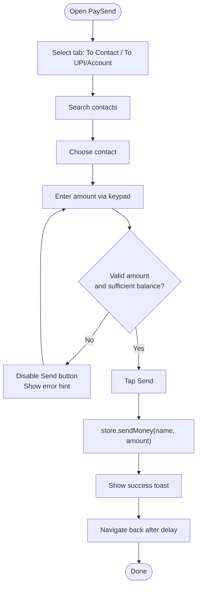
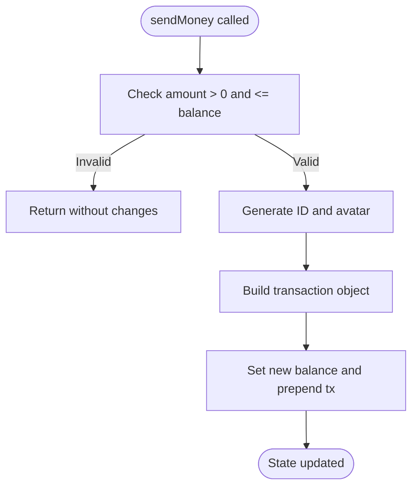
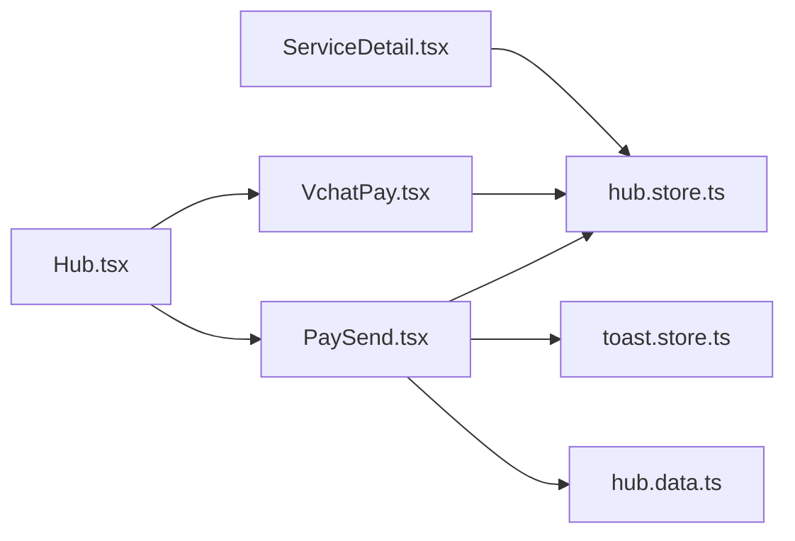

# Financial Services

<cite>
**Referenced Files in This Document**
- [VchatPay.tsx](file://src/pages/hub/VchatPay.tsx)
- [PaySend.tsx](file://src/pages/hub/PaySend.tsx)
- [Hub.tsx](file://src/pages/Hub.tsx)
- [ServiceDetail.tsx](file://src/pages/hub/ServiceDetail.tsx)
- [hub.store.ts](file://src/store/hub.store.ts)
- [toast.store.ts](file://src/store/toast.store.ts)
- [hub.data.ts](file://src/data/hub.data.ts)
</cite>

## Table of Contents
1. [Introduction](#introduction)
2. [Project Structure](#project-structure)
3. [Core Components](#core-components)
4. [Architecture Overview](#architecture-overview)
5. [Detailed Component Analysis](#detailed-component-analysis)
6. [Dependency Analysis](#dependency-analysis)
7. [Performance Considerations](#performance-considerations)
8. [Security and Compliance](#security-and-compliance)
9. [Payment Integrations](#payment-integrations)
10. [Error Handling and Reconciliation](#error-handling-and-reconciliation)
11. [Implementation Guidelines](#implementation-guidelines)
12. [Troubleshooting Guide](#troubleshooting-guide)
13. [Conclusion](#conclusion)

## Introduction
This document describes VChat’s Financial Services system with a focus on VChat Pay. It covers the money transfer interface, transaction processing logic, payment integration patterns, and the PaySend workflow. It also details the VChat Pay dashboard, including transaction history, balance management, and payment analytics. Security measures, encryption protocols, and compliance considerations are addressed alongside integration patterns for payment gateways, bank APIs, and financial institutions. Guidance is provided for extending payment capabilities, integrating new payment methods, and managing financial data securely.

## Project Structure
The Financial Services module is organized around three primary areas:
- UI surfaces for VChat Pay and Send Money
- Store-managed state for balances and transactions
- Mock data for transactions and contacts

**Diagram sources**
- [Hub.tsx:35-79](file://src/pages/Hub.tsx#L35-L79)
- [VchatPay.tsx:1-120](file://src/pages/hub/VchatPay.tsx#L1-L120)
- [PaySend.tsx:1-164](file://src/pages/hub/PaySend.tsx#L1-L164)
- [ServiceDetail.tsx:118-151](file://src/pages/hub/ServiceDetail.tsx#L118-L151)
- [hub.store.ts:118-271](file://src/store/hub.store.ts#L118-L271)
- [toast.store.ts:1-39](file://src/store/toast.store.ts#L1-L39)
- [hub.data.ts:1-247](file://src/data/hub.data.ts#L1-L247)

**Section sources**
- [Hub.tsx:35-79](file://src/pages/Hub.tsx#L35-L79)
- [VchatPay.tsx:1-120](file://src/pages/hub/VchatPay.tsx#L1-L120)
- [PaySend.tsx:1-164](file://src/pages/hub/PaySend.tsx#L1-L164)
- [ServiceDetail.tsx:118-151](file://src/pages/hub/ServiceDetail.tsx#L118-L151)
- [hub.store.ts:118-271](file://src/store/hub.store.ts#L118-L271)
- [toast.store.ts:1-39](file://src/store/toast.store.ts#L1-L39)
- [hub.data.ts:1-247](file://src/data/hub.data.ts#L1-L247)

## Core Components
- VChat Pay Dashboard: Displays total balance, quick actions, UPI QR, and recent transactions.
- Send Money Workflow: Recipient selection, amount input, validation, and confirmation.
- Store: Centralized state for balance and transactions; generates transaction IDs and avatars.
- Toast Notifications: Non-blocking user feedback for successful transfers.
- Mock Data: Static lists of transactions and contacts for UI demonstration.

Key responsibilities:
- VChat Pay Dashboard: Render balance, QR, and transaction list; route to Send Money.
- PaySend: Manage recipient selection, numeric keypad input, validation, and dispatch to store.
- Store: Validate funds, update balance, and append new transactions.
- Toast: Provide transient notifications.

**Section sources**
- [VchatPay.tsx:23-119](file://src/pages/hub/VchatPay.tsx#L23-L119)
- [PaySend.tsx:9-96](file://src/pages/hub/PaySend.tsx#L9-L96)
- [hub.store.ts:145-167](file://src/store/hub.store.ts#L145-L167)
- [toast.store.ts:17-38](file://src/store/toast.store.ts#L17-L38)
- [hub.data.ts:1-60](file://src/data/hub.data.ts#L1-L60)

## Architecture Overview
The system follows a unidirectional data flow:
- UI components trigger actions via store methods.
- Store updates state and persists it.
- UI re-renders based on state changes.
- Toast notifications provide feedback.

**Diagram sources**
- [PaySend.tsx:75-89](file://src/pages/hub/PaySend.tsx#L75-L89)
- [hub.store.ts:145-167](file://src/store/hub.store.ts#L145-L167)
- [toast.store.ts:19-30](file://src/store/toast.store.ts#L19-L30)
- [VchatPay.tsx:96-119](file://src/pages/hub/VchatPay.tsx#L96-L119)

## Detailed Component Analysis

### VChat Pay Dashboard
Responsibilities:
- Display total balance and UPI identifier.
- Provide quick action buttons (Send, Receive, Recharge, Bills).
- Show UPI QR and share option.
- List recent transactions with icons, descriptions, dates, and amounts.

Data binding:
- Balance and transactions come from the store.
- Navigation routes are wired to internal pages.

UI elements:
- Gradient card for balance.
- Four quick action tiles.
- QR section with SVG mock.
- Transaction list rendering.

**Section sources**
- [VchatPay.tsx:23-119](file://src/pages/hub/VchatPay.tsx#L23-L119)
- [hub.store.ts:124-125](file://src/store/hub.store.ts#L124-L125)
- [hub.store.ts:125](file://src/store/hub.store.ts#L125)

### Send Money Workflow (PaySend)
Workflow stages:
1. Recipient selection:
   - Tabs: “To Contact” and “To UPI/Account”.
   - Searchable contact list and recent contacts.
   - Choose a contact to proceed.
2. Amount entry:
   - Numeric keypad with delete/backspace.
   - Real-time amount display.
3. Validation:
   - Must be greater than zero.
   - Must not exceed current balance.
4. Confirmation:
   - Button enabled only when valid.
   - On confirm, dispatch to store and show success toast.
   - Navigate back after a short delay.

**Diagram sources**
- [PaySend.tsx:13-96](file://src/pages/hub/PaySend.tsx#L13-L96)
- [hub.store.ts:145-167](file://src/store/hub.store.ts#L145-L167)
- [toast.store.ts:19-30](file://src/store/toast.store.ts#L19-L30)

**Section sources**
- [PaySend.tsx:13-96](file://src/pages/hub/PaySend.tsx#L13-L96)
- [PaySend.tsx:111-131](file://src/pages/hub/PaySend.tsx#L111-L131)
- [PaySend.tsx:135-159](file://src/pages/hub/PaySend.tsx#L135-L159)

### Transaction Processing Logic (Store)
Core logic:
- sendMoney(to, amount):
  - Reject invalid or insufficient funds.
  - Generate unique transaction ID.
  - Compute avatar emoji based on recipient name.
  - Build transaction record with metadata.
  - Update balance and prepend transaction.

Persistence:
- Zustand with persistence middleware stores balance, transactions, and other hub state.

Mock data:
- Transactions and contacts are seeded from hub.data.ts.

**Diagram sources**
- [hub.store.ts:145-167](file://src/store/hub.store.ts#L145-L167)
- [hub.store.ts:103-116](file://src/store/hub.store.ts#L103-L116)

**Section sources**
- [hub.store.ts:145-167](file://src/store/hub.store.ts#L145-L167)
- [hub.store.ts:103-116](file://src/store/hub.store.ts#L103-L116)
- [hub.store.ts:118-271](file://src/store/hub.store.ts#L118-L271)
- [hub.data.ts:1-60](file://src/data/hub.data.ts#L1-L60)

### Payment Integration Patterns
Patterns demonstrated:
- Internal store-driven transfers (mocked).
- UI-driven confirmation sheet for bill payments.
- Route-based navigation to payment screens.

Integration-ready hooks:
- The confirmation sheet in ServiceDetail shows a typical payment overlay with balance summary and confirm button.

**Section sources**
- [ServiceDetail.tsx:118-151](file://src/pages/hub/ServiceDetail.tsx#L118-L151)
- [Hub.tsx:51-77](file://src/pages/Hub.tsx#L51-L77)

## Dependency Analysis
- PaySend depends on:
  - hub.store for balance and sendMoney.
  - toast.store for notifications.
  - hub.data for mock contacts.
- VChat Pay depends on:
  - hub.store for balance and transactions.
- Hub integrates:
  - Routes to VChat Pay and Send Money.
  - Global search query state.

**Diagram sources**
- [PaySend.tsx:5-7](file://src/pages/hub/PaySend.tsx#L5-L7)
- [VchatPay.tsx:5](file://src/pages/hub/VchatPay.tsx#L5)
- [Hub.tsx:37-77](file://src/pages/Hub.tsx#L37-L77)
- [ServiceDetail.tsx:118-151](file://src/pages/hub/ServiceDetail.tsx#L118-L151)

**Section sources**
- [PaySend.tsx:5-7](file://src/pages/hub/PaySend.tsx#L5-L7)
- [VchatPay.tsx:5](file://src/pages/hub/VchatPay.tsx#L5)
- [Hub.tsx:37-77](file://src/pages/Hub.tsx#L37-L77)
- [ServiceDetail.tsx:118-151](file://src/pages/hub/ServiceDetail.tsx#L118-L151)

## Performance Considerations
- Rendering:
  - Minimal re-renders by relying on store state updates.
  - Memoization of computed values (e.g., formatted balance) can be considered if needed.
- Data:
  - Transactions are prepended; consider pagination or virtualization for large histories.
- UI:
  - Motion animations are lightweight; keep thresholds small for responsiveness.
- Storage:
  - Persistence middleware writes to storage on state changes; batch updates if adding frequent operations.

## Security and Compliance
- Data at rest:
  - Current store persists to local storage; sensitive financial data should be encrypted before persisting.
- Data in transit:
  - Use HTTPS/TLS for all network requests.
- Authentication:
  - Implement strong session management and biometric or PIN-based authentication for payment confirmation.
- Privacy:
  - Minimize data retention; provide granular consent for analytics and sharing.
- Regulatory:
  - Comply with local financial regulations (e.g., reporting thresholds, KYC/AML).
- Audit:
  - Log sensitive actions (transfers, balance changes) with timestamps and identifiers.

## Payment Integrations
- Internal transfers:
  - Already modeled via store.sendMoney; extend to external APIs by replacing store logic with API calls.
- Bank APIs:
  - Integrate via secure SDKs or REST clients; handle callbacks and webhooks.
- Payment Gateways:
  - Use gateway SDKs for UPI, NEFT/RTGS, cards; implement retry and timeout policies.
- Reconciliation:
  - Periodically reconcile store state with backend responses; maintain a pending queue for offline scenarios.

## Error Handling and Reconciliation
- Validation errors:
  - Insufficient balance: show inline hint and disable send button.
  - Invalid amount: prevent submission.
- Backend failures:
  - Retry with exponential backoff; surface user-friendly messages.
  - Rollback: revert balance and transaction if backend fails.
- Reconciliation:
  - Compare local transactions with server responses; mark mismatches for manual review.
  - Maintain a reconciliation log with timestamps and reasons.

## Implementation Guidelines
- Extending payment capabilities:
  - Add new payment methods by introducing routes and UI sheets similar to PaySend.
  - Encapsulate provider-specific logic in dedicated modules and adapt store actions to call them.
- Integrating new payment methods:
  - Define method-specific validators and formats.
  - Wire confirmation overlays and success/failure flows.
- Managing financial data securely:
  - Encrypt sensitive fields; avoid logging raw PAN or CVV.
  - Use secure keystores for tokens; rotate secrets regularly.
  - Apply least privilege access to financial endpoints.

## Troubleshooting Guide
Common issues and resolutions:
- Transfer does not appear in history:
  - Verify store.update order: balance first, then prepend transaction.
  - Check transaction ID generation uniqueness.
- Insufficient balance shown incorrectly:
  - Ensure balance reads from store and not cached value.
  - Confirm validation runs before store mutation.
- Toast not appearing:
  - Confirm toast store initialization and duration settings.
- Navigation after send:
  - Ensure navigation delay is long enough for toast to render.

**Section sources**
- [hub.store.ts:145-167](file://src/store/hub.store.ts#L145-L167)
- [toast.store.ts:19-30](file://src/store/toast.store.ts#L19-L30)
- [PaySend.tsx:75-92](file://src/pages/hub/PaySend.tsx#L75-L92)

## Conclusion
VChat’s Financial Services module provides a clean, store-driven foundation for VChat Pay. The PaySend workflow demonstrates robust validation and user feedback, while the dashboard offers a comprehensive overview of balance and transactions. By adopting secure storage, strict validation, and resilient integration patterns, the system can evolve to support real-world payment providers and regulatory requirements.