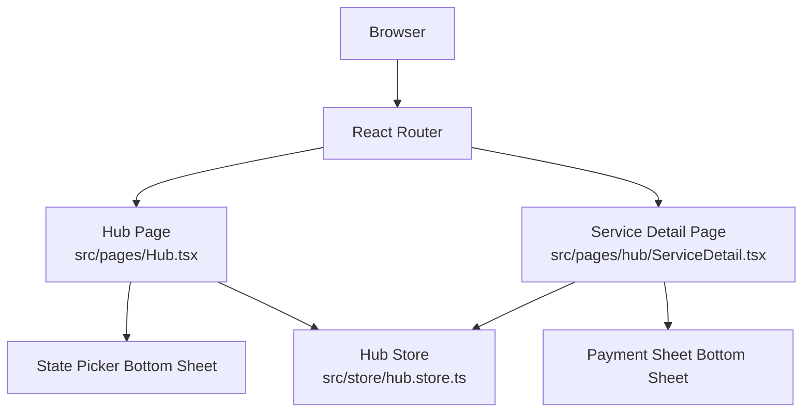
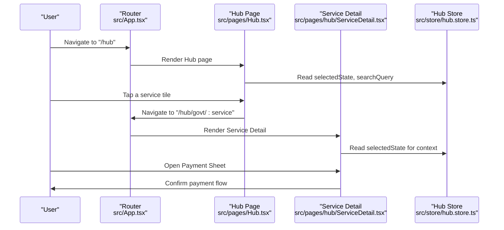
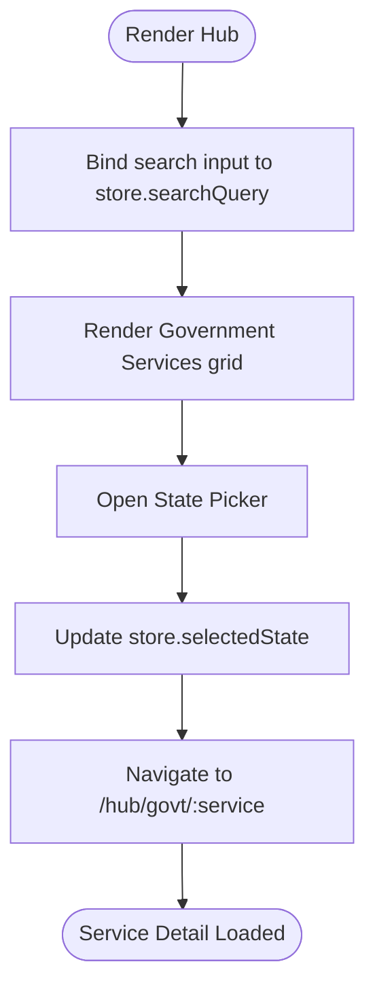
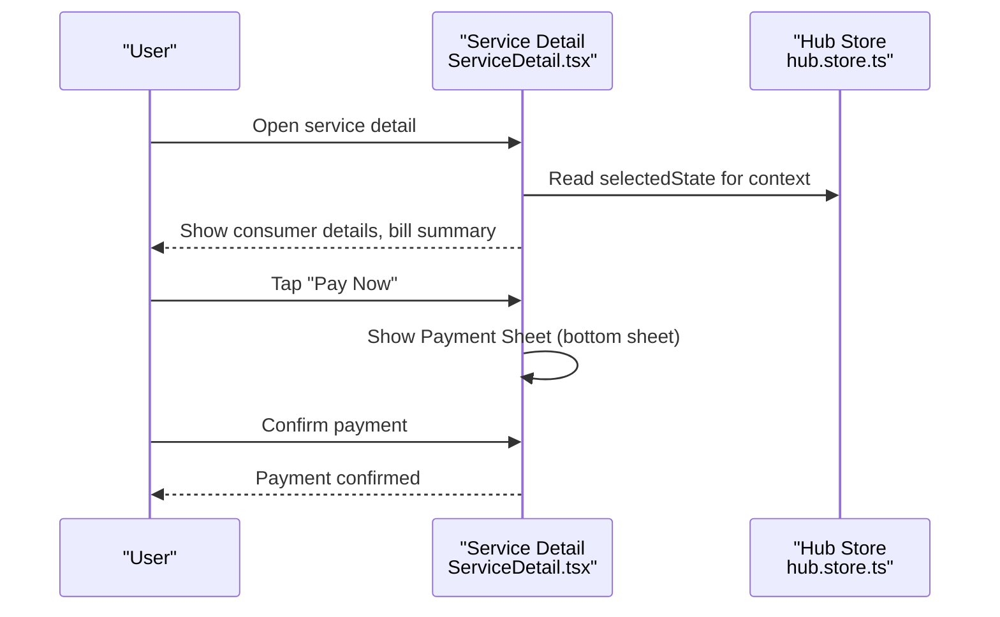
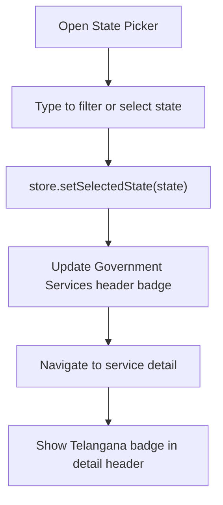
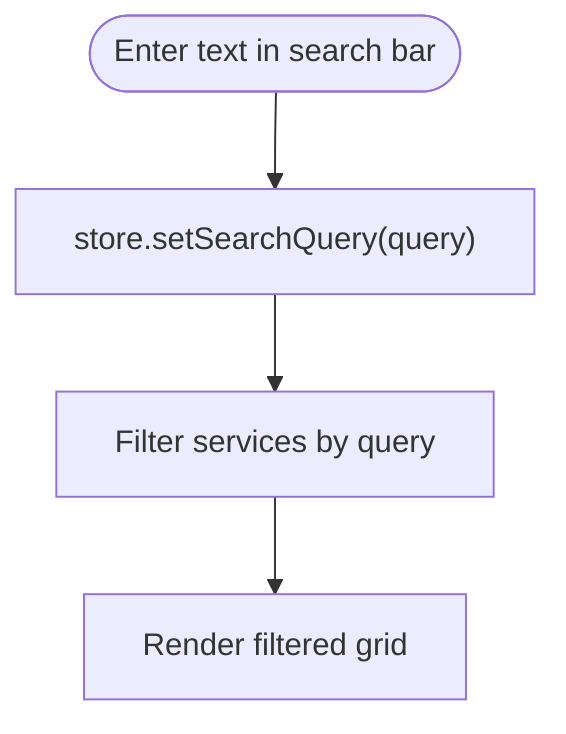
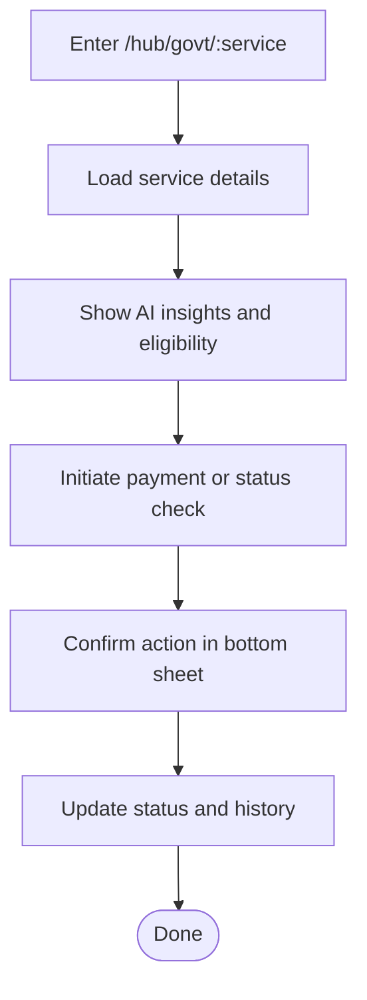
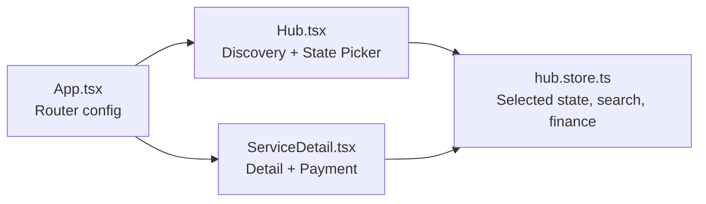

# Government Services

<cite>
**Referenced Files in This Document**
- [App.tsx](file://src/App.tsx)
- [Hub.tsx](file://src/pages/Hub.tsx)
- [ServiceDetail.tsx](file://src/pages/hub/ServiceDetail.tsx)
- [hub.store.ts](file://src/store/hub.store.ts)
- [hub.data.ts](file://src/data/hub.data.ts)
</cite>

## Table of Contents
1. [Introduction](#introduction)
2. [Project Structure](#project-structure)
3. [Core Components](#core-components)
4. [Architecture Overview](#architecture-overview)
5. [Detailed Component Analysis](#detailed-component-analysis)
6. [Dependency Analysis](#dependency-analysis)
7. [Performance Considerations](#performance-considerations)
8. [Troubleshooting Guide](#troubleshooting-guide)
9. [Conclusion](#conclusion)
10. [Appendices](#appendices)

## Introduction
This document describes the Government Services integration for Telangana government services within the VChat application. It focuses on the service discovery interface, service categorization system, and service detail presentation. It also explains how the application routes to Telangana-specific services, how payment flows are presented, and how state selection influences service context. The documentation provides implementation guidelines for extending the integration to additional Telangana services, handling service-specific workflows, and managing service availability and status updates.

## Project Structure
The Government Services feature is organized around:
- Routing: A dedicated route pattern for government services under `/hub/govt/:service`
- Discovery page: A categorized grid of government services
- Detail page: A service-centric view with consumer details, bill summary, eligibility insights, history, and a payment sheet
- State selection: A bottom sheet allowing users to select their state, with Telangana as the default context for government services
- Store: A centralized Zustand store managing search queries, selected state, and financial data

**Diagram sources**
- [App.tsx:88](file://src/App.tsx#L88)
- [Hub.tsx:81-118](file://src/pages/Hub.tsx#L81-L118)
- [ServiceDetail.tsx:149](file://src/pages/hub/ServiceDetail.tsx#L149)
- [hub.store.ts:70-100](file://src/store/hub.store.ts#L70-L100)

**Section sources**
- [App.tsx:88](file://src/App.tsx#L88)
- [Hub.tsx:81-118](file://src/pages/Hub.tsx#L81-L118)
- [ServiceDetail.tsx:149](file://src/pages/hub/ServiceDetail.tsx#L149)
- [hub.store.ts:70-100](file://src/store/hub.store.ts#L70-L100)

## Core Components
- Government Services Discovery Grid: Displays categorized services (Electricity, Water, Certificates, RTA, Aadhaar, Income Tax, Passport, Rythu Bandhu) and navigates to the service detail page via route parameters.
- State Picker: Allows users to select their state; the selected state is reflected in the header of the Government Services section and the service detail page.
- Service Detail Page: Presents consumer information, current bill summary, AI insights, eligibility prompts, payment history, and a payment confirmation sheet.
- Hub Store: Manages selected state, search query, and financial data used across the Hub and Government Services screens.

Key implementation references:
- Government Services grid and navigation: [Hub.tsx:94-117](file://src/pages/Hub.tsx#L94-L117)
- State picker UI and selection: [Hub.tsx:252-295](file://src/pages/Hub.tsx#L252-L295)
- Service detail layout and state badge: [ServiceDetail.tsx:19-29](file://src/pages/hub/ServiceDetail.tsx#L19-L29)
- Store state and actions: [hub.store.ts:70-100](file://src/store/hub.store.ts#L70-L100)

**Section sources**
- [Hub.tsx:94-117](file://src/pages/Hub.tsx#L94-L117)
- [Hub.tsx:252-295](file://src/pages/Hub.tsx#L252-L295)
- [ServiceDetail.tsx:19-29](file://src/pages/hub/ServiceDetail.tsx#L19-L29)
- [hub.store.ts:70-100](file://src/store/hub.store.ts#L70-L100)

## Architecture Overview
The Government Services feature follows a clear separation of concerns:
- Routing: The router defines the government service route pattern and wraps pages with layout components.
- Presentation: The Hub page renders the service grid and state picker; the Service Detail page renders the bill and payment UI.
- State Management: The Hub store centralizes state for search, selected state, and financial data.
- Data: Mock data is used for demonstration; real integrations would replace mock data with API responses.

**Diagram sources**
- [App.tsx:88](file://src/App.tsx#L88)
- [Hub.tsx:94-117](file://src/pages/Hub.tsx#L94-L117)
- [ServiceDetail.tsx:149](file://src/pages/hub/ServiceDetail.tsx#L149)
- [hub.store.ts:70-100](file://src/store/hub.store.ts#L70-L100)

## Detailed Component Analysis

### Government Services Discovery (Hub)
The Hub page provides:
- A top search bar bound to the store’s search query
- A Government Services section with a state selector badge
- A responsive grid of service tiles, each mapped to a route under `/hub/govt/:service`

Implementation highlights:
- Tile rendering and navigation: [Hub.tsx:94-117](file://src/pages/Hub.tsx#L94-L117)
- State picker trigger and UI: [Hub.tsx:85-91](file://src/pages/Hub.tsx#L85-L91), [Hub.tsx:252-295](file://src/pages/Hub.tsx#L252-L295)
- Store bindings for search and state: [Hub.tsx:26](file://src/pages/Hub.tsx#L26), [Hub.tsx:89](file://src/pages/Hub.tsx#L89)

**Diagram sources**
- [Hub.tsx:26](file://src/pages/Hub.tsx#L26)
- [Hub.tsx:89](file://src/pages/Hub.tsx#L89)
- [Hub.tsx:252-295](file://src/pages/Hub.tsx#L252-L295)
- [App.tsx:88](file://src/App.tsx#L88)

**Section sources**
- [Hub.tsx:26](file://src/pages/Hub.tsx#L26)
- [Hub.tsx:89](file://src/pages/Hub.tsx#L89)
- [Hub.tsx:94-117](file://src/pages/Hub.tsx#L94-L117)
- [Hub.tsx:252-295](file://src/pages/Hub.tsx#L252-L295)
- [App.tsx:88](file://src/App.tsx#L88)

### Service Detail Presentation
The Service Detail page presents:
- Header with back navigation and a state badge indicating Telangana context
- Consumer details card
- Current bill summary with status and due date
- AI insights panel
- Eligibility prompt for subsidies
- Payment history list
- Payment sheet bottom sheet for confirming payments

Implementation highlights:
- Header and state badge: [ServiceDetail.tsx:19-29](file://src/pages/hub/ServiceDetail.tsx#L19-L29)
- Consumer details and bill summary: [ServiceDetail.tsx:32-72](file://src/pages/hub/ServiceDetail.tsx#L32-L72)
- AI insights and eligibility: [ServiceDetail.tsx:74-92](file://src/pages/hub/ServiceDetail.tsx#L74-L92)
- Payment history: [ServiceDetail.tsx:94-115](file://src/pages/hub/ServiceDetail.tsx#L94-L115)
- Payment sheet: [ServiceDetail.tsx:118-147](file://src/pages/hub/ServiceDetail.tsx#L118-L147)

**Diagram sources**
- [ServiceDetail.tsx:19-29](file://src/pages/hub/ServiceDetail.tsx#L19-L29)
- [ServiceDetail.tsx:118-147](file://src/pages/hub/ServiceDetail.tsx#L118-L147)
- [hub.store.ts:70-100](file://src/store/hub.store.ts#L70-L100)

**Section sources**
- [ServiceDetail.tsx:19-29](file://src/pages/hub/ServiceDetail.tsx#L19-L29)
- [ServiceDetail.tsx:32-72](file://src/pages/hub/ServiceDetail.tsx#L32-L72)
- [ServiceDetail.tsx:74-92](file://src/pages/hub/ServiceDetail.tsx#L74-L92)
- [ServiceDetail.tsx:94-115](file://src/pages/hub/ServiceDetail.tsx#L94-L115)
- [ServiceDetail.tsx:118-147](file://src/pages/hub/ServiceDetail.tsx#L118-L147)
- [hub.store.ts:70-100](file://src/store/hub.store.ts#L70-L100)

### State Selection and Context
The state picker allows users to choose their state. The selected state appears in the Government Services section header and is reflected in the service detail header. This establishes the regional context for government services.

Implementation highlights:
- Trigger and render: [Hub.tsx:85-91](file://src/pages/Hub.tsx#L85-L91), [Hub.tsx:252-295](file://src/pages/Hub.tsx#L252-L295)
- Store action to set state: [hub.store.ts:90](file://src/store/hub.store.ts#L90)

**Diagram sources**
- [Hub.tsx:85-91](file://src/pages/Hub.tsx#L85-L91)
- [Hub.tsx:252-295](file://src/pages/Hub.tsx#L252-L295)
- [hub.store.ts:90](file://src/store/hub.store.ts#L90)

**Section sources**
- [Hub.tsx:85-91](file://src/pages/Hub.tsx#L85-L91)
- [Hub.tsx:252-295](file://src/pages/Hub.tsx#L252-L295)
- [hub.store.ts:90](file://src/store/hub.store.ts#L90)

### Service Filtering and Search
The Hub page exposes a search input bound to the store’s search query. While the Government Services grid itself is static in the current implementation, the search input enables future filtering of services by name or category.

Implementation highlights:
- Search binding: [Hub.tsx:26](file://src/pages/Hub.tsx#L26)
- Store action: [hub.store.ts:91](file://src/store/hub.store.ts#L91)

**Diagram sources**
- [Hub.tsx:26](file://src/pages/Hub.tsx#L26)
- [hub.store.ts:91](file://src/store/hub.store.ts#L91)

**Section sources**
- [Hub.tsx:26](file://src/pages/Hub.tsx#L26)
- [hub.store.ts:91](file://src/store/hub.store.ts#L91)

### Service-Specific Workflow Implementation
The current implementation demonstrates a typical workflow for a Telangana government service (e.g., Electricity):
- Display consumer details and bill summary
- Present AI insights and eligibility checks
- Show payment history
- Provide a payment sheet for confirmation

This pattern can be extended to other services by:
- Adding new route parameters under `/hub/govt/:service`
- Creating service-specific detail views with tailored sections (forms, statuses, documents)
- Integrating backend APIs for live data and status updates

[No sources needed since this diagram shows conceptual workflow, not actual code structure]

## Dependency Analysis
The Government Services feature depends on:
- Router configuration for the `/hub/govt/:service` route
- Hub page for discovery and state selection
- Service Detail page for presentation and payment
- Hub store for shared state (selected state, search query, financial data)

**Diagram sources**
- [App.tsx:88](file://src/App.tsx#L88)
- [Hub.tsx:81-118](file://src/pages/Hub.tsx#L81-L118)
- [ServiceDetail.tsx:149](file://src/pages/hub/ServiceDetail.tsx#L149)
- [hub.store.ts:70-100](file://src/store/hub.store.ts#L70-L100)

**Section sources**
- [App.tsx:88](file://src/App.tsx#L88)
- [Hub.tsx:81-118](file://src/pages/Hub.tsx#L81-L118)
- [ServiceDetail.tsx:149](file://src/pages/hub/ServiceDetail.tsx#L149)
- [hub.store.ts:70-100](file://src/store/hub.store.ts#L70-L100)

## Performance Considerations
- Lazy loading: Pages are lazy-loaded via React.lazy, reducing initial bundle size.
- Animation: Framer Motion animations are used for smooth transitions; keep animations lightweight for mobile devices.
- Bottom sheets: Payment and state pickers use AnimatePresence; ensure minimal re-renders by passing stable props.
- Store persistence: The Hub store uses persistence; avoid storing large payloads to maintain performance.

[No sources needed since this section provides general guidance]

## Troubleshooting Guide
Common issues and resolutions:
- Navigation to service detail fails:
  - Verify the route pattern exists and matches the tile navigation: [App.tsx:88](file://src/App.tsx#L88)
- State badge not updating:
  - Ensure the state picker updates the store and the UI re-renders: [Hub.tsx:282-284](file://src/pages/Hub.tsx#L282-L284), [hub.store.ts:90](file://src/store/hub.store.ts#L90)
- Payment sheet does not open:
  - Confirm the show/hide state is toggled and the bottom sheet is rendered: [ServiceDetail.tsx:118-147](file://src/pages/hub/ServiceDetail.tsx#L118-L147)
- Search not filtering services:
  - Ensure the store action is called and the grid is filtered accordingly: [Hub.tsx:26](file://src/pages/Hub.tsx#L26), [hub.store.ts:91](file://src/store/hub.store.ts#L91)

**Section sources**
- [App.tsx:88](file://src/App.tsx#L88)
- [Hub.tsx:26](file://src/pages/Hub.tsx#L26)
- [Hub.tsx:282-284](file://src/pages/Hub.tsx#L282-L284)
- [hub.store.ts:90-91](file://src/store/hub.store.ts#L90-L91)
- [ServiceDetail.tsx:118-147](file://src/pages/hub/ServiceDetail.tsx#L118-L147)

## Conclusion
The Government Services integration in VChat provides a clear, extensible foundation for Telangana government services. The Hub page offers discoverability and state context, while the Service Detail page delivers a comprehensive view of bills, eligibility, and payments. With the existing store and routing infrastructure, adding new services, implementing service-specific forms, and integrating live status updates is straightforward.

[No sources needed since this section summarizes without analyzing specific files]

## Appendices

### Implementation Guidelines for New Telangana Government Services
- Add a new tile in the Government Services grid with a route under `/hub/govt/:service`: [Hub.tsx:94-117](file://src/pages/Hub.tsx#L94-L117)
- Define the route in the router: [App.tsx:88](file://src/App.tsx#L88)
- Create a service-specific detail view mirroring the existing pattern: [ServiceDetail.tsx:149](file://src/pages/hub/ServiceDetail.tsx#L149)
- Integrate backend APIs for:
  - Service categories and metadata
  - Application forms and submission
  - Status tracking and updates
- Use the Hub store for shared state (selected state, search query, financial data): [hub.store.ts:70-100](file://src/store/hub.store.ts#L70-L100)
- Implement form handling patterns:
  - Controlled inputs bound to local state
  - Validation helpers and error messaging
  - Submission flow with loading and success states
- Security and compliance:
  - Enforce HTTPS and secure storage for sensitive data
  - Comply with regional privacy regulations and authentication standards
  - Integrate with government authentication systems as per policy
- Managing availability and status updates:
  - Poll or subscribe to status endpoints
  - Update store state and re-render affected UI
  - Provide user notifications for critical status changes

[No sources needed since this section provides general guidance]