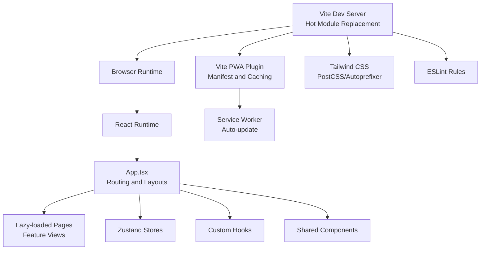
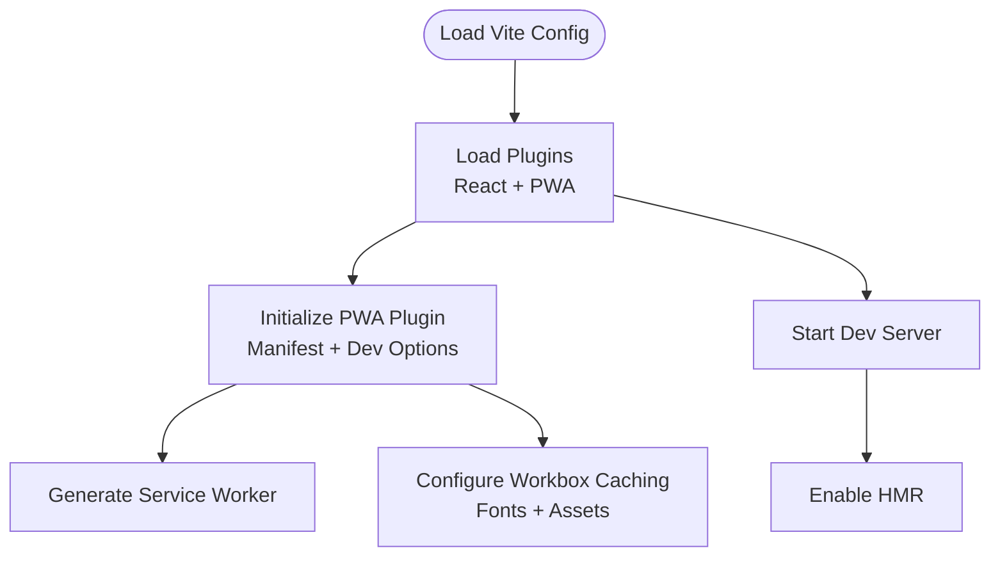
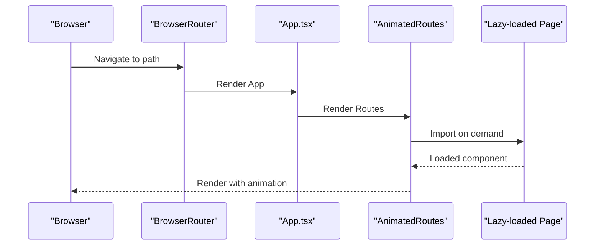
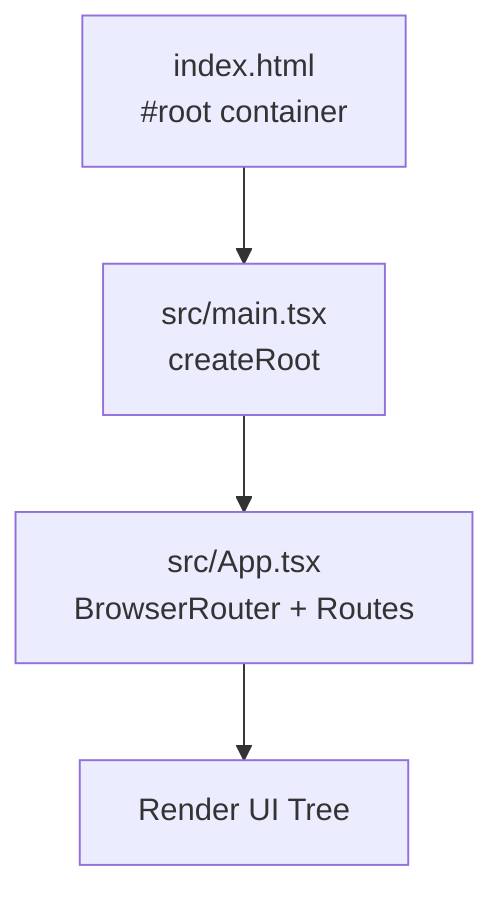
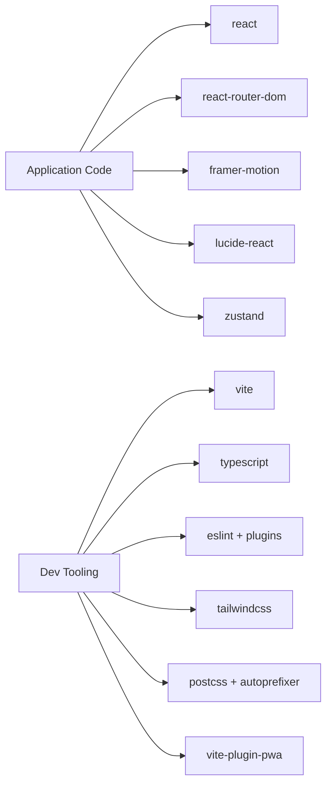

# Getting Started

<cite>
**Referenced Files in This Document**
- [package.json](file://package.json)
- [README.md](file://README.md)
- [vite.config.ts](file://vite.config.ts)
- [tsconfig.json](file://tsconfig.json)
- [tsconfig.app.json](file://tsconfig.app.json)
- [tsconfig.node.json](file://tsconfig.node.json)
- [eslint.config.js](file://eslint.config.js)
- [postcss.config.js](file://postcss.config.js)
- [tailwind.config.js](file://tailwind.config.js)
- [vercel.json](file://vercel.json)
- [index.html](file://index.html)
- [src/main.tsx](file://src/main.tsx)
- [src/App.tsx](file://src/App.tsx)
- [.gitignore](file://.gitignore)
</cite>

## Table of Contents
1. [Introduction](#introduction)
2. [Prerequisites](#prerequisites)
3. [Installation](#installation)
4. [Development Workflow](#development-workflow)
5. [Project Structure Overview](#project-structure-overview)
6. [Architecture Overview](#architecture-overview)
7. [Detailed Component Analysis](#detailed-component-analysis)
8. [Dependency Analysis](#dependency-analysis)
9. [Performance Considerations](#performance-considerations)
10. [Troubleshooting Guide](#troubleshooting-guide)
11. [Conclusion](#conclusion)

## Introduction
This guide helps you set up the VChat development environment on Windows and Unix-like systems. It covers prerequisites, installation steps, environment configuration, local development server startup, and the development workflow. You will also learn the project structure, key configuration files, and how the build and PWA systems are configured.

## Prerequisites
- Operating Systems: Windows and Unix-like systems (Linux/macOS) are supported.
- Node.js: Use a current LTS or active Node.js version compatible with the project’s toolchain. The project uses modern JavaScript/TypeScript features and Vite, so a recent Node.js version is recommended.
- Package Manager: npm or yarn. The scripts in this project are defined for npm; yarn can be used but verify script compatibility if needed.
- Git: Recommended for cloning the repository and managing changes.
- Text Editor or IDE: VS Code is commonly used; extensions for TypeScript, ESLint, Tailwind CSS, and PWA are helpful.

**Section sources**
- [package.json:6-11](file://package.json#L6-L11)
- [README.md:1-12](file://README.md#L1-L12)

## Installation
Follow these steps to prepare your development environment:

1. Install Node.js and confirm the installation:
   - Windows: Download from the official Node.js site and run the installer.
   - Unix-like: Use your distribution’s package manager or nvm.
   - Verify: Open a terminal and run node --version and npm --version.

2. Clone or place the project folder in your workspace.

3. Install dependencies:
   - Run npm install in the project root directory.
   - This installs both dependencies and devDependencies defined in package.json.

4. Confirm environment configuration:
   - TypeScript configurations are split across tsconfig.json, tsconfig.app.json, and tsconfig.node.json.
   - ESLint, PostCSS, and Tailwind CSS are configured for linting, CSS processing, and styling.

5. Start the development server:
   - Run npm run dev to launch the Vite dev server with hot module replacement (HMR).

6. Build for production:
   - Run npm run build to compile TypeScript and bundle assets via Vite.

7. Preview production build locally:
   - Run npm run preview to serve the built assets locally.

Notes for Windows vs Unix-like systems:
- Use cmd, PowerShell, or WSL on Windows; use bash/zsh on Unix-like systems.
- File paths are case-sensitive on Unix-like systems; ensure correct casing for imports and filenames.
- Some shell-specific commands may differ; stick to npm scripts for portability.

**Section sources**
- [package.json:6-11](file://package.json#L6-L11)
- [tsconfig.json:1-8](file://tsconfig.json#L1-L8)
- [tsconfig.app.json:1-26](file://tsconfig.app.json#L1-L26)
- [tsconfig.node.json:1-25](file://tsconfig.node.json#L1-L25)
- [eslint.config.js:1-24](file://eslint.config.js#L1-L24)
- [postcss.config.js:1-7](file://postcss.config.js#L1-L7)
- [tailwind.config.js:1-50](file://tailwind.config.js#L1-L50)

## Development Workflow
- Hot Module Replacement (HMR): Vite enables fast reloading during development. Changes to components, styles, and configuration trigger updates without full page reloads.
- Build Process: npm run build compiles TypeScript and bundles assets using Vite. The build targets modern browsers as configured.
- Testing: No dedicated test scripts are defined in package.json. You can integrate a testing framework (e.g., Vitest) by adding scripts and configuration if needed.
- Linting: npm run lint executes ESLint across the project. The configuration extends recommended rules for TypeScript and React.

Workflow highlights:
- Start dev server with npm run dev.
- Edit files in src; HMR applies changes instantly.
- Run npm run build before deploying or using npm run preview to test the production bundle.
- Run npm run lint to enforce code quality.

**Section sources**
- [package.json:6-11](file://package.json#L6-L11)
- [README.md:14-73](file://README.md#L14-L73)
- [eslint.config.js:1-24](file://eslint.config.js#L1-L24)

## Project Structure Overview
High-level layout and responsibilities:
- src: Application source code, organized by feature and shared components.
  - components: Shared UI components and layouts.
  - pages: Route-level pages and lazy-loaded views.
  - store: State management (Zustand stores).
  - hooks: Custom React hooks.
  - data: Static data modules for various features.
  - styles: Global CSS tokens.
  - App.tsx and main.tsx: Entry points and routing setup.
- public: Static assets referenced by HTML and PWA.
- Configuration files: TypeScript, ESLint, PostCSS, Tailwind CSS, Vite, and deployment config.

Key configuration files:
- vite.config.ts: Vite configuration with React plugin and PWA setup.
- tsconfig*.json: TypeScript project references and compiler options.
- eslint.config.js: ESLint flat config with recommended rules.
- postcss.config.js: Enables Tailwind CSS and Autoprefixer.
- tailwind.config.js: Tailwind CSS theme and content paths.
- vercel.json: Rewrites for SPA routing on Vercel.

Entry points:
- index.html: Root HTML with a script tag pointing to the TSX entry.
- src/main.tsx: Creates the React root and renders App.
- src/App.tsx: Sets up routing, lazy loading, animations, and layouts.

**Section sources**
- [index.html:1-16](file://index.html#L1-L16)
- [src/main.tsx:1-11](file://src/main.tsx#L1-L11)
- [src/App.tsx:1-156](file://src/App.tsx#L1-L156)
- [vite.config.ts:1-57](file://vite.config.ts#L1-L57)
- [tsconfig.json:1-8](file://tsconfig.json#L1-L8)
- [eslint.config.js:1-24](file://eslint.config.js#L1-L24)
- [postcss.config.js:1-7](file://postcss.config.js#L1-L7)
- [tailwind.config.js:1-50](file://tailwind.config.js#L1-L50)
- [vercel.json:1-8](file://vercel.json#L1-L8)

## Architecture Overview
The development stack integrates React, TypeScript, Vite, and PWA technologies. The app uses route-based lazy loading and animated transitions. Tailwind CSS provides styling with CSS variables for themes.

**Diagram sources**
- [vite.config.ts:1-57](file://vite.config.ts#L1-L57)
- [src/App.tsx:1-156](file://src/App.tsx#L1-L156)
- [tailwind.config.js:1-50](file://tailwind.config.js#L1-L50)
- [eslint.config.js:1-24](file://eslint.config.js#L1-L24)

## Detailed Component Analysis

### Vite Configuration and PWA Setup
- Plugins: React plugin for JSX transform and fast refresh; PWA plugin for service worker generation and caching strategies.
- Manifest: Defines app metadata, theme/background colors, and icon assets.
- Dev Options: Enables PWA in development for testing offline behavior.
- Workbox: Configures caching for Google Fonts and generic asset patterns.

**Diagram sources**
- [vite.config.ts:1-57](file://vite.config.ts#L1-L57)

**Section sources**
- [vite.config.ts:1-57](file://vite.config.ts#L1-L57)

### Routing and Lazy Loading
- BrowserRouter wraps the app to enable client-side routing.
- Routes are grouped under MainLayout and ImmersiveLayout for different UI contexts.
- Pages are lazy-loaded using React.lazy to optimize initial bundle size.
- AnimatedRoutes uses Framer Motion for smooth transitions between routes.

**Diagram sources**
- [src/App.tsx:1-156](file://src/App.tsx#L1-L156)

**Section sources**
- [src/App.tsx:1-156](file://src/App.tsx#L1-L156)

### Entry Points and Rendering
- index.html defines the root container and loads the TSX entry.
- src/main.tsx creates the React root and renders App inside StrictMode.
- src/App.tsx sets up routing, layouts, and global UI elements.

**Diagram sources**
- [index.html:1-16](file://index.html#L1-L16)
- [src/main.tsx:1-11](file://src/main.tsx#L1-L11)
- [src/App.tsx:1-156](file://src/App.tsx#L1-L156)

**Section sources**
- [index.html:1-16](file://index.html#L1-L16)
- [src/main.tsx:1-11](file://src/main.tsx#L1-L11)
- [src/App.tsx:1-156](file://src/App.tsx#L1-L156)

## Dependency Analysis
- Runtime Dependencies: React, React DOM, React Router DOM, Framer Motion, Lucide React, Zustand.
- Dev Dependencies: Vite, TypeScript, ESLint, Tailwind CSS, PostCSS, Autoprefixer, React plugin, PWA plugin, and related type definitions.
- Scripts: dev, build, lint, preview are defined in package.json.

**Diagram sources**
- [package.json:12-37](file://package.json#L12-L37)

**Section sources**
- [package.json:12-37](file://package.json#L12-L37)

## Performance Considerations
- Keep Node.js updated to benefit from Vite and toolchain improvements.
- Prefer npm scripts for portability across Windows and Unix-like systems.
- Use lazy loading for pages to reduce initial bundle size.
- Tailwind CSS purges unused styles via content globs; ensure paths remain accurate.
- Avoid enabling React Compiler in this template to preserve dev/build performance as documented.
- Monitor build times and disable unnecessary plugins or heavy transformations during development.

[No sources needed since this section provides general guidance]

## Troubleshooting Guide
Common issues and resolutions:
- Node.js version mismatch:
  - Symptom: Build errors or unexpected behavior.
  - Resolution: Use a supported Node.js version and clear caches if needed.
- Missing dependencies after clone:
  - Symptom: Errors when running npm run dev.
  - Resolution: Run npm install and ensure package-lock.json is present.
- Port already in use:
  - Symptom: Vite fails to start or shows port conflicts.
  - Resolution: Change the port in Vite config or stop the conflicting process.
- PWA not activating in development:
  - Symptom: Service worker not found or caching not applied.
  - Resolution: Ensure devOptions.enabled is true in the PWA plugin configuration.
- Tailwind CSS not generating styles:
  - Symptom: Utility classes have no effect.
  - Resolution: Verify content paths in tailwind.config.js and rebuild.
- ESLint errors blocking development:
  - Symptom: Lint errors prevent building or running.
  - Resolution: Fix reported issues or adjust rules in eslint.config.js.
- SPA routing on deployment:
  - Symptom: Refresh leads to 404 on hosting platforms.
  - Resolution: Ensure server rewrites to index.html (see vercel.json).

Environment-specific notes:
- Windows:
  - Use cmd or PowerShell; avoid WSL unless necessary for specific tooling.
  - Ensure case-sensitive file references match actual filenames.
- Unix-like systems:
  - Use bash/zsh; shell aliases may affect command availability.
  - Permissions and PATH may require adjustments for global tools.

**Section sources**
- [vite.config.ts:30-32](file://vite.config.ts#L30-L32)
- [tailwind.config.js:3-6](file://tailwind.config.js#L3-L6)
- [vercel.json:1-8](file://vercel.json#L1-L8)
- [eslint.config.js:1-24](file://eslint.config.js#L1-L24)
- [README.md:10-12](file://README.md#L10-L12)

## Conclusion
You now have the essentials to set up the VChat development environment, run the local server, and understand the project’s architecture and configuration. Use the provided scripts, leverage lazy loading and PWA features, and follow the troubleshooting tips for a smooth development experience on Windows and Unix-like systems.