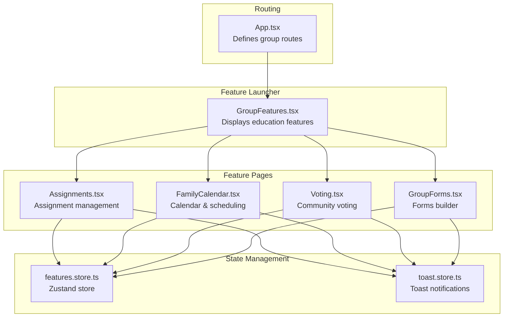
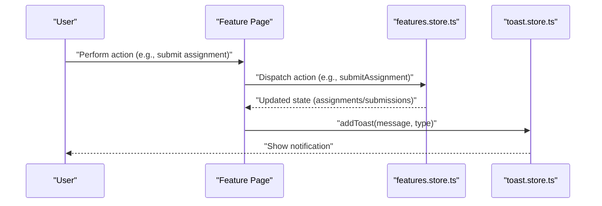
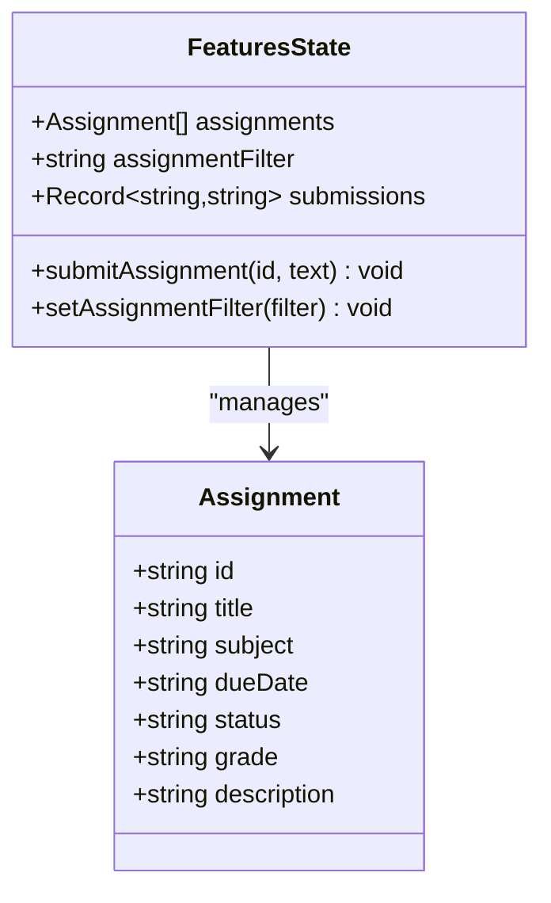
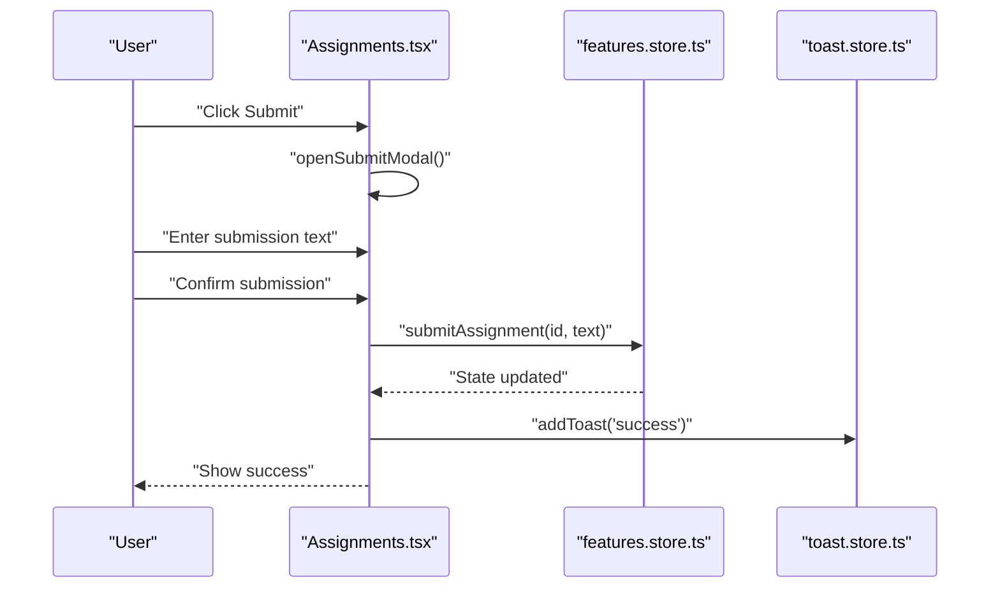
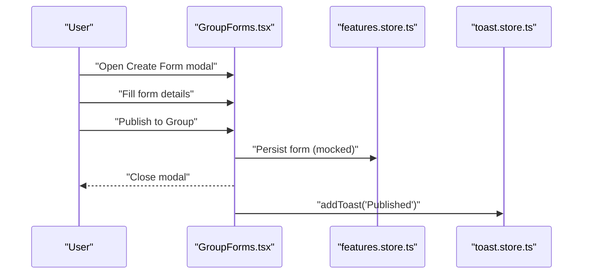
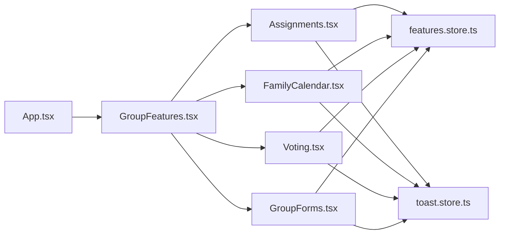

# Education Groups

<cite>
**Referenced Files in This Document**
- [App.tsx](file://src/App.tsx)
- [GroupFeatures.tsx](file://src/components/GroupFeatures.tsx)
- [Assignments.tsx](file://src/pages/features/Assignments.tsx)
- [FamilyCalendar.tsx](file://src/pages/features/FamilyCalendar.tsx)
- [Voting.tsx](file://src/pages/features/Voting.tsx)
- [WorkTasks.tsx](file://src/pages/features/WorkTasks.tsx)
- [GroupForms.tsx](file://src/pages/features/GroupForms.tsx)
- [features.store.ts](file://src/store/features.store.ts)
- [toast.store.ts](file://src/store/toast.store.ts)
</cite>

## Table of Contents
1. [Introduction](#introduction)
2. [Project Structure](#project-structure)
3. [Core Components](#core-components)
4. [Architecture Overview](#architecture-overview)
5. [Detailed Component Analysis](#detailed-component-analysis)
6. [Dependency Analysis](#dependency-analysis)
7. [Performance Considerations](#performance-considerations)
8. [Troubleshooting Guide](#troubleshooting-guide)
9. [Conclusion](#conclusion)

## Introduction
This document describes the education group collaboration features implemented in the project. It focuses on the assignment management system, shared calendar for scheduling, community voting, and forms support. While the education group includes additional features such as attendance, doubt threads, timetable, announcements, quizzes, study materials, and leaderboard in the feature list, only the assignment management, calendar, voting, and forms are fully implemented in the current codebase. The remaining features are present in the feature list but not yet implemented in the routing or UI.

## Project Structure
The education group features are integrated into the application via:
- Routing: Education group routes are defined under the immersive layout for group modules.
- Feature launcher: The GroupFeatures component exposes the available education group features and navigates to their respective pages.
- State management: A centralized Zustand store manages polls, calendar events, tasks, and assignments with persistence.

**Diagram sources**
- [App.tsx:118-129](file://src/App.tsx#L118-L129)
- [GroupFeatures.tsx:52-62](file://src/components/GroupFeatures.tsx#L52-L62)
- [Assignments.tsx:8-195](file://src/pages/features/Assignments.tsx#L8-L195)
- [FamilyCalendar.tsx:8-276](file://src/pages/features/FamilyCalendar.tsx#L8-L276)
- [Voting.tsx:7-116](file://src/pages/features/Voting.tsx#L7-L116)
- [GroupForms.tsx:12-142](file://src/pages/features/GroupForms.tsx#L12-L142)
- [features.store.ts:250-385](file://src/store/features.store.ts#L250-L385)
- [toast.store.ts:17-39](file://src/store/toast.store.ts#L17-L39)

**Section sources**
- [App.tsx:118-129](file://src/App.tsx#L118-L129)
- [GroupFeatures.tsx:52-62](file://src/components/GroupFeatures.tsx#L52-L62)

## Core Components
- Assignment Management (implemented):
  - Lists assignments with filtering by status (All, Pending, Submitted, Graded).
  - Tracks due dates and displays days remaining.
  - Allows students to submit assignments and view grades.
- Shared Calendar (implemented):
  - Displays monthly calendar grid and daily events.
  - Supports adding events with type and time.
  - Includes an AI scheduler banner for negotiation.
- Community Voting (implemented):
  - Shows active polls with real-time vote updates and results.
  - Supports casting votes and viewing past poll outcomes.
- Forms (implemented):
  - Displays form list with open/closed status and response counts.
  - Provides a modal to create new forms with question types.

**Section sources**
- [Assignments.tsx:8-195](file://src/pages/features/Assignments.tsx#L8-L195)
- [FamilyCalendar.tsx:8-276](file://src/pages/features/FamilyCalendar.tsx#L8-L276)
- [Voting.tsx:7-116](file://src/pages/features/Voting.tsx#L7-L116)
- [GroupForms.tsx:12-142](file://src/pages/features/GroupForms.tsx#L12-L142)

## Architecture Overview
The education group features follow a unidirectional data flow:
- UI components render state from the Zustand store.
- Actions mutate state immutably and persist selected slices.
- Toast notifications provide user feedback for actions.

**Diagram sources**
- [Assignments.tsx:35-45](file://src/pages/features/Assignments.tsx#L35-L45)
- [features.store.ts:356-367](file://src/store/features.store.ts#L356-L367)
- [toast.store.ts:19-31](file://src/store/toast.store.ts#L19-L31)

## Detailed Component Analysis

### Assignment Management System
- Data model:
  - Assignment: id, title, subject, dueDate, status, optional grade, optional description.
- UI behavior:
  - Tabs filter assignments by status.
  - Days remaining computed from dueDate.
  - Submit modal captures submission text and invokes submit action.
- State mutations:
  - submitAssignment updates submissions map and assignment status to submitted.
  - setAssignmentFilter updates UI filter state.

**Diagram sources**
- [features.store.ts:41-49](file://src/store/features.store.ts#L41-L49)
- [features.store.ts:64-78](file://src/store/features.store.ts#L64-L78)

**Diagram sources**
- [Assignments.tsx:47-51](file://src/pages/features/Assignments.tsx#L47-L51)
- [Assignments.tsx:35-45](file://src/pages/features/Assignments.tsx#L35-L45)
- [features.store.ts:356-362](file://src/store/features.store.ts#L356-L362)
- [toast.store.ts:19-31](file://src/store/toast.store.ts#L19-L31)

**Section sources**
- [Assignments.tsx:8-195](file://src/pages/features/Assignments.tsx#L8-L195)
- [features.store.ts:41-49](file://src/store/features.store.ts#L41-L49)
- [features.store.ts:356-367](file://src/store/features.store.ts#L356-L367)

### Attendance Tracking System
- Implemented in the education group feature list but not in the current routing or UI.
- Expected functionality includes marking student attendance and generating reports.
- Current code does not expose a dedicated page or store actions for attendance.

**Section sources**
- [GroupFeatures.tsx:52-62](file://src/components/GroupFeatures.tsx#L52-L62)
- [App.tsx:118-129](file://src/App.tsx#L118-L129)

### Doubt Thread System
- Included in the education group feature list but not implemented in routing or UI.
- Expected functionality includes subject-wise threads, peer assistance, and instructor responses.
- No dedicated page or store actions found.

**Section sources**
- [GroupFeatures.tsx:52-62](file://src/components/GroupFeatures.tsx#L52-L62)
- [App.tsx:118-129](file://src/App.tsx#L118-L129)

### Timetable Management System
- Included in the education group feature list but not implemented.
- Expected functionality includes class scheduling, room allocation, teacher availability, and conflict resolution.
- No dedicated page or store actions found.

**Section sources**
- [GroupFeatures.tsx:52-62](file://src/components/GroupFeatures.tsx#L52-L62)
- [App.tsx:118-129](file://src/App.tsx#L118-L129)

### Announcements System
- Included in the education group feature list but not implemented.
- Expected functionality includes distributing notices and updates.
- No dedicated page or store actions found.

**Section sources**
- [GroupFeatures.tsx:52-62](file://src/components/GroupFeatures.tsx#L52-L62)
- [App.tsx:118-129](file://src/App.tsx#L118-L129)

### Quiz System
- Included in the education group feature list but not implemented.
- Expected functionality includes question creation, automated grading, result analysis, and performance tracking.
- No dedicated page or store actions found.

**Section sources**
- [GroupFeatures.tsx:52-62](file://src/components/GroupFeatures.tsx#L52-L62)
- [App.tsx:118-129](file://src/App.tsx#L118-L129)

### Study Materials System
- Included in the education group feature list but not implemented.
- Expected functionality includes resource sharing, textbook distribution, and content management.
- No dedicated page or store actions found.

**Section sources**
- [GroupFeatures.tsx:52-62](file://src/components/GroupFeatures.tsx#L52-L62)
- [App.tsx:118-129](file://src/App.tsx#L118-L129)

### Forms System (Enrollment, Feedback, Surveys)
- Implemented for general groups (GroupForms.tsx).
- Displays form list, open/closed status, and response counts.
- Provides a modal to create forms with question types.

**Diagram sources**
- [GroupForms.tsx:74-137](file://src/pages/features/GroupForms.tsx#L74-L137)
- [toast.store.ts:19-31](file://src/store/toast.store.ts#L19-L31)

**Section sources**
- [GroupForms.tsx:12-142](file://src/pages/features/GroupForms.tsx#L12-L142)

### Student Progress Monitoring and Parent Communication
- Not implemented in the current codebase.
- The education group feature list includes these capabilities, but no UI or store actions exist.

**Section sources**
- [GroupFeatures.tsx:52-62](file://src/components/GroupFeatures.tsx#L52-L62)
- [App.tsx:118-129](file://src/App.tsx#L118-L129)

### Institutional Reporting
- Not implemented in the current codebase.
- The education group feature list includes reporting capabilities, but no UI or store actions exist.

**Section sources**
- [GroupFeatures.tsx:52-62](file://src/components/GroupFeatures.tsx#L52-L62)
- [App.tsx:118-129](file://src/App.tsx#L118-L129)

## Dependency Analysis
- Routing depends on GroupFeatures to launch feature pages.
- Feature pages depend on the features store for state and actions.
- Toast notifications are used across features for user feedback.

**Diagram sources**
- [App.tsx:118-129](file://src/App.tsx#L118-L129)
- [GroupFeatures.tsx:52-62](file://src/components/GroupFeatures.tsx#L52-L62)
- [Assignments.tsx:8-195](file://src/pages/features/Assignments.tsx#L8-L195)
- [FamilyCalendar.tsx:8-276](file://src/pages/features/FamilyCalendar.tsx#L8-L276)
- [Voting.tsx:7-116](file://src/pages/features/Voting.tsx#L7-L116)
- [GroupForms.tsx:12-142](file://src/pages/features/GroupForms.tsx#L12-L142)
- [features.store.ts:250-385](file://src/store/features.store.ts#L250-L385)
- [toast.store.ts:17-39](file://src/store/toast.store.ts#L17-L39)

**Section sources**
- [App.tsx:118-129](file://src/App.tsx#L118-L129)
- [GroupFeatures.tsx:52-62](file://src/components/GroupFeatures.tsx#L52-L62)
- [features.store.ts:250-385](file://src/store/features.store.ts#L250-L385)

## Performance Considerations
- UI rendering:
  - Filtering and mapping operations on arrays are lightweight; performance is acceptable for small to medium datasets.
- State updates:
  - Zustand provides efficient immutable updates; avoid unnecessary re-renders by keeping state slices minimal.
- Persistence:
  - Persist middleware stores only selected slices; ensure only essential data is persisted to reduce storage overhead.

## Troubleshooting Guide
- Submissions not reflecting:
  - Verify that submitAssignment is invoked and submissions map is updated.
  - Confirm that assignment status transitions to submitted.
- Toast messages not appearing:
  - Ensure addToast is called with a valid message and type.
  - Check that the ToastContainer is rendered in the app layout.
- Calendar event creation issues:
  - Validate required fields (title, date, time) before calling addEvent.
  - Confirm color and type mapping for event display.
- Voting not updating:
  - Ensure the poll is active and the user has not previously voted the same option.
  - Verify that vote increments/decrements occur and percentages recalculate.

**Section sources**
- [Assignments.tsx:35-45](file://src/pages/features/Assignments.tsx#L35-L45)
- [features.store.ts:356-367](file://src/store/features.store.ts#L356-L367)
- [toast.store.ts:19-31](file://src/store/toast.store.ts#L19-L31)
- [FamilyCalendar.tsx:52-74](file://src/pages/features/FamilyCalendar.tsx#L52-L74)
- [features.store.ts:316-330](file://src/store/features.store.ts#L316-L330)
- [Voting.tsx:28-90](file://src/pages/features/Voting.tsx#L28-L90)
- [features.store.ts:268-314](file://src/store/features.store.ts#L268-L314)

## Conclusion
The education group collaboration features currently include assignment management, shared calendar, community voting, and forms. These components demonstrate a clean separation of concerns with a centralized store and consistent UI patterns. The remaining education features (attendance, doubt threads, timetable, announcements, quiz, study materials, leaderboard, progress monitoring, and institutional reporting) are defined in the feature list but are not implemented in the current codebase. Extending the implementation would involve adding routes, UI pages, and store actions aligned with the existing patterns.