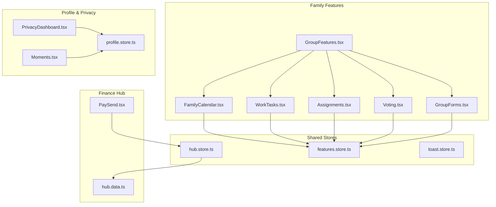
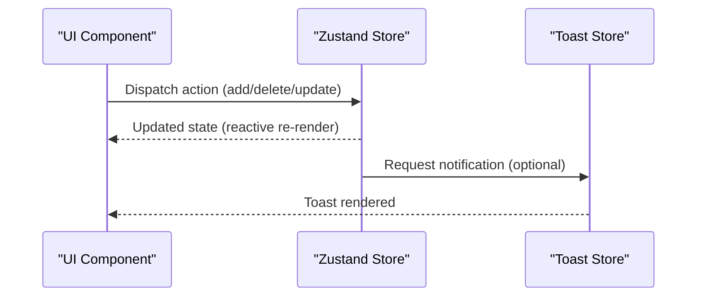
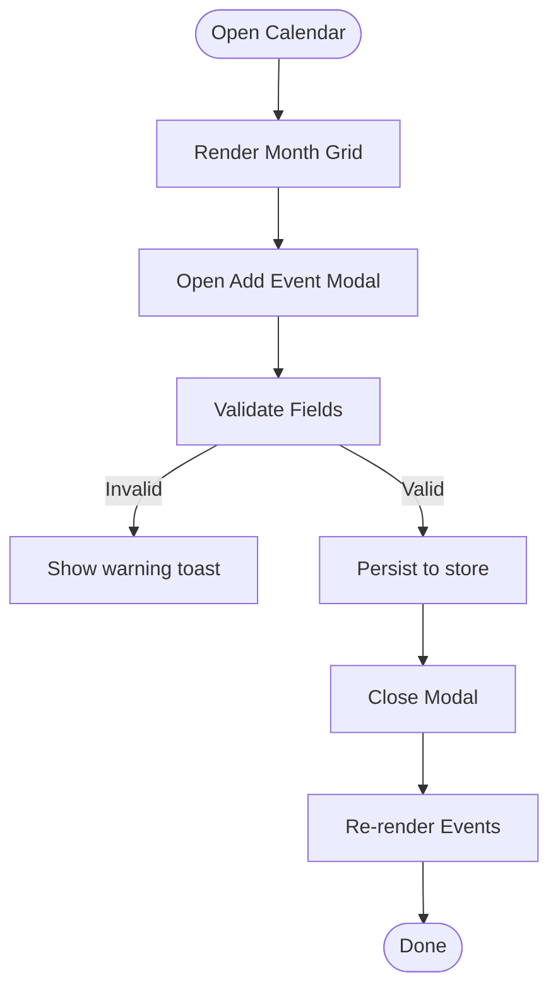
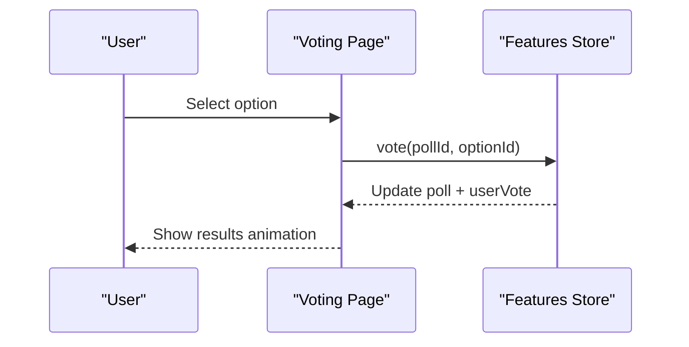
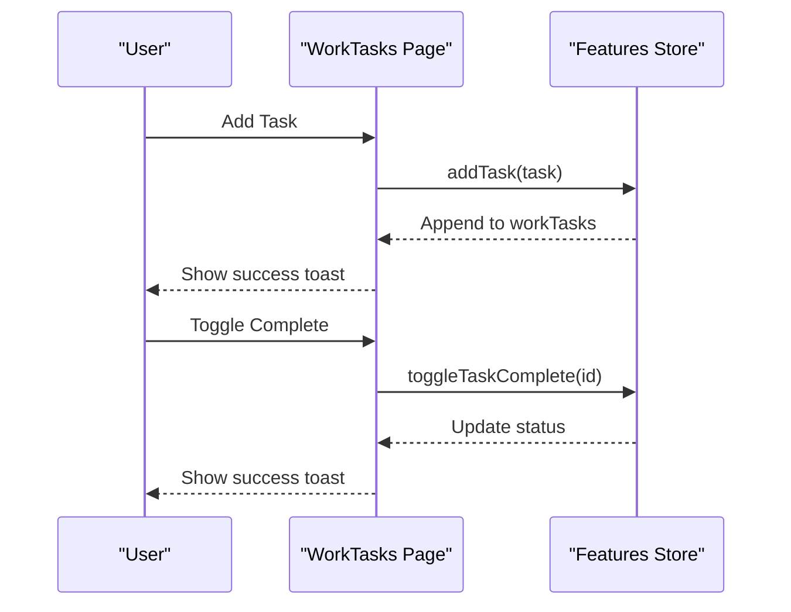
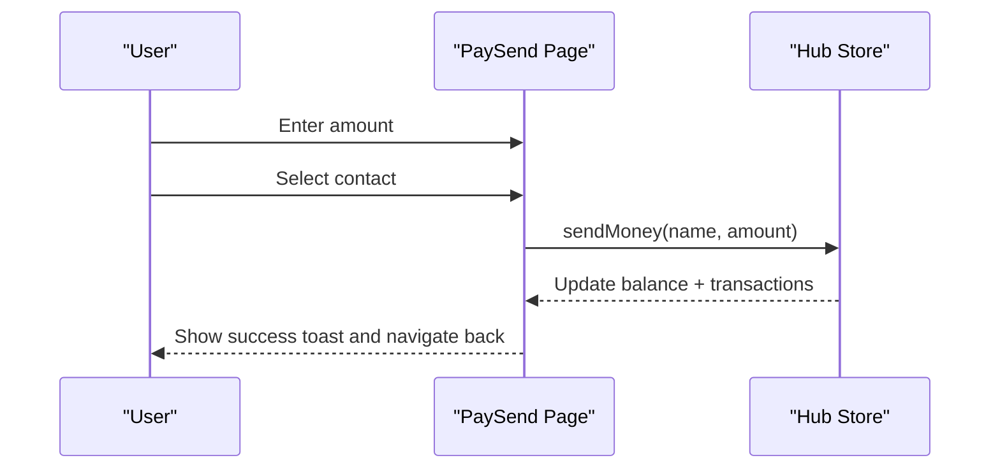
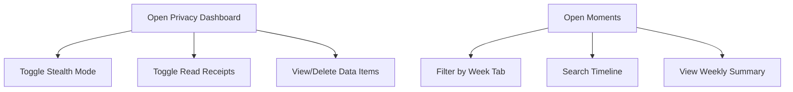
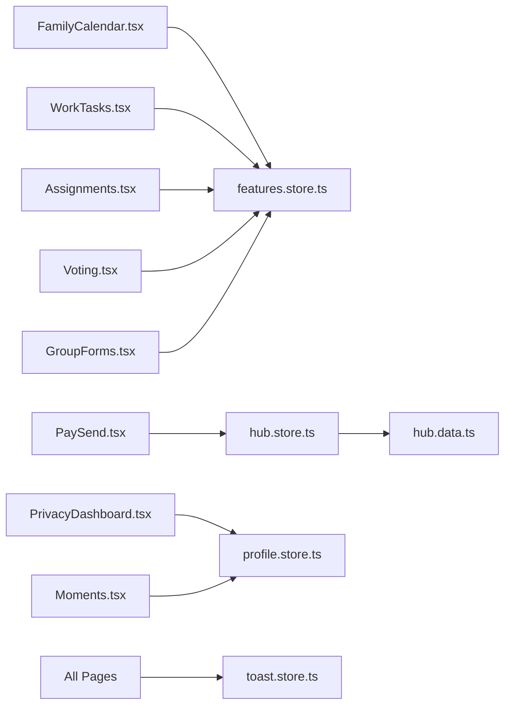

# Family Groups

<cite>
**Referenced Files in This Document**
- [FamilyCalendar.tsx](file://src/pages/features/FamilyCalendar.tsx)
- [Assignments.tsx](file://src/pages/features/Assignments.tsx)
- [WorkTasks.tsx](file://src/pages/features/WorkTasks.tsx)
- [GroupFeatures.tsx](file://src/components/GroupFeatures.tsx)
- [features.store.ts](file://src/store/features.store.ts)
- [hub.store.ts](file://src/store/hub.store.ts)
- [hub.data.ts](file://src/data/hub.data.ts)
- [PaySend.tsx](file://src/pages/hub/PaySend.tsx)
- [PrivacyDashboard.tsx](file://src/pages/profile/PrivacyDashboard.tsx)
- [Moments.tsx](file://src/pages/profile/Moments.tsx)
- [profile.store.ts](file://src/store/profile.store.ts)
- [toast.store.ts](file://src/store/toast.store.ts)
- [Voting.tsx](file://src/pages/features/Voting.tsx)
- [GroupForms.tsx](file://src/pages/features/GroupForms.tsx)
</cite>

## Table of Contents
1. [Introduction](#introduction)
2. [Project Structure](#project-structure)
3. [Core Components](#core-components)
4. [Architecture Overview](#architecture-overview)
5. [Detailed Component Analysis](#detailed-component-analysis)
6. [Dependency Analysis](#dependency-analysis)
7. [Performance Considerations](#performance-considerations)
8. [Troubleshooting Guide](#troubleshooting-guide)
9. [Conclusion](#conclusion)
10. [Appendices](#appendices)

## Introduction
This document explains the family group collaboration features implemented in the project. It focuses on the shared calendar, sync lists (shopping and tasks), voting and forms, tasks and assignments, and the financial hub for sending money. It also outlines privacy and profile capabilities that support family data protection and personalization. Where applicable, the document maps UI flows to actual source files and highlights areas that would require backend integration for full real-time synchronization and cross-device updates.

## Project Structure
The family collaboration features are primarily implemented as page components under the features and hub sections, with shared state managed via Zustand stores. The GroupFeatures component provides a consolidated entry point to navigate to family-specific features.

**Diagram sources**
- [GroupFeatures.tsx:1-154](file://src/components/GroupFeatures.tsx#L1-L154)
- [FamilyCalendar.tsx:1-276](file://src/pages/features/FamilyCalendar.tsx#L1-L276)
- [WorkTasks.tsx:1-246](file://src/pages/features/WorkTasks.tsx#L1-L246)
- [Assignments.tsx:1-195](file://src/pages/features/Assignments.tsx#L1-L195)
- [Voting.tsx:1-116](file://src/pages/features/Voting.tsx#L1-L116)
- [GroupForms.tsx:1-142](file://src/pages/features/GroupForms.tsx#L1-L142)
- [features.store.ts:1-385](file://src/store/features.store.ts#L1-L385)
- [hub.store.ts:1-271](file://src/store/hub.store.ts#L1-L271)
- [hub.data.ts:1-247](file://src/data/hub.data.ts#L1-L247)
- [PaySend.tsx:1-164](file://src/pages/hub/PaySend.tsx#L1-L164)
- [PrivacyDashboard.tsx:1-115](file://src/pages/profile/PrivacyDashboard.tsx#L1-L115)
- [Moments.tsx:1-134](file://src/pages/profile/Moments.tsx#L1-L134)
- [profile.store.ts:1-139](file://src/store/profile.store.ts#L1-L139)

**Section sources**
- [GroupFeatures.tsx:1-154](file://src/components/GroupFeatures.tsx#L1-L154)
- [features.store.ts:1-385](file://src/store/features.store.ts#L1-L385)
- [hub.store.ts:1-271](file://src/store/hub.store.ts#L1-L271)

## Core Components
- Shared Calendar: Adds, lists, and deletes calendar events with type-based coloring and AI scheduling assistance.
- Sync Lists: Voting and Forms for community decisions; Tasks and Assignments for work and education collaboration.
- Finance Hub: Send money to contacts with balance tracking and transaction logging.
- Privacy and Profile: Privacy dashboard, stealth/read receipts, and personal moments timeline.

**Section sources**
- [FamilyCalendar.tsx:1-276](file://src/pages/features/FamilyCalendar.tsx#L1-L276)
- [features.store.ts:1-385](file://src/store/features.store.ts#L1-L385)
- [Voting.tsx:1-116](file://src/pages/features/Voting.tsx#L1-L116)
- [GroupForms.tsx:1-142](file://src/pages/features/GroupForms.tsx#L1-L142)
- [WorkTasks.tsx:1-246](file://src/pages/features/WorkTasks.tsx#L1-L246)
- [Assignments.tsx:1-195](file://src/pages/features/Assignments.tsx#L1-L195)
- [PaySend.tsx:1-164](file://src/pages/hub/PaySend.tsx#L1-L164)
- [hub.store.ts:1-271](file://src/store/hub.store.ts#L1-L271)
- [PrivacyDashboard.tsx:1-115](file://src/pages/profile/PrivacyDashboard.tsx#L1-L115)
- [Moments.tsx:1-134](file://src/pages/profile/Moments.tsx#L1-L134)

## Architecture Overview
The family collaboration system uses a unidirectional data flow:
- UI components render state from Zustand stores.
- Actions mutate state immutably; toast notifications inform users of outcomes.
- Finance operations update balances and transaction logs.
- Profile and privacy settings are persisted locally for user control.

**Diagram sources**
- [FamilyCalendar.tsx:52-74](file://src/pages/features/FamilyCalendar.tsx#L52-L74)
- [features.store.ts:316-330](file://src/store/features.store.ts#L316-L330)
- [toast.store.ts:17-38](file://src/store/toast.store.ts#L17-L38)

## Detailed Component Analysis

### Shared Calendar
- Purpose: Family event management with type categorization and AI scheduling assistant.
- Key behaviors:
  - Add/Delete events via modals.
  - Color-coded by event type.
  - AI negotiation banner simulates automated scheduling coordination.
- Data model: CalendarEvent with title, date, time, type, color, optional participants.
- Real-time updates: Local store updates; requires backend sync for multi-device consistency.

**Diagram sources**
- [FamilyCalendar.tsx:52-74](file://src/pages/features/FamilyCalendar.tsx#L52-L74)
- [features.store.ts:316-330](file://src/store/features.store.ts#L316-L330)

**Section sources**
- [FamilyCalendar.tsx:1-276](file://src/pages/features/FamilyCalendar.tsx#L1-L276)
- [features.store.ts:21-29](file://src/store/features.store.ts#L21-L29)

### Sync Lists: Voting and Forms
- Voting:
  - Active polls allow casting votes; results animate after selection.
  - Past polls show winners and totals.
- Forms:
  - Browse published forms, view responses, and create new forms with question types.

**Diagram sources**
- [Voting.tsx:28-89](file://src/pages/features/Voting.tsx#L28-L89)
- [features.store.ts:268-314](file://src/store/features.store.ts#L268-L314)

**Section sources**
- [Voting.tsx:1-116](file://src/pages/features/Voting.tsx#L1-L116)
- [GroupForms.tsx:1-142](file://src/pages/features/GroupForms.tsx#L1-L142)
- [features.store.ts:4-19](file://src/store/features.store.ts#L4-L19)

### Tasks and Assignments
- Tasks:
  - Create tasks with assignees, priorities, deadlines.
  - Toggle completion status; penalties shown for overdue tasks.
- Assignments:
  - Filter by status (All/Pending/Submitted/Graded).
  - Submit assignments with a modal and toast feedback.

**Diagram sources**
- [WorkTasks.tsx:212-236](file://src/pages/features/WorkTasks.tsx#L212-L236)
- [features.store.ts:332-350](file://src/store/features.store.ts#L332-L350)

**Section sources**
- [WorkTasks.tsx:1-246](file://src/pages/features/WorkTasks.tsx#L1-L246)
- [Assignments.tsx:1-195](file://src/pages/features/Assignments.tsx#L1-L195)
- [features.store.ts:31-49](file://src/store/features.store.ts#L31-L49)

### Finance Hub: Send Money
- Purpose: Transfer money to contacts, manage balance, and log transactions.
- Key behaviors:
  - Numeric keypad input for amount.
  - Balance checks and transaction creation.
  - Recent contacts list and UPI/account tabs.

**Diagram sources**
- [PaySend.tsx:75-89](file://src/pages/hub/PaySend.tsx#L75-L89)
- [hub.store.ts:145-167](file://src/store/hub.store.ts#L145-L167)
- [hub.data.ts:2-53](file://src/data/hub.data.ts#L2-L53)

**Section sources**
- [PaySend.tsx:1-164](file://src/pages/hub/PaySend.tsx#L1-L164)
- [hub.store.ts:1-271](file://src/store/hub.store.ts#L1-L271)
- [hub.data.ts:1-247](file://src/data/hub.data.ts#L1-L247)

### Privacy and Profile
- Privacy Dashboard:
  - Privacy score visualization.
  - Data categories with view/delete actions.
  - Stealth mode and read receipt toggles.
- Moments:
  - Personal timeline of activities with private visibility.
  - Weekly summary and AI-style search suggestions.

**Diagram sources**
- [PrivacyDashboard.tsx:15-111](file://src/pages/profile/PrivacyDashboard.tsx#L15-L111)
- [Moments.tsx:9-131](file://src/pages/profile/Moments.tsx#L9-L131)
- [profile.store.ts:95-139](file://src/store/profile.store.ts#L95-L139)

**Section sources**
- [PrivacyDashboard.tsx:1-115](file://src/pages/profile/PrivacyDashboard.tsx#L1-L115)
- [Moments.tsx:1-134](file://src/pages/profile/Moments.tsx#L1-L134)
- [profile.store.ts:1-139](file://src/store/profile.store.ts#L1-L139)

## Dependency Analysis
- UI components depend on Zustand stores for state and actions.
- Toast notifications are centralized for consistent UX feedback.
- Finance relies on mock data initially; production requires backend APIs for real-time updates and persistence.

**Diagram sources**
- [features.store.ts:1-385](file://src/store/features.store.ts#L1-L385)
- [hub.store.ts:1-271](file://src/store/hub.store.ts#L1-L271)
- [hub.data.ts:1-247](file://src/data/hub.data.ts#L1-L247)
- [profile.store.ts:1-139](file://src/store/profile.store.ts#L1-L139)
- [toast.store.ts:1-39](file://src/store/toast.store.ts#L1-L39)

**Section sources**
- [features.store.ts:1-385](file://src/store/features.store.ts#L1-L385)
- [hub.store.ts:1-271](file://src/store/hub.store.ts#L1-L271)
- [profile.store.ts:1-139](file://src/store/profile.store.ts#L1-L139)
- [toast.store.ts:1-39](file://src/store/toast.store.ts#L1-L39)

## Performance Considerations
- Rendering:
  - Calendar grid renders a fixed number of days; consider virtualization for larger date ranges.
  - Voting results animations use motion; keep transitions minimal for older devices.
- State:
  - Persisted stores reduce reload overhead but increase local storage footprint; avoid storing large binary payloads.
- Network:
  - Finance and calendar features are currently local; adding backend sync will require optimistic updates and conflict resolution.

## Troubleshooting Guide
- Toast notifications not appearing:
  - Verify toast store initialization and that components call the addToast action.
- Calendar events not saving:
  - Ensure required fields are filled; check store action wiring.
- Money transfers failing:
  - Confirm sufficient balance and valid amount; inspect transaction creation logic.
- Voting results not updating:
  - Ensure user hasn’t already voted; verify store mutation and re-render.

**Section sources**
- [toast.store.ts:17-38](file://src/store/toast.store.ts#L17-L38)
- [FamilyCalendar.tsx:52-74](file://src/pages/features/FamilyCalendar.tsx#L52-L74)
- [features.store.ts:316-330](file://src/store/features.store.ts#L316-L330)
- [PaySend.tsx:75-89](file://src/pages/hub/PaySend.tsx#L75-L89)
- [hub.store.ts:145-167](file://src/store/hub.store.ts#L145-L167)
- [Voting.tsx:28-89](file://src/pages/features/Voting.tsx#L28-L89)
- [features.store.ts:268-314](file://src/store/features.store.ts#L268-L314)

## Conclusion
The family collaboration features provide a cohesive suite of shared calendar, voting, forms, tasks, assignments, and finance utilities. The UI is responsive and interactive, with state managed efficiently through Zustand. For production readiness, integrate backend APIs to enable real-time synchronization, cross-device consistency, and secure data handling aligned with the privacy controls exposed in the profile and privacy dashboards.

## Appendices

### Family Feature Navigation
- Use the GroupFeatures component to discover and navigate to family features such as Shared Calendar, Sync List, Live Location, Medicine Reminders, Family Wallet, Emergency SOS, Family Album, and Kids Mode.

**Section sources**
- [GroupFeatures.tsx:28-40](file://src/components/GroupFeatures.tsx#L28-L40)