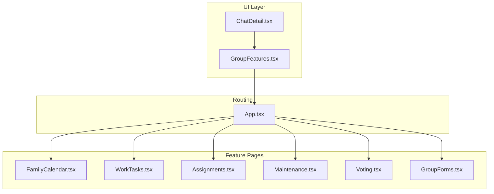
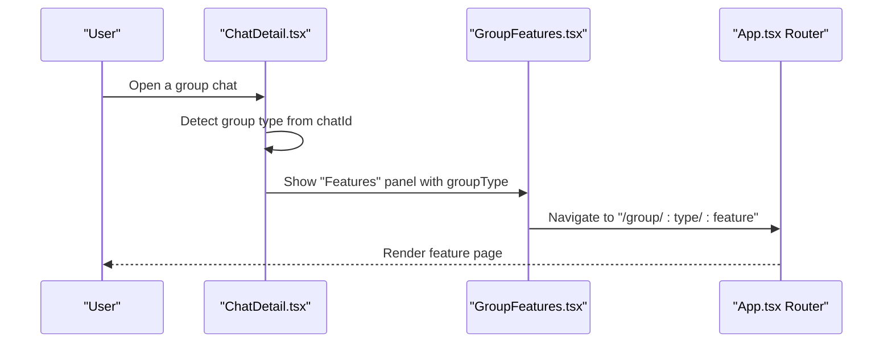
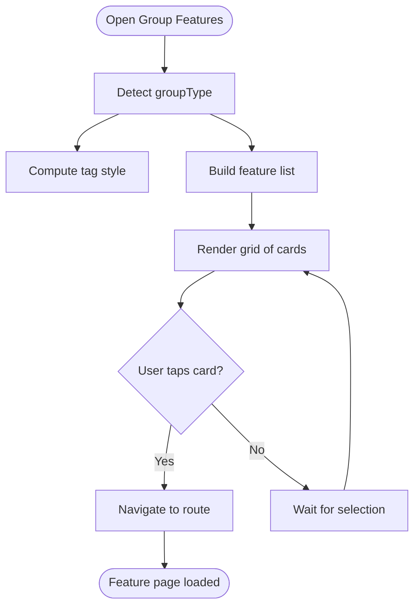
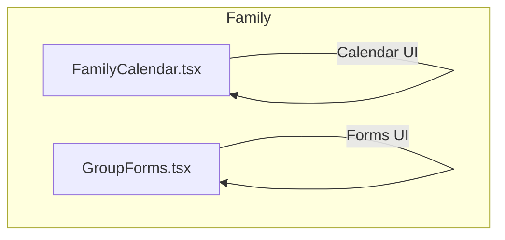
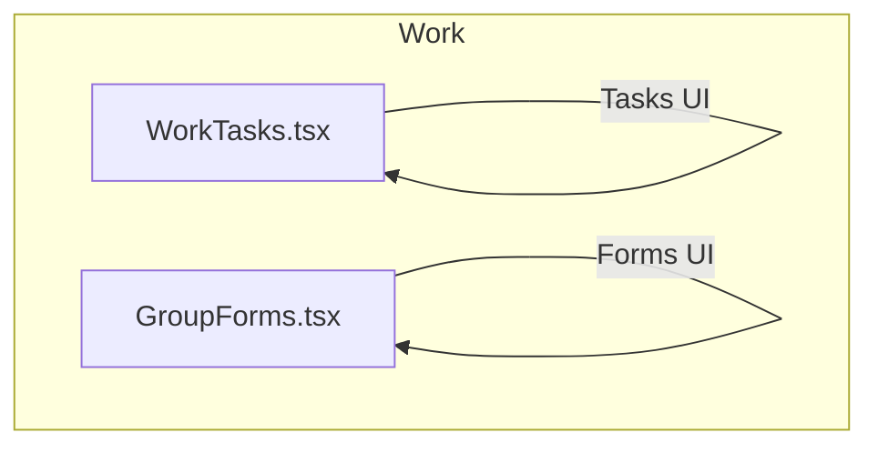
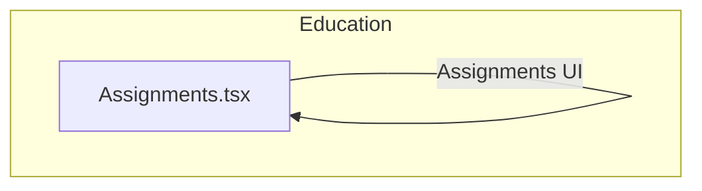
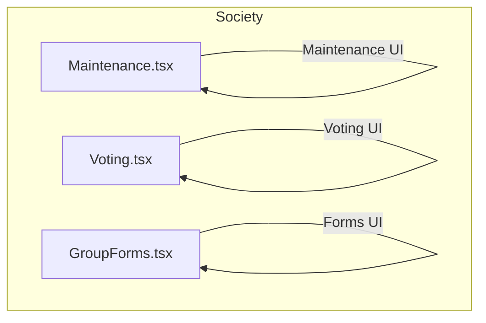
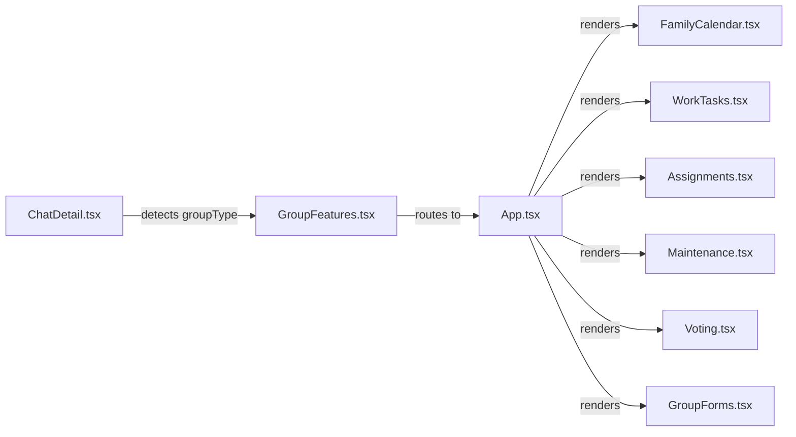

# Group Collaboration

<cite>
**Referenced Files in This Document**
- [GroupFeatures.tsx](file://src/components/GroupFeatures.tsx)
- [App.tsx](file://src/App.tsx)
- [ChatDetail.tsx](file://src/pages/ChatDetail.tsx)
- [FamilyCalendar.tsx](file://src/pages/features/FamilyCalendar.tsx)
- [WorkTasks.tsx](file://src/pages/features/WorkTasks.tsx)
- [Assignments.tsx](file://src/pages/features/Assignments.tsx)
- [Maintenance.tsx](file://src/pages/features/Maintenance.tsx)
- [Voting.tsx](file://src/pages/features/Voting.tsx)
- [GroupForms.tsx](file://src/pages/features/GroupForms.tsx)
- [chat.data.ts](file://src/data/chat.data.ts)
</cite>

## Table of Contents
1. [Introduction](#introduction)
2. [Project Structure](#project-structure)
3. [Core Components](#core-components)
4. [Architecture Overview](#architecture-overview)
5. [Detailed Component Analysis](#detailed-component-analysis)
6. [Dependency Analysis](#dependency-analysis)
7. [Performance Considerations](#performance-considerations)
8. [Security and Scalability](#security-and-scalability)
9. [Troubleshooting Guide](#troubleshooting-guide)
10. [Conclusion](#conclusion)

## Introduction
This document explains VChat’s group collaboration system that enables family groups, work groups, education groups, and society groups. It covers the group type system, feature discovery mechanism, context-aware UI, and permission management. It also documents the family group features (shared calendar, sync lists, live location, medicine reminders, family wallet, emergency SOS, family album, and kids mode), work group features (task management, meetings, file sharing, leave requests, approvals, project tracking, attendance, and forms), education group features (assignment management, attendance tracking, doubt threads, timetable, announcements, quiz system, and study materials), and society group features (maintenance management, visitor logs, complaints, voting, notice board, parking, directory, and forms). Finally, it addresses membership management, permission hierarchies, cross-group communication patterns, scalability, performance, and security.

## Project Structure
VChat organizes group collaboration around:
- A group feature launcher component that renders a contextual grid of applets based on group type.
- Route-driven feature pages for each group type and feature.
- A chat detail page that exposes a “Features” affordance for group chats.

**Diagram sources**
- [GroupFeatures.tsx:14-154](file://src/components/GroupFeatures.tsx#L14-L154)
- [ChatDetail.tsx:1-200](file://src/pages/ChatDetail.tsx#L1-L200)
- [App.tsx:122-129](file://src/App.tsx#L122-L129)

**Section sources**
- [GroupFeatures.tsx:14-154](file://src/components/GroupFeatures.tsx#L14-L154)
- [App.tsx:122-129](file://src/App.tsx#L122-L129)
- [ChatDetail.tsx:1-200](file://src/pages/ChatDetail.tsx#L1-L200)

## Core Components
- GroupFeatures: Renders a dynamic grid of group features based on group type and navigates to the selected feature route.
- ChatDetail: Displays chat UI and exposes a “Features” button for group chats, launching the feature grid.
- Feature Pages: Dedicated pages for each group type and feature (e.g., Family Calendar, Work Tasks, Assignments, Maintenance, Voting, Group Forms).

Key behaviors:
- Group type detection in chat detail identifies group type from the chat identifier.
- Feature grid maps group type to a curated set of features with icons, titles, descriptions, and routes.
- Routing uses pattern-based paths to support generic group types and features.

**Section sources**
- [GroupFeatures.tsx:14-154](file://src/components/GroupFeatures.tsx#L14-L154)
- [ChatDetail.tsx:18-36](file://src/pages/ChatDetail.tsx#L18-L36)
- [App.tsx:122-129](file://src/App.tsx#L122-L129)

## Architecture Overview
The group collaboration architecture centers on a feature-discovery component and route-driven feature pages. The system supports:
- Group type system: family, work, education, society, and colony.
- Context-specific UI: feature grid adapts to group type.
- Cross-group communication: chat detail integrates the feature launcher.

**Diagram sources**
- [ChatDetail.tsx:18-36](file://src/pages/ChatDetail.tsx#L18-L36)
- [GroupFeatures.tsx:14-154](file://src/components/GroupFeatures.tsx#L14-L154)
- [App.tsx:122-129](file://src/App.tsx#L122-L129)

## Detailed Component Analysis

### Group Features Discovery
The GroupFeatures component:
- Accepts groupType, groupName, and groupEmoji.
- Computes a tag style and feature list based on groupType.
- Renders a grid of feature cards with icons and descriptions.
- Navigates to the selected feature route on click.

**Diagram sources**
- [GroupFeatures.tsx:14-154](file://src/components/GroupFeatures.tsx#L14-L154)

**Section sources**
- [GroupFeatures.tsx:14-154](file://src/components/GroupFeatures.tsx#L14-L154)

### Family Group Features
Family group features include:
- Shared Calendar: view and propose event times with AI assistance.
- Sync Lists: shopping and trip lists.
- Live Location: see family members.
- Medicine Reminders: health alerts.
- Family Wallet: shared expenses.
- Emergency SOS: alert all members.
- Family Album: shared photos.
- Kids Mode: safe content for children.

Implementation highlights:
- Family Calendar page displays a monthly grid, events list, and an AI scheduler banner.
- Work Tasks page demonstrates task list UI with filters and modal creation.
- Assignments page shows assignment list with status and submission controls.
- Maintenance page presents payment summary, resident list, and history.
- Voting page illustrates poll UI with progress bars and vote results.
- Group Forms page supports form listing and creation.

**Diagram sources**
- [FamilyCalendar.tsx:14-204](file://src/pages/features/FamilyCalendar.tsx#L14-L204)
- [GroupForms.tsx:12-142](file://src/pages/features/GroupForms.tsx#L12-L142)

**Section sources**
- [FamilyCalendar.tsx:14-204](file://src/pages/features/FamilyCalendar.tsx#L14-L204)
- [GroupForms.tsx:12-142](file://src/pages/features/GroupForms.tsx#L12-L142)

### Work Group Features
Work group features include:
- Tasks: assign and track work.
- Meetings: schedule with agendas.
- Files: team documents.
- Leave Requests: apply and approve leaves.
- Approvals: pending approvals.
- Projects: progress boards.
- Attendance: mark and track.
- Forms: surveys and feedback.

Implementation highlights:
- Work Tasks page showcases task list with priority, status, due dates, and penalties.
- Group Forms page supports form creation and distribution.

**Diagram sources**
- [WorkTasks.tsx:13-164](file://src/pages/features/WorkTasks.tsx#L13-L164)
- [GroupForms.tsx:12-142](file://src/pages/features/GroupForms.tsx#L12-L142)

**Section sources**
- [WorkTasks.tsx:13-164](file://src/pages/features/WorkTasks.tsx#L13-L164)
- [GroupForms.tsx:12-142](file://src/pages/features/GroupForms.tsx#L12-L142)

### Education Group Features
Education group features include:
- Assignments: submit and track deadlines.
- Attendance: student tracking.
- Doubt Threads: ask per subject.
- Timetable: exam and class schedule.
- Announcements: teacher notices.
- Quiz & Forms: tests and surveys.
- Study Materials: notes and resources.
- Leaderboard: top performers.

Implementation highlights:
- Assignments page shows subject color coding, due dates, and submission states.

**Diagram sources**
- [Assignments.tsx:13-103](file://src/pages/features/Assignments.tsx#L13-L103)

**Section sources**
- [Assignments.tsx:13-103](file://src/pages/features/Assignments.tsx#L13-L103)

### Society Group Features
Society group features include:
- Maintenance: pay and track dues.
- Visitor Log: entry and exit records.
- Complaints: raise and track issues.
- Voting: community decisions.
- Notice Board: official announcements.
- Parking: slot management.
- Directory: emergency contacts.
- Forms: requests and surveys.

Implementation highlights:
- Maintenance page shows payment summary, resident list, and history.
- Voting page displays active and past polls with results.

**Diagram sources**
- [Maintenance.tsx:14-131](file://src/pages/features/Maintenance.tsx#L14-L131)
- [Voting.tsx:6-105](file://src/pages/features/Voting.tsx#L6-L105)
- [GroupForms.tsx:12-142](file://src/pages/features/GroupForms.tsx#L12-L142)

**Section sources**
- [Maintenance.tsx:14-131](file://src/pages/features/Maintenance.tsx#L14-L131)
- [Voting.tsx:6-105](file://src/pages/features/Voting.tsx#L6-L105)
- [GroupForms.tsx:12-142](file://src/pages/features/GroupForms.tsx#L12-L142)

### Colony Group Features
Colony group features include:
- Local News: alerts and updates.
- Lost & Found: report and find items.
- Local Market: buy and sell nearby.
- Events: colony calendar.
- Utility Alerts: power and water outages.
- Vendors: trusted local services.
- Polls: community opinions.
- Forms: registrations and requests.

Note: The feature grid includes a “colony” option. Specific pages for these features are not present in the current codebase and are represented by placeholders in routing.

**Section sources**
- [GroupFeatures.tsx:74-84](file://src/components/GroupFeatures.tsx#L74-L84)
- [App.tsx:127-129](file://src/App.tsx#L127-L129)

## Dependency Analysis
Group collaboration depends on:
- ChatDetail detecting group type from chat identifiers and exposing the feature launcher.
- GroupFeatures mapping groupType to feature sets and routes.
- App routing supporting generic group routes with type and feature segments.

**Diagram sources**
- [ChatDetail.tsx:18-36](file://src/pages/ChatDetail.tsx#L18-L36)
- [GroupFeatures.tsx:14-154](file://src/components/GroupFeatures.tsx#L14-L154)
- [App.tsx:122-129](file://src/App.tsx#L122-L129)

**Section sources**
- [ChatDetail.tsx:18-36](file://src/pages/ChatDetail.tsx#L18-L36)
- [GroupFeatures.tsx:14-154](file://src/components/GroupFeatures.tsx#L14-L154)
- [App.tsx:122-129](file://src/App.tsx#L122-L129)

## Performance Considerations
- Lazy loading: Feature pages are lazy-loaded via React.lazy in App routing, reducing initial bundle size.
- Animations: Framer Motion animations are used for modals and transitions; keep animation complexity minimal for large groups.
- Virtualization: For very large lists (e.g., forms, tasks), consider virtualized lists to improve rendering performance.
- Debounced inputs: For search and filters, debounce user input to reduce re-renders.
- Efficient state updates: Use granular state updates and avoid unnecessary re-renders in feature pages.

[No sources needed since this section provides general guidance]

## Security and Scalability
- Authentication and authorization: Ensure group membership and permissions are enforced server-side before rendering feature pages.
- Data privacy: Sensitive data (e.g., family wallet, medical reminders, attendance) should be encrypted at rest and in transit.
- Rate limiting: Apply rate limits on actions like SOS alerts, voting, and form submissions.
- Scalability:
  - Horizontal scaling: Stateless feature pages enable easy horizontal scaling.
  - Caching: Cache static feature metadata and non-sensitive lists.
  - Real-time collaboration: Use efficient real-time protocols (e.g., WebSockets) with message batching and presence updates.
  - Pagination: Implement pagination for long lists (e.g., forms, announcements).
- Audit trails: Log administrative actions (e.g., approvals, voting changes) for accountability.

[No sources needed since this section provides general guidance]

## Troubleshooting Guide
Common issues and resolutions:
- Feature grid not appearing:
  - Verify group type detection in chat detail and that the “Features” button is visible for group chats.
  - Confirm that groupType is passed correctly to GroupFeatures.
- Navigation to feature page fails:
  - Ensure the route pattern matches the feature route (e.g., /group/:type/:feature).
  - Check that the feature route exists in App routing.
- Missing feature pages:
  - Some features may be placeholders; implement dedicated pages or update routing accordingly.
- Styling inconsistencies:
  - Confirm theme tokens and CSS variables are applied consistently across feature pages.

**Section sources**
- [ChatDetail.tsx:18-36](file://src/pages/ChatDetail.tsx#L18-L36)
- [GroupFeatures.tsx:14-154](file://src/components/GroupFeatures.tsx#L14-L154)
- [App.tsx:122-129](file://src/App.tsx#L122-L129)

## Conclusion
VChat’s group collaboration system leverages a type-aware feature discovery component integrated into the chat experience. The routing model supports scalable, modular feature pages for family, work, education, society, and colony groups. While several features are represented by placeholders, the architecture provides a clear foundation for implementing advanced collaboration capabilities, including real-time updates, robust permissions, and performance optimizations suitable for large-scale deployments.