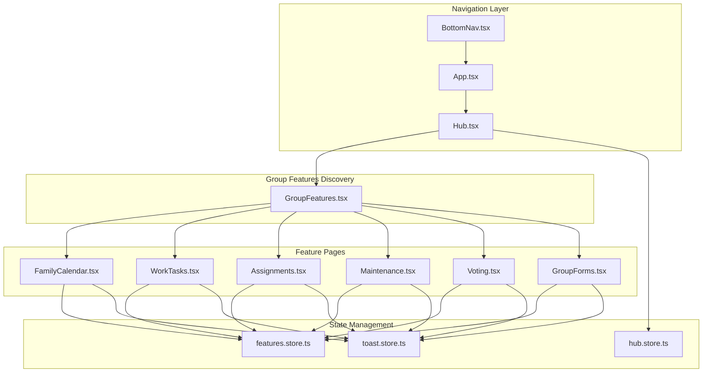
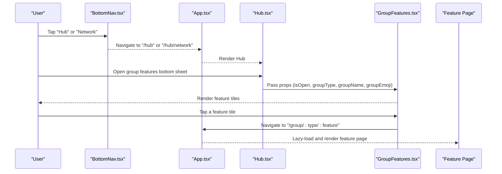
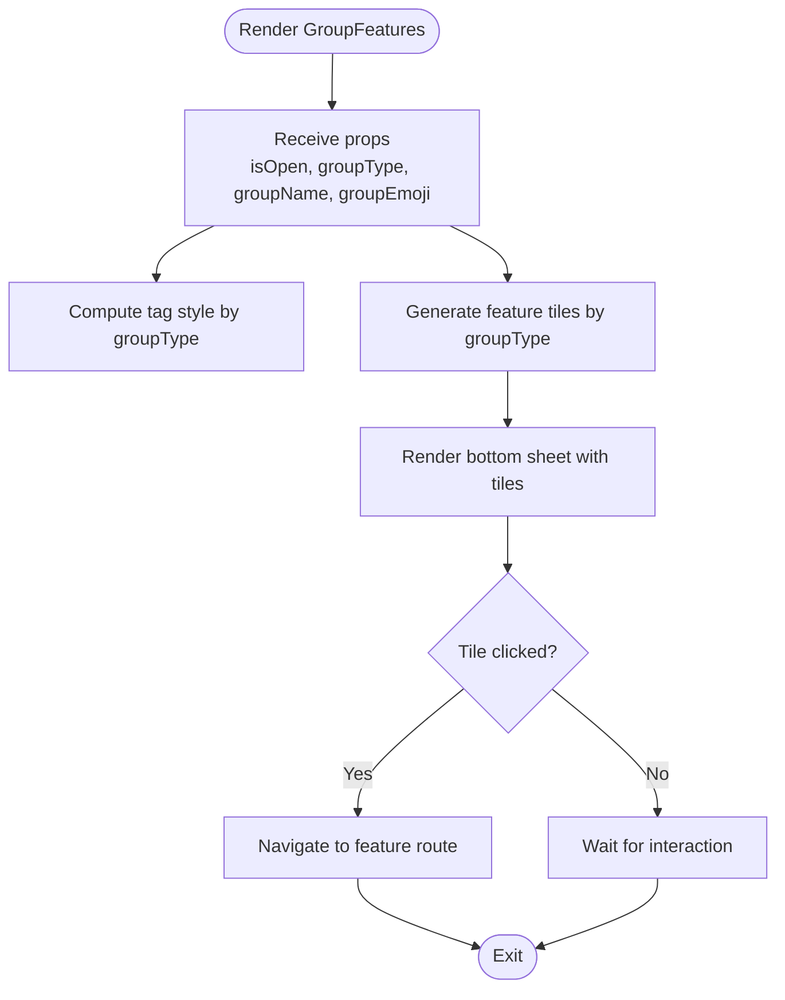
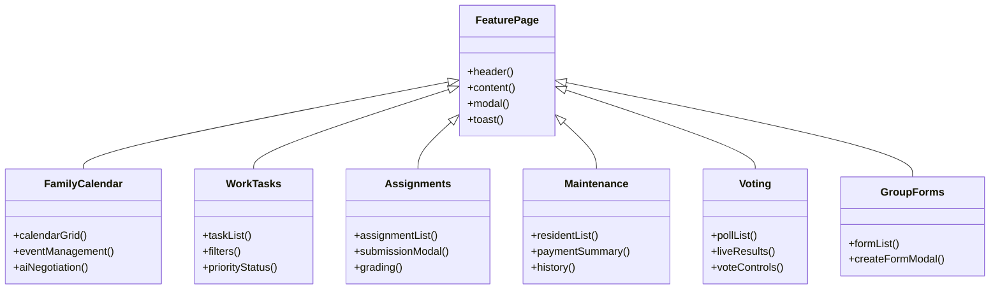
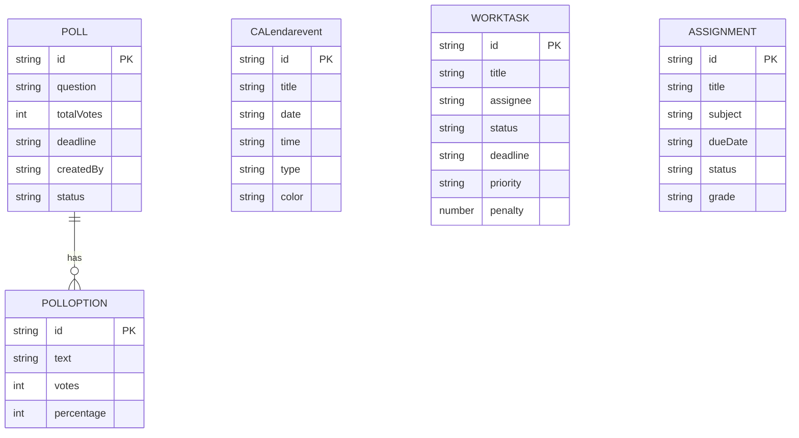
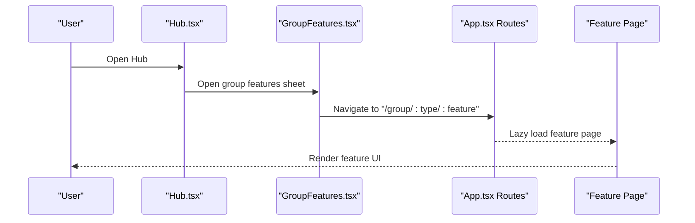
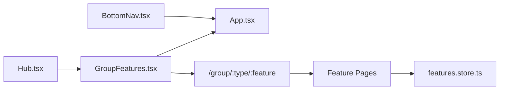

# Group Features Architecture

<cite>
**Referenced Files in This Document**
- [GroupFeatures.tsx](file://src/components/GroupFeatures.tsx)
- [Hub.tsx](file://src/pages/Hub.tsx)
- [App.tsx](file://src/App.tsx)
- [BottomNav.tsx](file://src/components/BottomNav.tsx)
- [FamilyCalendar.tsx](file://src/pages/features/FamilyCalendar.tsx)
- [WorkTasks.tsx](file://src/pages/features/WorkTasks.tsx)
- [Assignments.tsx](file://src/pages/features/Assignments.tsx)
- [Maintenance.tsx](file://src/pages/features/Maintenance.tsx)
- [Voting.tsx](file://src/pages/features/Voting.tsx)
- [GroupForms.tsx](file://src/pages/features/GroupForms.tsx)
- [features.store.ts](file://src/store/features.store.ts)
- [hub.store.ts](file://src/store/hub.store.ts)
- [toast.store.ts](file://src/store/toast.store.ts)
</cite>

## Table of Contents
1. [Introduction](#introduction)
2. [Project Structure](#project-structure)
3. [Core Components](#core-components)
4. [Architecture Overview](#architecture-overview)
5. [Detailed Component Analysis](#detailed-component-analysis)
6. [Dependency Analysis](#dependency-analysis)
7. [Performance Considerations](#performance-considerations)
8. [Troubleshooting Guide](#troubleshooting-guide)
9. [Conclusion](#conclusion)

## Introduction
This document explains the group features architecture that powers context-aware feature sets for family, work, education, society, and colony groups. It covers the group type system, dynamic feature discovery, context-specific UI rendering, permission management framework, extensibility for new group types and custom feature modules, component composition patterns, prop interfaces, state management, navigation integration, and performance considerations for large feature sets.

## Project Structure
The group features system spans three primary areas:
- Feature discovery and presentation: a bottom-sheet component that renders group-specific feature tiles based on group type
- Feature pages: individual pages implementing domain-specific UIs for each group type
- State management: centralized stores for group features and shared UI state

**Diagram sources**
- [BottomNav.tsx:1-62](file://src/components/BottomNav.tsx#L1-L62)
- [App.tsx:1-156](file://src/App.tsx#L1-L156)
- [Hub.tsx:1-300](file://src/pages/Hub.tsx#L1-L300)
- [GroupFeatures.tsx:1-154](file://src/components/GroupFeatures.tsx#L1-L154)
- [FamilyCalendar.tsx:1-276](file://src/pages/features/FamilyCalendar.tsx#L1-L276)
- [WorkTasks.tsx:1-246](file://src/pages/features/WorkTasks.tsx#L1-L246)
- [Assignments.tsx:1-195](file://src/pages/features/Assignments.tsx#L1-L195)
- [Maintenance.tsx:1-131](file://src/pages/features/Maintenance.tsx#L1-L131)
- [Voting.tsx:1-116](file://src/pages/features/Voting.tsx#L1-L116)
- [GroupForms.tsx:1-142](file://src/pages/features/GroupForms.tsx#L1-L142)
- [features.store.ts:1-385](file://src/store/features.store.ts#L1-L385)
- [hub.store.ts:1-271](file://src/store/hub.store.ts#L1-L271)
- [toast.store.ts:1-39](file://src/store/toast.store.ts#L1-L39)

**Section sources**
- [App.tsx:1-156](file://src/App.tsx#L1-L156)
- [Hub.tsx:1-300](file://src/pages/Hub.tsx#L1-L300)
- [GroupFeatures.tsx:1-154](file://src/components/GroupFeatures.tsx#L1-L154)

## Core Components
- GroupFeatures: Renders a bottom sheet with group-type-specific feature tiles and navigates to feature pages
- Feature pages: Domain-specific pages for family, work, education, society, and colony groups
- State stores: Centralized stores for group features, hub data, and toast notifications
- Navigation integration: Bottom navigation adapts context between hub and group feature modes

Key capabilities:
- Dynamic feature discovery: groupType drives feature tile generation
- Context-aware UI: Each feature page implements its own UI patterns and state
- Permission management: Access control via route guards and feature availability
- Extensibility: New group types and features can be added with minimal changes

**Section sources**
- [GroupFeatures.tsx:6-154](file://src/components/GroupFeatures.tsx#L6-L154)
- [features.store.ts:51-78](file://src/store/features.store.ts#L51-L78)
- [BottomNav.tsx:9-23](file://src/components/BottomNav.tsx#L9-L23)

## Architecture Overview
The architecture follows a layered pattern:
- Presentation layer: GroupFeatures bottom sheet and feature pages
- Routing layer: App routes define group feature URLs and lazy-loading
- State layer: Zustand stores manage cross-feature state and persistence
- Navigation layer: BottomNav adapts based on current context (hub vs group)

**Diagram sources**
- [BottomNav.tsx:9-23](file://src/components/BottomNav.tsx#L9-L23)
- [App.tsx:66-133](file://src/App.tsx#L66-L133)
- [Hub.tsx:1-300](file://src/pages/Hub.tsx#L1-L300)
- [GroupFeatures.tsx:14-154](file://src/components/GroupFeatures.tsx#L14-L154)

## Detailed Component Analysis

### GroupFeatures Component
Responsibilities:
- Accepts group metadata (type, name, emoji)
- Computes tag styling based on group type
- Generates feature tiles for the given group type
- Handles navigation to feature pages
- Implements animated bottom sheet UI with Framer Motion

Prop interfaces:
- isOpen: boolean
- onClose: () => void
- groupType: 'family' | 'work' | 'education' | 'society' | 'colony'
- groupName: string
- groupEmoji: string

Rendering logic:
- Tag styling computed via switch(groupType)
- Feature tiles generated via switch(groupType)
- Each tile includes icon, title, description, and route
- Alert-style tiles supported for emergency features

**Diagram sources**
- [GroupFeatures.tsx:14-154](file://src/components/GroupFeatures.tsx#L14-L154)

**Section sources**
- [GroupFeatures.tsx:6-154](file://src/components/GroupFeatures.tsx#L6-L154)

### Feature Pages Composition Patterns
Each feature page follows a consistent composition pattern:
- Header with back navigation and action buttons
- Content area with domain-specific UI
- Modal dialogs for creation/editing actions
- Toast integration for user feedback

Representative pages:
- FamilyCalendar: Calendar grid, event management, AI negotiation banner
- WorkTasks: Task list with filters, priority/status indicators, assignment avatars
- Assignments: Assignment list with submission modal, grading states
- Maintenance: Resident payment tracking, history, summary cards
- Voting: Poll list with live results, voting controls
- GroupForms: Form list with creation modal

**Diagram sources**
- [FamilyCalendar.tsx:8-276](file://src/pages/features/FamilyCalendar.tsx#L8-L276)
- [WorkTasks.tsx:8-246](file://src/pages/features/WorkTasks.tsx#L8-L246)
- [Assignments.tsx:8-195](file://src/pages/features/Assignments.tsx#L8-L195)
- [Maintenance.tsx:14-131](file://src/pages/features/Maintenance.tsx#L14-L131)
- [Voting.tsx:7-116](file://src/pages/features/Voting.tsx#L7-L116)
- [GroupForms.tsx:12-142](file://src/pages/features/GroupForms.tsx#L12-L142)

**Section sources**
- [FamilyCalendar.tsx:1-276](file://src/pages/features/FamilyCalendar.tsx#L1-L276)
- [WorkTasks.tsx:1-246](file://src/pages/features/WorkTasks.tsx#L1-L246)
- [Assignments.tsx:1-195](file://src/pages/features/Assignments.tsx#L1-L195)
- [Maintenance.tsx:1-131](file://src/pages/features/Maintenance.tsx#L1-L131)
- [Voting.tsx:1-116](file://src/pages/features/Voting.tsx#L1-L116)
- [GroupForms.tsx:1-142](file://src/pages/features/GroupForms.tsx#L1-L142)

### State Management for Group Features
The features store encapsulates:
- Polls and user votes for community voting
- Calendar events with type and color coding
- Work tasks with status, priority, and penalties
- Assignments with submission tracking and grades

Actions include voting, adding/deleting events, task completion toggling, assignment submission, and filter management. Persistence is handled via Zustand middleware to maintain state across sessions.

**Diagram sources**
- [features.store.ts:4-49](file://src/store/features.store.ts#L4-L49)

**Section sources**
- [features.store.ts:51-385](file://src/store/features.store.ts#L51-L385)

### Navigation Integration and Hub Access
The navigation system integrates group features through:
- BottomNav adapts labels and targets based on current route context
- App routes define lazy-loaded group feature pages
- Hub page serves as the entry point for group feature discovery

**Diagram sources**
- [BottomNav.tsx:9-23](file://src/components/BottomNav.tsx#L9-L23)
- [App.tsx:118-129](file://src/App.tsx#L118-L129)
- [Hub.tsx:1-300](file://src/pages/Hub.tsx#L1-L300)
- [GroupFeatures.tsx:135-138](file://src/components/GroupFeatures.tsx#L135-L138)

**Section sources**
- [BottomNav.tsx:1-62](file://src/components/BottomNav.tsx#L1-L62)
- [App.tsx:66-133](file://src/App.tsx#L66-L133)
- [Hub.tsx:1-300](file://src/pages/Hub.tsx#L1-L300)

## Dependency Analysis
The group features architecture exhibits low coupling and high cohesion:
- GroupFeatures depends only on routing and styling
- Feature pages depend on shared stores and UI patterns
- State stores are independent and reusable
- Navigation adapts context without hardcoding feature logic

**Diagram sources**
- [GroupFeatures.tsx:1-154](file://src/components/GroupFeatures.tsx#L1-L154)
- [App.tsx:118-129](file://src/App.tsx#L118-L129)
- [Hub.tsx:1-300](file://src/pages/Hub.tsx#L1-L300)
- [BottomNav.tsx:1-62](file://src/components/BottomNav.tsx#L1-L62)
- [features.store.ts:1-385](file://src/store/features.store.ts#L1-L385)

**Section sources**
- [App.tsx:118-129](file://src/App.tsx#L118-L129)
- [GroupFeatures.tsx:1-154](file://src/components/GroupFeatures.tsx#L1-L154)

## Performance Considerations
- Lazy loading: All feature pages are lazy-loaded via React.lazy to reduce initial bundle size
- Animation optimization: Framer Motion animations are scoped to bottom sheets and modals to minimize layout thrashing
- State persistence: Zustand persistence avoids reinitializing large datasets on each session
- Rendering patterns: Feature pages use virtualized lists where applicable and avoid unnecessary re-renders through selective state updates
- Memory management: Toast store automatically cleans up messages after duration to prevent memory leaks

Recommendations:
- Consider code-splitting for heavy feature pages
- Debounce search inputs in feature pages that support filtering
- Use memoization for expensive computations in feature lists
- Monitor bundle sizes and split features further if needed

[No sources needed since this section provides general guidance]

## Troubleshooting Guide
Common issues and resolutions:
- Feature tiles not appearing: Verify groupType matches supported values and routes exist in App routes
- Navigation failures: Ensure route params (:type, :feature) are correctly defined in App routes
- State not persisting: Confirm Zustand persistence middleware is configured and storage keys are unique
- Toast messages not clearing: Check toast store actions and duration settings

Debugging tips:
- Inspect console for lazy-loading errors
- Verify store state updates with React DevTools
- Test navigation transitions with browser devtools
- Confirm feature page props are passed correctly from GroupFeatures

**Section sources**
- [App.tsx:118-129](file://src/App.tsx#L118-L129)
- [toast.store.ts:17-38](file://src/store/toast.store.ts#L17-L38)

## Conclusion
The group features architecture provides a scalable, context-aware system for delivering domain-specific functionality across multiple group types. Its modular design, dynamic feature discovery, and robust state management enable easy extension and maintenance. The integration with navigation and hub interfaces ensures seamless user experiences while supporting future growth with additional group types and feature modules.