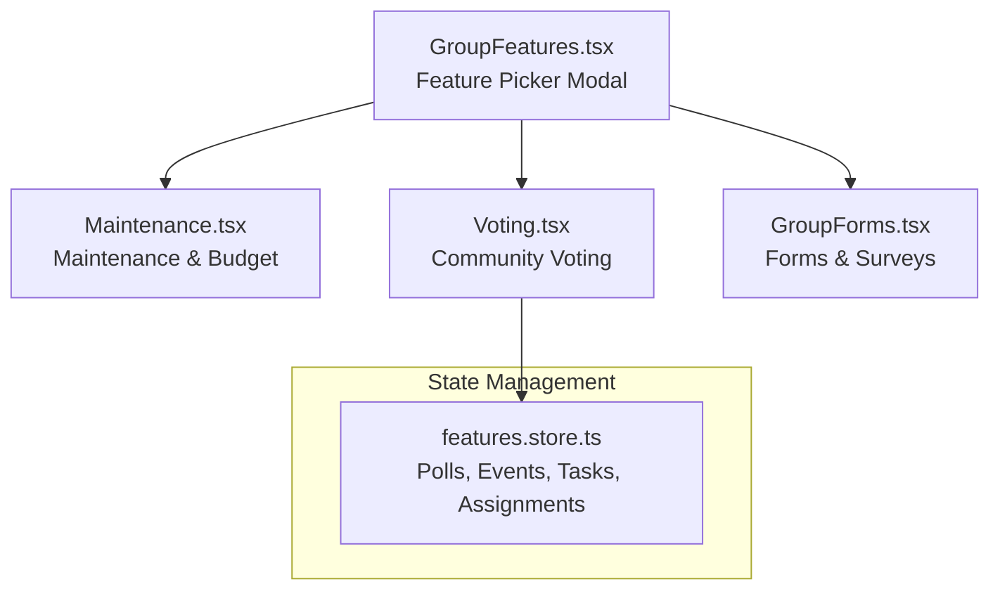
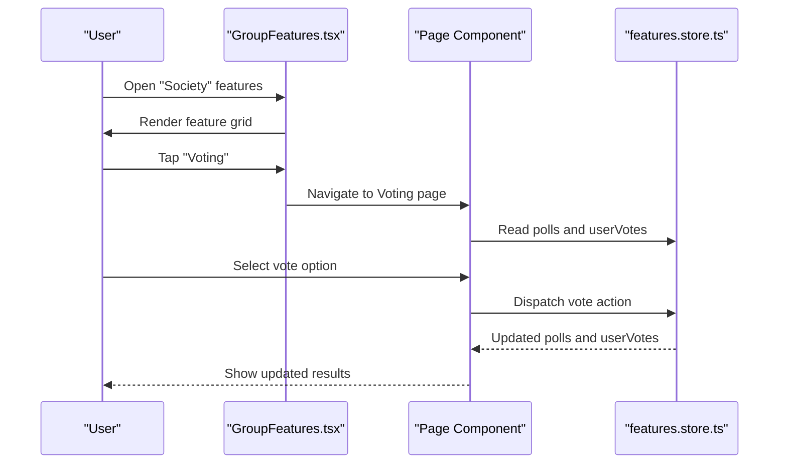
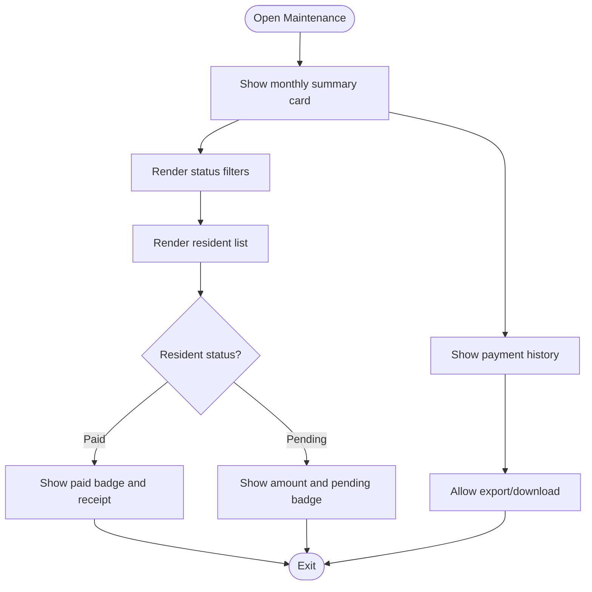
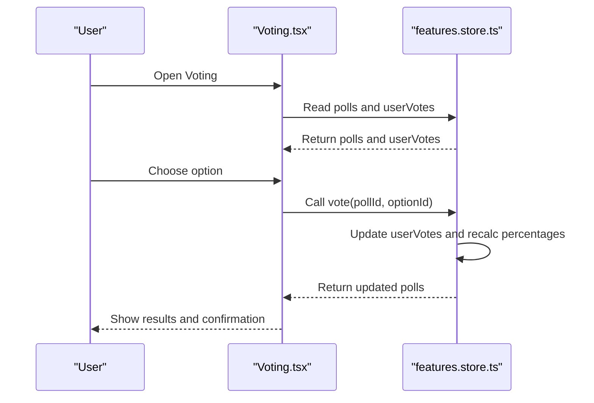
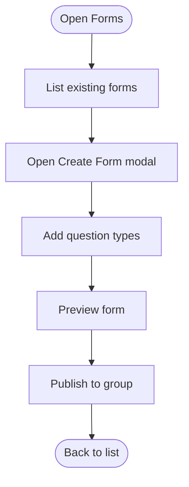
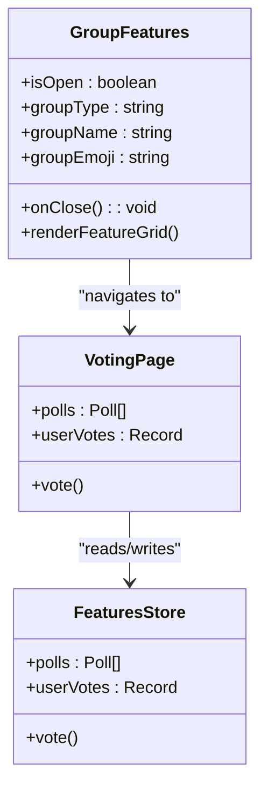
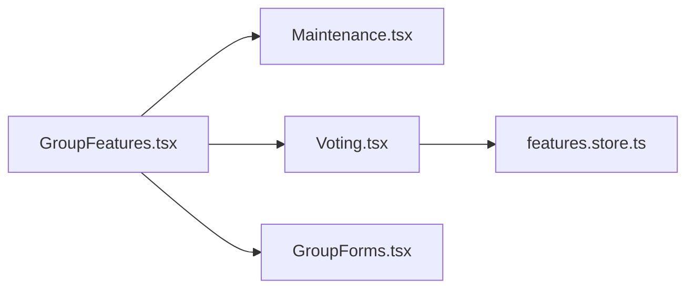

# Society Groups

<cite>
**Referenced Files in This Document**
- [GroupFeatures.tsx](file://src/components/GroupFeatures.tsx)
- [Maintenance.tsx](file://src/pages/features/Maintenance.tsx)
- [Voting.tsx](file://src/pages/features/Voting.tsx)
- [GroupForms.tsx](file://src/pages/features/GroupForms.tsx)
- [features.store.ts](file://src/store/features.store.ts)
</cite>

## Table of Contents
1. [Introduction](#introduction)
2. [Project Structure](#project-structure)
3. [Core Components](#core-components)
4. [Architecture Overview](#architecture-overview)
5. [Detailed Component Analysis](#detailed-component-analysis)
6. [Dependency Analysis](#dependency-analysis)
7. [Performance Considerations](#performance-considerations)
8. [Troubleshooting Guide](#troubleshooting-guide)
9. [Conclusion](#conclusion)

## Introduction
This document explains the society group collaboration features implemented in the application. It focuses on the maintenance management system (repair requests, contractor coordination, budget tracking, and maintenance scheduling), visitor log system (guest registration, access control, security integration, and visitor analytics), complaint system (resident grievances, issue tracking, resolution workflows, and feedback management), voting system (election setup, ballot creation, vote counting, and result publication), notice board system (community announcements, meeting minutes, and official communications), parking management system (parking space allocation, vehicle registration, payment processing, and availability tracking), directory services (resident information, emergency contacts, and community resources), forms system (membership applications, facility bookings, and community initiatives), and community engagement tools for decision-making and administrative workflows.

## Project Structure
The society group features are surfaced via a feature picker modal that routes users to dedicated pages for each domain. The store manages shared state for polls and related features. The pages implement UI and interactions for each feature area.

**Diagram sources**
- [GroupFeatures.tsx:63-73](file://src/components/GroupFeatures.tsx#L63-L73)
- [Maintenance.tsx:14](file://src/pages/features/Maintenance.tsx#L14)
- [Voting.tsx:7](file://src/pages/features/Voting.tsx#L7)
- [GroupForms.tsx:12](file://src/pages/features/GroupForms.tsx#L12)
- [features.store.ts:51-78](file://src/store/features.store.ts#L51-L78)

**Section sources**
- [GroupFeatures.tsx:63-73](file://src/components/GroupFeatures.tsx#L63-L73)
- [features.store.ts:51-78](file://src/store/features.store.ts#L51-L78)

## Core Components
- Feature Picker Modal: Presents society-specific features and navigates to respective pages.
- Maintenance Page: Summarizes dues, resident status, filters, payment history, and actions.
- Voting Page: Displays active and past polls, allows casting votes, and shows results.
- Forms Page: Lists open/closed forms, supports creating new forms, and submission.
- Store: Provides poll state, user votes, and actions to update them.

**Section sources**
- [GroupFeatures.tsx:14-154](file://src/components/GroupFeatures.tsx#L14-L154)
- [Maintenance.tsx:14-131](file://src/pages/features/Maintenance.tsx#L14-L131)
- [Voting.tsx:7-116](file://src/pages/features/Voting.tsx#L7-L116)
- [GroupForms.tsx:12-142](file://src/pages/features/GroupForms.tsx#L12-L142)
- [features.store.ts:51-78](file://src/store/features.store.ts#L51-L78)

## Architecture Overview
The society group collaboration architecture centers on a feature picker that routes to domain-specific pages. Voting integrates with a shared store for poll state and user votes. Maintenance and Forms pages render UI and handle user interactions, while the store persists and updates state.

**Diagram sources**
- [GroupFeatures.tsx:130-147](file://src/components/GroupFeatures.tsx#L130-L147)
- [Voting.tsx:9](file://src/pages/features/Voting.tsx#L9)
- [features.store.ts:268-314](file://src/store/features.store.ts#L268-L314)

## Detailed Component Analysis

### Maintenance Management System
The Maintenance page provides:
- Monthly summary card with due amounts and pay-now action
- Tabs to filter residents by status (All, Paid, Pending)
- Resident list with flat, name, amount/status, and actions
- Payment history entries with download option

**Diagram sources**
- [Maintenance.tsx:38-125](file://src/pages/features/Maintenance.tsx#L38-L125)

**Section sources**
- [Maintenance.tsx:14-131](file://src/pages/features/Maintenance.tsx#L14-L131)

### Visitor Log System
The feature picker exposes a “Visitor Log” entry for society groups. While the specific visitor log page is not present in the current codebase snapshot, the presence of the feature indicates planned support for:
- Guest registration and check-in/check-out
- Access control and security integration
- Visitor analytics and reporting

This component would integrate with the feature picker and likely rely on shared navigation and state patterns used elsewhere.

**Section sources**
- [GroupFeatures.tsx:66](file://src/components/GroupFeatures.tsx#L66)

### Complaint System
The feature picker exposes a “Complaints” entry for society groups. The absence of a dedicated page in the current snapshot suggests this feature is not yet implemented. It would typically include:
- Resident submission of grievances
- Issue tracking and status updates
- Resolution workflows and feedback management

**Section sources**
- [GroupFeatures.tsx:67](file://src/components/GroupFeatures.tsx#L67)

### Voting System
The Voting page and store implement:
- Active polls with options, total votes, and deadlines
- Past polls with winners and results
- Vote casting with real-time result updates
- User vote persistence and recalculation of percentages

**Diagram sources**
- [Voting.tsx:28-90](file://src/pages/features/Voting.tsx#L28-L90)
- [features.store.ts:268-314](file://src/store/features.store.ts#L268-L314)

**Section sources**
- [Voting.tsx:7-116](file://src/pages/features/Voting.tsx#L7-L116)
- [features.store.ts:51-78](file://src/store/features.store.ts#L51-L78)
- [features.store.ts:91-128](file://src/store/features.store.ts#L91-L128)
- [features.store.ts:268-314](file://src/store/features.store.ts#L268-L314)

### Notice Board System
The feature picker exposes a “Notice Board” entry for society groups. The absence of a dedicated page in the current snapshot indicates this feature is not yet implemented. It would typically include:
- Community announcements and official communications
- Meeting minutes and archival
- Publication workflows and distribution

**Section sources**
- [GroupFeatures.tsx:69](file://src/components/GroupFeatures.tsx#L69)

### Parking Management System
The feature picker exposes a “Parking” entry for society groups. The absence of a dedicated page in the current snapshot indicates this feature is not yet implemented. It would typically include:
- Parking space allocation and availability tracking
- Vehicle registration and permit management
- Payment processing and billing

**Section sources**
- [GroupFeatures.tsx:70](file://src/components/GroupFeatures.tsx#L70)

### Directory Services
The feature picker exposes a “Directory” entry for society groups. The absence of a dedicated page in the current snapshot indicates this feature is not yet implemented. It would typically include:
- Resident information and contact details
- Emergency contacts and quick-access dialing
- Community resources and service providers

**Section sources**
- [GroupFeatures.tsx:71](file://src/components/GroupFeatures.tsx#L71)

### Forms System
The Forms page provides:
- Listing of open and closed forms with author and response counts
- Ability to create new forms with question types (short text, multiple choice, rating scale, yes/no)
- Publishing forms to the group

**Diagram sources**
- [GroupForms.tsx:38-70](file://src/pages/features/GroupForms.tsx#L38-L70)
- [GroupForms.tsx:74-137](file://src/pages/features/GroupForms.tsx#L74-L137)

**Section sources**
- [GroupForms.tsx:12-142](file://src/pages/features/GroupForms.tsx#L12-L142)

### Community Engagement Tools and Administrative Workflows
- Feature Picker Modal: Centralized access to society tools with category tagging and navigation.
- Shared Store: Manages poll state and user votes, enabling collaborative decision-making.
- Navigation Pattern: Consistent header with back navigation and contextual actions.

**Diagram sources**
- [GroupFeatures.tsx:14-154](file://src/components/GroupFeatures.tsx#L14-L154)
- [Voting.tsx:9](file://src/pages/features/Voting.tsx#L9)
- [features.store.ts:51-78](file://src/store/features.store.ts#L51-L78)

**Section sources**
- [GroupFeatures.tsx:14-154](file://src/components/GroupFeatures.tsx#L14-L154)
- [features.store.ts:51-78](file://src/store/features.store.ts#L51-L78)

## Dependency Analysis
- GroupFeatures.tsx depends on routing to feature pages and renders the feature grid for society groups.
- Voting.tsx depends on features.store.ts for polls and user votes, and dispatches vote actions.
- GroupForms.tsx depends on UI interactions for creating and publishing forms.

**Diagram sources**
- [GroupFeatures.tsx:130-147](file://src/components/GroupFeatures.tsx#L130-L147)
- [Voting.tsx:9](file://src/pages/features/Voting.tsx#L9)
- [features.store.ts:51-78](file://src/store/features.store.ts#L51-L78)

**Section sources**
- [GroupFeatures.tsx:63-73](file://src/components/GroupFeatures.tsx#L63-L73)
- [features.store.ts:51-78](file://src/store/features.store.ts#L51-L78)

## Performance Considerations
- Use virtualized lists for large datasets (residents, forms, events) to reduce DOM nodes.
- Debounce user input in form creation and search/filter operations.
- Persist frequently accessed data (polls, events) to minimize re-computation.
- Lazy-load heavy components to improve initial render performance.

## Troubleshooting Guide
- Voting not updating: Verify the vote action is dispatched and the store updates polls and userVotes atomically.
- Poll deadline handling: Ensure deadlines are parsed as dates and statuses reflect current time.
- Navigation issues: Confirm route paths in GroupFeatures.tsx match actual page routes.

**Section sources**
- [features.store.ts:268-314](file://src/store/features.store.ts#L268-L314)
- [GroupFeatures.tsx:130-147](file://src/components/GroupFeatures.tsx#L130-L147)

## Conclusion
The society group collaboration features are structured around a feature picker and dedicated pages for maintenance, voting, and forms. The voting system is fully integrated with a shared store for state management. Visitor log, complaints, notice board, parking, and directory features are defined in the feature picker but not yet implemented in the current snapshot. The forms system supports creation and publishing of surveys. Extending the existing patterns will enable robust community governance and administrative workflows.