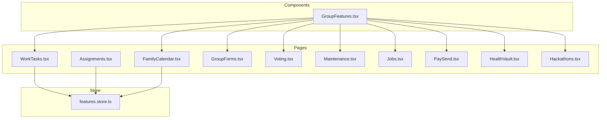
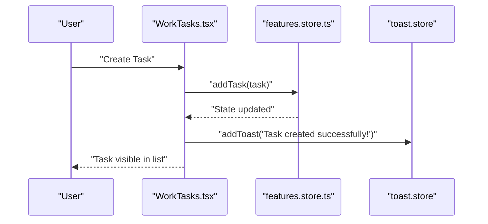
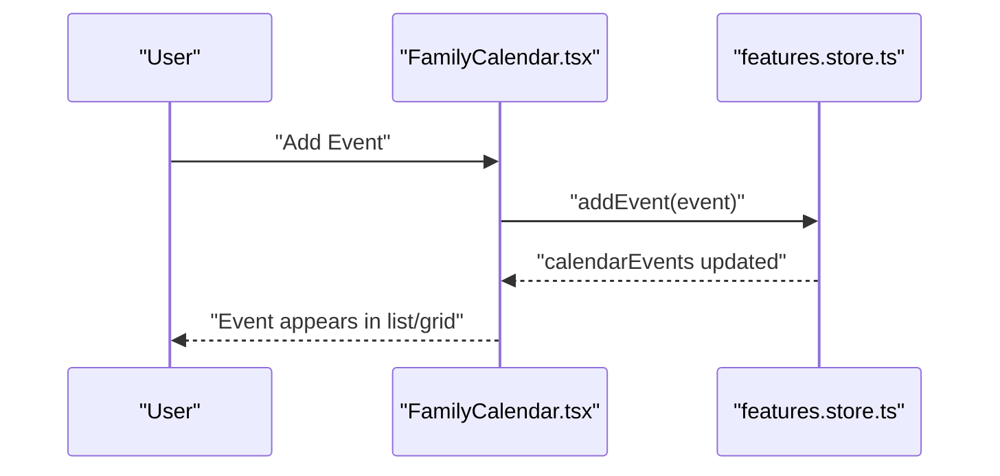
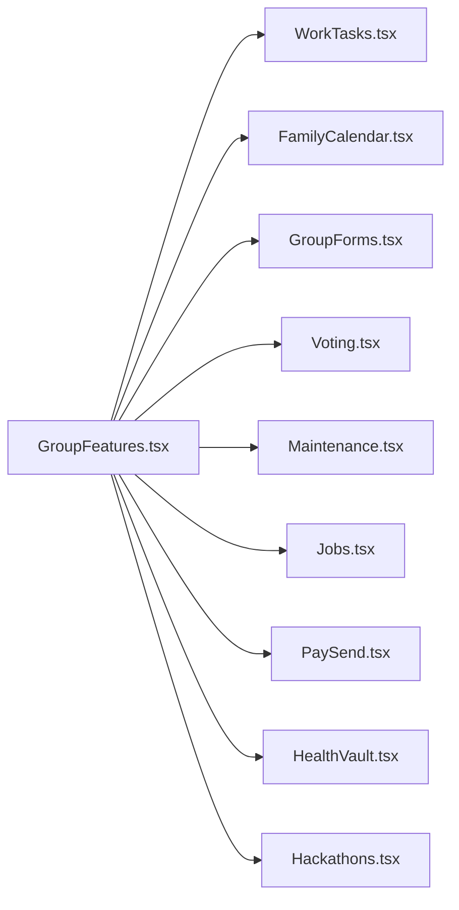
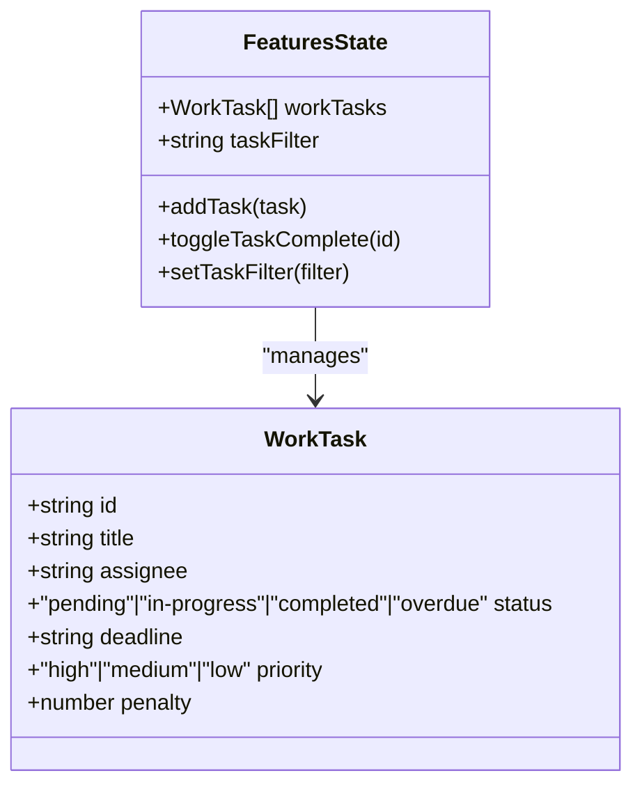
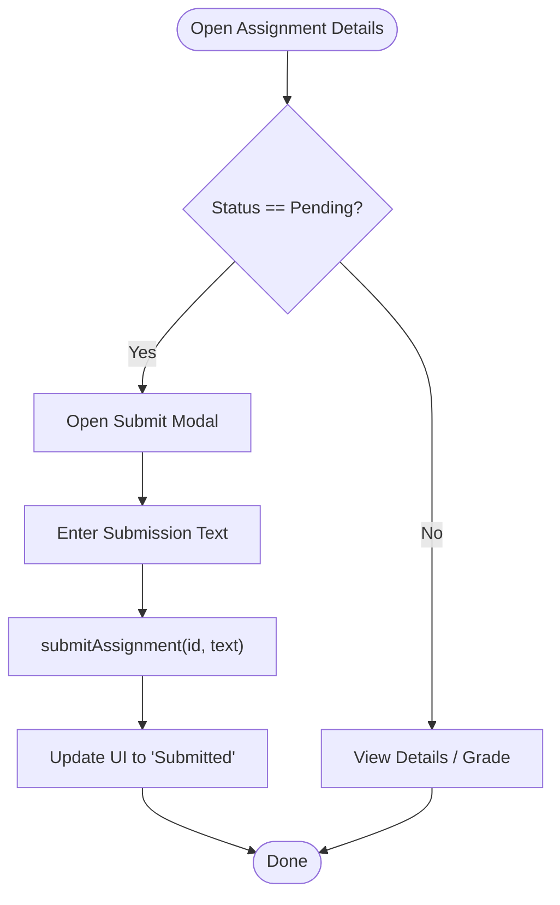
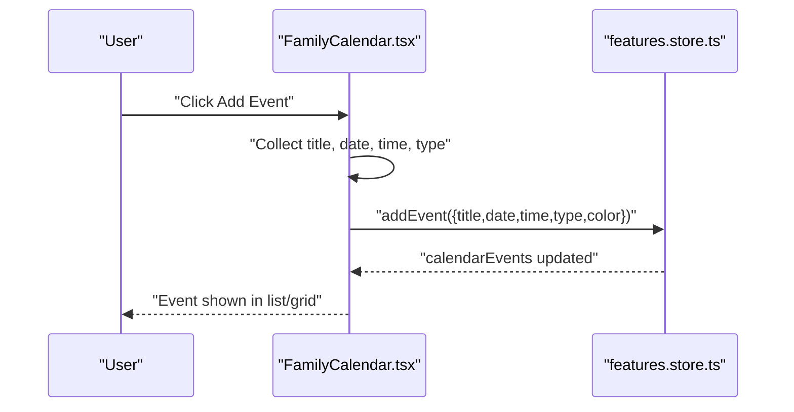
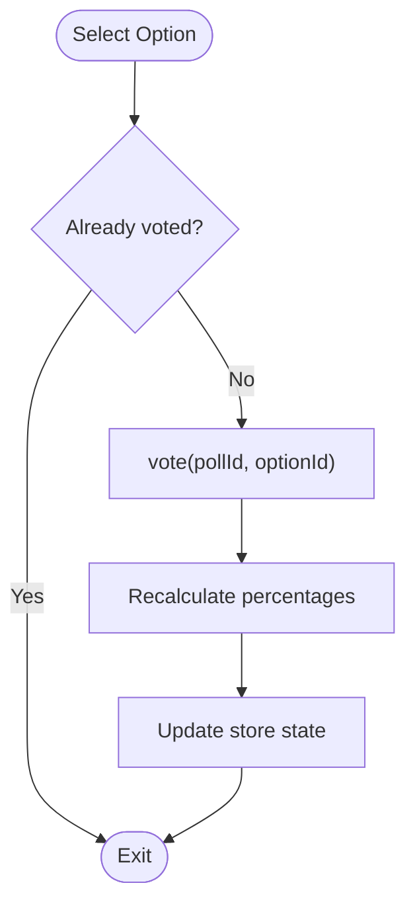
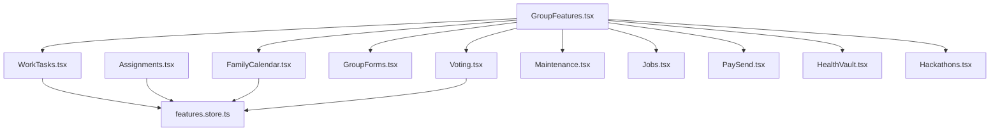

# Work Groups

<cite>
**Referenced Files in This Document**
- [WorkTasks.tsx](file://src/pages/features/WorkTasks.tsx)
- [Assignments.tsx](file://src/pages/features/Assignments.tsx)
- [FamilyCalendar.tsx](file://src/pages/features/FamilyCalendar.tsx)
- [GroupFeatures.tsx](file://src/components/GroupFeatures.tsx)
- [features.store.ts](file://src/store/features.store.ts)
- [GroupForms.tsx](file://src/pages/features/GroupForms.tsx)
- [Voting.tsx](file://src/pages/features/Voting.tsx)
- [Maintenance.tsx](file://src/pages/features/Maintenance.tsx)
- [Jobs.tsx](file://src/pages/hub/Jobs.tsx)
- [PaySend.tsx](file://src/pages/hub/PaySend.tsx)
- [HealthVault.tsx](file://src/pages/hub/HealthVault.tsx)
- [Hackathons.tsx](file://src/pages/hub/Hackathons.tsx)
</cite>

## Table of Contents
1. [Introduction](#introduction)
2. [Project Structure](#project-structure)
3. [Core Components](#core-components)
4. [Architecture Overview](#architecture-overview)
5. [Detailed Component Analysis](#detailed-component-analysis)
6. [Dependency Analysis](#dependency-analysis)
7. [Performance Considerations](#performance-considerations)
8. [Troubleshooting Guide](#troubleshooting-guide)
9. [Conclusion](#conclusion)
10. [Appendices](#appendices)

## Introduction
This document explains the work group collaboration features implemented in the application. It focuses on the Work Tasks module for managing work assignments, the Family Calendar for scheduling and negotiation, the Group Forms system for surveys and feedback, and supporting features such as voting, maintenance tracking, and payment workflows. It also outlines how these features integrate with shared calendars and group navigation.

## Project Structure
The work group collaboration features are primarily implemented under:
- Pages for feature screens (Work Tasks, Assignments, Calendar, Forms, Voting)
- A shared Zustand store for state management (polls, calendar events, work tasks, assignments)
- A reusable Group Features component for group-type-specific navigation

**Diagram sources**
- [WorkTasks.tsx:1-246](file://src/pages/features/WorkTasks.tsx#L1-L246)
- [Assignments.tsx:1-195](file://src/pages/features/Assignments.tsx#L1-L195)
- [FamilyCalendar.tsx:1-276](file://src/pages/features/FamilyCalendar.tsx#L1-L276)
- [GroupForms.tsx:1-142](file://src/pages/features/GroupForms.tsx#L1-L142)
- [Voting.tsx:1-116](file://src/pages/features/Voting.tsx#L1-L116)
- [Maintenance.tsx:1-131](file://src/pages/features/Maintenance.tsx#L1-L131)
- [Jobs.tsx:1-133](file://src/pages/hub/Jobs.tsx#L1-L133)
- [PaySend.tsx:1-164](file://src/pages/hub/PaySend.tsx#L1-L164)
- [HealthVault.tsx:1-131](file://src/pages/hub/HealthVault.tsx#L1-L131)
- [Hackathons.tsx:1-76](file://src/pages/hub/Hackathons.tsx#L1-L76)
- [GroupFeatures.tsx:1-154](file://src/components/GroupFeatures.tsx#L1-L154)
- [features.store.ts:1-385](file://src/store/features.store.ts#L1-L385)

**Section sources**
- [WorkTasks.tsx:1-246](file://src/pages/features/WorkTasks.tsx#L1-L246)
- [features.store.ts:1-385](file://src/store/features.store.ts#L1-L385)
- [GroupFeatures.tsx:1-154](file://src/components/GroupFeatures.tsx#L1-L154)

## Core Components
- Work Tasks: Create, assign, prioritize, set deadlines, mark completion, and visualize penalties.
- Assignments: Track academic assignments, deadlines, and submission status.
- Family Calendar: Schedule events, visualize monthly grid, manage types, and negotiate meeting times with AI.
- Group Forms: Browse and create forms with multiple question types.
- Voting: Community polling with live vote updates and historical results.
- Maintenance: Track dues, payments, and history.
- Payments: Send money to contacts with numeric keypad and balance checks.
- Health Vault: Manage medical records, appointments, and emergency info.
- Jobs Hub: Browse and apply to jobs with AI matching and saved jobs.

**Section sources**
- [WorkTasks.tsx:1-246](file://src/pages/features/WorkTasks.tsx#L1-L246)
- [Assignments.tsx:1-195](file://src/pages/features/Assignments.tsx#L1-L195)
- [FamilyCalendar.tsx:1-276](file://src/pages/features/FamilyCalendar.tsx#L1-L276)
- [GroupForms.tsx:1-142](file://src/pages/features/GroupForms.tsx#L1-L142)
- [Voting.tsx:1-116](file://src/pages/features/Voting.tsx#L1-L116)
- [Maintenance.tsx:1-131](file://src/pages/features/Maintenance.tsx#L1-L131)
- [PaySend.tsx:1-164](file://src/pages/hub/PaySend.tsx#L1-L164)
- [HealthVault.tsx:1-131](file://src/pages/hub/HealthVault.tsx#L1-L131)
- [Jobs.tsx:1-133](file://src/pages/hub/Jobs.tsx#L1-L133)

## Architecture Overview
The Work Tasks feature integrates UI components with a centralized store for persistence and cross-feature state sharing. The Group Features component routes users to relevant screens depending on group type.

**Diagram sources**
- [WorkTasks.tsx:212-236](file://src/pages/features/WorkTasks.tsx#L212-L236)
- [features.store.ts:332-340](file://src/store/features.store.ts#L332-L340)

**Diagram sources**
- [FamilyCalendar.tsx:52-74](file://src/pages/features/FamilyCalendar.tsx#L52-L74)
- [features.store.ts:316-330](file://src/store/features.store.ts#L316-L330)

**Diagram sources**
- [GroupFeatures.tsx:28-87](file://src/components/GroupFeatures.tsx#L28-L87)
- [WorkTasks.tsx:1-246](file://src/pages/features/WorkTasks.tsx#L1-L246)
- [FamilyCalendar.tsx:1-276](file://src/pages/features/FamilyCalendar.tsx#L1-L276)
- [GroupForms.tsx:1-142](file://src/pages/features/GroupForms.tsx#L1-L142)
- [Voting.tsx:1-116](file://src/pages/features/Voting.tsx#L1-L116)
- [Maintenance.tsx:1-131](file://src/pages/features/Maintenance.tsx#L1-L131)
- [Jobs.tsx:1-133](file://src/pages/hub/Jobs.tsx#L1-L133)
- [PaySend.tsx:1-164](file://src/pages/hub/PaySend.tsx#L1-L164)
- [HealthVault.tsx:1-131](file://src/pages/hub/HealthVault.tsx#L1-L131)
- [Hackathons.tsx:1-76](file://src/pages/hub/Hackathons.tsx#L1-L76)

## Detailed Component Analysis

### Work Tasks
- Purpose: Manage work-related tasks with assignment, priority, deadline, status, and optional penalties.
- Key UI elements:
  - Task list with filters (All, Pending, In Progress, Completed)
  - Priority indicators and status badges
  - Completion toggle with feedback
  - Add Task modal with assignee selection, priority, deadline, and validation
- Store actions:
  - addTask: persists new tasks
  - toggleTaskComplete: switches task status
  - setTaskFilter: manages UI filter state
- Data model:
  - WorkTask: id, title, assignee, status, deadline, priority, optional penalty

**Diagram sources**
- [features.store.ts:31-39](file://src/store/features.store.ts#L31-L39)
- [features.store.ts:60-78](file://src/store/features.store.ts#L60-L78)

**Section sources**
- [WorkTasks.tsx:1-246](file://src/pages/features/WorkTasks.tsx#L1-L246)
- [features.store.ts:332-354](file://src/store/features.store.ts#L332-L354)

### Assignments
- Purpose: Track academic assignments with subjects, deadlines, and submission/grading status.
- Key UI elements:
  - Assignment cards with subject color coding
  - Days left indicator and due date display
  - Submit action for pending assignments
  - Submission modal with text input
- Store actions:
  - submitAssignment: marks assignment as submitted and stores submission text
  - setAssignmentFilter: manages UI filter state
- Data model:
  - Assignment: id, title, subject, dueDate, status, optional grade, optional description

**Diagram sources**
- [Assignments.tsx:35-45](file://src/pages/features/Assignments.tsx#L35-L45)
- [features.store.ts:356-367](file://src/store/features.store.ts#L356-L367)

**Section sources**
- [Assignments.tsx:1-195](file://src/pages/features/Assignments.tsx#L1-L195)
- [features.store.ts:41-49](file://src/store/features.store.ts#L41-L49)
- [features.store.ts:356-367](file://src/store/features.store.ts#L356-L367)

### Family Calendar
- Purpose: Shared calendar for family events with type categorization, participant display, and AI-driven scheduling negotiation.
- Key UI elements:
  - Monthly grid with dots indicating events per day
  - Event list with color-coded types
  - Add Event modal with date/time/type selection
  - AI Negotiation banner with animated state transitions
- Store actions:
  - addEvent: adds new calendar events
  - deleteEvent: removes events
- Data model:
  - CalendarEvent: id, title, date, time, type, color, optional participants

**Diagram sources**
- [FamilyCalendar.tsx:52-74](file://src/pages/features/FamilyCalendar.tsx#L52-L74)
- [features.store.ts:316-330](file://src/store/features.store.ts#L316-L330)

**Section sources**
- [FamilyCalendar.tsx:1-276](file://src/pages/features/FamilyCalendar.tsx#L1-L276)
- [features.store.ts:21-29](file://src/store/features.store.ts#L21-L29)
- [features.store.ts:316-330](file://src/store/features.store.ts#L316-L330)

### Group Forms
- Purpose: Browse existing forms and create new ones with multiple question types (short text, multiple choice, rating scale, yes/no).
- Key UI elements:
  - Form cards with author, response count, and status
  - Create Form modal with question builder and publish action
- Notes: This screen currently uses mock data and a static form builder UI.

**Section sources**
- [GroupForms.tsx:1-142](file://src/pages/features/GroupForms.tsx#L1-L142)

### Voting
- Purpose: Community polling with live vote updates and historical results.
- Key UI elements:
  - Active polls with percentage bars and “you voted” indicator
  - Past polls with winner and end date
- Store actions:
  - vote: updates poll options, recalculates percentages, tracks user’s single vote per poll

**Diagram sources**
- [Voting.tsx:67-75](file://src/pages/features/Voting.tsx#L67-L75)
- [features.store.ts:268-314](file://src/store/features.store.ts#L268-L314)

**Section sources**
- [Voting.tsx:1-116](file://src/pages/features/Voting.tsx#L1-L116)
- [features.store.ts:4-19](file://src/store/features.store.ts#L4-L19)
- [features.store.ts:268-314](file://src/store/features.store.ts#L268-L314)

### Maintenance
- Purpose: Track maintenance dues, resident status, and payment history.
- Key UI elements:
  - Summary card with due amount and month
  - Resident list with paid/pending status
  - Payment history section
- Notes: Mock data is used for demonstration.

**Section sources**
- [Maintenance.tsx:1-131](file://src/pages/features/Maintenance.tsx#L1-L131)

### Payments (PaySend)
- Purpose: Send money to contacts with numeric keypad and balance validation.
- Key UI elements:
  - Contact selection and amount input
  - Numeric keypad with backspace
  - Balance check and send action
- Notes: Integrates with hub store for balance and contacts.

**Section sources**
- [PaySend.tsx:1-164](file://src/pages/hub/PaySend.tsx#L1-L164)

### Health Vault
- Purpose: Manage health records, medicines, and upcoming appointments.
- Key UI elements:
  - Emergency info card
  - Recent reports with AI summary toggle
  - Active medicines list
  - Upcoming appointments
- Notes: Uses mock data for demonstration.

**Section sources**
- [HealthVault.tsx:1-131](file://src/pages/hub/HealthVault.tsx#L1-L131)

### Jobs Hub
- Purpose: Browse and apply to jobs with AI matching and saved jobs.
- Key UI elements:
  - Profile completeness indicator
  - Filter tabs and job cards
  - Save/remove job and apply actions
- Notes: Integrates with hub store for job data and saved/applied state.

**Section sources**
- [Jobs.tsx:1-133](file://src/pages/hub/Jobs.tsx#L1-L133)

### Group Features Navigation
- Purpose: Present group-type-specific feature tiles and route to relevant screens.
- Supported group types: family, work, education, society, colony.
- Notes: Provides quick access to tasks, meetings, files, leaves, approvals, projects, attendance, forms, and more.

**Section sources**
- [GroupFeatures.tsx:1-154](file://src/components/GroupFeatures.tsx#L1-L154)

## Dependency Analysis
- UI components depend on the shared features store for state and actions.
- GroupFeatures acts as a router to feature pages based on group type.
- Some screens (Jobs, PaySend, HealthVault, Hackathons) are located under the hub namespace and are included here for completeness.

**Diagram sources**
- [WorkTasks.tsx:1-246](file://src/pages/features/WorkTasks.tsx#L1-L246)
- [Assignments.tsx:1-195](file://src/pages/features/Assignments.tsx#L1-L195)
- [FamilyCalendar.tsx:1-276](file://src/pages/features/FamilyCalendar.tsx#L1-L276)
- [GroupForms.tsx:1-142](file://src/pages/features/GroupForms.tsx#L1-L142)
- [Voting.tsx:1-116](file://src/pages/features/Voting.tsx#L1-L116)
- [Maintenance.tsx:1-131](file://src/pages/features/Maintenance.tsx#L1-L131)
- [Jobs.tsx:1-133](file://src/pages/hub/Jobs.tsx#L1-L133)
- [PaySend.tsx:1-164](file://src/pages/hub/PaySend.tsx#L1-L164)
- [HealthVault.tsx:1-131](file://src/pages/hub/HealthVault.tsx#L1-L131)
- [Hackathons.tsx:1-76](file://src/pages/hub/Hackathons.tsx#L1-L76)
- [GroupFeatures.tsx:1-154](file://src/components/GroupFeatures.tsx#L1-L154)
- [features.store.ts:1-385](file://src/store/features.store.ts#L1-L385)

**Section sources**
- [features.store.ts:1-385](file://src/store/features.store.ts#L1-L385)
- [GroupFeatures.tsx:1-154](file://src/components/GroupFeatures.tsx#L1-L154)

## Performance Considerations
- Filtering and rendering: The task and assignment lists use client-side filtering; keep lists reasonably sized or implement virtualization for large datasets.
- State persistence: The store uses persistence middleware; ensure only necessary slices are persisted to avoid bloated storage.
- Animations: Framer Motion animations are used for modals and buttons; keep animation complexity minimal for older devices.
- Images/icons: Icons are lightweight; avoid loading large images in list views.

## Troubleshooting Guide
- Task creation validation: Ensure required fields are filled before adding a task; the UI displays a warning toast if missing.
- Deadline handling: Verify date formatting and timezone assumptions when setting deadlines.
- Poll voting: Users can only vote once per poll; subsequent clicks do nothing.
- Calendar event creation: Confirm all fields are present before saving an event.
- Payment validation: Amount must be greater than zero and within available balance; otherwise the send button is disabled.

**Section sources**
- [WorkTasks.tsx:216-219](file://src/pages/features/WorkTasks.tsx#L216-L219)
- [features.store.ts:268-314](file://src/store/features.store.ts#L268-L314)
- [FamilyCalendar.tsx:53-56](file://src/pages/features/FamilyCalendar.tsx#L53-L56)
- [PaySend.tsx:76-92](file://src/pages/hub/PaySend.tsx#L76-L92)

## Conclusion
The work group collaboration features provide a cohesive suite of tools for task management, scheduling, forms, voting, and financial workflows. The UI components are tightly integrated with a shared store for consistent state and persistence. GroupFeatures simplifies navigation across diverse group types, enabling tailored experiences for families, work teams, educational institutions, societies, and colonies.

## Appendices
- Data models and actions are defined in the shared store and consumed by feature pages.
- Additional group-type features (e.g., education, society, colony) are exposed via GroupFeatures and route to dedicated screens.