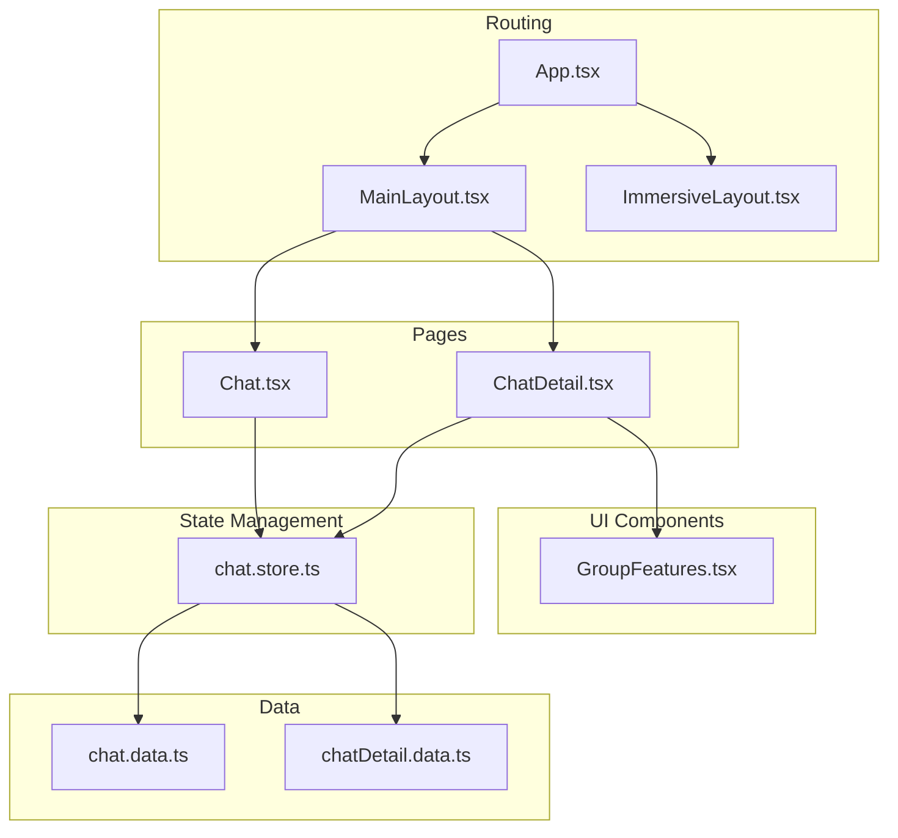
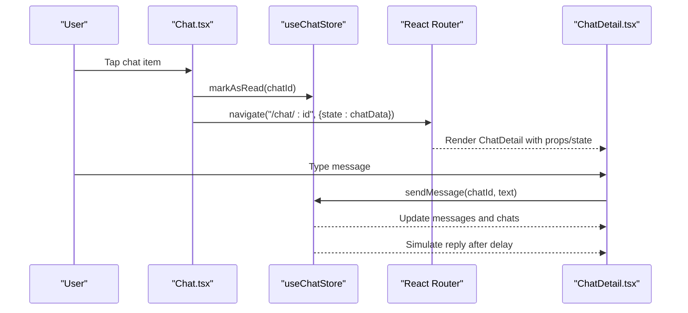
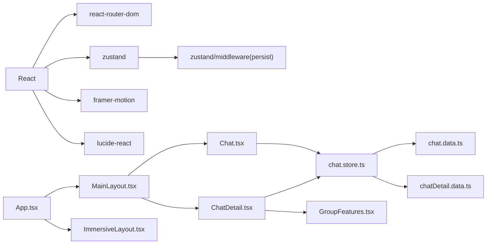

# Chat Interface

<cite>
**Referenced Files in This Document**
- [Chat.tsx](file://src/pages/Chat.tsx)
- [ChatDetail.tsx](file://src/pages/ChatDetail.tsx)
- [chat.store.ts](file://src/store/chat.store.ts)
- [chat.data.ts](file://src/data/chat.data.ts)
- [chatDetail.data.ts](file://src/data/chatDetail.data.ts)
- [GroupFeatures.tsx](file://src/components/GroupFeatures.tsx)
- [MainLayout.tsx](file://src/components/layouts/MainLayout.tsx)
- [ImmersiveLayout.tsx](file://src/components/layouts/ImmersiveLayout.tsx)
- [App.tsx](file://src/App.tsx)
- [useTheme.ts](file://src/hooks/useTheme.ts)
- [tokens.css](file://src/styles/tokens.css)
- [tailwind.config.js](file://tailwind.config.js)
- [main.tsx](file://src/main.tsx)
</cite>

## Table of Contents
1. [Introduction](#introduction)
2. [Project Structure](#project-structure)
3. [Core Components](#core-components)
4. [Architecture Overview](#architecture-overview)
5. [Detailed Component Analysis](#detailed-component-analysis)
6. [Dependency Analysis](#dependency-analysis)
7. [Performance Considerations](#performance-considerations)
8. [Troubleshooting Guide](#troubleshooting-guide)
9. [Conclusion](#conclusion)
10. [Appendices](#appendices)

## Introduction
This document provides comprehensive documentation for the VChat messaging interface components. It focuses on the Chat page (conversation list), the ChatDetail page (conversation thread), and the underlying state management that powers chat interactions. It also covers UI patterns for chat bubbles, timestamps, and status indicators, along with responsive design, touch interactions, accessibility, and performance considerations for large conversation lists.

## Project Structure
The chat interface is implemented as part of a React application using routing, state management, and a design system built with Tailwind CSS and CSS custom properties. The main routes for chat are defined in the application router and rendered within layouts that provide navigation and immersive experiences.

**Diagram sources**
- [App.tsx:66-132](file://src/App.tsx#L66-L132)
- [MainLayout.tsx:7-29](file://src/components/layouts/MainLayout.tsx#L7-L29)
- [ImmersiveLayout.tsx:5-18](file://src/components/layouts/ImmersiveLayout.tsx#L5-L18)
- [Chat.tsx:65-244](file://src/pages/Chat.tsx#L65-L244)
- [ChatDetail.tsx:9-331](file://src/pages/ChatDetail.tsx#L9-L331)
- [chat.store.ts:171-330](file://src/store/chat.store.ts#L171-L330)
- [chat.data.ts:1-134](file://src/data/chat.data.ts#L1-L134)
- [chatDetail.data.ts:1-71](file://src/data/chatDetail.data.ts#L1-L71)
- [GroupFeatures.tsx:14-153](file://src/components/GroupFeatures.tsx#L14-L153)

**Section sources**
- [App.tsx:66-132](file://src/App.tsx#L66-L132)
- [MainLayout.tsx:7-29](file://src/components/layouts/MainLayout.tsx#L7-L29)
- [ImmersiveLayout.tsx:5-18](file://src/components/layouts/ImmersiveLayout.tsx#L5-L18)

## Core Components
- Chat page: Renders a filtered and searchable list of conversations, supports filters (All, Unread, Groups, Spaces, Archived), and handles contact selection to open a conversation.
- ChatDetail page: Displays a threaded conversation, supports message history rendering, simulated real-time replies, input area with send/mic actions, and group features modal.
- State management: Centralized store manages chats, messages, filters, search, and actions like sending messages and simulating replies.
- Data seeding: Initial datasets for context groups, direct messages, and sample messages populate the store on initialization.

Key responsibilities:
- Chat.tsx: UI rendering, search/filter controls, navigation to ChatDetail, and floating compose action.
- ChatDetail.tsx: Conversation header, message rendering with sender-specific styling, translation banner, input bar, and group features integration.
- chat.store.ts: Stores, selectors, and actions for chats/messages, filtering/search, and simulated replies.
- chat.data.ts and chatDetail.data.ts: Static data for chats and messages.

**Section sources**
- [Chat.tsx:65-244](file://src/pages/Chat.tsx#L65-L244)
- [ChatDetail.tsx:9-331](file://src/pages/ChatDetail.tsx#L9-L331)
- [chat.store.ts:45-330](file://src/store/chat.store.ts#L45-L330)
- [chat.data.ts:1-134](file://src/data/chat.data.ts#L1-L134)
- [chatDetail.data.ts:1-71](file://src/data/chatDetail.data.ts#L1-L71)

## Architecture Overview
The chat architecture follows a unidirectional data flow:
- UI components subscribe to Zustand store slices.
- Actions mutate state immutably and trigger re-renders.
- Routing renders pages and passes minimal state via location state for initial hydration.
- Group features are rendered as a modal overlay with animated transitions.

**Diagram sources**
- [Chat.tsx:81-84](file://src/pages/Chat.tsx#L81-L84)
- [chat.store.ts:202-208](file://src/store/chat.store.ts#L202-L208)
- [ChatDetail.tsx:302-315](file://src/pages/ChatDetail.tsx#L302-L315)
- [chat.store.ts:288-318](file://src/store/chat.store.ts#L288-L318)

## Detailed Component Analysis

### Chat Page (Conversation List)
Responsibilities:
- Renders a sticky header with title and actions.
- Provides a search bar bound to the store’s search query.
- Implements filter tabs to narrow the chat list.
- Displays chat items with avatars, names, previews, timestamps, and unread badges.
- Supports online indicators for DMs.
- Handles navigation to ChatDetail with route state.
- Compose action creates a new DM chat and navigates immediately.

UI patterns:
- Chat item layout: avatar (DM initials or group emoji), name with optional tag/streak, preview/subtitle, time, and unread count.
- Online indicator for DMs shown as a small dot overlay.
- Filter tabs highlight the active filter with a primary background.
- Compose button is fixed at the bottom-right with hover/tap animations.

Data binding:
- Search query and active filter are controlled by the store.
- Filtered chats are computed via a selector that applies filters and sorts by time.

Accessibility and responsiveness:
- Touch-friendly tap targets and scalable hit areas.
- Scrollable container with hidden scrollbars for mobile.
- Backdrop blur for header readability on scroll.

Performance considerations:
- Items are staggered with animation delays to reduce perceived load.
- Sorting is performed on filtered results; consider virtualization for very large lists.

Customization examples:
- Change avatar shape for DMs vs groups by toggling rounded classes.
- Add custom tag labels and colors via chat metadata.
- Extend filters to include archived or muted chats.

**Section sources**
- [Chat.tsx:65-244](file://src/pages/Chat.tsx#L65-L244)
- [chat.store.ts:218-266](file://src/store/chat.store.ts#L218-L266)

### ChatDetail Page (Conversation Thread)
Responsibilities:
- Displays conversation header with avatar, online status, and action buttons.
- Renders message history with distinct styling for sent/received messages.
- Supports translation banner and voice message visualization.
- Provides an input area with send/mic actions and dynamic button icon.
- Integrates group features modal for group chats.

Message rendering:
- Text messages: sender-specific bubble with rounded corners and status indicators.
- Voice messages: waveform visualization with play button and duration.
- Timestamps and status indicators (sent/delivered/read) are aligned to the bottom-right of each bubble.
- Translation view overlays original text and language metadata when enabled.

Real-time simulation:
- On send, the store dispatches a message and triggers a delayed simulated reply.
- The simulated reply updates unread counters and last message previews.

Group features:
- For group chats, a “Features” button opens a modal with group-type-specific features.

Accessibility and responsiveness:
- Sticky header and input bar remain accessible during scrolling.
- Smooth auto-scroll to the latest message.
- Responsive textarea with min/max height and dynamic rows.

**Section sources**
- [ChatDetail.tsx:9-331](file://src/pages/ChatDetail.tsx#L9-L331)
- [chat.store.ts:179-200](file://src/store/chat.store.ts#L179-L200)
- [chat.store.ts:288-318](file://src/store/chat.store.ts#L288-L318)
- [GroupFeatures.tsx:14-153](file://src/components/GroupFeatures.tsx#L14-L153)

### State Management (Zustand Store)
State model:
- Chats: list of conversations with metadata (name, avatar, lastMessage, time, unread, type, gradients, etc.).
- Messages: record keyed by chatId containing message arrays.
- Filters: active filter and search query.

Actions:
- sendMessage: appends a new message and updates the chat’s lastMessage/time.
- markAsRead: clears unread count for a chat.
- setFilter/setSearchQuery: update UI state.
- getFilteredChats: applies filter and search, sorts by time, and returns a derived list.
- createChat: creates a new DM chat and initializes an empty message list.
- simulateReply: schedules a delayed reply with randomized text and updates counters.

Data conversion:
- Converts external message types to internal message types with normalized sender and status fields.

Persistence:
- Uses Zustand middleware to persist chats, messages, filters, and search query to storage.

**Section sources**
- [chat.store.ts:45-59](file://src/store/chat.store.ts#L45-L59)
- [chat.store.ts:179-200](file://src/store/chat.store.ts#L179-L200)
- [chat.store.ts:202-208](file://src/store/chat.store.ts#L202-L208)
- [chat.store.ts:210-266](file://src/store/chat.store.ts#L210-L266)
- [chat.store.ts:268-286](file://src/store/chat.store.ts#L268-L286)
- [chat.store.ts:288-318](file://src/store/chat.store.ts#L288-L318)
- [chat.store.ts:62-75](file://src/store/chat.store.ts#L62-L75)

### Data Seeding and Types
- Context groups, direct messages, and spaces are seeded into the store to populate initial UI.
- Sample messages for a DM conversation are mapped into the store.
- Strongly typed interfaces define message and chat shapes for safety.

**Section sources**
- [chat.data.ts:1-134](file://src/data/chat.data.ts#L1-L134)
- [chatDetail.data.ts:1-71](file://src/data/chatDetail.data.ts#L1-L71)
- [chat.store.ts:103-159](file://src/store/chat.store.ts#L103-L159)
- [chat.store.ts:162-169](file://src/store/chat.store.ts#L162-L169)

### Group Features Modal
- Presents a grid of group-specific features with icons and descriptions.
- Applies tag styling based on group type.
- Navigates to feature routes upon selection.

**Section sources**
- [GroupFeatures.tsx:14-153](file://src/components/GroupFeatures.tsx#L14-L153)

## Dependency Analysis
External libraries and frameworks:
- Framer Motion: animations for modals, list items, and transitions.
- Lucide React: icons for UI affordances.
- React Router: declarative routing and navigation.
- Zustand: lightweight state management with persistence.
- Tailwind CSS: utility-first styling with CSS custom properties for themes.

**Diagram sources**
- [App.tsx:12-50](file://src/App.tsx#L12-L50)
- [Chat.tsx:1-6](file://src/pages/Chat.tsx#L1-L6)
- [ChatDetail.tsx:1-7](file://src/pages/ChatDetail.tsx#L1-L7)
- [chat.store.ts:1-5](file://src/store/chat.store.ts#L1-L5)
- [GroupFeatures.tsx:1-4](file://src/components/GroupFeatures.tsx#L1-L4)

**Section sources**
- [package.json:12-18](file://package.json#L12-L18)

## Performance Considerations
- Rendering large lists:
  - Current implementation renders all visible items with staggered animations. For very large lists, consider:
    - Virtualization (windowing) to render only visible items plus a small buffer.
    - Memoization of chat item components to prevent unnecessary re-renders.
    - Debouncing search input to limit frequent recomputations.
- Sorting and filtering:
  - Filtering and sorting occur on the entire dataset. For larger datasets:
    - Precompute indices or use indexed structures for O(1) lookups.
    - Defer sorting until after filtering to minimize comparisons.
- Message rendering:
  - Voice waveform rendering uses dynamic heights; consider precomputing waveform segments or limiting the number of bars.
  - Avoid heavy DOM manipulation inside loops; keep styles static where possible.
- Scrolling:
  - Auto-scroll to bottom on new messages is efficient but can cause jank if combined with heavy DOM updates. Consider requestAnimationFrame batching.
- Animations:
  - Staggered animations improve perceived performance but increase layout work. Reduce animation complexity for low-end devices.

[No sources needed since this section provides general guidance]

## Troubleshooting Guide
Common issues and resolutions:
- Chat list not updating after sending a message:
  - Ensure the store’s sendMessage action updates both messages and chats.
  - Verify that the Chat page re-fetches filtered chats after store updates.
- Unread counter not clearing:
  - Confirm markAsRead is invoked on navigation to ChatDetail.
- Simulated reply not appearing:
  - Check simulateReply delay and that the chat exists in store.chats.
- Translation banner not showing:
  - Ensure isTranslating state is toggled and originalText/transcription exist on messages.
- Online status not displayed:
  - Verify chat.type is dm and online flag is present in chat metadata.
- Group features modal not opening:
  - Confirm group chat detection logic and that the modal receives isOpen and onClose props.

**Section sources**
- [chat.store.ts:179-200](file://src/store/chat.store.ts#L179-L200)
- [chat.store.ts:202-208](file://src/store/chat.store.ts#L202-L208)
- [chat.store.ts:288-318](file://src/store/chat.store.ts#L288-L318)
- [ChatDetail.tsx:95-107](file://src/pages/ChatDetail.tsx#L95-L107)
- [Chat.tsx:182-184](file://src/pages/Chat.tsx#L182-L184)
- [ChatDetail.tsx:319-327](file://src/pages/ChatDetail.tsx#L319-L327)

## Conclusion
The VChat messaging interface is structured around a clean separation of concerns: UI pages manage presentation and interactions, Zustand centralizes state and actions, and Tailwind CSS provides a consistent design system. The Chat page offers robust filtering and search, while ChatDetail delivers a rich conversation experience with simulated real-time behavior. With targeted performance improvements—especially for large lists—the interface can scale effectively while maintaining a smooth user experience.

[No sources needed since this section summarizes without analyzing specific files]

## Appendices

### UI Patterns and Styling Tokens
- Design tokens:
  - Primary/accent colors and text/background palettes are defined as CSS custom properties.
  - Light/dark modes switch the root class to adjust tokens accordingly.
- Tailwind configuration:
  - Colors map to CSS variables for consistent theming across components.

**Section sources**
- [tokens.css:1-39](file://src/styles/tokens.css#L1-L39)
- [tailwind.config.js:7-46](file://src/tailwind.config.js#L7-L46)
- [useTheme.ts:10-36](file://src/hooks/useTheme.ts#L10-L36)

### Accessibility Notes
- Focus management: Ensure focus moves appropriately after navigation and modal close.
- Touch targets: Maintain minimum 44px touch targets for interactive elements.
- Color contrast: Verify sufficient contrast for text and status indicators against backgrounds.
- Screen readers: Announce online status, unread counts, and translation banner changes.

[No sources needed since this section provides general guidance]

### Example Customizations
- Custom chat item appearance:
  - Modify avatar shapes, tag styles, and unread badge colors via inline styles or Tailwind classes.
- Search within conversations:
  - Extend getFilteredChats to include message content search by iterating through messages for each chat.
- Handling different conversation types:
  - Use chat.type to conditionally render DM avatars (initials) vs group avatars (emoji).
  - Enable group features modal for group chats and hide it otherwise.

[No sources needed since this section provides general guidance]