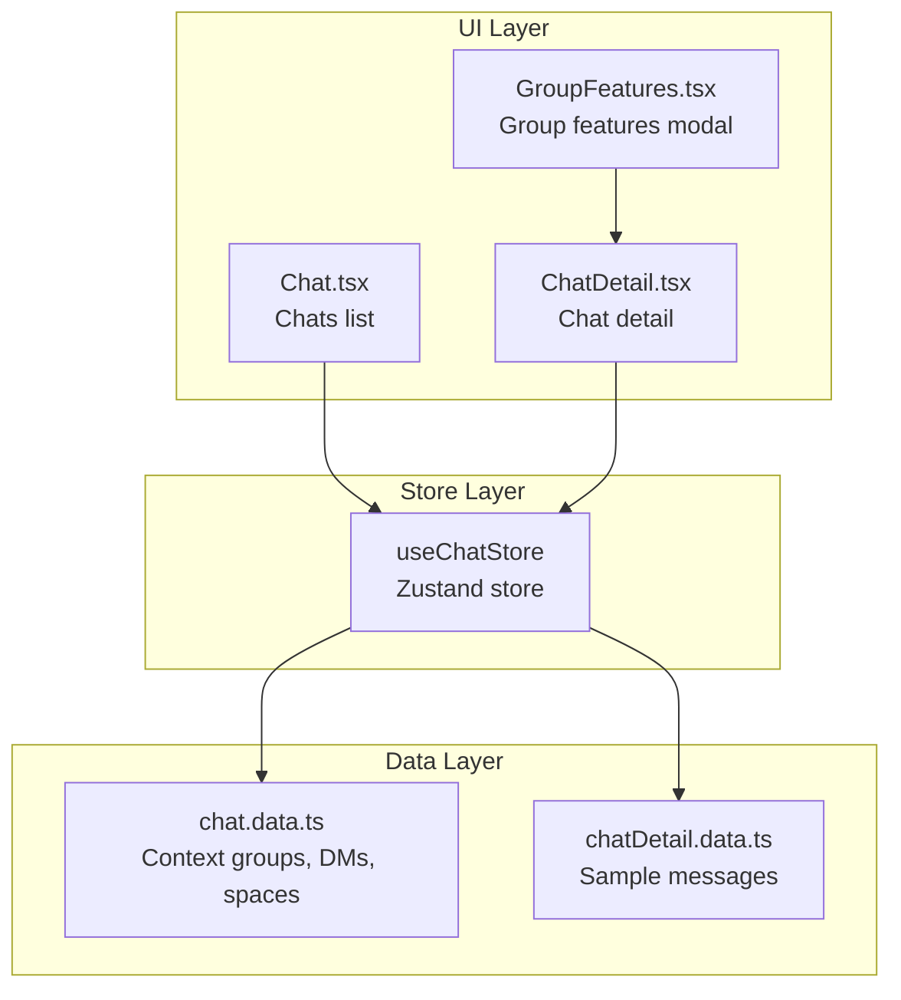
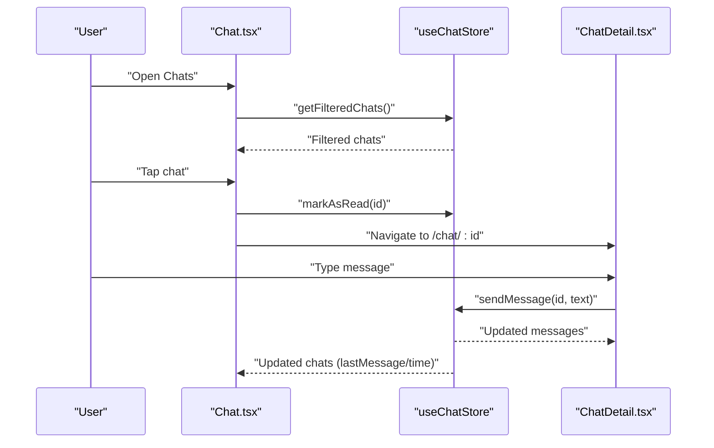
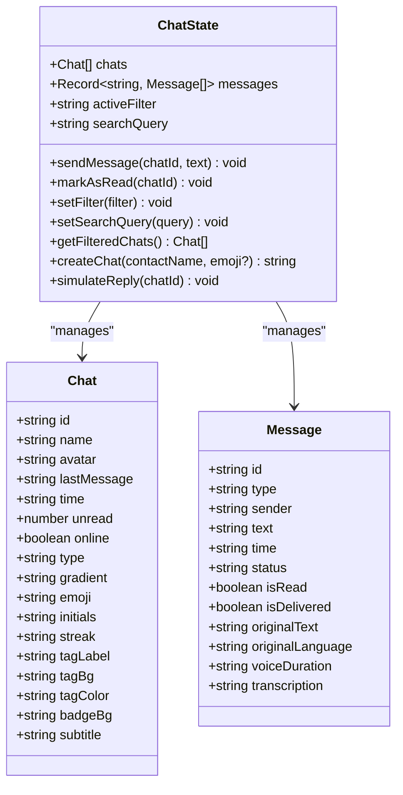
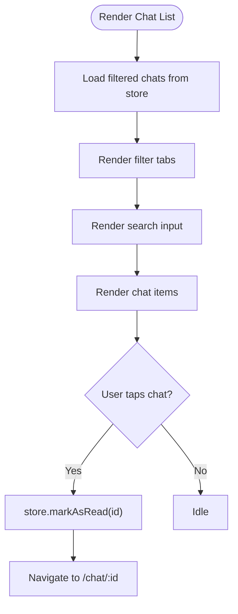
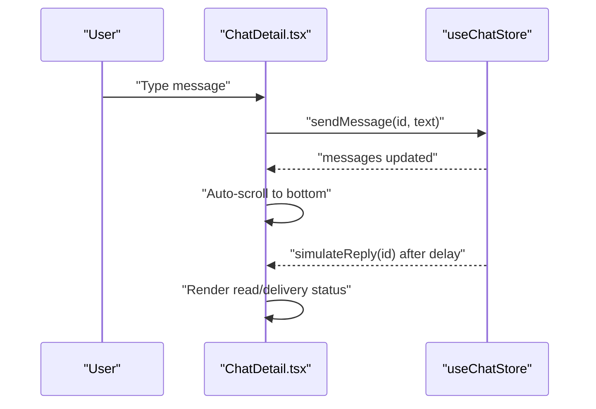
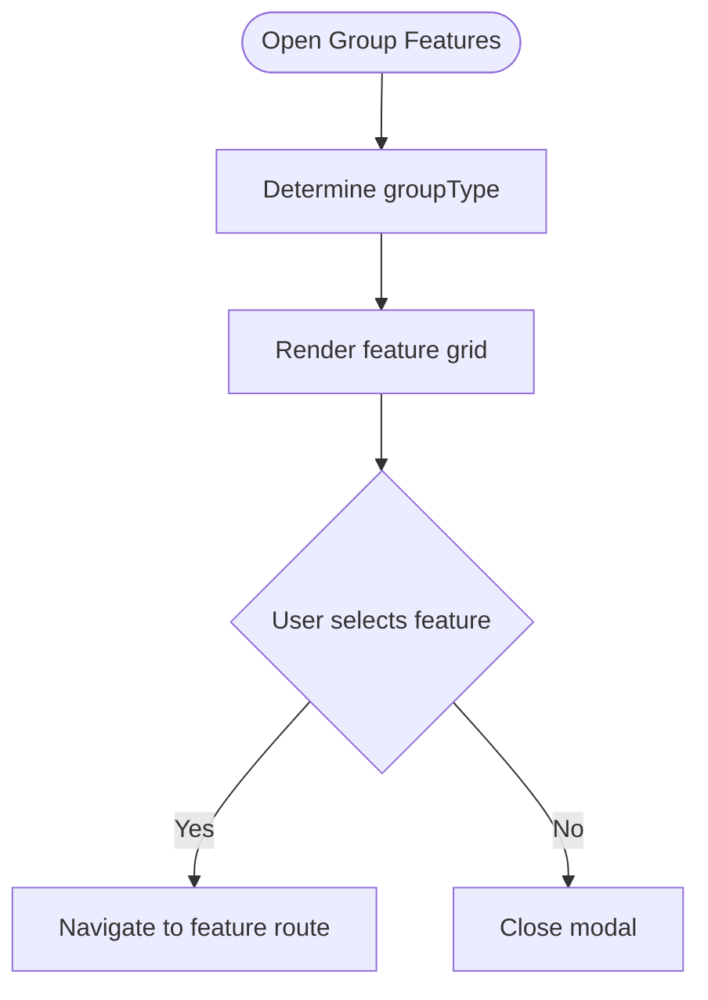
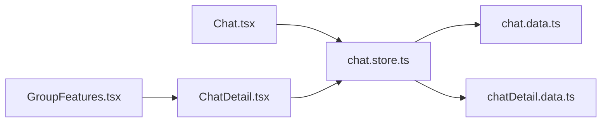

# Conversation Management

<cite>
**Referenced Files in This Document**
- [chat.store.ts](file://src/store/chat.store.ts)
- [Chat.tsx](file://src/pages/Chat.tsx)
- [ChatDetail.tsx](file://src/pages/ChatDetail.tsx)
- [chat.data.ts](file://src/data/chat.data.ts)
- [chatDetail.data.ts](file://src/data/chatDetail.data.ts)
- [GroupFeatures.tsx](file://src/components/GroupFeatures.tsx)
- [PrivacyDashboard.tsx](file://src/pages/profile/PrivacyDashboard.tsx)
</cite>

## Table of Contents
1. [Introduction](#introduction)
2. [Project Structure](#project-structure)
3. [Core Components](#core-components)
4. [Architecture Overview](#architecture-overview)
5. [Detailed Component Analysis](#detailed-component-analysis)
6. [Dependency Analysis](#dependency-analysis)
7. [Performance Considerations](#performance-considerations)
8. [Troubleshooting Guide](#troubleshooting-guide)
9. [Conclusion](#conclusion)
10. [Appendices](#appendices)

## Introduction
This document describes VChat’s conversation management system with a focus on how conversations are created, joined, and navigated; how group chats and member-related features are organized; and how messaging, read receipts, and presence are handled. It also covers search, filtering, sorting, and persistence, along with privacy controls and future extension points for advanced features such as analytics, folders, pinning, muting, and archiving.

## Project Structure
The conversation management system spans three primary areas:
- Store: Centralized state for chats and messages, including filters, search, and persistence.
- Pages: UI surfaces for listing chats and viewing chat details.
- Data: Static seeds for chats, DMs, spaces, and sample messages.

**Diagram sources**
- [chat.store.ts:171-330](file://src/store/chat.store.ts#L171-L330)
- [Chat.tsx:65-92](file://src/pages/Chat.tsx#L65-L92)
- [ChatDetail.tsx:9-37](file://src/pages/ChatDetail.tsx#L9-L37)
- [GroupFeatures.tsx:14-153](file://src/components/GroupFeatures.tsx#L14-L153)
- [chat.data.ts:1-134](file://src/data/chat.data.ts#L1-L134)
- [chatDetail.data.ts:1-71](file://src/data/chatDetail.data.ts#L1-L71)

**Section sources**
- [chat.store.ts:171-330](file://src/store/chat.store.ts#L171-L330)
- [Chat.tsx:65-92](file://src/pages/Chat.tsx#L65-L92)
- [ChatDetail.tsx:9-37](file://src/pages/ChatDetail.tsx#L9-L37)
- [GroupFeatures.tsx:14-153](file://src/components/GroupFeatures.tsx#L14-L153)
- [chat.data.ts:1-134](file://src/data/chat.data.ts#L1-L134)
- [chatDetail.data.ts:1-71](file://src/data/chatDetail.data.ts#L1-L71)

## Core Components
- Zustand store with persistence for chats and messages, plus filters and search.
- Chat list page with tabs, search bar, and compose flow.
- Chat detail page with message rendering, send input, and group features.
- Static data seeds for context groups, direct messages, spaces, and sample messages.
- Group features modal for contextual group capabilities.

Key responsibilities:
- Manage conversation lifecycle: create, join (compose), read/unread, and simulate replies.
- Provide filtering, search, and sorting for conversations.
- Persist state across sessions.
- Render presence and read status indicators.

**Section sources**
- [chat.store.ts:45-59](file://src/store/chat.store.ts#L45-L59)
- [Chat.tsx:69-79](file://src/pages/Chat.tsx#L69-L79)
- [ChatDetail.tsx:24-41](file://src/pages/ChatDetail.tsx#L24-L41)
- [chat.data.ts:1-134](file://src/data/chat.data.ts#L1-L134)
- [chatDetail.data.ts:18-71](file://src/data/chatDetail.data.ts#L18-L71)

## Architecture Overview
The system follows a unidirectional data flow:
- UI components subscribe to the store and dispatch actions.
- The store updates state immutably and persists relevant slices.
- UI re-renders based on subscribed selectors.

**Diagram sources**
- [Chat.tsx:79-84](file://src/pages/Chat.tsx#L79-L84)
- [chat.store.ts:218-266](file://src/store/chat.store.ts#L218-L266)
- [ChatDetail.tsx:302-308](file://src/pages/ChatDetail.tsx#L302-L308)

## Detailed Component Analysis

### Zustand Chat Store
Responsibilities:
- Seed chats from static data (context groups, direct messages, spaces).
- Seed messages from static data.
- Send messages, update last message and time, and mark as read.
- Filter chats by type and unread, apply search, and sort by recency.
- Create new DM conversations.
- Simulate replies with randomized delays and statuses.

**Diagram sources**
- [chat.store.ts:9-43](file://src/store/chat.store.ts#L9-L43)
- [chat.store.ts:45-59](file://src/store/chat.store.ts#L45-L59)

**Section sources**
- [chat.store.ts:103-159](file://src/store/chat.store.ts#L103-L159)
- [chat.store.ts:162-169](file://src/store/chat.store.ts#L162-L169)
- [chat.store.ts:179-200](file://src/store/chat.store.ts#L179-L200)
- [chat.store.ts:202-208](file://src/store/chat.store.ts#L202-L208)
- [chat.store.ts:210-216](file://src/store/chat.store.ts#L210-L216)
- [chat.store.ts:218-266](file://src/store/chat.store.ts#L218-L266)
- [chat.store.ts:268-286](file://src/store/chat.store.ts#L268-L286)
- [chat.store.ts:288-318](file://src/store/chat.store.ts#L288-L318)

### Chat List Page (Chats)
Responsibilities:
- Display filtered chats with avatars, names, last messages, timestamps, and unread badges.
- Provide tabs for All, Unread, Groups, Spaces, Archived.
- Support search input and navigation to chat detail.
- Compose new DM conversations.

**Diagram sources**
- [Chat.tsx:69-79](file://src/pages/Chat.tsx#L69-L79)
- [Chat.tsx:142-159](file://src/pages/Chat.tsx#L142-L159)
- [Chat.tsx:130-139](file://src/pages/Chat.tsx#L130-L139)
- [Chat.tsx:162-228](file://src/pages/Chat.tsx#L162-L228)

**Section sources**
- [Chat.tsx:69-79](file://src/pages/Chat.tsx#L69-L79)
- [Chat.tsx:142-159](file://src/pages/Chat.tsx#L142-L159)
- [Chat.tsx:130-139](file://src/pages/Chat.tsx#L130-L139)
- [Chat.tsx:162-228](file://src/pages/Chat.tsx#L162-L228)

### Chat Detail Page
Responsibilities:
- Display messages with sender-specific styling, timestamps, and read/delivery indicators.
- Support sending text messages and simulating replies.
- Show presence indicators and optional translation banner.
- Provide group features access for group chats.

**Diagram sources**
- [ChatDetail.tsx:302-308](file://src/pages/ChatDetail.tsx#L302-L308)
- [chat.store.ts:288-318](file://src/store/chat.store.ts#L288-L318)
- [ChatDetail.tsx:43-46](file://src/pages/ChatDetail.tsx#L43-L46)

**Section sources**
- [ChatDetail.tsx:24-41](file://src/pages/ChatDetail.tsx#L24-L41)
- [ChatDetail.tsx:136-264](file://src/pages/ChatDetail.tsx#L136-L264)
- [ChatDetail.tsx:302-308](file://src/pages/ChatDetail.tsx#L302-L308)

### Group Features Modal
Responsibilities:
- Present contextual features for different group types (family, work, education, society, colony).
- Route to feature screens on selection.

**Diagram sources**
- [GroupFeatures.tsx:28-87](file://src/components/GroupFeatures.tsx#L28-L87)
- [GroupFeatures.tsx:130-147](file://src/components/GroupFeatures.tsx#L130-L147)

**Section sources**
- [GroupFeatures.tsx:14-153](file://src/components/GroupFeatures.tsx#L14-L153)

### Data Seeding
Responsibilities:
- Provide initial datasets for chats and messages.
- Enable realistic demo conversations and UI rendering.

**Section sources**
- [chat.data.ts:35-133](file://src/data/chat.data.ts#L35-L133)
- [chatDetail.data.ts:18-71](file://src/data/chatDetail.data.ts#L18-L71)

## Dependency Analysis
- UI depends on the store for state and actions.
- Store depends on static data for seeding.
- Group features depend on the chat detail context to render appropriate feature sets.

**Diagram sources**
- [Chat.tsx:5-77](file://src/pages/Chat.tsx#L5-L77)
- [ChatDetail.tsx:6-27](file://src/pages/ChatDetail.tsx#L6-L27)
- [GroupFeatures.tsx:3-12](file://src/components/GroupFeatures.tsx#L3-L12)
- [chat.store.ts:3-4](file://src/store/chat.store.ts#L3-L4)

**Section sources**
- [Chat.tsx:5-77](file://src/pages/Chat.tsx#L5-L77)
- [ChatDetail.tsx:6-27](file://src/pages/ChatDetail.tsx#L6-L27)
- [GroupFeatures.tsx:3-12](file://src/components/GroupFeatures.tsx#L3-L12)
- [chat.store.ts:3-4](file://src/store/chat.store.ts#L3-L4)

## Performance Considerations
- Rendering optimization: The chat list uses staggered animations and minimal re-renders by relying on filtered arrays from the store.
- Message rendering: Chat detail uses per-message animations; consider virtualization for very long threads.
- Sorting: Time parsing is simplified; for production, normalize timestamps to numeric values for robust and fast comparisons.
- Persistence: Store persistence is scoped to chats, messages, filters, and search query—keep payload sizes reasonable by trimming old messages if needed.
- Filtering and search: Current implementation filters client-side; consider indexing or debounced search for large datasets.

[No sources needed since this section provides general guidance]

## Troubleshooting Guide
Common issues and resolutions:
- Messages not appearing after sending: Verify the chatId matches an existing key in the messages map and that the store action is invoked.
- Read receipts not updating: Ensure the UI triggers markAsRead on navigation and that the store updates unread counts.
- Presence indicator not visible: Confirm the chat item includes the online flag and that the UI renders the indicator accordingly.
- Group features not opening: Ensure the chatId indicates a group and that the modal receives the correct groupType and emoji.

**Section sources**
- [chat.store.ts:202-208](file://src/store/chat.store.ts#L202-L208)
- [ChatDetail.tsx:38-41](file://src/pages/ChatDetail.tsx#L38-L41)
- [Chat.tsx:182-184](file://src/pages/Chat.tsx#L182-L184)
- [GroupFeatures.tsx:19-26](file://src/components/GroupFeatures.tsx#L19-L26)

## Conclusion
VChat’s conversation management system centers around a lightweight Zustand store that seeds realistic data, supports message sending and simulated replies, and exposes filtering, search, and sorting. The UI integrates seamlessly with the store to provide a responsive chat experience. Privacy controls are exposed in the Privacy Dashboard, and group features are modular and extensible. Future enhancements can include folders, pinning, muting, archiving, analytics, and improved performance for large-scale usage.

[No sources needed since this section summarizes without analyzing specific files]

## Appendices

### Conversation Creation and Joining
- Create a new DM: Compose flow prompts for a contact name and creates a new chat entry with an empty messages array.
- Joining: The compose flow navigates to the newly created chat route.

Implementation references:
- [Chat.tsx:86-92](file://src/pages/Chat.tsx#L86-L92)
- [chat.store.ts:268-286](file://src/store/chat.store.ts#L268-L286)

**Section sources**
- [Chat.tsx:86-92](file://src/pages/Chat.tsx#L86-L92)
- [chat.store.ts:268-286](file://src/store/chat.store.ts#L268-L286)

### Group Chat Setup and Member Management
- Group identification: Group chats are identified by type and emoji/initials; the UI conditionally renders group features.
- Group features modal: Presents contextual features based on groupType.

Implementation references:
- [chat.store.ts:32-32](file://src/store/chat.store.ts#L32-L32)
- [Chat.tsx:186-193](file://src/pages/Chat.tsx#L186-L193)
- [GroupFeatures.tsx:28-87](file://src/components/GroupFeatures.tsx#L28-L87)

**Section sources**
- [chat.store.ts:32-32](file://src/store/chat.store.ts#L32-L32)
- [Chat.tsx:186-193](file://src/pages/Chat.tsx#L186-L193)
- [GroupFeatures.tsx:28-87](file://src/components/GroupFeatures.tsx#L28-L87)

### Conversation Settings and Preferences
- Read receipts: Controlled in the Privacy Dashboard; affects visibility of read status.
- Presence: Online/offline status is shown in chat list and detail views.
- Translation: Optional translation banner toggled in chat detail for supported messages.

Implementation references:
- [PrivacyDashboard.tsx:87-100](file://src/pages/profile/PrivacyDashboard.tsx#L87-L100)
- [Chat.tsx:182-184](file://src/pages/Chat.tsx#L182-L184)
- [ChatDetail.tsx:95-107](file://src/pages/ChatDetail.tsx#L95-L107)

**Section sources**
- [PrivacyDashboard.tsx:87-100](file://src/pages/profile/PrivacyDashboard.tsx#L87-L100)
- [Chat.tsx:182-184](file://src/pages/Chat.tsx#L182-L184)
- [ChatDetail.tsx:95-107](file://src/pages/ChatDetail.tsx#L95-L107)

### Conversation Organization
- Filters: Implemented in the store with All, Unread, Groups, Spaces, Archived.
- Sorting: By time descending; time parsing handles relative time strings.
- Search: Case-insensitive match on name and lastMessage.

Implementation references:
- [Chat.tsx:7-7](file://src/pages/Chat.tsx#L7-L7)
- [chat.store.ts:218-266](file://src/store/chat.store.ts#L218-L266)

**Section sources**
- [Chat.tsx:7-7](file://src/pages/Chat.tsx#L7-L7)
- [chat.store.ts:218-266](file://src/store/chat.store.ts#L218-L266)

### Message Search
- Keyword filtering: Name and lastMessage fields.
- Date range selection: Not implemented; current sorting relies on time strings.
- Sender filtering: Not implemented; could be added by extending filters.

Implementation references:
- [chat.store.ts:242-250](file://src/store/chat.store.ts#L242-L250)

**Section sources**
- [chat.store.ts:242-250](file://src/store/chat.store.ts#L242-L250)

### Conversation Archiving, Deletion, and Cleanup
- Archived: Placeholder filter returns empty; no archive state or cleanup logic exists.
- Delete: No explicit delete action; account deletion UI exists in Privacy Dashboard.

Implementation references:
- [chat.store.ts:234-236](file://src/store/chat.store.ts#L234-L236)
- [PrivacyDashboard.tsx:102-110](file://src/pages/profile/PrivacyDashboard.tsx#L102-L110)

**Section sources**
- [chat.store.ts:234-236](file://src/store/chat.store.ts#L234-L236)
- [PrivacyDashboard.tsx:102-110](file://src/pages/profile/PrivacyDashboard.tsx#L102-L110)

### Persistence and Synchronization
- Persistence: Store is partially persisted (chats, messages, activeFilter, searchQuery).
- Cross-device sync: Not implemented; would require backend hooks and conflict resolution.

Implementation references:
- [chat.store.ts:320-330](file://src/store/chat.store.ts#L320-L330)

**Section sources**
- [chat.store.ts:320-330](file://src/store/chat.store.ts#L320-L330)

### Read Receipts, Typing Indicators, and Presence
- Read receipts: Status indicators rendered for sent/delivered/read; read receipt toggle in Privacy Dashboard.
- Typing indicators: Not implemented; could be modeled as ephemeral presence events.
- Presence: Online status shown in chat list and detail.

Implementation references:
- [ChatDetail.tsx:188-195](file://src/pages/ChatDetail.tsx#L188-L195)
- [PrivacyDashboard.tsx:87-100](file://src/pages/profile/PrivacyDashboard.tsx#L87-L100)
- [Chat.tsx:182-184](file://src/pages/Chat.tsx#L182-L184)

**Section sources**
- [ChatDetail.tsx:188-195](file://src/pages/ChatDetail.tsx#L188-L195)
- [PrivacyDashboard.tsx:87-100](file://src/pages/profile/PrivacyDashboard.tsx#L87-L100)
- [Chat.tsx:182-184](file://src/pages/Chat.tsx#L182-L184)

### Analytics and Usage Statistics
- Insights: AI insights are present in other parts of the app; conversation analytics are not implemented here.
- Suggestions: Could be derived from message metadata and engagement metrics.

[No sources needed since this section provides general guidance]

### Implementation Examples

- Custom conversation behaviors:
  - Extend the store with archive/unarchive actions and update filters accordingly.
  - Add folder/pinning by augmenting the Chat model and UI.

- Integrating with external services:
  - Replace simulateReply with a real service call and update message status accordingly.

- Handling conversation state changes:
  - Subscribe to store selectors for chats/messages and re-render affected components.

[No sources needed since this section provides general guidance]