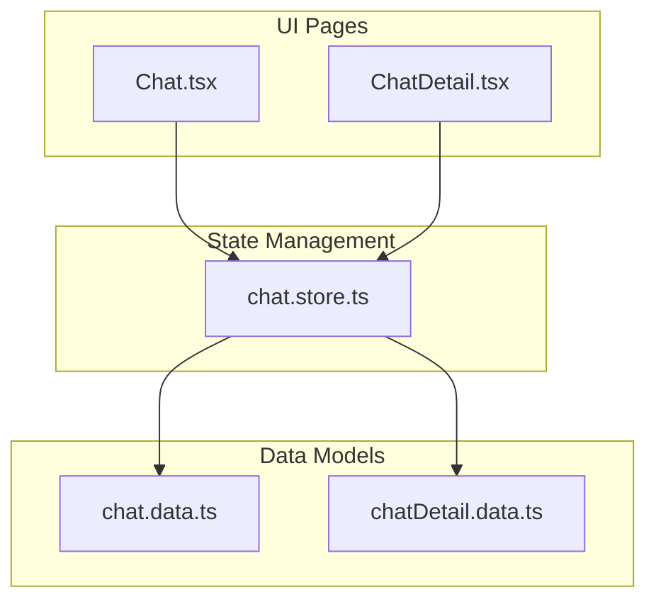
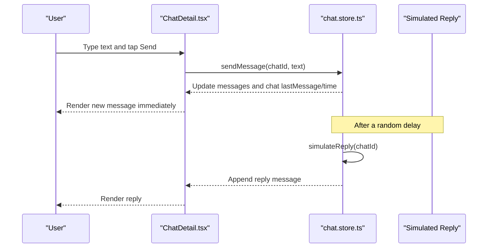
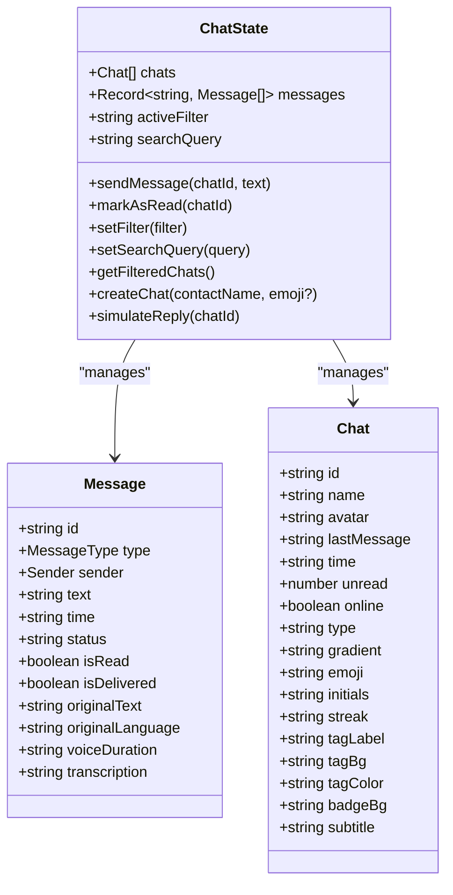
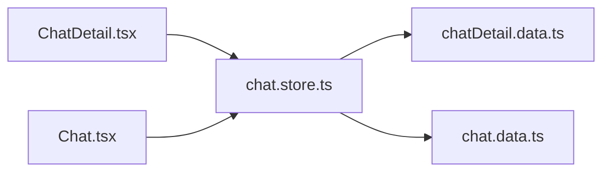

# Message Types and Formatting

<cite>
**Referenced Files in This Document**
- [Chat.tsx](file://src/pages/Chat.tsx)
- [ChatDetail.tsx](file://src/pages/ChatDetail.tsx)
- [chat.store.ts](file://src/store/chat.store.ts)
- [chat.data.ts](file://src/data/chat.data.ts)
- [chatDetail.data.ts](file://src/data/chatDetail.data.ts)
</cite>

## Table of Contents
1. [Introduction](#introduction)
2. [Project Structure](#project-structure)
3. [Core Components](#core-components)
4. [Architecture Overview](#architecture-overview)
5. [Detailed Component Analysis](#detailed-component-analysis)
6. [Dependency Analysis](#dependency-analysis)
7. [Performance Considerations](#performance-considerations)
8. [Troubleshooting Guide](#troubleshooting-guide)
9. [Conclusion](#conclusion)
10. [Appendices](#appendices)

## Introduction
This document explains VChat’s message type system and formatting capabilities. It covers:
- Text messages with translation and original language labeling
- Voice messages with waveform visualization, duration display, and optional transcription
- Media message handling (image uploads, video playback, file attachments, and previews)
- System messages for notifications, group actions, and conversation updates
- Message formatting rules, character limits, and content validation
- Message encryption, attachment security, and file size restrictions
- Editing and deletion, reactions and replies, and thread management
- Implementation examples for extending message types, customizing appearance, and handling multimedia
- Accessibility features for screen readers and keyboard navigation

## Project Structure
The messaging system spans UI pages, a central store, and data models:
- UI pages render messages and collect input
- The store manages message state, sending, and simulated replies
- Data files define message shapes and sample conversations

**Diagram sources**
- [Chat.tsx:1-245](file://src/pages/Chat.tsx#L1-L245)
- [ChatDetail.tsx:1-332](file://src/pages/ChatDetail.tsx#L1-L332)
- [chat.store.ts:1-349](file://src/store/chat.store.ts#L1-L349)
- [chat.data.ts:1-134](file://src/data/chat.data.ts#L1-L134)
- [chatDetail.data.ts:1-71](file://src/data/chatDetail.data.ts#L1-L71)

**Section sources**
- [Chat.tsx:1-245](file://src/pages/Chat.tsx#L1-L245)
- [ChatDetail.tsx:1-332](file://src/pages/ChatDetail.tsx#L1-L332)
- [chat.store.ts:1-349](file://src/store/chat.store.ts#L1-L349)
- [chat.data.ts:1-134](file://src/data/chat.data.ts#L1-L134)
- [chatDetail.data.ts:1-71](file://src/data/chatDetail.data.ts#L1-L71)

## Core Components
- Message model: supports text, voice, and image types; includes timestamps, delivery/read status, and optional translation/transcription fields
- UI rendering: renders text and voice messages with distinct styles, status indicators, and optional translation overlays
- Store actions: send text messages, simulate replies, manage filters/search, and maintain chat metadata

Key capabilities present in the codebase:
- Text messages with optional original text and language for translation overlays
- Voice messages with waveform bars, duration, and optional transcription
- Basic input area with send and record controls
- Status indicators (sent/delivered/read)
- Filtering and search of chats

**Section sources**
- [chat.store.ts:6-22](file://src/store/chat.store.ts#L6-L22)
- [chat.store.ts:179-200](file://src/store/chat.store.ts#L179-L200)
- [chatDetail.data.ts:1-16](file://src/data/chatDetail.data.ts#L1-L16)
- [ChatDetail.tsx:166-196](file://src/pages/ChatDetail.tsx#L166-L196)
- [ChatDetail.tsx:197-258](file://src/pages/ChatDetail.tsx#L197-L258)

## Architecture Overview
The message flow connects UI input to the store and back to the UI for rendering.

**Diagram sources**
- [ChatDetail.tsx:302-315](file://src/pages/ChatDetail.tsx#L302-L315)
- [chat.store.ts:179-200](file://src/store/chat.store.ts#L179-L200)
- [chat.store.ts:288-318](file://src/store/chat.store.ts#L288-L318)

## Detailed Component Analysis

### Message Model and Types
The store defines supported message types and fields. The UI conditionally renders text and voice messages differently.

**Diagram sources**
- [chat.store.ts:6-22](file://src/store/chat.store.ts#L6-L22)
- [chat.store.ts:24-43](file://src/store/chat.store.ts#L24-L43)
- [chat.store.ts:45-59](file://src/store/chat.store.ts#L45-L59)

**Section sources**
- [chat.store.ts:6-22](file://src/store/chat.store.ts#L6-L22)
- [chat.store.ts:24-43](file://src/store/chat.store.ts#L24-L43)
- [chat.store.ts:45-59](file://src/store/chat.store.ts#L45-L59)

### Text Messages: Rich Formatting, Markdown, and Links
Current implementation:
- Text messages are rendered as blocks with sender-specific styling
- Optional translation overlay displays original text and language when translation mode is active
- No explicit markdown parsing or rich formatting is shown in the UI

Formatting rules observed:
- Text content is shown as-is
- Translation banner and overlay appear when translation is toggled
- Delivery/read status icons are shown for sent messages

Accessibility:
- Text content is standard text nodes; no ARIA attributes for rich formatting are present

**Section sources**
- [ChatDetail.tsx:166-196](file://src/pages/ChatDetail.tsx#L166-L196)
- [ChatDetail.tsx:177-186](file://src/pages/ChatDetail.tsx#L177-L186)

### Voice Messages: Recording, Playback, Duration, and Transcription
Current implementation:
- Voice messages render a waveform visualization made of animated bars
- Duration is displayed alongside playback controls
- Optional transcription appears below the waveform when translation mode is active
- Playback is simulated via UI animation; actual audio recording/playback is not implemented in the UI

Formatting rules observed:
- Waveform bars are generated dynamically with randomized heights and “played” segments
- Duration is a string field rendered as-is
- Transcription is shown in an italicized block with a small label

Accessibility:
- No explicit ARIA roles or labels for the waveform or playback controls are present

**Section sources**
- [ChatDetail.tsx:197-258](file://src/pages/ChatDetail.tsx#L197-L258)
- [chatDetail.data.ts:38-45](file://src/data/chatDetail.data.ts#L38-L45)

### Media Messages: Images, Videos, Files, and Previews
Observed capabilities:
- The message type union includes an image type
- The input area exposes attachment and image buttons
- No media rendering or preview logic is implemented in the UI

Recommendations for implementation:
- Extend the message renderer to handle image type with preview thumbnails
- Add file upload handling and progress indicators
- Implement video playback controls and file attachment previews
- Enforce file size limits and MIME-type checks before upload

**Section sources**
- [chat.store.ts:6](file://src/store/chat.store.ts#L6)
- [ChatDetail.tsx:286-287](file://src/pages/ChatDetail.tsx#L286-L287)

### System Messages: Notifications, Group Actions, and Conversation Updates
Observed capabilities:
- Delivery/read status indicators are shown for sent messages
- Online presence badges are shown for direct-message chats
- Translation banners indicate active translation sessions

Recommendations for implementation:
- Add dedicated system message types for group join/leave, admin actions, and conversation metadata changes
- Render system messages with distinct styling and compact layout
- Provide ephemeral notifications for important events

**Section sources**
- [ChatDetail.tsx:188-195](file://src/pages/ChatDetail.tsx#L188-L195)
- [Chat.tsx:182-184](file://src/pages/Chat.tsx#L182-L184)

### Message Formatting Rules, Character Limits, and Validation
Observed capabilities:
- Text input area supports multi-line expansion up to a fixed max height
- No explicit character limit or validation logic is present in the UI
- Delivery/read status is inferred from boolean flags and set by the store

Recommendations for implementation:
- Enforce per-message character limits and show a counter
- Add client-side validation for URLs and markdown-like constructs
- Sanitize HTML/markdown before rendering to prevent XSS

**Section sources**
- [ChatDetail.tsx:290-297](file://src/pages/ChatDetail.tsx#L290-L297)
- [chat.store.ts:179-200](file://src/store/chat.store.ts#L179-L200)

### Message Encryption, Attachment Security, and File Size Restrictions
Observed capabilities:
- No encryption or secure transport logic is present in the UI or store
- No file size restrictions or security scanning are implemented

Recommendations for implementation:
- Integrate end-to-end encryption for text and media payloads
- Validate file types and enforce size limits server-side and client-side
- Scan attachments for malware and sanitize metadata

**Section sources**
- [chat.store.ts:179-200](file://src/store/chat.store.ts#L179-L200)

### Editing, Deletion, Reactions, Replies, and Threads
Observed capabilities:
- No message edit/delete UI or actions are present
- No reaction or reply UI is implemented
- No threading UI is present

Recommendations for implementation:
- Add inline edit/delete actions for owned messages
- Implement quick-reaction picker and threaded reply composition
- Provide thread navigation and collapsed/expanded views

**Section sources**
- [ChatDetail.tsx:166-258](file://src/pages/ChatDetail.tsx#L166-L258)

### Implementation Examples

#### Adding a New Message Type (e.g., Image)
- Extend the type union and model fields
- Add a renderer branch in the message list
- Wire input buttons to dispatch image messages

Example paths to modify:
- Type union and model: [chat.store.ts:6-22](file://src/store/chat.store.ts#L6-L22)
- Renderer branch: [ChatDetail.tsx:166-196](file://src/pages/ChatDetail.tsx#L166-L196)
- Input buttons: [ChatDetail.tsx:286-287](file://src/pages/ChatDetail.tsx#L286-L287)

#### Customizing Message Appearance
- Adjust background gradients and borders for sent/received messages
- Modify status iconography and colors

Example paths to modify:
- Sent bubble styling: [ChatDetail.tsx:168-172](file://src/pages/ChatDetail.tsx#L168-L172)
- Received bubble styling: [ChatDetail.tsx:199-203](file://src/pages/ChatDetail.tsx#L199-L203)
- Status indicators: [ChatDetail.tsx:188-195](file://src/pages/ChatDetail.tsx#L188-L195)

#### Handling Multimedia Content
- Implement image preview rendering and click-to-open behavior
- Add file upload progress and retry logic
- Add video player controls and thumbnail previews

Example paths to modify:
- Type union: [chat.store.ts:6](file://src/store/chat.store.ts#L6)
- Input area: [ChatDetail.tsx:286-287](file://src/pages/ChatDetail.tsx#L286-L287)

**Section sources**
- [chat.store.ts:6-22](file://src/store/chat.store.ts#L6-L22)
- [ChatDetail.tsx:166-196](file://src/pages/ChatDetail.tsx#L166-L196)
- [ChatDetail.tsx:286-287](file://src/pages/ChatDetail.tsx#L286-L287)

### Accessibility Features
Observed gaps:
- No ARIA attributes for rich text, waveforms, or playback controls
- No keyboard shortcuts for send/recording
- No screen reader announcements for status changes

Recommendations:
- Add ARIA roles and labels for interactive elements
- Support Enter/Send and Space/record keyboard shortcuts
- Announce status changes and translation toggles for assistive tech

**Section sources**
- [ChatDetail.tsx:166-258](file://src/pages/ChatDetail.tsx#L166-L258)

## Dependency Analysis
The UI depends on the store for state and actions. The store seeds data from static files.

**Diagram sources**
- [ChatDetail.tsx:1-332](file://src/pages/ChatDetail.tsx#L1-L332)
- [Chat.tsx:1-245](file://src/pages/Chat.tsx#L1-L245)
- [chat.store.ts:1-349](file://src/store/chat.store.ts#L1-L349)
- [chat.data.ts:1-134](file://src/data/chat.data.ts#L1-L134)
- [chatDetail.data.ts:1-71](file://src/data/chatDetail.data.ts#L1-L71)

**Section sources**
- [chat.store.ts:1-349](file://src/store/chat.store.ts#L1-L349)

## Performance Considerations
- Rendering many animated waveform bars can be expensive; consider throttling or virtualization for long lists
- Auto-scrolling on every message update is efficient but should avoid unnecessary reflows
- Simulated replies introduce async updates; ensure they do not cause layout thrashing

[No sources needed since this section provides general guidance]

## Troubleshooting Guide
Common issues and resolutions:
- Messages not appearing: verify the chatId exists in the store and messages are appended under the correct key
- Translation overlay not visible: ensure translation mode is toggled and originalText/originalLanguage fields are populated
- Status icons missing: confirm status flags are set when creating/simulating messages

**Section sources**
- [chat.store.ts:179-200](file://src/store/chat.store.ts#L179-L200)
- [chat.store.ts:288-318](file://src/store/chat.store.ts#L288-L318)
- [ChatDetail.tsx:177-186](file://src/pages/ChatDetail.tsx#L177-L186)

## Conclusion
VChat currently supports text and voice messages with translation overlays and basic status indicators. Extending the system to support images, videos, and files requires adding new message types, rendering branches, and robust input handling. Security, accessibility, and UX improvements should be prioritized alongside new features.

[No sources needed since this section summarizes without analyzing specific files]

## Appendices

### Message Type Reference
- text: Plain text with optional translation fields
- voice: Audio with waveform visualization, duration, and optional transcription
- image: Media attachment with preview and metadata

**Section sources**
- [chat.store.ts:6](file://src/store/chat.store.ts#L6)
- [chatDetail.data.ts:1-16](file://src/data/chatDetail.data.ts#L1-L16)