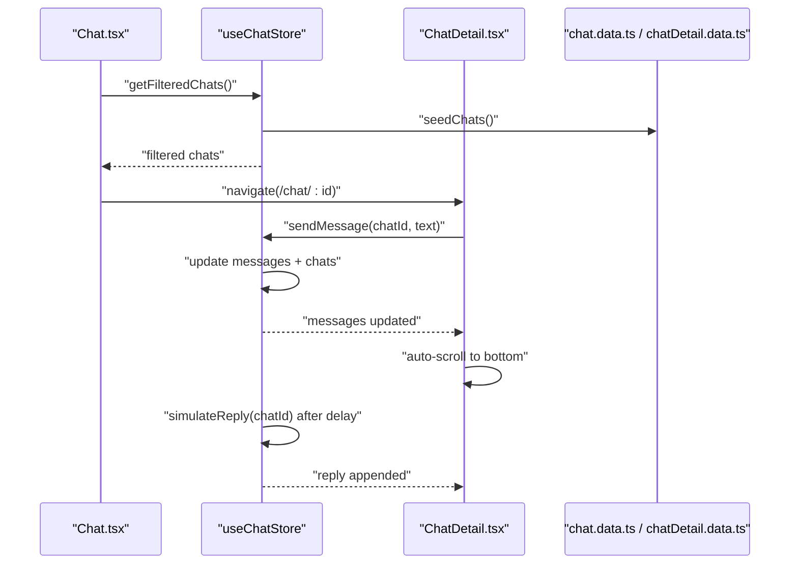
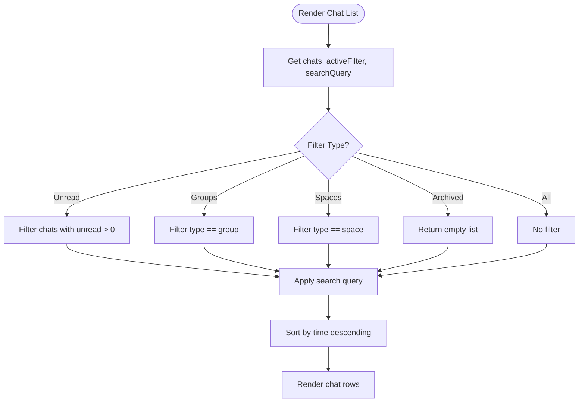
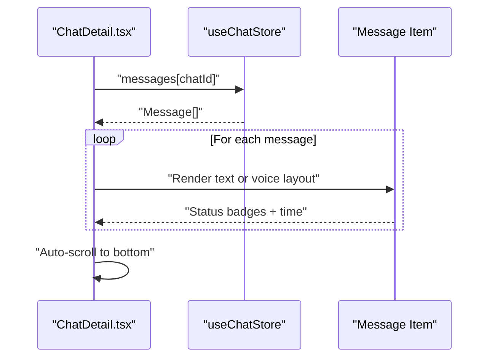
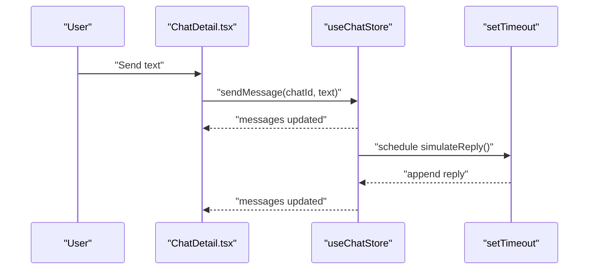
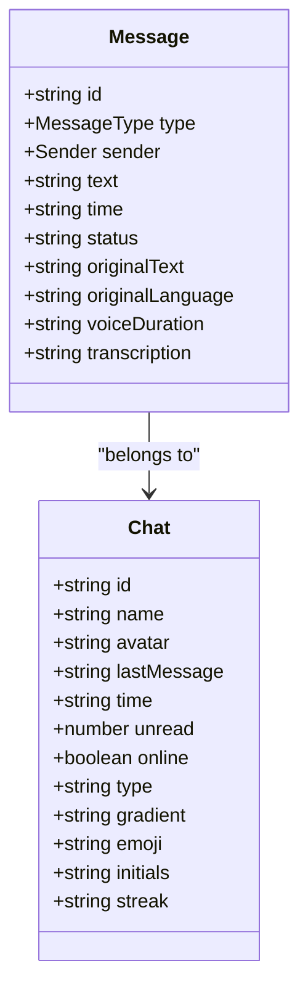
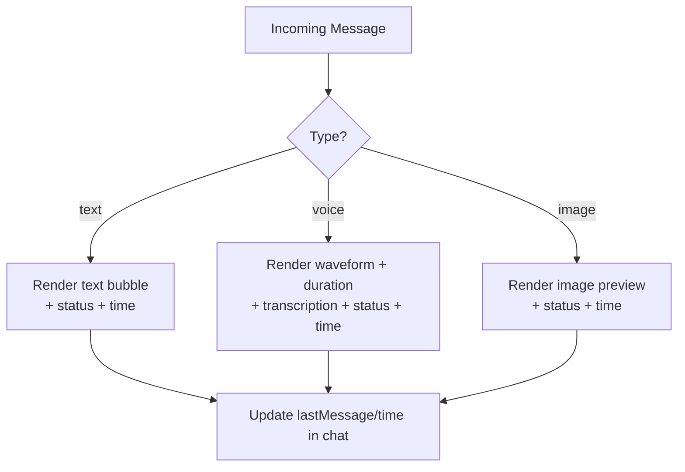
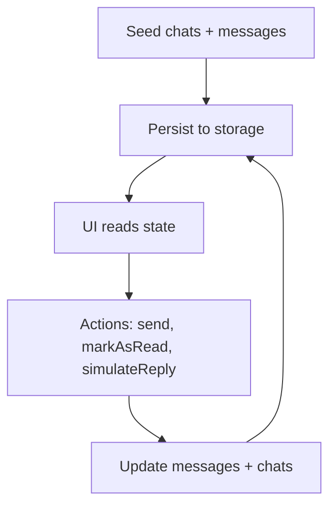
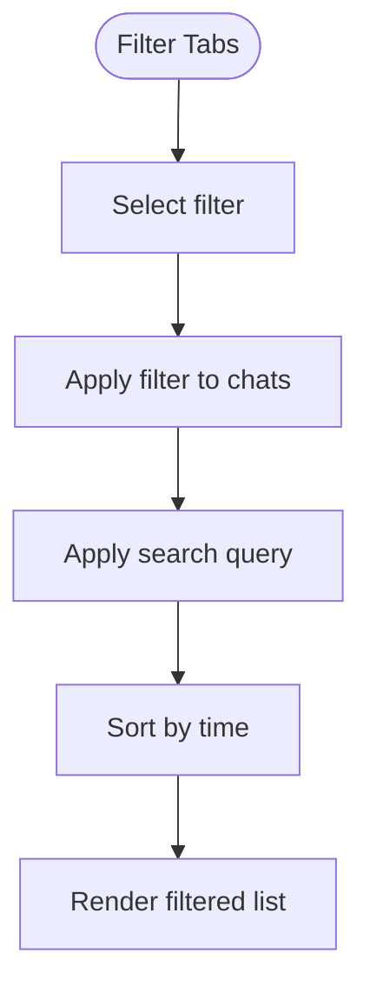
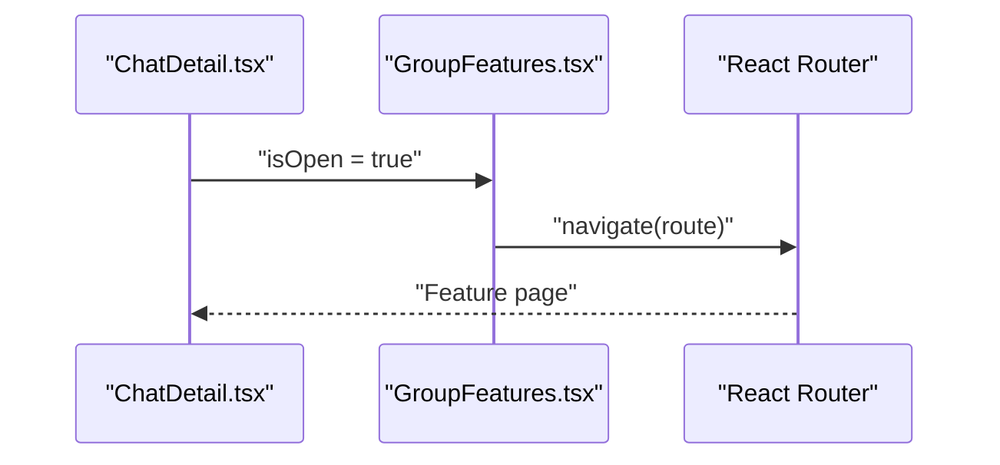
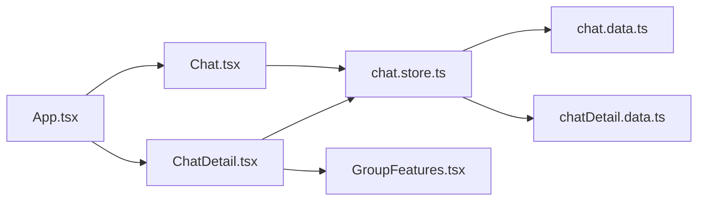

# Messaging System

<cite>
**Referenced Files in This Document**
- [Chat.tsx](file://src/pages/Chat.tsx)
- [ChatDetail.tsx](file://src/pages/ChatDetail.tsx)
- [chat.store.ts](file://src/store/chat.store.ts)
- [chat.data.ts](file://src/data/chat.data.ts)
- [chatDetail.data.ts](file://src/data/chatDetail.data.ts)
- [GroupFeatures.tsx](file://src/components/GroupFeatures.tsx)
- [App.tsx](file://src/App.tsx)
- [ai.data.ts](file://src/data/ai.data.ts)
</cite>

## Table of Contents
1. [Introduction](#introduction)
2. [Project Structure](#project-structure)
3. [Core Components](#core-components)
4. [Architecture Overview](#architecture-overview)
5. [Detailed Component Analysis](#detailed-component-analysis)
6. [Dependency Analysis](#dependency-analysis)
7. [Performance Considerations](#performance-considerations)
8. [Troubleshooting Guide](#troubleshooting-guide)
9. [Conclusion](#conclusion)
10. [Appendices](#appendices)

## Introduction
This document describes VChat’s messaging system comprehensively. It covers the chat list management, message display logic, real-time simulation patterns, chat detail view with conversation threading, message status tracking, typing indicators, and message types (text, voice). It also documents message state management (persistence, read receipts, delivery status), conversation management (search, filtering, archiving), performance optimization strategies, and practical extension points for adding new message types, integrating backend services, and handling edge cases like network failures and message synchronization.

## Project Structure
The messaging system spans UI pages, a central store, and static data seeds:
- Pages: Chat list and chat detail views
- Store: Zustand store with persistence for chats, messages, filters, and search
- Data: Static seeds for chats and messages
- Components: Group features modal for group context features

```mermaid
graph TB
subgraph "Pages"
Chat["Chat.tsx"]
ChatDetail["ChatDetail.tsx"]
end
subgraph "Store"
Store["chat.store.ts"]
end
subgraph "Data"
ChatData["chat.data.ts"]
MsgData["chatDetail.data.ts"]
end
subgraph "Components"
GroupFeatures["GroupFeatures.tsx"]
end
App["App.tsx"]
App --> Chat
App --> ChatDetail
Chat --> Store
ChatDetail --> Store
Store --> ChatData
Store --> MsgData
ChatDetail --> GroupFeatures
```

**Diagram sources**
- [App.tsx:66-133](file://src/App.tsx#L66-L133)
- [Chat.tsx:65-245](file://src/pages/Chat.tsx#L65-L245)
- [ChatDetail.tsx:9-332](file://src/pages/ChatDetail.tsx#L9-L332)
- [chat.store.ts:171-330](file://src/store/chat.store.ts#L171-L330)
- [chat.data.ts:1-134](file://src/data/chat.data.ts#L1-L134)
- [chatDetail.data.ts:1-71](file://src/data/chatDetail.data.ts#L1-L71)
- [GroupFeatures.tsx:14-154](file://src/components/GroupFeatures.tsx#L14-L154)

**Section sources**
- [App.tsx:66-133](file://src/App.tsx#L66-L133)
- [Chat.tsx:65-245](file://src/pages/Chat.tsx#L65-L245)
- [ChatDetail.tsx:9-332](file://src/pages/ChatDetail.tsx#L9-L332)
- [chat.store.ts:171-330](file://src/store/chat.store.ts#L171-L330)
- [chat.data.ts:1-134](file://src/data/chat.data.ts#L1-L134)
- [chatDetail.data.ts:1-71](file://src/data/chatDetail.data.ts#L1-L71)
- [GroupFeatures.tsx:14-154](file://src/components/GroupFeatures.tsx#L14-L154)

## Core Components
- Chat list page: renders conversations, supports search and filter tabs, and navigates to chat detail.
- Chat detail page: displays messages with sender alignment, timestamps, status indicators, and input area.
- Store: manages chats, messages, filters, search, sending messages, marking as read, creating chats, and simulating replies.
- Data seeds: provide initial chats (direct messages, context groups, spaces) and sample messages.

Key responsibilities:
- Chat.tsx: UI rendering, navigation, search/filter UX, and compose actions.
- ChatDetail.tsx: message rendering, translation banner, auto-scroll, input handling, and group features modal.
- chat.store.ts: state model, actions, conversion helpers, persistence, and simulated real-time replies.
- chat.data.ts and chatDetail.data.ts: typed models and seeded data for chats and messages.

**Section sources**
- [Chat.tsx:65-245](file://src/pages/Chat.tsx#L65-L245)
- [ChatDetail.tsx:9-332](file://src/pages/ChatDetail.tsx#L9-L332)
- [chat.store.ts:45-330](file://src/store/chat.store.ts#L45-L330)
- [chat.data.ts:1-134](file://src/data/chat.data.ts#L1-L134)
- [chatDetail.data.ts:1-71](file://src/data/chatDetail.data.ts#L1-L71)

## Architecture Overview
The messaging architecture follows a unidirectional data flow:
- UI components trigger actions via the store.
- Store updates state and persists it.
- UI re-renders based on state changes.
- Simulated real-time replies are scheduled asynchronously.



**Diagram sources**
- [Chat.tsx:69-92](file://src/pages/Chat.tsx#L69-L92)
- [ChatDetail.tsx:302-315](file://src/pages/ChatDetail.tsx#L302-L315)
- [chat.store.ts:179-200](file://src/store/chat.store.ts#L179-L200)
- [chat.store.ts:288-318](file://src/store/chat.store.ts#L288-L318)
- [chat.data.ts:103-159](file://src/data/chat.data.ts#L103-L159)
- [chatDetail.data.ts:19-70](file://src/data/chatDetail.data.ts#L19-L70)

## Detailed Component Analysis

### Chat List Management
- Filters: All, Unread, Groups, Spaces, Archived (Archived currently returns empty).
- Search: Case-insensitive match on name or last message.
- Sorting: By time descending; handles time strings and non-time strings.
- Navigation: Clicking a chat navigates to detail view and marks as read.



**Diagram sources**
- [chat.store.ts:218-266](file://src/store/chat.store.ts#L218-L266)
- [Chat.tsx:142-159](file://src/pages/Chat.tsx#L142-L159)
- [Chat.tsx:162-228](file://src/pages/Chat.tsx#L162-L228)

**Section sources**
- [chat.store.ts:218-266](file://src/store/chat.store.ts#L218-L266)
- [Chat.tsx:69-92](file://src/pages/Chat.tsx#L69-L92)
- [Chat.tsx:142-228](file://src/pages/Chat.tsx#L142-L228)

### Message Display Logic
- Text messages: Aligned left/right, with status indicators (sent/delivered/read) and timestamps.
- Voice messages: Waveform visualization with play button and duration; includes transcription and translation support.
- Translation banner: Toggle to show original text and translation metadata.
- Auto-scroll: On new messages, scroll to the latest.



**Diagram sources**
- [ChatDetail.tsx:26-46](file://src/pages/ChatDetail.tsx#L26-L46)
- [ChatDetail.tsx:155-263](file://src/pages/ChatDetail.tsx#L155-L263)
- [chat.store.ts:47-48](file://src/store/chat.store.ts#L47-L48)

**Section sources**
- [ChatDetail.tsx:155-263](file://src/pages/ChatDetail.tsx#L155-L263)
- [chat.store.ts:47-48](file://src/store/chat.store.ts#L47-L48)

### Real-Time Communication Patterns
- Simulated replies: After sending a message, a random reply appears after a short delay.
- Status transitions: Sent -> Delivered -> Read (mocked via simulated reply).
- Typing indicators: Present in AI chat pages; messaging pages do not render typing indicators.



**Diagram sources**
- [ChatDetail.tsx:302-315](file://src/pages/ChatDetail.tsx#L302-L315)
- [chat.store.ts:179-200](file://src/store/chat.store.ts#L179-L200)
- [chat.store.ts:288-318](file://src/store/chat.store.ts#L288-L318)

**Section sources**
- [ChatDetail.tsx:302-315](file://src/pages/ChatDetail.tsx#L302-L315)
- [chat.store.ts:288-318](file://src/store/chat.store.ts#L288-L318)

### Chat Detail View: Conversation Threading, Status Tracking, Typing Indicators
- Conversation threading: Messages are rendered in order with sender alignment and timestamps.
- Status tracking: Visual indicators reflect sent/delivered/read states.
- Typing indicators: Not present in chat detail; see AI chat for typing animation patterns.



**Diagram sources**
- [chat.store.ts:9-43](file://src/store/chat.store.ts#L9-L43)
- [chatDetail.data.ts:4-16](file://src/data/chatDetail.data.ts#L4-L16)
- [chat.data.ts:15-33](file://src/data/chat.data.ts#L15-L33)

**Section sources**
- [ChatDetail.tsx:155-263](file://src/pages/ChatDetail.tsx#L155-L263)
- [chat.store.ts:9-43](file://src/store/chat.store.ts#L9-L43)
- [chatDetail.data.ts:4-16](file://src/data/chatDetail.data.ts#L4-L16)
- [chat.data.ts:15-33](file://src/data/chat.data.ts#L15-L33)

### Message Types and Handling
- Text messages: Basic text with optional translation/original language metadata.
- Voice messages: Duration, waveform visualization, transcription, and translation support.
- System messages: Not modeled in current data; future extensions can add system message types.



**Diagram sources**
- [ChatDetail.tsx:166-258](file://src/pages/ChatDetail.tsx#L166-L258)
- [chat.store.ts:62-75](file://src/store/chat.store.ts#L62-L75)

**Section sources**
- [ChatDetail.tsx:166-258](file://src/pages/ChatDetail.tsx#L166-L258)
- [chat.store.ts:62-75](file://src/store/chat.store.ts#L62-L75)

### Message State Management
- Persistence: Zustand with persistence middleware stores chats, messages, active filter, and search query.
- Read receipts: Simulated via setting isRead flags on messages.
- Delivery status: Converted from isDelivered/isRead flags to status values.



**Diagram sources**
- [chat.store.ts:171-330](file://src/store/chat.store.ts#L171-L330)

**Section sources**
- [chat.store.ts:171-330](file://src/store/chat.store.ts#L171-L330)

### Conversation Management Features
- Search: Case-insensitive on name and last message.
- Filtering: All, Unread, Groups, Spaces, Archived.
- Archiving: Placeholder for archived conversations (currently returns empty).



**Diagram sources**
- [Chat.tsx:142-159](file://src/pages/Chat.tsx#L142-L159)
- [chat.store.ts:218-266](file://src/store/chat.store.ts#L218-L266)

**Section sources**
- [Chat.tsx:142-159](file://src/pages/Chat.tsx#L142-L159)
- [chat.store.ts:218-266](file://src/store/chat.store.ts#L218-L266)

### Group Features Modal
- Opens from chat detail header for group chats.
- Presents contextual features based on group type (family, work, education, society, colony).



**Diagram sources**
- [ChatDetail.tsx:319-327](file://src/pages/ChatDetail.tsx#L319-L327)
- [GroupFeatures.tsx:14-154](file://src/components/GroupFeatures.tsx#L14-L154)

**Section sources**
- [ChatDetail.tsx:319-327](file://src/pages/ChatDetail.tsx#L319-L327)
- [GroupFeatures.tsx:14-154](file://src/components/GroupFeatures.tsx#L14-L154)

## Dependency Analysis
- UI depends on the store for state and actions.
- Store depends on data seeds for initial state.
- Routing integrates pages into the app shell.



**Diagram sources**
- [App.tsx:66-133](file://src/App.tsx#L66-L133)
- [Chat.tsx:65-245](file://src/pages/Chat.tsx#L65-L245)
- [ChatDetail.tsx:9-332](file://src/pages/ChatDetail.tsx#L9-L332)
- [chat.store.ts:171-330](file://src/store/chat.store.ts#L171-L330)
- [chat.data.ts:103-159](file://src/data/chat.data.ts#L103-L159)
- [chatDetail.data.ts:19-70](file://src/data/chatDetail.data.ts#L19-L70)
- [GroupFeatures.tsx:14-154](file://src/components/GroupFeatures.tsx#L14-L154)

**Section sources**
- [App.tsx:66-133](file://src/App.tsx#L66-L133)
- [chat.store.ts:171-330](file://src/store/chat.store.ts#L171-L330)

## Performance Considerations
- Rendering optimization:
  - Use virtualized lists for large histories to reduce DOM nodes.
  - Memoize message rendering and computed values (filters/search).
- State updates:
  - Batch updates to minimize re-renders (combine message and chat updates).
- Persistence:
  - Persist only necessary fields to reduce storage overhead.
- Network and offline:
  - Queue outgoing messages locally; replay on connectivity.
  - Use background sync to retry failed sends.
- UI responsiveness:
  - Debounce search input to avoid frequent recomputation.
  - Lazy-load heavy components (e.g., media previews).

[No sources needed since this section provides general guidance]

## Troubleshooting Guide
- Messages not appearing:
  - Verify chatId in URL matches a key in messages store.
  - Confirm seed data populates messages for the selected chat.
- Status not updating:
  - Ensure isRead/isDelivered flags are set on incoming messages.
  - Check conversion logic mapping flags to status.
- Simulated replies not arriving:
  - Confirm simulateReply is invoked after send.
  - Verify timeout delay and chat existence.
- Search/filter not working:
  - Ensure search query is normalized (lowercase) and applied to name/lastMessage.
  - Confirm sort logic handles time strings correctly.

**Section sources**
- [chat.store.ts:179-200](file://src/store/chat.store.ts#L179-L200)
- [chat.store.ts:288-318](file://src/store/chat.store.ts#L288-L318)
- [chat.store.ts:62-75](file://src/store/chat.store.ts#L62-L75)
- [chat.store.ts:218-266](file://src/store/chat.store.ts#L218-L266)

## Conclusion
VChat’s messaging system centers around a clean separation of concerns: UI pages, a centralized store with persistence, and typed data seeds. The current implementation focuses on text and voice messages, with robust filtering, search, and simulated real-time replies. Extending to additional message types, system messages, and backend integration is straightforward through the store’s typed interfaces and conversion helpers.

[No sources needed since this section summarizes without analyzing specific files]

## Appendices

### Implementation Examples

- Extending message types:
  - Add new type to MessageType union and update conversion logic.
  - Extend Message interface with new fields (e.g., image metadata).
  - Add rendering logic in ChatDetail for the new type.

- Integrating with backend services:
  - Replace simulateReply with a service call to a backend endpoint.
  - On success, update message status to delivered/read.
  - On failure, keep status as sent and surface retry UI.

- Handling edge cases:
  - Network failures: Queue outgoing messages; retry on reconnect; show retry affordance.
  - Message synchronization: Merge incoming messages with local state; deduplicate by id.
  - Offline handling: Persist pending sends; replay on resume.

[No sources needed since this section provides general guidance]