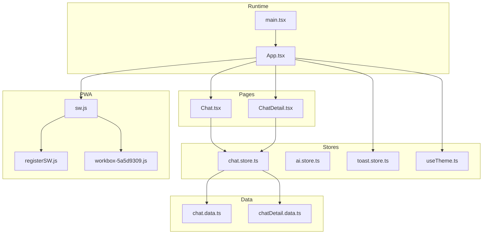
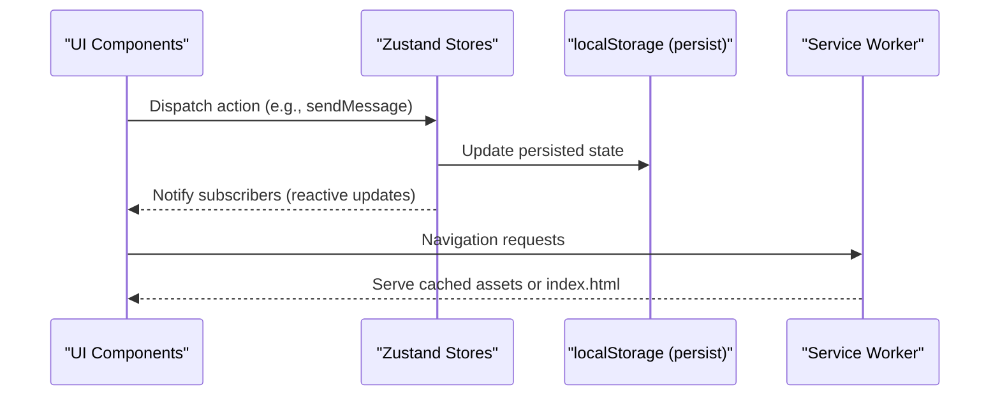
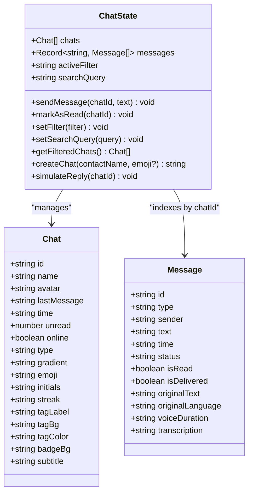
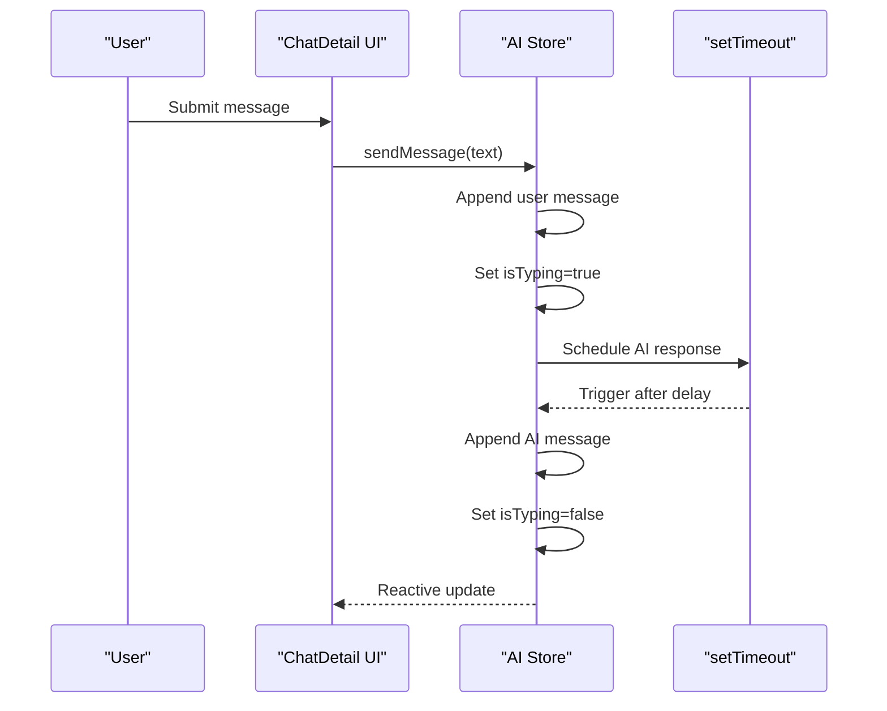
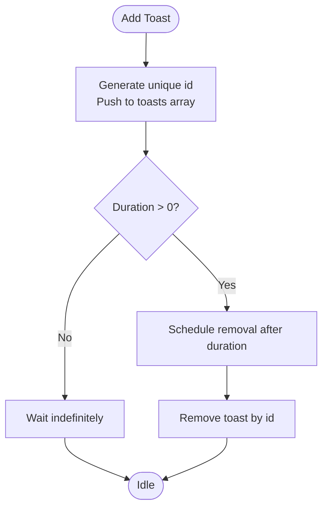
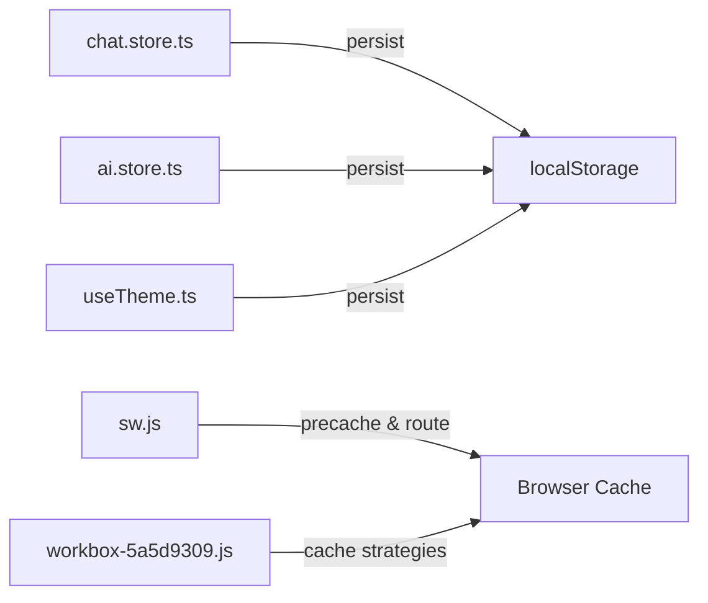

# State Management and Persistence

<cite>
**Referenced Files in This Document**
- [chat.store.ts](file://src/store/chat.store.ts)
- [ai.store.ts](file://src/store/ai.store.ts)
- [toast.store.ts](file://src/store/toast.store.ts)
- [chat.data.ts](file://src/data/chat.data.ts)
- [chatDetail.data.ts](file://src/data/chatDetail.data.ts)
- [Chat.tsx](file://src/pages/Chat.tsx)
- [ChatDetail.tsx](file://src/pages/ChatDetail.tsx)
- [App.tsx](file://src/App.tsx)
- [main.tsx](file://src/main.tsx)
- [useTheme.ts](file://src/hooks/useTheme.ts)
- [sw.js](file://dev-dist/sw.js)
- [registerSW.js](file://dev-dist/registerSW.js)
- [workbox-5a5d9309.js](file://dev-dist/workbox-5a5d9309.js)
- [package.json](file://package.json)
</cite>

## Table of Contents
1. [Introduction](#introduction)
2. [Project Structure](#project-structure)
3. [Core Components](#core-components)
4. [Architecture Overview](#architecture-overview)
5. [Detailed Component Analysis](#detailed-component-analysis)
6. [Dependency Analysis](#dependency-analysis)
7. [Performance Considerations](#performance-considerations)
8. [Troubleshooting Guide](#troubleshooting-guide)
9. [Conclusion](#conclusion)
10. [Appendices](#appendices)

## Introduction
This document explains VChat’s messaging state management and data persistence system. It focuses on the Zustand stores for chats and messages, the AI assistant state, and toast notifications. It documents how local storage persists state, how offline caching and service workers contribute to resilience, and how to extend the system safely. It also covers performance strategies, debugging, error recovery, and privacy considerations.

## Project Structure
VChat organizes state in dedicated store modules under src/store, UI pages under src/pages, and static data under src/data. The application bootstraps via main.tsx and routes through App.tsx. Service workers and Workbox are included under dev-dist for offline caching and PWA behavior.

**Diagram sources**
- [main.tsx:1-11](file://src/main.tsx#L1-L11)
- [App.tsx:1-156](file://src/App.tsx#L1-L156)
- [chat.store.ts:1-349](file://src/store/chat.store.ts#L1-L349)
- [ai.store.ts:1-162](file://src/store/ai.store.ts#L1-L162)
- [toast.store.ts:1-39](file://src/store/toast.store.ts#L1-L39)
- [chat.data.ts:1-134](file://src/data/chat.data.ts#L1-L134)
- [chatDetail.data.ts:1-71](file://src/data/chatDetail.data.ts#L1-L71)
- [Chat.tsx:1-245](file://src/pages/Chat.tsx#L1-L245)
- [ChatDetail.tsx:1-332](file://src/pages/ChatDetail.tsx#L1-L332)
- [sw.js:1-93](file://dev-dist/sw.js#L1-L93)
- [registerSW.js:1-1](file://dev-dist/registerSW.js#L1-L1)
- [workbox-5a5d9309.js:760-2030](file://dev-dist/workbox-5a5d9309.js#L760-L2030)

**Section sources**
- [main.tsx:1-11](file://src/main.tsx#L1-L11)
- [App.tsx:1-156](file://src/App.tsx#L1-L156)
- [chat.store.ts:1-349](file://src/store/chat.store.ts#L1-L349)
- [ai.store.ts:1-162](file://src/store/ai.store.ts#L1-L162)
- [toast.store.ts:1-39](file://src/store/toast.store.ts#L1-L39)
- [chat.data.ts:1-134](file://src/data/chat.data.ts#L1-L134)
- [chatDetail.data.ts:1-71](file://src/data/chatDetail.data.ts#L1-L71)
- [Chat.tsx:1-245](file://src/pages/Chat.tsx#L1-L245)
- [ChatDetail.tsx:1-332](file://src/pages/ChatDetail.tsx#L1-L332)
- [sw.js:1-93](file://dev-dist/sw.js#L1-L93)
- [registerSW.js:1-1](file://dev-dist/registerSW.js#L1-L1)
- [workbox-5a5d9309.js:760-2030](file://dev-dist/workbox-5a5d9309.js#L760-L2030)

## Core Components
- Zustand stores:
  - Chat store: manages conversations, messages, filters, search, and actions like sending messages, marking as read, filtering, creating chats, and simulating replies.
  - AI store: maintains AI assistant messages and typing state with simulated responses.
  - Toast store: manages transient notifications.
  - Theme hook: persists theme preference via Zustand with localStorage.
- Pages:
  - Chat page: renders chat list, filters, search, and navigation to chat detail.
  - Chat detail page: displays messages, handles input, and integrates with the chat store.
- Data:
  - Static seeds for chats and messages to bootstrap state.
- PWA:
  - Service worker and Workbox precache and navigation routing for offline readiness.

Key implementation references:
- Chat store actions and persistence: [chat.store.ts:171-330](file://src/store/chat.store.ts#L171-L330)
- AI store actions and persistence: [ai.store.ts:113-161](file://src/store/ai.store.ts#L113-L161)
- Toast store actions: [toast.store.ts:17-38](file://src/store/toast.store.ts#L17-L38)
- Theme persistence: [useTheme.ts:10-36](file://src/hooks/useTheme.ts#L10-L36)
- Chat page integration: [Chat.tsx:69-92](file://src/pages/Chat.tsx#L69-L92)
- Chat detail integration: [ChatDetail.tsx:24-46](file://src/pages/ChatDetail.tsx#L24-L46)

**Section sources**
- [chat.store.ts:1-349](file://src/store/chat.store.ts#L1-L349)
- [ai.store.ts:1-162](file://src/store/ai.store.ts#L1-L162)
- [toast.store.ts:1-39](file://src/store/toast.store.ts#L1-L39)
- [useTheme.ts:1-36](file://src/hooks/useTheme.ts#L1-L36)
- [Chat.tsx:1-245](file://src/pages/Chat.tsx#L1-L245)
- [ChatDetail.tsx:1-332](file://src/pages/ChatDetail.tsx#L1-L332)

## Architecture Overview
The state architecture centers on Zustand stores with localStorage persistence via the persist middleware. UI pages subscribe to stores and trigger actions that mutate state. Service workers and Workbox provide offline caching for static assets and navigation.

**Diagram sources**
- [chat.store.ts:171-330](file://src/store/chat.store.ts#L171-L330)
- [ai.store.ts:113-161](file://src/store/ai.store.ts#L113-L161)
- [toast.store.ts:17-38](file://src/store/toast.store.ts#L17-L38)
- [sw.js:80-91](file://dev-dist/sw.js#L80-L91)
- [workbox-5a5d9309.js:760-2030](file://dev-dist/workbox-5a5d9309.js#L760-L2030)

## Detailed Component Analysis

### Chat Store: Messages, Conversations, Filters, and Persistence
The chat store encapsulates:
- State: chats array, messages indexed by chatId, activeFilter, searchQuery.
- Actions: sendMessage, markAsRead, setFilter, setSearchQuery, getFilteredChats, createChat, simulateReply.
- Persistence: localStorage via persist middleware with selective serialization.

**Diagram sources**
- [chat.store.ts:9-43](file://src/store/chat.store.ts#L9-L43)
- [chat.store.ts:45-59](file://src/store/chat.store.ts#L45-L59)

Key behaviors:
- Message lifecycle: send, simulate reply, status propagation.
- Conversation lifecycle: create chat, update lastMessage/time, unread counters.
- Filtering and search: client-side filtering and sorting by time.
- Persistence: selective partialization of chats, messages, filters, and search query.

References:
- State shape and actions: [chat.store.ts:45-59](file://src/store/chat.store.ts#L45-L59)
- sendMessage: [chat.store.ts:179-200](file://src/store/chat.store.ts#L179-L200)
- markAsRead: [chat.store.ts:202-208](file://src/store/chat.store.ts#L202-L208)
- getFilteredChats: [chat.store.ts:218-266](file://src/store/chat.store.ts#L218-L266)
- createChat: [chat.store.ts:268-286](file://src/store/chat.store.ts#L268-L286)
- simulateReply: [chat.store.ts:288-318](file://src/store/chat.store.ts#L288-L318)
- Persistence config: [chat.store.ts:320-329](file://src/store/chat.store.ts#L320-L329)

**Section sources**
- [chat.store.ts:1-349](file://src/store/chat.store.ts#L1-L349)
- [chat.data.ts:1-134](file://src/data/chat.data.ts#L1-L134)
- [chatDetail.data.ts:1-71](file://src/data/chatDetail.data.ts#L1-L71)

### AI Assistant Store: Simulated Responses and Typing State
The AI store maintains a conversation-like array of messages and a typing indicator. It simulates AI responses with randomized delays and keyword-based replies.

**Diagram sources**
- [ai.store.ts:119-148](file://src/store/ai.store.ts#L119-L148)
- [ChatDetail.tsx:302-315](file://src/pages/ChatDetail.tsx#L302-L315)

References:
- State and actions: [ai.store.ts:11-17](file://src/store/ai.store.ts#L11-L17)
- sendMessage: [ai.store.ts:119-148](file://src/store/ai.store.ts#L119-L148)
- clearHistory: [ai.store.ts:150-155](file://src/store/ai.store.ts#L150-L155)
- Persistence: [ai.store.ts:157-160](file://src/store/ai.store.ts#L157-L160)

**Section sources**
- [ai.store.ts:1-162](file://src/store/ai.store.ts#L1-L162)
- [ChatDetail.tsx:1-332](file://src/pages/ChatDetail.tsx#L1-L332)

### Toast Store: Temporary Notifications
The toast store provides a simple queue of transient notifications with auto-dismissal.

**Diagram sources**
- [toast.store.ts:17-38](file://src/store/toast.store.ts#L17-L38)

References:
- State and actions: [toast.store.ts:11-15](file://src/store/toast.store.ts#L11-L15)
- addToast: [toast.store.ts:19-31](file://src/store/toast.store.ts#L19-L31)
- removeToast: [toast.store.ts:33-37](file://src/store/toast.store.ts#L33-L37)

**Section sources**
- [toast.store.ts:1-39](file://src/store/toast.store.ts#L1-L39)

### Theme Persistence: Dark/Light Mode
The theme hook persists the theme preference using Zustand with localStorage.

References:
- Store definition and persistence: [useTheme.ts:10-36](file://src/hooks/useTheme.ts#L10-L36)

**Section sources**
- [useTheme.ts:1-36](file://src/hooks/useTheme.ts#L1-L36)

### UI Integration: Chat List and Chat Detail
- Chat page subscribes to chat store for filtered chats, search, and filters; triggers creation and navigation.
- Chat detail page subscribes to messages and chat metadata; handles input submission and auto-scroll.

References:
- Chat page: [Chat.tsx:69-92](file://src/pages/Chat.tsx#L69-L92)
- Chat detail: [ChatDetail.tsx:24-46](file://src/pages/ChatDetail.tsx#L24-L46)

**Section sources**
- [Chat.tsx:1-245](file://src/pages/Chat.tsx#L1-L245)
- [ChatDetail.tsx:1-332](file://src/pages/ChatDetail.tsx#L1-L332)

## Dependency Analysis
External libraries:
- Zustand: state management with middleware support.
- Framer Motion and Lucide React: UI animations and icons.
- Workbox and service worker: offline caching and navigation routing.

**Diagram sources**
- [chat.store.ts:320-329](file://src/store/chat.store.ts#L320-L329)
- [ai.store.ts:157-160](file://src/store/ai.store.ts#L157-L160)
- [useTheme.ts:32-35](file://src/hooks/useTheme.ts#L32-L35)
- [sw.js:80-91](file://dev-dist/sw.js#L80-L91)
- [workbox-5a5d9309.js:760-2030](file://dev-dist/workbox-5a5d9309.js#L760-L2030)

**Section sources**
- [package.json:12-38](file://package.json#L12-L38)
- [chat.store.ts:320-329](file://src/store/chat.store.ts#L320-L329)
- [ai.store.ts:157-160](file://src/store/ai.store.ts#L157-L160)
- [useTheme.ts:32-35](file://src/hooks/useTheme.ts#L32-L35)
- [sw.js:80-91](file://dev-dist/sw.js#L80-L91)
- [workbox-5a5d9309.js:760-2030](file://dev-dist/workbox-5a5d9309.js#L760-L2030)

## Performance Considerations
- Lazy loading and code splitting:
  - Pages are lazily imported via React.lazy in App.tsx, reducing initial bundle size.
- Pagination and virtualization:
  - Not implemented yet. Consider virtualized lists for large message histories.
- Memory management:
  - Keep only necessary message slices in memory; avoid storing redundant metadata.
  - Periodically prune old or archived conversations.
- Rendering optimizations:
  - Use shallow comparisons and memoization in components to minimize re-renders.
- Offline caching:
  - Service worker precaches key assets; consider caching strategy for dynamic content if needed.

[No sources needed since this section provides general guidance]

## Troubleshooting Guide
- State not persisting:
  - Verify persist middleware is configured and keys match expectations.
  - Confirm localStorage availability and quota limits.
- Out-of-sync UI:
  - Ensure components subscribe to the correct store slices.
  - Avoid mutating state outside of actions.
- Service worker not activating:
  - Check registration script and scope.
  - Inspect browser DevTools Application tab for registered service workers.
- Quota exceeded errors:
  - Workbox logs indicate quota errors when caching; implement eviction policies or reduce cache sizes.

References:
- Persist configuration examples: [chat.store.ts:320-329](file://src/store/chat.store.ts#L320-L329), [ai.store.ts:157-160](file://src/store/ai.store.ts#L157-L160), [useTheme.ts:32-35](file://src/hooks/useTheme.ts#L32-L35)
- Service worker registration: [registerSW.js:1](file://dev-dist/registerSW.js#L1)
- Workbox cache update and quota handling: [workbox-5a5d9309.js:2000-2030](file://dev-dist/workbox-5a5d9309.js#L2000-L2030)

**Section sources**
- [chat.store.ts:320-329](file://src/store/chat.store.ts#L320-L329)
- [ai.store.ts:157-160](file://src/store/ai.store.ts#L157-L160)
- [useTheme.ts:32-35](file://src/hooks/useTheme.ts#L32-L35)
- [registerSW.js:1](file://dev-dist/registerSW.js#L1)
- [workbox-5a5d9309.js:2000-2030](file://dev-dist/workbox-5a5d9309.js#L2000-L2030)

## Conclusion
VChat’s state management relies on lightweight, composable Zustand stores with localStorage persistence. The chat store centralizes messaging and conversation logic, while the AI store simulates conversational flows. UI pages integrate tightly with stores for reactive updates. Service workers and Workbox support offline readiness. Extensibility is straightforward: add new slices, actions, and persistence keys. Future enhancements should focus on pagination, virtualization, and robust offline strategies.

[No sources needed since this section summarizes without analyzing specific files]

## Appendices

### State Hydration During Initialization
- The stores are initialized with seeded data and hydrated from localStorage via the persist middleware. Ensure the storage keys align with the store names and partialize functions.

References:
- Chat store hydration: [chat.store.ts:171-330](file://src/store/chat.store.ts#L171-L330)
- AI store hydration: [ai.store.ts:113-161](file://src/store/ai.store.ts#L113-L161)
- Theme hydration: [useTheme.ts:10-36](file://src/hooks/useTheme.ts#L10-L36)

**Section sources**
- [chat.store.ts:171-330](file://src/store/chat.store.ts#L171-L330)
- [ai.store.ts:113-161](file://src/store/ai.store.ts#L113-L161)
- [useTheme.ts:10-36](file://src/hooks/useTheme.ts#L10-L36)

### Data Migration Strategies
- Versioned storage keys:
  - Change the storage name in persist middleware when schema evolves (e.g., from "chat-storage" to "chat-storage-v2").
- Partialize migrations:
  - Use partialize to migrate only relevant fields during hydration.
- Graceful degradation:
  - Provide default values for missing fields to avoid runtime errors.

References:
- Storage key examples: [chat.store.ts:321](file://src/store/chat.store.ts#L321), [ai.store.ts:158](file://src/store/ai.store.ts#L158), [useTheme.ts:33](file://src/hooks/useTheme.ts#L33)

**Section sources**
- [chat.store.ts:320-329](file://src/store/chat.store.ts#L320-L329)
- [ai.store.ts:157-160](file://src/store/ai.store.ts#L157-L160)
- [useTheme.ts:32-35](file://src/hooks/useTheme.ts#L32-L35)

### Backup and Restore
- Export current state slices (e.g., chats, messages, AI history) to JSON for manual backup.
- Import backups by replacing the relevant localStorage entries or rehydrating stores programmatically.

[No sources needed since this section provides general guidance]

### Encryption and Privacy
- End-to-end encryption for messages is not implemented in the current codebase.
- Privacy notes for offline AI are present in the UI; ensure any future encryption is enforced at the transport and storage layers.

References:
- Privacy note in settings: [AITwinSettings.tsx:121-123](file://src/pages/profile/AITwinSettings.tsx#L121-L123)

**Section sources**
- [AITwinSettings.tsx:121-123](file://src/pages/profile/AITwinSettings.tsx#L121-L123)

### Extending the State System
- Add a new slice:
  - Define types and initial state.
  - Create actions and reducers.
  - Wrap with persist middleware and choose fields to serialize.
- Integrate with external data sources:
  - Use fetch or WebSocket to synchronize with a backend.
  - Normalize incoming data into existing models.
  - Handle optimistic updates and rollback on failure.

[No sources needed since this section provides general guidance]

### Testing Strategies
- Unit tests for store logic:
  - Test actions and selectors in isolation.
  - Mock localStorage for deterministic hydration tests.
- Integration tests:
  - Verify UI reacts to store changes.
  - Simulate network failures and offline scenarios.
- Snapshot tests:
  - Capture serialized store state after key operations.

[No sources needed since this section provides general guidance]