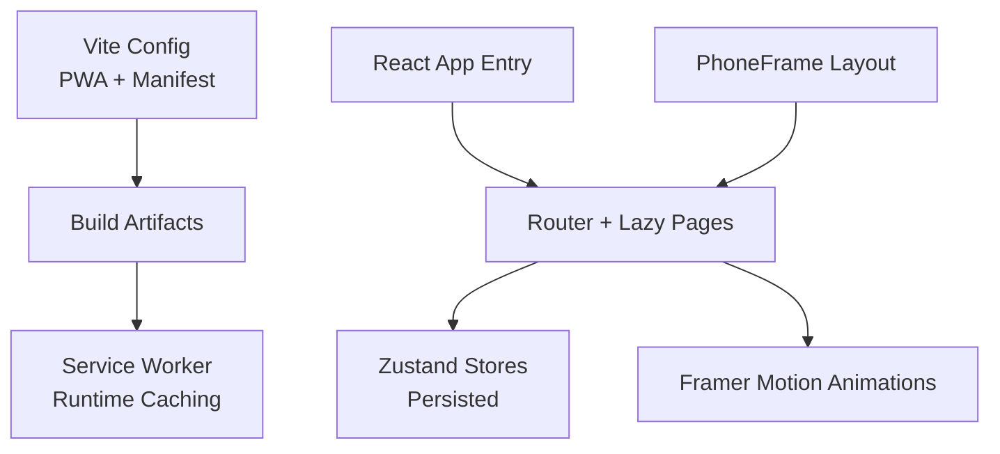
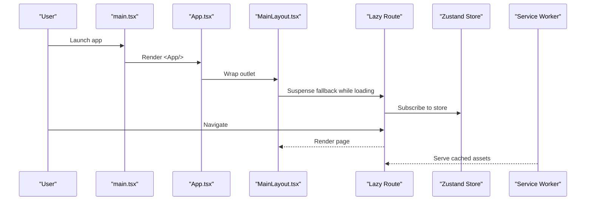
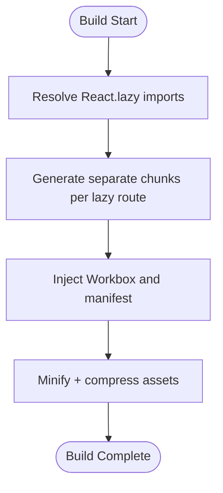
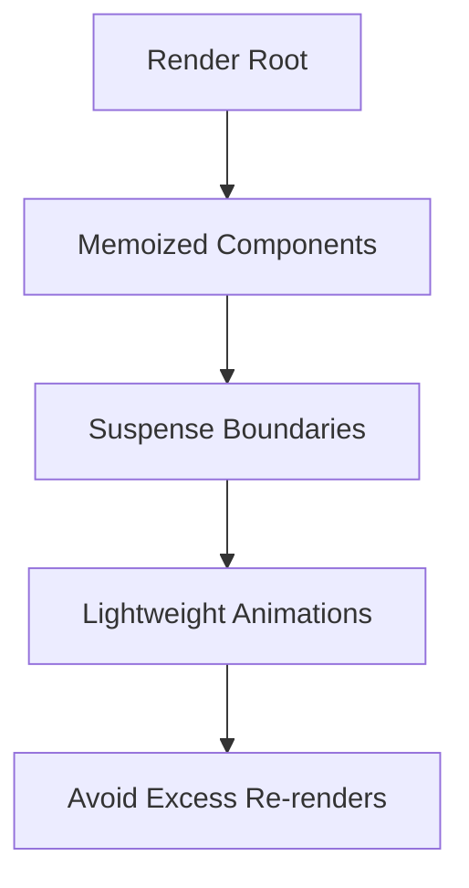
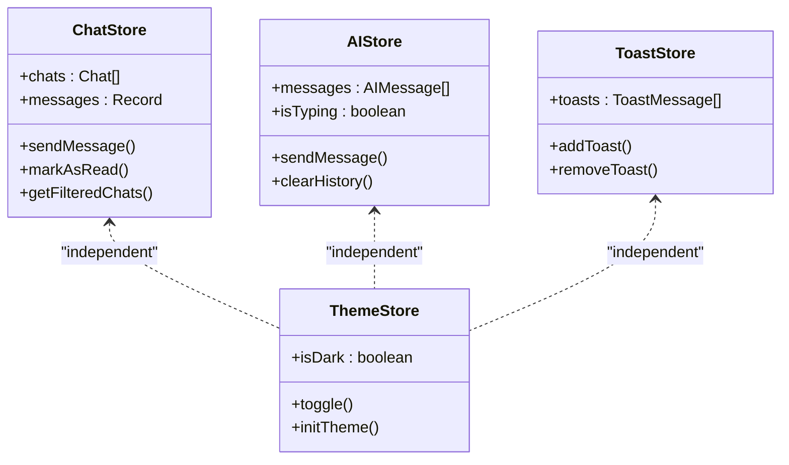
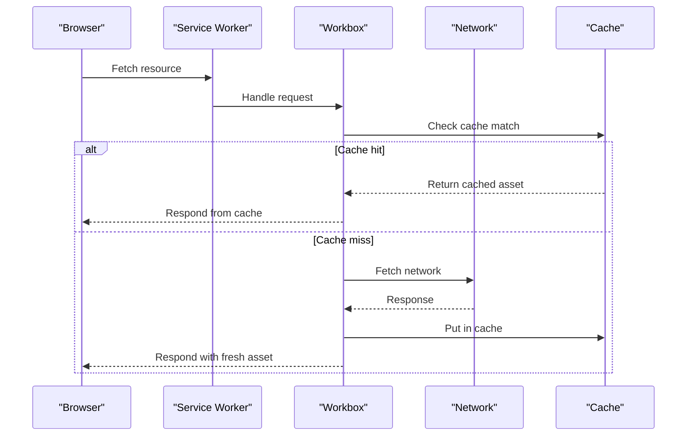
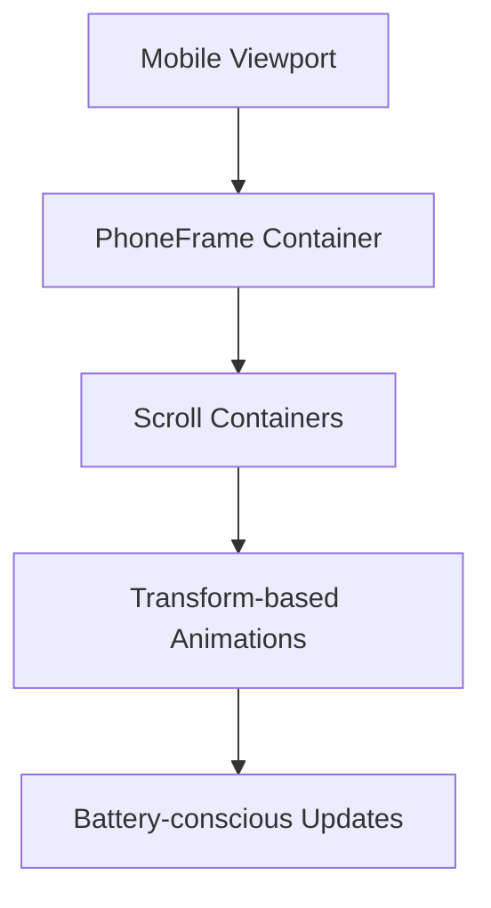
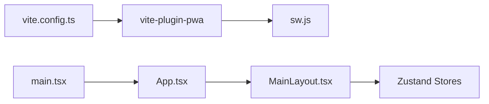

# Performance Optimization

<cite>
**Referenced Files in This Document**
- [vite.config.ts](file://vite.config.ts)
- [package.json](file://package.json)
- [src/main.tsx](file://src/main.tsx)
- [src/App.tsx](file://src/App.tsx)
- [src/components/layouts/MainLayout.tsx](file://src/components/layouts/MainLayout.tsx)
- [src/components/PhoneFrame.tsx](file://src/components/PhoneFrame.tsx)
- [src/store/chat.store.ts](file://src/store/chat.store.ts)
- [src/store/ai.store.ts](file://src/store/ai.store.ts)
- [src/store/toast.store.ts](file://src/store/toast.store.ts)
- [src/hooks/useTheme.ts](file://src/hooks/useTheme.ts)
- [src/pages/Home.tsx](file://src/pages/Home.tsx)
- [src/pages/Chat.tsx](file://dev-dist/sw.js)
- [dev-dist/sw.js](file://dev-dist/sw.js)
</cite>

## Table of Contents
1. [Introduction](#introduction)
2. [Project Structure](#project-structure)
3. [Core Components](#core-components)
4. [Architecture Overview](#architecture-overview)
5. [Detailed Component Analysis](#detailed-component-analysis)
6. [Dependency Analysis](#dependency-analysis)
7. [Performance Considerations](#performance-considerations)
8. [Troubleshooting Guide](#troubleshooting-guide)
9. [Conclusion](#conclusion)
10. [Appendices](#appendices)

## Introduction
This document consolidates VChat’s performance optimization strategies and best practices across build-time, runtime, state management, PWA, and mobile-specific optimizations. It provides actionable guidance for bundle analysis, runtime performance tracking, memory management, React rendering efficiency, Zustand store composition, PWA caching, mobile touch and animation performance, and practical profiling and monitoring techniques to prevent regressions.

## Project Structure
VChat is a React + TypeScript SPA built with Vite and enhanced with PWA capabilities. Key performance-relevant areas:
- Build pipeline and PWA caching are configured in Vite and injected service worker.
- Routing and lazy loading are implemented via React.lazy and Suspense.
- UI animations leverage Framer Motion for smooth transitions.
- State management uses Zustand stores with persistence for offline-friendly UX.
- Mobile-first layout and responsive behavior are handled via a phone-frame wrapper and Tailwind utilities.

**Diagram sources**
- [vite.config.ts:1-57](file://vite.config.ts#L1-L57)
- [src/main.tsx:1-11](file://src/main.tsx#L1-L11)
- [src/App.tsx:12-50](file://src/App.tsx#L12-L50)
- [src/components/layouts/MainLayout.tsx:14-17](file://src/components/layouts/MainLayout.tsx#L14-L17)
- [src/components/PhoneFrame.tsx:1-53](file://src/components/PhoneFrame.tsx#L1-L53)

**Section sources**
- [vite.config.ts:1-57](file://vite.config.ts#L1-L57)
- [src/main.tsx:1-11](file://src/main.tsx#L1-L11)
- [src/App.tsx:12-50](file://src/App.tsx#L12-L50)
- [src/components/layouts/MainLayout.tsx:14-17](file://src/components/layouts/MainLayout.tsx#L14-L17)
- [src/components/PhoneFrame.tsx:1-53](file://src/components/PhoneFrame.tsx#L1-L53)

## Core Components
- Vite build and PWA: Auto-update service worker, runtime caching for fonts, and a manifest for installability.
- Lazy routes and Suspense: Code-split per-page bundles and graceful loading fallback.
- Zustand stores: Modular, persisted stores for chat, AI, toasts, and theme.
- Framer Motion: Lightweight page transitions and micro-interactions.
- PhoneFrame: Responsive container with desktop simulation and mobile viewport handling.

**Section sources**
- [vite.config.ts:9-54](file://vite.config.ts#L9-L54)
- [src/App.tsx:12-50](file://src/App.tsx#L12-L50)
- [src/components/layouts/MainLayout.tsx:14-17](file://src/components/layouts/MainLayout.tsx#L14-L17)
- [src/store/chat.store.ts:171-330](file://src/store/chat.store.ts#L171-L330)
- [src/store/ai.store.ts:113-161](file://src/store/ai.store.ts#L113-L161)
- [src/store/toast.store.ts:17-38](file://src/store/toast.store.ts#L17-L38)
- [src/hooks/useTheme.ts:10-36](file://src/hooks/useTheme.ts#L10-L36)

## Architecture Overview
High-level runtime flow: entry renders App inside StrictMode, router lazily loads pages, Suspense provides fallback, stores manage state with persistence, and animations enhance UX. PWA handles caching and offline navigation.

**Diagram sources**
- [src/main.tsx:6-10](file://src/main.tsx#L6-L10)
- [src/App.tsx:150-156](file://src/App.tsx#L150-L156)
- [src/components/layouts/MainLayout.tsx:14-17](file://src/components/layouts/MainLayout.tsx#L14-L17)
- [src/App.tsx:12-50](file://src/App.tsx#L12-L50)
- [dev-dist/sw.js:80-91](file://dev-dist/sw.js#L80-L91)

## Detailed Component Analysis

### Vite Build Optimization
- Code splitting: Implemented via React.lazy for all major pages and route groups.
- Tree shaking: Enabled by default in Vite with modern ES modules; ensure dynamic imports remain side-effect-free.
- Asset optimization: PWA plugin injects Workbox; runtime caching configured for external resources.
- Bundle analysis: Use Vite’s built-in preview and third-party tools to inspect bundle composition.

**Diagram sources**
- [src/App.tsx:12-50](file://src/App.tsx#L12-L50)
- [vite.config.ts:9-54](file://vite.config.ts#L9-L54)

**Section sources**
- [src/App.tsx:12-50](file://src/App.tsx#L12-L50)
- [vite.config.ts:9-54](file://vite.config.ts#L9-L54)

### Runtime Performance Tracking and Monitoring
- Measure First Contentful Paint (FCP), Largest Contentful Paint (LCP), and Interaction to Next Paint (INP) via browser devtools and Performance API.
- Track long tasks (>50ms) to identify jank; defer non-critical work to idle callbacks.
- Monitor memory growth during extended sessions; watch for leaks in timers, listeners, and closures.
- Use React Devtools Profiler to identify expensive renders and unnecessary re-renders.

[No sources needed since this section provides general guidance]

### Memory Management
- Avoid retaining references to removed DOM nodes; clean up event listeners and intervals on unmount.
- Limit store state size; prefer normalized shapes and pagination for lists.
- Debounce or throttle frequent handlers (e.g., resize, scroll).
- Use WeakMap/WeakSet for internal caches keyed by DOM nodes.

[No sources needed since this section provides general guidance]

### React Rendering Optimization
- Prefer React.memo for static subtrees; memoize heavy computations with useMemo/useCallback.
- Keep render trees shallow; hoist static content out of loops.
- Use Suspense boundaries to avoid blocking renders while lazy-loading.
- Minimize prop drilling; scope stores to pages or feature modules.

**Diagram sources**
- [src/App.tsx:52-64](file://src/App.tsx#L52-L64)
- [src/components/layouts/MainLayout.tsx:14-17](file://src/components/layouts/MainLayout.tsx#L14-L17)
- [src/pages/Home.tsx:280-294](file://src/pages/Home.tsx#L280-L294)
- [src/pages/Chat.tsx:65-244](file://src/pages/Chat.tsx#L65-L244)

**Section sources**
- [src/App.tsx:52-64](file://src/App.tsx#L52-L64)
- [src/components/layouts/MainLayout.tsx:14-17](file://src/components/layouts/MainLayout.tsx#L14-L17)
- [src/pages/Home.tsx:280-294](file://src/pages/Home.tsx#L280-L294)
- [src/pages/Chat.tsx:65-244](file://src/pages/Chat.tsx#L65-L244)

### State Management Optimization with Zustand
- Composition: Split concerns into focused stores (chat, AI, toast, theme) to minimize cross-store dependencies.
- Persistence: Persist only necessary slices to reduce IndexedDB churn and restore overhead.
- Actions: Keep actions pure and small; batch updates when possible.
- Subscriptions: Scope subscriptions to minimal component trees; unsubscribe on unmount.

**Diagram sources**
- [src/store/chat.store.ts:45-59](file://src/store/chat.store.ts#L45-L59)
- [src/store/ai.store.ts:11-17](file://src/store/ai.store.ts#L11-L17)
- [src/store/toast.store.ts:11-15](file://src/store/toast.store.ts#L11-L15)
- [src/hooks/useTheme.ts:4-8](file://src/hooks/useTheme.ts#L4-L8)

**Section sources**
- [src/store/chat.store.ts:171-330](file://src/store/chat.store.ts#L171-L330)
- [src/store/ai.store.ts:113-161](file://src/store/ai.store.ts#L113-L161)
- [src/store/toast.store.ts:17-38](file://src/store/toast.store.ts#L17-L38)
- [src/hooks/useTheme.ts:10-36](file://src/hooks/useTheme.ts#L10-L36)

### PWA Performance Considerations
- Service worker lifecycle: Auto-update registration ensures users receive optimized builds promptly.
- Runtime caching: Fonts cached via CacheFirst to reduce repeat fetch latency.
- Precaching: Navigation and static assets precached for instant startup.
- Offline navigation: Workbox routes navigation requests to index.html for SPA routing.

**Diagram sources**
- [vite.config.ts:9-29](file://vite.config.ts#L9-L29)
- [dev-dist/sw.js:80-91](file://dev-dist/sw.js#L80-L91)

**Section sources**
- [vite.config.ts:9-29](file://vite.config.ts#L9-L29)
- [dev-dist/sw.js:80-91](file://dev-dist/sw.js#L80-L91)

### Mobile Performance Optimization
- Touch interactions: Use Framer Motion’s gesture-friendly animations; avoid heavy transforms on scrollable containers.
- Animation performance: Prefer transform/opacity; minimize layout thrashing; batch DOM reads/writes.
- Battery usage: Reduce CPU-intensive work on low-power devices; throttle animations in background tabs.
- Viewport and layout: PhoneFrame adapts to device width; ensure scroll containers use transform-based scrolling.

**Diagram sources**
- [src/components/PhoneFrame.tsx:12-51](file://src/components/PhoneFrame.tsx#L12-L51)
- [src/pages/Home.tsx:280-294](file://src/pages/Home.tsx#L280-L294)
- [src/pages/Chat.tsx:65-244](file://src/pages/Chat.tsx#L65-L244)

**Section sources**
- [src/components/PhoneFrame.tsx:12-51](file://src/components/PhoneFrame.tsx#L12-L51)
- [src/pages/Home.tsx:280-294](file://src/pages/Home.tsx#L280-L294)
- [src/pages/Chat.tsx:65-244](file://src/pages/Chat.tsx#L65-L244)

## Dependency Analysis
- Build-time: Vite orchestrates bundling; PWA plugin configures service worker and caching.
- Runtime: React.lazy + Suspense decouple UI from heavy bundles; Zustand stores encapsulate state and persistence.

**Diagram sources**
- [vite.config.ts:1-57](file://vite.config.ts#L1-L57)
- [src/main.tsx:1-11](file://src/main.tsx#L1-L11)
- [src/App.tsx:150-156](file://src/App.tsx#L150-L156)
- [src/components/layouts/MainLayout.tsx:14-17](file://src/components/layouts/MainLayout.tsx#L14-L17)

**Section sources**
- [vite.config.ts:1-57](file://vite.config.ts#L1-L57)
- [src/main.tsx:1-11](file://src/main.tsx#L1-L11)
- [src/App.tsx:150-156](file://src/App.tsx#L150-L156)
- [src/components/layouts/MainLayout.tsx:14-17](file://src/components/layouts/MainLayout.tsx#L14-L17)

## Performance Considerations
- Bundle analysis: Inspect chunk sizes and dependencies; split further if needed.
- Rendering: Keep components pure; memoize expensive props; avoid unnecessary re-renders.
- State: Normalize data; paginate lists; persist only essential slices.
- PWA: Tune cache expiration and strategy per asset type; monitor storage quotas.
- Mobile: Prefer CSS animations; avoid layout trashing; test on real devices.

[No sources needed since this section provides general guidance]

## Troubleshooting Guide
- Long tasks: Use browser devtools to locate and defer heavy work.
- Memory leaks: Verify cleanup of timers, listeners, and subscriptions; monitor heap snapshots.
- Store bloat: Audit persisted slices; remove unused keys; consider selective persistence.
- PWA caching: Clear origin data in devtools Application panel; verify cache names and expiration.

**Section sources**
- [src/store/chat.store.ts:320-330](file://src/store/chat.store.ts#L320-L330)
- [src/store/ai.store.ts:157-160](file://src/store/ai.store.ts#L157-L160)
- [src/store/toast.store.ts:25-31](file://src/store/toast.store.ts#L25-L31)

## Conclusion
VChat’s performance foundation combines strategic code splitting, lightweight state management, and robust PWA caching. By adhering to the outlined best practices—memoization, scoped stores, conservative persistence, and mobile-aware animations—you can maintain fast, smooth experiences across devices and network conditions.

## Appendices
- Metrics to track: FCP, LCP, INP, memory growth, JS heap, and cache hit rate.
- Monitoring dashboards: Integrate with browser perf APIs and analytics platforms to log key metrics.
- Regression prevention: Add performance budgets to CI; snapshot and compare bundle sizes and metrics across PRs.

[No sources needed since this section provides general guidance]