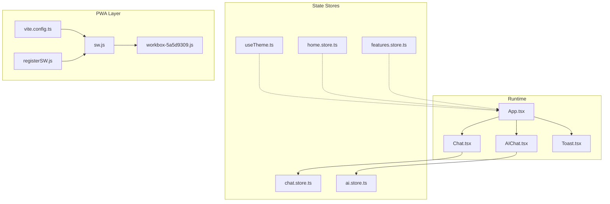
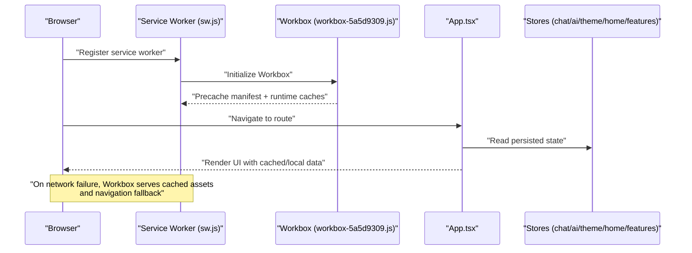
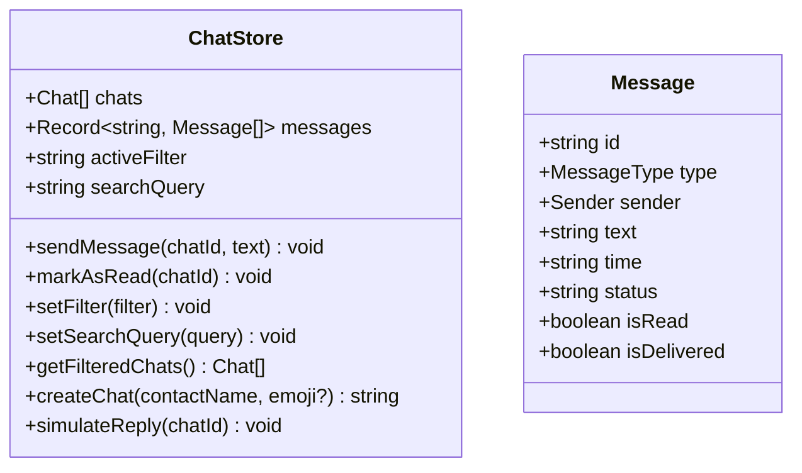
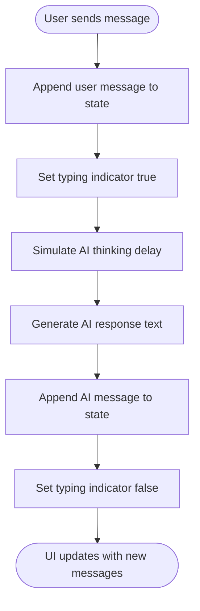
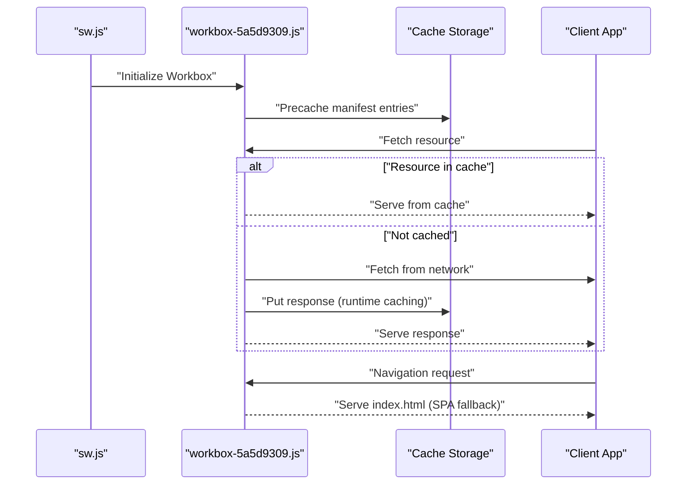
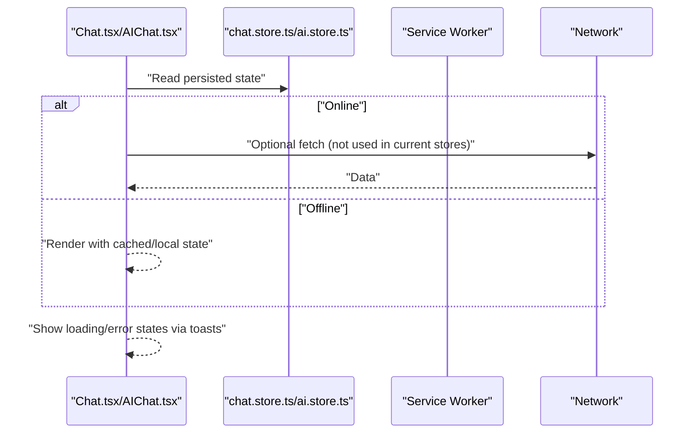
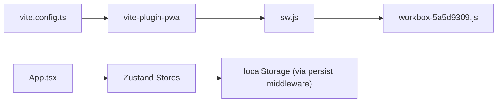

# Offline Functionality

<cite>
**Referenced Files in This Document**
- [chat.store.ts](file://src/store/chat.store.ts)
- [ai.store.ts](file://src/store/ai.store.ts)
- [sw.js](file://dev-dist/sw.js)
- [registerSW.js](file://dev-dist/registerSW.js)
- [workbox-5a5d9309.js](file://dev-dist/workbox-5a5d9309.js)
- [vite.config.ts](file://vite.config.ts)
- [package.json](file://package.json)
- [App.tsx](file://src/App.tsx)
- [Chat.tsx](file://src/pages/Chat.tsx)
- [AIChat.tsx](file://src/pages/ai/AIChat.tsx)
- [useTheme.ts](file://src/hooks/useTheme.ts)
- [home.store.ts](file://src/store/home.store.ts)
- [features.store.ts](file://src/store/features.store.ts)
- [Toast.tsx](file://src/components/Toast.tsx)
</cite>

## Table of Contents
1. [Introduction](#introduction)
2. [Project Structure](#project-structure)
3. [Core Components](#core-components)
4. [Architecture Overview](#architecture-overview)
5. [Detailed Component Analysis](#detailed-component-analysis)
6. [Dependency Analysis](#dependency-analysis)
7. [Performance Considerations](#performance-considerations)
8. [Troubleshooting Guide](#troubleshooting-guide)
9. [Conclusion](#conclusion)
10. [Appendices](#appendices)

## Introduction
This document explains VChat’s offline-first capabilities with a focus on:
- Local state persistence for chats and AI conversations
- Service Worker and Workbox caching/runtime strategies
- Offline UX patterns: loading, errors, and data consistency
- Synchronization strategies when connectivity is restored
- Conflict resolution, migrations, and performance optimizations for low-bandwidth environments
- Guidelines for extending offline features and testing offline behavior

## Project Structure
VChat organizes offline-related concerns across stores (Zustand with localStorage persistence), a PWA build pipeline (Vite + Workbox), and a Service Worker that precaches and routes network requests.

**Diagram sources**
- [App.tsx:135-156](file://src/App.tsx#L135-L156)
- [Chat.tsx:65-92](file://src/pages/Chat.tsx#L65-L92)
- [AIChat.tsx:7-26](file://src/pages/ai/AIChat.tsx#L7-L26)
- [chat.store.ts:171-330](file://src/store/chat.store.ts#L171-L330)
- [ai.store.ts:113-162](file://src/store/ai.store.ts#L113-L162)
- [useTheme.ts:10-36](file://src/hooks/useTheme.ts#L10-L36)
- [home.store.ts:50-102](file://src/store/home.store.ts#L50-L102)
- [features.store.ts:348-384](file://src/store/features.store.ts#L348-L384)
- [vite.config.ts:9-54](file://vite.config.ts#L9-L54)
- [sw.js:70-93](file://dev-dist/sw.js#L70-L93)
- [workbox-5a5d9309.js:1941-2927](file://dev-dist/workbox-5a5d9309.js#L1941-L2927)
- [registerSW.js:1-1](file://dev-dist/registerSW.js#L1-L1)

**Section sources**
- [vite.config.ts:1-57](file://vite.config.ts#L1-L57)
- [package.json:1-39](file://package.json#L1-L39)
- [App.tsx:135-156](file://src/App.tsx#L135-L156)

## Core Components
- Zustand stores with localStorage persistence:
  - Chat store persists chats, message lists, filters, and search query
  - AI store persists conversation history and typing indicators
  - Theme store persists UI preference
  - Home and features stores persist app state for insights, notifications, tasks, and assignments
- Service Worker and Workbox:
  - Precache core assets and navigation fallback
  - Runtime caching for fonts and other static resources
  - Navigation route handling for offline SPA behavior

Key offline-enabling mechanisms:
- Local state persistence via Zustand middleware
- Static asset caching via Workbox
- Service Worker registration and activation

**Section sources**
- [chat.store.ts:171-330](file://src/store/chat.store.ts#L171-L330)
- [ai.store.ts:113-162](file://src/store/ai.store.ts#L113-L162)
- [useTheme.ts:10-36](file://src/hooks/useTheme.ts#L10-L36)
- [home.store.ts:50-102](file://src/store/home.store.ts#L50-L102)
- [features.store.ts:348-384](file://src/store/features.store.ts#L348-L384)
- [sw.js:70-93](file://dev-dist/sw.js#L70-L93)
- [workbox-5a5d9309.js:1941-2927](file://dev-dist/workbox-5a5d9309.js#L1941-L2927)
- [vite.config.ts:9-54](file://vite.config.ts#L9-L54)

## Architecture Overview
The offline architecture combines:
- Persistent client-side state for chats and AI conversations
- Service Worker-managed caching and navigation fallback
- React routing with lazy-loaded pages

**Diagram sources**
- [registerSW.js:1-1](file://dev-dist/registerSW.js#L1-L1)
- [sw.js:70-93](file://dev-dist/sw.js#L70-L93)
- [workbox-5a5d9309.js:1941-2927](file://dev-dist/workbox-5a5d9309.js#L1941-L2927)
- [App.tsx:135-156](file://src/App.tsx#L135-L156)
- [chat.store.ts:171-330](file://src/store/chat.store.ts#L171-L330)
- [ai.store.ts:113-162](file://src/store/ai.store.ts#L113-L162)

## Detailed Component Analysis

### Chat Store (Offline Persistence and Messaging)
The chat store manages:
- Chat list and metadata
- Per-chat message arrays
- Filters, search, and read/unread state
- Local actions to send messages, mark as read, create chats, and simulate replies

Persistence:
- Uses Zustand persist with a partializer to save chats, message maps, filters, and search query

Concurrency and consistency:
- Messages are appended locally with optimistic status updates
- Sorting and filtering are computed locally on hydrated state

**Diagram sources**
- [chat.store.ts:9-59](file://src/store/chat.store.ts#L9-L59)
- [chat.store.ts:171-330](file://src/store/chat.store.ts#L171-L330)

**Section sources**
- [chat.store.ts:171-330](file://src/store/chat.store.ts#L171-L330)

### AI Store (Offline Conversations)
The AI store manages:
- Conversation history with user and AI messages
- Typing indicator state
- Local message sending and simulated AI responses

Persistence:
- Uses Zustand persist to keep message history and typing state across sessions

Offline behavior:
- Messages are appended immediately; simulated AI responses appear after a short delay
- No network dependency for basic conversation flow

**Diagram sources**
- [ai.store.ts:113-162](file://src/store/ai.store.ts#L113-L162)

**Section sources**
- [ai.store.ts:113-162](file://src/store/ai.store.ts#L113-L162)

### Service Worker and Workbox (Static Assets and Navigation)
Workbox precaches core assets and sets up runtime caching for fonts. It also registers a navigation route to serve the app shell when offline.

**Diagram sources**
- [sw.js:70-93](file://dev-dist/sw.js#L70-L93)
- [workbox-5a5d9309.js:1941-2927](file://dev-dist/workbox-5a5d9309.js#L1941-L2927)

**Section sources**
- [sw.js:70-93](file://dev-dist/sw.js#L70-L93)
- [workbox-5a5d9309.js:1941-2927](file://dev-dist/workbox-5a5d9309.js#L1941-L2927)
- [vite.config.ts:9-54](file://vite.config.ts#L9-L54)

### Pages and Offline UX
- Chat page reads persisted state and renders filtered lists with search and filters
- AI chat page renders conversation history and handles typing indicators
- Toast container displays status messages; integrates with offline UX patterns

**Diagram sources**
- [Chat.tsx:65-92](file://src/pages/Chat.tsx#L65-L92)
- [AIChat.tsx:7-26](file://src/pages/ai/AIChat.tsx#L7-L26)
- [chat.store.ts:171-330](file://src/store/chat.store.ts#L171-L330)
- [ai.store.ts:113-162](file://src/store/ai.store.ts#L113-L162)
- [Toast.tsx:6-53](file://src/components/Toast.tsx#L6-L53)

**Section sources**
- [Chat.tsx:65-92](file://src/pages/Chat.tsx#L65-L92)
- [AIChat.tsx:7-26](file://src/pages/ai/AIChat.tsx#L7-L26)
- [Toast.tsx:6-53](file://src/components/Toast.tsx#L6-L53)

## Dependency Analysis
- Build-time PWA dependencies:
  - vite-plugin-pwa configures Workbox and manifest generation
  - Dev SW registration script registers a classic-type Service Worker for development
- Runtime dependencies:
  - Zustand stores depend on localStorage persistence
  - Service Worker depends on Workbox for caching and navigation handling

**Diagram sources**
- [vite.config.ts:9-54](file://vite.config.ts#L9-L54)
- [sw.js:70-93](file://dev-dist/sw.js#L70-L93)
- [workbox-5a5d9309.js:1941-2927](file://dev-dist/workbox-5a5d9309.js#L1941-L2927)
- [App.tsx:135-156](file://src/App.tsx#L135-L156)

**Section sources**
- [package.json:36-36](file://package.json#L36-L36)
- [vite.config.ts:9-54](file://vite.config.ts#L9-L54)
- [registerSW.js:1-1](file://dev-dist/registerSW.js#L1-L1)

## Performance Considerations
- Static asset caching:
  - Fonts cached with CacheFirst strategy and long TTL
  - Precache manifest ensures offline-ready core assets
- Client-side rendering and lazy loading:
  - Pages are lazy-loaded; UI remains responsive even with limited connectivity
- Local state operations:
  - Optimistic UI updates reduce perceived latency; conflicts resolved on sync
- Bandwidth-conscious UX:
  - Minimal network requests; rely on cached assets and local state

[No sources needed since this section provides general guidance]

## Troubleshooting Guide
Common offline issues and remedies:
- Service Worker not registering:
  - Verify classic-type registration in development
  - Confirm HTTPS or localhost for service worker support
- Outdated caches:
  - Workbox cleans up outdated caches; ensure manifest updates trigger cache refresh
- State not persisting:
  - Confirm persist middleware is configured and keys are whitelisted
- Navigation fallback not working:
  - Ensure navigation route is registered and allowlist matches root path

**Section sources**
- [registerSW.js:1-1](file://dev-dist/registerSW.js#L1-L1)
- [sw.js:70-93](file://dev-dist/sw.js#L70-L93)
- [workbox-5a5d9309.js:2838-2859](file://dev-dist/workbox-5a5d9309.js#L2838-L2859)
- [chat.store.ts:320-330](file://src/store/chat.store.ts#L320-L330)
- [ai.store.ts:157-161](file://src/store/ai.store.ts#L157-L161)

## Conclusion
VChat’s offline-first design leverages persistent client-side state and a robust Service Worker/Workbox layer to deliver a seamless experience. While core messaging and AI conversations operate locally, future enhancements can integrate synchronization on connectivity restoration, conflict resolution, and selective data migrations.

[No sources needed since this section summarizes without analyzing specific files]

## Appendices

### Offline Synchronization Strategy (Guidelines)
- Messages:
  - Queue outgoing messages with a local “sending” status
  - On reconnect, deduplicate by idempotency key and reconcile read/delivery receipts
- AI conversations:
  - Sync only user-originated messages; treat simulated AI responses as local artifacts
- Preferences:
  - Merge local changes with remote preferences using last-write-wins or operational transforms
- Conflict Resolution:
  - Timestamp-based ordering for messages
  - De-duplication via message IDs
  - Conflict-free replicated data types (CRDTs) for collaborative editing (optional)
- Migration:
  - Versioned store slices; migrate on first boot after update
- Bandwidth Optimization:
  - Compress payloads, batch updates, and use delta sync for large histories

[No sources needed since this section provides general guidance]

### Testing Offline Functionality (Guidelines)
- Disable network in browser devtools; verify navigation fallback and cached assets
- Simulate intermittent connectivity; confirm optimistic UI updates and eventual consistency
- Test state hydration after reload; ensure persisted filters/search do not reset
- Validate toast-based feedback for offline events
- Verify Service Worker activation and cache cleanup on updates

[No sources needed since this section provides general guidance]