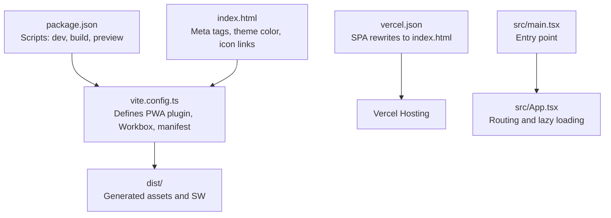
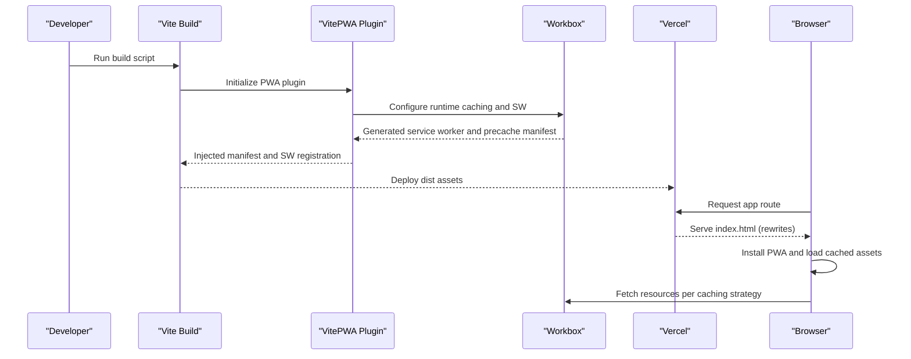
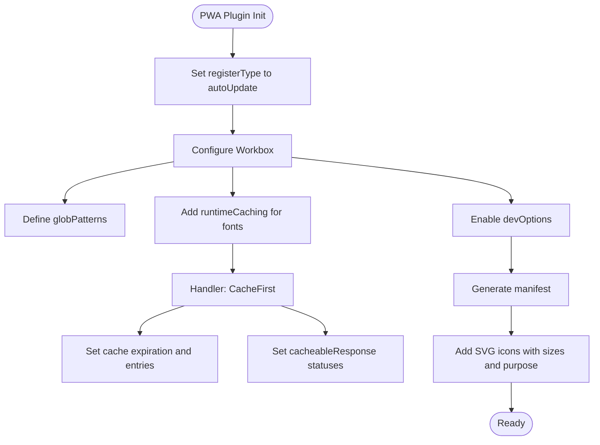
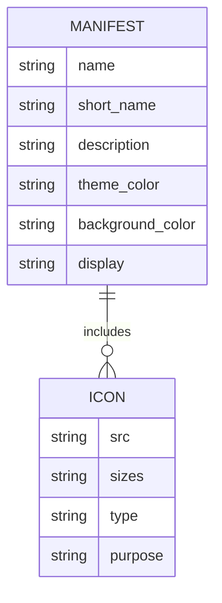
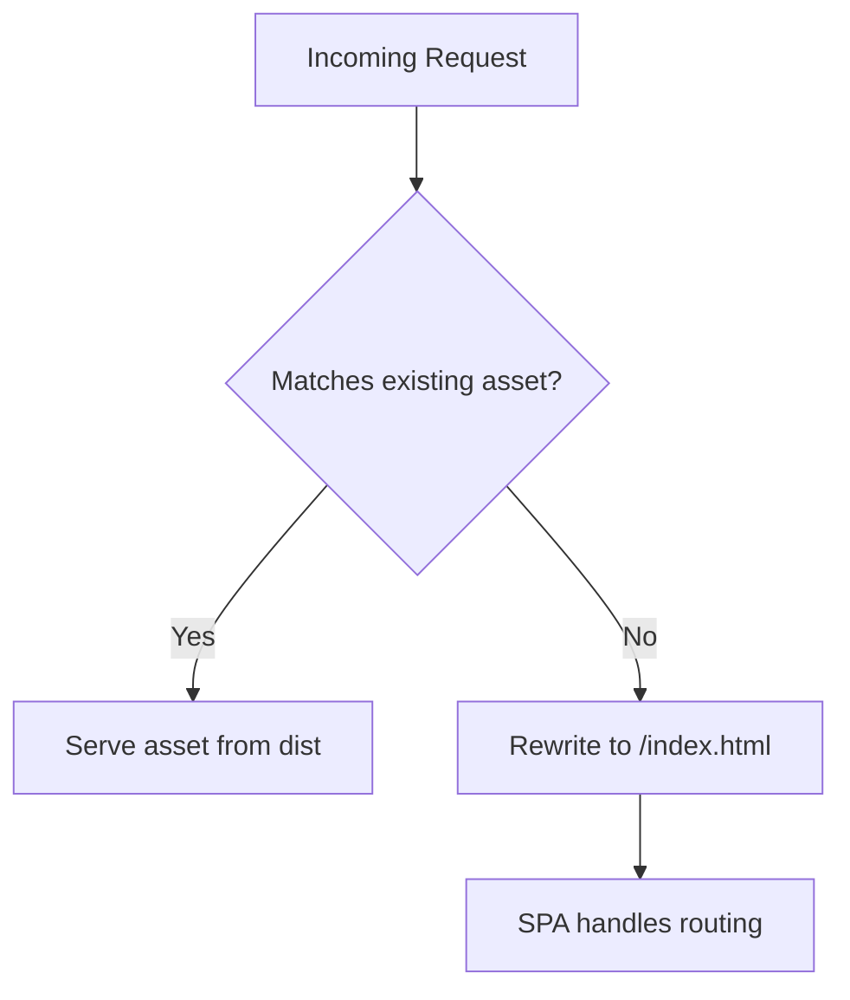
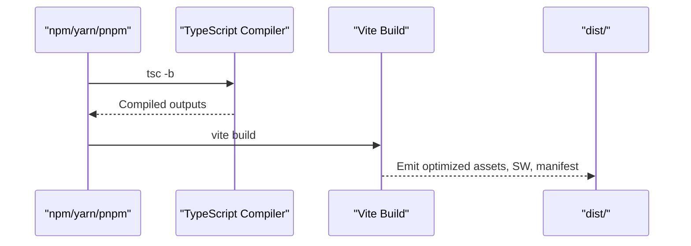
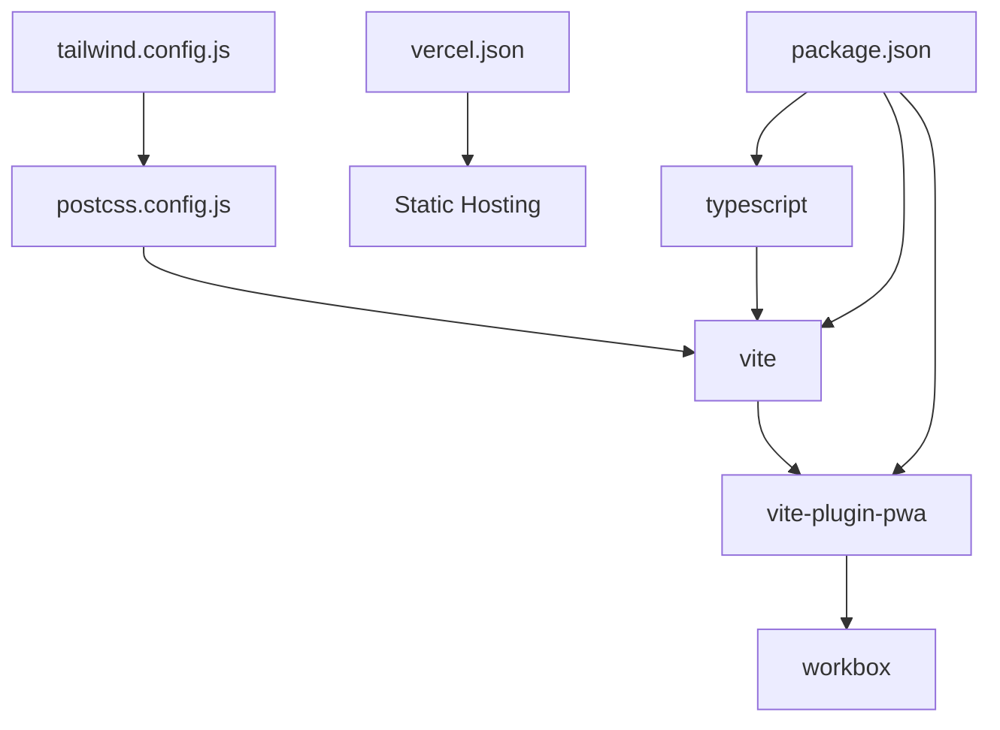

# PWA Configuration

<cite>
**Referenced Files in This Document**
- [vite.config.ts](file://vite.config.ts)
- [vercel.json](file://vercel.json)
- [package.json](file://package.json)
- [index.html](file://index.html)
- [src/App.tsx](file://src/App.tsx)
- [src/main.tsx](file://src/main.tsx)
- [tsconfig.app.json](file://tsconfig.app.json)
- [tailwind.config.js](file://tailwind.config.js)
- [postcss.config.js](file://postcss.config.js)
</cite>

## Table of Contents
1. [Introduction](#introduction)
2. [Project Structure](#project-structure)
3. [Core Components](#core-components)
4. [Architecture Overview](#architecture-overview)
5. [Detailed Component Analysis](#detailed-component-analysis)
6. [Dependency Analysis](#dependency-analysis)
7. [Performance Considerations](#performance-considerations)
8. [Troubleshooting Guide](#troubleshooting-guide)
9. [Conclusion](#conclusion)
10. [Appendices](#appendices)

## Introduction
This document explains VChat’s Progressive Web App configuration, focusing on Vite PWA plugin setup, manifest configuration, and build optimizations. It covers service worker registration, asset caching strategies, build targets, and Vercel deployment specifics for PWA hosting. It also outlines environment-specific differences, deployment pipeline automation via scripts, and practical troubleshooting steps for common PWA issues.

## Project Structure
The PWA configuration centers around Vite’s configuration and the Vite PWA plugin, with supporting build and deployment files. Key elements:
- Vite configuration defines the PWA plugin, Workbox options, and manifest settings.
- Vercel rewrites ensure SPA routing works correctly behind static hosting.
- Build scripts orchestrate TypeScript compilation followed by Vite builds.
- HTML template sets up meta tags and theme color for PWA installation.

**Diagram sources**
- [vite.config.ts:1-57](file://vite.config.ts#L1-L57)
- [vercel.json:1-8](file://vercel.json#L1-L8)
- [package.json:6-11](file://package.json#L6-L11)
- [index.html:3-9](file://index.html#L3-L9)
- [src/main.tsx:1-11](file://src/main.tsx#L1-L11)
- [src/App.tsx:1-156](file://src/App.tsx#L1-L156)

**Section sources**
- [vite.config.ts:1-57](file://vite.config.ts#L1-L57)
- [vercel.json:1-8](file://vercel.json#L1-L8)
- [package.json:6-11](file://package.json#L6-L11)
- [index.html:3-9](file://index.html#L3-L9)
- [src/main.tsx:1-11](file://src/main.tsx#L1-L11)
- [src/App.tsx:1-156](file://src/App.tsx#L1-L156)

## Core Components
- Vite PWA Plugin: Configured with auto-update registration, Workbox caching strategies, and a generated manifest.
- Manifest: Includes name, short name, description, theme/background colors, standalone display, and SVG icons.
- Workbox Runtime Caching: Applies Cache-First for Google Fonts with explicit cache expiration and response handling.
- Vercel Rewrites: Ensures client-side routing works by serving index.html for all routes.
- Build Scripts: TypeScript compilation followed by Vite build; development server and preview commands included.

Key implementation references:
- PWA plugin and Workbox configuration: [vite.config.ts:9-32](file://vite.config.ts#L9-L32)
- Manifest definition: [vite.config.ts:33-53](file://vite.config.ts#L33-L53)
- Vercel rewrites: [vercel.json:2-7](file://vercel.json#L2-L7)
- Build scripts: [package.json:6-11](file://package.json#L6-L11)

**Section sources**
- [vite.config.ts:9-53](file://vite.config.ts#L9-L53)
- [vercel.json:1-8](file://vercel.json#L1-L8)
- [package.json:6-11](file://package.json#L6-L11)

## Architecture Overview
The PWA lifecycle integrates build-time generation, runtime caching, and hosting rewrites for seamless offline and installable behavior.

**Diagram sources**
- [vite.config.ts:9-32](file://vite.config.ts#L9-L32)
- [vercel.json:2-7](file://vercel.json#L2-L7)

## Detailed Component Analysis

### Vite PWA Plugin Configuration
- Registration Type: Auto-update mode ensures updates are applied automatically when new content is available.
- Workbox Options:
  - Glob Patterns: Includes JS, CSS, HTML, ICO, PNG, SVG, and JSON assets for precaching.
  - Runtime Caching:
    - Pattern: Google Fonts domain.
    - Handler: Cache-First.
    - Cache Name: Dedicated cache for fonts.
    - Expiration: Max entries and max age configured.
    - Cacheable Response: Accepts HTTP 200 and 0 status responses.
- Dev Options: Enabled for development environments.
- Manifest: Defined inline with name, short name, description, theme/background colors, standalone display, and SVG icons.

**Diagram sources**
- [vite.config.ts:9-32](file://vite.config.ts#L9-L32)
- [vite.config.ts:33-53](file://vite.config.ts#L33-L53)

**Section sources**
- [vite.config.ts:9-53](file://vite.config.ts#L9-L53)

### Manifest Configuration
- Identity: Name and short name set to the application name.
- Description: Human-readable description for install prompts.
- Theme and Background Colors: Set to a solid black for consistent appearance.
- Display Mode: Standalone for native-like installation.
- Icons:
  - SVG icons for 192x192 and 512x512 sizes.
  - Purpose includes “any maskable” for adaptive icons on Android.
- HTML Template Meta Tags: Favicon link, Apple touch icon, viewport, and theme color align with manifest settings.

**Diagram sources**
- [vite.config.ts:33-53](file://vite.config.ts#L33-L53)
- [index.html:5-8](file://index.html#L5-L8)

**Section sources**
- [vite.config.ts:33-53](file://vite.config.ts#L33-L53)
- [index.html:5-8](file://index.html#L5-L8)

### Vercel Deployment and SPA Routing
- Rewrites: All routes are rewritten to index.html, enabling client-side routing without server-side route handling.
- Hosting Behavior: Static hosting serves prebuilt assets and the service worker, with rewrites ensuring deep links resolve correctly.

**Diagram sources**
- [vercel.json:2-7](file://vercel.json#L2-L7)

**Section sources**
- [vercel.json:1-8](file://vercel.json#L1-L8)

### Build Process and Environment Scripts
- Scripts:
  - dev: Starts Vite dev server.
  - build: Runs TypeScript compiler and then Vite build.
  - preview: Serves built assets locally.
- TypeScript Configuration:
  - Target: ES2023.
  - Module Resolution: Bundler mode for Vite.
  - JSX: React JSX transform.
- PostCSS and Tailwind:
  - Tailwind content scans HTML and TS/TSX sources.
  - PostCSS applies Tailwind and Autoprefixer during build.

**Diagram sources**
- [package.json:6-11](file://package.json#L6-L11)
- [tsconfig.app.json:4-16](file://tsconfig.app.json#L4-L16)
- [tailwind.config.js:3-6](file://tailwind.config.js#L3-L6)
- [postcss.config.js:1-7](file://postcss.config.js#L1-L7)

**Section sources**
- [package.json:6-11](file://package.json#L6-L11)
- [tsconfig.app.json:1-26](file://tsconfig.app.json#L1-L26)
- [tailwind.config.js:1-50](file://tailwind.config.js#L1-L50)
- [postcss.config.js:1-7](file://postcss.config.js#L1-L7)

### Routing and Lazy Loading Considerations
- Client-side routing with React Router DOM.
- Route lazy loading for page components to reduce initial bundle size.
- Animation transitions for smooth navigation.

**Diagram sources**
- [src/App.tsx:66-133](file://src/App.tsx#L66-L133)

**Section sources**
- [src/App.tsx:1-156](file://src/App.tsx#L1-L156)

## Dependency Analysis
- Vite PWA Plugin: Depends on Vite and Workbox; generates service worker and manifest.
- Vercel: Relies on SPA rewrite rules to serve index.html for all routes.
- Build Toolchain: TypeScript compiler precedes Vite build; Tailwind and PostCSS optimize CSS.

**Diagram sources**
- [package.json:20-36](file://package.json#L20-L36)
- [vite.config.ts:1-3](file://vite.config.ts#L1-L3)
- [vercel.json:1-8](file://vercel.json#L1-L8)
- [tailwind.config.js:1-50](file://tailwind.config.js#L1-L50)
- [postcss.config.js:1-7](file://postcss.config.js#L1-L7)

**Section sources**
- [package.json:20-36](file://package.json#L20-L36)
- [vite.config.ts:1-3](file://vite.config.ts#L1-L3)
- [vercel.json:1-8](file://vercel.json#L1-L8)
- [tailwind.config.js:1-50](file://tailwind.config.js#L1-L50)
- [postcss.config.js:1-7](file://postcss.config.js#L1-L7)

## Performance Considerations
- Asset Caching:
  - Font caching with Cache-First reduces network requests and improves repeat visits.
  - Precaching configured via glob patterns to include common asset types.
- Bundle Splitting and Lazy Loading:
  - Route lazy loading reduces initial JavaScript payload.
  - Consider dynamic imports for heavy components to further split bundles.
- CSS Optimization:
  - Tailwind purging and PostCSS minification improve CSS delivery.
- Build Targets:
  - ES2023 target leverages modern JavaScript features; ensure supported browsers or transpile accordingly.
- CDN and Hosting:
  - Vercel provides global CDN distribution; SPA rewrites avoid server errors for deep links.

[No sources needed since this section provides general guidance]

## Troubleshooting Guide
- Service Worker Not Updating:
  - Verify registerType is set to autoUpdate and that Workbox runtime caching does not block updates unintentionally.
  - Confirm the service worker is being served from the correct path after build.
  - Reference: [vite.config.ts:9-32](file://vite.config.ts#L9-L32)
- Assets Not Cached Offline:
  - Ensure glob patterns include intended asset types and that runtime caching rules match resource URLs.
  - Reference: [vite.config.ts:11-29](file://vite.config.ts#L11-L29)
- PWA Icon Issues:
  - Confirm icon sources exist and are reachable; verify sizes and types in manifest.
  - Reference: [vite.config.ts:40-52](file://vite.config.ts#L40-L52)
- Vercel 404 on Deep Links:
  - Ensure rewrites to index.html are present and correctly configured.
  - Reference: [vercel.json:2-7](file://vercel.json#L2-L7)
- Theme Color Mismatch:
  - Align theme-color meta tag with manifest theme_color.
  - Reference: [index.html:8](file://index.html#L8), [vite.config.ts:37-38](file://vite.config.ts#L37-L38)
- Build Failures:
  - Run TypeScript compilation before Vite build; confirm scripts order.
  - Reference: [package.json:8](file://package.json#L8)
- Browser Compatibility:
  - Review ES2023 target and adjust polyfills/transpilation if targeting older browsers.
  - Reference: [tsconfig.app.json:4](file://tsconfig.app.json#L4)

**Section sources**
- [vite.config.ts:9-53](file://vite.config.ts#L9-L53)
- [vercel.json:1-8](file://vercel.json#L1-L8)
- [index.html:8](file://index.html#L8)
- [package.json:8](file://package.json#L8)
- [tsconfig.app.json:4](file://tsconfig.app.json#L4)

## Conclusion
VChat’s PWA configuration leverages Vite’s PWA plugin with Workbox caching and a concise manifest to deliver an installable, fast-loading experience. Vercel’s SPA rewrites ensure robust routing, while build scripts and modern TypeScript/Tailwind tooling streamline development and optimization. Following the troubleshooting steps and performance recommendations will help maintain reliability and compatibility across devices and browsers.

[No sources needed since this section summarizes without analyzing specific files]

## Appendices
- Development vs Production Differences:
  - Development: PWA dev options enabled for easier testing.
  - Production: Auto-update registration and optimized caching rules apply.
  - Reference: [vite.config.ts:30-32](file://vite.config.ts#L30-L32)
- Environment-Specific Notes:
  - Theme and background colors are set in both manifest and HTML meta tags for consistent rendering.
  - Reference: [vite.config.ts:37-38](file://vite.config.ts#L37-L38), [index.html:8](file://index.html#L8)

**Section sources**
- [vite.config.ts:30-32](file://vite.config.ts#L30-L32)
- [vite.config.ts:37-38](file://vite.config.ts#L37-L38)
- [index.html:8](file://index.html#L8)