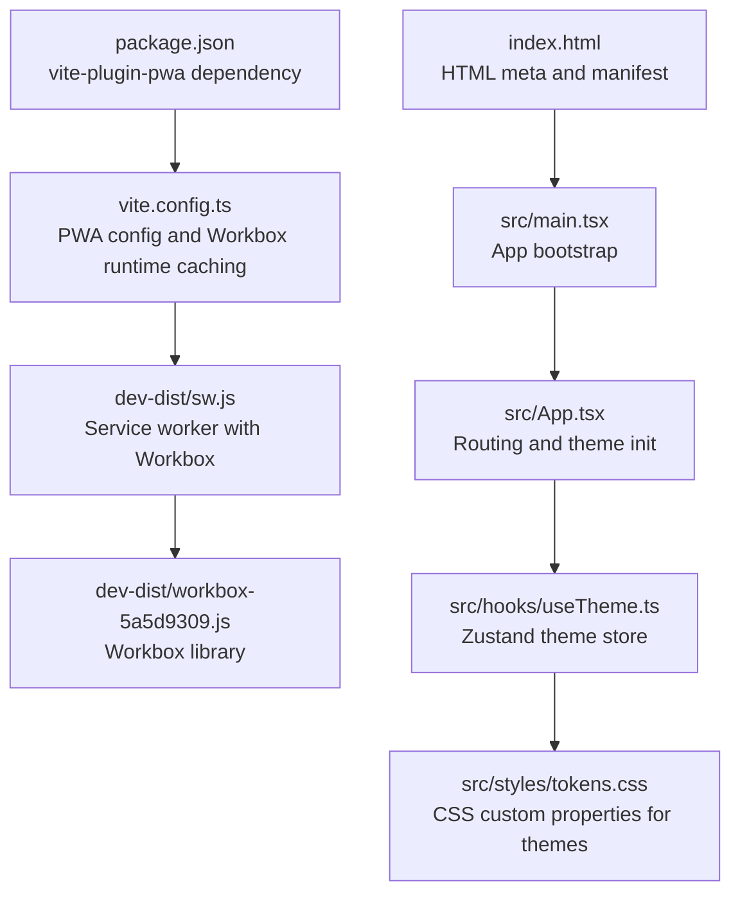
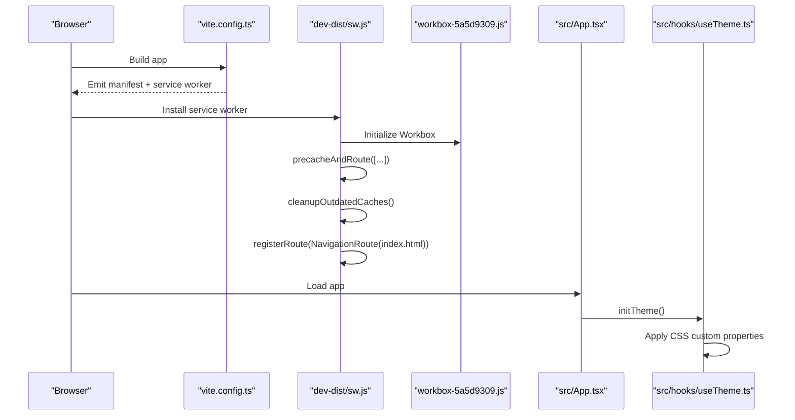
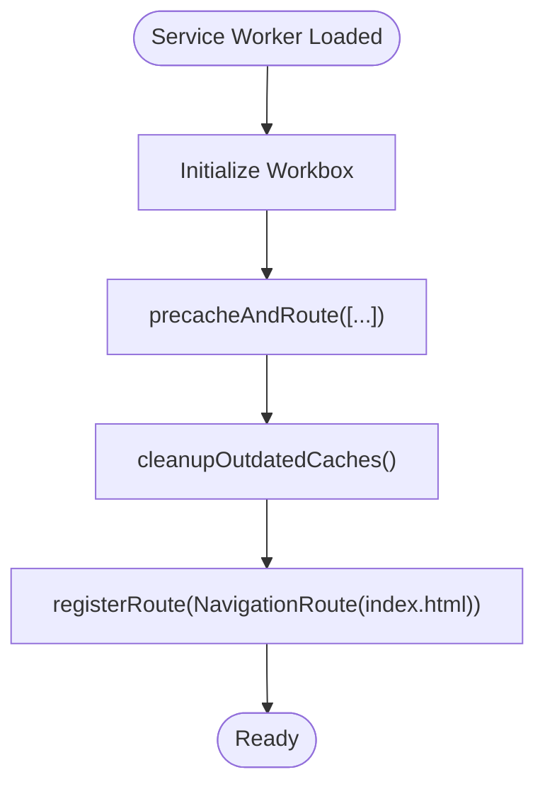
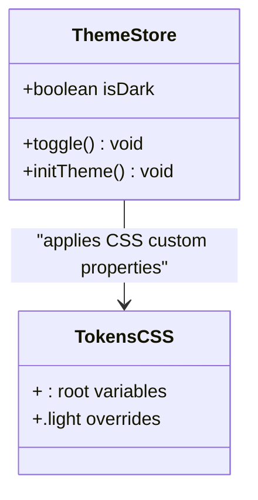
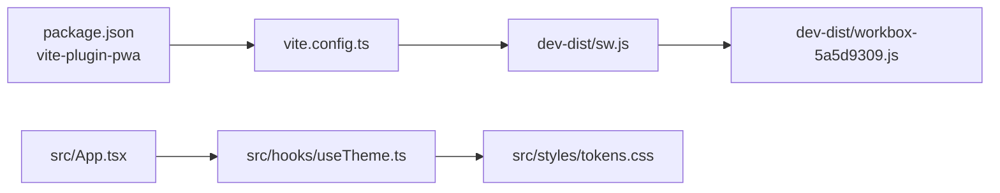

# Progressive Web App

<cite>
**Referenced Files in This Document**
- [vite.config.ts](file://vite.config.ts)
- [package.json](file://package.json)
- [index.html](file://index.html)
- [src/main.tsx](file://src/main.tsx)
- [src/App.tsx](file://src/App.tsx)
- [src/hooks/useTheme.ts](file://src/hooks/useTheme.ts)
- [src/styles/tokens.css](file://src/styles/tokens.css)
- [dev-dist/sw.js](file://dev-dist/sw.js)
- [dev-dist/registerSW.js](file://dev-dist/registerSW.js)
- [dev-dist/workbox-5a5d9309.js](file://dev-dist/workbox-5a5d9309.js)
</cite>

## Table of Contents
1. [Introduction](#introduction)
2. [Project Structure](#project-structure)
3. [Core Components](#core-components)
4. [Architecture Overview](#architecture-overview)
5. [Detailed Component Analysis](#detailed-component-analysis)
6. [Dependency Analysis](#dependency-analysis)
7. [Performance Considerations](#performance-considerations)
8. [Troubleshooting Guide](#troubleshooting-guide)
9. [Conclusion](#conclusion)
10. [Appendices](#appendices)

## Introduction
This document explains VChat’s Progressive Web App (PWA) capabilities as implemented in the repository. It covers service worker setup, cache strategies, offline support, installation prompts, and the theme system for dark/light mode. It also documents the PWA configuration in vite.config.ts, the service worker implementation in dev-dist/sw.js, Workbox integration, and how the theme system leverages CSS custom properties and Zustand persistence.

## Project Structure
The PWA-related assets and configuration are primarily located in:
- Build-time PWA configuration and plugin integration in vite.config.ts
- Runtime service worker and Workbox bundle in dev-dist/
- Application bootstrap and theme initialization in src/main.tsx and src/App.tsx
- Theme tokens and CSS custom properties in src/styles/tokens.css
- Theme state management in src/hooks/useTheme.ts
- HTML manifest and meta tags in index.html
- Package dependencies for PWA tooling in package.json

**Diagram sources**
- [vite.config.ts:1-57](file://vite.config.ts#L1-L57)
- [dev-dist/sw.js:1-93](file://dev-dist/sw.js#L1-L93)
- [dev-dist/workbox-5a5d9309.js:3105-3133](file://dev-dist/workbox-5a5d9309.js#L3105-L3133)
- [index.html:1-16](file://index.html#L1-L16)
- [src/main.tsx:1-11](file://src/main.tsx#L1-L11)
- [src/App.tsx:135-148](file://src/App.tsx#L135-L148)
- [src/hooks/useTheme.ts:10-36](file://src/hooks/useTheme.ts#L10-L36)
- [src/styles/tokens.css:1-39](file://src/styles/tokens.css#L1-L39)
- [package.json:35-36](file://package.json#L35-L36)

**Section sources**
- [vite.config.ts:1-57](file://vite.config.ts#L1-L57)
- [index.html:1-16](file://index.html#L1-L16)
- [src/main.tsx:1-11](file://src/main.tsx#L1-L11)
- [src/App.tsx:135-148](file://src/App.tsx#L135-L148)
- [src/hooks/useTheme.ts:10-36](file://src/hooks/useTheme.ts#L10-L36)
- [src/styles/tokens.css:1-39](file://src/styles/tokens.css#L1-L39)
- [package.json:35-36](file://package.json#L35-L36)

## Core Components
- PWA configuration and Workbox runtime caching are defined in vite.config.ts, including manifest settings, auto-update registration type, and a Google Fonts caching strategy.
- The service worker in dev-dist/sw.js uses Workbox to precache selected assets, clean up outdated caches, and route navigation requests to index.html for SPA routing.
- The theme system uses CSS custom properties and Zustand with persistence to manage light/dark mode and initialize on app load.
- The HTML manifest and meta tags in index.html provide installability and theme color hints.

**Section sources**
- [vite.config.ts:9-54](file://vite.config.ts#L9-L54)
- [dev-dist/sw.js:70-92](file://dev-dist/sw.js#L70-L92)
- [src/hooks/useTheme.ts:10-36](file://src/hooks/useTheme.ts#L10-L36)
- [index.html:3-9](file://index.html#L3-L9)

## Architecture Overview
The PWA lifecycle spans build-time generation and runtime behavior:
- Build-time: vite-plugin-pwa generates the service worker and manifest, and configures Workbox runtime caching.
- Runtime: The service worker precaches assets, serves them offline, and routes navigation to index.html for client-side routing.
- App initialization: The theme store initializes on startup and applies CSS custom properties for light/dark mode.

**Diagram sources**
- [vite.config.ts:9-54](file://vite.config.ts#L9-L54)
- [dev-dist/sw.js:70-92](file://dev-dist/sw.js#L70-L92)
- [dev-dist/workbox-5a5d9309.js:3105-3133](file://dev-dist/workbox-5a5d9309.js#L3105-L3133)
- [src/App.tsx:135-148](file://src/App.tsx#L135-L148)
- [src/hooks/useTheme.ts:23-30](file://src/hooks/useTheme.ts#L23-L30)

## Detailed Component Analysis

### PWA Configuration in vite.config.ts
Key aspects:
- Auto-update registration type ensures updates are applied automatically.
- Workbox runtime caching includes a CacheFirst strategy for Google Fonts with explicit cache name, expiration, and response filtering.
- Manifest defines name, short_name, description, theme/background colors, standalone display, and icon entries.
- Dev options enable PWA in development mode.

Implementation guidelines:
- Keep runtimeCaching minimal and targeted to reduce storage overhead.
- Align manifest icons with platform requirements and consider generating multiple sizes.
- Use registerType appropriate for your update strategy (autoUpdate vs. prompt).

**Section sources**
- [vite.config.ts:9-54](file://vite.config.ts#L9-L54)

### Service Worker Implementation in dev-dist/sw.js
Key aspects:
- Uses Workbox via a generated loader and invokes skipWaiting and clientsClaim to activate immediately.
- Precaches specific assets and cleans up outdated caches.
- Registers a NavigationRoute that serves index.html for root navigation, enabling SPA routing.

Offline behavior:
- Precaching ensures core assets are available offline.
- NavigationRoute allows deep links to function offline by serving index.html.

Background sync:
- No background sync handlers are configured in the current service worker.

**Section sources**
- [dev-dist/sw.js:70-92](file://dev-dist/sw.js#L70-L92)

### Workbox Integration
The service worker loads workbox-5a5d9309.js and uses:
- precacheAndRoute to serve prebuilt assets.
- cleanupOutdatedCaches to remove stale cache entries.
- NavigationRoute to handle client-side routing.

**Diagram sources**
- [dev-dist/sw.js:70-92](file://dev-dist/sw.js#L70-L92)
- [dev-dist/workbox-5a5d9309.js:3105-3133](file://dev-dist/workbox-5a5d9309.js#L3105-L3133)

**Section sources**
- [dev-dist/sw.js:70-92](file://dev-dist/sw.js#L70-L92)
- [dev-dist/workbox-5a5d9309.js:3105-3133](file://dev-dist/workbox-5a5d9309.js#L3105-L3133)

### Theme System and CSS Custom Properties
The theme system:
- Uses CSS custom properties defined in :root and .light to switch between dark and light palettes.
- Initializes on app load via useTheme.initTheme and toggles a class on documentElement to apply the palette.
- Persists theme selection using Zustand middleware.

**Diagram sources**
- [src/hooks/useTheme.ts:10-36](file://src/hooks/useTheme.ts#L10-L36)
- [src/styles/tokens.css:1-39](file://src/styles/tokens.css#L1-L39)

**Section sources**
- [src/hooks/useTheme.ts:10-36](file://src/hooks/useTheme.ts#L10-L36)
- [src/styles/tokens.css:1-39](file://src/styles/tokens.css#L1-L39)
- [src/App.tsx:135-148](file://src/App.tsx#L135-L148)

### Installation Prompts and Manifest
- index.html sets theme-color and apple-touch-icon to improve installability and appearance.
- vite.config.ts manifest defines name, short_name, description, theme/background colors, and icons.
- The service worker registration script in dev-dist/registerSW.js registers the service worker in development builds.

Implementation guidelines:
- Ensure icons are available at the paths referenced in the manifest.
- Test installability using browser devtools Lighthouse or Application tab.

**Section sources**
- [index.html:3-9](file://index.html#L3-L9)
- [vite.config.ts:33-53](file://vite.config.ts#L33-L53)
- [dev-dist/registerSW.js:1-1](file://dev-dist/registerSW.js#L1-L1)

## Dependency Analysis
- vite-plugin-pwa is declared in devDependencies and drives PWA generation.
- The service worker depends on the Workbox library bundled in dev-dist/workbox-5a5d9309.js.
- The app depends on Zustand for theme persistence and React for rendering.

**Diagram sources**
- [package.json:35-36](file://package.json#L35-L36)
- [vite.config.ts:3-3](file://vite.config.ts#L3-L3)
- [dev-dist/sw.js:70-70](file://dev-dist/sw.js#L70-L70)
- [dev-dist/workbox-5a5d9309.js:3105-3133](file://dev-dist/workbox-5a5d9309.js#L3105-L3133)
- [src/App.tsx:10-10](file://src/App.tsx#L10-L10)
- [src/hooks/useTheme.ts:1-2](file://src/hooks/useTheme.ts#L1-L2)
- [src/styles/tokens.css:1-39](file://src/styles/tokens.css#L1-L39)

**Section sources**
- [package.json:35-36](file://package.json#L35-L36)
- [vite.config.ts:3-3](file://vite.config.ts#L3-L3)
- [dev-dist/sw.js:70-70](file://dev-dist/sw.js#L70-L70)
- [dev-dist/workbox-5a5d9309.js:3105-3133](file://dev-dist/workbox-5a5d9309.js#L3105-L3133)
- [src/App.tsx:10-10](file://src/App.tsx#L10-L10)
- [src/hooks/useTheme.ts:1-2](file://src/hooks/useTheme.ts#L1-L2)
- [src/styles/tokens.css:1-39](file://src/styles/tokens.css#L1-L39)

## Performance Considerations
- Keep runtimeCaching narrow and cache-friendly to minimize storage usage.
- Use appropriate cache expiration and max entry counts for third-party resources.
- Leverage precaching for critical assets to reduce first-load latency.
- Avoid caching large dynamic assets; prefer streaming or selective caching.
- Monitor cache growth and implement periodic cleanup strategies if needed.

[No sources needed since this section provides general guidance]

## Troubleshooting Guide
Common issues and checks:
- Service worker not installing:
  - Verify the service worker registration script is present and reachable.
  - Confirm the service worker is served with correct MIME type and scope.
- Offline not working:
  - Ensure precache entries include required assets.
  - Confirm NavigationRoute targets index.html for SPA routing.
- Theme not applying:
  - Check that initTheme is called on app load.
  - Verify CSS custom properties are defined and class toggling occurs on documentElement.
- Manifest errors:
  - Validate icon paths and types in the manifest.
  - Ensure theme-color and apple-touch-icon are set in HTML head.

**Section sources**
- [dev-dist/registerSW.js:1-1](file://dev-dist/registerSW.js#L1-L1)
- [dev-dist/sw.js:80-90](file://dev-dist/sw.js#L80-L90)
- [src/App.tsx:135-148](file://src/App.tsx#L135-L148)
- [src/hooks/useTheme.ts:23-30](file://src/hooks/useTheme.ts#L23-L30)
- [index.html:3-9](file://index.html#L3-L9)
- [vite.config.ts:33-53](file://vite.config.ts#L33-L53)

## Conclusion
VChat’s PWA implementation integrates vite-plugin-pwa for manifest and service worker generation, Workbox for precaching and navigation routing, and a theme system built on CSS custom properties and Zustand persistence. The current setup provides offline-ready core assets and a responsive theme system. Extending capabilities could include background sync, selective runtime caching, and enhanced offline UX for dynamic content.

[No sources needed since this section summarizes without analyzing specific files]

## Appendices

### Implementation Guidelines for Extending PWA Capabilities
- Background Sync:
  - Register a background sync tag in the service worker and handle events to retry failed network requests.
- Advanced Caching:
  - Add runtime caching strategies for API responses with CacheFirst/NetworkFirst/CacheOnly as appropriate.
  - Implement cache key strategies to avoid cache pollution.
- Offline UX:
  - Serve a dedicated offline page or skeleton UI for unavailable routes.
  - Persist user actions and queue them for later submission when online.
- Cross-Browser Compatibility:
  - Validate service worker support and feature availability across browsers.
  - Provide graceful degradation for unsupported features.

[No sources needed since this section provides general guidance]