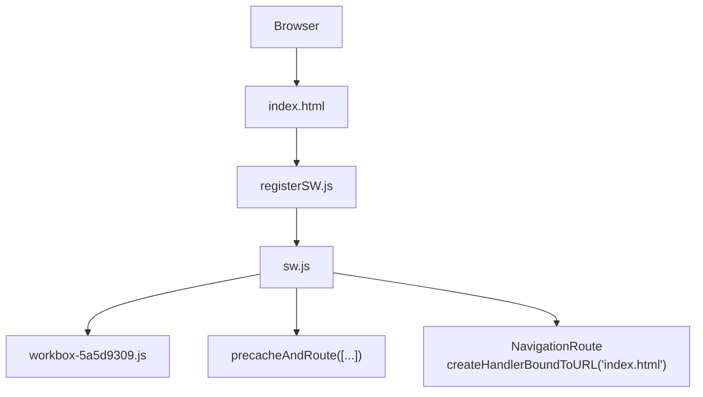
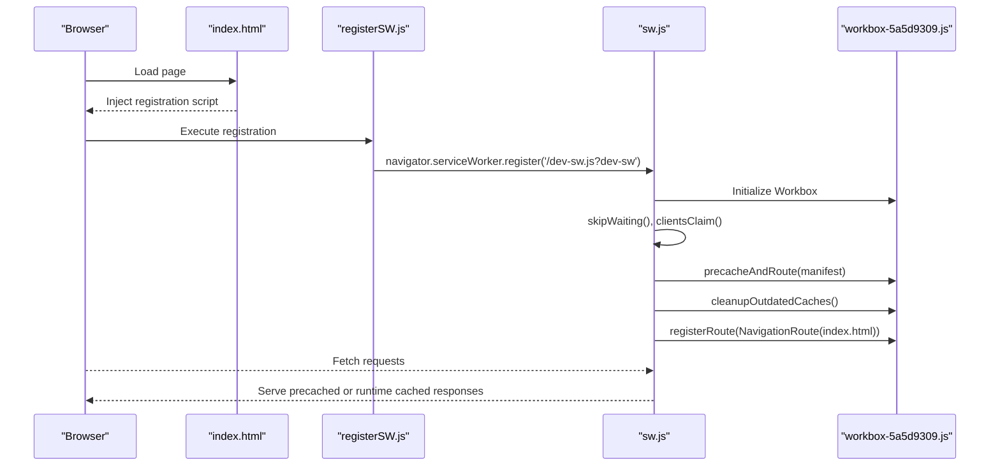
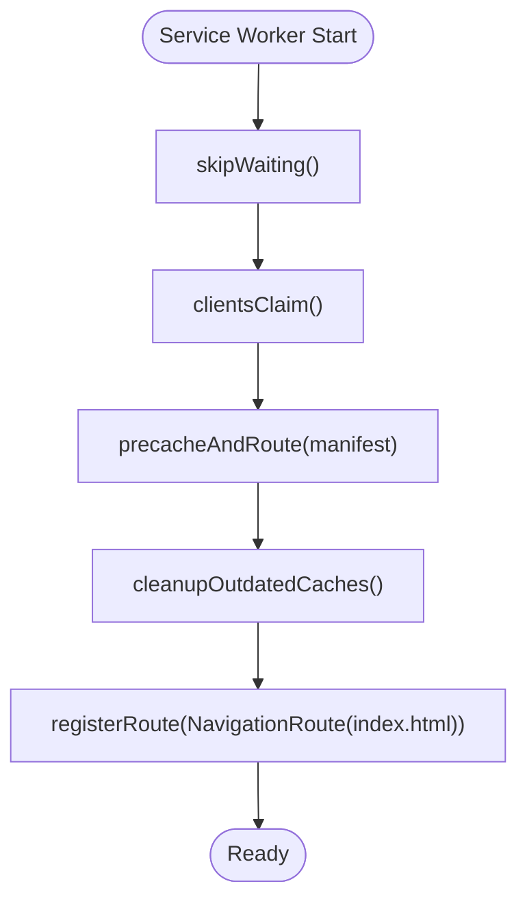
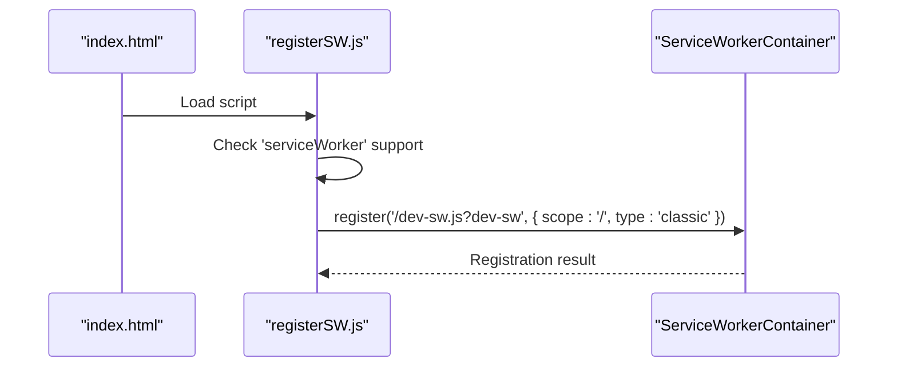
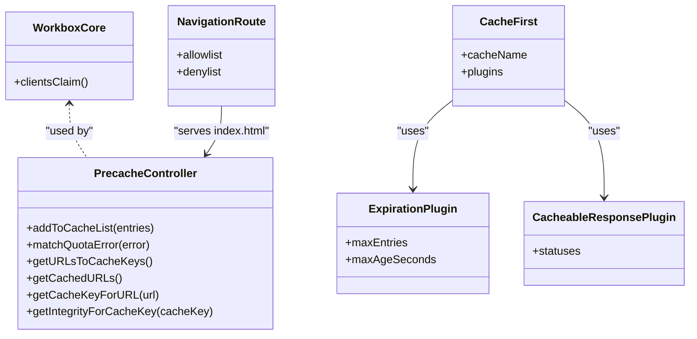
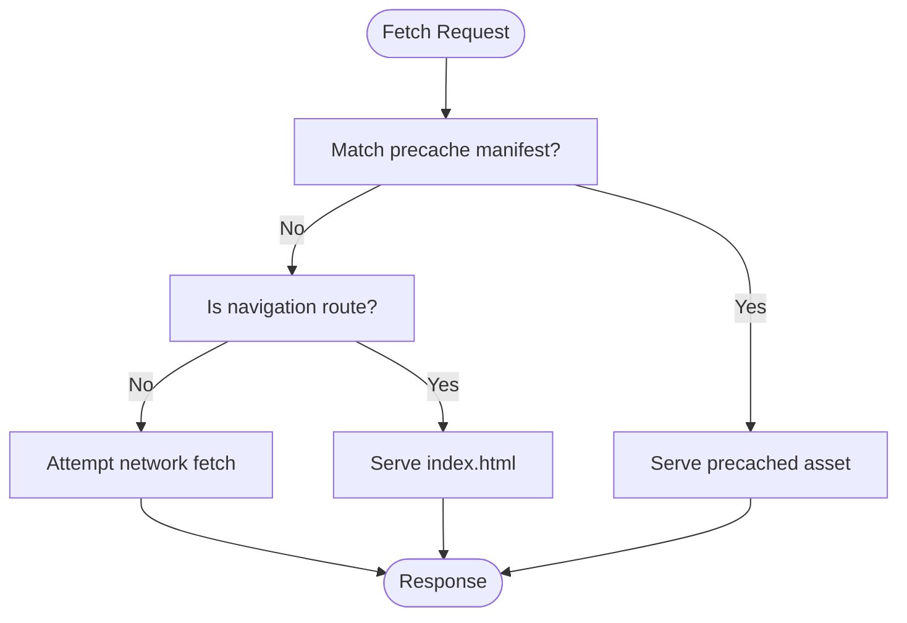
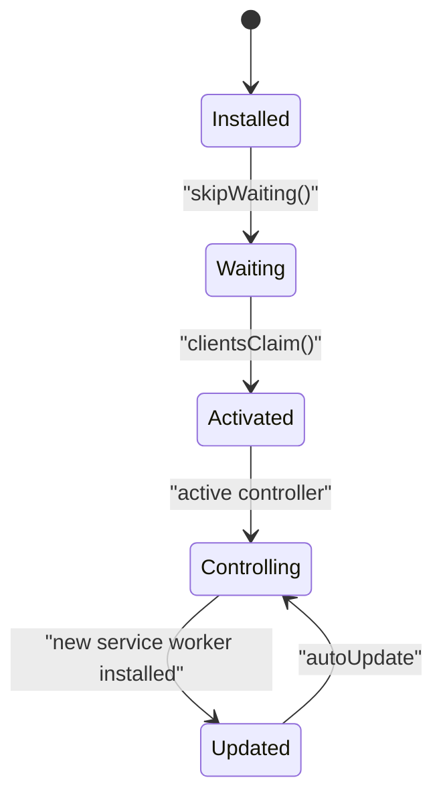
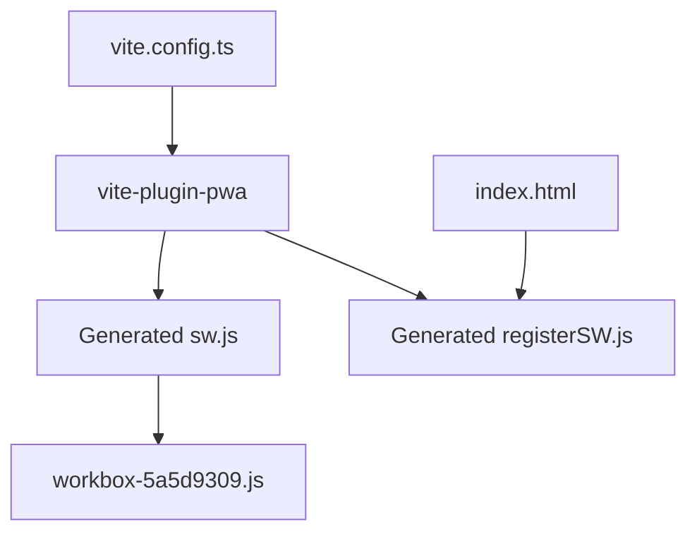

# Service Worker Implementation

<cite>
**Referenced Files in This Document**
- [sw.js](file://dev-dist/sw.js)
- [registerSW.js](file://dev-dist/registerSW.js)
- [workbox-5a5d9309.js](file://dev-dist/workbox-5a5d9309.js)
- [vite.config.ts](file://vite.config.ts)
- [package.json](file://package.json)
- [index.html](file://index.html)
- [App.tsx](file://src/App.tsx)
</cite>

## Table of Contents
1. [Introduction](#introduction)
2. [Project Structure](#project-structure)
3. [Core Components](#core-components)
4. [Architecture Overview](#architecture-overview)
5. [Detailed Component Analysis](#detailed-component-analysis)
6. [Dependency Analysis](#dependency-analysis)
7. [Performance Considerations](#performance-considerations)
8. [Troubleshooting Guide](#troubleshooting-guide)
9. [Conclusion](#conclusion)
10. [Appendices](#appendices)

## Introduction
This document explains VChat’s service worker implementation and PWA capabilities. It covers how the service worker is registered, how precaching and runtime caching are configured, and how Workbox powers advanced caching strategies such as cache-first, stale-while-revalidate patterns, and cache expiration. It also documents offline behavior, navigation handling, lifecycle management, debugging techniques, and browser compatibility considerations. Guidance is included for extending caching logic, adding custom routes, and optimizing offline performance.

## Project Structure
The service worker implementation is built with Vite and the Vite PWA plugin. The plugin generates and injects the service worker and registration script into the built output. The relevant files are:
- dev-dist/sw.js: The generated service worker implementing precaching and routing.
- dev-dist/registerSW.js: The registration script injected into the HTML to register the service worker.
- dev-dist/workbox-5a5d9309.js: The Workbox library bundled with the app.
- vite.config.ts: Vite configuration enabling PWA with Workbox options.
- package.json: Declares the Vite PWA plugin dependency.
- index.html: Injects the registration script automatically via the plugin.
- src/App.tsx: Application shell that renders routes; navigation fallback is handled by the service worker.

**Diagram sources**
- [index.html:11-15](file://index.html#L11-L15)
- [registerSW.js:1-1](file://dev-dist/registerSW.js#L1-L1)
- [sw.js:70-92](file://dev-dist/sw.js#L70-L92)
- [workbox-5a5d9309.js:1-100](file://dev-dist/workbox-5a5d9309.js#L1-L100)

**Section sources**
- [vite.config.ts:9-54](file://vite.config.ts#L9-L54)
- [package.json:36-36](file://package.json#L36-L36)
- [index.html:11-15](file://index.html#L11-L15)

## Core Components
- Service Worker Script (sw.js): Implements precaching of key assets, cleanup of outdated caches, and navigation fallback to index.html for single-page app routing.
- Registration Script (registerSW.js): Registers the service worker with a scope appropriate for the app.
- Workbox Library (workbox-5a5d9309.js): Provides precacheAndRoute, NavigationRoute, CacheFirst, ExpirationPlugin, and CacheableResponsePlugin.
- Vite PWA Plugin (vite.config.ts): Configures auto-update behavior, glob patterns, runtime caching for external fonts, and manifest generation.

Key behaviors:
- Precaching: Assets declared in the precache manifest are cached and served offline.
- Navigation Fallback: Requests that match the SPA navigation pattern are served index.html.
- Runtime Caching: External resources (e.g., fonts.googleapis.com) use CacheFirst with expiration and cacheable responses.

**Section sources**
- [sw.js:80-90](file://dev-dist/sw.js#L80-L90)
- [workbox-5a5d9309.js:3105-3133](file://dev-dist/workbox-5a5d9309.js#L3105-L3133)
- [vite.config.ts:9-29](file://vite.config.ts#L9-L29)

## Architecture Overview
The service worker lifecycle integrates with the Vite build pipeline and the browser’s Service Worker API. The registration script ensures the service worker is installed and activated. Workbox manages caching strategies and routing.

**Diagram sources**
- [index.html:11-15](file://index.html#L11-L15)
- [registerSW.js:1-1](file://dev-dist/registerSW.js#L1-L1)
- [sw.js:70-92](file://dev-dist/sw.js#L70-L92)
- [workbox-5a5d9309.js:1-100](file://dev-dist/workbox-5a5d9309.js#L1-L100)

## Detailed Component Analysis

### Service Worker Script (sw.js)
Responsibilities:
- Skip waiting and claim clients immediately upon activation.
- Precache specific assets (e.g., registerSW.js, index.html) with revisions.
- Clean up outdated caches.
- Register a navigation route that serves index.html for SPA routes.

Implementation highlights:
- Uses Workbox’s precacheAndRoute to cache and serve precached assets.
- Uses NavigationRoute with allowlist to target the root path for SPA fallback.
- Calls cleanupOutdatedCaches to remove old cache entries.

**Diagram sources**
- [sw.js:70-92](file://dev-dist/sw.js#L70-L92)

**Section sources**
- [sw.js:70-92](file://dev-dist/sw.js#L70-L92)

### Registration Mechanism (registerSW.js)
Responsibilities:
- Detects if the browser supports service workers.
- Registers the service worker with a scope of “/” and classic type.
- In development builds, registers a dev-specific service worker path.

Behavior:
- The Vite PWA plugin injects this script into the built HTML.
- The registration script runs early to ensure the service worker controls the page as soon as possible.

**Diagram sources**
- [registerSW.js:1-1](file://dev-dist/registerSW.js#L1-L1)
- [index.html:11-15](file://index.html#L11-L15)

**Section sources**
- [registerSW.js:1-1](file://dev-dist/registerSW.js#L1-L1)
- [vite.config.ts:30-32](file://vite.config.ts#L30-L32)

### Workbox Integration
Capabilities:
- Precaching: Assets are cached during installation and served offline.
- Navigation Fallback: SPA routes are served index.html.
- Runtime Caching: External resources can use CacheFirst with expiration and cacheable responses.
- Cache Expiration: Entries are pruned after a configurable age or count.

Runtime caching example:
- Fonts from fonts.googleapis.com use CacheFirst with a dedicated cache name, expiration limits, and cacheable status filtering.

**Diagram sources**
- [workbox-5a5d9309.js:21-23](file://dev-dist/workbox-5a5d9309.js#L21-L23)
- [workbox-5a5d9309.js:3105-3133](file://dev-dist/workbox-5a5d9309.js#L3105-L3133)
- [workbox-5a5d9309.js:2865-2898](file://dev-dist/workbox-5a5d9309.js#L2865-L2898)
- [workbox-5a5d9309.js:3105-3133](file://dev-dist/workbox-5a5d9309.js#L3105-L3133)

**Section sources**
- [workbox-5a5d9309.js:21-23](file://dev-dist/workbox-5a5d9309.js#L21-L23)
- [workbox-5a5d9309.js:3105-3133](file://dev-dist/workbox-5a5d9309.js#L3105-L3133)
- [vite.config.ts:13-28](file://vite.config.ts#L13-L28)

### Offline Behavior and Navigation Fallback
- SPA Navigation: The service worker registers a NavigationRoute that serves index.html for the root path, enabling deep links to work offline.
- Fallback Strategy: For non-precached routes, the app relies on index.html to render the requested route client-side.

**Diagram sources**
- [sw.js:88-90](file://dev-dist/sw.js#L88-L90)
- [workbox-5a5d9309.js:3105-3133](file://dev-dist/workbox-5a5d9309.js#L3105-L3133)

**Section sources**
- [sw.js:88-90](file://dev-dist/sw.js#L88-L90)
- [App.tsx:66-133](file://src/App.tsx#L66-L133)

### Lifecycle Management
- Activation: skipWaiting() and clientsClaim() ensure immediate control and take ownership of clients.
- Update Checking: The Vite PWA plugin is configured for autoUpdate, which triggers updates when new content is available.
- User Notification: The plugin can be extended to prompt users when an update is ready; the current configuration does not include explicit UI prompts.

**Diagram sources**
- [sw.js:72-73](file://dev-dist/sw.js#L72-L73)
- [vite.config.ts:10-10](file://vite.config.ts#L10-L10)

**Section sources**
- [sw.js:72-73](file://dev-dist/sw.js#L72-L73)
- [vite.config.ts:10-10](file://vite.config.ts#L10-L10)

### Extending Caching Logic and Adding Custom Routes
Guidelines:
- Add runtime caching entries in the Vite PWA configuration under workbox.runtimeCaching to define patterns, handlers, and plugins.
- Use CacheFirst for static assets, StaleWhileRevalidate for API responses, or ExpirationPlugin to limit cache size.
- Extend precache entries by ensuring assets are emitted and included in the build output.
- Add custom NavigationRoute entries if SPA routes diverge from the default allowlist.

References:
- Runtime caching configuration: [vite.config.ts:13-28](file://vite.config.ts#L13-L28)
- Precache manifest injection: [sw.js:80-86](file://dev-dist/sw.js#L80-L86)

**Section sources**
- [vite.config.ts:13-28](file://vite.config.ts#L13-L28)
- [sw.js:80-86](file://dev-dist/sw.js#L80-L86)

## Dependency Analysis
The service worker depends on Workbox for caching primitives and routing. The Vite PWA plugin generates the service worker and injects the registration script into the built HTML.

**Diagram sources**
- [vite.config.ts:9-54](file://vite.config.ts#L9-L54)
- [package.json:36-36](file://package.json#L36-L36)
- [index.html:11-15](file://index.html#L11-L15)

**Section sources**
- [vite.config.ts:9-54](file://vite.config.ts#L9-L54)
- [package.json:36-36](file://package.json#L36-L36)

## Performance Considerations
- Precaching reduces initial load time and enables offline availability for critical assets.
- CacheFirst for external resources (e.g., fonts) improves reliability and speed.
- Expiration policies prevent caches from growing indefinitely.
- Auto-update keeps users on fresh content without manual intervention.

[No sources needed since this section provides general guidance]

## Troubleshooting Guide
Common issues and remedies:
- Service Worker Not Installing:
  - Verify registration script is present in the built HTML.
  - Confirm the service worker URL is correct and accessible.
- Navigation Fallback Not Working:
  - Ensure NavigationRoute allowlist matches SPA routes.
  - Confirm index.html is precached.
- Outdated Content:
  - Check autoUpdate configuration and activation lifecycle.
  - Clear browser cache and reload to test latest service worker.
- Debugging:
  - Use browser DevTools Application panel to inspect service worker state and cache storage.
  - Enable Workbox logging to observe caching behavior.

**Section sources**
- [vite.config.ts:10-10](file://vite.config.ts#L10-L10)
- [sw.js:88-90](file://dev-dist/sw.js#L88-L90)
- [index.html:11-15](file://index.html#L11-L15)

## Conclusion
VChat’s service worker leverages Workbox to precache essential assets, serve index.html for SPA navigation, and apply runtime caching strategies for external resources. The Vite PWA plugin automates generation and registration, while the configuration enables auto-updates and optimized caching. By extending the runtime caching configuration and customizing precache entries, teams can further tailor offline behavior and performance.

[No sources needed since this section summarizes without analyzing specific files]

## Appendices

### Browser Compatibility
- Service Worker API is supported in modern browsers. Ensure the app targets environments that support service workers and the CacheStorage API.
- For older browsers, consider feature detection and graceful degradation.

[No sources needed since this section provides general guidance]