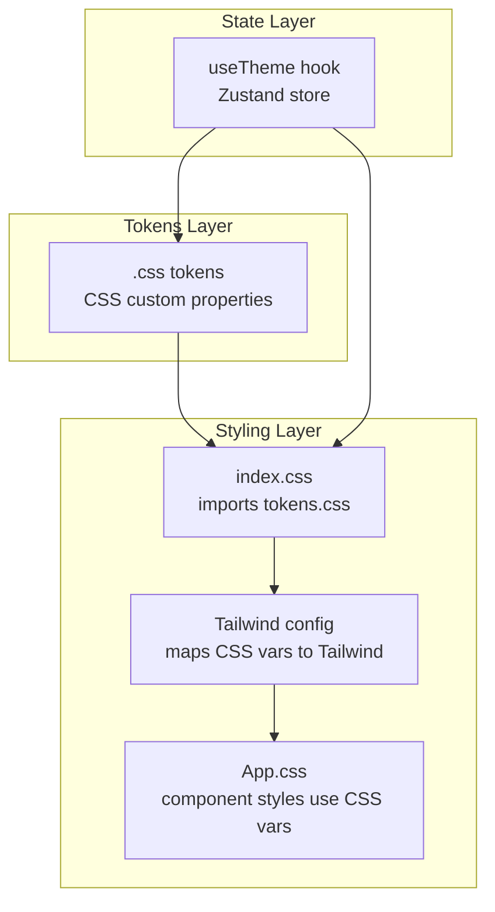
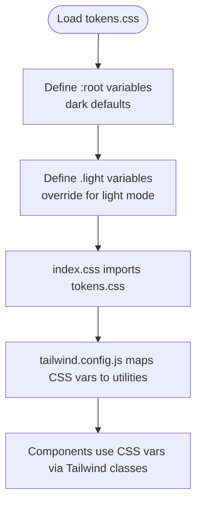
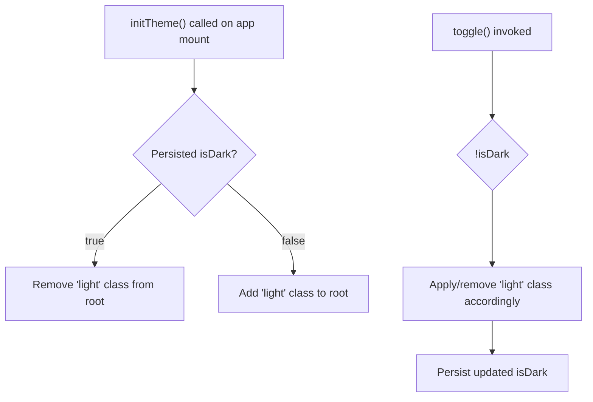
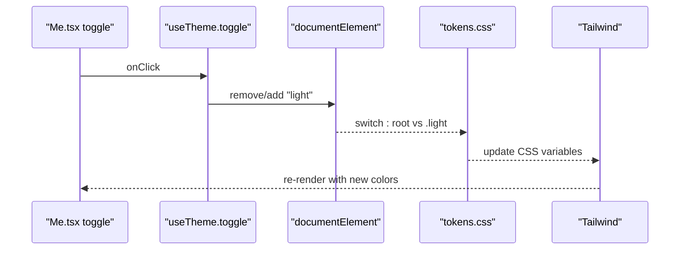
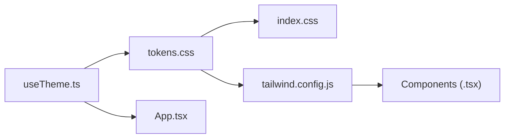

# Theme System

<cite>
**Referenced Files in This Document**
- [tokens.css](file://src/styles/tokens.css)
- [index.css](file://src/index.css)
- [App.css](file://src/App.css)
- [tailwind.config.js](file://tailwind.config.js)
- [useTheme.ts](file://src/hooks/useTheme.ts)
- [App.tsx](file://src/App.tsx)
- [Me.tsx](file://src/pages/Me.tsx)
- [Streaks.tsx](file://src/pages/profile/Streaks.tsx)
- [StatusBar.tsx](file://src/components/StatusBar.tsx)
- [MainLayout.tsx](file://src/components/layouts/MainLayout.tsx)
- [package.json](file://package.json)
</cite>

## Table of Contents
1. [Introduction](#introduction)
2. [Project Structure](#project-structure)
3. [Core Components](#core-components)
4. [Architecture Overview](#architecture-overview)
5. [Detailed Component Analysis](#detailed-component-analysis)
6. [Dependency Analysis](#dependency-analysis)
7. [Performance Considerations](#performance-considerations)
8. [Accessibility Considerations](#accessibility-considerations)
9. [Extending the Theme System](#extending-the-theme-system)
10. [Troubleshooting Guide](#troubleshooting-guide)
11. [Conclusion](#conclusion)

## Introduction
This document explains VChat’s theme system with a focus on CSS custom properties, dark/light mode support, and Tailwind integration. It covers the tokens architecture, the useTheme hook for state management and persistence, theme switching mechanics, and how components consume theme variables dynamically without page reloads. Accessibility considerations and extension guidelines are also included to maintain design consistency across components.

## Project Structure
The theme system spans three layers:
- Tokens layer: Centralized CSS custom properties for colors, backgrounds, borders, and typography.
- State layer: Zustand store with persistence for theme state and DOM manipulation.
- Styling layer: Tailwind consuming CSS variables and component styles using variables.



**Diagram sources**
- [tokens.css:1-39](file://src/styles/tokens.css#L1-L39)
- [index.css:1-83](file://src/index.css#L1-L83)
- [tailwind.config.js:1-50](file://tailwind.config.js#L1-L50)
- [useTheme.ts:1-37](file://src/hooks/useTheme.ts#L1-L37)

**Section sources**
- [tokens.css:1-39](file://src/styles/tokens.css#L1-L39)
- [index.css:1-83](file://src/index.css#L1-L83)
- [tailwind.config.js:1-50](file://tailwind.config.js#L1-L50)
- [useTheme.ts:1-37](file://src/hooks/useTheme.ts#L1-L37)

## Core Components
- CSS custom properties in tokens.css define color schemes, backgrounds, cards, text, and borders for both dark and light modes.
- The useTheme hook manages theme state, persists user preference, and toggles the light class on the root element.
- Tailwind consumes these variables via the theme.extend configuration, enabling utility classes like bg-bg, text-text, border-border, etc.
- Component styles in App.css and page components use CSS variables for dynamic theming without hardcoding values.

Key implementation references:
- Tokens: [tokens.css:1-39](file://src/styles/tokens.css#L1-L39)
- State and persistence: [useTheme.ts:1-37](file://src/hooks/useTheme.ts#L1-L37)
- Tailwind mapping: [tailwind.config.js:7-46](file://tailwind.config.js#L7-L46)
- Root import and body variables: [index.css:1-32](file://src/index.css#L1-L32)
- Component variable usage: [App.css:74-82](file://src/App.css#L74-L82), [Me.tsx:10](file://src/pages/Me.tsx#L10)

**Section sources**
- [tokens.css:1-39](file://src/styles/tokens.css#L1-L39)
- [useTheme.ts:1-37](file://src/hooks/useTheme.ts#L1-L37)
- [tailwind.config.js:7-46](file://tailwind.config.js#L7-L46)
- [index.css:1-32](file://src/index.css#L1-L32)
- [App.css:74-82](file://src/App.css#L74-L82)
- [Me.tsx:10](file://src/pages/Me.tsx#L10)

## Architecture Overview
The theme system follows a unidirectional data flow:
- Initial load: App initializes theme via useTheme.initTheme.
- User action: Clicking the theme toggle triggers useTheme.toggle, which flips the light class on document.documentElement and updates persisted state.
- Style update: CSS variables switch between dark and light values automatically; Tailwind utilities reflect the new values instantly.

```mermaid
sequenceDiagram
participant App as "App.tsx"
participant Hook as "useTheme.ts"
participant DOM as "document.documentElement"
participant CSS as "tokens.css"
participant TW as "tailwind.config.js"
App->>Hook : initTheme()
Hook->>DOM : set/remove "light" class based on persisted isDark
DOM-->>CSS : apply : root vs .light variables
CSS-->>TW : CSS variables consumed by Tailwind
Note over App,CSS : No page reload; styles update instantly
```

**Diagram sources**
- [App.tsx:135-140](file://src/App.tsx#L135-L140)
- [useTheme.ts:23-30](file://src/hooks/useTheme.ts#L23-L30)
- [tokens.css:1-39](file://src/styles/tokens.css#L1-L39)
- [tailwind.config.js:7-46](file://tailwind.config.js#L7-L46)

## Detailed Component Analysis

### CSS Custom Properties Architecture (tokens.css)
- Color palette: primary, accent, green, red, amber, pink.
- Background tokens: bg, bg2, bg3.
- Card tokens: card, card2, card3.
- Text tokens: text, text2, text3.
- Border tokens: border, border2.
- Default mode: dark (variables defined under :root).
- Light override: variables under .light override defaults.



**Diagram sources**
- [tokens.css:1-39](file://src/styles/tokens.css#L1-L39)
- [index.css:1-2](file://src/index.css#L1-L2)
- [tailwind.config.js:7-46](file://tailwind.config.js#L7-L46)

**Section sources**
- [tokens.css:1-39](file://src/styles/tokens.css#L1-L39)
- [index.css:1-2](file://src/index.css#L1-L2)
- [tailwind.config.js:7-46](file://tailwind.config.js#L7-L46)

### useTheme Hook Implementation
Responsibilities:
- State: isDark boolean.
- Actions: toggle to flip theme and persist; initTheme to bootstrap from persisted state.
- Persistence: uses Zustand middleware to save state to storage.
- DOM manipulation: adds/removes "light" class on document.documentElement to switch CSS variable sets.



**Diagram sources**
- [useTheme.ts:10-36](file://src/hooks/useTheme.ts#L10-L36)
- [App.tsx:135-140](file://src/App.tsx#L135-L140)

**Section sources**
- [useTheme.ts:1-37](file://src/hooks/useTheme.ts#L1-L37)
- [App.tsx:135-140](file://src/App.tsx#L135-L140)

### Theme Switching Mechanism
Manual toggle:
- The Me page exposes a themed toggle control that calls useTheme.toggle.
- The toggle updates the root class and persists the preference.

System preference detection:
- The current implementation initializes from persisted state and toggles manually.
- To add system preference detection, evaluate the media query for prefers-color-scheme and adjust initialization logic accordingly.

Dynamic theme updates:
- CSS variables switch automatically when the root class changes.
- Tailwind utilities reflect the new values immediately without reloading.



**Diagram sources**
- [Me.tsx:189-204](file://src/pages/Me.tsx#L189-L204)
- [useTheme.ts:14-22](file://src/hooks/useTheme.ts#L14-L22)
- [tokens.css:1-39](file://src/styles/tokens.css#L1-L39)
- [tailwind.config.js:7-46](file://tailwind.config.js#L7-L46)

**Section sources**
- [Me.tsx:189-204](file://src/pages/Me.tsx#L189-L204)
- [useTheme.ts:14-22](file://src/hooks/useTheme.ts#L14-L22)
- [tokens.css:1-39](file://src/styles/tokens.css#L1-L39)
- [tailwind.config.js:7-46](file://tailwind.config.js#L7-L46)

### Theme-Aware Component Styling
- Global baseline: index.css applies body background and text using CSS variables.
- Component utilities: App.css demonstrates variable usage for borders, shadows, and interactive states.
- Tailwind utilities: tailwind.config.js maps CSS variables to Tailwind color families, enabling classes like bg-bg, text-text, border-border, etc.

Examples of variable usage:
- Body background/text: [index.css:14-21](file://src/index.css#L14-L21)
- Component borders and shadows: [App.css:74-82](file://src/App.css#L74-L82)
- Tailwind color mapping: [tailwind.config.js:9-42](file://tailwind.config.js#L9-L42)

**Section sources**
- [index.css:14-21](file://src/index.css#L14-L21)
- [App.css:74-82](file://src/App.css#L74-L82)
- [tailwind.config.js:9-42](file://tailwind.config.js#L9-L42)

### Additional Theme-Related Components
- StatusBar: Uses text-text and text2 for readability in the status bar area.
- MainLayout: Renders content with bg-bg and border utilities derived from CSS variables.

**Section sources**
- [StatusBar.tsx:4-11](file://src/components/StatusBar.tsx#L4-L11)
- [MainLayout.tsx:14-26](file://src/components/layouts/MainLayout.tsx#L14-L26)

## Dependency Analysis
- tokens.css is imported by index.css and defines the canonical CSS variables.
- tailwind.config.js depends on tokens.css to map CSS variables to Tailwind utilities.
- useTheme.ts depends on Zustand for state management and persistence.
- App.tsx depends on useTheme.ts to initialize and manage theme state.
- Components depend on Tailwind classes that resolve to CSS variables.



**Diagram sources**
- [tokens.css:1-39](file://src/styles/tokens.css#L1-L39)
- [index.css:1-2](file://src/index.css#L1-L2)
- [tailwind.config.js:7-46](file://tailwind.config.js#L7-L46)
- [useTheme.ts:1-37](file://src/hooks/useTheme.ts#L1-L37)
- [App.tsx:10](file://src/App.tsx#L10)

**Section sources**
- [tokens.css:1-39](file://src/styles/tokens.css#L1-L39)
- [index.css:1-2](file://src/index.css#L1-L2)
- [tailwind.config.js:7-46](file://tailwind.config.js#L7-L46)
- [useTheme.ts:1-37](file://src/hooks/useTheme.ts#L1-L37)
- [App.tsx:10](file://src/App.tsx#L10)

## Performance Considerations
- CSS variable switching is instantaneous and avoids full-page re-renders.
- Tailwind utilities resolve to CSS variables at build time, minimizing runtime overhead.
- Persisted state reduces unnecessary computations on mount.
- Consider debouncing theme toggles if extended to system preference detection to avoid rapid class switches.

## Accessibility Considerations
- Color contrast: Ensure sufficient contrast between text-text and bg-bg across both dark and light modes. Test with tools and consider adjusting tokens if needed.
- Reduced motion: Prefer CSS transitions and animations that respect reduced motion preferences. Components already use Tailwind utilities and Framer Motion; ensure animations are configurable.
- Theme customization: Provide clear affordances for toggling themes and avoid forcing a single theme. The current implementation supports manual toggling and can be extended to detect system preferences.

## Extending the Theme System
- Adding a new color scheme:
  - Define new CSS variables in tokens.css under :root and .light.
  - Extend tailwind.config.js theme.extend.colors to expose new semantic tokens.
  - Use new Tailwind classes in components.
- Maintaining consistency:
  - Centralize brand colors and semantic tokens in tokens.css.
  - Use Tailwind utilities consistently to avoid bypassing the token layer.
  - Keep component styles variable-driven (as seen in App.css and component classes).

Guidelines:
- Keep tokens minimal and semantic (e.g., bg, text, card, border).
- Avoid hardcoding hex values in components; rely on Tailwind classes mapped to CSS variables.
- Document new tokens and their intended usage in tokens.css comments.

**Section sources**
- [tokens.css:1-39](file://src/styles/tokens.css#L1-L39)
- [tailwind.config.js:7-46](file://tailwind.config.js#L7-L46)

## Troubleshooting Guide
- Theme does not persist:
  - Verify Zustand persistence middleware is configured and storage is accessible.
  - Confirm the storage key matches the configured name.
- Theme toggle has no effect:
  - Ensure document.documentElement exists and the "light" class is being added/removed.
  - Check that tokens.css is imported and CSS variables are defined.
- Tailwind classes not reflecting theme:
  - Confirm tailwind.config.js maps CSS variables correctly.
  - Ensure index.css imports tokens.css before Tailwind directives.

**Section sources**
- [useTheme.ts:32-35](file://src/hooks/useTheme.ts#L32-L35)
- [tokens.css:1-39](file://src/styles/tokens.css#L1-L39)
- [tailwind.config.js:7-46](file://tailwind.config.js#L7-L46)
- [index.css:1-6](file://src/index.css#L1-L6)

## Conclusion
VChat’s theme system leverages CSS custom properties, a small Zustand store with persistence, and Tailwind’s variable mapping to deliver a responsive, consistent, and dynamic theming experience. The current implementation supports dark mode by default and light mode via a toggle, with straightforward pathways to integrate system preference detection and expand the palette. Following the outlined guidelines ensures maintainable, accessible, and scalable theme extensions.