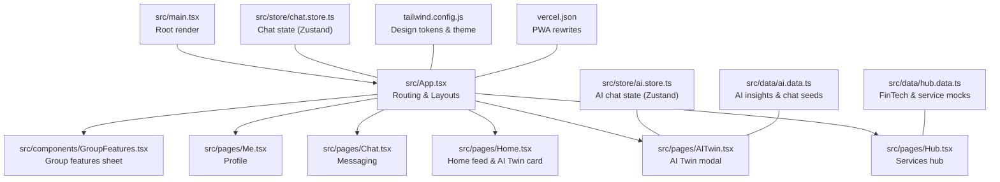
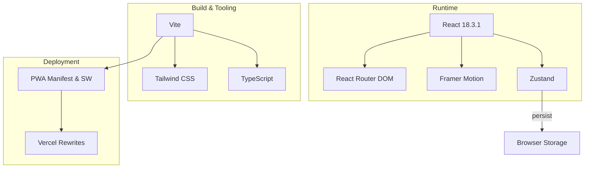
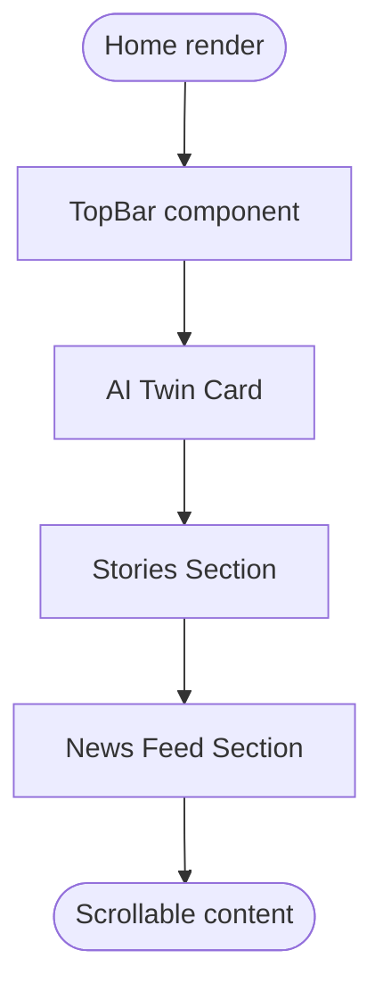
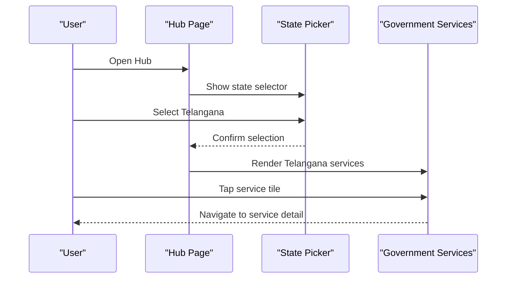
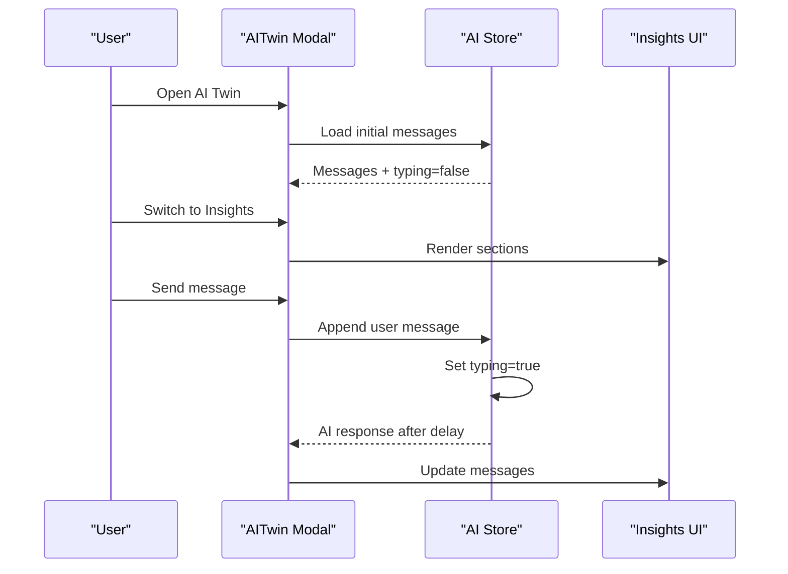
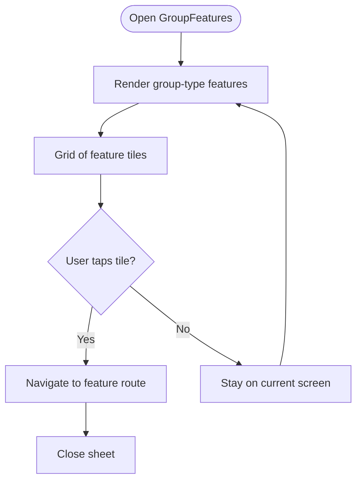
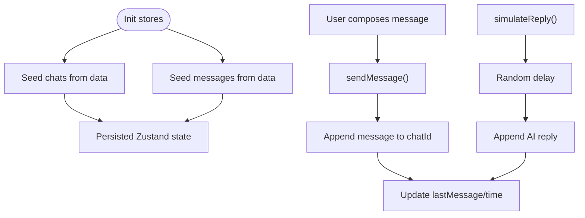
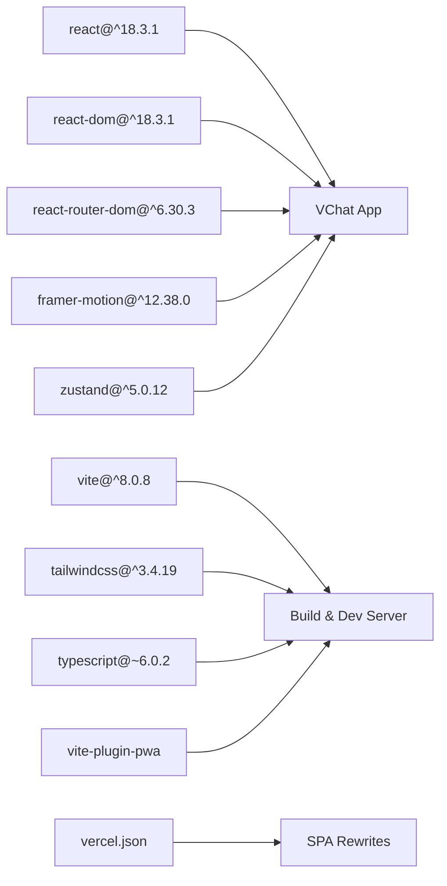

# Project Overview

<cite>
**Referenced Files in This Document**
- [README.md](file://README.md)
- [package.json](file://package.json)
- [src/App.tsx](file://src/App.tsx)
- [src/main.tsx](file://src/main.tsx)
- [src/pages/Home.tsx](file://src/pages/Home.tsx)
- [src/pages/Hub.tsx](file://src/pages/Hub.tsx)
- [src/pages/AITwin.tsx](file://src/pages/AITwin.tsx)
- [src/components/GroupFeatures.tsx](file://src/components/GroupFeatures.tsx)
- [src/store/chat.store.ts](file://src/store/chat.store.ts)
- [src/store/ai.store.ts](file://src/store/ai.store.ts)
- [src/data/ai.data.ts](file://src/data/ai.data.ts)
- [src/data/hub.data.ts](file://src/data/hub.data.ts)
- [tailwind.config.js](file://tailwind.config.js)
- [vercel.json](file://vercel.json)
</cite>

## Table of Contents
1. [Introduction](#introduction)
2. [Project Structure](#project-structure)
3. [Core Components](#core-components)
4. [Architecture Overview](#architecture-overview)
5. [Detailed Component Analysis](#detailed-component-analysis)
6. [Dependency Analysis](#dependency-analysis)
7. [Performance Considerations](#performance-considerations)
8. [Troubleshooting Guide](#troubleshooting-guide)
9. [Conclusion](#conclusion)

## Introduction
VChat is a mobile-first social communication platform designed as a progressive web application (PWA). It unifies messaging, digital services, AI-powered personal assistance, and group collaboration into a cohesive ecosystem. The platform targets individual users, families, and communities seeking seamless connectivity, curated information, and practical digital services—particularly within a Telangana-centric context for government services.

Key value propositions:
- Unified digital life: central hub for communications, services, and personal AI assistant
- Government service integration: Telangana-focused services with a state selector for broader reach
- Financial transactions: built-in payment features for sending, receiving, and transaction history
- Social networking: curated feeds, stories, and notifications
- AI twin capabilities: intelligent insights, scheduling, reminders, translation, and contextual suggestions

Target audience:
- Individual users seeking a smart inbox and curated content
- Families coordinating calendars, finances, and emergencies
- Communities managing society tasks, voting, and local news
- Professionals handling work tasks, approvals, and project tracking

Positioning:
VChat distinguishes itself by combining a mobile-first PWA experience with a comprehensive service hub, AI-driven insights, and robust group collaboration tools tailored for regional and community needs.

## Project Structure
The project follows a React 18 application organized around feature-based pages, shared components, centralized stores, and typed data modules. Routing is handled client-side with lazy-loaded routes for performance. Styling leverages Tailwind CSS with a design-token-based theme.

**Diagram sources**
- [src/main.tsx:1-11](file://src/main.tsx#L1-L11)
- [src/App.tsx:1-156](file://src/App.tsx#L1-L156)
- [src/pages/Home.tsx:1-272](file://src/pages/Home.tsx#L1-L272)
- [src/pages/Hub.tsx:1-293](file://src/pages/Hub.tsx#L1-L293)
- [src/pages/AITwin.tsx:1-135](file://src/pages/AITwin.tsx#L1-L135)
- [src/components/GroupFeatures.tsx:1-154](file://src/components/GroupFeatures.tsx#L1-L154)
- [src/store/chat.store.ts:1-349](file://src/store/chat.store.ts#L1-L349)
- [src/store/ai.store.ts:1-162](file://src/store/ai.store.ts#L1-L162)
- [src/data/ai.data.ts:1-102](file://src/data/ai.data.ts#L1-L102)
- [src/data/hub.data.ts:1-247](file://src/data/hub.data.ts#L1-L247)
- [tailwind.config.js:1-50](file://tailwind.config.js#L1-L50)
- [vercel.json:1-8](file://vercel.json#L1-L8)

**Section sources**
- [src/main.tsx:1-11](file://src/main.tsx#L1-L11)
- [src/App.tsx:1-156](file://src/App.tsx#L1-L156)
- [tailwind.config.js:1-50](file://tailwind.config.js#L1-L50)
- [vercel.json:1-8](file://vercel.json#L1-L8)

## Core Components
- Routing and navigation: lazy-loaded routes for Home, Hub, Chat, AITwin, Profile, and immersive views
- Layouts: MainLayout and ImmersiveLayout wrap page content and handle phone-frame presentation
- State management: Zustand stores for chat and AI chat with persistence
- UI primitives: Toast container, bottom navigation, skeleton loaders, status bar, phone frame
- Data modules: AI insights, chat seeds, and hub mocks for FinTech and services

Key capabilities:
- Messaging: chat list, message composition, read receipts, simulated replies
- AI Twin: insights dashboard and chat interface with typed responses
- Services Hub: government services (Telangana-centric), FinTech, jobs, hackathons, health, agriculture
- Group collaboration: group features sheet with category-specific tools for family, work, education, society, and colony

**Section sources**
- [src/App.tsx:12-50](file://src/App.tsx#L12-L50)
- [src/store/chat.store.ts:171-330](file://src/store/chat.store.ts#L171-L330)
- [src/store/ai.store.ts:113-161](file://src/store/ai.store.ts#L113-L161)
- [src/pages/Home.tsx:58-111](file://src/pages/Home.tsx#L58-L111)
- [src/pages/Hub.tsx:77-244](file://src/pages/Hub.tsx#L77-L244)
- [src/pages/AITwin.tsx:8-135](file://src/pages/AITwin.tsx#L8-L135)
- [src/components/GroupFeatures.tsx:14-154](file://src/components/GroupFeatures.tsx#L14-L154)

## Architecture Overview
VChat is a single-page application bootstrapped with Vite and React 18.3.1. It uses:
- Routing: React Router DOM for client-side navigation
- Animations: Framer Motion for page transitions and interactive elements
- State: Zustand for lightweight, typed stores
- Styling: Tailwind CSS with CSS variables for theme tokens
- Build: Vite with PWA plugin and Vercel rewrites for SPA routing

**Diagram sources**
- [package.json:12-36](file://package.json#L12-L36)
- [tailwind.config.js:1-50](file://tailwind.config.js#L1-L50)
- [vercel.json:1-8](file://vercel.json#L1-L8)

**Section sources**
- [package.json:12-36](file://package.json#L12-L36)
- [tailwind.config.js:1-50](file://tailwind.config.js#L1-L50)
- [vercel.json:1-8](file://vercel.json#L1-L8)

## Detailed Component Analysis

### Home Feed and AI Twin Card
The Home page aggregates personalized content with an AI Twin card, stories carousel, and a curated news feed. It demonstrates:
- Sticky top bar with user profile and notifications
- AI Twin card with live indicator and actionable insights
- Stories tabs and list with animated entries
- News feed with category pills and AI-curated labels

**Diagram sources**
- [src/pages/Home.tsx:10-272](file://src/pages/Home.tsx#L10-L272)

**Section sources**
- [src/pages/Home.tsx:10-272](file://src/pages/Home.tsx#L10-L272)

### Services Hub and Telangana Integration
The Hub consolidates services into categories:
- Government Services: Telangana-centric with a state picker for broader coverage
- Daily Services: Food, Shop, Rides, Travel
- Professional: Jobs, Hackathons, Events, Network
- Tools: PDF, Images, Office, Games
- Health & Agriculture: Health Vault and farmer-focused services

**Diagram sources**
- [src/pages/Hub.tsx:77-293](file://src/pages/Hub.tsx#L77-L293)

**Section sources**
- [src/pages/Hub.tsx:77-293](file://src/pages/Hub.tsx#L77-L293)

### AI Twin Modal and Insights
The AI Twin provides:
- Tabbed interface for Insights and Chat
- Urgent, Today, Suggestions, and Summaries sections
- Persistent chat history with typing indicators and simulated responses

**Diagram sources**
- [src/pages/AITwin.tsx:8-135](file://src/pages/AITwin.tsx#L8-L135)
- [src/store/ai.store.ts:113-161](file://src/store/ai.store.ts#L113-L161)
- [src/data/ai.data.ts:1-102](file://src/data/ai.data.ts#L1-L102)

**Section sources**
- [src/pages/AITwin.tsx:8-135](file://src/pages/AITwin.tsx#L8-L135)
- [src/store/ai.store.ts:113-161](file://src/store/ai.store.ts#L113-L161)
- [src/data/ai.data.ts:1-102](file://src/data/ai.data.ts#L1-L102)

### Group Collaboration Features
The GroupFeatures component presents a bottom sheet of group tools categorized by group type (family, work, education, society, colony). It supports:
- Dynamic feature sets per group type
- Icon-rich tiles with titles and descriptions
- Alert-style tiles for emergency features
- Navigation to dedicated group features pages

**Diagram sources**
- [src/components/GroupFeatures.tsx:14-154](file://src/components/GroupFeatures.tsx#L14-L154)

**Section sources**
- [src/components/GroupFeatures.tsx:14-154](file://src/components/GroupFeatures.tsx#L14-L154)

### Messaging and Chat State Management
The chat store manages:
- Chats: context groups, direct messages, and spaces
- Messages: typed arrays keyed by chatId
- Filters: All, Unread, Groups, Spaces, Archived
- Actions: send message, mark as read, create chat, simulate reply

**Diagram sources**
- [src/store/chat.store.ts:102-169](file://src/store/chat.store.ts#L102-L169)
- [src/store/chat.store.ts:171-330](file://src/store/chat.store.ts#L171-L330)

**Section sources**
- [src/store/chat.store.ts:1-349](file://src/store/chat.store.ts#L1-L349)
- [src/data/chat.data.ts:1-134](file://src/data/chat.data.ts#L1-L134)

## Dependency Analysis
External runtime dependencies include React, React DOM, React Router DOM, Framer Motion, and Zustand. Development and build dependencies include Vite, Tailwind CSS, TypeScript, and ESLint configurations. The PWA plugin and Vercel rewrites support progressive enhancement and SPA routing.

**Diagram sources**
- [package.json:12-36](file://package.json#L12-L36)
- [vercel.json:1-8](file://vercel.json#L1-L8)

**Section sources**
- [package.json:12-36](file://package.json#L12-L36)
- [vercel.json:1-8](file://vercel.json#L1-L8)

## Performance Considerations
- Lazy loading: Pages are dynamically imported to reduce initial bundle size
- Animations: Framer Motion is used selectively for smooth UX without heavy overhead
- State persistence: Zustand middleware persists only necessary slices to localStorage
- Styling: Tailwind utilities minimize CSS overhead while enabling rapid iteration
- PWA: Service worker and manifest enable offline-ready experiences and fast reloads

## Troubleshooting Guide
Common areas to inspect:
- Routing issues: verify route definitions and lazy imports in the routing tree
- State synchronization: confirm store actions update both messages and chats consistently
- Theme rendering: ensure CSS variables are present and Tailwind scans the correct paths
- PWA behavior: validate Vercel rewrites and service worker registration

**Section sources**
- [src/App.tsx:66-133](file://src/App.tsx#L66-L133)
- [src/store/chat.store.ts:179-200](file://src/store/chat.store.ts#L179-L200)
- [tailwind.config.js:3-6](file://tailwind.config.js#L3-L6)
- [vercel.json:2-7](file://vercel.json#L2-L7)

## Conclusion
VChat delivers a modern, mobile-first PWA that merges messaging, curated services, AI assistance, and group collaboration. Its Telangana-focused government services, integrated FinTech features, and AI Twin capabilities position it as a comprehensive digital living room for individuals, families, and communities. The technology stack emphasizes developer productivity, maintainability, and user experience, supported by a clean architecture and persistent state management.