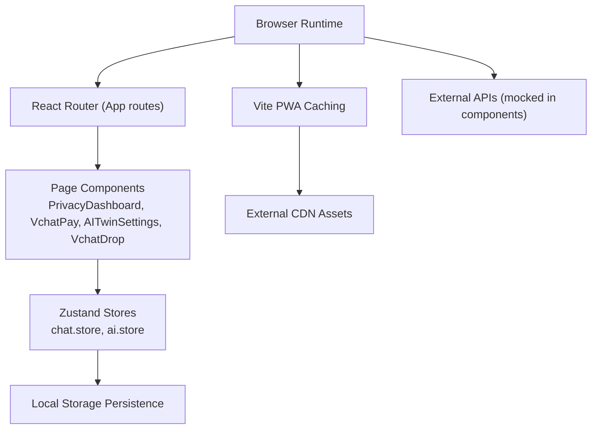
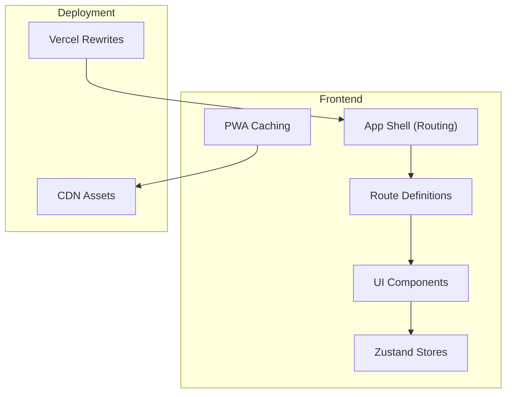
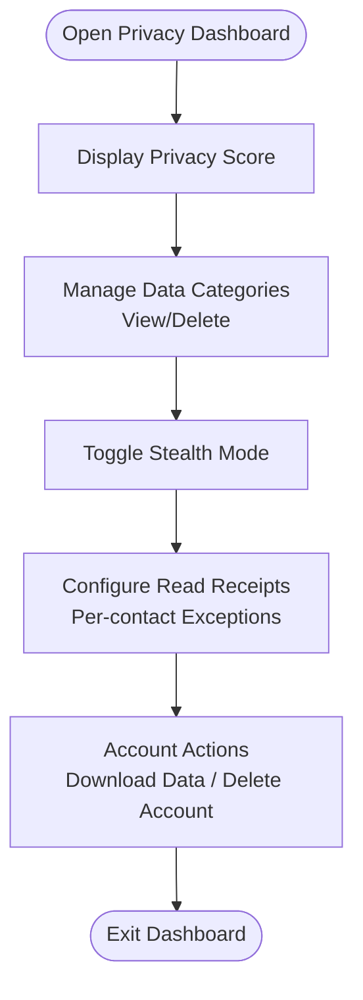
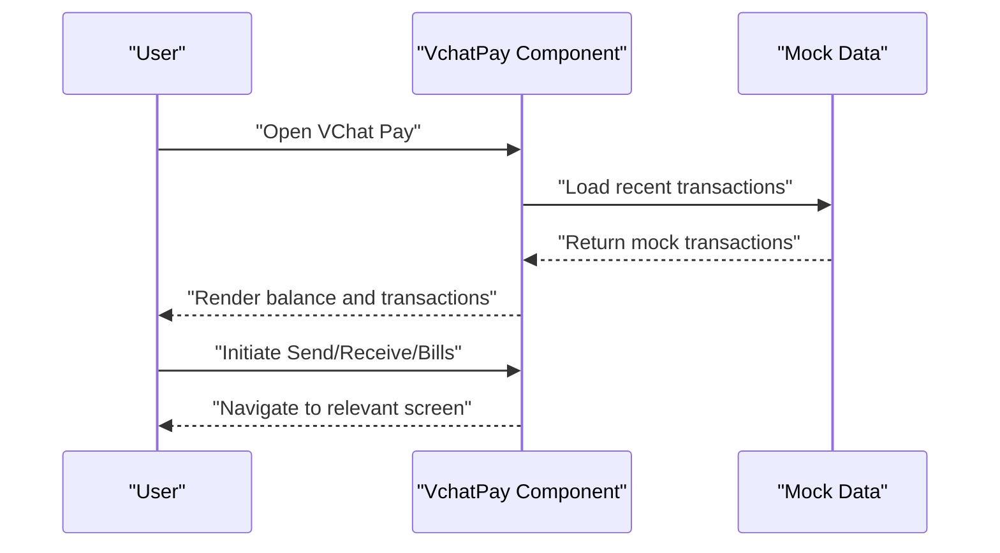
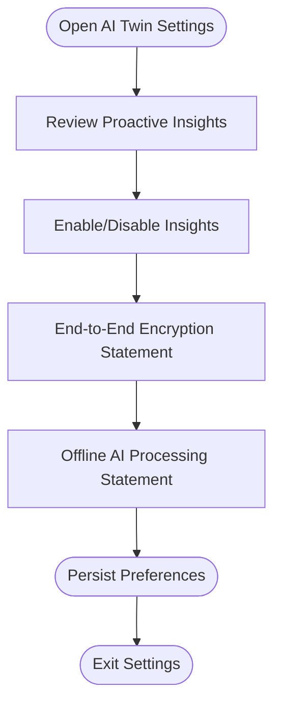
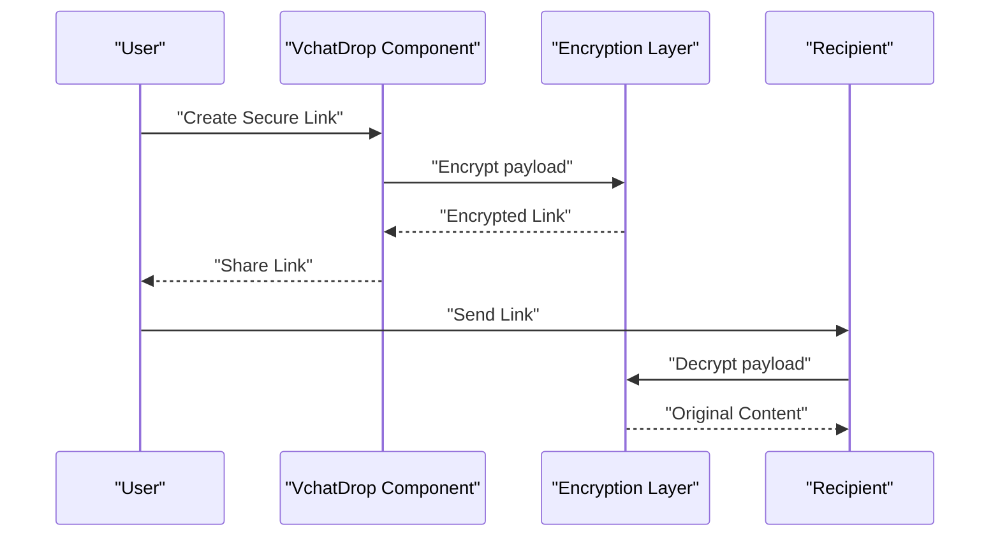
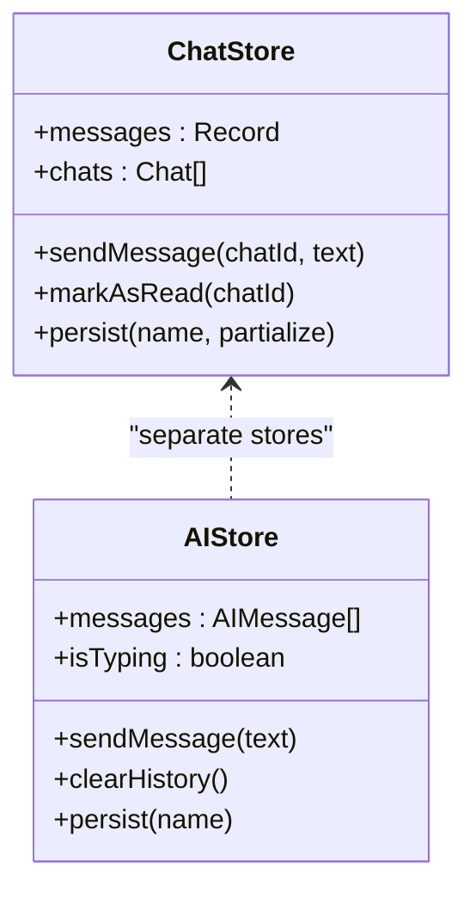
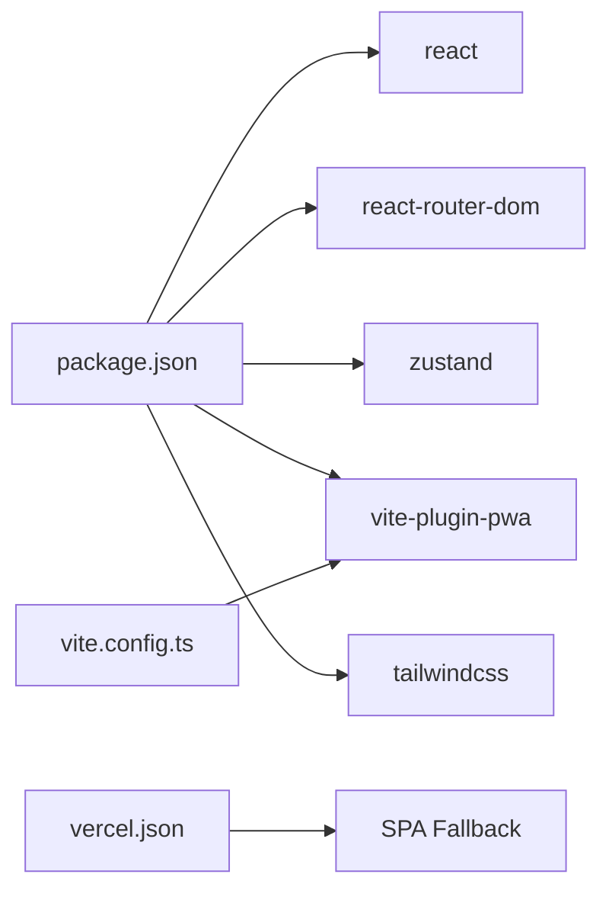

# Security Considerations

<cite>
**Referenced Files in This Document**
- [README.md](file://README.md)
- [package.json](file://package.json)
- [vite.config.ts](file://vite.config.ts)
- [vercel.json](file://vercel.json)
- [eslint.config.js](file://eslint.config.js)
- [src/App.tsx](file://src/App.tsx)
- [src/pages/profile/PrivacyDashboard.tsx](file://src/pages/profile/PrivacyDashboard.tsx)
- [src/pages/hub/VchatPay.tsx](file://src/pages/hub/VchatPay.tsx)
- [src/data/hub.data.ts](file://src/data/hub.data.ts)
- [src/store/chat.store.ts](file://src/store/chat.store.ts)
- [src/store/ai.store.ts](file://src/store/ai.store.ts)
- [src/pages/profile/AITwinSettings.tsx](file://src/pages/profile/AITwinSettings.tsx)
- [src/pages/profile/VchatDrop.tsx](file://src/pages/profile/VchatDrop.tsx)
</cite>

## Table of Contents
1. [Introduction](#introduction)
2. [Project Structure](#project-structure)
3. [Core Components](#core-components)
4. [Architecture Overview](#architecture-overview)
5. [Detailed Component Analysis](#detailed-component-analysis)
6. [Dependency Analysis](#dependency-analysis)
7. [Performance Considerations](#performance-considerations)
8. [Troubleshooting Guide](#troubleshooting-guide)
9. [Conclusion](#conclusion)
10. [Appendices](#appendices)

## Introduction
This document provides a comprehensive overview of VChat’s security architecture and data protection measures. It focuses on the privacy dashboard implementation, user consent and preference controls, financial transaction security (VChat Pay), encryption and fraud prevention strategies, secure communication with external systems, authentication and authorization patterns, session and access control mechanisms, AI interaction safeguards, data retention and lifecycle management, XSS and CSRF protections, input validation strategies, state management and persistence security, monitoring and incident response, and secure third-party integrations. Where applicable, this document references concrete source files and highlights areas for improvement or explicit security controls present in the codebase.

## Project Structure
VChat is a React + TypeScript + Vite application with routing managed by React Router and state persisted via Zustand with optional local storage persistence. The frontend is configured for Progressive Web App (PWA) caching and deployment via Vercel rewrites. Security-related concerns span UI components, routing, state stores, and build/deployment configuration.

**Diagram sources**
- [src/App.tsx:66-133](file://src/App.tsx#L66-L133)
- [src/pages/profile/PrivacyDashboard.tsx:1-115](file://src/pages/profile/PrivacyDashboard.tsx#L1-L115)
- [src/pages/hub/VchatPay.tsx:1-119](file://src/pages/hub/VchatPay.tsx#L1-L119)
- [src/store/chat.store.ts:171-330](file://src/store/chat.store.ts#L171-L330)
- [src/store/ai.store.ts:113-161](file://src/store/ai.store.ts#L113-L161)
- [vite.config.ts:9-54](file://vite.config.ts#L9-L54)

**Section sources**
- [src/App.tsx:12-50](file://src/App.tsx#L12-L50)
- [vite.config.ts:1-57](file://vite.config.ts#L1-L57)
- [vercel.json:1-8](file://vercel.json#L1-L8)

## Core Components
- Routing and navigation are centralized in the application shell, enabling deep-linking and immersive layouts. This impacts security by ensuring consistent layout and potential injection points for navigation-based attacks.
- Privacy dashboard exposes user privacy controls, including toggles for stealth mode and read receipts, and actions for data download and account deletion.
- VChat Pay presents financial features including balance display, transaction history, and UPI QR sharing. These screens handle sensitive financial data and require robust input validation and secure rendering.
- AI Twin settings emphasize end-to-end encryption and offline processing, which informs trust model and data handling expectations.
- Zustand stores manage chat and AI message histories locally, with persistence enabled. This introduces state security concerns around client-side data exposure and integrity.

**Section sources**
- [src/App.tsx:66-133](file://src/App.tsx#L66-L133)
- [src/pages/profile/PrivacyDashboard.tsx:27-110](file://src/pages/profile/PrivacyDashboard.tsx#L27-L110)
- [src/pages/hub/VchatPay.tsx:23-113](file://src/pages/hub/VchatPay.tsx#L23-L113)
- [src/pages/profile/AITwinSettings.tsx:101-127](file://src/pages/profile/AITwinSettings.tsx#L101-L127)
- [src/store/chat.store.ts:171-330](file://src/store/chat.store.ts#L171-L330)
- [src/store/ai.store.ts:113-161](file://src/store/ai.store.ts#L113-L161)

## Architecture Overview
The frontend architecture is client-centric with:
- Client-side routing and page transitions
- Local state management with persistence
- PWA caching for performance and offline resilience
- Deployment via Vercel with SPA fallback rewrites

Security implications:
- XSS risk surface increases with dynamic content rendering and user-controlled inputs.
- CSRF risk is mitigated by SPA architecture but requires backend CSRF protection if APIs are introduced.
- Data-at-rest risks arise from persisted state; data-in-transit relies on HTTPS/TLS enforced by deployment and CDN.

**Diagram sources**
- [src/App.tsx:66-133](file://src/App.tsx#L66-L133)
- [vite.config.ts:9-54](file://vite.config.ts#L9-L54)
- [vercel.json:1-8](file://vercel.json#L1-L8)

## Detailed Component Analysis

### Privacy Dashboard
The Privacy Dashboard provides:
- Privacy score visualization
- Data categories with counts and actions (view details, delete)
- Stealth mode toggle
- Read receipts controls with per-contact exceptions
- Account actions: download data and delete account

Security considerations:
- Input validation: Toggles are UI-only; ensure server-side validation if backend endpoints are introduced.
- Access control: Enforce user authentication before rendering sensitive controls.
- Data minimization: Respect user selections to limit stored data.
- Consent management: Provide granular opt-outs aligned with privacy preferences.

**Diagram sources**
- [src/pages/profile/PrivacyDashboard.tsx:27-110](file://src/pages/profile/PrivacyDashboard.tsx#L27-L110)

**Section sources**
- [src/pages/profile/PrivacyDashboard.tsx:27-110](file://src/pages/profile/PrivacyDashboard.tsx#L27-L110)

### VChat Pay
VChat Pay displays:
- Available balance and UPI identifier
- Quick action buttons (Send, Receive, Recharge, Bills)
- UPI QR generation and sharing affordances
- Recent transaction list with mock data

Security considerations:
- Financial data exposure: Ensure sensitive balances and transaction details are not logged or cached insecurely.
- QR sharing: Sanitize and validate QR content; avoid embedding secrets in client-rendered UI.
- Transaction integrity: Validate amounts and identifiers before initiating transfers.
- Encryption: Treat payment credentials and identifiers as sensitive; encrypt at rest and transmit securely.

**Diagram sources**
- [src/pages/hub/VchatPay.tsx:23-113](file://src/pages/hub/VchatPay.tsx#L23-L113)
- [src/data/hub.data.ts:2-53](file://src/data/hub.data.ts#L2-L53)

**Section sources**
- [src/pages/hub/VchatPay.tsx:23-113](file://src/pages/hub/VchatPay.tsx#L23-L113)
- [src/data/hub.data.ts:2-53](file://src/data/hub.data.ts#L2-L53)

### AI Twin Settings
The AI Twin settings page emphasizes:
- Proactive insights toggles
- End-to-end encryption and offline processing statements

Security implications:
- Trust boundary: If processing is truly offline and encrypted, reduce data exposure.
- Transparency: Clearly communicate what data is processed and retained.
- Consent: Allow users to disable features that process personal data.

**Diagram sources**
- [src/pages/profile/AITwinSettings.tsx:101-127](file://src/pages/profile/AITwinSettings.tsx#L101-L127)

**Section sources**
- [src/pages/profile/AITwinSettings.tsx:101-127](file://src/pages/profile/AITwinSettings.tsx#L101-L127)

### VchatDrop Secure Sharing
The Remote Share card communicates:
- Secure encrypted link sharing
- Encrypted transmission to recipients

Security implications:
- Link generation: Use cryptographically strong identifiers and short-lived tokens if backend is involved.
- Transport security: Enforce HTTPS/TLS for all endpoints.
- Integrity: Sign links or embed integrity checks to prevent tampering.

**Diagram sources**
- [src/pages/profile/VchatDrop.tsx:78-91](file://src/pages/profile/VchatDrop.tsx#L78-L91)

**Section sources**
- [src/pages/profile/VchatDrop.tsx:78-91](file://src/pages/profile/VchatDrop.tsx#L78-L91)

### Authentication and Authorization Patterns
Current codebase does not include explicit authentication or authorization logic. Recommendations:
- Enforce user authentication before rendering protected routes and sensitive components.
- Implement role-based access control (RBAC) if multi-tenant or admin features are introduced.
- Use secure cookies/session storage with appropriate flags (HttpOnly, SameSite, Secure) if backend sessions are used.
- Implement token refresh and logout mechanisms.

[No sources needed since this section provides general guidance]

### Session Management and Access Control
- No session management code is present in the frontend. If backend APIs are integrated, ensure:
  - Token storage in secure contexts (avoid localStorage for bearer tokens).
  - Automatic token refresh and silent re-authentication.
  - Strict origin policies and CORS enforcement on the backend.

[No sources needed since this section provides general guidance]

### Data Protection Strategies for Government Service Integrations
- Personal information handling:
  - Minimize collection; obtain explicit consent.
  - Encrypt sensitive fields at rest and in transit.
  - Implement data retention policies and automated deletion.
- Secure communication with external APIs:
  - Enforce TLS 1.2+.
  - Validate certificates and use pinned domains where applicable.
  - Sanitize and validate all API responses.

[No sources needed since this section provides general guidance]

### AI Interactions, Data Retention, and Lifecycle Management
- AI memory retention:
  - Provide granular controls to delete AI memories and disable future storage.
  - Encrypt stored AI conversations and metadata.
- Data lifecycle:
  - Define retention windows for chat, AI, and transaction data.
  - Implement automated purging and user-initiated deletion.

[No sources needed since this section provides general guidance]

### XSS Prevention, CSRF Protection, and Input Validation
- XSS prevention:
  - Avoid innerHTML; sanitize any user-generated HTML.
  - Use Content-Security-Policy headers; restrict eval and inline scripts.
- CSRF protection:
  - Implement anti-CSRF tokens for any form submissions or state-changing requests.
  - Enforce SameSite cookies and proper CORS policies.
- Input validation:
  - Validate and sanitize all user inputs on boundaries (frontend and backend).
  - Use allowlists for allowed characters and lengths.

[No sources needed since this section provides general guidance]

### State Management and Data Persistence Security
- Zustand stores with persistence:
  - Encrypt sensitive fields before persisting.
  - Limit persisted state to non-sensitive UI preferences.
  - Use secure storage APIs if available; otherwise, apply encryption at rest.
- Chat and AI stores:
  - Avoid storing sensitive financial or health data in plaintext.
  - Implement selective partialization to exclude sensitive keys.

**Diagram sources**
- [src/store/chat.store.ts:171-330](file://src/store/chat.store.ts#L171-L330)
- [src/store/ai.store.ts:113-161](file://src/store/ai.store.ts#L113-L161)

**Section sources**
- [src/store/chat.store.ts:171-330](file://src/store/chat.store.ts#L171-L330)
- [src/store/ai.store.ts:113-161](file://src/store/ai.store.ts#L113-L161)

### Security Monitoring, Vulnerability Assessment, and Incident Response
- Monitoring:
  - Implement client-side error reporting and crash analytics with privacy controls.
  - Monitor for unexpected data access patterns in stores.
- Vulnerability assessment:
  - Regular dependency audits and SCA.
  - Static analysis and secret scanning in CI.
- Incident response:
  - Define escalation paths for data exposure or misuse.
  - Provide user controls to revoke access and delete data promptly.

[No sources needed since this section provides general guidance]

### Secure Third-Party Integrations, API Security, and Encryption
- Third-party integrations:
  - Use OAuth or SSO where possible; avoid storing third-party credentials.
  - Scope permissions and implement granular consent.
- API security:
  - Enforce rate limiting, input sanitization, and output encoding.
  - Use signed requests and HMAC verification if applicable.
- Encryption:
  - At rest: AES-256 for sensitive fields.
  - In transit: TLS 1.3; enforce HSTS.

[No sources needed since this section provides general guidance]

## Dependency Analysis
The application depends on React, React Router, Framer Motion, Lucide icons, and Zustand for state management. Build-time dependencies include Vite, Tailwind, and PWA plugin. These influence security posture through:
- Dependency vulnerabilities requiring regular updates.
- Build-time caching affecting asset integrity.
- Router configuration impacting deep-link security.

**Diagram sources**
- [package.json:12-38](file://package.json#L12-L38)
- [vite.config.ts:1-57](file://vite.config.ts#L1-L57)
- [vercel.json:1-8](file://vercel.json#L1-L8)

**Section sources**
- [package.json:12-38](file://package.json#L12-L38)
- [vite.config.ts:1-57](file://vite.config.ts#L1-L57)
- [vercel.json:1-8](file://vercel.json#L1-L8)

## Performance Considerations
- PWA caching improves performance but can cache sensitive data; configure cache policies carefully.
- Avoid heavy computations in render paths; offload to workers if needed.
- Minimize state size to reduce persistence overhead and improve responsiveness.

[No sources needed since this section provides general guidance]

## Troubleshooting Guide
- Privacy dashboard controls not applying:
  - Verify that toggles update state and persist appropriately.
  - Check for console errors during navigation.
- VChat Pay transactions not visible:
  - Confirm mock data loading and rendering.
  - Validate navigation to transaction screens.
- AI Twin settings not saving:
  - Ensure persistence middleware is initialized and keys are whitelisted.
- PWA caching issues:
  - Clear browser cache and unregister service worker if stale assets are served.

**Section sources**
- [src/pages/profile/PrivacyDashboard.tsx:27-110](file://src/pages/profile/PrivacyDashboard.tsx#L27-L110)
- [src/pages/hub/VchatPay.tsx:23-113](file://src/pages/hub/VchatPay.tsx#L23-L113)
- [src/store/ai.store.ts:113-161](file://src/store/ai.store.ts#L113-L161)
- [vite.config.ts:9-54](file://vite.config.ts#L9-L54)

## Conclusion
VChat’s frontend establishes a solid foundation for a secure product by emphasizing UI-driven privacy controls, local state persistence, and PWA capabilities. However, comprehensive security requires backend enforcement of authentication, authorization, and encryption, along with robust input validation, CSP, CSRF protection, and secure third-party integrations. The privacy dashboard, VChat Pay, AI settings, and VchatDrop components provide concrete surfaces for implementing and validating these controls.

## Appendices
- Recommended security headers and CSP directives for production deployment.
- Checklist for integrating backend authentication and authorization.
- Guidelines for secure API design and transport encryption.

[No sources needed since this section provides general guidance]